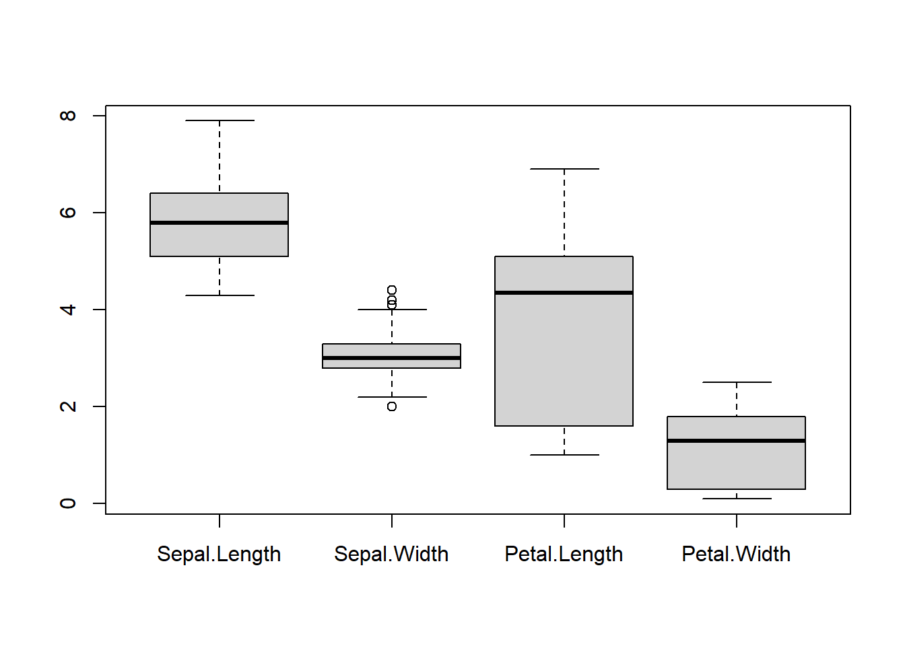
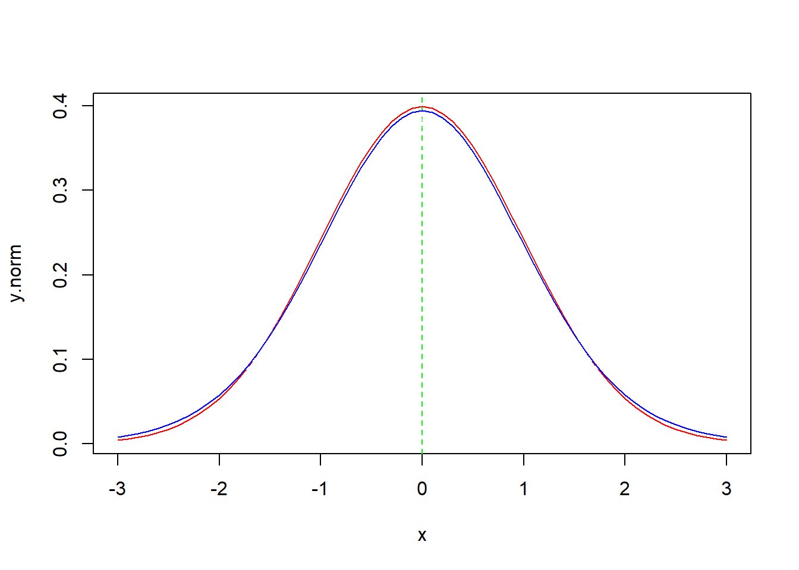
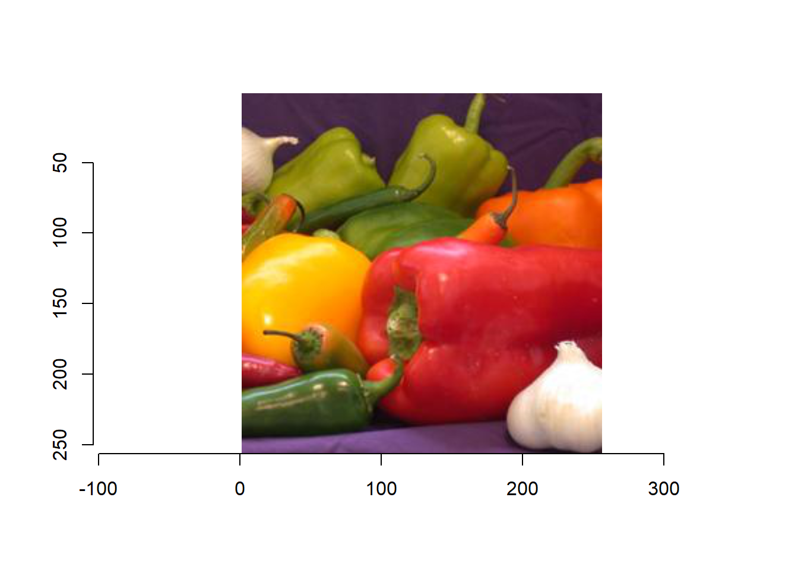
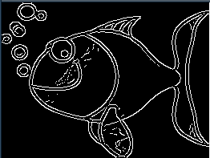
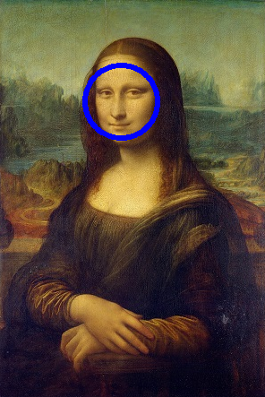
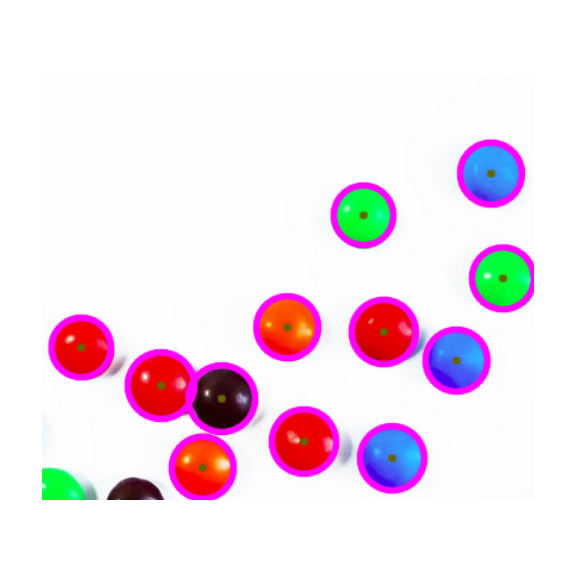

\mainmatter

# 简介 {#intro}

## R简介

R是统计领域广泛使用的诞生于1980年左右的S语言的一个分支。而S语言是由AT&T贝尔实验室开发的一种用来进行数据探索、统计分析和作图的解释型语言。最初S语言的实现版本主要是S-PLUS。S-PLUS是一个商业软件，它基于S语言，并由MathSoft公司的统计科学部进一步完善。后来新西兰奥克兰大学的RobertGentleman和RossIhaka及其他志愿人员开发了一个R系统。由“R开发核心团队”负责开发。R可以看作贝尔实验室开发的S语言的一种实现。

<!-- 在IEEE Spectrum于2024年10月21日发布的2024年top编程语言排名中，R语言排名第20位： -->

<!-- ```{r, echo=FALSE, out.width='50%', out.height='50%', fig.align='center'} -->
<!--  -->
<!-- ``` -->


R的生态圈相当活跃，单就CRAN存放的R的工具包数量，目前就已经达到21598个，其中在2022年至今的三年里发布/更新的数据包分别有2899个、4456个和7051个。

R的功能包括：数据存储和处理系统；数组运算工具（其向量、矩阵运算方面功能非常强大）；完整连贯的统计分析工具；优秀的统计制图功能；简便而强大的编程语言：可操纵数据的输入和输出，可实现分支、循环程序设计，支持用户实现自定义功能。比如，在统计制图功能方面，可以通过一句代码绘制鸢尾花数据集的萼片长度、萼片宽度、花瓣长度和花瓣宽度的箱线图：


``` r
boxplot(iris[,-5])
```



也可以使用如下代码灵活绘制函数曲线图：


``` r
#生成自变量向量x
x = seq(-5,5,by=0.1)
#依据x计算exp(sin(x))，保存在y1中
y1 = exp(sin(x))
#依据x计2^(sin(x))，保存在y2中
y2 = 2^(sin(x))
#依据x,y1绘制相应的曲线，颜色为红色
plot(x,y1,type='l',col="red", 
     main="两个函数曲线对照图",xlab="",ylab="")
#依据x,y2绘制相应的曲线，颜色为蓝色
lines(x,y2,col="blue")

#在y=exp(sin(x))的曲线上标注横坐标为4对应的点
points(-4,exp(sin(-4)),pch=16,col="red")
#在标注点附近添加函数关系的说明文本
text(-4,exp(sin(-4)),expression(y==e^{sin(x)}),adj=c(-0.2,0.5))

#在y=2^(sin(x))的曲线上标注横坐标为2对应的点
points(2,2^sin(2),pch=16,col="blue")
#在标注点附近添加函数关系的说明文本
text(2,2^(sin(2)),expression(y==2^{sin(x)}),adj=c(-0.2,0.5))
```


又比如，可以通过如下代码演示统计学的一个结论：当T分布的自由度趋于无穷大时，其分布逼近于标准正态分布。


``` r
#生成自变量向量x
x = seq(-3,3,by=0.1)
#依据自变量x计算标准正态分布的概率密度向量y.norm
y.norm = dnorm(x)

#依据x,y.norm绘制标准正态分布的概率密度曲线（颜色为红色）
plot(x,y.norm,type="l",col="red")
#绘制横坐标为0竖直虚线（颜色为绿色）
abline(v=0,lty="dashed",col="green")

#动态绘制自由度从2变化到20的T分布的概率密度曲线，
#会发现随着自由度的增加，T分布的概率密度曲线逐渐
#与标准正态分布曲线重合
for(degree in 2:20){
  y.t = dt(x,degree)
  lines(x,y.t,lty="dashed",col="blue")
  Sys.sleep(1)
  lines(x,y.t,lty="dashed",col="white")
}
lines(x,y.t,col="blue")
```



再比如在矩阵计算方面，可以通过qr分解方式求如下矩阵的秩：

$$
\left[
\begin{matrix}
2 & -1 & -1 & 1 & 2 \\
1 & 1 & -2 & 1 & 4 \\
4 & -6 & 2 & -2 & 4 \\
3 & 6 & -9 & 7 & 9
\end{matrix}
\right]
$$


``` r
#生成指定矩阵
m <- matrix(c(2,-1,-1,1,2,1,1,-2,1,4,4,-6,2,-2,4,3,6,-9,7,9),nr=4,byrow = T)
#从qr分级操作中读取rank（即获得矩阵的秩）
qr(m)$rank
```

```
## [1] 3
```

还可以快速求解如下方程组：

$$
\begin{cases}
2x_1+x_2-5x_3+x_4=8\\
x_1-3x_2-6x_4=9\\
2x_2-x_3+2x_4=-5\\
x_1+4x_2-7x_3+6x_4=0
\end{cases}
$$

```
## [1] 27
```

```
##             [,1]       [,2]       [,3]       [,4]
## [1,]  1.33333333 -0.6666667  0.3333333 -1.0000000
## [2,] -0.07407407  0.2592593  1.1481481 -0.1111111
## [3,]  0.37037037 -0.2962963  0.2592593 -0.4444444
## [4,]  0.25925926 -0.4074074 -0.5185185 -0.1111111
```

```
##      [,1]
## [1,]    3
## [2,]   -4
## [3,]   -1
## [4,]    1
```

```
## [1]  3 -4 -1  1
```


R是一个免费的自由软件，它有UNIX、LINUX、MacOS和WINDOWS版本，都是可以免费下载和使用的。R语言的下载可以通过CRAN的镜像来查找。R的源代码也可自由下载使用，亦有已编译的执行档版本可以下载，可在多种平台下运行，包括UNIX（也包括FreeBSD和Linux）、Windows和MacOS。 


## R中的一些图像工具包

* magick  


``` r
library(magick)
#读取图像文件
frink = image_read("images/frink.png")
#显示读取的内容
print(frink)
```

```
##   format width height colorspace matte filesize density
## 1    PNG   220    445       sRGB  TRUE    73494   72x72
```


``` r
#将图像背景颜色变成hotpink
image_background(frink, "hotpink")
```


``` r
#在图像的左右各自添加20像素的边界，以及在图像的上下各自添加10像素的边界
image_border(frink, "#000000", "20x10")
```


``` r
#截取部分图像
image_crop(frink, "100x150+50")
```


``` r
#旋转图像
image_rotate(frink, 45)
```


* imager  


``` r
library(imager)
#读取图像文件
img = load.image("images/peppers.jpg")
#绘制图像
plot(img)
```



``` r
#将图像灰度化并绘制结果
img %>% grayscale() %>% plot()
```


* imagerExtra  


``` r
library(imagerExtra)

#对boats图像灰度化，结果保存在boats_g中
boats_g <- grayscale(boats)
#在boats_g中添加噪声，结果保存在boats_noisy中
boats_noisy <- imnoise(dim = dim(boats_g), sd = 0.05) + boats_g 

#绘制添加噪声前后的图像
op = par(mfrow=c(1,2))
plot(boats_g)
plot(boats_noisy)
```


* OpenImageR  


``` r
library(OpenImageR)

#读取图像文件
img = readImage("images/sunflower.png")
#查看图像维度信息
dim(img)
```

```
## [1] 96 96  3
```

``` r
#显示图像
imageShow(img)

#将图像灰度化并绘制结果
r2g = rgb_2gray(img)
imageShow(r2g)
```


* imagefluency  


``` r
library(imagefluency)

#加载图像文件
berries <- img_read("images/berries.jpg")
#显示图像
grid::grid.raster(berries)
```


``` r
#获取图像对比度
img_contrast(berries)
```

```
## [1] 0.2882635
```


* colorfindr  


``` r
library(imagefluency)
library(colorfindr)

#确定图像文件
pic = "images/tiger.png"

#获取图像使用最多的三种颜色
get_colors(pic, top_n = 3)
```

```
## # A tibble: 3 × 3
##   col_hex col_freq col_share
##   <chr>      <int>     <dbl>
## 1 #000000    20098     0.256
## 2 #FFFFFF    19699     0.251
## 3 #CC7226    12051     0.153
```


* opencv


``` r
library(opencv)
```


``` r
#读取图像文件
fish = ocv_read('images/HappyFish.jpg')
#边缘检测
ocv_edges(fish)
```

```
## <pointer: 0x00000167ba5de910>
## attr(,"class")
## [1] "opencv-image"
```




``` r
#读取图像文件
tiger = ocv_read('images/tiger.png')
#特征点检测
ocv_markers(tiger)
```

```
## <pointer: 0x00000167ba5dfb70>
## attr(,"class")
## [1] "opencv-image"
```


``` r
#读取图像文件
mona = ocv_read('images/mona_small.jpg')
#人脸检测
faces = ocv_face(mona)
#人脸位置（圆半径和圆心坐标）
facemask <- ocv_facemask(mona)
attr(facemask, 'faces')
```

```
##   radius   x   y
## 1     40 136 113
```

``` r
#标注人脸
ocv_face(mona)
```

```
## <pointer: 0x00000167ba5e1610>
## attr(,"class")
## [1] "opencv-image"
```




在这些工具中，图形处理的功能较之于OpenCV，都是相对很有限的，即便其中的opencv —— 这是基于OpenCV的一些功能进行封装形成的工具包 —— 到目前为止也仅仅开放了不到30个函数功能。


## OpenCV简介

OpenCV(开源的计算机视觉库)是基于BSD协议，因此它可免费用于学术和商业用途。其提供C++、C、Python和Java接口,支持Windows、Linux、Mac OS、iOS和Android。OpenCV致力于高效运算和即时应用开发：因其是用优化的C/C++编写的，可以充分利用多核处理优势；并且还启用了OpenSL,它可以利用底层异构计算平台的硬件加速。OpenCV广泛运用在世界各地，它拥有超过4.7万人的用户社区和超过1400万的下载次数。应用领域包括：

* 人机互动
* 物体识别
* 图像分割
* 人脸识别
* 动作识别
* 运动跟踪
* 机器人
* 运动分析
* 机器视觉
* 结构分析
* 汽车安全驾驶
* 等等

OpenCV包含着数百个计算机视觉算法。它有一个模块化的结构，囊括了几个共享的或静态的库，其中包括：


* Core functionality（核心功能）：一个简洁基本且模块化的数据结构，包含了多维数组（矩阵）和用于其他模块的基本功能。
* Image processing（图像处理）：包括线性和非线性的图像滤波、几何图像转换（缩放、仿射和透视调整）、颜色模式转换、直方图等等。
* Video（视频）：一个视频分析模块，其包含了运动估计、背景消除和目标跟踪算法。
* Calib3d：提供基本的多视图几何算法、平面和立体影像校正、物体定位、立体通信算法和三维重建。
* Features2d：显著特征探测器、描述符和描述符匹配器。
* Objectect：检测对象和预定义的类的实例（例如：脸部、眼睛、杯子、人、车等等）。
* Highgui（图形界面）：提供一个简单易用的UI。
* Video I/O：提供一个简单易用的视频捕获和编码解码界面。
* GPU：来自于不同的OpenCV模块的GPU加速算法。
* 等等

以下是OpenCV教程中检测霍夫圆的例子：

```
#include "opencv2/imgcodecs.hpp"
#include "opencv2/highgui.hpp"
#include "opencv2/imgproc.hpp"
using namespace cv;
using namespace std;
int main(int argc, char** argv)
{
    const char* filename = "smarties.png";
    // Loads an image
    Mat src = imread( samples::findFile( filename ), IMREAD_COLOR );
    
    Mat gray;
    cvtColor(src, gray, COLOR_BGR2GRAY);
    medianBlur(gray, gray, 5);
    vector<Vec3f> circles;
    HoughCircles(gray, circles, HOUGH_GRADIENT, 1,
                 gray.rows/16,  
                 100, 30, 1, 30
    );
    for( size_t i = 0; i < circles.size(); i++ )
    {
        Vec3i c = circles[i];
        Point center = Point(c[0], c[1]);
        // circle center
        circle( src, center, 1, Scalar(0,100,100), 3, LINE_AA);
        // circle outline
        int radius = c[2];
        circle( src, center, radius, Scalar(255,0,255), 3, LINE_AA);
    }
    imshow("detected circles", src);
    waitKey();
    return EXIT_SUCCESS;
}
```

## ROpenCV

若能在R和OpenCV中建立桥梁，将OpenCV的功能尽可能移植到R环境中，且在使用过程中尽可能保留OpenCV的函数风格，这对于R的广大用户而言是令人兴奋的事情。为此，本书作者基于RCpp形成了ROpenCV工具包，可以尽可能地在R中使用OpenCV的各种功能。以下代码体现了利用ROpenCV实现的检测霍夫圆的例子：


``` r
#加载图像工具包
library(ROpenCV)

#读取图像文件
src = cv_imread("images/smarties.png")
# src = cv_imread("images/mona.jpg")
#获取src的基本信息
rcv_matInfo(src)
```

```
## $width
## [1] 413
## 
## $height
## [1] 356
## 
## $channels
## [1] 3
## 
## $depth
## [1] 0
## 
## $type
## [1] 64
```

``` r
#将src灰度化，结果保存在gray中
gray = Mat()
cv_cvtColor(src,gray,COLOR_BGR2GRAY)
#获取gray的基本信息
rcv_matInfo(gray)
```

```
## $width
## [1] 413
## 
## $height
## [1] 356
## 
## $channels
## [1] 1
## 
## $depth
## [1] 0
## 
## $type
## [1] 0
```

``` r
#对gray进行中值滤波，结果仍然保存在gray中
cv_medianBlur(gray,gray,5)

#检测霍夫圆，结果保存在circles
circles = stdVecOfVec3f()
cv_HoughCircles(gray,circles,HOUGH_GRADIENT,1,
                src$rows/16,
                100,30,1,30
               )
circles
```

```
## C++ object <00000167b64f99c0> of class 'stdVectorOfVec3f' <00000167c6bd58b0>
```

``` r
circles$size()
```

```
## [1] 12
```

``` r
dst = src$clone()
#绘制检测到的圆
for(i in 0:(circles$size()-1)){
  cir = circles[[i]]
  #获取圆心坐标
  center = Point(cir[[0]],cir[[1]])
  #标注圆心点
  cv_circle(dst,center,1,Scalar(0,100,100),3,LINE_AA)
  rad = cir[[2]]
  cv_circle(dst,center,rad,Scalar(255,0,255),3,LINE_AA)
}

#显示检测结果
cv_imshow("原图",src)
cv_imshow("圆检测结果",dst)
```





<!-- 在这个例子中，tmp.ref以及circles.ref都是引用类型变量，用来保留OpenCV函数的处理结果，这为的是确保在R中调用OpenCV函数时能够与在C++中调用相应函数保持一样的经验，详见第 \@ref(ROpenCVMechanisim) 章。 -->

<!-- ## ROpenCV的安装和使用 -->

<!-- 大致步骤为： -->

<!-- 1、首先安装R语言，要求是4.0以上版本，然后安装Rstudio。  -->
<!-- 2、再依次安装msys和Rtools，并安装OpenBlas、CBlas、lapack等。   -->
<!-- 3、再用cmake编译OpenCV源代码，形成静态库（这个过程比较费力）。若觉得OpenCV-4.5.2够用，就可以暂时忽略此步骤，因为当前的ROpenCV代码中包含了OpenCV-4.5.2的编译结果，可以直接使用。   -->
<!-- 4、下载ROpenCV代码文件（放在出版社的网站上，供用户下载），用RStudio打开其中的ROpenCV.Rproj工程文件，而后在build菜单项中点击“Clean and  Rebuild”生成ROpenCV工具包。   -->
<!-- 5、工具包生成成功后，就可以加载工具包进行实验了。   -->
<!-- 6、在使用过程中，若想进一步封装OpenCV的函数，就可以在src文件中添加或者更改相应的C++代码，并在R文件夹中也对应添加或者更改相应的R代码，然后通过“Clean and Rebuild”菜单重新生成ROpenCV工具包即可。 -->


