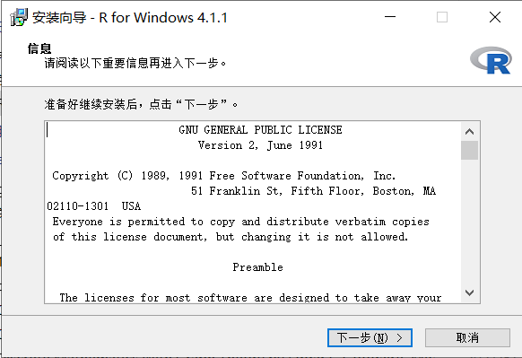
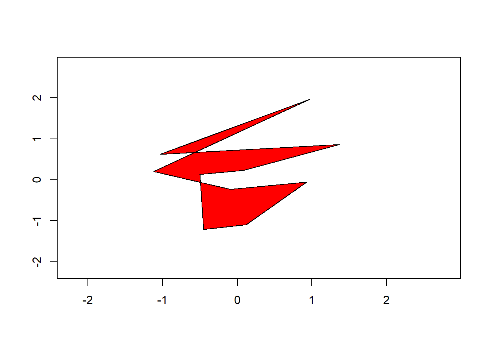
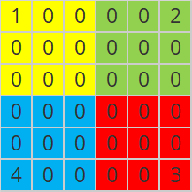
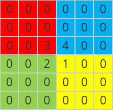
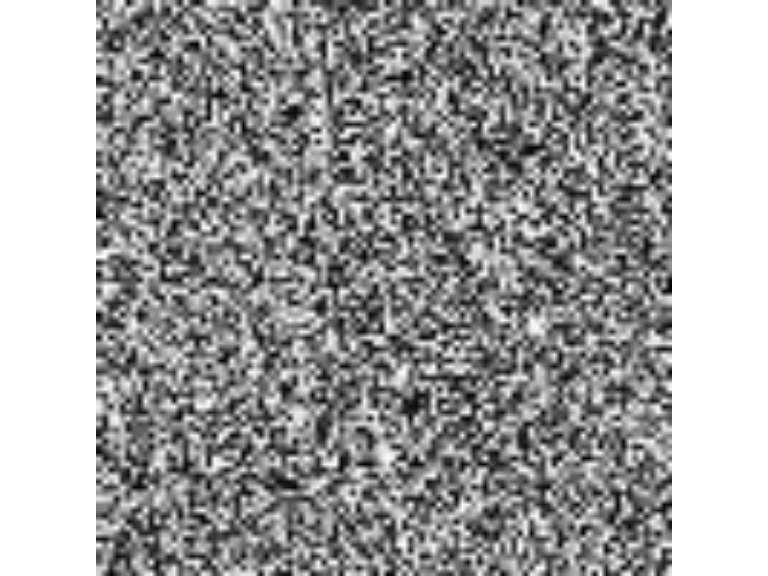
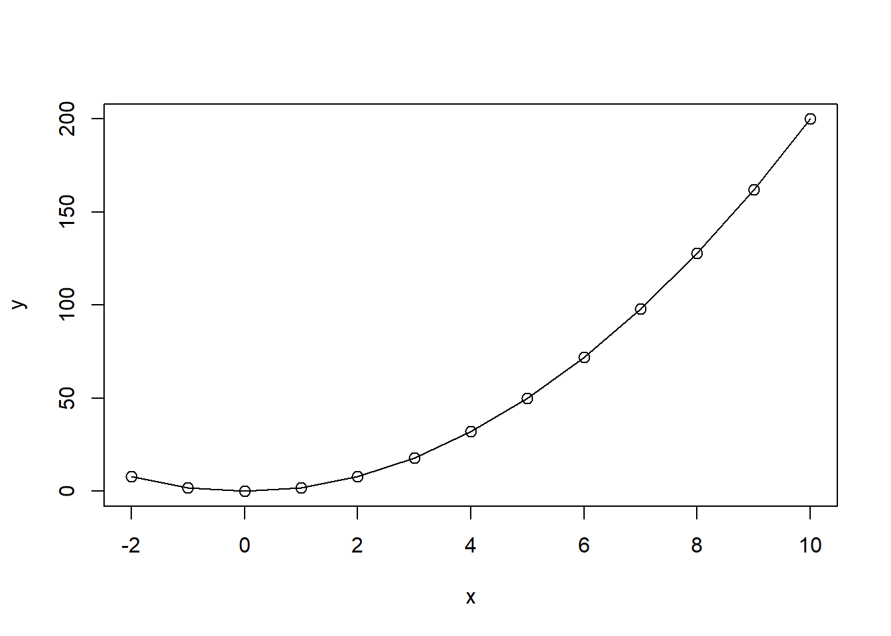
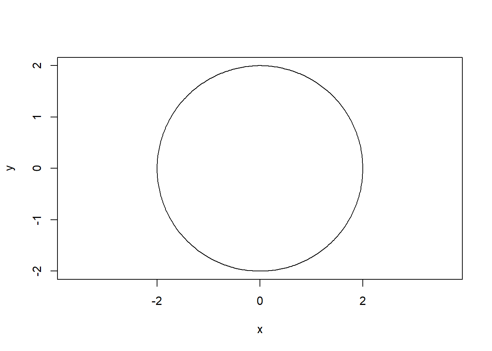
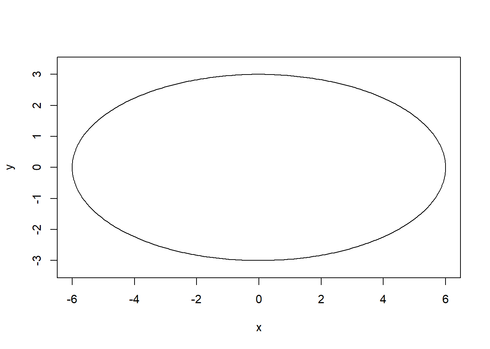
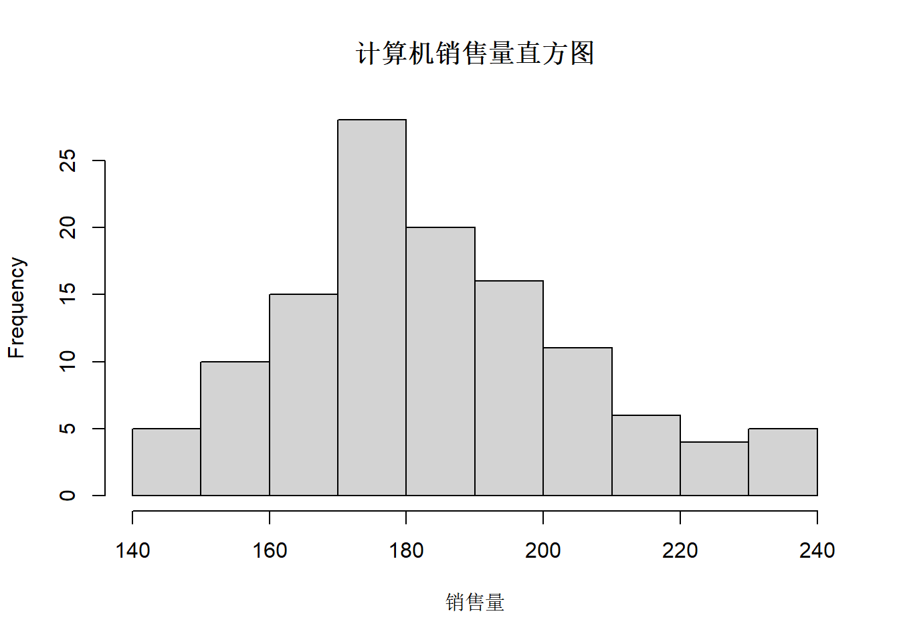

output: html_document
editor_options: 
  chunk_output_type: console


# R基础 {#RBasis}

## R的安装

步骤1  官网（https://www.r-project.org/）下载R的安装包，根据自己的系统下载相应程序。R版本更新较快。尽量下载最新版本。
 
步骤2 双击运行安装程序。选择需要使用的语言。


 
步骤3 进入安装向导，点击下一步。


 
 
步骤4 选择安装位置。


 
步骤5 选择组件，可以根据自己的计算机选择相应的选项，也可以全部选择。


 
步骤6 启动选项，可以选择接受默认选项。


 
步骤7 选择开始菜单创建的文件夹时，可以直接点击下一步即可。


 
步骤8 安装完成后，在安装目录中的bin\\x64目录中，双击Rgui.exe可以出现R语言的图形界面。


## 向量操作

### 生成向量

* 直接输入方式

已知一个钢材抗张力样本数据（见下表）

|      |      |      |      |      |      |      |      |      |      |      |      |      |
| - | - | - | - | - | - | - | - | - | - | - | - | - |
|      | 41   | 37   | 33   | 44.2 | 30.5 | 27   | 45   | 28.5 | 31.2 | 33.5 | 38.5 | 41.5 |
|      | 42   | 45.5 | 42.5 | 39   | 38.8 | 35.5 | 32.5 | 29.6 | 32.6 | 34.5 | 37.5 | 39.5 |
|      | 42.8 | 45.1 | 42.8 | 45.8 | 39.8 | 37.2 | 33.8 | 31.2 | 29   | 35.2 | 37.8 | 41.2 |
|      | 43.8 | 48   | 43.6 | 41.8 | 36.6 | 34.8 | 31   | 32   | 33.5 | 37.4 | 40.8 | 44.7 |
|      | 40.2 | 41.3 | 38.8 | 34.1 | 31.8 | 34.6 | 38.3 | 41.3 | 30   | 35.2 | 37.5 | 40.5 |
|      | 38.1 | 37.3 | 37.1 | 41.5 | 29.5 | 29.1 | 27.5 | 34.8 | 36.5 | 44.2 | 40   | 44.5 |
|      | 40.6 | 36.2 | 35.8 | 31.5 |      |      |      |      |      |      |      |      |


在R语言中，可以将表中的钢材抗张力样本数据“抽象”为一个向量，利用**c**构造符来实现。


``` r
dt <- c(
41.0, 37.0, 33.0, 44.2, 30.5, 27.0, 45.0, 28.5, 31.2, 33.5, 38.5, 41.5,
42.0, 45.5, 42.5, 39.0, 38.8, 35.5, 32.5, 29.6, 32.6, 34.5, 37.5, 39.5,
42.8, 45.1, 42.8, 45.8, 39.8, 37.2, 33.8, 31.2, 29.0, 35.2, 37.8, 41.2,
43.8, 48.0, 43.6, 41.8, 36.6, 34.8, 31.0, 32.0, 33.5, 37.4, 40.8, 44.7,
40.2, 41.3, 38.8, 34.1, 31.8, 34.6, 38.3, 41.3, 30.0, 35.2, 37.5, 40.5,
38.1, 37.3, 37.1, 41.5, 29.5, 29.1, 27.5, 34.8, 36.5, 44.2, 40.0, 44.5,
40.6, 36.2, 35.8, 31.5
)
```


如果总是手工录入数据，且待录入的数据很多时，是比较麻烦的事情。这里，可以替代的方法包括：随机模拟数据方式、冒号方式、seq方式、rep方式和文件读入方式。

* 随机模拟方式

**随机模拟数据 — 模拟有放回抽样操作**


``` r
#设定随机种子
set.seed(123)
#依据元素为27、28.5、31、32、34.5、37、40和48的向量，进行有放回抽样，
#形成一个容量为76的样本，抽样结果保存在dt.sample中
dt.sample = sample(c(27,28.5,31,32,34.5,37,40,48),76,replace = T)
#查看抽样结果
dt.sample
```

```
##  [1] 40.0 40.0 31.0 37.0 31.0 28.5 28.5 37.0 31.0 34.5 32.0 37.0 37.0 27.0 28.5
## [16] 31.0 48.0 34.5 31.0 31.0 27.0 32.0 27.0 27.0 34.5 31.0 48.0 28.5 40.0 28.5
## [31] 27.0 37.0 31.0 32.0 37.0 27.0 31.0 40.0 34.5 32.0 40.0 48.0 28.5 34.5 40.0
## [46] 27.0 27.0 28.5 40.0 31.0 32.0 34.5 40.0 34.5 31.0 48.0 37.0 27.0 28.5 34.5
## [61] 34.5 48.0 32.0 40.0 34.5 28.5 27.0 27.0 31.0 27.0 37.0 34.5 40.0 27.0 40.0
## [76] 28.5
```

**随机模拟数据 — 模拟无放回抽样操作**


``` r
#设定随机种子
set.seed(123)
#依据元素为27、28.5、31、32、34.5、37、40和48的向量，进行无放回抽样，
#生成一个容量为5的样本，抽样结果保存在dt.sample中
dt.sample = sample(c(27,28.5,31,32,34.5,37,40,48),5,replace = F)
#查看抽样结果
dt.sample
```

```
## [1] 40.0 48.0 31.0 37.0 28.5
```


**随机模拟数据 — 模拟均匀分布数据**


``` r
#设定随机种子
set.seed(123)
#生成一个在[27,48]区间服从均匀分布的容量为76的样本，保存在dt.runif中
dt.runif <- runif(76,27,48)
#查看模拟结果
dt.runif
```

```
##  [1] 33.03913 43.55441 35.58852 45.54337 46.74981 27.95669 38.09022 45.74080
##  [9] 38.58014 36.58891 47.09350 36.52002 41.22898 39.02530 29.16142 45.89632
## [17] 32.16784 27.88325 33.88634 47.04458 45.68033 41.54887 40.45064 47.87967
## [25] 40.76982 41.87914 38.42539 39.47698 33.07235 30.08939 47.22351 45.94828
## [33] 41.50481 43.70482 27.51689 37.03372 42.92765 31.54457 33.68180 31.86414
## [41] 29.99880 35.70547 35.68821 34.74575 30.20134 29.91493 31.89372 36.78521
## [49] 32.58543 45.01438 27.96245 36.28620 43.77742 29.55988 38.77991 31.33716
## [57] 29.67816 42.81947 45.79595 34.86372 40.96742 28.99165 35.06336 32.76206
## [65] 44.10744 36.41884 44.01135 44.06018 43.68119 36.23647 42.84398 40.21364
## [73] 41.91383 27.01312 36.98165 31.62250
```


**随机模拟数据 — 模拟正态分布数据**


``` r
#设定随机种子
set.seed(123)
#生成一个服从均值为32，标准差为5的正态分布样本，容量为76，保存在dt.rnorm中
dt.rnorm <- rnorm(76,mean = 35,sd=5)
#查看模拟结果
dt.rnorm
```

```
##  [1] 32.19762 33.84911 42.79354 35.35254 35.64644 43.57532 37.30458 28.67469
##  [9] 31.56574 32.77169 41.12041 36.79907 37.00386 35.55341 32.22079 43.93457
## [17] 37.48925 25.16691 38.50678 32.63604 29.66088 33.91013 29.86998 31.35554
## [25] 31.87480 26.56653 39.18894 35.76687 29.30932 41.26907 37.13232 33.52464
## [33] 39.47563 39.39067 39.10791 38.44320 37.76959 34.69044 33.47019 33.09764
## [41] 31.52647 33.96041 28.67302 45.84478 41.03981 29.38446 32.98558 32.66672
## [49] 38.89983 34.58315 36.26659 34.85727 34.78565 41.84301 33.87115 42.58235
## [57] 27.25624 37.92307 35.61927 36.07971 36.89820 32.48838 33.33396 29.90712
## [65] 29.64104 36.51764 37.24105 35.26502 39.61134 45.25042 32.54484 23.45416
## [73] 40.02869 31.45400 31.55996 40.12786
```


**随机模拟数据 — 模拟卡方分布数据**


``` r
#设定随机种子
set.seed(123)
#生成一个服从自由度为6的卡方分布样本，容量为76，保存在dt.chisq中
dt.chisq <- rchisq(76,df=6)
#查看模拟结果
dt.chisq
```

```
##  [1]  3.384687  9.472060  1.084455  5.417201 11.894236  6.563767  1.799715
##  [8]  1.029623  9.620075  6.202564  6.347659  5.356135  3.396756  9.932607
## [15]  7.951344  4.825456  3.616668  4.340673  2.281832  4.733516  1.088675
## [22]  1.993471  2.048573  4.039111  4.110436  4.599141  7.935565  7.414784
## [29]  6.905054  4.806135  5.947201  1.885227  4.364123  4.495041  9.549497
## [36]  2.079105  6.357854  2.589726  4.739839  3.726854  4.865351  5.910957
## [43]  2.233023  1.301731  2.188670  5.706183  6.272589  3.537678 14.109718
## [50]  1.670653  6.005907  6.517810  5.169019  8.341754 13.584361  3.567779
## [57]  2.557159  3.008793  7.150103  4.980419  1.884828  2.831123  5.018245
## [64]  6.292584  3.896564  2.865149  6.104226  9.070037  6.470856  4.022430
## [71]  5.673903  3.573413  5.783432  3.211520  9.921657  3.641548
```


**随机模拟数据 — 模拟T分布数据**


``` r
#设定随机种子
set.seed(123)
#生成一个服从自由度为6的卡方分布样本，容量为76，保存在dt.t中
dt.t <- rt(76,df=10)
#查看模拟结果
dt.t
```

```
##  [1] -0.62468443 -1.37828063 -0.11812450 -1.59107520  1.59250160  2.35970042
##  [7]  0.33356443  0.97822144 -0.99963708 -0.30305368 -0.07190032 -0.21130955
## [13] -0.92603370  0.48313427 -0.11282895 -0.14807510 -4.15835630 -0.47958000
## [19]  0.87736073  1.73172454  0.53783821 -0.08292731 -0.03039808  0.38651970
## [25] -1.43481832  0.12423075  0.45391855  3.30597749  0.28937639  0.04589474
## [31]  2.44381975 -1.14849084 -0.58404408 -0.42143483 -1.01063411  0.44499869
## [37] -0.95022815  1.04861044 -0.27035599  0.92737412  0.29535800  1.52930378
## [43]  1.71054284  0.13641952  0.03109931 -0.75760717 -1.36334377 -0.18258009
## [49]  1.66812445 -0.27044891  1.51551277 -0.84449695  0.81921868  0.31417877
## [55]  1.72721425 -0.94591768 -1.03121809  0.89982458  0.22417809  1.81865302
## [61]  0.67597573  0.78847375 -0.33826705 -0.85378793  1.35379846  0.70293258
## [67]  0.45934873 -0.02079873 -0.31910343 -0.31634846 -1.57320540 -1.44434556
## [73] -0.48408083 -0.01809631  2.93500529 -0.02391323
```


**随机模拟数据 — 模拟F分布数据据**


``` r
#设定随机种子
set.seed(123)
#生成一个服从第一自由度为10、第二自由度为4的F方分布样本，容量为76，
#保存在dt.f中
dt.f <- rf(76,df1=10,df2=4)
#查看模拟结果
dt.f
```

```
##  [1]  0.4093890  0.3920693  1.6761425  6.7990581  1.5146654  1.3158186
##  [7]  0.3878186  1.7930280  1.1394301  0.7405332  1.5851525  0.8501906
## [13]  1.1580143  1.0417022  1.6143746  5.4326644  1.2465300  6.7547978
## [19]  3.5344501  1.7003087  0.9497613  5.0285505  0.5666933  2.2540650
## [25] 13.1447962  0.9845653  0.6492383  4.1296074  1.4749961  1.5838929
## [31]  1.3148642  0.8984131  2.1221818  0.6655406  1.9409712  2.0597954
## [37]  2.4209388  3.1071167  2.7222573  0.4383570  0.5574772  0.9390487
## [43]  0.9951846  1.8334050  1.8752244  1.1988891  2.3116872  0.9928678
## [49]  1.1170271  0.5016872  3.3144030  3.3740907  0.8700413  1.9867113
## [55]  0.4624177  0.3267538  0.6965641  1.3268520  2.0311737  0.4697923
## [61]  0.2096217  0.7084959  2.1412451  0.4061634  0.3908325  1.1406730
## [67]  2.2598982  5.5646001  6.8823350  2.2090206  1.0333670  0.3612346
## [73]  0.6647716  0.5618678  0.6811862  0.2719305
```


**随机模拟数据 — 模拟泊松分布数据**


``` r
#设定随机种子
set.seed(123)
#生成一个lambdaa=5的泊松方分布样本，容量为76，保存在dt.pois中
dt.pois <- rpois(76, lambda = 5)
#查看模拟结果
dt.pois
```

```
##  [1]  4  7  4  8  9  2  5  8  5  5  9  5  6  5  2  8  3  2  4  9  8  6  6 11  6
## [26]  6  5  5  4  3  9  8  6  7  1  5  6  3  4  3  3  4  4  4  3  3  3  5  4  7
## [51]  2  5  7  2  5  3  3  6  8  4  6  2  4  4  7  5  7  7  7  4  6  6  6  0  5
## [76]  3
```


* 冒号方式


``` r
#生成元素为1,2,3,...,10的向量
1:10
```

```
##  [1]  1  2  3  4  5  6  7  8  9 10
```

``` r
#生成元素为-1,0,1,2,3,4的向量
-1:4
```

```
## [1] -1  0  1  2  3  4
```

``` r
#生成元素为110,109,108,107,...,101的向量
110:101
```

```
##  [1] 110 109 108 107 106 105 104 103 102 101
```


* seq方式


``` r
#生成从1开始，每次递增1，直至递增到10的向量
seq(1,10,by=1)
```

```
##  [1]  1  2  3  4  5  6  7  8  9 10
```

``` r
#生成从-1开始，每次递增1，直至递增到4的向量
seq(-1,4,by=1)
```

```
## [1] -1  0  1  2  3  4
```

``` r
#生成从110开始，每次递减1，直至递减到101的向量
seq(110,101,by=-1)
```

```
##  [1] 110 109 108 107 106 105 104 103 102 101
```

``` r
#生成从1开始，每次递增2，直至递增到9的向量
seq(1,10,by=2)
```

```
## [1] 1 3 5 7 9
```

``` r
#生成从2开始，每次递增2，直至递增到10的向量
seq(2,10,by=2)
```

```
## [1]  2  4  6  8 10
```

``` r
#生成从1开始，每次递增0.5，直至递增到10的向量
seq(1,10,by=0.5)
```

```
##  [1]  1.0  1.5  2.0  2.5  3.0  3.5  4.0  4.5  5.0  5.5  6.0  6.5  7.0  7.5  8.0
## [16]  8.5  9.0  9.5 10.0
```

``` r
#将区间[1,10]等分为5-1=4部分，并将等分后的端点形成一个向量
seq(1,10,length.out = 5)
```

```
## [1]  1.00  3.25  5.50  7.75 10.00
```

``` r
#将区间[2,10]等分为5-1=4部分，并将等分后的端点形成一个向量
seq(2,10,length.out = 5)
```

```
## [1]  2  4  6  8 10
```

``` r
#将区间[1,10]等分为19-1=18部分，并将等分后的端点形成一个向量
seq(1,10,length.out = 19)
```

```
##  [1]  1.0  1.5  2.0  2.5  3.0  3.5  4.0  4.5  5.0  5.5  6.0  6.5  7.0  7.5  8.0
## [16]  8.5  9.0  9.5 10.0
```


* rep方式


``` r
#将元素为1、2、3、4、5的向量整体重复3次
rep(1:5,times=3)
```

```
##  [1] 1 2 3 4 5 1 2 3 4 5 1 2 3 4 5
```

``` r
#将元素为1、2、3、4、5的向量的每个元素依次重复3次
rep(1:5,each=3)
```

```
##  [1] 1 1 1 2 2 2 3 3 3 4 4 4 5 5 5
```

``` r
#将元素为a、b、d的向量整体重复3次
rep(c('a','b','d'),times=3)
```

```
## [1] "a" "b" "d" "a" "b" "d" "a" "b" "d"
```

``` r
#将元素为a、b、d的向量的每个元素依次重复3次
rep(c('a','b','d'),each=3)
```

```
## [1] "a" "a" "a" "b" "b" "b" "d" "d" "d"
```


### 读写向量的元素


``` r
#生成向量x
x = c(1,3,5,11,20,30,8,9,2)

#读出x第1个元素
x[1] 
```

```
## [1] 1
```

``` r
#读取x第2-4个元素
x[2:4] 
```

```
## [1]  3  5 11
```

``` r
#读取x第2、5、7个元素
x[c(2,5,7)] 
```

```
## [1]  3 20  8
```

``` r
#读取x第2-4以及6-8个元素
x[c(2:4,6:8)] 
```

```
## [1]  3  5 11 30  8  9
```

``` r
#将x第1个元素变为101
x[1] = 101 
x
```

```
## [1] 101   3   5  11  20  30   8   9   2
```

``` r
#将x第2-4个元素分别变为102、103和104
x[2:4] = 102:104 
x
```

```
## [1] 101 102 103 104  20  30   8   9   2
```

``` r
#将x第2、5、7个元素都变为105
x[c(2,5,7)] = 105 
x
```

```
## [1] 101 105 103 104 105  30 105   9   2
```

``` r
#将x第2-4以及6-8个元素分别变为原来元素的2倍
x[c(2:4,6:8)] <- x[c(2:4,6:8)]*2
x
```

```
## [1] 101 210 206 208 105  60 210  18   2
```

### 向量的运算

**向量的加法运算**


``` r
#用冒号方式生成向量x，元素为1、2、3、4、5、6
x = 1:6
#用seq方式生成向量y，元素为2、2.5、3.0、3.5、4.0、4.5
y = seq(2,4.5,by=0.5)

#两个向量相加，结果是对应元素相加
x + y
```

```
## [1]  3.0  4.5  6.0  7.5  9.0 10.5
```

``` r
#运算之前，会先依据x的元素个数将1重复6次，形成元素为6个1的向量，
#而后再与x的对应元素相加
x + 1
```

```
## [1] 2 3 4 5 6 7
```

``` r
#运算之前，会先依据x的元素个数向量1:2整体重复3次，
#形成元素为1、2、1、2、1、2的向量，而后再与x的对应元素相加
x + 1:2
```

```
## [1] 2 4 4 6 6 8
```

``` r
#运算之前，会先依据x的元素个数向量1:3整体重复2次，
#形成元素为1、2、3、1、2、3的向量，而后再与x的对应元素相加
x + 1:3
```

```
## [1] 2 4 6 5 7 9
```

``` r
#运算之前，会先依据x的元素个数扩展向量1:4，
#形成元素为1、2、3、4、1、2的向量，而后再与x的对应元素相加
x + 1:4
```

```
## Warning in x + 1:4: longer object length is not a multiple of shorter object
## length
```

```
## [1] 2 4 6 8 6 8
```

``` r
#运算之前，会先依据x的元素个数扩展向量1:5，
#形成元素为1、2、3、4、5、1的向量，而后再与x的对应元素相加
x + 1:5
```

```
## Warning in x + 1:5: longer object length is not a multiple of shorter object
## length
```

```
## [1]  2  4  6  8 10  7
```

``` r
#运算之前，会先依据向量1:12将x整体重复1次，
#形成元素为1、2、3、4、5、6、1、2、3、4、5、6的向量，
#而后再与向量1:12的对应元素相加
x + 1:12
```

```
##  [1]  2  4  6  8 10 12  8 10 12 14 16 18
```


**向量的数乘运算**


``` r
#用seq方式生成向量x
x = seq(1,5,length.out = 5)
#向量x的每个元素乘以2
2*x
```

```
## [1]  2  4  6  8 10
```

``` r
#向量x的每个元素乘以1.2
1.2*x
```

```
## [1] 1.2 2.4 3.6 4.8 6.0
```

``` r
#向量x的每个元素乘以-1
(-1)*x
```

```
## [1] -1 -2 -3 -4 -5
```


**向量的减法运算**

``` r
#生成向量x和y
x = 1:6
y = seq(2,4.5,by=0.5)

#向量x前去向量y，结果是对应元素相减
x - y
```

```
## [1] -1.0 -0.5  0.0  0.5  1.0  1.5
```

``` r
#向量相减，可以视为向量加法与向量数乘的联合运算
x + (-1)*y
```

```
## [1] -1.0 -0.5  0.0  0.5  1.0  1.5
```

``` r
#运算之前，会先依据x的元素个数将1重复6次，形成元素为6个1的向量，
#而后再与x的对应元素相减
x - 1
```

```
## [1] 0 1 2 3 4 5
```

``` r
#运算之前，会先依据x的元素个数将向量1:2整体重复3次，
#形成元素为1、2、1、2、1、2的向量，而后再与x的对应元素相减
x - 1:2
```

```
## [1] 0 0 2 2 4 4
```

``` r
#运算之前，会先依据x的元素个数将向量1:3整体重复2次，
#形成元素为1、2、3、1、2、3的向量，而后再与x的对应元素相减
x - 1:3
```

```
## [1] 0 0 0 3 3 3
```

``` r
#运算之前，会先依据x的元素个数扩展向量1:4，
#形成元素为1、2、3、4、1、2的向量，而后再与x的对应元素相减
x - 1:4
```

```
## Warning in x - 1:4: longer object length is not a multiple of shorter object
## length
```

```
## [1] 0 0 0 0 4 4
```

``` r
#运算之前，会先依据x的元素个数扩展向量1:5，
#形成元素为1、2、3、4、5、1的向量，而后再与x的对应元素相减
x - 1:5
```

```
## Warning in x - 1:5: longer object length is not a multiple of shorter object
## length
```

```
## [1] 0 0 0 0 0 5
```

``` r
#运算之前，会先依据向量1:12将x整体重复1次，
#形成元素为1、2、3、4、5、6、1、2、3、4、5、6的向量，
#而后再与向量1:12的对应元素相减
x - 1:12
```

```
##  [1]  0  0  0  0  0  0 -6 -6 -6 -6 -6 -6
```


**向量的乘法运算**


``` r
#生成向量x和y
x = 1:3
y = 6:4
#计算x与y的对应元素的乘积
x * y
```

```
## [1]  6 10 12
```

**向量的内积运算**


``` r
#生成向量x和y
x <- 1:3
y <- 6:4
#计算x与y的内积
x %*% y
```

```
##      [,1]
## [1,]   28
```

**向量的转置运算**


``` r
#生成向量x
x <- 1:3
#默认情况下，向量都是列向量模式
x
```

```
## [1] 1 2 3
```

``` r
#x转置之后，得到1行3列的矩阵
t(x)
```

```
##      [,1] [,2] [,3]
## [1,]    1    2    3
```


**向量元素的个数**


``` r
#生成向量x
x = seq(1,10.2,by=0.31)
x
```

```
##  [1] 1.00 1.31 1.62 1.93 2.24 2.55 2.86 3.17 3.48 3.79 4.10 4.41 4.72 5.03 5.34
## [16] 5.65 5.96 6.27 6.58 6.89 7.20 7.51 7.82 8.13 8.44 8.75 9.06 9.37 9.68 9.99
```

``` r
#获取x包含的向量个数
length(x)
```

```
## [1] 30
```


**向量元素求和运算**


``` r
#生成向量x
x = 1:100
#计算x所有元素的和
sum(x)
```

```
## [1] 5050
```

**向量元素均值运算**


``` r
#生成向量x
x = 1:100
#通过mean计算x的元素均值
mean(x)
```

```
## [1] 50.5
```

``` r
#也可以用如下方式计算x的元素均值
sum(x) / length(x)
```

```
## [1] 50.5
```


**向量元素最大值运算**


``` r
#设置随机种子
set.seed(123)
#生成服从均值为3、标准差为2.5的正态分布样本x（容量为100）
x = rnorm(100,mean = 3, sd=2.5)
#获取x的元素的最大值
max(x)
```

```
## [1] 8.468332
```

**向量元素最小值运算**


``` r
#设置随机种子
set.seed(123)
#生成服从区间[2.5,3]上的均匀分布样本x（容量为100）
x = runif(100, 2.5, 3)
#获取x的元素的最小值
min(x)
```

```
## [1] 2.500312
```


**向量元素排序运算 — 升序**


``` r
#设置随机种子
set.seed(123)
#按有放回抽样方式从向量1:30中抽取10个元素，形成向量x
x = sample(1:30,10,replace = T)
x
```

```
##  [1] 15 19 14  3 10 18 22 11  5 20
```

``` r
#以sort方式对x的元素按按从小到大进行排序
sort(x)
```

```
##  [1]  3  5 10 11 14 15 18 19 20 22
```

``` r
#或者以order方式获得x按从小到大顺序排列的角标位置
order(x)
```

```
##  [1]  4  9  5  8  3  1  6  2 10  7
```

``` r
#依据order返回的结果对x的元素按从小到大的顺序排列
x[order(x)]
```

```
##  [1]  3  5 10 11 14 15 18 19 20 22
```


**向量元素排序运算 — 降序**


``` r
#设置随机种子
set.seed(123)
#按有放回抽样方式从向量1:30中抽取10个元素，形成向量x
x <- sample(1:30,10,replace = T)
x
```

```
##  [1] 15 19 14  3 10 18 22 11  5 20
```

``` r
#以sort方式对x的元素按从大到小进行排序
sort(x,decreasing = T)
```

```
##  [1] 22 20 19 18 15 14 11 10  5  3
```


**向量元素排序运算**

``` r
#设置随机种子
set.seed(123)
#按有放回抽样方式从向量1:30中抽取10个元素，形成向量x
x = sample(1:30,10,replace = T)
x
```

```
##  [1] 15 19 14  3 10 18 22 11  5 20
```

``` r
#或者以order方式获得x按从大到小顺序排列的角标位置
order(x, decreasing = T)
```

```
##  [1]  7 10  2  6  1  3  8  5  9  4
```

``` r
#依据order返回的结果对x的元素按从大到小的顺序排列
x[order(x, decreasing = T)] 
```

```
##  [1] 22 20 19 18 15 14 11 10  5  3
```


**向量元素的取值范围**


``` r
#设置随机种子
set.seed(123)
#生成服从标准正态分布的样本x（容量为10）
x = rnorm(10)
#计算x的元素的取值范围（计算结果的第一个元素为x的最小值，
#第二个元素为x的最大值）
range(x)
```

```
## [1] -1.265061  1.715065
```


**向量元素倒序运算**


``` r
#生成向量x
x = seq(1,10,by=3)
x
```

```
## [1]  1  4  7 10
```

``` r
#x的元素倒序排列
rev(x)
```

```
## [1] 10  7  4  1
```


**向量元素幂运算**


``` r
#生成向量x
x = 1:12
#计算x中每个元素的平方
x^2
```

```
##  [1]   1   4   9  16  25  36  49  64  81 100 121 144
```

``` r
#计算x中每个元素的平方根
x^(1/2)
```

```
##  [1] 1.000000 1.414214 1.732051 2.000000 2.236068 2.449490 2.645751 2.828427
##  [9] 3.000000 3.162278 3.316625 3.464102
```

``` r
#计算x中每个元素的倒数
x^(-1)
```

```
##  [1] 1.00000000 0.50000000 0.33333333 0.25000000 0.20000000 0.16666667
##  [7] 0.14285714 0.12500000 0.11111111 0.10000000 0.09090909 0.08333333
```

**向量元素指数运算**


``` r
#生成向量x
x = 1:10
#计算以2为底，以x的每个元素为指数的值
2^x
```

```
##  [1]    2    4    8   16   32   64  128  256  512 1024
```


**向量元素对数运算**


``` r
#生成向量x
x <- 2^(1:10)
#计算x的每个元素的以2为底的对数值
log(x,base = 2)
```

```
##  [1]  1  2  3  4  5  6  7  8  9 10
```

``` r
#计算x的每个元素的自然对数值
log(x)
```

```
##  [1] 0.6931472 1.3862944 2.0794415 2.7725887 3.4657359 4.1588831 4.8520303
##  [8] 5.5451774 6.2383246 6.9314718
```

``` r
#计算x的每个元素的常用对数值
log(x,base = 10)
```

```
##  [1] 0.30103 0.60206 0.90309 1.20412 1.50515 1.80618 2.10721 2.40824 2.70927
## [10] 3.01030
```


**向量元素三角运算**


``` r
#生成向量x
x = seq(0,2*pi,by=pi/4)
x
```

```
## [1] 0.0000000 0.7853982 1.5707963 2.3561945 3.1415927 3.9269908 4.7123890
## [8] 5.4977871 6.2831853
```

``` r
#计算x的每个元素的正弦
sin(x)
```

```
## [1]  0.000000e+00  7.071068e-01  1.000000e+00  7.071068e-01  1.224606e-16
## [6] -7.071068e-01 -1.000000e+00 -7.071068e-01 -2.449213e-16
```

``` r
#计算x的每个元素的余弦
cos(x)
```

```
## [1]  1.000000e+00  7.071068e-01  6.123032e-17 -7.071068e-01 -1.000000e+00
## [6] -7.071068e-01 -1.836910e-16  7.071068e-01  1.000000e+00
```

**向量元素的包含运算**


``` r
#生成向量x，y
x = 1:3
y = 2:6
#查看x的哪些向量包含于y
x %in% y
```

```
## [1] FALSE  TRUE  TRUE
```


**向量元素比较运算**


``` r
#生成向量x
x = 1:11
#计算x的元素均值，保存在m中
m = mean(x)

#判断x的元素是否大于均值m，返回的结果为TRUE，则表明相应元素大于均值，
#反之表明相应元素不大于均值
x > m
```

```
##  [1] FALSE FALSE FALSE FALSE FALSE FALSE  TRUE  TRUE  TRUE  TRUE  TRUE
```

``` r
#判断x的元素是否等于均值m，返回的结果为TRUE，则表明相应元素等于均值，
#反之表明相应元素不等于均值
x == m
```

```
##  [1] FALSE FALSE FALSE FALSE FALSE  TRUE FALSE FALSE FALSE FALSE FALSE
```

``` r
#判断x的元素是否不等于均值m，返回的结果为TRUE，则表明相应元素不等于均值，
#反之表明相应元素等于均值
x != m
```

```
##  [1]  TRUE  TRUE  TRUE  TRUE  TRUE FALSE  TRUE  TRUE  TRUE  TRUE  TRUE
```

``` r
#判断x的元素是否小于均值m，返回的结果为TRUE，则表明相应元素小于均值，
#反之表明相应元素不小于均值
x < m
```

```
##  [1]  TRUE  TRUE  TRUE  TRUE  TRUE FALSE FALSE FALSE FALSE FALSE FALSE
```

``` r
#生成向量x
x = 1:10
#判断x的元素是否小于3，若小于3则结果为不合格，反之结果为合格
ifelse(x<3,"不合格","合格")
```

```
##  [1] "不合格" "不合格" "合格"   "合格"   "合格"   "合格"   "合格"   "合格"  
##  [9] "合格"   "合格"
```

``` r
#判断x的元素是否小于3，结果为不合格，若元素在[3,6)区间，结果为及格，
#若元素大于等于6，结果为良好
ifelse(x<3,"不及格",ifelse(x<6,"及格","良好"))
```

```
##  [1] "不及格" "不及格" "及格"   "及格"   "及格"   "良好"   "良好"   "良好"  
##  [9] "良好"   "良好"
```


**向量元素条件查询**


``` r
#生成向量x
x = 1:11
#计算x的元素的均值m
m = mean(x)

#查询x的哪些元素大于均值m
which(x>m)
```

```
## [1]  7  8  9 10 11
```

``` r
#查询x的哪些元素等于均值m
which(x==m)
```

```
## [1] 6
```

``` r
#查询x的哪些元素不等于均值m
which(x!=m)
```

```
##  [1]  1  2  3  4  5  7  8  9 10 11
```

``` r
#查询x的哪些元素小于均值m
which(x<m)
```

```
## [1] 1 2 3 4 5
```


``` r
#设定随机种子
set.seed(123)
#生成向量x（结果是1、2、...、11的一个排列）
x = sample(1:11)
#计算x的元素的均值
m <- mean(x)

#查询x的哪些元素大于均值m，并获取这些元素
idx <- which(x>m)
x[idx]
```

```
## [1] 11 10  9  8  7
```

``` r
#查询x的哪些元素等于均值m，并获取这些元素
idx <- which(x==m)
x[idx]
```

```
## [1] 6
```

``` r
#查询x的哪些元素不等于均值m，并获取这些元素
idx <- which(x!=m)
x[idx]
```

```
##  [1]  3 11  2 10  5  4  9  8  1  7
```

``` r
#查询x的哪些元素小于均值m，并获取这些元素
idx <- which(x<m)
x[idx]
```

```
## [1] 3 2 5 4 1
```


**逻辑向量求和**

对于元素为逻辑值的向量求和，可以统计其中值为TRUE的元素个数。


``` r
#设定随机种子
set.seed(123)
#生成向量x（结果是1、2、...、11的一个排列）
x = sample(1:11)
#计算x的元素的均值
m <- mean(x)

#计算有多少个数超过平均值
sum(x > m)
```

```
## [1] 5
```

利用逻辑向量求和，可以统计一个向量vec2中有多少个元素属于另一个向量vec1：


``` r
#指定vec1
vec1 = 1:20
#设定随机种子
set.seed(123)
#在向量1:30中无放回抽取10个数，形成vec2
vec2 = sample(1:30,10)
#查看vec2中的元素
vec2
```

```
##  [1] 15 19 14  3 10 18 22 11  5 20
```

``` r
#统计vec2中有多少个元素属于vec1
sum(vec2 %in% vec1)
```

```
## [1] 9
```

**统计向量各元素取值的频数**


``` r
#生成向量x
set.seed(123)
x = sample(letters[1:5],15,replace = T)
#提出x中不重复的元素取值
unique(x)
```

```
## [1] "c" "b" "e" "d" "a"
```

``` r
#统计x中各元素取值出现的频数
table(x)
```

```
## x
## a b c d e 
## 2 3 6 2 2
```


**向量的直方图**


``` r
#生成向量x
set.seed(123)
x = rnorm(30,mean=60,sd=10)
#对x的取值范围均分为8个区间
x.cut1 = cut(x,breaks = 8)
#统计x的元素在各个区间的分布数量，即直方图
table(x.cut1)
```

```
## x.cut1
##   (40.3,45]   (45,49.7] (49.7,54.4] (54.4,59.1] (59.1,63.8] (63.8,68.5] 
##           2           3           5           5           5           5 
## (68.5,73.2] (73.2,77.9] 
##           2           3
```

``` r
#对x的取值范围进行区间划分，各区间端点为：
#40、45、50、55、60、65、70、75和80
x.cut2 = cut(x,breaks = seq(40,80,by=5))
#统计x的元素在各个区间的分布数量，即直方图
table(x.cut2)
```

```
## x.cut2
## (40,45] (45,50] (50,55] (55,60] (60,65] (65,70] (70,75] (75,80] 
##       2       4       5       4       8       2       2       3
```

``` r
#对x的取值范围进行区间划分，各区间端点为：40、50、60、70和80，
#并设定为左闭右开区间模式
x.cut3 = cut(x,breaks = seq(40,80,by=10), right = F)
#统计x的元素在各个区间的分布数量，即直方图
table(x.cut3)
```

```
## x.cut3
## [40,50) [50,60) [60,70) [70,80) 
##       6       9      10       5
```


对一组数划分区间，统计频次数？在后面的直方图中有用

将矩阵f的如下运算变成向量操作：
$$
m_{ji} = \sum_{x,y} f(x,y)*x^j*y^i
$$

## Factors操作

因子Factors是一种特殊向量，可以用来表示一些具前后、层级顺序（体现为因子水平）的分类变量，。


``` r
#生成一个因子型向量gender，表示3个人的性别
#默认情况下，因子水平是自动依据因子向量的元素生成的，且按照字母顺序
#排列因子水平，比如，以下的gender向量的因子水平为：FEMALE和MALE
gender = factor(c("MALE", "FEMALE", "MALE")) 
gender
```

```
## [1] MALE   FEMALE MALE  
## Levels: FEMALE MALE
```

``` r
#生成一个因子型向量gender1，表示3个人的性别，
#同时指定因子水平为：MALE和FEMALE
gender1 = factor(c("MALE", "FEMALE", "MALE"),
                 levels = c("MALE","FEMALE")
                )
gender1
```

```
## [1] MALE   FEMALE MALE  
## Levels: MALE FEMALE
```

``` r
#生成一个因子型向量blood，表示3个人的血型，
#同时指定因子水平为：A、B、AB和O
blood <- factor(
  c("O", "AB", "A"), 
  levels = c("A", "B", "AB", "O")
)
#统计向量blood中各血型出现的人数
table(blood)
```

```
## blood
##  A  B AB  O 
##  1  0  1  1
```

``` r
#模拟生成40个同学的某课程的成绩向量score，并统计各成绩等级的人数
score = sample(c("优","良","中","及格","不及格"),40,repl=T)
table(score)
```

```
## score
## 不及格   及格     良     优     中 
##      8      7      8     10      7
```

``` r
#模拟生成40个同学的某课程的成绩向量，并指定因子水平为：
#优、良、中、及格和不及格，然后统计各成绩等级的人数
score1 = factor(
  sample(c("优","良","中","及格","不及格"),40,repl=T),
  levels=c("优","良","中","及格","不及格")
)
table(score1)
```

```
## score1
##     优     良     中   及格 不及格 
##      7      6      9     12      6
```

``` r
#生成包含5个字母a、b、c、d和e的因子型向量tmp
tmp = factor(letters[1:5])
#更改tmp的第二个元素为e
tmp[2] = "e"
tmp
```

```
## [1] a e c d e
## Levels: a b c d e
```

``` r
#若待更改的值不在因子水平中，更改操作会达不到预期
tmp[3] <- "z"
```

```
## Warning in `[<-.factor`(`*tmp*`, 3, value = "z"): invalid factor level, NA
## generated
```

``` r
tmp
```

```
## [1] a    e    <NA> d    e   
## Levels: a b c d e
```

## 列表操作


``` r
#生成一个列表patients，包含3个病人的姓名、体温、性别、血型
patients = list(
  subject.name = c("John","Peter","Alice"),
  temperature = c(98.1, 98.6, 101.4),
  gender = factor(c("MALE", "FEMALE", "MALE"),
                  levels = c("MALE","FEMALE")),
  blood = factor(c("O", "AB", "A"), 
                 levels = c("A", "B", "AB", "O"))
)
patients
```

```
## $subject.name
## [1] "John"  "Peter" "Alice"
## 
## $temperature
## [1]  98.1  98.6 101.4
## 
## $gender
## [1] MALE   FEMALE MALE  
## Levels: MALE FEMALE
## 
## $blood
## [1] O  AB A 
## Levels: A B AB O
```

``` r
#查询三个病人的姓名
patients$subject.name
```

```
## [1] "John"  "Peter" "Alice"
```

``` r
#查询三个病人的体温和性别
patients[2:3]
```

```
## $temperature
## [1]  98.1  98.6 101.4
## 
## $gender
## [1] MALE   FEMALE MALE  
## Levels: MALE FEMALE
```

``` r
#或者
patients[c("temperature","gender")]
```

```
## $temperature
## [1]  98.1  98.6 101.4
## 
## $gender
## [1] MALE   FEMALE MALE  
## Levels: MALE FEMALE
```

``` r
#查询第二个病人的血型
patients$blood[2]
```

```
## [1] AB
## Levels: A B AB O
```

``` r
#查询是否有姓名为Alice的病人
any(patients$subject.name=="Alice")
```

```
## [1] TRUE
```


``` r
#生成一个列表pnts：包含10个点的横、纵坐标
pnts = vector("list",10)
for(i in 1:10){
  set.seed(i*100)
  pnts[[i]] = round(rnorm(2),2)
}
pnts
```

```
## [[1]]
## [1] -0.50  0.13
## 
## [[2]]
## [1] 0.08 0.23
## 
## [[3]]
## [1] 1.37 0.86
## 
## [[4]]
## [1] -1.04  0.62
## 
## [[5]]
## [1] 0.97 1.97
## 
## [[6]]
## [1] -1.12  0.20
## 
## [[7]]
## [1] -0.09 -0.23
## 
## [[8]]
## [1]  0.93 -0.05
## 
## [[9]]
## [1]  0.12 -1.10
## 
## [[10]]
## [1] -0.45 -1.21
```

``` r
#取出pnts中10个点的横坐标
x = sapply(pnts,'[[',1)
#取出pnts中10个点的纵坐标
y = sapply(pnts,'[[',2)
#绘制这10个点形成的多边形
rng = range(c(x,y))
plot((rng[1]-1):(rng[2]+1),(rng[1]-1):(rng[2]+1),
     type="n",xlab="",ylab="")
polygon(x,y,col="red")
```




## 数据框操作


``` r
#生成一个数据框PtData，包含9个病人的姓名、体温、流感状态、性别、血型
subject.name = c("John","Peter","Alice","Philip",
                 "Jack","Green","Mark","Lili","Ama")
temperature = c(98.1,98.6,101.4,90.0,95.2,96.6,97.8,95.1,98.9)
flu.status = c(TRUE,FALSE,FALSE,TRUE,FALSE,FALSE,TRUE,FALSE,FALSE)
gender = factor(rep(c("MALE", "FEMALE", "MALE"),3),
                levels = c("MALE","FEMALE"))
blood = factor(rep(c("O", "AB", "A"),each=3), 
               levels = c("A", "B", "AB", "O"))

PtData = data.frame(subject.name, temperature, flu.status, 
                      gender, blood, stringsAsFactors = FALSE)

#查看PtData的数据结构
str(PtData)
```

```
## 'data.frame':	9 obs. of  5 variables:
##  $ subject.name: chr  "John" "Peter" "Alice" "Philip" ...
##  $ temperature : num  98.1 98.6 101.4 90 95.2 ...
##  $ flu.status  : logi  TRUE FALSE FALSE TRUE FALSE FALSE ...
##  $ gender      : Factor w/ 2 levels "MALE","FEMALE": 1 2 1 1 2 1 1 2 1
##  $ blood       : Factor w/ 4 levels "A","B","AB","O": 4 4 4 3 3 3 1 1 1
```

``` r
#获取PtData的列名称
names(PtData)
```

```
## [1] "subject.name" "temperature"  "flu.status"   "gender"       "blood"
```

``` r
#查看PtData的前5个病人的数据
head(PtData,5)
```

```
##   subject.name temperature flu.status gender blood
## 1         John        98.1       TRUE   MALE     O
## 2        Peter        98.6      FALSE FEMALE     O
## 3        Alice       101.4      FALSE   MALE     O
## 4       Philip        90.0       TRUE   MALE    AB
## 5         Jack        95.2      FALSE FEMALE    AB
```

``` r
#查询第一个病人的姓名
PtData$subject.name[1]
```

```
## [1] "John"
```

``` r
#或者
PtData[1,"subject.name"]
```

```
## [1] "John"
```

``` r
#或者
PtData[1,1]
```

```
## [1] "John"
```

``` r
#查询九个病人的姓名
PtData$subject.name #返回的是向量
```

```
## [1] "John"   "Peter"  "Alice"  "Philip" "Jack"   "Green"  "Mark"   "Lili"  
## [9] "Ama"
```

``` r
#或者
PtData[,1] #返回的是向量
```

```
## [1] "John"   "Peter"  "Alice"  "Philip" "Jack"   "Green"  "Mark"   "Lili"  
## [9] "Ama"
```

``` r
#或者
PtData[1] #返回的不是向量，而是数据框
```

```
##   subject.name
## 1         John
## 2        Peter
## 3        Alice
## 4       Philip
## 5         Jack
## 6        Green
## 7         Mark
## 8         Lili
## 9          Ama
```

``` r
#查询九个病人的姓名和体温
PtData[c("subject.name","temperature")]
```

```
##   subject.name temperature
## 1         John        98.1
## 2        Peter        98.6
## 3        Alice       101.4
## 4       Philip        90.0
## 5         Jack        95.2
## 6        Green        96.6
## 7         Mark        97.8
## 8         Lili        95.1
## 9          Ama        98.9
```

``` r
#或者
PtData[c(1,2)]
```

```
##   subject.name temperature
## 1         John        98.1
## 2        Peter        98.6
## 3        Alice       101.4
## 4       Philip        90.0
## 5         Jack        95.2
## 6        Green        96.6
## 7         Mark        97.8
## 8         Lili        95.1
## 9          Ama        98.9
```

``` r
#查询第1-3个病人的姓名和流感状态
PtData[1:3,c("subject.name","flu.status")]
```

```
##   subject.name flu.status
## 1         John       TRUE
## 2        Peter      FALSE
## 3        Alice      FALSE
```

``` r
#或者
PtData[1:3,c(1,3)]
```

```
##   subject.name flu.status
## 1         John       TRUE
## 2        Peter      FALSE
## 3        Alice      FALSE
```

``` r
#查询第一个病人信息
PtData[1,]
```

```
##   subject.name temperature flu.status gender blood
## 1         John        98.1       TRUE   MALE     O
```

``` r
#查询姓名为Alice的病人信息
PtData[PtData$subject.name=="Alice",]
```

```
##   subject.name temperature flu.status gender blood
## 3        Alice       101.4      FALSE   MALE     O
```

``` r
#查询第一个、第三个病人的体温和性别信息
PtData[c(1, 3), c("temperature", "gender")]
```

```
##   temperature gender
## 1        98.1   MALE
## 3       101.4   MALE
```

``` r
#或者
PtData[c(-2), -c(1,3,5)]
```

```
##   temperature gender
## 1        98.1   MALE
## 3       101.4   MALE
## 4        90.0   MALE
## 5        95.2 FEMALE
## 6        96.6   MALE
## 7        97.8   MALE
## 8        95.1 FEMALE
## 9        98.9   MALE
```

``` r
#查询数据框的行数和列数
dim(PtData) #同时返回行数和列数
```

```
## [1] 9 5
```

``` r
nrow(PtData) #只返回行数
```

```
## [1] 9
```

``` r
ncol(PtData) #只返回列数
```

```
## [1] 5
```

## 矩阵操作

留意如何生成像素横坐标和纵坐标映射矩阵

对矩阵元素进行order排序，找到最大的10个（用于后面的模板匹配）


``` r
set.seed(123)
m = matrix(sample(1:12),nr=4,nc=3)
m
```

```
##      [,1] [,2] [,3]
## [1,]    3    6    9
## [2,]   12   11    8
## [3,]   10    5    1
## [4,]    2    4    7
```

``` r
ord = order(m,decreasing = T)

#(cc-1)*nrow(m)+rr=pos
for(pos in ord){
  rr = pos %% nrow(m)
  if(rr==0) rr=nrow(m)
  cc = (pos - rr) / nrow(m) +1
  cat(rr,cc,"\n")
}
```

```
## 2 1 
## 2 2 
## 3 1 
## 1 3 
## 2 3 
## 4 3 
## 1 2 
## 3 2 
## 4 2 
## 1 1 
## 4 1 
## 3 3
```


### 生成矩阵

**示例**

生成如下矩阵：

$$
\left[
\begin{matrix}
3 & 10 & 9 \\
4 & 7  & 8 \\
2 & 1  & 5
\end{matrix}
\right]
$$


``` r
matrix(c(3,10,9,4,7,8,2,1,5),nr=3,nc=3,byrow=T)
```

```
##      [,1] [,2] [,3]
## [1,]    3   10    9
## [2,]    4    7    8
## [3,]    2    1    5
```

若不要**byrow=T**，会生成如下的矩阵：

$$
\left[
\begin{matrix}
3 & 4 & 2 \\
10 & 7  & 1 \\
9 & 8  & 5
\end{matrix}
\right]
$$
**示例**

生成如下矩阵：

$$
\left[
\begin{matrix}
1 & 4 & 7 \\
2 & 5 & 8 \\
3 & 6 & 9
\end{matrix}
\right]
$$


``` r
matrix(1:9,nr=3,nc=3)
```

```
##      [,1] [,2] [,3]
## [1,]    1    4    7
## [2,]    2    5    8
## [3,]    3    6    9
```


再生成如下矩阵：

$$
\left[
\begin{matrix}
a & b & c & d \\
e & f & g & h \\
i & j & k & l
\end{matrix}
\right]
$$


``` r
matrix(letters[1:12],nr=3,byrow = T)
```

```
##      [,1] [,2] [,3] [,4]
## [1,] "a"  "b"  "c"  "d" 
## [2,] "e"  "f"  "g"  "h" 
## [3,] "i"  "j"  "k"  "l"
```

**示例**

生成随机矩阵：


``` r
#通过无放回抽样方式生成随机矩阵
matrix(sample(1:12,9),nr=3)
```

```
##      [,1] [,2] [,3]
## [1,]   11    9    7
## [2,]    5    4   12
## [3,]    3    1   10
```

``` r
#通过模拟正态分布生成随机矩阵
matrix(rnorm(9,mean=75,sd=10),nr=3)
```

```
##          [,1]     [,2]     [,3]
## [1,] 76.10683 79.97850 70.27209
## [2,] 69.44159 55.33383 64.32176
## [3,] 92.86913 82.01356 72.82025
```

``` r
#通过模拟均匀分布生成随机矩阵
matrix(rnorm(9,30,50),nr=3)
```

```
##            [,1]      [,2]      [,3]
## [1,] -21.300222 -54.33467 -26.90685
## [2,]  -6.444561  71.88935  92.69075
## [3,]  -1.251963  37.66866  51.32321
```

**示例**

用outer方式生成矩阵：


``` r
x <- 1:3
y <- 4:7
outer(x,y,"*")
```

```
##      [,1] [,2] [,3] [,4]
## [1,]    4    5    6    7
## [2,]    8   10   12   14
## [3,]   12   15   18   21
```


**示例**

用修改维度方式的从向量生成矩阵


``` r
#设定随机种子
set.seed(123)
#生成服从标准正态分布的向量（包含64个元素，每个元素保留2位小数）
v = round(rnorm(64),2)
#更改v的维度为8行、8列
dim(v) = c(8,8)
#维度更改后，v从向量转变为8行、8列矩阵
v
```

```
##       [,1]  [,2]  [,3]  [,4]  [,5]  [,6]  [,7]  [,8]
## [1,] -0.56 -0.69  0.50 -0.63  0.90 -0.69  0.78 -1.55
## [2,] -0.23 -0.45 -1.97 -1.69  0.88 -0.21 -0.08  0.58
## [3,]  1.56  1.22  0.70  0.84  0.82 -1.27  0.25  0.12
## [4,]  0.07  0.36 -0.47  0.15  0.69  2.17 -0.03  0.22
## [5,]  0.13  0.40 -1.07 -1.14  0.55  1.21 -0.04  0.38
## [6,]  1.72  0.11 -0.22  1.25 -0.06 -1.12  1.37 -0.50
## [7,]  0.46 -0.56 -1.03  0.43 -0.31 -0.40 -0.23 -0.33
## [8,] -1.27  1.79 -0.73 -0.30 -0.38 -0.47  1.52 -1.02
```


### 读写矩阵的元素

已知一个3行5列矩阵：

$$
m = \left[
\begin{matrix}
3.9  & 2.2  & 4.1  & 3.2  & 3.8 \\
2.7  & 2.6  & 2.6  & 2.5  & 3.8 \\
4.9  & 2.4  & 4.7  & 3.9  & 2.9 \\
\end{matrix}
\right]
$$

解决如下问题：

* 读出**m**第1行的第1列元素
* 读取**m**第2行的第2-4列元素
* 读取**m**第1-2行的第2列元素
* 读取**m**第2-3行的第3-5列元素
* 读取**m**第2-3行的第1-2列以及第5列元素
* 将**m**第1行的第1列元素变为0
* 将**m**第2行的第2-4列元素分别变为1.1,1.2,1.3
* 将**m**第1-2行的第2列元素变为它们各自的相反数
* 将**m**第2-3行的第3-5列元素变为-1
* 将**m**第2-3行的第1-2列以及第5列元素变为它们各自的倒数
* 将**m**第1行的第1列元素变为0
* 将**m**第2行的第2-4列元素分别变为1.1,1.2,1.3
* 将**m**第1-2行的第2列元素变为它们各自的相反数
* 将**m**第2-3行的第3-5列元素变为-1
* 将**m**第2-3行的第1-2列以及第5列元素变为它们各自的倒数


``` r
m <- matrix(
  c(3.9,2.2,4.1,3.2,3.8,2.7,2.6,2.6,2.5,3.8,4.9,2.4,4.7,3.9,2.9),
  nr=3,byrow=T)

#读出m第1行的第1列元素
m[1,1]
```

```
## [1] 3.9
```

``` r
#读取m第2行的第2-4列元素
m[2,2:4]
```

```
## [1] 2.6 2.6 2.5
```

``` r
#读取m第1-2行的第2列元素
m[1:2,2]
```

```
## [1] 2.2 2.6
```

``` r
#读取m第2-3行的第3-5列元素
m[2:3,3:5]
```

```
##      [,1] [,2] [,3]
## [1,]  2.6  2.5  3.8
## [2,]  4.7  3.9  2.9
```

``` r
#读取m第2-3行的第1-2列以及第5列元素
m[2:3,c(1:2,5)]
```

```
##      [,1] [,2] [,3]
## [1,]  2.7  2.6  3.8
## [2,]  4.9  2.4  2.9
```

``` r
#将m第1行的第1列元素变为0
m[1,1] = 0
#将m第2行的第2-4列元素分别变为1.1,1.2,1.3
m[2,2:4] = seq(1.1,1.3,by=0.1)
#将m第1-2行的第2列元素变为它们各自的相反数
m[1:2,2] = -m[1:2,2]
#将m第2-3行的第3-5列元素变为-1
m[2:3,3:5] = -1
#将m第2-3行的第1-2列以及第5列元素变为它们各自的倒数
m[2:3,c(1:2,5)] = 1/m[2:3,c(1:2,5)]
```


### 矩阵的运算

**矩阵的加法运算**


``` r
#生成2行3列矩阵m
m = matrix(sample(1:6),nr=2)
#生成3行3列矩阵k
k = matrix(sample(7:12),nr=2)
#计算m与k的和
m + k
```

```
##      [,1] [,2] [,3]
## [1,]   13   16   11
## [2,]   16   14    8
```

``` r
#m的每个数都加上3，其中有一个隐含的操作：
#R语言会自动依据m的行数和列数生成2行3列的元素全为3的矩阵
m + 3
```

```
##      [,1] [,2] [,3]
## [1,]    8    7    5
## [2,]    9    6    4
```

**矩阵的数乘运算**


``` r
#生成2行3列矩阵m
m = matrix(sample(1:6),nr=2)
#计算1.2乘以m
1.2*m
```

```
##      [,1] [,2] [,3]
## [1,]  4.8  2.4  6.0
## [2,]  7.2  1.2  3.6
```

**矩阵的减法运算**


``` r
#生成2行3列矩阵m
m = matrix(sample(1:6),nr=2)
#生成3行3列矩阵k
k = matrix(sample(7:12),nr=2)
#计算m与k的差
m - k
```

```
##      [,1] [,2] [,3]
## [1,]   -1   -7   -9
## [2,]   -6  -10   -3
```

**矩阵的乘法运算**


``` r
#生成2行3列矩阵m
m = matrix(sample(1:6),nr=2)
#生成3行4列矩阵k
k = matrix(sample(1:12),nr=3)
#计算m与k的乘积
m %*% k
```

```
##      [,1] [,2] [,3] [,4]
## [1,]   74   86  102   70
## [2,]   64   51   62   23
```

**矩阵元素的取值范围**


``` r
#生成2行3列矩阵m
set.seed(123)
m = matrix(round(rnorm(6,mean=10,sd=5),2),nr=2)
#获取矩阵元素的取值范围：第1个元素为最小值，第2个元素为最大值
range(m)
```

```
## [1]  7.20 18.58
```


**将矩阵元素取值映射到新的取值区间**

设矩阵元素的最小值和最大值分别为$minV$、$maxV$，可以依据如下公式将其元素取值映射到$[a,b]$区间上：
$$
newV = oldV \times \frac{b-a}{maxV-minV} - minV \times \frac{b-a}{maxV-minV}+a
$$


``` r
#生成2行3列矩阵m
set.seed(123)
m = matrix(round(rnorm(6,mean=10,sd=5),2),nr=2)
#获取矩阵元素的的最小值和最大值
minV = min(m)
maxV = max(m)
#将矩阵元素的取值映射到[0,255]区间
a = 0
b = 255
m.new = round(m*(b-a)/(maxV-minV)-minV*(b-a)/(maxV-minV)+a)
m.new
```

```
##      [,1] [,2] [,3]
## [1,]    0  237   77
## [2,]   37   71  255
```


**矩阵的转置运算**


``` r
#生成2行3列矩阵m
m <- matrix(sample(1:6),nr=2)
#计算m的转置
t(m)
```

```
##      [,1] [,2]
## [1,]    6    1
## [2,]    2    3
## [3,]    4    5
```


**矩阵的行数与列数**


``` r
#生成5行20列的随机矩阵m
m = matrix(round(rnorm(100),2),nr=5)
#查看m的行数和列数
dim(m)
```

```
## [1]  5 20
```

``` r
#只查看m的行数
nrow(m)
```

```
## [1] 5
```

``` r
#只查看m的列数
ncol(m)
```

```
## [1] 20
```

**矩阵的行（列）向量操作**


``` r
#生成3行5列矩阵m
m <- matrix(1:15,nr=3,byrow=T)

#计算m的第一行元素（视为一个行向量）的均值
mean(m[1,])
```

```
## [1] 3
```

``` r
#求矩阵各行元素的均值  
apply(m,1,mean)
```

```
## [1]  3  8 13
```

``` r
#求矩阵第一列元素的均值
mean(m[,1])
```

```
## [1] 6
```

``` r
#求矩阵各列元素的均值 
apply(m,2,mean)
```

```
## [1]  6  7  8  9 10
```

``` r
#求矩阵各行元素的最大值、最小值、和
apply(m,1,max)
```

```
## [1]  5 10 15
```

``` r
apply(m,1,min)
```

```
## [1]  1  6 11
```

``` r
apply(m,1,sum)
```

```
## [1] 15 40 65
```

``` r
#求矩阵各列元素的最大值、最小值、和
apply(m,2,max)
```

```
## [1] 11 12 13 14 15
```

``` r
apply(m,2,min)
```

```
## [1] 1 2 3 4 5
```

``` r
apply(m,2,sum)
```

```
## [1] 18 21 24 27 30
```


**矩阵的拼接**

**示例**

已知如下方程组：

$$
\begin{cases}
2x_1+x_2-5x_3+x_4=8\\
x_1-3x_2-6x_4=9\\
2x_2-x_3+2x_4=-5\\
x_1+4x_2-7x_3+6x_4=0
\end{cases}
$$
可以通过如下代码生成方程组的增广矩阵：


``` r
#生成方程组的系数矩阵A
A = matrix(c(2,1,-5,1,1,-3,0,-6,0,2,-1,2,1,4,-7,6),nr=4,byrow = T)
#生成方程组等号右边的值向量b
b <- c(8,9,-5,0)
#按列模式拼接矩阵A和b，形成增广矩阵A|b
cbind(A,b) 
```

```
##                  b
## [1,] 2  1 -5  1  8
## [2,] 1 -3  0 -6  9
## [3,] 0  2 -1  2 -5
## [4,] 1  4 -7  6  0
```

**示例**

已知矩阵：

$$
m = \left[
\begin{matrix}
1  & 2  & 3 \\
1  & 1  & 2  \\
0  & 1  & 1  \\
\end{matrix}
\right]
$$

可以通过如下代码在$m$右边拼接一个3阶单位矩阵：


``` r
#生成矩阵m
m = matrix(c(1,1,0, 2,1,1, 3,2,1),nr=3)
#生成3阶单位阵E
E = diag(3)
##按列模式拼接矩阵m和E
cbind(m,E) 
```

```
##      [,1] [,2] [,3] [,4] [,5] [,6]
## [1,]    1    2    3    1    0    0
## [2,]    1    1    2    0    1    0
## [3,]    0    1    1    0    0    1
```


也可以通过如下代码在$m$的下边拼接一个3阶单位矩阵：


``` r
#生成矩阵m
m = matrix(c(1,1,0, 2,1,1, 3,2,1),nr=3)
#生成3阶单位阵E
E = diag(3)
#按行模式拼接矩阵m和E
rbind(m,E) 
```

```
##      [,1] [,2] [,3]
## [1,]    1    2    3
## [2,]    1    1    2
## [3,]    0    1    1
## [4,]    1    0    0
## [5,]    0    1    0
## [6,]    0    0    1
```


* 矩阵的秩  

$$
\left[
\begin{matrix}
2 & -1 & -1 & 1 & 2 \\
1 & 1 & -2 & 1 & 4 \\
4 & -6 & 2 & -2 & 4 \\
3 & 6 & -9 & 7 & 9
\end{matrix}
\right]
$$


``` r
#生成矩阵m
m <- matrix(
  c(2,-1,-1,1,2,1,1,-2,1,4,4,-6,2,-2,4,3,6,-9,7,9),
  nr=4,byrow = T)
#对m进行qr分解，分解结果中的rank元素即为矩阵的秩
qr(m)
```

```
## $qr
##            [,1]       [,2]       [,3]          [,4]          [,5]
## [1,] -5.4772256  1.2780193 -2.9211870  4.199206e+00 -9.311283e+00
## [2,]  0.1825742 -8.5068600 -6.7866796  8.506860e+00 -5.160541e+00
## [3,]  0.7302967 -0.5620588  0.6384718  7.770963e-16 -1.915415e+00
## [4,]  0.5477226  0.8127538 -0.4842447 -4.300957e-16  2.664535e-15
## 
## $rank
## [1] 3
## 
## $qraux
## [1] 1.365148e+00 1.153366e+00 1.874933e+00 4.300957e-16 2.664535e-15
## 
## $pivot
## [1] 1 2 4 3 5
## 
## attr(,"class")
## [1] "qr"
```

``` r
#也可以直接提取出rank元素的值
qr(m)$rank
```

```
## [1] 3
```


**方阵的行列与逆**

已知如下方程组：

$$
\begin{cases}
2x_1+x_2-5x_3+x_4=8\\
x_1-3x_2-6x_4=9\\
2x_2-x_3+2x_4=-5\\
x_1+4x_2-7x_3+6x_4=0
\end{cases}
$$
可以通过如下代码求系数矩阵（方阵）的行列式：


``` r
#生成方程组的系数矩阵A
A <- matrix(c(2,1,-5,1,1,-3,0,-6,0,2,-1,2,1,4,-7,6),nr=4,byrow = T)
#计算A的行列式
det(A)
```

```
## [1] 27
```

``` r
#由于A的行列式不为0，则A存在逆矩阵，可以用如下代码求A的逆
solve(A)
```

```
##             [,1]       [,2]       [,3]       [,4]
## [1,]  1.33333333 -0.6666667  0.3333333 -1.0000000
## [2,] -0.07407407  0.2592593  1.1481481 -0.1111111
## [3,]  0.37037037 -0.2962963  0.2592593 -0.4444444
## [4,]  0.25925926 -0.4074074 -0.5185185 -0.1111111
```

``` r
#验证A与A的逆矩阵的乘积为单位阵
round(A %*% solve(A))
```

```
##      [,1] [,2] [,3] [,4]
## [1,]    1    0    0    0
## [2,]    0    1    0    0
## [3,]    0    0    1    0
## [4,]    0    0    0    1
```

**矩阵的特征值与特征向量**  

已知矩阵：

$$
\left[
\begin{matrix}
2 & -1 & -1 & 1  \\
1 & 1 & -2 & 1  \\
4 & -6 & 2 & -2  \\
3 & 6 & -9 & 7 
\end{matrix}
\right]
$$


``` r
#生成矩阵m
m <- matrix(c(2,-1,-1,1,1,1,-2,1,4,-6,2,-2,3,6,-9,7),nr=4,byrow = T)
#计算矩阵m的特征值以及对应的特征向量
eigen(m)
```

```
## eigen() decomposition
## $values
## [1]  1.093435e+01  2.246329e+00 -1.180679e+00 -7.945204e-17
## 
## $vectors
##            [,1]       [,2]       [,3]          [,4]
## [1,] -0.1174212 0.44939671 -0.2083100 -5.773503e-01
## [2,] -0.1603660 0.04270745 -0.3821389 -5.773503e-01
## [3,]  0.2662625 0.54957601 -0.7612040 -5.773503e-01
## [4,] -0.9431857 0.70298284 -0.4807758  7.414302e-16
```


**求方程组**  

$$
\begin{cases}
2x_1+x_2-5x_3+x_4=8\\
x_1-3x_2-6x_4=9\\
2x_2-x_3+2x_4=-5\\
x_1+4x_2-7x_3+6x_4=0
\end{cases}
$$


``` r
#生成系数矩阵m
m = matrix(c(2,1,-5,1,1,-3,0,-6,0,2,-1,2,1,4,-7,6),nr=4,nc=4,byrow=T)
#m的行列式不为0
det(m) != 0
```

```
## [1] TRUE
```

``` r
#生成方程组等号右边的值向量
b = c(8,9,-5,0)

#求方程组的解(当系数矩阵为奇异的，则如下代码会报错，即不能求解)
solve(m,b)
```

```
## [1]  3 -4 -1  1
```

``` r
#或者
solve(m) %*% b
```

```
##      [,1]
## [1,]    3
## [2,]   -4
## [3,]   -1
## [4,]    1
```

**矩阵元素的比较**


``` r
#生成矩阵x
x = matrix(1:10,nr=2,nc=5)
#x的元素小于3时，取值为不合格，否则取值为合格
ifelse(x<3,"不合格","合格")
```

```
##      [,1]     [,2]   [,3]   [,4]   [,5]  
## [1,] "不合格" "合格" "合格" "合格" "合格"
## [2,] "不合格" "合格" "合格" "合格" "合格"
```

``` r
#x的元素小于3时，取值为不合格，当元素在[3,6)区间上取值为及格，
#否则取值为良好
ifelse(x<3,"不及格",ifelse(x<6,"及格","良好"))
```

```
##      [,1]     [,2]   [,3]   [,4]   [,5]  
## [1,] "不及格" "及格" "及格" "良好" "良好"
## [2,] "不及格" "及格" "良好" "良好" "良好"
```


**查询表运算**


``` r
#生成查询表
lookuptbl = rep(1:2,each=4)
#生成数组
set.seed(123)
x = matrix(1:8,nr=2,nc=4)
#查看x
x
```

```
##      [,1] [,2] [,3] [,4]
## [1,]    1    3    5    7
## [2,]    2    4    6    8
```

``` r
#利用查询表，将x中属于[1,4]的数对应到1，属于[5-8]的数对应到2
lookuptbl[x]
```

```
## [1] 1 1 1 1 2 2 2 2
```

``` r
#若需要对应结果也展现为矩阵x的形式，可采用如下命令：
matrix(lookuptbl[x],nr=nrow(x),nc=ncol(x))
```

```
##      [,1] [,2] [,3] [,4]
## [1,]    1    1    2    2
## [2,]    1    1    2    2
```

**矩阵的对数运算**

``` r
#生成矩阵x
x = matrix(1:10,nr=2,nc=5)
#计算x的每个元素的对数值
log(x)
```

```
##           [,1]     [,2]     [,3]     [,4]     [,5]
## [1,] 0.0000000 1.098612 1.609438 1.945910 2.197225
## [2,] 0.6931472 1.386294 1.791759 2.079442 2.302585
```

**矩阵元素均一化**


``` r
#生成矩阵x
x = matrix(1:10,nr=2,nc=5)
#x中的元素均一化
x/sum(x)
```

```
##            [,1]       [,2]       [,3]      [,4]      [,5]
## [1,] 0.01818182 0.05454545 0.09090909 0.1272727 0.1636364
## [2,] 0.03636364 0.07272727 0.10909091 0.1454545 0.1818182
```

**矩阵元素的最大最小值方式归一化**


``` r
#生成矩阵x
x = matrix(1:10,nr=2,nc=5)
#最大最小值方式归一化
(x-min(x))/(max(x)-min(x))
```

```
##           [,1]      [,2]      [,3]      [,4]      [,5]
## [1,] 0.0000000 0.2222222 0.4444444 0.6666667 0.8888889
## [2,] 0.1111111 0.3333333 0.5555556 0.7777778 1.0000000
```

**分块矩阵对角换位**

<!-- 已知一个矩阵： -->

<!-- $$ -->
<!-- \begin{aligned} -->
<!-- \left[ -->
<!-- \begin{matrix} -->
<!-- 1&0&0&0&0&2 \\ -->
<!-- 0&0&0&0&0&0 \\ -->
<!-- 0&0&0&0&0&0 \\ -->
<!-- 0&0&0&0&0&0 \\ -->
<!-- 0&0&0&0&0&0 \\ -->
<!-- 4&0&0&0&0&3 \\ -->
<!-- \end{matrix} -->
<!-- \right] -->
<!-- \end{aligned} -->
<!-- $$ -->

已知一个划分为四块的矩阵：



将其转变为：

<!-- $$ -->
<!-- \begin{aligned} -->
<!-- \left[ -->
<!-- \begin{matrix} -->
<!-- 0&0&0&0&0&0 \\ -->
<!-- 0&0&0&0&0&0 \\ -->
<!-- 0&0&3&4&0&0 \\ -->
<!-- 0&0&2&1&0&0 \\ -->
<!-- 0&0&0&0&0&0 \\ -->
<!-- 0&0&0&0&0&0 \\ -->
<!-- \end{matrix} -->
<!-- \right] -->
<!-- \end{aligned} -->
<!-- $$ -->




``` r
#生成矩阵
m = matrix(0,nr=6,nc=6)
m[1,1] = 1
m[1,6] = 2
m[6,6] = 3
m[6,1] = 4
m
```

```
##      [,1] [,2] [,3] [,4] [,5] [,6]
## [1,]    1    0    0    0    0    2
## [2,]    0    0    0    0    0    0
## [3,]    0    0    0    0    0    0
## [4,]    0    0    0    0    0    0
## [5,]    0    0    0    0    0    0
## [6,]    4    0    0    0    0    3
```

``` r
#将矩阵均分成4块
block1 = m[1:3,1:3]
block2 = m[1:3,4:6]
block3 = m[4:6,4:6]
block4 = m[4:6,1:3]

#对按对角线方式互换两块位置，即block1与block3换位位置、
#block2与block4互换位置，结果保留在m1中
m1 = m
m1[1:3,1:3] = block3
m1[4:6,4:6] = block1
m1[1:3,4:6] = block4
m1[4:6,1:3] = block2
m1
```

```
##      [,1] [,2] [,3] [,4] [,5] [,6]
## [1,]    0    0    0    0    0    0
## [2,]    0    0    0    0    0    0
## [3,]    0    0    3    4    0    0
## [4,]    0    0    2    1    0    0
## [5,]    0    0    0    0    0    0
## [6,]    0    0    0    0    0    0
```

<!-- $$ -->
<!-- I_1(i,j) = \sum_{r=0} ^{2} \sum_{c=0}^{2} I(i-anchor_y+r,j-anchor_x+c) \otimes M(r,c)  -->
<!-- $$ -->
<!-- 怎样从这个公式看出向量运算（取出子矩阵） -->

## 数组操作

### 生成数组


``` r
#生成一维数组（如同向量）
ar1 = array(1:24)
ar1
```

```
##  [1]  1  2  3  4  5  6  7  8  9 10 11 12 13 14 15 16 17 18 19 20 21 22 23 24
```

``` r
#生成二维数组（如同矩阵）
arr2 = array(1:24,dim=c(2,12))
arr2
```

```
##      [,1] [,2] [,3] [,4] [,5] [,6] [,7] [,8] [,9] [,10] [,11] [,12]
## [1,]    1    3    5    7    9   11   13   15   17    19    21    23
## [2,]    2    4    6    8   10   12   14   16   18    20    22    24
```

``` r
#生成三维数组
arr3 = array(1:24,dim=c(2,4,3))
arr3
```

```
## , , 1
## 
##      [,1] [,2] [,3] [,4]
## [1,]    1    3    5    7
## [2,]    2    4    6    8
## 
## , , 2
## 
##      [,1] [,2] [,3] [,4]
## [1,]    9   11   13   15
## [2,]   10   12   14   16
## 
## , , 3
## 
##      [,1] [,2] [,3] [,4]
## [1,]   17   19   21   23
## [2,]   18   20   22   24
```

**arr3** 可以被视为包括3个矩阵，每个矩阵都有2行、3列。

### 数组元素的访问

当需要单独提取出数组的每个矩阵时，可以用如下代码：


``` r
#可以单独提取出arr3的第1个矩阵
arr3[,,1]
```

```
##      [,1] [,2] [,3] [,4]
## [1,]    1    3    5    7
## [2,]    2    4    6    8
```

``` r
#或者单独提取出arr3的第2个矩阵
arr3[,,2]
```

```
##      [,1] [,2] [,3] [,4]
## [1,]    9   11   13   15
## [2,]   10   12   14   16
```

``` r
#或者单独提取出arr3的第3个矩阵
arr3[,,3]
```

```
##      [,1] [,2] [,3] [,4]
## [1,]   17   19   21   23
## [2,]   18   20   22   24
```

当需要同时提取出三个矩阵的第1行元素，并按矩阵模式返回结果时，可以使用如下代码：


``` r
#提取出3个矩阵的第1行元素，且按矩阵模式返回结果：
#第1、2、3个矩阵的第1行分别位于结果矩阵的第1、2、3列
arr3[1,,]
```

```
##      [,1] [,2] [,3]
## [1,]    1    9   17
## [2,]    3   11   19
## [3,]    5   13   21
## [4,]    7   15   23
```

当需要同时提取出三个矩阵的第1列元素，并按矩阵模式返回结果时，可以使用如下代码：


``` r
#提取出3个矩阵的第1列元素，且按矩阵模式返回结果：
#第1、2、3个矩阵的第1列分别位于结果矩阵的第1、2、3列
arr3[,1,]
```

```
##      [,1] [,2] [,3]
## [1,]    1    9   17
## [2,]    2   10   18
```

当需要同时提取出三个矩阵的第1行、第1列元素，可以使用如下代码：


``` r
arr3[1,1,] #返回的三个数依次表示第1、第2、第3个矩阵的第1行、第1列元素
```

```
## [1]  1  9 17
```

当需要同时提取出三个矩阵的1-2行、2-3列元素时，可以使用如下代码：

``` r
arr3[1:2,2:3,]
```

```
## , , 1
## 
##      [,1] [,2]
## [1,]    3    5
## [2,]    4    6
## 
## , , 2
## 
##      [,1] [,2]
## [1,]   11   13
## [2,]   12   14
## 
## , , 3
## 
##      [,1] [,2]
## [1,]   19   21
## [2,]   20   22
```


当需要计算三个矩阵的第1行、第1列元素与各自的第2行、第2列元素之差时，可以使用如下代码：


``` r
arr3[1,1,] - arr3[2,2,]
```

```
## [1] -3 -3 -3
```

当需要三个矩阵的行各自同时颠倒顺序时，可以使用如下代码：


``` r
#获取arr3的3个矩阵的行数
rs = dim(arr3)[1]
#将3个矩阵的各自的行颠倒顺序：
#第1行成为倒数第1行，第2行成为倒数第2行，以此类推
arr3[rs:1,,]
```

```
## , , 1
## 
##      [,1] [,2] [,3] [,4]
## [1,]    2    4    6    8
## [2,]    1    3    5    7
## 
## , , 2
## 
##      [,1] [,2] [,3] [,4]
## [1,]   10   12   14   16
## [2,]    9   11   13   15
## 
## , , 3
## 
##      [,1] [,2] [,3] [,4]
## [1,]   18   20   22   24
## [2,]   17   19   21   23
```

类似地，当需要三个矩阵的列各自同时颠倒顺序时，可以使用如下代码：


``` r
#获取arr3的3个矩阵的列数
cs = dim(arr3)[2]
#将3个矩阵的各自的列颠倒顺序：
#第1行成为倒数第1行，第2行成为倒数第2行，以此类推
arr3[,cs:1,]
```

```
## , , 1
## 
##      [,1] [,2] [,3] [,4]
## [1,]    7    5    3    1
## [2,]    8    6    4    2
## 
## , , 2
## 
##      [,1] [,2] [,3] [,4]
## [1,]   15   13   11    9
## [2,]   16   14   12   10
## 
## , , 3
## 
##      [,1] [,2] [,3] [,4]
## [1,]   23   21   19   17
## [2,]   24   22   20   18
```

当需要同时计算三个矩阵中1-2行、2-3列元素与二阶单位阵的对应元素乘积时，可以使用如下代码：


``` r
arr3[1:2,2:3,] * rep(diag(1,2,2),3)
```

```
## , , 1
## 
##      [,1] [,2]
## [1,]    3    0
## [2,]    0    6
## 
## , , 2
## 
##      [,1] [,2]
## [1,]   11    0
## [2,]    0   14
## 
## , , 3
## 
##      [,1] [,2]
## [1,]   19    0
## [2,]    0   22
```


### 数组的运算

**数组的加法**


``` r
#生成数组arr1和arr2
set.seed(123)
arr1 = round(array(runif(24,0,1),dim=c(2,4,3)),2)
set.seed(456)
arr2 = round(array(runif(24,0,1),dim=c(2,4,3)),2)
#计算arr1和arr2的和(结果是三个矩阵的对应元素求和)
arr1 + arr2
```

```
## , , 1
## 
##      [,1] [,2] [,3] [,4]
## [1,] 0.38 1.14 1.73 0.61
## [2,] 1.00 1.73 0.38 1.18
## 
## , , 2
## 
##      [,1] [,2] [,3] [,4]
## [1,] 0.79 1.33 1.44 0.70
## [2,] 0.85 0.67 1.39 1.55
## 
## , , 3
## 
##      [,1] [,2] [,3] [,4]
## [1,] 1.09 1.05 1.07 1.55
## [2,] 0.49 1.24 1.41 1.44
```

**数组的数乘**


``` r
#生成数组arr
set.seed(123)
arr = round(array(runif(24,0,1),dim=c(2,4,3)),2)
arr
```

```
## , , 1
## 
##      [,1] [,2] [,3] [,4]
## [1,] 0.29 0.41 0.94 0.53
## [2,] 0.79 0.88 0.05 0.89
## 
## , , 2
## 
##      [,1] [,2] [,3] [,4]
## [1,] 0.55 0.96 0.68  0.1
## [2,] 0.46 0.45 0.57  0.9
## 
## , , 3
## 
##      [,1] [,2] [,3] [,4]
## [1,] 0.25 0.33 0.89 0.64
## [2,] 0.04 0.95 0.69 0.99
```

``` r
#arr的每个元素乘以2
2*arr
```

```
## , , 1
## 
##      [,1] [,2] [,3] [,4]
## [1,] 0.58 0.82 1.88 1.06
## [2,] 1.58 1.76 0.10 1.78
## 
## , , 2
## 
##      [,1] [,2] [,3] [,4]
## [1,] 1.10 1.92 1.36  0.2
## [2,] 0.92 0.90 1.14  1.8
## 
## , , 3
## 
##      [,1] [,2] [,3] [,4]
## [1,] 0.50 0.66 1.78 1.28
## [2,] 0.08 1.90 1.38 1.98
```

**数组元素的比较**


``` r
#生成数组arr
set.seed(123)
arr = round(array(runif(24,0,1),dim=c(2,4,3)),2)
arr
```

```
## , , 1
## 
##      [,1] [,2] [,3] [,4]
## [1,] 0.29 0.41 0.94 0.53
## [2,] 0.79 0.88 0.05 0.89
## 
## , , 2
## 
##      [,1] [,2] [,3] [,4]
## [1,] 0.55 0.96 0.68  0.1
## [2,] 0.46 0.45 0.57  0.9
## 
## , , 3
## 
##      [,1] [,2] [,3] [,4]
## [1,] 0.25 0.33 0.89 0.64
## [2,] 0.04 0.95 0.69 0.99
```

``` r
#当arr的元素大于0.5时，取值为1，否则取值为0
ifelse(arr>0.5,1,0)
```

```
## , , 1
## 
##      [,1] [,2] [,3] [,4]
## [1,]    0    0    1    1
## [2,]    1    1    0    1
## 
## , , 2
## 
##      [,1] [,2] [,3] [,4]
## [1,]    1    1    1    0
## [2,]    0    0    1    1
## 
## , , 3
## 
##      [,1] [,2] [,3] [,4]
## [1,]    0    0    1    1
## [2,]    0    1    1    1
```

``` r
#当arr的元素小于0.3时，取值为不合格，否则取值为合格
ifelse(arr<0.3,"不合格","合格")
```

```
## , , 1
## 
##      [,1]     [,2]   [,3]     [,4]  
## [1,] "不合格" "合格" "合格"   "合格"
## [2,] "合格"   "合格" "不合格" "合格"
## 
## , , 2
## 
##      [,1]   [,2]   [,3]   [,4]    
## [1,] "合格" "合格" "合格" "不合格"
## [2,] "合格" "合格" "合格" "合格"  
## 
## , , 3
## 
##      [,1]     [,2]   [,3]   [,4]  
## [1,] "不合格" "合格" "合格" "合格"
## [2,] "不合格" "合格" "合格" "合格"
```

``` r
#当arr的元素小于0.3时，取值为不合格，当arr的元素在[0.3,0.6)区间上时，
#取值为及格，此外取值为良好
ifelse(arr<0.3,"不及格",ifelse(arr<0.6,"及格","良好"))
```

```
## , , 1
## 
##      [,1]     [,2]   [,3]     [,4]  
## [1,] "不及格" "及格" "良好"   "及格"
## [2,] "良好"   "良好" "不及格" "良好"
## 
## , , 2
## 
##      [,1]   [,2]   [,3]   [,4]    
## [1,] "及格" "良好" "良好" "不及格"
## [2,] "及格" "及格" "及格" "良好"  
## 
## , , 3
## 
##      [,1]     [,2]   [,3]   [,4]  
## [1,] "不及格" "及格" "良好" "良好"
## [2,] "不及格" "良好" "良好" "良好"
```

**查询表运算**


``` r
#生成查询表
lookuptbl = rep(1:4,each=6)
#生成数组
set.seed(123)
arr = array(sample(1:24),dim=c(2,4,3))
#查看arr中的3个矩阵各自所包含的数
arr
```

```
## , , 1
## 
##      [,1] [,2] [,3] [,4]
## [1,]   15   14   10   11
## [2,]   19    3   18    5
## 
## , , 2
## 
##      [,1] [,2] [,3] [,4]
## [1,]    4    6   20   17
## [2,]   22    9   23   21
## 
## , , 3
## 
##      [,1] [,2] [,3] [,4]
## [1,]   13   16   12    8
## [2,]    1    7   24    2
```

``` r
#利用查询表，将arr中属于[1,6]的数对应到1，属于[7-12]的数对应到2，
#属于[13-18]的数对应到3，属于[19-24]的数对应到4
lookuptbl[arr]
```

```
##  [1] 3 4 3 1 2 3 2 1 1 4 1 2 4 4 3 4 3 1 3 2 2 4 2 1
```

``` r
#若需要对应结果也展现为数组arr的形式，可采用如下命令：
array(lookuptbl[arr],dim=dim(arr))
```

```
## , , 1
## 
##      [,1] [,2] [,3] [,4]
## [1,]    3    3    2    2
## [2,]    4    1    3    1
## 
## , , 2
## 
##      [,1] [,2] [,3] [,4]
## [1,]    1    1    4    3
## [2,]    4    2    4    4
## 
## , , 3
## 
##      [,1] [,2] [,3] [,4]
## [1,]    3    3    2    2
## [2,]    1    2    4    1
```


**数组的乘法**


``` r
#生成数组arr1和arr2
arr1 = array(1:12,dim=c(2,2,3))
arr2 = array(12:1,dim=c(2,2,3))
#计算arr1和arr2的乘积（结果是数组的对应元素相乘）
arr1 * arr2
```

```
## , , 1
## 
##      [,1] [,2]
## [1,]   12   30
## [2,]   22   36
## 
## , , 2
## 
##      [,1] [,2]
## [1,]   40   42
## [2,]   42   40
## 
## , , 3
## 
##      [,1] [,2]
## [1,]   36   22
## [2,]   30   12
```


**数组的直方图计算**


``` r
#按指定频率重复生成0,1,2,...,7这8个数：
#0-7这8个数重复的次数分别为19,25,21,16,8,6,3和2，结果保存在x中
x = rep(0:7,c(19,25,21,16,8,6,3,2))
#对x随机排序后,转变为10行10列矩阵m1
set.seed(123)
m1 = matrix(sample(x),nr=10,nc=10)
#再对x随机排序后,转变为10行10列矩阵m2
set.seed(124)
m2 = matrix(sample(x),nr=10,nc=10)
#继续对x随机排序后,转变为10行10列矩阵m3
set.seed(125)
m3 = matrix(sample(x),nr=10,nc=10)

#形成一个3维全0数组
arr = array(0,dim=c(10,10,3))
#将arr包含的3个10行10列矩阵分别改为m1,m2和m3
arr[,,1] = m1
arr[,,2] = m2
arr[,,3] = m3

#将arr[,,1]中各元素取值划分为8个区间，结果保存在tcut1中。
#特别留意tcut1中的值表明的是arr[,,1]的各个元素所在的划分区间：
#1-10个数对应于img.mat的第1列，11-20个数对应于第2列，依次类推。
tcut1 = cut(arr[,,1],breaks=0:8,right=FALSE)
#统计arr[,,1]的元素在各个区间的数量（即直方图）
table(tcut1)
```

```
## tcut1
## [0,1) [1,2) [2,3) [3,4) [4,5) [5,6) [6,7) [7,8) 
##    19    25    21    16     8     6     3     2
```

类似地，可以计算**arr[,,2]**和**arr[,,3]**的直方图，不过这些直方图都是一维的。进一步，可以依据三维数组的任意两个矩阵形成二维直方图：


``` r
#将arr[,,2]中各元素取值划分为4个区间，结果保存在tcut1中。
#特别留意tcut2中的值表明的是arr[,,2]的各个元素所在的划分区间：
#1-10个数对应于img.mat的第1列，11-20个数对应于第2列，依次类推。
tcut2 = cut(arr[,,2],breaks=seq(0,8,by=2),right=FALSE)

#统计频数（以arr[,,1]的划分区间为行，以arr[,,2]的划分区间为列），即计算直方图
table(tcut1, tcut2)
```

```
##        tcut2
## tcut1   [0,2) [2,4) [4,6) [6,8)
##   [0,1)     9     6     2     2
##   [1,2)    15     7     2     1
##   [2,3)     7    12     2     0
##   [3,4)     6     5     4     1
##   [4,5)     2     4     2     0
##   [5,6)     3     1     1     1
##   [6,7)     2     1     0     0
##   [7,8)     0     1     1     0
```


### 数组用于图像处理

在图像处理工具包EBImage中，三维数组用于图像的表示和图像处理：


``` r
#加载工具包EBImage
library(EBImage)
#读取图像文件，并将读取结果存入img中
img = readImage("images/HappyFish.jpg")
#查看img的结果
str(img)
```

```
## Formal class 'Image' [package "EBImage"] with 2 slots
##   ..@ .Data    : num [1:259, 1:194, 1:3] 0.996 0.996 0.996 0.996 0.996 ...
##   ..@ colormode: int 2
##   ..$ dim: int [1:3] 259 194 3
```

``` r
img1 = imager::load.image("images/HappyFish.jpg")
```

可以看到img的**.Data**属性就是一个三维数组（称之为img的图像数组），其中包含的三个矩阵分别表示图像的红色、绿色和蓝色分量（这样的图像常被称为彩色图）。需要留意的是：这三个矩阵的行数表示的是图像的宽度，而列数则表示的图像的高度，这与OpenCV以矩阵的行表示图像高度、以列表示图像宽度的做法有差异。此外，EBImage工具包也用二维数组（即矩阵）表示图像（这样的图像常被称为灰度图）。


``` r
#获取图像的宽度(即三维数组.Data的行数)
dim(img@.Data)[1]
```

```
## [1] 259
```

``` r
#获取图像的高度(即三维数组.Data的列数)
dim(img@.Data)[2]
```

```
## [1] 194
```


通过display函数可以显示图像：


``` r
display(img)
```


**示例**

通过EBImage的**Image**函数可以把一个三维数组转变为彩色图像：


``` r
#生成全0的三维数组arr
arr = array(0,dim=c(100,100,3))
#将arr第3个矩阵的元素全部更改为1
arr[,,3] = 1
#将arr转变为彩色图像img
img = Image(arr,colormode="Color")
#显示img（为蓝色图像，因为红色分量和绿色分量都为0）
display(img)
```


类似地，可以把一个矩阵转变为灰度图像：


``` r
#生成随机矩阵mat
set.seed(123)
mat = matrix(runif(100*100,0,1),nr=100,nc=100)
#将mat转变为灰度图像img1
img1 = Image(mat)
#现实img1
display(img1)
```



**示例**

采用经验公式$0.39 \times R＋0.5 \times G＋0.11 \times B$将彩色图像灰度化：


``` r
#读取图像文件，读取结果保存在img中
img = readImage("images/HappyFish.jpg")
#利用经验公式将img灰度化，结果保存在img.gray中
img.gray = Image(0.39*img@.Data[,,1] + 0.5*img@.Data[,,2] + 0.11*img@.Data[,,3])
#显示原图像
display(img)
```


``` r
#显示灰度化结果
display(img.gray)
```


通过查询img.gray的结构，可以发现其**.Data**是一个矩阵（即二维数组，称之为img.gray的图像矩阵）：


``` r
#查看img.gray的结构
str(img.gray)
```

```
## Formal class 'Image' [package "EBImage"] with 2 slots
##   ..@ .Data    : num [1:259, 1:194] 0.995 0.995 0.995 0.995 0.995 ...
##   ..@ colormode: int 0
##   ..$ dim: int [1:2] 259 194
```


对灰度图像，可以进行二值化和反色操作：


``` r
#图像二值化
img.binary = Image(ifelse(img.gray@.Data>0.5,1,0))
display(img.binary)
```


``` r
#图像反色
img.revert = Image(1 - img.binary@.Data)
display(img.revert)
```


**示例**

可以实现一些图像处理效果：


``` r
#读取图像处理文件，读取结果保存在img中
img = readImage("images/HappyFish.jpg")
#显示img
display(img)
```


``` r
#增强红色
img.enhancered = img
img.enhancered@.Data[,,1] = 2*img.enhancered@.Data[,,1]
display(img.enhancered)
```


``` r
#增强绿色
img.enhancegreen = img
img.enhancegreen@.Data[,,2] = 2*img.enhancegreen@.Data[,,2]
display(img.enhancegreen)
```


``` r
#图像上下翻转
img.flip = img
cs = dim(img@.Data)[2] #获取三维数组的列数（对应于图像的高度）
img.flip@.Data = img.flip@.Data[,cs:1,] #将3个矩阵的列倒序
display(img.flip)
```


``` r
#图像左右翻转
img.flop = img
rs = dim(img@.Data)[1] #获取三维数组的行数（对应于图像的宽度）
img.flop@.Data = img.flop@.Data[rs:1,,] #将3个矩阵的行倒序
display(img.flop)
```


``` r
#图像浮雕效果
wd <- dim(img@.Data)[1:2] #获取三维数组.Data的行数和列数
img.emboss = img.gray
img.emboss@.Data[2:(wd[1]-1),2:(wd[2]-1)] =
  img.emboss@.Data[1:(wd[1]-2),1:(wd[2]-2)] -
  img.emboss@.Data[3:wd[1],3:wd[2]]+0.5
display(img.emboss)
```


在这里，实现图像浮雕效果的公式为：

$$
newP_{ij} = P_{i-1,j-1} - P_{i+1,j+1} + 0.5
$$

从公式可以得知，浮雕效果图中第$i$行、第$j$列元素的值为源图像中第$i$行、第$j$列元素的左上角元素减去其右下角元素之后再加上0.5。这个计算思路，也可以转变为如下计算过程：

* 构造一个3行3列矩阵$M$：

$$
\begin{aligned}
M = \left[
\begin{matrix}
1 & 0 & 0 \\
0 & 0 & 0 \\
0 & 0 & -1
\end{matrix}
\right]
\end{aligned}
$$

* 将M的中心点（位于M的第2行、第2列的点）与图像矩阵的每个点（暂忽略边缘点）对齐，则M会覆盖住图像矩阵的9个元素，而后计算图像矩阵这9个元素与M的9个元素的对应乘积并求和，最后加上0.5。


``` r
#生成矩阵M
M = matrix(0,3,3)
M[1,1] = 1
M[3,3] = -1
#将img.gray赋值给res
res = img.gray
#遍历图像矩阵的每个点（暂时忽略边缘点）
for(i in 2:(wd[1]-1)){
  for(j in 2:(wd[2]-1)){
    #计算res的图像矩阵.Data第i行、第j列点的值：
    #先计算M覆盖住的图像矩阵的元素与M对应元素乘积：
    #img.gray@.Data[(i-1):(i+1),(j-1):(j+1)] * M
    #再求和：sum(img.gray@.Data[(i-1):(i+1),(j-1):(j+1)] * M)
    #最后加上0.5
    res@.Data[i,j] = sum(img.gray@.Data[(i-1):(i+1),(j-1):(j+1)] * M) + 0.5
  }
}
#显示结果
display(res)
```


这个计算过程在图像处理中常被称为卷积运算，常见于OpenCV中的滤波等操作：


``` r
#加载工具包
library(ROpenCV)
#按灰度图模式读取图像文件，读取结果保存在img1中
img1 = cv_imread("images/HappyFish.jpg",0)
#生成矩阵M（称其为滤波器）
M_mat = matrix(0,3,3)
M_mat[1,1] = 1
M_mat[3,3] = -1
M = Mat(3,3,CV_8U)
M$r2cv(M_mat)
#对img1进行滤波操作，结果保存在res1中
res1 = Mat()
cv_filter2D(img1,res1,-1,M,delta=128)
#现实滤波结果
cv_imshow("结果",res1)
```


## 文件操作

**获取当前工作目录**


``` r
getwd()
```

```
## [1] "F:/myMaterial/myBooks/ROpenCVTutorial - gitbook"
```

**设置当前工作目录**


``` r
#以下代码将d盘根目录下的123文件夹设置为工作目录
setwd("d:/123")
```

**读写文件**


``` r
#读取当前工作目录中data文件夹下的123.csv文件
dat = read.csv("data/123.csv")

#将dat数据存为当前工作目录中data文件夹下的123.new.csv文件
write.csv(dat,file="data/123.new.csv")
```


## 函数封装

以下代码是一个模拟实验：指定一个不包含重复元素的向量vec，模拟从vec中有放回随机抽样N次，然后统计每次抽取到元素数量在vec元素中的占比。


``` r
#指定向量vec
vec = 1:100
#确定模拟实验次数N
N = 1000
#初始化每次模拟实验的统计结果（都为0）
res = vector("numeric",N)
for(i in 1:N){
  #从vec中有放回抽样（样本容量为vec的元素个数）
  sap = unique(sample(vec,length(vec),replace = T))
  #统计抽取到的元素在vec元素中的占比
  res[i] = sum(sap %in% vec)/length(vec)
}
#计算模拟实验的均值
mean(res)
```

```
## [1] 0.63554
```

对于以上模拟实验，可以把每次实验的代码封装成一个函数：


``` r
#形成simExper函数，参数为vec；
#该函数的功能是：
#从vec中有放回随机抽样1次，然后统计该次抽取到元素数量在vec元素中的占比。
simExper = function(vec){
  #从vec中有放回抽样（样本容量为vec的元素个数）
  sap = unique(sample(vec,length(vec),replace = T))
  #统计抽取到的元素在vec元素中的占比
  res = sum(sap %in% vec)/length(vec)
  #返回统计结果
  return(res)
}
```

如此封装之后，可以调用该函数N次，进而实现N次抽样统计计算：


``` r
#指定向量vec
vec = 1:100
#确定模拟实验次数N
N = 1000
#初始化每次模拟实验的统计结果（都为0）
res = vector("numeric",N)
for(i in 1:N){
  res[i] = simExper(vec) #调用simExper函数
}
#计算模拟实验的均值
mean(res)
```

```
## [1] 0.6329
```


## 基础绘图

常见绘图操作有：

**绘制散点图**


``` r
#生成点的横坐标向量
x = -2:10
#依据点的横坐标向量生成点的纵坐标向量
y = 2*x^2
#依据点的横、纵坐标绘制散点图
plot(x,y)
```


**绘制线图**


``` r
#生成点的横坐标向量
x = -2:10
#依据点的横坐标向量生成点的纵坐标向量
y = 2*x^2
#依据点的横、纵坐标绘制通过各点的线图
plot(x,y,type="l")
#额外标注各个点
points(x,y,cex=1.2)
```



**绘制矩形**


``` r
#生成空图
plot(-2:2,-2:2,asp=1,type="n",xlab="",ylab="")
#绘制矩形
rect(-2,1,-1,2)
#绘制红色填充矩形
rect(-1,-1,1,1,col="red")
```


**绘制多边形**


``` r
#多边形顶点的横坐标
x = c(-0.71,0.00,0.71,0.00)
#多边形顶点的纵坐标
y = c(0.71,0.00,0.71,1.41)
#生成空图
plot(-1:2,-1:2,asp=1,type="n",xlab="",ylab="")
#绘制蓝色填充多边形
polygon(x,y,col="blue")
```


**绘制圆/椭圆**


``` r
#在[0,2*pi]区间取360个角度，存入alpha中
alpha = seq(0,2*pi,length.out=360)
#依据圆的参数方程，计算半径为2的圆上对应于每个角度的横坐标x和纵坐标y
x = 2*cos(alpha)
y = 2*sin(alpha)
#依据x,y确定的点，绘制圆
plot(x,y,asp=1,type='l')
```




``` r
#在[0,2*pi]区间取360个角度，存入alpha中
alpha = seq(0,2*pi,length.out=360)
#依据圆的参数方程，计算长轴半径为6，短轴半径为3的椭圆上对应于每个角度的
#横坐标x和纵坐标y
x = 6*cos(alpha)
y = 3*sin(alpha)
#依据x,y确定的点，绘制圆
plot(x,y,asp=1,type='l')
```



**绘制多个物体**


``` r
#绘制简易的房子
par(bty="n")
plot(1:11,type="n",xlim=c(0,11),ylim=c(0,11),
     xlab="",ylab="",xaxt="n",yaxt="n")
rect(1,0,10,8,col="gray")
rect(2,0,4,6,col="white")
rect(6,4,8,6,col="white")
polygon(c(1,10,5.5,1),c(8,8,10,8),col="green")
```


**绘制/计算直方图**

要介绍清楚，以便后面的图像直方图能快速应用（比如频数、密度值）


``` r
#读取文件
computer.sale <- read.csv("data/computer.sale.csv",stringsAsFactors = F,fileEncoding = "gbk")
#绘制销售量的直方图
hist(computer.sale$销售量,xlab="销售量",main="计算机销售量直方图")
```



hist函数并不是只展示图像，其内部包含着相应的直方图数据：


``` r
#绘制直方图，且将相应计算结果保存在ht中
ht = hist(computer.sale$销售量,xlab="销售量",main="计算机销售量直方图")
```


``` r
#查看ht
ht
```

```
## $breaks
##  [1] 140 150 160 170 180 190 200 210 220 230 240
## 
## $counts
##  [1]  5 10 15 28 20 16 11  6  4  5
## 
## $density
##  [1] 0.004166667 0.008333333 0.012500000 0.023333333 0.016666667 0.013333333
##  [7] 0.009166667 0.005000000 0.003333333 0.004166667
## 
## $mids
##  [1] 145 155 165 175 185 195 205 215 225 235
## 
## $xname
## [1] "computer.sale$销售量"
## 
## $equidist
## [1] TRUE
## 
## attr(,"class")
## [1] "histogram"
```

可以看到：  

* breaks元素包含了直方图各个区间的端点
* counts元素包含了各个区间中的元素个数


## 按位运算


``` r
#对9和8进行按位与运算
bitwAnd(9,8)
```

```
## [1] 8
```

``` r
#对9和8进行按位或运算
bitwOr(9,8)
```

```
## [1] 9
```

``` r
#对9和8进行按位异或运算
bitwXor(9,8)
```

```
## [1] 1
```

``` r
#对9按位取反运算
bitwNot(9)
```

```
## [1] -10
```

无符号数二进制操作（以8位无符号数为例）


``` r
#定义可以将位无符号数0-255转变为二进制数串的函数dec2bin
dec2bin = function(num){
  as.numeric(rev(intToBits(num)[1:8]))
}

bitwNot(255)
```

```
## [1] -256
```

``` r
dec2bin(bitwNot(255))
```

```
## [1] 0 0 0 0 0 0 0 0
```

``` r
#定义可以将二进制数串转变为十进制数的函数bin2dec
bin2dec = function(bin){
  strtoi(paste(bin, collapse=""),base=2)
}

#对于8位无符号整数，0和255互为按位取反结果
bin2dec(dec2bin(bitwNot(255)))
```

```
## [1] 0
```

``` r
bin2dec(dec2bin(bitwNot(0)))
```

```
## [1] 255
```

``` r
#十进制数9与8的按位运算
#1、按位与
bin2dec(as.numeric(dec2bin(9) & dec2bin(8)))
```

```
## [1] 8
```

``` r
#2、按位或
bin2dec(as.numeric(dec2bin(9) | dec2bin(8)))
```

```
## [1] 9
```

``` r
#3、按位异或
bin2dec(as.numeric(xor(dec2bin(9),dec2bin(8))))
```

```
## [1] 1
```

``` r
#十进制数9按位取反运算（取8位）
bin2dec(as.numeric(!(dec2bin(9))))
```

```
## [1] 246
```

``` r
#
#strtoi(paste(rev(as.integer(intToBits(5) & intToBits(-2))), collapse=""),base=2)

bitwAnd(9,8)
```

```
## [1] 8
```


## 并行运算

R的一些工具包提供了并行处理能力，其中包括：OpenBLAS，Intel MKL，NVIDIA cuBLAS、parallel、foreach、SupR等。以下是通过foreach实现并行处理的例子：


``` r
#foreach
library(foreach)
library(doParallel)

#分配核心数，这里获取了物理核心数
cores = detectCores(logic=F)
cl = makeCluster(cores)
#开启并行运算模式
registerDoParallel(cl,cores = cores)

#循环20次，每次都进行10万次求和运算，并统计最终消耗的时间
system.time(
  res <- foreach(i=1:20,.combine='rbind') %dopar% {
    for(j in 1:100000){
      s=i+j
    }
    return(s)
  }
)
```

```
##    user  system elapsed 
##    0.02    0.00    0.10
```

``` r
#停止并行运算模式
stopImplicitCluster()
stopCluster(cl)
```


通过bench工具包，可以大致比较并行模式和非并行模式下同等量循环操作的性能差异：


``` r
#加载性能测试工具包
library(bench)

#并行模式下的循环操作
paral.fun = function(){
  foreach(i=1:20,.combine='rbind') %dopar% {
    for(j in 1:100000){
      i+j
    }
  }
}

#非并行模式下的循环操作
serial.fun = function(){
  for(i in 1:20){
    for(j in 1:100000){
      i+j
    }
  }
}

#分配核心数，这里获取了物理核心数
cores = detectCores(logic=F)
cl = makeCluster(cores)
#开启并行运算模式
registerDoParallel(cl,cores = cores)

#对两种模式进行性能测试
bch = mark(
  paral.fun(),
  serial.fun()
)

#停止并行运算模式
stopImplicitCluster()
stopCluster(cl)

#查看性能测试结果，包含：
#运行时间的最小值、中位数，每秒迭代数量、内存分配量和每秒垃圾回收次数
bch[,1:6]
```

```
## # A tibble: 2 × 6
##   expression        min   median `itr/sec` mem_alloc `gc/sec`
##   <bch:expr>   <bch:tm> <bch:tm>     <dbl> <bch:byt>    <dbl>
## 1 paral.fun()    20.4ms   21.5ms      46.2   962.5KB     2.10
## 2 serial.fun()   39.7ms   41.2ms      24.1    21.2KB     0
```


