# OpenCV中的图像矩阵类（Mat） {#imagebasis}

最初的OpenCV是通过名为IplImage的C结构来实现图像在内存中的表示与存储，后来到了OpenCV2，图像矩阵类Mat被引入，它在很大程度上改进了图像的内存管理机制。

## 矩阵表示

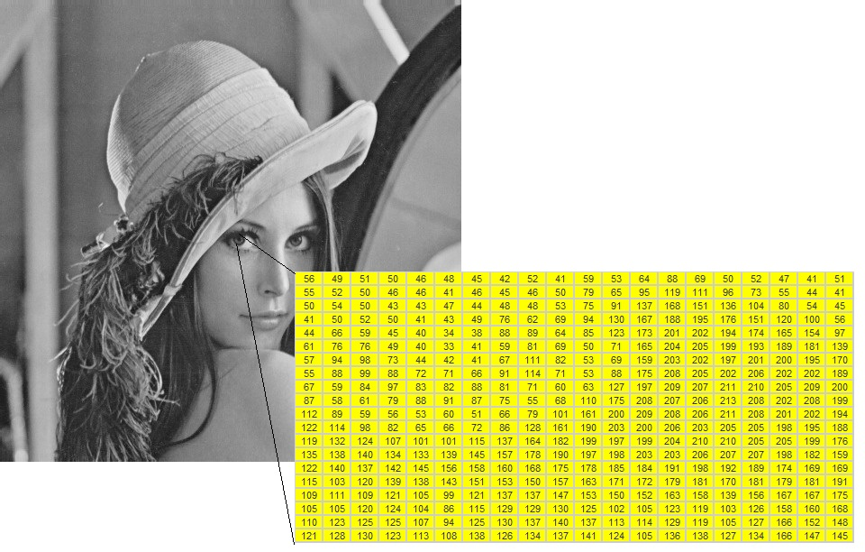

在上图中，左眼瞳仁在计算机中被存储为如图所示的一个矩阵。而在这个矩阵中，第一行第一列位置的像素值为56。

图像的所有像素值与像素位置可以形成一个离散的二元函数$y=f(r,c)$，常称这个函数为图像强度函数，其中$r$、$c$分别表示像素所在矩阵的行位置和列位置，$y$为对应位置处的像素值。

注意，OpenCV的图像矩阵的行和列的编号都是从0开始的，而R语言的矩阵的行和列的编号则是从1开始的。（这个地方，还需要多说明一下，以免混乱）

## 像素坐标系

OpenCV中的图像矩阵类（Mat）遵循像素坐标系，即以图像左上角为原点，以x轴为横轴，其正向指向右侧，以y轴为纵轴，其正向指向下侧（如图）。


在像素坐标系下，图像矩阵的列数体现了图像的宽度，而图像矩阵的行数则体现了图像的高度。

由于像素坐标系和常见平面坐标系的y轴是上下反向的，所以常见平面坐标系的左上和左下方位在像素坐标系中则为左下和左上方位。


``` r
#在常见平面坐标系下绘制矩形(左下角顶点为坐标为(20,20)，宽度和长度为为60)
plot(1:100,1:100,type="n",xlab="",ylab="") #生成空图
rect(20,20,80,80) #绘制矩形
points(20,20,pch=16,cex=1.2) #标注坐标为(20,20)的点
```


``` r
#在像素坐标系下绘制同样的矩形
img = Mat_zeros(100,100,CV_8UC1) #生成全黑图像
cv_rectangle(img,Point(20,20),Point(80,80),Scalar(255)) #绘制矩形
cv_circle(img,Point(20,20),3,Scalar(255),-1) #标注坐标为(20,20)的点
cv_imshow("矩形",img) #显示绘制结果
```

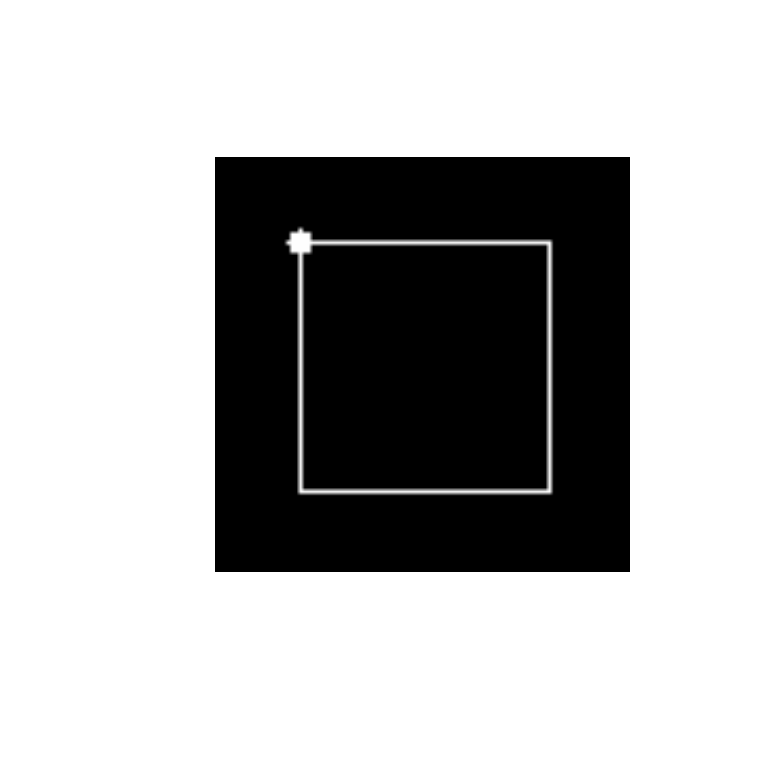


## 像素存储位数

像素存储位数决定了像素值的颜色表达能力。比如：

* 当每个像素的值用1bit来存储时，像素的颜色取值有$2^1=2$种；
* 当每个像素的值用4bit来存储时，像素的颜色取值有$2^4=16$种；
* 当每个像素的值用8bit（即一个字节）来存储时，像素的颜色取值有$2^8=256$种；
* 当每个像素的值用16bit（即两个字节）来存储时，像素的颜色取值有$2^{16}=65536$种。

以此类推，当存储像素的位数越大，则像素的颜色取值个数就越丰富。

依据图像像素的取值范围，图像可以分为多个类别，其中包括：

**二值图像/黑白图像**

二值图像 (Binary Image): 图像中每个像素的颜色值仅可以取两个值（这两个值在像素取值范围内互为按位取反结果）的图像。

**示例**

下图展示了一个20行、20列的二值图：


该图的矩阵表示为：


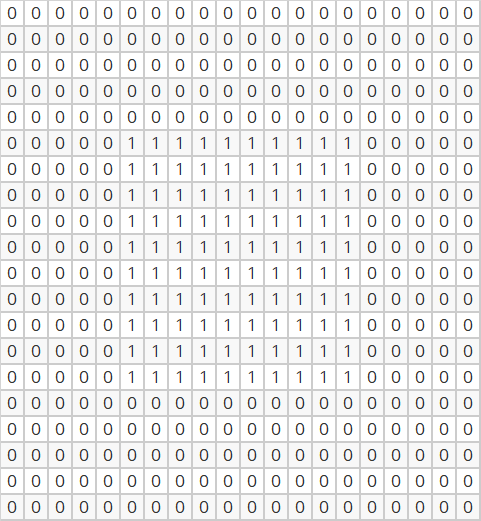


**灰度图像**

灰度图像(Gray Scale Image)，也称为灰阶图像: 图像中每个像素的颜色可以由0(黑)到255(白)的整数值表示。

**示例**

下图展示了一个16行、16列的灰度图：

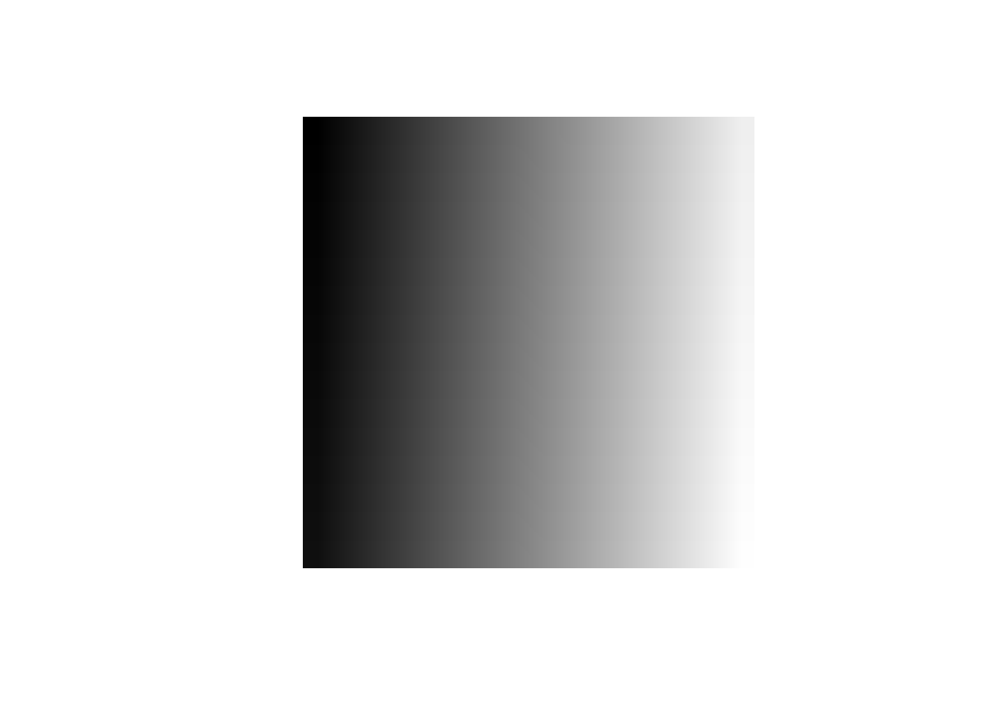

该图的矩阵表示为：


**彩色图像**  

彩色图像 (Color Image)：彩色图像的每个像素值是由三个数构成，分别表示蓝色、绿色和红色分量。这三个颜色分量可以分别形成三个矩阵：蓝色分量矩阵、绿色分量矩阵和红色分量矩阵。

**示例**

下图展示了一个10行、10列的彩色图：


该图的蓝色分量矩阵为：


该图的绿色分量矩阵为：


该图的红色分量矩阵为：


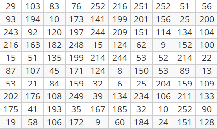


可以看到，图像中第一行、第一列位置像素的蓝、绿、红颜色分量分别为158、152和29。


在OpenCV的图像矩阵类（Mat）中，像素存储位数被定义为矩阵深度或者图像深度(depth)。OpenCV支持图像深度转换操作，比如通过Mat类实例的convertTo方法：


``` r
#生成一个32位浮点数矩阵img
img = Mat(3,3,CV_32FC1)
#生成img_mat
img_mat = matrix(seq(1.1,9.1,by=1),nr=3)
#将img_mat传入img
img$r2cv(img_mat)
#查看img的元素值（都是浮点数）
img$outToConsole()
```

```
## [1.1, 4.0999999, 7.0999999;
##  2.0999999, 5.0999999, 8.1000004;
##  3.0999999, 6.0999999, 9.1000004]
```

``` r
#将img转变为8位无符号数矩阵，结果保存为img1
img1 = Mat()
img$convertTo(img1,CV_8UC1,1,0)
#查看img1的元素值（都是整数）
img1$outToConsole()
```

```
## [  1,   4,   7;
##    2,   5,   8;
##    3,   6,   9]
```

转变深度的过程中，超出目标深度的值会被相应调整：


``` r
#生成一个32位浮点数矩阵img
img = Mat(3,3,CV_32FC1)
#生成img_mat
img_mat = matrix(seq(301.1,309.1,by=1),nr=3)
img_mat[1,1] = -30.1
#将img_mat传入img
img$r2cv(img_mat)
#查看img的元素值（都是浮点数）
img$outToConsole()
```

```
## [-30.1, 304.10001, 307.10001;
##  302.10001, 305.10001, 308.10001;
##  303.10001, 306.10001, 309.10001]
```

``` r
#将img转变为8位无符号数矩阵，结果保存为img1
img1 = Mat()
img$convertTo(img1,CV_8UC1,1,0)

#查看img1的元素值
img1$outToConsole()
```

```
## [  0, 255, 255;
##  255, 255, 255;
##  255, 255, 255]
```

## 通道数

图像通道数对应于表示图像像素值的向量维数。由于二值图像、灰度图像的像素值都是由一个数表示（即一维向量），所以通道数为1，为此也常称这两类图像为单通道图像。而彩色图像的像素值是由三个数表示（即三维向量），所以通道数为3，为此也常称彩色图像为3通道图像。在OpenCV中，还存在二通道图像、四通道图像等等。

在内存中，一个灰度图像（单通道图像）的矩阵可能是：


而对于多通道图像，每列包含与通道数相同的子列。例如，一个BGR彩色图像（三通道图像）的矩阵可能是：


在OpenCV中，通道的顺序依次是B、G、R（不是R、G、B）。

OpenCV的split函数可以拆分图像矩阵的通道，而merge函数则可以将单通道图像矩阵合并为多通道图像矩阵。


``` r
#生成3通道矩阵img
img = Mat(2,4,CV_8UC3)
#生成三维数组img_arr
img_arr = array(1:24,dim=c(2,4,3))
#将img_arr传入img
img$r2cv(img_arr)

#查看img的基本信息
rcv_matInfo(img)
```

```
## $width
## [1] 4
## 
## $height
## [1] 2
## 
## $channels
## [1] 3
## 
## $depth
## [1] 0
## 
## $type
## [1] 64
```

``` r
#拆分img的通道，结果保存在planes中
planes = stdVecOfMat()
planes$push_back(Mat())
planes$push_back(Mat())
planes$push_back(Mat())
planes$size()
```

```
## [1] 3
```

``` r
cv_split(img,planes)

#查看planes中保留的3个矩阵的元素值
planes[[0]]$outToConsole() #蓝色分量矩阵 
```

```
## [  1,   3,   5,   7;
##    2,   4,   6,   8]
```

``` r
planes[[1]]$outToConsole() #绿色分量矩阵 
```

```
## [  9,  11,  13,  15;
##   10,  12,  14,  16]
```

``` r
planes[[2]]$outToConsole() #红色分量矩阵 
```

```
## [ 17,  19,  21,  23;
##   18,  20,  22,  24]
```

``` r
#将planes中的前2个单通道图像矩阵合并为双通道图像矩阵img1
planes1 = stdVecOfMat()
planes1$push_back(planes[[0]])
planes1$push_back(planes[[1]])
img1 = Mat()
cv_merge(planes1,img1)
#查看img1的基本信息（通道数为2）
rcv_matInfo(img1)
```

```
## $width
## [1] 4
## 
## $height
## [1] 2
## 
## $channels
## [1] 2
## 
## $depth
## [1] 0
## 
## $type
## [1] 32
```

``` r
#将planes中的3个单通道图像矩阵合并为三通道图像矩阵img2
img2 = Mat()
cv_merge(planes,img2)
#查看img2的基本信息（通道数为3）
rcv_matInfo(img2)
```

```
## $width
## [1] 4
## 
## $height
## [1] 2
## 
## $channels
## [1] 3
## 
## $depth
## [1] 0
## 
## $type
## [1] 64
```

``` r
img2$outToConsole()
```

```
## [  1,   9,  17,   3,  11,  19,   5,  13,  21,   7,  15,  23;
##    2,  10,  18,   4,  12,  20,   6,  14,  22,   8,  16,  24]
```


## 存储空间

已知一幅图像的尺寸（屏幕分辨率）为$h\times w$（其中，$h$表示纵向像素点数，$w$表示横向像素点数），像素存储位数为$k$时，则该图像的存储空间$s$可以按如下公式计算：

$$
\begin{aligned}
s &= h \times w \times k \,(bit) \\
&= \frac{h \times w \times k}{8} \,(byte) \\
&= \frac{h \times w \times k}{8\times 1024} \,(kb) \\
&= \frac{h \times w \times k}{8\times 1024 \times 1024} \,(mb) \\
\end{aligned}
$$
例如：一幅画的尺寸是1024*768，像素存储位数为16bit，则它的数据量为1.5M。


``` r
1024*768*16/(8*1024*1024)
```

```
## [1] 1.5
```


## 类型

OpenCV中图像矩阵的类型（type）是结合像素存储位数/深度定义的一系列常量，其命名规则为CV_(深度/位数）+（数据类型）+（通道数）,其中数据类型有U（无符号整数）、S（有符号整数）和F（浮点数）三种。以下是OpenCV中常见的图像矩阵类型列表：

* CV_8UC1、CV_8UC3：分别表示8位无符号整数单通道图像和8位无符号整数三通道图像，颜色取值范围都为[0,255]
* CV_8SC1、CV_8SC3：分别表示8位有符号整数单通道图像和8位有符号整数三通道图像，颜色取值范围都为[-128,127]
* CV_16UC1、CV_16UC3：分别表示16位无符号整数单通道图像和16位无符号整数三通道图像，颜色取值范围都为[0,65535]
* CV_16SC1、CV_16SC3：分别表示16位有符号整数单通道图像和16位有符号整数三通道图像，颜色取值范围都为[-32768,32767]
* CV_32SC1、CV_32SC3：分别表示32位有符号整数单通道图像和32位有符号整数三通道图像，颜色取值范围都为[-2147483648,2147483647]
* CV_32FC1、CV_32FC3：分别表示32位浮点数单通道图像和32位浮点数三通道图像
* CV_64FC1、CV_64FC3：分别表示64位浮点数单通道图像和64位浮点数三通道图像

另外，CV_8UC1、CV_8SC1、CV_16UC1、CV_16SC1、CV_32FC1和CV_64FC1等单通道图像类型，可以简写为：CV_8U、CV_8S、CV_16U、CV_16S、CV_32F和CV_64F等。

## 创建图像矩阵

OpenCV的图像矩阵类Mat具有非常多的构造函数形式，其中包括：

* Mat()
* Mat(int rows, int cols, int type)
* Mat(Size size, int type)
* Mat(int rows, int cols, int type, const Scalar &s)
* Mat(Size size, int type, const Scalar &s)
* Mat(int ndims, const int *sizes, int type)
* Mat(const std::vector< int > &sizes, int type)
* Mat(int ndims, const int *sizes, int type, const Scalar &s)
* Mat(const std::vector< int > &sizes, int type, const Scalar &s) 
* Mat(const Mat &m)
* Mat(int rows, int cols, int type, void *data, size_t step=AUTO_STEP)
* Mat(Size size, int type, void *data, size_t step=AUTO_STEP)
* Mat(int ndims, const int *sizes, int type, void *data, const size_t *steps=0)
* Mat(const std::vector< int > &sizes, int type, void *data, const size_t *steps=0)
* Mat(const Mat &m, const Range &rowRange, const Range &colRange=Range::all())
* Mat(const Mat &m, const Rect &roi)
* 等等

目前，ROpenCV对应封装实现了其中的部分构造函数，可以实现：

**生成空图**


``` r
# 生成0行、0列的空图img
img = Mat()
```

**生成纯色图像**


``` r
# 生成100行、100列的8位无符号单通道图像，所有像素值都为0（即黑色）
img1 = Mat(100,100,CV_8UC1,Scalar(0))

# 生成100行、100列的8位无符号单通道图像，所有像素值都为128（即灰色）
img2 = Mat(100,100,CV_8UC1,Scalar(128))

# 生成100行、100列的8位无符号三通道图像，所有像素值都为(0,255,255)（即紫色）
img3 = Mat(100,100,CV_8UC3,Scalar(128,0,128))

# 生成100行、100列的8位无符号三通道图像，所有像素值都为(255,0,0)（即蓝色）
img4 = Mat(100,100,CV_8UC3,Scalar(255,0,0))

# 生成100行、100列的8位无符号三通道图像，所有像素值都为(0,0,0)（即绿色）
img5 = Mat(100,100,CV_8UC3,Scalar(0,255,0))

# 生成100行、100列的8位无符号三通道图像，所有像素值都为(0,0,255)（即红色）
img6 = Mat(100,100,CV_8UC3,Scalar(0,0,255))
```

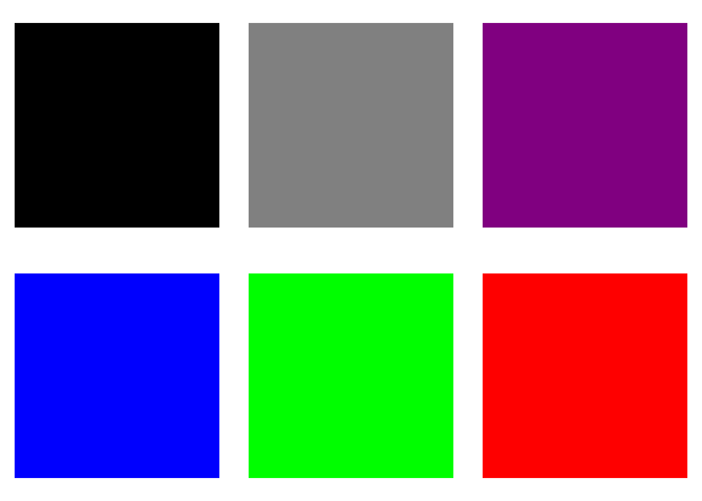

**生成单位矩阵**


``` r
#生成5行5列的64位浮点数单通道单位矩阵
E = Mat_eye(5,5,CV_64F)
E$outToConsole()
```

```
## [1, 0, 0, 0, 0;
##  0, 1, 0, 0, 0;
##  0, 0, 1, 0, 0;
##  0, 0, 0, 1, 0;
##  0, 0, 0, 0, 1]
```


``` r
#生成200行200列的64位浮点数单通道单位矩阵
E = Mat_eye(200,200,CV_64F)
cv_imshow('对角线图',E)
```

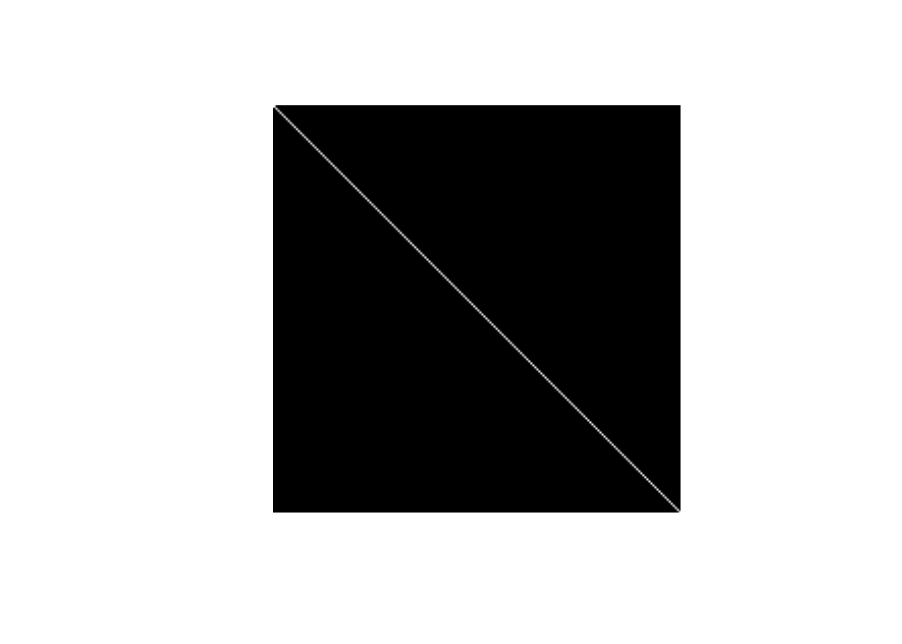

**生成全1矩阵（所有像素的取值都为1）**


``` r
#生成5行5列的32位浮点数单通道全1矩阵
O = Mat_ones(5,5,CV_32F)
O$cv2r()
```

```
##      [,1] [,2] [,3] [,4] [,5]
## [1,]    1    1    1    1    1
## [2,]    1    1    1    1    1
## [3,]    1    1    1    1    1
## [4,]    1    1    1    1    1
## [5,]    1    1    1    1    1
## attr(,"depth")
## [1] 5
```


``` r
#生成200行200列的32为浮点数单通道全1矩阵
O = Mat_ones(200,200,CV_32F)
cv_imshow('全白图',O) #显示为白色图像
```


**生成全0矩阵**


``` r
#生成3行3列的单通道全0矩阵
Z = Mat_zeros(3,3,CV_8UC1)
Z$cv2r()
```

```
##      [,1] [,2] [,3]
## [1,]    0    0    0
## [2,]    0    0    0
## [3,]    0    0    0
## attr(,"depth")
## [1] 0
```


``` r
#生成200行200列的单通道全0矩阵
Z = Mat_zeros(200,200,CV_8UC1)
cv_imshow('全黑图',Z) #显示为黑色图像
```


## 读写像素值

基本思路是：先获取图像矩阵指针，然后通过该指针获取对应的图像矩阵，再利用图像矩阵读写像素值。

### 单通道图像

**获取单通道图像的指定像素值**


``` r
# 以灰度模式读取图像文件，存放在img变量中
img = cv_imread("images/baboon.jpg",0)
# 获取第11行、第11列像素的值
img[10,10]
```

```
## [1] 196
```

**修改单通道图像的指定像素值**


``` r
#生成100行、100列的8位无符号整数图像矩阵指针img（所有像素值都为0）
img = Mat_zeros(100,100,CV_8UC1)
#将第51行的第41-60列像素和第51列的第41行-60行的像素
#都从0变为255（即由黑色变为白色）
img[50,40:59] = 255
img[40:59,50] = 255
#显示结果
cv_imshow('结果',img)
```

修改完成后显示图像，可以发现图像中部区域有一个白色小十字形。

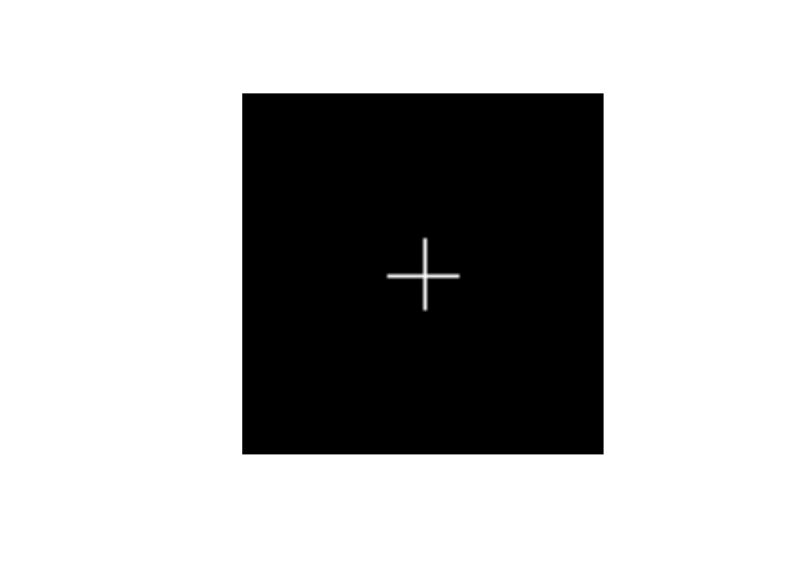

**获取单通道图像的指定区域的像素值**


``` r
#以灰度图模式读入图像数据，获得图像矩阵类指针img
img = cv_imread("images/HappyFish.jpg",0)
#通过矩阵类获取图像指定区域(第21行~35行、第31列~45列)的像素值
img[20:34,30:44]
```

```
##       [,1] [,2] [,3] [,4] [,5] [,6] [,7] [,8] [,9] [,10] [,11] [,12] [,13]
##  [1,]  180  185  195  150  147  107  143  234  255   242   255   255   255
##  [2,]  142  140  136  185  198  255  248  255  255   253   246   255   242
##  [3,]  255  255  255  253  255  227  255  251  239   255   255   255   255
##  [4,]  254  255  255  255  251  255  246  255  255   250   254   251   255
##  [5,]  255  255  254  254  254  254  254  254  254   254   254   254   254
##  [6,]  250  255  254  254  254  254  254  254  254   254   254   254   254
##  [7,]  255  255  254  254  254  254  254  254  254   254   254   254   254
##  [8,]  255  247  254  254  254  254  254  254  254   254   254   254   254
##  [9,]  241  255  254  254  254  254  254  254  254   254   254   254   254
## [10,]  247  255  254  254  254  254  254  254  254   254   254   254   254
## [11,]  255  245  254  254  254  254  254  254  254   254   254   254   254
## [12,]  248  255  254  254  254  254  254  254  254   254   254   254   254
## [13,]  241  255  254  254  254  254  254  254  254   254   254   254   254
## [14,]  240  253  254  254  254  254  254  254  254   254   254   254   254
## [15,]  249  249  254  254  254  254  254  254  254   254   254   254   254
##       [,14] [,15]
##  [1,]   255   218
##  [2,]   250   255
##  [3,]   249   251
##  [4,]   245   255
##  [5,]   254   254
##  [6,]   254   254
##  [7,]   254   254
##  [8,]   254   254
##  [9,]   254   254
## [10,]   254   254
## [11,]   254   254
## [12,]   254   254
## [13,]   254   254
## [14,]   254   254
## [15,]   254   254
```

**修改单通道图像的指定区域的像素值**


``` r
#通过img.cls将图像指定区域(第21行~35行、第31列~45列)的像素值更改为黑色
img[20:34,30:44] = 0
```

修改成功后，可以发现图像左上角出现了一个小的黑色方块。
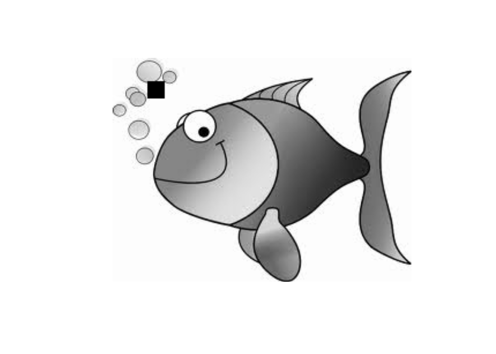

### 三通道图像

**获取三通道图像的指定像素值**


``` r
# 以默认方式读取图像文件，获得图像矩阵指针img
img = cv_imread("images/cat.jpg")
# 获取第11行、第11列像素的值
img[10,10]
```

```
## [1] 178 179 170
```

可以看到，返回的是一个三维向量，三个值依次表示第11行、第11列像素的蓝色、绿色和红色分量值。进一步，可以用如下代码提取各个颜色分量：


``` r
# 提取第11行、第11列像素的各个颜色分量
blue = img[10,10][1]
green = img[10,10][2]
red = img[10,10][3]
```

**修改三通道图像的指定像素值**


``` r
#生成100行、100列的8位无符号整数图像矩阵指针img（所有像素值都为(0,0,0)）
img = Mat_zeros(100,100,CV_8UC3)

#将第51行的第41-60列像素和第51列的第41行-60行的像素
#都从(0,0,0)变为(0,0,255)（即由黑色变为红色）
img[50,40:59] = c(0,0,255)
img[40:59,50] = c(0,0,255)

#显示结果
cv_imshow('结果',img)
```

修改完成后显示图像，可以发现图像中部区域有一个小红十字。


**获取三通道图像的指定区域的像素值**


``` r
#读入图像数据，获得图像矩阵类指针img
img = cv_imread("images/HappyFish.jpg")

#获取图像指定区域(第21行~25行、第31列~35列)的像素值
img[20:24,30:34]
```

```
## , , 1
## 
##      [,1] [,2] [,3] [,4] [,5]
## [1,]  169  173  183  139  138
## [2,]  133  131  127  176  191
## [3,]  250  250  248  248  250
## [4,]  252  251  251  251  247
## [5,]  255  253  252  252  252
## 
## , , 2
## 
##      [,1] [,2] [,3] [,4] [,5]
## [1,]  164  170  183  141  139
## [2,]  131  130  128  180  193
## [3,]  250  250  252  250  253
## [4,]  254  255  255  255  251
## [5,]  255  255  255  255  255
## 
## , , 3
## 
##      [,1] [,2] [,3] [,4] [,5]
## [1,]  215  219  223  172  167
## [2,]  167  164  154  199  211
## [3,]  255  255  255  255  255
## [4,]  255  255  255  255  252
## [5,]  252  252  251  251  253
```

**修改三通道图像指定区域的像素值**


``` r
#通过img.cls将图像指定区域(第21行~35行、第31列~45列)的像素值改为蓝色
img[20:34,30:44] = c(255,0,0)
```

修改成功后，可以发现图像左上角出现了一个小的蓝色方块。
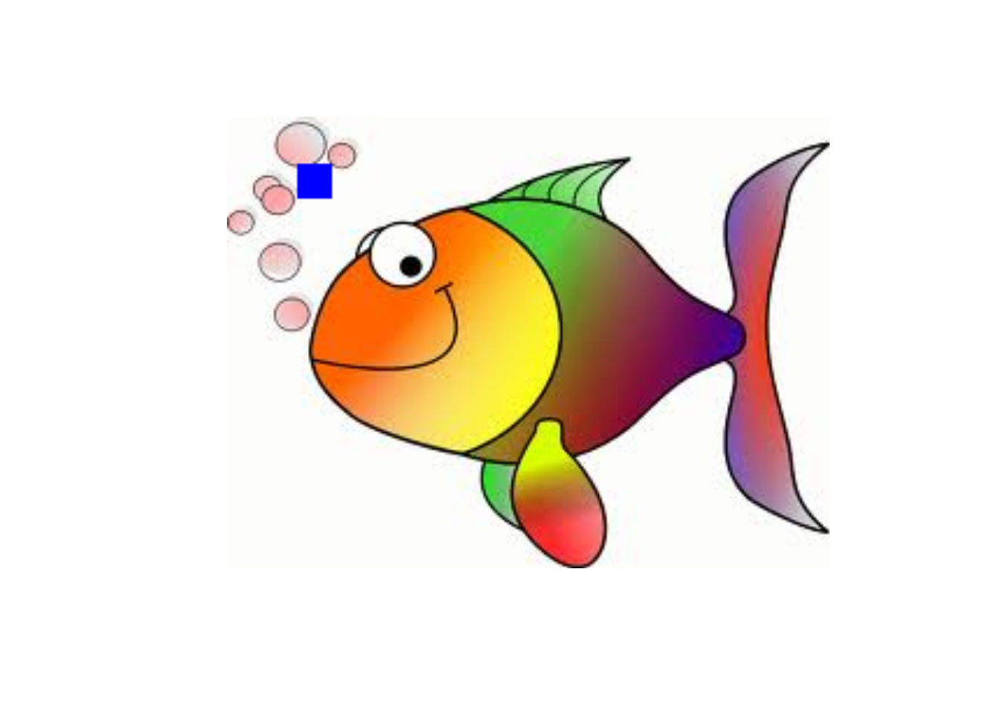


## 内存管理和引用计数

OpenCV中的图像矩阵类（Mat）本质上是由两个部分组成的类：

* 一部分矩阵头：包含信息有矩阵的大小、矩阵的像素位数/矩阵深度、矩阵通道数、矩阵存储的地址等，矩阵头部的大小是恒定的。  
* 另一部分是矩阵数据指针：指向包含了像素值的矩阵，矩阵本身的大小因图像的不同而不同，通常具有较大的数量级。

在基于OpenCV进行很多图像处理时，多个图像矩阵可以具有不同的矩阵头，却会共享相同矩阵数据（即它们的矩阵数据指针所指向的内存区域有重叠部分）。OpenCV会维护一个引用计数器，用来监测这种数据共享情况，每增加一次共享情况，OpenCV就会累加一次引用计数。只要图像内存区域的引用计数大于0，相应的内存就不会被销毁回收。


``` r
#创建无符号整数三通道图像img1
img1 = Mat(2,3,CV_8UC3)
arr = array(1:18,dim = c(2,3,3))
img1$r2cv(arr)


#获取img1图像的基本信息（宽度、高度、通道数、深度和类型）
rcv_matInfo(img1)
```

```
## $width
## [1] 3
## 
## $height
## [1] 2
## 
## $channels
## [1] 3
## 
## $depth
## [1] 0
## 
## $type
## [1] 64
```

``` r
#利用cv2r函数按行、列顺序输出img1的各个像素值
img1$cv2r()
```

```
## , , 1
## 
##      [,1] [,2] [,3]
## [1,]    1    3    5
## [2,]    2    4    6
## 
## , , 2
## 
##      [,1] [,2] [,3]
## [1,]    7    9   11
## [2,]    8   10   12
## 
## , , 3
## 
##      [,1] [,2] [,3]
## [1,]   13   15   17
## [2,]   14   16   18
## 
## attr(,"depth")
## [1] 0
```

``` r
#or
img1$outToConsole()
```

```
## [  1,   7,  13,   3,   9,  15,   5,  11,  17;
##    2,   8,  14,   4,  10,  16,   6,  12,  18]
```

``` r
#直接将img1赋值给img2，这种情况下img2和img1共享相同的图像数据
img2 = img1 
#获取img2的元素值
img2[0,0]
```

```
## [1]  1  7 13
```

``` r
#将img2的第1行、第1列像素值的蓝色分量改为255(绿色和红色分量保持不变)
img2[0,0] = c(255,img2[0,0][1],img2[0,0][2]) 

#查看img2的各个像素值
img2$outToConsole()
```

```
## [255,   1,   7,   3,   9,  15,   5,  11,  17;
##    2,   8,  14,   4,  10,  16,   6,  12,  18]
```

``` r
#查看img1的各个像素值
img1$outToConsole()
```

```
## [255,   1,   7,   3,   9,  15,   5,  11,  17;
##    2,   8,  14,   4,  10,  16,   6,  12,  18]
```

可以看到，img1的第1行、第1列像素值的蓝色分量也变成了255。


这里的img1和img2共享数据（具有相同的图像矩阵数据），当更改img2的某个像素点的颜色值时，img1的相应点的颜色值也更改为相同的值。当img2销毁时，其指向的数据所在的内存不会被重新分配------因为img1还在使用（即此时相应的引用计数大于0）。


## 获取/设置图像子区域或者感兴趣区域

很多时候，需要提取出图像的部分区域进行操作。比如，下面的例子会提取出狒狒的眼部区域：


``` r
#读取狒狒的图片文件，获得图像矩阵img
img = cv_imread("images/baboon.jpg")
#获取img指定区域smallImg
smallImg = Mat(img,Rect(120,30,260,70))
```


这里要注意，smallImg和img是共享数据的。


``` r
#在smallImg上绘制红色填充矩形
cv_rectangle(smallImg,Point(110,25),Point(150,45),Scalar(0,0,255),-1)
#显示smallImg
cv_imshow('smallImg',smallImg)
#显示img
cv_imshow('img',img)
```

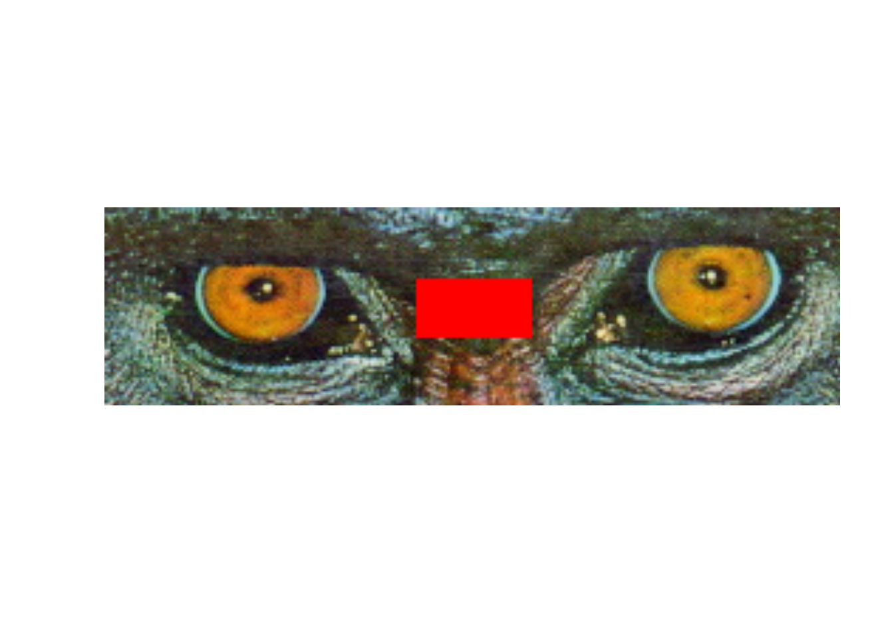

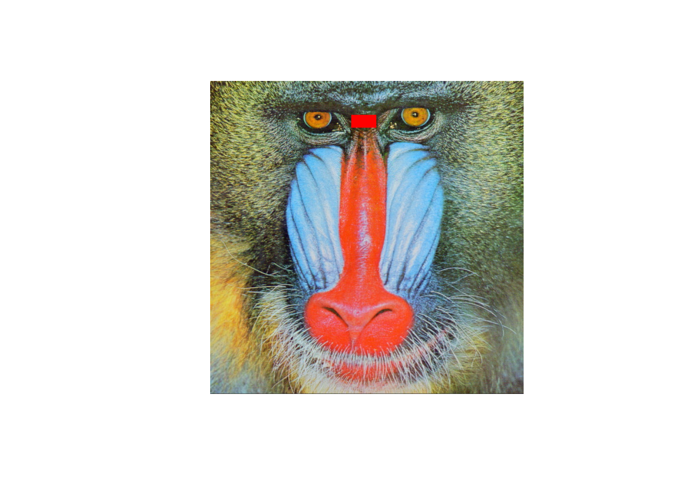

可以看到，在samllImg上添加一个红色填充矩形后，img上的相应位置也出现了红色填充矩形。

## 图像拷贝与克隆

通过拷贝和克隆操作，可以生成一个图像的拷贝体和克隆体。


``` r
#创建8位无符号整数三通道图像img1
img1 = Mat(2,3,CV_8UC3)
arr = array(1:18,dim = c(2,3,3))
img1$r2cv(arr)
#获取img1图像的基本信息（宽度、高度、通道数、深度和类型）
rcv_matInfo(img1)
```

```
## $width
## [1] 3
## 
## $height
## [1] 2
## 
## $channels
## [1] 3
## 
## $depth
## [1] 0
## 
## $type
## [1] 64
```

``` r
#输出img1的各个像素值
img1$cv2r()
```

```
## , , 1
## 
##      [,1] [,2] [,3]
## [1,]    1    3    5
## [2,]    2    4    6
## 
## , , 2
## 
##      [,1] [,2] [,3]
## [1,]    7    9   11
## [2,]    8   10   12
## 
## , , 3
## 
##      [,1] [,2] [,3]
## [1,]   13   15   17
## [2,]   14   16   18
## 
## attr(,"depth")
## [1] 0
```

``` r
#通过拷贝方式从img1生成img2
img2 = Mat()
img1$copyTo(img2)
#输出img2的各个像素值
img2$cv2r()
```

```
## , , 1
## 
##      [,1] [,2] [,3]
## [1,]    1    3    5
## [2,]    2    4    6
## 
## , , 2
## 
##      [,1] [,2] [,3]
## [1,]    7    9   11
## [2,]    8   10   12
## 
## , , 3
## 
##      [,1] [,2] [,3]
## [1,]   13   15   17
## [2,]   14   16   18
## 
## attr(,"depth")
## [1] 0
```

``` r
#通过克隆方式从img1生成img3
img3 = img1$clone()
#输出img3的各个像素值
img3$cv2r()
```

```
## , , 1
## 
##      [,1] [,2] [,3]
## [1,]    1    3    5
## [2,]    2    4    6
## 
## , , 2
## 
##      [,1] [,2] [,3]
## [1,]    7    9   11
## [2,]    8   10   12
## 
## , , 3
## 
##      [,1] [,2] [,3]
## [1,]   13   15   17
## [2,]   14   16   18
## 
## attr(,"depth")
## [1] 0
```

从输出内容看，img2和img3都与img1有相同的像素值。此外，在拷贝和克隆方式下，图像矩阵之间是不存在共享数据的。


``` r
#通过img2.cls将第1行、第1列像素值的蓝色分量改为255
img1[0,0] = c(255,img1[0,0][2],img1[0,0][3])

#输出img1的各个像素值
img1$cv2r()
```

```
## , , 1
## 
##      [,1] [,2] [,3]
## [1,]  255    3    5
## [2,]    2    4    6
## 
## , , 2
## 
##      [,1] [,2] [,3]
## [1,]    7    9   11
## [2,]    8   10   12
## 
## , , 3
## 
##      [,1] [,2] [,3]
## [1,]   13   15   17
## [2,]   14   16   18
## 
## attr(,"depth")
## [1] 0
```

``` r
#输出img2的各个像素值
img2$cv2r()
```

```
## , , 1
## 
##      [,1] [,2] [,3]
## [1,]    1    3    5
## [2,]    2    4    6
## 
## , , 2
## 
##      [,1] [,2] [,3]
## [1,]    7    9   11
## [2,]    8   10   12
## 
## , , 3
## 
##      [,1] [,2] [,3]
## [1,]   13   15   17
## [2,]   14   16   18
## 
## attr(,"depth")
## [1] 0
```

``` r
#输出img3的各个像素值
img3$cv2r()
```

```
## , , 1
## 
##      [,1] [,2] [,3]
## [1,]    1    3    5
## [2,]    2    4    6
## 
## , , 2
## 
##      [,1] [,2] [,3]
## [1,]    7    9   11
## [2,]    8   10   12
## 
## , , 3
## 
##      [,1] [,2] [,3]
## [1,]   13   15   17
## [2,]   14   16   18
## 
## attr(,"depth")
## [1] 0
```

可以看到，修改img1之后，img2和img3都没有受到影响。


