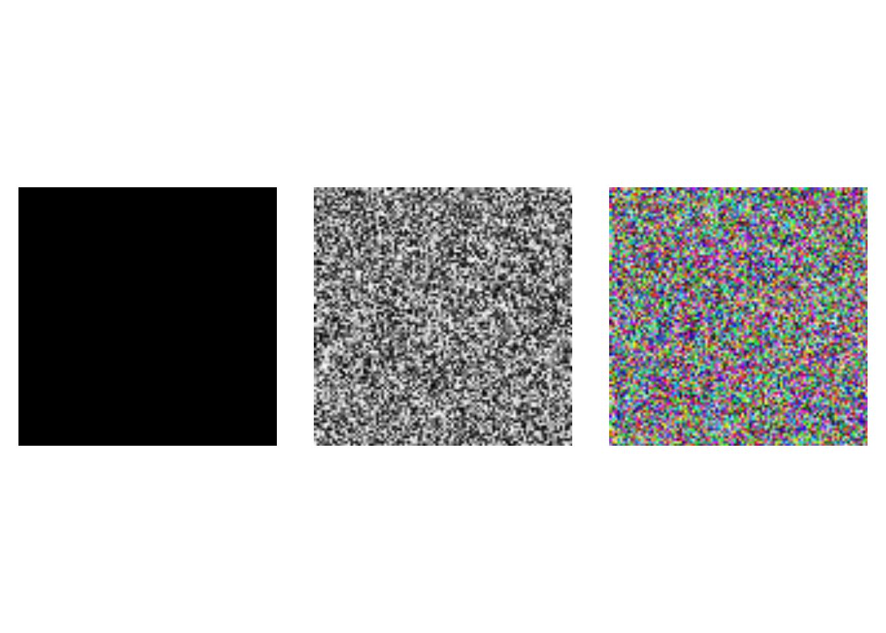
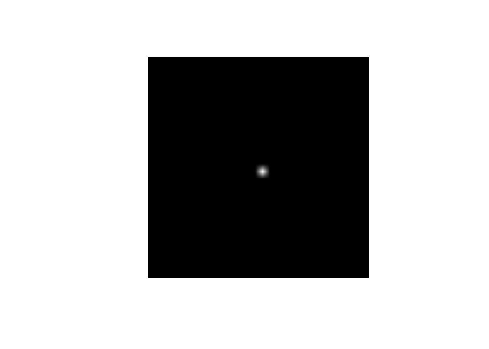
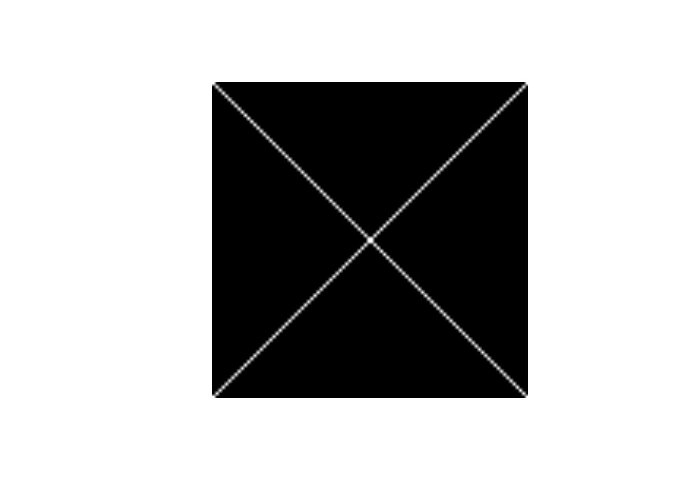
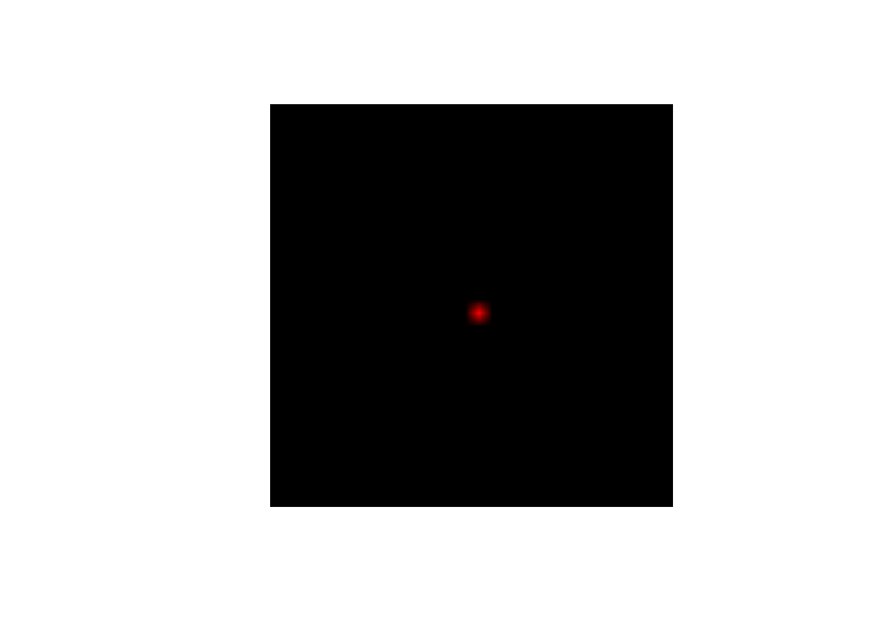
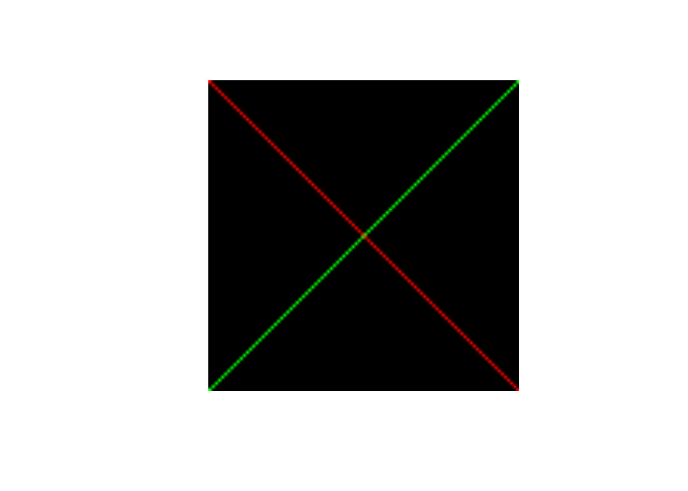
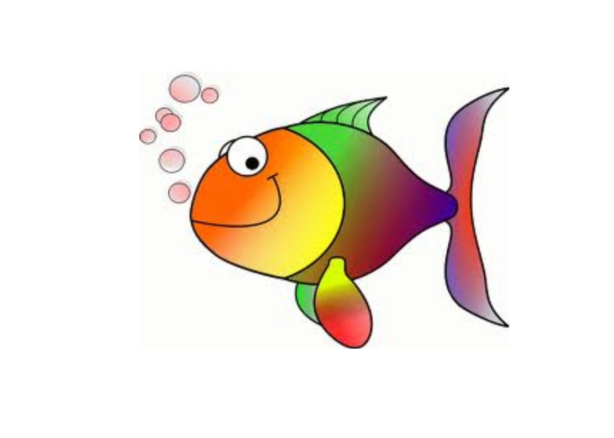
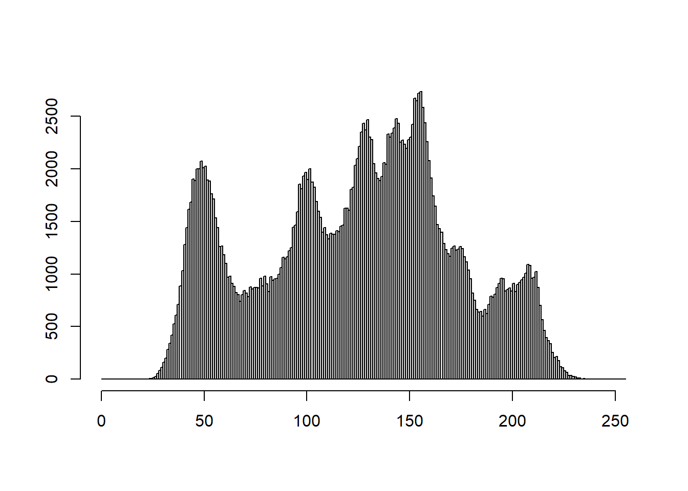
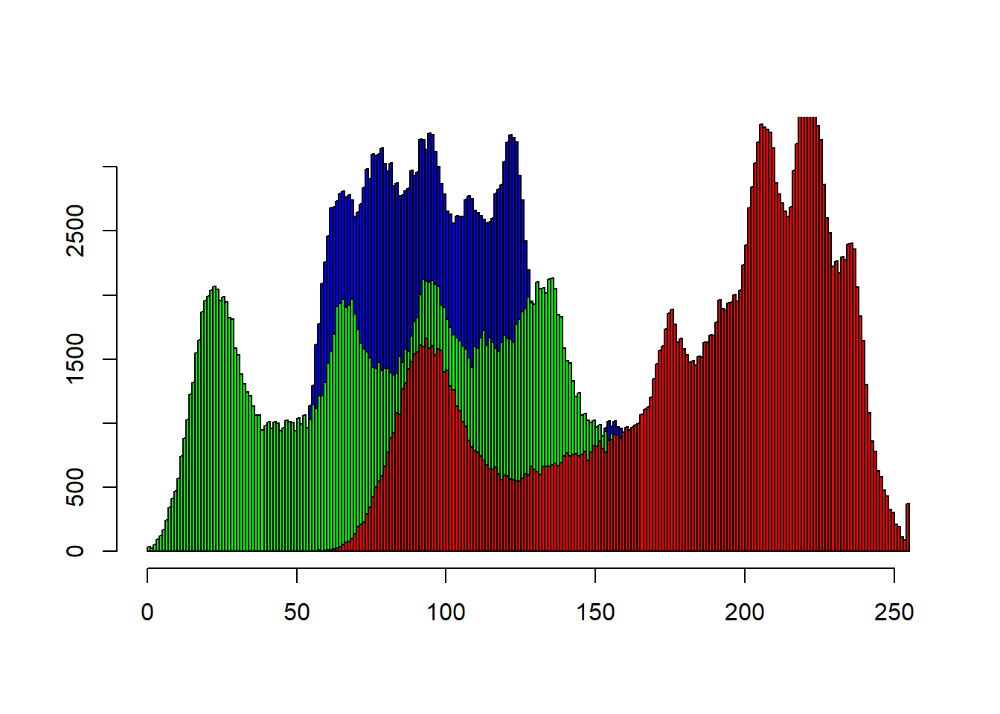
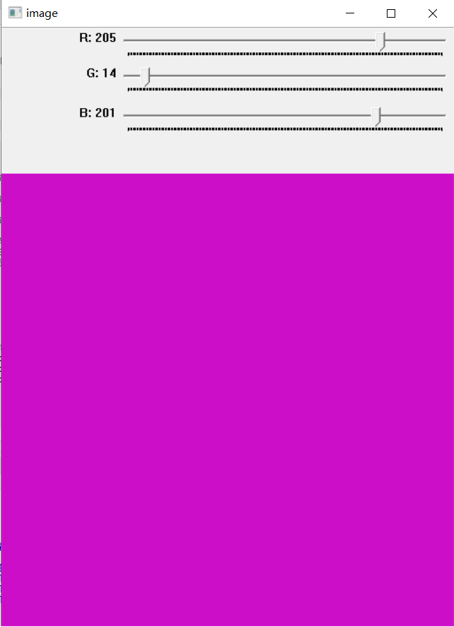
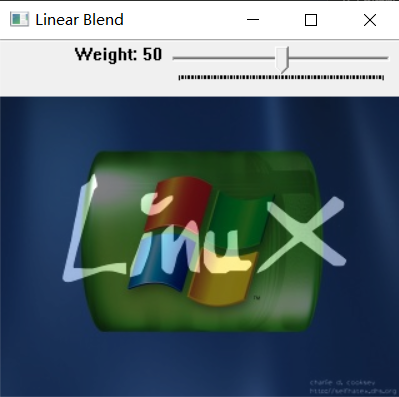

# 图像基本操作

## 输入图像

输入图像解决的是生成图像矩阵的问题，主要有三种方式：加载图像文件、利用OpenCV图像矩阵类（Mat）的构造函数和使用r2cv函数转换R语言的矩阵或者多维数组。

### 加载图像文件

OpenCV可读取的图像格式包括：

* Windows位图文件 —— BMP, DIB；
* JPEG文件 —— JPEG, JPG, JPE；
* Portable类型文件 —— PNG，PBM，PGM，PPM；
* Sun rasters —— SR，RAS；
* TIFF文件 —— TIFF，TIF;
* OpenEXR HDR文件 —— EXR;
* JPEG 2000文件 —— jp2。


通过使用**cv.imread**函数可以读取指定图像文件，而后通过**cv.imshow**函数显示图像内容。


``` r
#在当前目录中的images文件夹下，有名为HappyFish.jpg的图像文件
imgName = "images/happyfish.jpg"
#读取此文件，读取结果保存在img中，
img = cv_imread(imgName)
```

在读入图像数据时，可以指定颜色控制参数，比如以单通道灰度图模式读入图像：


``` r
imgName = "images/happyfish.jpg"
# 指定读取参数为IMREAD_GRAYSCALE，将读入的图像转换为单通道灰度图像
img = cv_imread(imgName,IMREAD_GRAYSCALE) 
#或者
img = cv_imread(imgName,0) 
```


颜色控制参数除了IMREAD_GRAYSCALE外，还有其他多种取值：

|ImreadModes                |
|:--------------------------|
|IMREAD_ANYCOLOR            |
|IMREAD_ANYDEPTH            |
|IMREAD_COLOR               |
|IMREAD_COLOR_BGR           |
|IMREAD_COLOR_RGB           |
|IMREAD_GRAYSCALE           |
|IMREAD_IGNORE_ORIENTATION  |
|IMREAD_LOAD_GDAL           |
|IMREAD_REDUCED_COLOR_2     |
|IMREAD_REDUCED_COLOR_4     |
|IMREAD_REDUCED_COLOR_8     |
|IMREAD_REDUCED_GRAYSCALE_2 |
|IMREAD_REDUCED_GRAYSCALE_4 |
|IMREAD_REDUCED_GRAYSCALE_8 |
|IMREAD_UNCHANGED           |

各个取值的作用意义可以参考OpenCV的帮助文档。

### 创建图像矩阵

除了通过加载图像文件获取图像矩阵外，还可以利用OpenCV的图像矩阵类（Mat）的构造函数创建图像矩阵，这里沿用上一章生成纯色图像的例子：


``` r
# 生成100行、100列的8位无符号单通道图像，所有像素值都为0（即黑色）
img1 = Mat(100,100,CV_8UC1,Scalar(0))

# 生成100行、100列的8位无符号单通道图像，所有像素值都为128（即灰色）
img2 = Mat(100,100,CV_8UC1,Scalar(128))

# 生成100行、100列的8位无符号三通道图像，所有像素值都为(0,255,255)（即紫色）
img3 = Mat(100,100,CV_8UC3,Scalar(128,0,128))

# 生成100行、100列的8位无符号三通道图像，所有像素值都为(255,0,0)（即蓝色）
img4 = Mat(100,100,CV_8UC3,Scalar(255,0,0))

# 生成100行、100列的8位无符号三通道图像，所有像素值都为(0,0,0)（即绿色）
img5 = Mat(100,100,CV_8UC3,Scalar(0,255,0))

# 生成100行、100列的8位无符号三通道图像，所有像素值都为(0,0,255)（即红色）
img6 = Mat(100,100,CV_8UC3,Scalar(0,0,255))
```


### 使用r2cv函数

通过先生成R语言的矩阵或多维数组，再利用r2cv函数将其传入OpenCV的图像矩阵：


``` r
# 生成100行、100列的全0矩阵img1.mat
img1_mat = matrix(0,nr=100,nc=100)
# 利用r2cv函数将img1_mat传入OpenCV的8位无符号整数单通道图像
img1 = Mat(100,100,CV_8UC1)
img1$r2cv(img1_mat) 


# 生成100行、100列的随机矩阵img2.mat
img2_mat = matrix(sample(0:255,100*100,replace = T),nr=100,nc=100)
# 利用r2cv函数将img2.mat传入OpenCV的8位无符号整数单通道图像
img2 = Mat(100,100,CV_8UC1)
img2$r2cv(img2_mat)

# 生成3维数组img3.arr
set.seed(123)
img3_arr = array(sample(0:255,100*100*3,replace = T),dim=c(100,100,3))
# 利用r2cv函数将img2.mat传入OpenCV的8位无符号整数三通道图像
img3 = Mat(100,100,CV_8UC3)
img3$r2cv(img3_arr)
```




## 获取图像基本信息

使用**iminfo**函数可以获取图像的基本信息：


``` r
#在当前目录中的images目录下，有名为HappyFish.jpg的图像文件
imgName = "images/happyfish.jpg"
#读取此文件
img = cv_imread(imgName)
#获取img的基本信息
rcv_matInfo(img)
```

```
## $width
## [1] 259
## 
## $height
## [1] 194
## 
## $channels
## [1] 3
## 
## $depth
## [1] 0
## 
## $type
## [1] 64
```

其中：

* width：表示图像的宽度
* height：表示图像的高度
* depth：表示图像的深度（即存储一个像素值所需要的字节数）
* type：表示图像矩阵的类型

这些数据表明图像矩阵有194行（height）、259列（width），有3个通道（channels）。

此外，矩阵的深度取值情况如下：


矩阵类型常见取值情况包括：


利用图像矩阵类也可以获取图形的基本信息：


``` r
#读取图像文件，获得图像矩阵指针img
img = cv_imread("images/lena.jpg")
#获取矩阵的列数（宽度）
img$cols
```

```
## [1] 512
```

``` r
#获取矩阵的行数（高度）
img$cols
```

```
## [1] 512
```

``` r
#获取矩阵的通道数
img$channels()
```

```
## [1] 3
```

``` r
#获取矩阵的深度
img$depth()
```

```
## [1] 0
```

``` r
#获取矩阵的类型
img$type()
```

```
## [1] 64
```


## 修改图像

### 单通道图像

修改单通道图像的指定像素值：


``` r
# 生成30行、30列的8位无符号整数图像矩阵指针img（所有像素值都为0）
img = Mat_zeros(30,30,CV_8UC1)
# 修改第16行、第16列像素，使其值从0变为255（即由黑色变为白色）
img[15,15] = 255
```

修改完成后显示图像，可以发现图像中部区域有一个小白点。



类似地，可以将全黑图像的主对角线上和反对角线上的像素值都改成白色：


``` r
# 生成100行、100列的全0图像矩阵指针img
img = Mat_zeros(100,100,CV_8UC1)
# 利用循环，将主对角线和反主对角线上的像素值从0变为255（即由黑色变为白色）
for(i in 0:99){
  img[i,i] = 255
  img[i,99-i] = 255
}
```

如下代码也可以达到同样目的：


``` r
# 生成100行、100列的全0矩阵img_mat
img_mat = matrix(0, 100, 100)
# 利用循环，将主对角线和反主对角线上的像素值从0变为255
for(i in 1:100){
  img_mat[i,i] = 255
  img_mat[i,100-i+1] = 255
}
# 利用r2cv函数将img_mat传入OpenCV的8位无符号整数单通道图像
img = Mat_zeros(100,100,CV_8UC1)
attr(img_mat,"depth") = img$depth()
img$r2cv(img_mat)
```




### 三通道图像

修改三通道图像的指定像素值：


``` r
# 生成30行、30列的8位无符号整数图像矩阵指针img（所有像素值都为(0,0,0)）
img = Mat_zeros(30,30,CV_8UC3)
# 修改第16行、第16列像素，使其值从(0,0,0)变为(0,0,255)，
#即由黑色变为红色
img[15,15] = c(0,0,255)
```

修改完成后显示图像，可以发现图像中部区域有一个小红点。



类似地，可以将全黑图像的主对角线上和反主对角线上的像素值分别改成红色和绿色：


``` r
# 生成100行、100列的全0图像矩阵指针img
img = Mat_zeros(100,100,CV_8UC3)
for(i in 0:99){
  # 主对角线上的像素值变为红色
  img[i,i] = c(0,0,255)
  # 反主对角线上的像素值变为绿色
  img[i,99-i] = c(0,255,0)
}
```

如下代码也可以达到同样目的：


``` r
# 生成3维数组img3_arr（所有元素全为0）
img_arr = array(0, dim = c(100,100,3))
for(i in 1:100){
  # 主对角线上的元素更改为(0,0,255)
  img_arr[i,i,] = c(0,0,255)
  # 反主对角线上的元素更改为(0,255,0)
  img_arr[i,100-i+1,] = c(0,255,0)
}
# 利用r2cv函数将img_arr传入OpenCV的8位无符号整数三通道图像
img = Mat_zeros(100,100,CV_8UC3)
attr(img_mat,"depth") = img$depth()
img$r2cv(img_arr)
```




## 输出图像

### 输出到图形窗口

通过**cv.imshow**函数产生图形窗口并在窗口中显示图像内容。


``` r
# 在当前目录中的images目录下，有名为HappyFish.jpg的图像文件
imgName = "images/happyfish.jpg"
# 读取此文件
img = cv_imread(imgName)
# 生成标题为Display window且尺寸自动按照图像大小自动缩放的窗口
cv_namedWindow("Display window",WINDOW_AUTOSIZE)
# 将读取的图像内容显示在Display window窗口中
cv_imshow("Display window",img)
```

在上面的代码中，也可以省去cv.namedWindow("Display window",WINDOW_AUTOSIZE)，即不用提前生成图形窗口，而是由**cv.imshow**函数在执行的时候自动创建图形窗口并显示图像内容。


``` r
# 在当前目录中的images目录下，有名为HappyFish.jpg的图像文件
imgName = "images/happyfish.jpg"
# 读取此文件
img = cv_imread(imgName)
# 将读取的图像内容显示在Display window窗口中
cv_imshow("Display window",img)
```




在显示32位浮点数图像之前，需要转换为8位无符号数图像，例如：


``` r
#读取图像文件，读取结果保存在img中
img = cv_imread("images/HappyFish.jpg")

#将img灰度化，结果保存在gray中
gray = Mat()
cv_cvtColor(img, gray, COLOR_BGR2GRAY)

#对gray进行Sobel边缘检测，结果保存在sobelx中，
#此时，sobelx为32位浮点数图像
sobelx = Mat()
cv_Sobel(gray, sobelx, CV_32F, 1, 0)


#获取sobelx的最小值和最大值，分别保存在minVal和maxVal中
minVal = 0
maxVal = 0
cv_minMaxLoc(sobelx, minVal, maxVal)

#利用soblex的值映射到[0,255]区间上，进而转变为8位无符号图像
draw = Mat()
sobelx$convertTo(draw,
                     CV_8U,
                     255.0 / (maxVal - minVal),
                     -minVal * 255.0 / (maxVal - minVal))
```


### 输出到命令行

通过cv2r函数可以将图像矩阵的像素值按行、列顺序输出到命令行。


``` r
# 在当前目录中的images目录下，有名为HappyFish.jpg的图像文件
imgName = "images/happyfish.jpg"
# 读取此文件
img = cv_imread(imgName)
#利用cv2r函数按行、列顺序输出img的各个像素值
img$cv2r()
```

当图像矩阵较大时，这种输出方式会产生负担，可以按如下方法调整，进而查看指定部分的像素值：


``` r
# 在当前目录中的images目录下，有名为HappyFish.jpg的图像文件
imgName = "images/happyfish.jpg"
# 读取此文件
img = cv_imread(imgName)
#查看img中第11行~第20行、第11列~第20列的内容
img[11:20,11:20]
```

```
## , , 1
## 
##       [,1] [,2] [,3] [,4] [,5] [,6] [,7] [,8] [,9] [,10]
##  [1,]  252  252  252  252  254  255  249  255  251   158
##  [2,]  252  252  252  252  254  255  252  255  251   156
##  [3,]  252  252  252  252  254  255  255  251  248   195
##  [4,]  252  252  252  252  254  255  255  252  249   228
##  [5,]  254  254  254  254  254  255  255  255  251   234
##  [6,]  255  255  255  255  255  255  250  253  250   239
##  [7,]  255  255  255  255  255  250  255  255  253   245
##  [8,]  255  255  255  255  255  255  249  255  253   251
##  [9,]  255  255  255  255  255  255  249  255  246   253
## [10,]  254  254  254  254  254  255  255  255  236   251
## 
## , , 2
## 
##       [,1] [,2] [,3] [,4] [,5] [,6] [,7] [,8] [,9] [,10]
##  [1,]  254  254  254  254  255  255  247  254  251   158
##  [2,]  254  254  254  254  255  255  248  253  250   157
##  [3,]  254  254  254  254  255  255  255  249  247   196
##  [4,]  254  254  254  254  255  254  255  250  248   228
##  [5,]  254  253  254  254  255  255  255  254  251   235
##  [6,]  253  252  253  253  255  255  255  255  252   237
##  [7,]  252  252  253  253  255  253  255  255  254   244
##  [8,]  253  253  254  254  254  255  250  255  254   252
##  [9,]  254  254  254  254  254  253  245  254  245   255
## [10,]  255  255  255  255  254  253  253  254  236   254
## 
## , , 3
## 
##       [,1] [,2] [,3] [,4] [,5] [,6] [,7] [,8] [,9] [,10]
##  [1,]  254  254  254  254  253  252  246  255  255   182
##  [2,]  254  254  254  254  253  252  247  255  255   183
##  [3,]  254  254  254  254  253  252  254  255  255   224
##  [4,]  254  254  254  254  253  249  252  255  255   255
##  [5,]  254  255  254  254  253  248  249  255  255   255
##  [6,]  255  255  255  255  251  244  239  251  255   255
##  [7,]  255  255  255  255  251  238  245  251  255   255
##  [8,]  255  255  254  254  254  254  248  255  255   255
##  [9,]  254  254  253  254  254  255  250  255  249   255
## [10,]  253  253  251  253  254  255  255  255  236   252
```

``` r
#或者利用cv2r函数将img转变为R语言的矩阵或多维数组arr
arr = img$cv2r()
#查看arr中第11行~第20行、第11列~第20列的内容
arr[11:20,11:20,]
```

```
## , , 1
## 
##       [,1] [,2] [,3] [,4] [,5] [,6] [,7] [,8] [,9] [,10]
##  [1,]  252  252  252  252  252  254  254  255  249   248
##  [2,]  252  252  252  252  252  254  255  249  255   251
##  [3,]  252  252  252  252  252  254  255  252  255   251
##  [4,]  252  252  252  252  252  254  255  255  251   248
##  [5,]  252  252  252  252  252  254  255  255  252   249
##  [6,]  254  254  254  254  254  254  255  255  255   251
##  [7,]  255  255  255  255  255  255  255  250  253   250
##  [8,]  255  255  255  255  255  255  250  255  255   253
##  [9,]  255  255  255  255  255  255  255  249  255   253
## [10,]  255  255  255  255  255  255  255  249  255   246
## 
## , , 2
## 
##       [,1] [,2] [,3] [,4] [,5] [,6] [,7] [,8] [,9] [,10]
##  [1,]  254  254  254  254  254  255  253  255  248   248
##  [2,]  254  254  254  254  254  255  255  247  254   251
##  [3,]  254  254  254  254  254  255  255  248  253   250
##  [4,]  254  254  254  254  254  255  255  255  249   247
##  [5,]  254  254  254  254  254  255  254  255  250   248
##  [6,]  253  254  253  254  254  255  255  255  254   251
##  [7,]  252  253  252  253  253  255  255  255  255   252
##  [8,]  252  252  252  253  253  255  253  255  255   254
##  [9,]  253  253  253  254  254  254  255  250  255   254
## [10,]  253  254  254  254  254  254  253  245  254   245
## 
## , , 3
## 
##       [,1] [,2] [,3] [,4] [,5] [,6] [,7] [,8] [,9] [,10]
##  [1,]  254  254  254  254  254  253  249  254  252   255
##  [2,]  254  254  254  254  254  253  252  246  255   255
##  [3,]  254  254  254  254  254  253  252  247  255   255
##  [4,]  254  254  254  254  254  253  252  254  255   255
##  [5,]  254  254  254  254  254  253  249  252  255   255
##  [6,]  255  254  255  254  254  253  248  249  255   255
##  [7,]  255  255  255  255  255  251  244  239  251   255
##  [8,]  255  255  255  255  255  251  238  245  251   255
##  [9,]  255  255  255  254  254  254  254  248  255   255
## [10,]  255  254  254  253  254  254  255  250  255   249
```

### 输出到磁盘文件

可以通过imwrite函数，将图像矩阵保存为图像文件：

使用**cv.imwrite**函数，可以将图像数据保存为硬盘文件。


``` r
# 加载当前目录中images文件夹下的cat2.jpg文件
imgName = "images/cat2.jpg"
img = cv_imread(imgName)

# 将彩色图像从BGR转换为灰度图
gray = Mat()
cv_cvtColor(img,gray,COLOR_BGR2GRAY)

# 显示原图和转换后的灰度图
cv_imshow("原图",img)
cv_imshow("灰度图",gray)

# 将灰度图像数据gray_image保存在当前目录中的images文件夹下，
# 文件名称为gray_image.jpg
cv_imwrite("images/gray_image.jpg",gray_image)
```

指令执行成功后，在当前目录中的images文件夹下，会出现gray_image.jpg文件。

要保存的文件格式由指定的文件名的扩展名决定。

***如果要从内存（而非文件）中读写图像，可以使用cv::imdecode和cv::imencode从内存而不是文件读写图像。***


## 图像的基本运算

当两个图像矩阵具有相同的高度、宽度、通道数和类型时，可以进行加减乘除运算。

**生成两个图像矩阵img1和img2**


``` r
#创建矩阵arr1、arr2和arr3
arr1 = matrix(248:253,nr=2,nc=3)
arr2 = matrix(1:6,nr=2,nc=3)
arr3 = matrix(5:0,nr=2,nc=3)
#利用r2cv函数将arr1、arr2和arr3转为OpenCV的8位无符号整数
#单通道图像img1、img2和img3
img1 = Mat(2,3,CV_8UC1)
attr(arr1,"depth")=img1$depth()
img1$r2cv(arr1)
img2 = Mat(2,3,CV_8UC1)
attr(arr2,"depth")=img2$depth()
img2$r2cv(arr2)
img3 = Mat(2,3,CV_8UC1)
attr(arr3,"depth")=img3$depth()
img3$r2cv(arr3)
```

**计算img1与img2之和**


``` r
#img1+img2，结果保存在img.add中
img_add = Mat()
cv_add(img1,img2,img_add)
#利用cv2r函数按行、列顺序输出img_add的各个像素值
img_add$cv2r()
```

```
##      [,1] [,2] [,3]
## [1,]  249  253  255
## [2,]  251  255  255
## attr(,"depth")
## [1] 0
```

``` r
# img1[,]
# img2[,]
```

图像矩阵img1和img2相加，符合通常的矩阵相加规则，即对应元素相加；此外由于图像矩阵类型为8位无符号整数，其取值范围为[0,255]，所以相加之后超过255的像素值都被截断为255。

**计算img2与img3之差**


``` r
#img2-img3，结果保存在img_sub中
img_sub = Mat()
cv_subtract(img2,img3,img_sub)
#利用cv2r函数按行、列顺序输出img_sub的各个像素值
img_sub$cv2r()
```

```
##      [,1] [,2] [,3]
## [1,]    0    0    4
## [2,]    0    2    6
## attr(,"depth")
## [1] 0
```

``` r
# img2[]
# img3[]
```

图像矩阵img2和img3相减，符合通常的矩阵相减规则，即对应元素相减；此外由于图像矩阵类型为8位无符号整数，其取值范围为[0,255]，所以相减之后小于0的像素值都被截断为0。

**计算img1与img2的乘积**


``` r
#img1*img2，结果保存在img_mul中
img_mul = Mat()
cv_multiply(img1,img2,img_mul)
#利用cv2r函数按行、列顺序输出img_mul的各个像素值
img_mul$cv2r()
```

```
##      [,1] [,2] [,3]
## [1,]  248  255  255
## [2,]  255  255  255
## attr(,"depth")
## [1] 0
```

图像矩阵img1和img2相乘，不是通常的矩阵相乘，而是对应元素相乘；此外由于图像矩阵类型为8位无符号整数，其取值范围为[0,255]，所以相乘之后大于255的像素值都被截断为255。

**计算img1与img3的商**


``` r
#img1*img2，结果保存在img_div中
img_div = Mat()
cv_divide02(img1,img3,img_div)
#利用cv2r函数按行、列顺序输出img_div的各个像素值
img_div$cv2r()
```

```
##      [,1] [,2] [,3]
## [1,]   50   83  252
## [2,]   62  126    0
## attr(,"depth")
## [1] 0
```

图像矩阵img1和img3相除，指的是对应元素相除；此外由于图像矩阵类型为8位无符号整数，其取值范围为[0,255]，所以相除之后大保留四舍五入的整数；当分母为0时，相除的结果为0。

以上单通道图像矩阵之间的加减乘除运算结论也适用于多通道图像矩阵。

**利用R语言的矩阵运算**

由于R语言封装了很强的矩阵（或者数组）运算，所以可以先将图像矩阵转变为R的矩阵（或者数组），经过计算之后，再把计算结果转变回图像矩阵。


``` r
#读取当前目录中images文件夹下名为LinuxLogo.jpg的图像文件，
#结果保存在img1中
img1 = cv_imread("images/LinuxLogo.jpg")
#读取当前目录中images文件夹下名为WindowsLogo.jpg的图像文件，
#结果保存在img2中
img2 = cv_imread("images/WindowsLogo.jpg")
#显示img1和img2
cv_imshow('LinuxLogo',img1)
cv_imshow('WindowsLogo',img2)

#利用cv2r函数将img1和img2转变为R语言的数组arr1和arr2
arr1 = img1$cv2r()
arr2 = img2$cv2r()
#用str(arr1),str(arr2)命令可以看出img1和img2是240行、320列的
#8位无符号3通道图像

#实现img1+img2，结果保存在img_add中
arr_add = arr1 + arr2
arr_add[arr_add<0] = 0
arr_add[arr_add>255] =  255
img_add = img1$clone()
img_add$r2cv(arr_add)

#实现img1-img2，结果保存在img.sub中
arr_sub = arr1 - arr2
arr_sub[arr_sub<0] = 0
arr_sub[arr_sub>255] =  255
img_sub = img1$clone()
img_sub$r2cv(arr_sub)

#实现img1*img2，结果保存在img.mul中
arr_mul = arr1 * arr2
arr_mul[arr_mul<0] = 0
arr_mul[arr_mul>255] =  255
img_mul = img1$clone()
img_mul$r2cv(arr_mul)

#实现img1/img2，结果保存在img.div中
arr_div = round(arr1 / arr2)
arr_div[arr_div<0] = 0
arr_div[arr_div==Inf] =  0 #分母为0时，结果为0
arr_div[arr_div>255] =  255
img_div = img1$clone()
img_div$r2cv(arr_div)
```


``` r
cv_destroyAllWindows()
matImgPlot(list(img_add,img_sub,img_mul,img_div))
```


## 查看图像的直方图

把图像矩阵转变为R语言的矩阵或者数组后，可以使用hist函数查看图形颜色直方图。


``` r
#读取图像文件(采用灰度图读入模式)
img = cv_imread("images/lena.jpg",0)
#利用cv2r函数将img转变为R语言的矩阵
img_mat = img$cv2r()

#生成直方图
hist(img_mat,breaks = 0:255,xlab="",ylab="",main="")
```



当读取的图像是三通道彩色图像时，可以按如下方式展示3个通道的颜色直方图：


``` r
#读取图像文件
img = cv_imread("images/lena.jpg")
#利用cv2r函数将img转变为R语言的矩阵
img_arr = img$cv2r()

#生成蓝色分量直方图
hist(img_arr[,,1],breaks = 0:255,col="blue",main="",xlab="",ylab="")
#生成红色分量直方图(叠加到上面的直方图上)
hist(img_arr[,,2],breaks = 0:255,col="green",add=T)
#生成红色分量直方图(叠加到上面的直方图上)
hist(img_arr[,,3],breaks = 0:255,col="red",add=T)
```



## 等待用户按键


``` r
#读取视频文件
cap = VideoCapture("video/vtest.avi")
#cap = VideoCapture("video/slow.flv")
#设置ret的值为TRUE
ret = TRUE
#设置引用变量，用来传递视频流读取的帧数据
frame = Mat()
#当视频流为打开状态且ret的值为TRUE是，循环播放视频
while(cap$isOpened() && ret){
  #读取视频流中的帧：
  #若读取失败（或者视频流结束），则ret的值为FALSE，循环终止，
  #若读取成功，则存入frame并显示在标题为frame的窗口中。
  ret = cap$read(frame)
  if(ret){
    cv_imshow('frame',frame)
    #调用waitKey函数暂停30毫秒，等待用户按键
    if(cv_waitKey(30)==27){
      #若按下了esc键，会终止循环（即终止播放）
      break
    }
  }
}
cap$release()
cv_destroyAllWindows()
```


## 添加滑动条控制

**示例**

当图像输出到图形窗口时，可以在图形窗口中添加滑动条，进而实现一些交互性控制。下面的代码演示了如何通过滑动条“合成”红、绿、蓝三种颜色分量，形成一个调色板功能。


``` r
#当拖动滑动条时，调用colPallette函数，实现红、绿、蓝颜色分量的合成
colPallete <- function(val, param){
  #获取红色滑动条的刻度值，作为红色分量r
  r = cv_getTrackbarPos('R','image')
  #获取绿色滑动条的刻度值，作为绿色分量g
  g = cv_getTrackbarPos('G','image')
  #获取蓝色滑动条的刻度值，作为蓝色分量b
  b = cv_getTrackbarPos('B','image')
  #生成512行512列的8位无符号3通道图像img，所有像素值都为(b,g,r)
  img = Mat(512,512,CV_8UC3,Scalar(b,g,r))
  #将img图像显示在标题为image的图形窗口上
  cv_imshow('image',img)
}

#生成标题为image的图形窗口
cv_namedWindow('image')
#在标题为image的图形窗口上生成名为R、G、B的滑动条，最小值都为0，最大值都为255，
#滑动条拖动的相应函数都为colPallete
#R、G、B滑动条的刻度分别代表红色、绿色和蓝色分量值
cv_createTrackbar("R",'image',0,255,colPallete)
cv_createTrackbar("G",'image',0,255,colPallete)
cv_createTrackbar("B",'image',0,255,colPallete)

#启用colPallete函数
colPallete(0,0)
```



**示例**

拖动滑动条，改变两个图像融合的权重：


``` r
#设置滑动条的最大值
alpha_slider_max = 100

#当拖动滑动条时，调用on_trackbar函数，进而调整两个图像的合成权重
on_trackbar = function(val, param)
{
  #获取滑动条当前值
  alpha_slider = cv_getTrackbarPos("Weight", "Linear Blend")
  #以滑动条当前值与最大值的的比值作为图像src1的权重alpha
  alpha = alpha_slider / alpha_slider_max
  #以1-alpha作为图像src2的权重beta
  beta = (1.0 - alpha)
  #按权重合成两个图像，结果保存在dst中
  dst = Mat()
  cv_addWeighted(src1, alpha, src2, beta, 0.0, dst)
  #实现合成结果
  cv_imshow("Linear Blend", dst)
}

#读取两个图像文件
src1 = cv_imread("images/LinuxLogo.jpg")
src2 = cv_imread("images/WindowsLogo.jpg")

#生成标题为Linear Blend的图形窗口
cv_namedWindow("Linear Blend", WINDOW_AUTOSIZE)
#在图形窗口中创建控制权重的滑动条
cv_createTrackbar("Weight",
                  "Linear Blend",
                  0,
                  alpha_slider_max,
                  on_trackbar)
#调用on_trackbar函数
on_trackbar(0, 0)
```





## 推荐使用方式

结合OpenCV文档，查询相关函数的用法以及相关例子


