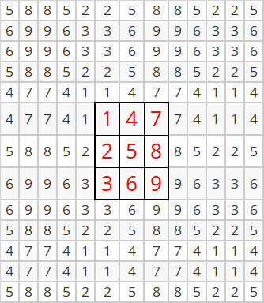
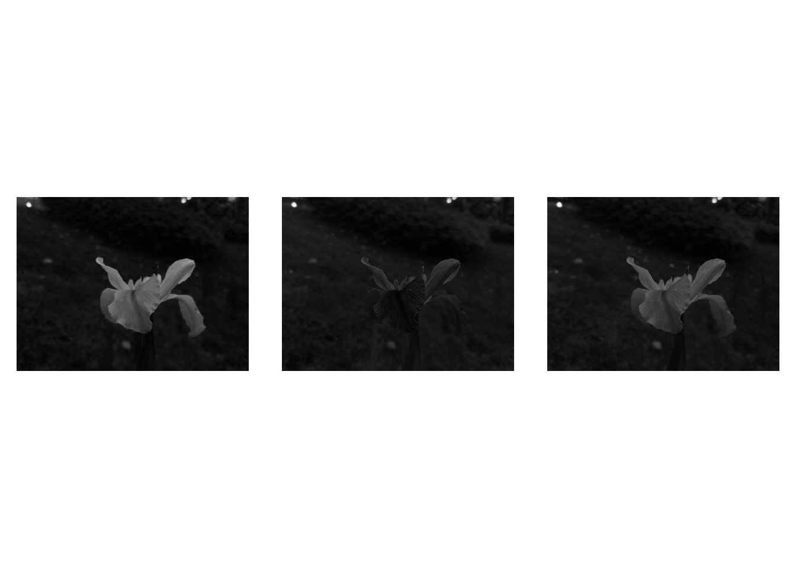

# 核心功能（核心模块）


## 遍历图像矩阵的像素

通过图像矩阵类实例的可以遍历图像矩阵的像素：


``` r
#读取图像文件，读取结果保存在img中
img = cv_imread("images/LinuxLogo.jpg")
#获取图像第112行~第116行，第167列到第171列的像素，
#并输出到命令行窗口中
for(rr in 111:115){
  for(cc in 166:170){
    #获取rr行cc列的像素值px（由于img是三通道图像，所以px包含三个值）
    px = img[rr,cc]
    #将px输出到命令行窗口中，并以竖线间隔开
    cat(px,"|")
  }
  #一行像素遍历结束后，换行
  cat("\n")
}
```

```
## 255 255 255 |254 254 254 |252 252 252 |255 255 255 |253 253 253 |
## 247 247 247 |255 255 255 |254 254 254 |252 252 252 |255 255 255 |
## 251 251 251 |254 254 254 |254 254 254 |252 252 252 |255 255 255 |
## 252 252 252 |252 252 252 |254 254 254 |252 252 252 |255 255 255 |
## 252 252 252 |253 253 253 |254 254 254 |252 252 252 |255 255 255 |
```

``` r
# 或者直接使用如下命令
# img[111:115,166:170]
```

也可以通过cv2r函数把图像矩阵转变为R语言的矩阵（或者数组），进而遍历像素：


``` r
#读入图像，获取图像img
img = cv_imread("images/LinuxLogo.jpg")
#通过cv2r函数将img转变为R语言的数组img.arr
img_arr = img$cv2r()
#获取img_arr的第112行~第116行，第167列到第171列的元素，
#并输出到命令行窗口中
for(rr in 112:116){
  for(cc in 167:171){
    #获取rr行cc列的元素值px（由于是img是三维数组，所以px包含三个值）
    px = img_arr[rr,cc,]
    #将px输出到命令行窗口中，并以竖线间隔开
    cat(px,"|")
  }
  #一行像素遍历结束后，换行
  cat("\n")
}
```

```
## 255 255 255 |254 254 254 |252 252 252 |255 255 255 |253 253 253 |
## 247 247 247 |255 255 255 |254 254 254 |252 252 252 |255 255 255 |
## 251 251 251 |254 254 254 |254 254 254 |252 252 252 |255 255 255 |
## 252 252 252 |252 252 252 |254 254 254 |252 252 252 |255 255 255 |
## 252 252 252 |253 253 253 |254 254 254 |252 252 252 |255 255 255 |
```

``` r
# 或者直接使用如下命令
# img_arr[111:115,166:170,]
```


## 使用查询表

依据从前面的知识可知，8位无符号单通道图像的颜色数有$2^8=256$个，而8位无符号三通道图像的颜色数则有$2^8 \times 2^8 \times 2^8 \approx1600$万颜色值。使用如此多的颜色会严重影响我们的算法性能。事实上，有时只需与很少颜色就能得到相同的最终结果。所以，在一些情况下，我们通常会减少颜色空间。比如将颜色除以一个整数，然后向下取整再乘以该整数，就可以得到更少的颜色（见如下公式）。例如将颜色值除以10，向下取整后再乘以10（见如下公式），那么0到9之间的每个值变为0，10到19之间的每个值变为10，以此类推。

$$
I_{new} = \left \lfloor \frac{I_{old}}{10} \right \rfloor \times 10
$$


``` r
#按灰度方式读入图像，获取图像矩阵img
img = cv_imread("images/HappyFish.jpg",0)
#用cv2r函数将img转变为R语言的矩阵
img_mat = img$cv2r()
#查询img.mat中存在多少个颜色值
length(unique(c(img_mat)))
```

```
## [1] 256
```

``` r
#查看img_mat第1行~第6行、第1列~第6列的数据
img_mat[1:6,1:6]
```

```
##      [,1] [,2] [,3] [,4] [,5] [,6]
## [1,]  254  254  254  254  254  254
## [2,]  254  254  254  254  254  254
## [3,]  254  254  254  254  254  254
## [4,]  254  254  254  254  254  254
## [5,]  254  254  254  254  254  254
## [6,]  254  254  254  254  254  254
```

``` r
#基于查询表获取img_mat原来数值对应的新值，并进行更新
for(i in 1:nrow(img_mat)){
  for(j in 1:ncol(img_mat)){
    img_mat[i,j] = floor(img_mat[i,j]/10)*10
  }
}
#更新之后，再次查询img.mat中存在多少个颜色值
length(unique(c(img_mat)))
```

```
## [1] 26
```

``` r
#利用r2cv函数，将img_mat转变为OpenCV的图像矩阵
img1 = img$clone()
img1$r2cv(img_mat)
```


由于除法和乘法运算操作对于一个系统来说是比较耗时的，这时候一个明智的做法是预先计算所有可能的值并将结果存放在"查询表（Lookup table）"中，而后通过查表操作依据$I_{old}$得到$I_{new}$。"查询表"是一个简单的数组（具有一个或多个维度），体现着输入值和输出值的对应关系。它的优点是可以避开耗时的计算，而只需要查询并读取结果。


``` r
#生成查询表lookuptbl
lookuptbl = c(rep(0:24,each=10)*10,rep(250,6))
#基于查询表，可以快速查找I_old（比如87）对应的I_new（为80）
I_old = 87
I_new = lookuptbl[I_old]
I_new
```

```
## [1] 80
```

``` r
#按灰度方式读入图像，获取图像矩阵img
img = cv_imread("images/HappyFish.jpg",0)
#用cv2r函数将img转变为R语言的矩阵
img_mat = img$cv2r()
#查询img.mat中存在多少个颜色值
length(unique(c(img_mat)))
```

```
## [1] 256
```

``` r
#查看img_mat第1行~第6行、第1列~第6列的数据
img_mat[1:6,1:6]
```

```
##      [,1] [,2] [,3] [,4] [,5] [,6]
## [1,]  254  254  254  254  254  254
## [2,]  254  254  254  254  254  254
## [3,]  254  254  254  254  254  254
## [4,]  254  254  254  254  254  254
## [5,]  254  254  254  254  254  254
## [6,]  254  254  254  254  254  254
```

``` r
#生成img_new_mat，尺寸与img_mat相同，所有元素为0
img_new_mat = matrix(0,nr=nrow(img_mat),nc=ncol(img_mat))
#基于查询表获取img_mat原来数值对应的新值，并更新img_new_mat对应的值
for(i in 1:nrow(img_mat)){
  for(j in 1:ncol(img_mat)){
    I_old = img_mat[i,j]+1 #因颜色值以0开始,故而加1
    I_new = lookuptbl[I_old]
    img_new_mat[i,j] = I_new
  }
}
#查询img.new.mat中存在多少个颜色值
length(unique(c(img_new_mat)))
```

```
## [1] 26
```

``` r
#利用r2cv函数，将img.new.mat转变为OpenCV的图像矩阵
img1 = img$clone()
attr(img_new_mat,"depth")=img1$depth()
img1$r2cv(img_new_mat)
```

下图左边是原始图像，右边是压缩了颜色空间之后的图像。


***我们的测试操作如下：读入图像（它可以是彩色或灰度），指定用于缩减算法的整数值。然后使用三种方法对图像进行扫描，转换读取到的颜色值，并打印出所花的时间（代码形式如下）。***


## 计算操作时间

在OpenCV中，可以通过如下方式计算一些计算操作消耗的时间：


``` r
#获取时间刻度t1，作为计时开始点
t1= cv_getTickCount()

#开始进行一些计算
#……
#计算结束

#获取时间刻度t2，作为计时结束点
t2 = cv_getTickCount()
#打印出从t1到t2所经历的时间(单位：秒)
sprintf("Times passed in seconds: %f",(t2-t1)/cv_getTickFrequency())
```

比如，计算直接使用乘法、除法操作压缩狒狒图像颜色空间时所消耗的时间：


``` r
#获取时间刻度t1，作为计时开始点
t1= cv_getTickCount()

#加载图像文件
img = cv_imread("images/baboon.jpg")
#用cv2r函数将img转变为R语言的数组
img_arr = img$cv2r()

#对img_arr包含的3个矩阵的每个元素通过乘除运算压缩颜色空间
for(i in 1:nrow(img_arr)){
  for(j in 1:ncol(img_arr)){
    img_arr[i,j,] = floor(img_arr[i,j,]/10)*10
  }
}

#利用r2cv函数，将img.arr转变为OpenCV的图像矩阵
img1 = img$clone()
img1$r2cv(img_arr)

#获取时间刻度t2，作为计时结束点
t2 = cv_getTickCount()
#打印出从t1到t2所经历的时间(单位：秒)
sprintf("Times passed in seconds: %f",(t2-t1)/cv_getTickFrequency())
```

```
## [1] "Times passed in seconds: 0.530430"
```

而在使用查询表时所消耗的时间：


``` r
#生成查询表lookuptbl
lookuptbl = c(rep(0:24,each=10)*10,rep(250,6))

#获取时间刻度t1，作为计时开始点
t1= cv_getTickCount()

#加载图像文件
img = cv_imread("images/baboon.jpg")
#用cv2r函数将img转变为R语言的数组
img_arr = img$cv2r()

#对img_arr包含的3个矩阵的每个元素通过查询表压缩颜色空间
for(i in 1:nrow(img_arr)){
  for(j in 1:ncol(img_arr)){
    img_arr[i,j,] = lookuptbl[img_arr[i,j,]+1] #这里加1，是因为颜色值是以0开始的
  }
}

#利用r2cv函数，将img.arr转变为OpenCV的图像矩阵
img1 = img$clone()
img1$r2cv(img_arr)

#获取时间刻度t2，作为计时结束点
t2 = cv_getTickCount()
#打印出从t1到t2所经历的时间(单位：秒)
sprintf("Times passed in seconds: %f",(t2-t1)/cv_getTickFrequency())
```

```
## [1] "Times passed in seconds: 0.507315"
```

可以看到，单独使用查询表方式，较之于直接使用乘除运算方式而言，时间消耗并没有优势。若在基于查询表的基础之上，再结合向量运算时（R语言的向量运算很强），时间消耗会大大减少：


``` r
#生成查询表lookuptbl
lookuptbl = c(rep(0:24,each=10)*10,rep(250,6))

#获取时间刻度t1，作为计时开始点
t1= cv_getTickCount()

#加载图像文件
img = cv_imread("images/baboon.jpg")
#用cv2r函数将img转变为R语言的数组
img_arr = img$cv2r()

#对img_arr包含的3个矩阵的每个元素通过查询表和数组操作压缩颜色空间
img_arr[,,] = array(lookuptbl[img_arr+1],dim = dim(img_arr))

#利用r2cv函数，将img.arr转变为OpenCV的图像矩阵
img1 = img$clone()
img1$r2cv(img_arr)

#获取时间刻度t2，作为计时结束点
t2 = cv_getTickCount()
#打印出从t1到t2所经历的时间(单位：秒)
sprintf("Times passed in seconds: %f",(t2-t1)/cv_getTickFrequency())
```

```
## [1] "Times passed in seconds: 0.218667"
```

下图左边是狒狒原始图像，右边是颜色空间压缩结果：


## 扩展图像边缘

可以使用copyMakeBorder函数扩展图像边缘，形成一些边框效果。

### BORDER_REPLICATE方式  


``` r
#生成3行3列的矩阵img_mat
img_mat = matrix(1:9,nr=3,nc=3)
#通过r2cv函数将img_mat转变为图像矩阵img
img = Mat_zeros(3,3,CV_8UC1)
attr(img_mat,"depth") = img$depth()
img$r2cv(img_mat)

#设定图像上、下、左、右四侧需要扩展的像素个数
sz = 3
#扩展图像边缘，扩展结果存入img.borderadded
img_borderadded = Mat()
cv_copyMakeBorder(img,img_borderadded,sz,sz,sz,sz,BORDER_REPLICATE)

#通过cv2r函数，获得img_borderadded的像素值
img_borderadded_mat = img_borderadded$cv2r()
img_borderadded_mat %>% knitr::kable()
```


``` r
#读入图像，存放在img变量中
img = cv_imread("images/lena.jpg")
# 获取图像img的基本信息（含高度、宽度尺寸）
img_info = rcv_matInfo(img)

#设定图像上、下、左、右四侧需要扩展的像素个数
sz = 50
# 扩展图像边缘，扩展结果存入img.borderadded
img_borderadded = Mat()
cv_copyMakeBorder(img,img_borderadded,sz,sz,sz,sz,BORDER_REPLICATE)
#绘制蓝色矩形框，框外部分就是扩展的边缘
cv_rectangle(
  img_borderadded,
  Rect(51,51,img_info$width,img_info$height),
  Scalar(255,0,0),2
)

cv_imshow("ori",img)
cv_imshow("BORDER_REPLICATE",img_borderadded)
```


### BORDER_REFLECT方式  


``` r
#生成3行3列的矩阵img_mat
img_mat = matrix(1:9,nr=3,nc=3)
#通过r2cv函数将img_mat转变为opencv图像img
img = Mat(3,3,CV_8UC1)
attr(img_mat,"depth") = img$depth()
img$r2cv(img_mat)

#设定图像上、下、左、右四侧需要扩展的像素个数
sz = 5
#扩展图像边缘，扩展结果存入img_borderadded
img_borderadded = Mat()
cv_copyMakeBorder(img,img_borderadded,sz,sz,sz,sz,BORDER_REFLECT)

#通过cv2r函数，获得img.borderadded的像素值
img_borderadded_mat = img_borderadded$cv2r()
img_borderadded_mat %>% knitr::kable()
```




``` r
#读入图像，存放在img变量中
img = cv_imread("images/chicky_512.png")
#获取图像img的基本信息（含高度、宽度尺寸）
img_info = rcv_matInfo(img)

#设定图像上、下、左、右四侧需要扩展的像素个数
sz = 50
# 扩展图像边缘，扩展结果存入img_borderadded
img_borderadded = Mat()
cv_copyMakeBorder(img,img_borderadded,sz,sz,sz,sz,BORDER_REFLECT)
#绘制蓝色矩形框，框外部分就是扩展的边缘
cv_rectangle(
  img_borderadded,
  Rect(51,51,img_info$width,img_info$height),
  Scalar(0,255,255),2
)

cv_imshow("ori",img)
cv_imshow("BORDER_REFLECT",img_borderadded)
```


 
### BORDER_WRAP方式  


``` r
#生成3行3列的矩阵img_mat
img_mat = matrix(1:9,nr=3,nc=3)
#通过r2cv函数将img_mat转变为opencv图像img
img = Mat(3,3,CV_8UC1)
attr(img_mat,"depth") = img$depth()
img$r2cv(img_mat)

#设定图像上、下、左、右四侧需要扩展的像素个数
sz = 5
#扩展图像边缘，扩展结果存入img.borderadded
img_borderadded = Mat()
cv_copyMakeBorder(img,img_borderadded,sz,sz,sz,sz,BORDER_WRAP)

#通过cv2r函数，获得img_borderadded的像素值
img_borderadded_mat = img_borderadded$cv2r()
img_borderadded_mat %>% knitr::kable()
```


``` r
#读入图像，存放在img变量中
img = cv_imread("images/baboon.jpg")
# 获取图像img的基本信息（含高度、宽度尺寸）
img_info = rcv_matInfo(img)

#设定图像上、下、左、右四侧需要扩展的像素个数
sz = 50
# 扩展图像边缘，扩展结果存入img_borderadded
img_borderadded = Mat()
cv_copyMakeBorder(img,img_borderadded,sz,sz,sz,sz,BORDER_WRAP)

#绘制蓝色矩形框，框外部分就是扩展的边缘
cv_rectangle(
  img_borderadded,
  Rect(51,51,img_info$width,img_info$height),
  Scalar(255,0,0),2
)


cv_imshow("ori",img)
cv_imshow("BORDER_WRAP",img_borderadded)
```


### BORDER_CONSTANT方式  


``` r
#生成3行3列的矩阵img_mat
img_mat = matrix(1:9,nr=3,nc=3)
#通过r2cv函数将img_mat转变为opencv图像img
img = Mat(3,3,CV_8UC1)
attr(img_mat,"depth") = img$depth()
img$r2cv(img_mat)


# 设定图像上、下、左、右四侧需要扩展的像素个数
sz = 3
# 扩展图像边缘(扩充像素的颜色为0)，扩展结果存入img_borderadded
img_borderadded = Mat()
cv_copyMakeBorder(img,img_borderadded,sz,sz,sz,sz,BORDER_CONSTANT,Scalar(0))

#通过cv2r函数，获得img_borderadded的像素值
img_borderadded_mat = img_borderadded$cv2r()
img_borderadded_mat %>% knitr::kable()
```


``` r
# 读入图像，存放在img变量中
img = cv_imread("images/cat.jpg")
# 获取图像img的基本信息（含高度、宽度尺寸）
img_info = rcv_matInfo(img)

#设定图像上、下、左、右四侧需要扩展的像素个数
sz = 50
# 扩展图像边缘，扩展结果存入img_borderadded
img_borderadded = Mat()
cv_copyMakeBorder(img,img_borderadded,sz,sz,sz,sz,BORDER_CONSTANT,Scalar(128,128,128))

#绘制蓝色矩形框，框外部分就是扩展的边缘
cv_rectangle(
  img_borderadded,
  Rect(51,51,img_info$width,img_info$height),
  Scalar(255,0,0),2
)

cv_imshow("ori",img)
cv_imshow("BORDER_CONSTANT",img_borderadded)
```


### BORDER_DEFAULT或者BORDER_REFLECT_101方式


``` r
#生成3行3列的矩阵img_mat
img_mat = matrix(1:9,nr=3,nc=3)
#通过r2cv函数将img_mat转变为opencv图像img
img = Mat(3,3,CV_8UC1)
attr(img_mat,"depth") = img$depth()
img$r2cv(img_mat)

# 设定图像上、下、左、右四侧需要扩展的像素个数
sz = 5
# 扩展图像边缘，扩展结果存入img_borderadded
img_borderadded = Mat()
cv_copyMakeBorder(img,img_borderadded,sz,sz,sz,sz,BORDER_DEFAULT)

# 通过cv2r函数，获得img_borderadded的像素值
img_borderadded_mat = img_borderadded$cv2r()
img_borderadded_mat %>% knitr::kable()
```


``` r
# 读入图像，存放在img变量中
img = cv_imread("images/HappyFish.jpg")
# 获取图像img的基本信息（含高度、宽度尺寸）
img_info = rcv_matInfo(img)

#设定图像上、下、左、右四侧需要扩展的像素个数
sz = 50
# 扩展图像边缘，扩展结果存入img.borderadded
img_borderadded = Mat()
cv_copyMakeBorder(img,img_borderadded,sz,sz,sz,sz,BORDER_DEFAULT)

#绘制蓝色矩形框，框外部分就是扩展的边缘
cv_rectangle(
  img_borderadded,
  Rect(51,51,img_info$width,img_info$height),
  Scalar(255,0,0),2
)


cv_imshow("ori",img)
cv_imshow("BORDER_DEFAULT",img_borderadded)
```


**示例**


``` r
#指定边缘扩展方式
borderType = expr(BORDER_CONSTANT)
#指定图形窗口的标题
window_name = "copyMakeBorder Demo"

#读取图像文件
src = cv_imread("images/lena.jpg")
#获取图像基本信息
src_info = rcv_matInfo(src)
#生成图形窗口
cv_namedWindow(window_name, WINDOW_AUTOSIZE)

#指定上、下、左、右需要扩展的像素个数
top = round(0.1 * src_info$height)
bottom = top
left = round(0.1 * src_info$width)
right = left

#循环进行边缘扩展处理
while (TRUE)
{
  #生成随机颜色值，当边缘扩展方式为BORDER_CONSTANT时使用该值
  value = Scalar(runif(1, 0, 255), runif(1, 0, 255), runif(1, 0, 255))
  
  #扩展图像边缘，结果保存在dst中
  dst = Mat()
  cv_copyMakeBorder(src, dst, top, bottom, left, right, borderType, value)
  
  #绘制蓝色矩形框，框外部分就是扩展的边缘
  cv_rectangle(
    dst,
    Rect(left,top,src_info$width,src_info$height),
    Scalar(255,0,0),2
  )
  
  #再图形窗口中显示边缘扩展结果
  cv_imshow(window_name, dst)
  #等待500毫秒，以便接受用户键盘输入
  cc = cv_waitKey(500)
  if (cc == 27){
    #当用户按下esc键时，退出循环
    break
  }else if (cc == charToRaw('c')){
    #当用户按下c键时，则边缘扩展方式为BORDER_CONSTANT
    borderType = expr(BORDER_CONSTANT)
  }else if (cc == charToRaw('r')){
    #当用户按下r键时，则边缘扩展方式为BORDER_REPLICATE
    borderType = expr(BORDER_REPLICATE)
  }else if (cc == charToRaw('e')){
    #当用户按下e键时，则边缘扩展方式为BORDER_REFLECT
    borderType = expr(BORDER_REFLECT)
  }else if (cc == charToRaw('w')){
    #当用户按下w键时，则边缘扩展方式为BORDER_WRAP
    borderType = expr(BORDER_WRAP)
  }else if (cc == charToRaw('d')){
    #当用户按下d键时，则边缘扩展方式为BORDER_DEFAULT
    borderType = expr(BORDER_DEFAULT)
  }
}
```


## 图像矩阵标准化/归一化

图像矩阵标准化/归一化指的是通过一定方式将图像矩阵的像素值放缩到指定的区间范围内，而常见的标准化方式有：

**最小最大值标准化**

所使用的公式为：

$$
I_1=\frac{I-min(I)}{max(I)-min(I)}
$$
其中，$min(I)$、$max(I)$分别表示图像矩阵中$I$的最小像素值和最大像素值。从公式可以推知，经最小最大值标准化之后，图像的像素值都被放缩到[0,1]区间上。


``` r
#依据公式定义最小最大值标准化函数scale_minmax
scale_minmax = function(I){
  (I-min(I))/(max(I)-min(I))
}
#生成矩阵
img_mat = matrix(1:12,nr=3,nc=4)
#应用scale_minmax函数
img_mat = scale_minmax(img_mat)
#查看标准化结果
round(img_mat,2)
```

```
##      [,1] [,2] [,3] [,4]
## [1,] 0.00 0.27 0.55 0.82
## [2,] 0.09 0.36 0.64 0.91
## [3,] 0.18 0.45 0.73 1.00
```

利用OpenCV中的**normalize**函数，指定标准化类型为NOMR_MINMAX，可以实现图像矩阵的最小最大值标准化：


``` r
#生成矩阵
img_mat = matrix(1:12,nr=3,nc=4)
#利用r2cv函数将img_mat转变为图像矩阵
img = Mat(3,4,CV_8UC1)
attr(img_mat,"depth") = img$depth()
img$r2cv(img_mat)

#对img进行NORM_MINMAX标准化，返回的矩阵深度为32位浮点数（存储的是[0,1]区间上的值）
img_norm = Mat()
cv_normalize(img,img_norm,norm_type=NORM_MINMAX,dtype=CV_32F)
#查看标准化结果
round(img_norm$cv2r(),2)
```

```
##      [,1] [,2] [,3] [,4]
## [1,] 0.00 0.27 0.55 0.82
## [2,] 0.09 0.36 0.64 0.91
## [3,] 0.18 0.45 0.73 1.00
## attr(,"depth")
## [1] 5
```

**$L_\infty$范数标准化**

所使用的公式为：

$$
I_1=\frac{I}{max \left | I \right |}
$$
其中，$=max \left | I \right |$表示对图像矩阵的像素值取绝对值后再取最大值。从公式可以推知，经最小最大值标准化之后，图像的像素值都被放缩到[-1,1]区间上。


``` r
#依据公式定义最小最大值标准化函数scale_inf
scale_inf = function(I){
  I/max(abs(I))
}
#生成矩阵
img_mat = matrix(1:12,nr=3,nc=4)
#应用scale_inf函数
img_mat = scale_inf(img_mat)
#查看标准化结果
round(img_mat,2)
```

```
##      [,1] [,2] [,3] [,4]
## [1,] 0.08 0.33 0.58 0.83
## [2,] 0.17 0.42 0.67 0.92
## [3,] 0.25 0.50 0.75 1.00
```

利用OpenCV中的**normalize**函数，指定标准化类型为NOMR_INF，可以实现图像矩阵的$L_\infty$范数标准化：


``` r
#生成矩阵
img_mat = matrix(1:12,nr=3,nc=4)
#利用r2cv函数将img_mat转变为图像矩阵
img = Mat(3,4,CV_8UC1)
attr(img_mat,"depth") = img$depth()
img$r2cv(img_mat)

#对img进行NORM_INF标准化，返回的矩阵深度为32位浮点数（因为存储的是[-1,1]区间上的值）
img_norm = Mat()
cv_normalize(img,img_norm,norm_type = NORM_INF,dtype = CV_32F)

#查看标准化结果
round(img_norm$cv2r(),2)
```

```
##      [,1] [,2] [,3] [,4]
## [1,] 0.08 0.33 0.58 0.83
## [2,] 0.17 0.42 0.67 0.92
## [3,] 0.25 0.50 0.75 1.00
## attr(,"depth")
## [1] 5
```

**$L_1$范数标准化**

所使用的公式为：

$$
I_1=\frac{I}{sum \left | I \right |}
$$
其中，$sum \left | I \right |$表示对图像矩阵的像素值取绝对值后再求和。从公式可以推知，经最小最大值标准化之后，图像的像素值都被放缩到[-1,1]区间上。


``` r
#依据公式定义最小最大值标准化函数scale_L1
scale_L1 = function(I){
  I/sum(abs(I))
}
#生成矩阵
img_mat = matrix(-5:6,nr=3,nc=4)
#应用scale_L1函数
img_mat = scale_L1(img_mat)
#查看标准化结果
round(img_mat,2)
```

```
##       [,1]  [,2] [,3] [,4]
## [1,] -0.14 -0.06 0.03 0.11
## [2,] -0.11 -0.03 0.06 0.14
## [3,] -0.08  0.00 0.08 0.17
```

利用OpenCV中的**normalize**函数，指定标准化类型为NOMR_L1，可以实现图像矩阵的$L_1$范数标准化：


``` r
#生成矩阵
img_mat = matrix(-5:6,nr=3,nc=4)
#利用r2cv函数将img.mat转变为图像矩阵
img = Mat(3,4,CV_8SC1)
attr(img_mat,"depth") = img$depth()
img$r2cv(img_mat)

#对img进行NORM_L1标准化，返回的矩阵深度为32位浮点数（因为存储的是[-1,1]区间上的值）
img_norm = Mat()
cv_normalize(img,img_norm,norm_type = NORM_L1,dtype = CV_32F)

#查看标准化结果
round(img_norm$cv2r(),2)
```

```
##       [,1]  [,2] [,3] [,4]
## [1,] -0.14 -0.06 0.03 0.11
## [2,] -0.11 -0.03 0.06 0.14
## [3,] -0.08  0.00 0.08 0.17
## attr(,"depth")
## [1] 5
```

**$L_2$范数标准化**

所使用的公式为：

$$
I_1=\frac{I}{\sqrt {sum (I^2)}}
$$
其中，$\sqrt {sum (I^2)}$表示对图像矩阵的像素值进行平方运算、而后求和、最后求算数平方根。


``` r
#依据公式定义最小最大值标准化函数scale_L2
scale_L2 = function(I){
  I/sqrt(sum(I^2))
}
#生成矩阵
img_mat = matrix(1:12,nr=3,nc=4)
#应用scale_L2函数
img_mat = scale_L2(img_mat)
#查看标准化结果
round(img_mat,2)
```

```
##      [,1] [,2] [,3] [,4]
## [1,] 0.04 0.16 0.27 0.39
## [2,] 0.08 0.20 0.31 0.43
## [3,] 0.12 0.24 0.35 0.47
```

利用OpenCV中的**normalize**函数，指定标准化类型为NOMR_L2，可以实现图像矩阵的$L_2$范数标准化：


``` r
#生成矩阵
img_mat = matrix(1:12,nr=3,nc=4)
#利用r2cv函数将img.mat转变为图像矩阵
img = Mat(3,4,CV_8SC1)
attr(img_mat,"depth") = img$depth()
img$r2cv(img_mat)

#对img进行NORM_L2标准化，由于需要存储小数，所以返回的矩阵深度
#为32位浮点数
img_norm = Mat()
cv_normalize(img,img_norm,norm_type=NORM_L2,dtype =CV_32F)

#查看标准化结果
round(img_norm$cv2r(),2)
```

```
##      [,1] [,2] [,3] [,4]
## [1,] 0.04 0.16 0.27 0.39
## [2,] 0.08 0.20 0.31 0.43
## [3,] 0.12 0.24 0.35 0.47
## attr(,"depth")
## [1] 5
```

**示例**


``` r
#读取图像文件，获得图像矩阵img_8u
img_8u = cv_imread("images/lena.jpg")

#利用图像矩阵的convertTo方法，将img_8u的深度转变为32位浮点数，
#结果保存在img.32f中
img_32f = Mat()
img_8u$convertTo(img_32f,CV_32F)

#显示img.32f，显示存在问题：全是白色
cv_imshow("32f",img_32f)

#利用最小最大值标准化方法，将img_32f标准化，标准化结果保存在
#img_32f_norm中
img_32f_norm = Mat()
cv_normalize(img_32f,img_32f_norm,norm_type=NORM_MINMAX)

#显示img_32f_norm
cv_imshow('32f',img_32f_norm)
```

## 图像矩阵的按位运算

二进制数按位运算包括：

* 按位与（&）：1&1=1，1&0=0，0&1=0，0&0=0
* 按位或（|）：1|1=1，1|0=1，0|1=1，0|0=0
* 按位异或（^）：1^1=0，1^0=1，0^1=1，0^0=0
* 按位求反（~）：~1=0，~0=1

图像矩阵的按位运算有四个函数：

* 按位与函数：bitwise_and
* 按位或函数：bitwise_or
* 按位异或函数：bitwise_xor
* 按位取反函数：bitwise_not

这四个函数的大致计算过程是：先将图像矩阵的十进制像素值转变为二进制数，而后再依据二进制数相应法则计算，再把计算结果转变为十进制数返回。


``` r
#生成矩阵img1.mat,img2.mat
img1_mat = matrix(0:9,nr=2,nc=5)
img2_mat = matrix(10:19,nr=2,nc=5)
#将img1_mat和img2_mat转变为图像矩阵img1和img2
img1 = Mat(2,5,CV_8UC1)
attr(img1_mat,"depth") = img1$depth()
img1$r2cv(img1_mat)
img2 = Mat(2,5,CV_8UC1)
attr(img2_mat,"depth") = img2$depth()
img2$r2cv(img2_mat)

#对img1和img2进行按位与、按位或、按位异或运算，
#结果分别保存在img.and,img.or和img.xor中
img_and = Mat()
cv_bitwise_and(img1,img2,img_and)
img_or = Mat()
cv_bitwise_or(img1,img2,img_or)
img_xor = Mat()
cv_bitwise_xor(img1,img2,img_xor)

#查看结果按位与结果
img_and$cv2r()
```

```
##      [,1] [,2] [,3] [,4] [,5]
## [1,]    0    0    4    0    0
## [2,]    1    1    5    1    1
## attr(,"depth")
## [1] 0
```

``` r
#查看结果按位或结果
img_or$cv2r()
```

```
##      [,1] [,2] [,3] [,4] [,5]
## [1,]   10   14   14   22   26
## [2,]   11   15   15   23   27
## attr(,"depth")
## [1] 0
```

``` r
#查看结果按位异或结果
img_xor$cv2r()
```

```
##      [,1] [,2] [,3] [,4] [,5]
## [1,]   10   14   10   22   26
## [2,]   10   14   10   22   26
## attr(,"depth")
## [1] 0
```

``` r
#对img1进行按位取反运算，结果保存在img_not中
img_not = Mat()
cv_bitwise_not(img1,img_not)

#查看按位取反结果
img_not$cv2r()
```

```
##      [,1] [,2] [,3] [,4] [,5]
## [1,]  255  253  251  249  247
## [2,]  254  252  250  248  246
## attr(,"depth")
## [1] 0
```

**示例**


``` r
#读取图像文件
img = cv_imread("images/LinuxLogo.jpg")

#对img进行按位取反，结果保存在img_not中
img_not = Mat()
cv_bitwise_not(img,img_not)

#显示结果
cv_imshow("按位取反结果",img_not)
```

从操作结果可以看出：按位取反操作会让图像的白色区域变为黑色区域，而黑色区域则变为白色区域。


**示例**

对如下两个图像进行按位与、按位或和按位异或运算：


``` r
#读取图像文件
img1 = cv_imread("images/LinuxLogo.jpg")
img2 = cv_imread("images/WindowsLogo.jpg")

#对img1和img2进行按位与、按位或以及按位异或运算，
#结果保存在img.and,img.or和img.xor中
img_and = Mat()
cv_bitwise_and(img1,img2,img_and)
img_or = Mat()
cv_bitwise_or(img1,img2,img_or)
img_xor = Mat()
cv_bitwise_xor(img1,img2,img_xor)
```

运算结果如下：


## 图像矩阵的掩码运算

考虑如下公式：

$$
I_1(i,j)=5 \times I(i,j)-\left[ I(i-1,j)+I(i+1,j)+I(i,j-1)+I(i,j+1) \right]
$$

其中：  
$I(i,j)$表示图像$I$第$i$行$j$列像素值；  
$I(i-1,j)$表示图像$I$第$i-1$行$j$列像素值；  
$I(i+1,j)$表示图像$I$第$i+1$行$j$列像素值；  
$I(i,j-1)$表示图像$I$第$i$行$j-1$列像素值；  
$I(i,j+1)$表示图像$I$第$i$行$j+1$列像素值；  
$I_1(i,j)$表示图像$I_1$第$i$行$j$列像素值。  

公式表示的意义是：图像$I_1$的第$i$行$j$列像素值等于图像$I$的第$i$行$j$列像素值放大5倍再减去其紧邻的上、下、左、右四个像素值之和。由于第1行和最后1行，以及第1列和最后1列的像素处于图像边缘，其紧邻的像素中不能同时出现上、下、左、右四个像素。所以，在使用以上公式时通常会先扩展图像边缘，而后再计算，等计算结束后再舍掉扩展的边缘。

以下代码演示了该公式的使用情形：


``` r
#加载图像文件(按灰度图模式读入)
src = cv_imread("images/lena.jpg",0)
#通过BORDER_DEFAULT方式扩展边缘
src_borderadded = Mat()
cv_copyMakeBorder(src,src_borderadded,1,1,1,1,BORDER_DEFAULT)
#利用cv2r函数，将src转变为R语言的矩阵
src_mat = src_borderadded$cv2r()

#获取时间刻度t1，作为计时开始点
t1 = cv_getTickCount()

#直接将src_mat赋值给dst_mat
dst_mat = src_mat
#利用上面的公式，通过src_mat计算dst_mat各个元素的值。
for(i in 2:(nrow(src_mat)-1)){
  for(j in 2:(ncol(src_mat)-1)){
    newv = 5*src_mat[i,j]-
      (src_mat[i-1,j]+src_mat[i+1,j]+src_mat[i,j-1]+src_mat[i,j+1])
    dst_mat[i,j] = ifelse(newv<0,0,ifelse(newv>255,255,newv))
  }
}
#去除dst.mat的第1行和最后1行，以及第1列和最后1列(即去除扩展的边缘)
dst_mat = dst_mat[-c(1,nrow(dst_mat)),-c(1,ncol(dst_mat))]
#利用r2cv函数，将dst.mat转变为图像矩阵dst
dst = src$clone()
attr(dst_mat,"depth") = dst$depth()
dst$r2cv(dst_mat)

#获取时间刻度t2，作为计时结束点
t2 = cv_getTickCount()
#打印出从t1到t2所经历的时间(单位：秒)
sprintf("Times passed in seconds: %f",(t2-t1)/cv_getTickFrequency())
```

```
## [1] "Times passed in seconds: 1.622346"
```

可以看出，处理后的图像具有一种锐化效果（即图像边缘更清晰）


可以将公式：

$$
I_1(i,j)=5 \times I(i,j)-\left[ I(i-1,j)+I(i+1,j)+I(i,j-1)+I(i,j+1) \right]
$$

转变为矩阵操作：

$$
I_1=5 \times I-\left[ I.top+I.bottom+I.left+I.right \right]
$$

由于R有很强的矩阵运算能力，所以将逐个元素的循环运算转变为矩阵运算后，可以提高处理效率：


``` r
#加载图像文件(按灰度图模式读入)
I = cv_imread("images/lena.jpg",0)
#通过BORDER_DEFAULT方式扩展边缘
I_borderadded = Mat()
cv_copyMakeBorder(I,I_borderadded,1,1,1,1,BORDER_DEFAULT)
#利用cv2r函数，将I转变为R语言的矩阵I_mat
I_mat = I_borderadded$cv2r()

#获取时间刻度t1，作为计时开始点
t1 = cv_getTickCount()

I_top_mat = I_mat[c(nrow(I_mat),1:(nrow(I_mat)-1)),]
I_bottom_mat = I_mat[c(2:nrow(I_mat),1),]
I_left_mat = I_mat[,c(ncol(I_mat),1:(ncol(I_mat)-1))]
I_right_mat = I_mat[,c(2:ncol(I_mat),1)]

I1_mat = 5*I_mat -
  (I_top_mat + I_bottom_mat + I_left_mat + I_right_mat)

#去除I1_mat的第1行和最后1行，以及第1列和最后1列(即去除扩展的边缘)
I1_mat = I1_mat[-c(1,nrow(I1_mat)),-c(1,ncol(I1_mat))]
#利用r2cv函数，将I1.mat转变为图像矩阵I1
I1 = I$clone()
attr(I1_mat,"depth") = I1$depth()
I1$r2cv(I1_mat)

#获取时间刻度t2，作为计时结束点
t2 = cv_getTickCount()
#打印出从t1到t2所经历的时间(单位：秒)
sprintf("Times passed in seconds: %f",(t2-t1)/cv_getTickFrequency())
```

```
## [1] "Times passed in seconds: 0.042288"
```


以上图像锐化过程，可以转变为图像矩阵上的掩码运算，这种操作的思想是以掩码矩阵（也称为内核）的值为权重对相应像素值进行加权求和。

令掩码矩阵（或者内核）为：
$$
\begin{aligned}
M= \left[ \begin{matrix}0 & -1 & 0 \\ -1 & 5 & -1 \\ 0 & -1 & 0  \end{matrix} \right]
\end{aligned}
$$

OpenCV会为掩码矩阵指定一个锚点anchor，默认情况下是掩码矩阵的中心点。锚点在掩码矩阵中行、列位置分别称为锚点的纵坐标和横坐标。对于这里的掩码矩阵$M$，在默认情况下，其锚点的横坐标$anchor_x$为1，纵坐标$anchor_y$也为1。

则有：
$$
I_1(i,j) = \sum_{r=0} ^{2} \sum_{c=0}^{2} I(i-anchor_y+r,j-anchor_x+c) \times M(r,c) 
$$


掩码运算的具体操作是：首先依据掩码矩阵尺寸以及锚点所在的位置，扩展图像边缘，而后在（边缘扩展后的）图像矩阵上，按行按列移动掩码矩阵，每次移动都让掩码矩阵的锚点对准（边缘扩展前的）图像矩阵的一个像素，并对掩码矩阵“掩盖住”的所有像素值与对应掩码矩阵位置的权值相乘并求和，如此遍历完所有像素（这里的所有像素，指的是边缘扩展前的图像矩阵的所有像素）。每次移动，锚点对准的像素称为目标像素，掩码矩阵“掩盖”住的像素都称为目标像素的领域像素，这些领域像素按原有位置形成的矩阵称为目标像素的领域像素矩阵，也可以称为掩码矩阵的目标区域，每次的掩码计算结果称为目标像素的掩码输出值。

上面的公式可以演变为如下情形：

$$
I_1(i,j) = I_{neighbour} \otimes M 
$$

其中，$I_{neighbour}$表示目标像素$(i,j)$的邻域像素矩阵。$\otimes$符号表示两个矩阵对应元素相乘再求和，这种运算方式常称为卷积。

更进一步，可以使用如下公式表示图像矩阵的掩码运算：

$$
I_1 = I \otimes M
$$
**示例**

以下代码演示了如何通过掩码操作实现图像的锐化：


``` r
#加载图像文件(按灰度图模式读入)
src = cv_imread("images/lena.jpg",0)
#通过BORDER_DEFAULT方式扩展边缘
src_borderadded = Mat()
cv_copyMakeBorder(src,src_borderadded,1,1,1,1,BORDER_DEFAULT)
#利用cv2r函数，将src转变为R语言的矩阵
src_mat = src_borderadded$cv2r()
#设定掩码矩阵（内核）
M = matrix(c(0,-1,0, -1,5,-1, 0,-1,0),nr=3,nc=3,byrow = T)

#获取时间刻度t1，作为计时开始点
t1 = cv_getTickCount()

#直接将src_mat赋值给dst_mat
dst_mat = src_mat

for(i in 2:(nrow(src_mat)-1)){
  for(j in 2:(ncol(src_mat)-1)){
    newv = sum(src_mat[(i-1):(i+1),(j-1):(j+1)] * M)  #这些操作一定要体现在R语言的矩阵操作中
    dst_mat[i,j] = ifelse(newv<0,0,ifelse(newv>255,255,newv))
  }
}

#去除dst_mat的第1行和最后1行，以及第1列和最后1列(即去除扩展的边缘)
dst_mat = dst_mat[-c(1,nrow(dst_mat)),-c(1,ncol(dst_mat))]
#利用r2cv函数，将dst.mat转变为图像矩阵dst
dst = src$clone()
attr(dst_mat,"depth") = dst$depth()
dst$r2cv(dst_mat)

#获取时间刻度t2，作为计时结束点
t2 = cv_getTickCount()
#打印出从t1到t2所经历的时间(单位：秒)
sprintf("Times passed in seconds: %f",(t2-t1)/cv_getTickFrequency())
```

```
## [1] "Times passed in seconds: 1.396443"
```


当直接使用cv_filter2D函数（下一章还会用到此函数）进行掩码操作时，可以获得更快的速度：


``` r
#加载图像文件(按灰度图模式读入)
src = cv_imread("images/lena.jpg",0)
#设定掩码矩阵（内核）
M = Mat(3,3,CV_32F)
M_mat = matrix(c(0,-1,0, -1,5,-1, 0,-1,0),nr=3,nc=3,byrow = T)
attr(M_mat,"depth") = M$depth()
M$r2cv(M_mat)

#获取时间刻度t1，作为计时开始点
t1 = cv_getTickCount()

#使用cv.filter2D函数
dst = Mat()
cv_filter2D(src,dst,-1,M,borderType = BORDER_DEFAULT)

#获取时间刻度t2，作为计时结束点
t2 = cv_getTickCount()
#打印出从t1到t2所经历的时间(单位：秒)
sprintf("Times passed in seconds: %f",(t2-t1)/cv_getTickFrequency())
```

```
## [1] "Times passed in seconds: 0.009103"
```


## 融合两个图像

使用如下线性运算公式可以实现两个图像的融合： 
$$
g(i,j)=(1-\alpha)f_0(i,j)+\alpha f_1(i,j)
$$

其中：

$f_0(i,j)$和$f_1(i,j)$表示图像$f_0$和$f_1$各自在第$i$行、第$j$列的像素值。  
$(1-\alpha)$和$\alpha$为两个图像融合时各自的权重，当$\alpha=0$时，融合结果其实就是$f_0$，当当$\alpha=1$时，融合结果其实就是$f_1$。

**示例**


``` r
#设立两个图像的融合权重都为0.5
alpha = 0.5

#读取两个图像文件
src1 = cv_imread("images/trans1.jpg")
src1_info = rcv_matInfo(src1)
src2 = cv_imread("images/trans2.jpg")
src2_info = rcv_matInfo(src2)

#通过resize函数确保两个图像数据的尺寸一致
cv_resize(src2,src2,Size(src1_info$height,src1_info$width))
rcv_matInfo(src2)
```

```
## $width
## [1] 434
## 
## $height
## [1] 434
## 
## $channels
## [1] 3
## 
## $depth
## [1] 0
## 
## $type
## [1] 64
```

``` r
#使用addWeighted函数融合src1和src2
dst = Mat()
cv_addWeighted(src1,1-alpha,src2,alpha,0.0,dst)
```

融合前后的图像：


通过$\alpha$从0变化到1，则两个图像的融合过程可以形成一种动态渐变效果。


``` r
#读取两个图像文件
src1 = cv_imread("images/LinuxLogo.jpg")
src2 = cv_imread("images/WindowsLogo.jpg")

#生成标题为display的图形窗口
cv_namedWindow("display",WINDOW_AUTOSIZE)

#通过循环方式控制图像融合权重变化，形成动态渐变效果
dst = Mat()
for(alpha in seq(0,1,length=100)){
  #使用addWeighted函数融合src1和src2，得到dst
  cv_addWeighted(src1,1-alpha,src2,alpha,0.0,dst)
  #将dst显示到display图形窗口上
  cv_imshow("display",dst)
  #暂停0.1秒
  Sys.sleep(0.1)
}
```

## 改变图像的对比度和亮度

### 采用线性运算方式

使用以下公式可以实现图像对比度和亮度控制：

$$
g = \alpha f+\beta
$$
其中：

$f$表示原始图像，$g$表示线性运算后得到的图像。

$\alpha$（$\alpha>0$）和$\beta$通常称为增益和偏置参数，可以用来分别控制对比度和亮度。

$\beta>0$参数会改变图像的亮度。当$\beta>0$，会将图像的直方图右移，进而增加图像的亮度；而当$\beta<0$，会将图像的直方图左移，进而降低图像的亮度。  

$\alpha$参数会改变图像颜色值的分布方式。当$\alpha<1$，会将图像的直方图压缩，进而降低图像的对比度；当$\alpha>1$，会将图像的直方图扩展，进而提升图像的对比度。


``` r
#读取图像文件
img = cv_imread("images/lena.jpg")
#利用cv2r函数，将img转变为R语言中的数组
img_arr = img$cv2r()

#设置对比度控制参数（或者增益参数）
alpha = 2.2
#设置亮度控制参数（或者偏置参数）
beta = 50
#按照公式生成数组dst_arr
dst_arr = round(alpha*img_arr + beta)
#截断
dst_arr = ifelse(dst_arr<0,0,ifelse(dst_arr>255,255,dst_arr))

#利用r2cv函数将dst_arr转变为图像矩阵new_img
new_img = img$clone()
attr(dst_arr,"depth") = new_img$depth()
new_img$r2cv(dst_arr)
```


由于$\alpha f + \beta$的计算结果可能给出"CV_8U"类型的取值范围或不是整数，所以需要采用如下方式来确保值是有效的（等同于cv::saturate_cast）。

    ifelse(dst.arr<0,0,ifelse(dst.arr>255,255,dst.arr))

可以直接使用opencv中的convertTo函数实现同样的效果


``` r
#读取图像文件
img = cv_imread("images/lena.jpg")

#使用图像矩阵类的converTo函数，得到图像矩阵new_img
new_img = Mat()
img$convertTo(new_img,-1,alpha,beta)
```


**示例**

以下代码将一个曝光不足的图像（即图像偏暗）的亮度增加50：


``` r
#读取图像文件
img = cv_imread('images/flower_lessdose.jpg')
#利用cv2r函数将img转变为R语言的数组img_arr
img_arr = img$cv2r()

#img_arr的每个元素值都加上50，得到img_new_arr
img_new_arr = img_arr+50
#img.new.arr中元素值小于0的取0，大于255的取255
img_new_arr[img_new_arr<0] = 0
img_new_arr[img_new_arr>255] = 255
#利用r2cv函数将img_new_arr转变为图像矩阵img_new
img_new = img$clone()
img_new$r2cv(img_new_arr)
```

亮度调整前后的效果：


绘制亮度调整前后的两个图像的直方图：


``` r
hist(img_arr,
     xlim = c(0, 255),
     breaks = 0:255,
     col = "cornsilk",main="",xlab="",ylab="")

hist(
  img_new_arr,
  breaks = 0:255,
  col = rgb(255, 0, 0, 125, maxColorValue = 255),
  xlim = c(0, 255),
  add = T
)
```


可以看到，原始图像的峰值出现在左侧，所以颜色偏暗，而调整后的图像的直方图向右侧移动了50，所以亮度增加了。


**示例**

以下代码将一个曝光不足的图像（即图像偏暗）的对比度增加：


``` r
#读取图像文件
img = cv_imread('images/flower_lessdose.jpg')
#利用cv2r函数将img转变为R语言的数组img_arr
img_arr = img$cv2r()

#img.arr的每个元素值都乘以2.2，得到img_new_arr
img_new_arr = 2.2*img_arr
#img_new_arr中元素值小于0的取0，大于255的取255
img_new_arr[img_new_arr<0] = 0
img_new_arr[img_new_arr>255] = 255

#利用r2cv函数将img_new_arr转变为图像矩阵img_new
img_new = img$clone()
img_new$r2cv(img_new_arr)
```

对比度调整前后的效果：


绘制对比度调整前后的两个图像的直方图：


``` r
op = par(mfrow=c(2,1))
hist(img_arr,breaks=0:255,main="调整前的直方图",xlab="",ylab="")
hist(img_new_arr,breaks=0:255,main="调整后的直方图",xlab="",ylab="")
```


``` r
par(op)
```


**示例**

以下代码将一个曝光不足的图像（即图像偏暗）的对比度和亮度同时增加：


``` r
#读取图像文件
img = cv_imread('images/flower_lessdose.jpg')
#利用cv2r函数将img转变为R语言的数组img_arr
img_arr = img$cv2r()

#img_arr的每个元素值都乘以2.2并加上50，得到img_new_arr
img_new_arr = 2.2*img_arr+50
#img.new.arr中元素值小于0的取0，大于255的取255
img_new_arr[img_new_arr<0] = 0
img_new_arr[img_new_arr>255] = 255

#利用r2cv函数将img.new.arr转变为图像矩阵img_new
img_new = img$clone()
img_new$r2cv(img_new_arr)
```

调整前后的效果：


绘制调整前后的两个图像的直方图：


``` r
op = par(mfrow=c(2,1))
hist(img_arr,breaks=0:255,main="调整前的直方图",xlab="",ylab="")
hist(img_new_arr,breaks=0:255,main="调整后的直方图",xlab="",ylab="")
```


``` r
par(op)
```


### 采用非线性运算方式：伽马校正

Gamma校正可用于通过使用输入值和映射输出值之间的非线性变换来校正图像的亮度：

$$
O= \left( \frac {I}{255} \right) ^ \gamma \times 255
$$

<!-- 由于这种关系是非线性的，因此对所有像素的效果都不相同，而是取决于它们的原始值。 -->

<!-- ```{r eval=FALSE,echo=FALSE} -->
<!-- gammaCorFunc = function(x,g){ -->
<!--   (x/255)^g*255 -->
<!-- } -->
<!-- x = seq(0,250,length=500) -->
<!-- g = c(0.04,0.1,0.2,0.4,0.67,1,1.5,2.5,5.0,10.0) -->
<!-- cols = rainbow(length()) -->
<!-- plot(0:250,type="n") -->
<!-- for(i in 1:length(g)){ -->
<!--   lines(x,gammaCorFunc(x,g[i]),col=cols[i]) -->
<!--   text(250/length(g)*i,gammaCorFunc(250/length(g)*i,g[i]),paste0(expression(gamma),"=",g[i]),col=cols[i]) -->
<!-- } -->
<!-- ``` -->


当$\gamma<1$，原来的暗区域将变亮，相应颜色直方图将向右移动，当$\gamma>1$时，则相反.

**示例**


``` r
#定义伽马校正函数
gammaCorFunc = function(I,gamma){
  (I/255)^gamma*255
}

#读取图像文件
img = cv_imread('images/flower_lessdose.jpg')
#利用cv2r函数将img转变为R语言的数组img_arr
img_arr = img$cv2r()

#img_arr的每个元素值都应用伽马校正，得到img_new_arr
img_new_arr = gammaCorFunc(img_arr,0.4)
#img_new_arr中元素值小于0的取0，大于255的取255
img_new_arr[img_new_arr<0] = 0
img_new_arr[img_new_arr>255] = 255
#利用r2cv函数将img_new_arr转变为图像矩阵img.
img_new = img$clone()
img_new$r2cv(img_new_arr)
```

调整前后的效果：


绘制调整前后的两个图像的直方图：


``` r
op = par(mfrow=c(2,1))
hist(img_arr,breaks=0:255,main="调整前的直方图",xlab="",ylab="")
hist(img_new_arr,breaks=0:255,main="调整后的直方图",xlab="",ylab="")
```


``` r
par(op)
```

## 拆分或者合并图像通道


``` r
#读取图像文件
img = cv_imread('images/flower_lessdose.jpg')

#拆分img的3个通道（得到的结果就是蓝色、绿色和红色分量矩阵）
bgr = stdVecOfMat(img$channels())
cv_split(img,bgr)

#查看bgr
bgr
```

```
## C++ object <0000023cc90f86e0> of class 'stdVectorOfMat' <0000023cc77de9f0>
```

``` r
bgr$size()
```

```
## [1] 3
```

``` r
matImgPlot(list(bgr[[0]],bgr[[1]],bgr[[2]]))
```




``` r
img1_mat = matrix(1:9,nr=3,nc=3)
img2_mat = matrix(11:19,nr=3,nc=3)

img1 = Mat(3,3,CV_8UC1)
attr(img1_mat,"depth") = img1$depth()
img1$r2cv(img1_mat)
img2 = Mat(3,3,CV_8UC1)
attr(img2_mat,"depth") = img2$depth()
img2$r2cv(img2_mat)
mv = stdVecOfMat()
mv$push_back(img1)
mv$push_back(img2)

img = Mat()
cv_merge(mv,img)

img$cv2r()
```

```
## , , 1
## 
##      [,1] [,2] [,3]
## [1,]    1    4    7
## [2,]    2    5    8
## [3,]    3    6    9
## 
## , , 2
## 
##      [,1] [,2] [,3]
## [1,]   11   14   17
## [2,]   12   15   18
## [3,]   13   16   19
## 
## attr(,"depth")
## [1] 0
```


## 离散傅里叶变换（DFT）

图像的离散傅里叶变换（DFT）公式如下：

$$
\begin{aligned}
F(k,l)&=\sum_{i=0}^{N-1} \sum_{j=0}^{N-1} f(i,j)e^{-i2\pi \left( {\frac {k\times i}{N}} + {\frac {l\times j} {N}}  \right)} \\
e^{ix}&=cosx+isinx
\end{aligned}
$$ 

这里$f$是空间域中的图像，$F$是频率域中的图像，变换后的结果是复数。

以下代码演示了该公式的实现情形：


``` r
#生成3行3列的矩阵
img_mat = matrix(1:9,nr=3,nc=3)

#获取矩阵img_mat的行数和列数
M = nrow(img_mat)
N = ncol(img_mat)
#初始化两个矩阵：realPart和imgPart，用来分别存放变换后的实数部分和虚数部分
realPart = matrix(0,nr=M,nc=N)
imgPart = matrix(0,nr=M,nc=N)
#生成两个矩阵：cpos和rpos，分别体现矩阵各个元素的行、列位置
rpos = matrix(rep(0:(M-1),times=N),nr=M,nc=N)
cpos = matrix(rep(0:(N-1),each=M),nr=M,nc=N)
#按照公式，计算每个k、l对应的离散傅里叶变换结果（实数、虚数分开计算）
for(k in 0:(M-1)){
  for(l in 0:(N-1)){
    realPart[k+1,l+1] = sum(img_mat * cos(2*pi*(k*rpos/M+l*cpos/N))) 
    imgPart[k+1,l+1] = sum(-img_mat * sin(2*pi*(k*rpos/M+l*cpos/N)))
  }
}
#查看转换后的实数和虚数结果（保留两位小数）
round(realPart,2)
```

```
##      [,1]  [,2]  [,3]
## [1,] 45.0 -13.5 -13.5
## [2,] -4.5   0.0   0.0
## [3,] -4.5   0.0   0.0
```

``` r
round(imgPart,2)
```

```
##      [,1] [,2]  [,3]
## [1,]  0.0 7.79 -7.79
## [2,]  2.6 0.00  0.00
## [3,] -2.6 0.00  0.00
```


可以直接使用OpenCV中封装的离散傅里叶变换函数dft：


``` r
#生成3行3列的矩阵
img_mat = matrix(1:9,nr=3,nc=3)
#利用r2cv函数将img.mat转变为图像矩阵img
img = Mat(3,3,CV_8UC1)
img$r2cv(img_mat)

#将img的深度由8位无符号整数转变32位浮点数
img$convertTo(img,CV_32F)
#对img进行离散傅里叶变换，变换结果保存在complexI中
complexI = Mat()
cv_dft(img,complexI,DFT_COMPLEX_OUTPUT)

#查看变换结果（保留两位小数）
round(complexI$cv2r(),2)
```

```
## , , 1
## 
##      [,1]  [,2]  [,3]
## [1,] 45.0 -13.5 -13.5
## [2,] -4.5   0.0   0.0
## [3,] -4.5   0.0   0.0
## 
## , , 2
## 
##      [,1] [,2]  [,3]
## [1,]  0.0 7.79 -7.79
## [2,]  2.6 0.00  0.00
## [3,] -2.6 0.00  0.00
## 
## attr(,"depth")
## [1] 5
```

**基本步骤**

离散傅里叶变换遵循的如下步骤：

https://zhuanlan.zhihu.com/p/99605178


* 将图像扩展到最佳大小  

  DFT的性能取决于图像的大小。当图像大小是2，3和5的倍数时，DFT能过获得最快的处理速度。因此，为了获得最大的性能，通常需要扩展图像的边界以确保图像尺寸达到最佳大小。**getoptimizedftsize**函数可以返回这个最佳大小，然后可以使用**copyMakeBorder**函数以BORDER_CONSTANT方式扩展边缘（扩展像素初始化为零）。


* 将图像的深度转变为32位浮点数  

  傅立叶变换的结果是复数。这意味着对于每个像素值，DFT变换的结果包含实部和虚部两部分。而且，频域的取值范围比空间的取值范围(只有0到255共256个值）大得多。这时，我们需要至少用浮点格式来存储这些数据。因此，我们将把输入图像的矩阵转换为浮点类型，而且还要再扩展一个通道，以保存复数值（实部和虚部各需要一个通道）。


* 进行离散傅里叶变换，获得实部矩阵和虚部矩阵


* 通过实部矩阵和虚部矩阵计算模矩阵

  模矩阵按如下公式计算：
  
  $$
  M = \sqrt[2] {Re^2+Im^2}
  $$ 
  其中：
  
  $Re$和$Im$分表表示离散傅里叶变换形成的实部矩阵和虚部矩阵

* 对模矩阵取自然对数

  查看使用离散傅里叶变换所产生的复数，会发现这些复数的模的取值范围太大，无法在屏幕上显示 ——  可以通过对数变换，将一些过小的值和一些过高的值相应地转变为白点和黑点。

* 频谱中心化

  以模矩阵中心点为原点，以中心点所在的行和列为横轴和纵轴，使得模矩阵在坐标系的四个象限中各有1/4部分。对调第一、第三象限部分，以及对调第二、第四象限部分，可以完成频谱中心化操作。

* 标准化（归一化）

  利用最小最大化归一化方法，将模矩阵的所有元素转变为[0,1]区间上的数。

  最终的模矩阵的图像如下图所示：

  

  图中的每一个点：
  
  * 它到中心点的距离描述的是频率  
  * 中心点到它的方向，是平面波的方向(可以删除)  
  * 该点的像素值描述的是它的幅值  

**示例**


``` r
#读入图像文件（按灰度模式读入）
I = cv_imread("images/period_input1.jpg",IMREAD_GRAYSCALE)
#获取图像的基本信息
I_info = rcv_matInfo(I)
#依据图像现有高度和宽度获取适合DFT算法的优化高度和宽度值
m = cv_getOptimalDFTSize(I_info$height)
n = cv_getOptimalDFTSize(I_info$width)

#将I赋值给padded
padded = I
#如果优化高度不等于原图像高度，或者优化宽度不等于原图像宽度，则扩充边缘
if(m!=I_info$height || n!=I_info$width){
  cv_copyMakeBorder(I,padded,
                    0,m-I_info$height,0,n-I_info$width,
                    BORDER_CONSTANT)
}

#将padded的深度从8位无符号整数转变为32位浮点数
padded$convertTo(padded,CV_32F)
#对padded进行离散傅里叶变换，变换结果保存在complexI中
complexI = Mat()
cv_dft(padded,complexI,DFT_COMPLEX_OUTPUT)

#拆分complexI的通道
#拆分得到的planes包含两个矩阵：第一个矩阵存储实数部分，第二个矩阵存储虚数部分
planes = stdVecOfMat(complexI$channels())
cv_split(complexI,planes)

#计算幅值
magI = Mat()
cv_magnitude(planes[[0]],planes[[1]],magI)
#利用cv2r函数将magI转变为R语言的矩阵magI_mat
magI_mat = magI$cv2r()
#给magI_mat的每个元素加上1，便于取对数
magI_mat = magI_mat+1
#对magI_mat的每个元素取自然对数
magI_mat = log(magI_mat)

#计算magI_mat的中心点所在的行、列位置
cy = nrow(magI_mat)/2
cx = ncol(magI_mat)/2

#依据中心点行、列位置为水平轴和竖直轴，将magI_mat划分为四个区域
#q1为左上区域
q1 = magI_mat[1:cy,1:cx]
#q2为左下区域
q2 = magI_mat[(cy+1):(2*cy),1:cx]
#q3为右下区域
q3 = magI_mat[(cy+1):(2*cy),(cx+1):(2*cx)]
#q4为右上区域
q4 = magI_mat[1:cy,(cx+1):(2*cx)]

#频谱中心化
#先交换q1与q3
magI_mat[1:cy,1:cx] = q3
magI_mat[(cy+1):(2*cy),(cx+1):(2*cx)] = q1
#再交换q2与q4
magI_mat[1:cy,(cx+1):(2*cx)] = q2
magI_mat[(cy+1):(2*cy),1:cx] = q4

#自定义归一化函数，实现最大最小归一化
myScale = function(m){
  (m-min(m))/(max(m)-min(m))
}

#对magI.mat进行最小最大归一化
magI_mat_norm = myScale(magI_mat)
#利用r2cv函数将magI_mat转变为图像矩阵
# attr(magI_mat_norm,"depth")
magI$r2cv(magI_mat_norm)
#显示magI
cv_imshow('img',magI)
```


把上面代码的图像文件改为cat_roate.jpg，然后按照DFT的步骤运行相关代码，会发现：当图像旋转之后，离散傅里叶变换后的结果也会体现出对应的旋转效果。


## 使用XML和YAML文件进行文件输入和输出

### XML文件处理


``` r
#使用XML工具包解析xml格式的字符串
library(XML)

tt =
'
<x>
  <a>text</a>
    <b foo="1"/>
    <c bar="me">
      <d>a phrase</d>
    </c>
</x>
'
doc = xmlParse(tt)
xmlToList(doc)
```

```
## $a
## [1] "text"
## 
## $b
## foo 
## "1" 
## 
## $c
## $c$d
## [1] "a phrase"
## 
## $c$.attrs
##  bar 
## "me"
```

``` r
# use an R-level node representation
doc = xmlTreeParse(tt)
xmlToList(doc)
```

```
## $a
## [1] "text"
## 
## $b
## foo 
## "1" 
## 
## $c
## $c$d
## [1] "a phrase"
## 
## $c$.attrs
##  bar 
## "me"
```


``` r
# 读取并解析XML文件
xmlfile=xmlParse("data/book.xml",encoding="UTF-8") 
class(xmlfile)

#形成根目录列表数据
xmltop = xmlRoot(xmlfile) 
class(xmltop) #查看类

xmlName(xmltop) #查看根目录名
xmlSize(xmltop) #查看根目录总数
xmlName(xmltop[[1]]) #查看子目录名

# 查看第一个子目录
xmltop[[1]]
# 查看第二个子目录
xmltop[[2]]

#子目录节点
xmlSize(xmltop[[1]]) #子目录节点数
xmlSApply(xmltop[[1]], xmlName) #子目录节点名
xmlSApply(xmltop[[1]], xmlAttrs) #子目录节点属性
xmlSApply(xmltop[[1]], xmlSize) #子目录节点大小

#查看第一个子目录的第一个节点
xmltop[[1]][[1]]
#查看第一个子目录的第二个节点
xmltop[[1]][[2]]

xmltop[[1]][[2]][[1]][[1]] #查看书的第一章第一节名称
xmltop[['chapter']][['section']][["title"]][[1]]  #第二种方式
getNodeSet(xmltop, "//chapter/section")[[1]][[1]][[1]] #第三种方式

#更改书的第一章第一节名称
xmltop[[1]][[2]][[1]][[1]] = "The new elements of an XML document"

#保存到指定文件
saveXML(xmltop,file="data/out.xml",encoding = "UTF-8")
```


``` r
library("plyr") #第二种方式，数据格式处理专用包plyr
```

```
## ------------------------------------------------------------------------------
```

```
## You have loaded plyr after dplyr - this is likely to cause problems.
## If you need functions from both plyr and dplyr, please load plyr first, then dplyr:
## library(plyr); library(dplyr)
```

```
## ------------------------------------------------------------------------------
```

```
## 
## Attaching package: 'plyr'
```

```
## The following objects are masked from 'package:dplyr':
## 
##     arrange, count, desc, failwith, id, mutate, rename, summarise,
##     summarize
```

```
## The following object is masked from 'package:purrr':
## 
##     compact
```

``` r
myBook=ldply(
  xmlToList("data/book.xml"), #先转成list
  data.frame #再转dataframe
) 
View(myBook)
```


### YAML文件处理


``` r
library(configr)

config <- read.config(file="data/config.yaml")

#读取config中的comments的version
config$comments$version

#修改config中的comments的version
config$comments$version = "0.2.4"

#保存到指定文件
write.config(config,file.path = "data/config.new.yaml", write.type = "yaml")
```


