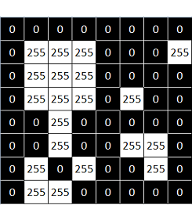
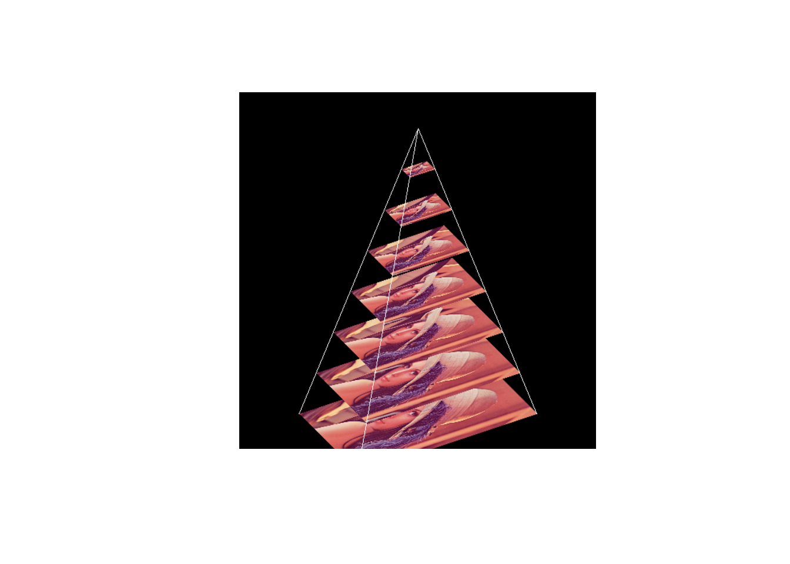

# 图像处理（imgproc模块-PART1）


## 灰度化

通常使用如下公式实现三通道彩色图形的灰度化：

$$
Y = 0.11 \times B+0.59 \times G+0.3 \times R
$$
其中：$B$、$G$和$R$分别表示彩色图像的蓝色、绿色和红色分量矩阵。


``` r
set.seed(123)
img_arr = array(sample(0:9,27,replace=TRUE),dim=c(3,3,3))
round(0.11*img_arr[,,1]+0.59*img_arr[,,2]+0.3*img_arr[,,3])
```

```
##      [,1] [,2] [,3]
## [1,]    7    5    3
## [2,]    5    6    6
## [3,]    5    5    9
```

利用OpenCV封装的**cvtColor**函数可以把三通道彩色图像转变为（单通道）灰度图：


``` r
#设定随机数种子
set.seed(123)
#生成矩阵
img_arr = array(sample(0:9,27,replace=TRUE),dim=c(3,3,3))
#利用r2cv函数将img.arr转变为图形矩阵
img = Mat(3,3,CV_8UC3)
attr(img_arr,"depth") = img$depth()
img$r2cv(img_arr)
#利用cvtColor函数，指定颜色转变代码COLOR_BGR2GRAY，对img进行灰度化，
#灰度化结果保存在gray中
gray = Mat()
cv_cvtColor(img,gray,COLOR_BGR2GRAY)

#查看灰度化结果
gray$cv2r()
```

```
##      [,1] [,2] [,3]
## [1,]    7    5    3
## [2,]    5    6    6
## [3,]    5    5    9
## attr(,"depth")
## [1] 0
```

**示例**


``` r
#读取图像文件，读取结果保存在img中
img = cv_imread("images/lena.jpg")
#用cvtColor函数将图像转变为灰度图，结果保存在gray中
gray = Mat()
cv_cvtColor(img,gray,COLOR_BGR2GRAY)
#显示灰度化结果
cv_imshow("灰度化结果",gray)
```


## 尺寸变换

OpenCV的**resize**函数可以更改图像尺寸：


``` r
#读取图像文件
img = cv_imread("images/roi.jpg")
#获取图形基本信息
img_info = rcv_matInfo(img)

#通过指定横向、纵向的缩放系数将img的宽度和高度都放大2倍，结果保存在img_resize22中
img_resize22 = Mat()
cv_resize(img,img_resize22,Size(),2,2)
cv_imshow('img',img_resize22)

#通过指定目标图像的尺寸将img的宽度放大2倍，高度放大3倍，结果保存在img_resize23中
img_resize23 = Mat()
cv_resize(img,img_resize23,Size(2*img_info$width,3*img_info$height))
cv_imshow('img',img_resize23)
```

OpenCV在更改图像尺寸的过程中，会涉及插值操作，而目前封装的插值方法有：


```
##  [1] "INTER_AREA"          "INTER_CUBIC"         "INTER_LANCZOS4"     
##  [4] "INTER_LINEAR"        "INTER_LINEAR_EXACT"  "INTER_MAX"          
##  [7] "INTER_NEAREST"       "INTER_NEAREST_EXACT" "WARP_FILL_OUTLIERS" 
## [10] "WARP_INVERSE_MAP"    "WARP_RELATIVE_MAP"
```

以下代码演示了INTER_CUBIC插值方法的应用效果：


``` r
#读取图像文件
img = cv_imread("images/HappyFish.jpg")
#获取图形基本信息
img_info = rcv_matInfo(img)

#通过指定横向、纵向的缩放系数将img的宽度和高度都放大2倍，结果保存在dst中
dst = Mat()
cv_resize(img,dst,Size(),2,2,INTER_CUBIC)

#显示原始图像和放大图像
cv_imshow("原图",img)
cv_imshow("cubic插值放大图",dst)
```

一般而言，OpenCV使用**resize**函数缩小图像时，采用INTER_AREA插值方法，在放大图像时，则采用INTER_CUBIC插值方法（速度较慢）或者INTER_LINEAR（速度较快）插值方法。


**示例**

以下代码用滑动条控制图像的放大系数，可以动态观察图像放大效果。


``` r
#控制图像放大系数的滑动条的最大取值为3
max_size = 3
#将图形窗口的标题存放在window_name中
window_name = "resize demo"

#读取图像文件
img = cv_imread("images/HappyFish.jpg")

#定义滑动条滑动事件的响应函数imgResize
imgResize = function(val, param)
{
  #获取图像放大系数的的滑动条的当前取值并加1后，存入sz中
  sz = cv_getTrackbarPos("Ratio:", window_name) + 1
  
  #通过指定横向、纵向的缩放系数将img的宽度和高度都放大2倍，
  #插值方式选择INTER_CUBIC，
  #结果保存在dst中
  dst = Mat()
  cv_resize(img,dst,Size(),sz,sz,INTER_CUBIC)
  
  #将dst显示在window_name指定的标题的图形窗口中
  cv_imshow(window_name, dst)
}

#创建以window_name取值为标题的图形窗口
cv_namedWindow(window_name,WINDOW_AUTOSIZE)

#在图形窗口中创建控制Canny算子下阈值的滑动条（滑动条的位置先至于1处）
cv_createTrackbar("Ratio:",window_name,1,max_size,imgResize)

#调用imgResize函数
imgResize(0, 0)
```


## 仿射变换

仿射变换是一种线性变换，可以保持二维图形在变换前后的“平直性”和“平行性”，即直线经过变换之后仍然是直线，两条平行线经变换之后仍然是平行线。

仿射变换的公式为：

$$
\begin{aligned}
x&=au+bv+m \\
y&=cu+dv+n
\end{aligned}
$$

其中，$u$、$v$为仿射变换前的二维图形中某点的横、纵坐标，$x$、$y$则是该点经仿射变换后得到的新的横、纵坐标。

写成矩阵形式为：

$$
\left[
\begin{matrix}
x \\
y
\end{matrix}
\right]
=
\left[
\begin{matrix}
a&b&m \\
c&d&n
\end{matrix}
\right]
\left[
\begin{matrix}
u \\
v \\
1
\end{matrix}
\right]
$$

其中：

$$
\left[
\begin{matrix}
a&b&m \\
c&d&n
\end{matrix}
\right]
$$
就是仿射矩阵。

在OpenCV中，可以通过**getAffineTransform**函数计算三对不共线的对应点 — 即两组控点，每组控点个数为3个 — 所确定的仿射变换，比如：


``` r
#先确定一组控点（用列表pts1来表示这组控点的坐标）
pts1 = stdVecOfPoint2f()
pts1$push_back(Point2f(50,50))
pts1$push_back(Point2f(200,50))
pts1$push_back(Point2f(50,200))

#再确定另一组对应的控点（用列表pts2来表示其中的三点的坐标）
pts2 = stdVecOfPoint2f()
pts2$push_back(Point2f(10,100))
pts2$push_back(Point2f(200,50))
pts2$push_back(Point2f(100,250))

#依据pts1和pts2计算仿射矩阵M
M = cv_getAffineTransform(pts1,pts2)
#查看M的元素值
round(M$cv2r(),3)
```

```
##        [,1] [,2]    [,3]
## [1,]  1.267  0.6 -83.333
## [2,] -0.333  1.0  66.667
## attr(,"depth")
## [1] 6
```

两组控点形成的位置关系如下：


仿射矩阵$M$的求解方式实质上就是求解方程组：

将蓝色点1的横、纵坐标(u,v)和对应的红色点1的横纵坐标(x,y)代入仿射变换公式，就可以得到两个方程；同理，将蓝色点2、3的横、纵坐标(u,v)和对应的红色点2、3的横纵坐标(x,y)代入公式，又可以分别得到两个方程。这样一来，就会形成一个包含6个方程的方程组：

$$
\begin{cases}
50a + 50b + m+0c+0d+0n = 10 \\
0a+0b+0m+50c + 50d + n = 100 \\
200a + 50b + m+0c+0d+0n = 200 \\
0a+0b+0m+200c + 50d + n = 50 \\
50a + 200b + m+0c+0d+0n = 100 \\
0a+0b+0m+50c + 200d + n = 250
\end{cases}
$$

由于三个蓝色点不共线（且经仿射变换后，相应的三个红色点也不共线），所以通过6个方程形成的方程组，就可以确定a、b、c、d、m和n的唯一解，进而也就确立了仿射矩阵。


``` r
#方程组的系数矩阵
A = matrix(c(50,50,1,0,0,0,
             0,0,0,50,50,1, 
             200,50,1,0,0,0,
             0,0,0,200,50,1, 
             50,200,1,0,0,0,
             0,0,0,50,200,1),
           nr=6,nc=6,byrow = T)
#方程组各等式右边的值所形成的向量
B = c(10,100,200,50,100,250)

#求解方程组
sol = solve(A,B)
names(sol) = c('a','b','m','c','d','n')
matrix(round(sol,3),nr=2,nc=3,byrow=T)
```

```
##        [,1] [,2]    [,3]
## [1,]  1.267  0.6 -83.333
## [2,] -0.333  1.0  66.667
```

另外，也可以直接使用**getRotationMatrix2D**函数得到仿射矩阵。比如可以生成一个只是将图像放大2倍的仿射变换矩阵：


``` r
#使用getRotationMatrix2D函数：
#旋转中心为(0,0)点，
#旋转角度为0度（即不旋转）,
#缩放因子为2
warp = cv_getRotationMatrix2D(Point(0,0),0,2)

#查看结果
warp$cv2r()
```

```
##      [,1] [,2] [,3]
## [1,]    2    0    0
## [2,]    0    2    0
## attr(,"depth")
## [1] 6
```

或者生成一个只是将图像旋转45度的仿射变换矩阵：


``` r
#使用getRotationMatrix2D函数：
#旋转中心为(0,0)点，
#旋转角度为45度,
#缩放因子为0
warp = cv_getRotationMatrix2D(Point(0,0),45,1)

#查看结果
warp$cv2r()
```

```
##            [,1]      [,2] [,3]
## [1,]  0.7071068 0.7071068    0
## [2,] -0.7071068 0.7071068    0
## attr(,"depth")
## [1] 6
```

再或者生成一个以100行100列像素为旋转中心，旋转角度为30，缩放因子为0.5的仿射变换矩阵：


``` r
#使用getRotationMatrix2D函数：
#旋转中心为(99,99)点，
#旋转角度为30度,
#缩放因子为0.5
warp = cv_getRotationMatrix2D(Point(99,99),30,0.5)

#查看结果
round(warp$cv2r(),3)
```

```
##        [,1]  [,2] [,3]
## [1,]  0.433 0.250    0
## [2,] -0.250 0.433    0
## attr(,"depth")
## [1] 6
```


**示例**


``` r
#读取图像文件
bayer = cv_imread("images/bayer.png")
#获得图像矩阵的行数、列数和通道数
rows_ = bayer$rows
cols_ = bayer$cols
cns_ = bayer$channels()
#形成两个点坐标列表pts1和pts2
pts1 = stdVecOfPoint2f()
pts1$push_back(Point2f(50,50))
pts1$push_back(Point2f(200,50))
pts1$push_back(Point2f(50,200))
# pts2 = list(c(10,100),c(200,50),c(100,250))
pts2 = stdVecOfPoint2f()
pts2$push_back(Point2f(10,100))
pts2$push_back(Point2f(200,50))
pts2$push_back(Point2f(100,250))
#依据pts1和pts2计算仿射矩阵M
M = cv_getAffineTransform(pts1,pts2)

#基于M对bayer进行仿射变换，结果保存在dst中
dst = Mat()
cv_warpAffine(bayer,dst,M,Size(cols_,rows_))

#显示bayer和dst
cv_imshow('ori',bayer)
cv_imshow('affine',dst)
```


**示例**

当仿射矩阵为如下形式时：

$$
\left[
\begin{matrix}
a&0&0 \\
0&d&0
\end{matrix}
\right]
$$

其作用为：将图像在水平方向和垂直方向上分别缩放$a$倍和$d$倍。比如，当$a=d=2$时，原图像第3行第3列位置的像素在目标像素的位置为：

$$
\left[
\begin{matrix}
x \\
y
\end{matrix}
\right]
=
\left[
\begin{matrix}
2&0&0 \\
0&2&0
\end{matrix}
\right]
\left[
\begin{matrix}
2 \\
2 \\
1
\end{matrix}
\right] = 
\left[
\begin{matrix}
4 \\
4 
\end{matrix}
\right]
$$

即在仿射变换$\displaystyle \left[\begin{matrix}2&0&0 \\ 0&2&0 \end{matrix}\right]$下，原图像第3行第3列位置的像素会成为目标图像的第5行第5列位置的像素。这个结论可以通过如下代码来验证：


``` r
#生成3行3列的矩阵
img_mat = matrix(9:1,nr=3,nc=3)
#将矩阵第3行第3列的元素更改为134，便于观察结果
img_mat[3,3] = 134
#将img_mat转变为图像矩阵
img = Mat(3,3,CV_8UC1)
attr(img_mat,"depth") = img$depth()
img$r2cv(img_mat)

#生成仿射变换矩阵
M_mat = matrix(c(2,0,0, 0,2,0),nr=2,nc=3,byrow=T)
M = Mat(2,3,CV_32F)
attr(M_mat,"depth") = M$depth()
M$r2cv(M_mat)
#对img进行仿射变换，结果保存在dst中
dst = Mat()
cv_warpAffine(img,dst,M,Size(6,6))

#查看结果
dst$cv2r()
```

```
##      [,1] [,2] [,3] [,4] [,5] [,6]
## [1,]    9    8    6    5    3    2
## [2,]    9    7    6    4    3    1
## [3,]    8    7    5    4    2    1
## [4,]    8    6    5   36   68   34
## [5,]    7    6    4   69  134   67
## [6,]    4    3    2   35   67   34
## attr(,"depth")
## [1] 0
```


**示例**

当仿射矩阵为如下形式时：

$$
\left[
\begin{matrix}
1&0&m \\
0&1&n
\end{matrix}
\right]
$$
其作用为：将图像在水平方向和垂直方向上移动m和n个单位（像素）。


``` r
#读取图像文件
img = cv_imread("images/HappyFish.jpg")
#获取图像矩阵的行数和列数
# c(rows,cols) %<-% c(img.cls$rows,img.cls$cols)
rows_ = img$rows
cols_ = img$cols
#生成数组arr
arr = array(c(1,0,0,1,100,100),dim=c(2,3,1))
#查看arr
arr
```

```
## , , 1
## 
##      [,1] [,2] [,3]
## [1,]    1    0  100
## [2,]    0    1  100
```

``` r
#将arr转变为32浮点类型的图像矩阵M
M = Mat(2,3,CV_32FC1)
attr(arr,"depth") = M$depth()
M$r2cv(arr)

#基于M对img进行仿射变换，结果保存在dst中
dst = Mat()
cv_warpAffine(img,dst,M,Size(cols_,rows_))

#显示img和dst
cv_imshow('ori',img)
cv_imshow('affine',dst)
```


**示例**

当仿射矩阵为如下形式时：

$$
\left[
\begin{matrix}
cos(\theta)&sin(\theta)&m \\
-sin(\theta)&cos(\theta)&n
\end{matrix}
\right]
$$
其作用为：将图像旋转$\theta$角度，并在水平方向和垂直方向上移动m和n个单位（像素）。


``` r
#读取图像文件
img = cv_imread("images/roi.jpg")
#获取图像矩阵的行数和列数
rows_ = img$rows
cols_ = img$cols
#确定旋转角度（角度为负数，表示是逆时针旋转）
theta = -pi/4
#生成数组arr
arr = array(
  c(cos(theta),sin(theta),
    -sin(theta),cos(theta),
    200,300),dim=c(2,3,1))
#查看arr
arr
```

```
## , , 1
## 
##            [,1]      [,2] [,3]
## [1,]  0.7071068 0.7071068  200
## [2,] -0.7071068 0.7071068  300
```

``` r
#将arr转变为32浮点类型的图像矩阵M
M = Mat(2,3,CV_32F)
attr(arr,"depth") = M$depth()
M$r2cv(arr)

#基于M对img进行仿射变换，结果保存在dst中
dst = Mat()
cv_warpAffine(img,dst,M,Size(2*cols_,2*rows_))

#显示img和dst
cv_imshow('ori',img)
cv_imshow('affine',dst)
```


**示例**

在对图像进行仿射变换时，可以指定边缘扩展方式。


``` r
#读取图像文件
img = cv_imread("images/HappyFish.jpg")
#获取图像基本信息
img_info = rcv_matInfo(img)

#设定仿射变换后的图像为源图像尺寸的1.5倍
w = 1.5*img_info$width
h = 1.5*img_info$height

#生成仿射变换矩阵
M_mat = matrix(c(0.87,0.50,-36, -0.50,0.87,63),nr=2,nc=3,byrow=T)
M = Mat(2,3,CV_32FC1)
M$r2cv(M_mat)

#对img进行仿射变换，
#边缘扩展方式为BORDER_CONSTANT，扩展像素的值都为(128,128,128)，
#结果保存在warp_constant中
warp_constant = Mat()
cv_warpAffine(img,warp_constant,M,Size(w,h),INTER_LINEAR,BORDER_CONSTANT,Scalar(128,128,128))

#对img进行仿射变换，边缘扩展方式为BORDER_REPLICATE，结果保存在warp_replicate中
warp_replicate = Mat()
cv_warpAffine(img,warp_replicate,M,Size(w,h),INTER_LINEAR,BORDER_REPLICATE)

#对img进行仿射变换，边缘扩展方式为BORDER_WRAP，结果保存在warp_wrap中
warp_wrap = Mat()
cv_warpAffine(img,warp_wrap,M,Size(w,h),INTER_LINEAR,BORDER_WRAP)

#对img进行仿射变换，边缘扩展方式为BORDER_DEFAULT，结果保存在warp_default中
warp_default = Mat()
cv_warpAffine(img,warp_default,M,Size(w,h),INTER_LINEAR,BORDER_DEFAULT)
```


## 透视变换

透视变换较之于仿射变换，要复杂一些，其变换公式的矩阵形式为：

$$w\left[\begin{matrix}x \\y \\1\end{matrix}\right] =\left[\begin{matrix}a_{11}&a_{12}&a_{13} \\a_{21}&a_{22}&a_{23} \\a_{31}&a_{32}&a_{33} \end{matrix}\right] \left[\begin{matrix}u \\v \\1\end{matrix}\right] $$

其中，$u$、$v$为透视变换前的二维图形中某点的横、纵坐标，$x$、$y$则是该点经透视变换后得到的新的横、纵坐标。而矩阵：

$$
\left[
\begin{matrix}
a_{11}&a_{12}&a_{13} \\
a_{21}&a_{22}&a_{23} \\
a_{31}&a_{32}&a_{33} 
\end{matrix}
\right] 
$$

就是透视矩阵。在透视矩阵中：

* $\displaystyle \left[ \begin{matrix} a_{11}&a_{12} \\ a_{21}&a_{22} \end{matrix} \right]$表示线性变换；
* $\displaystyle \left[ \begin{matrix} a_{13}&a_{23} \end{matrix} \right]$表示透视变换；
* $\displaystyle \left[ \begin{matrix} a_{31}&a_{32} \end{matrix} \right]$表示图像平移。

在OpenCV中，可以通过**getPerspectiveTransform**函数计算四对不共线的对应点 — 即两组控点，每组控点个数为4个 — 所确定的透视变换，比如：


``` r
#先确定一组控点（用列表pts1来表示这组控点的坐标）
# pts1 = list(c(57,40),c(329,23),c(374,407),c(15,407))
pts1 = stdVecOfPoint2f()
pts1$push_back(Point2f(57,40))
pts1$push_back(Point2f(329,23))
pts1$push_back(Point2f(374,407))
pts1$push_back(Point2f(15,407))
#再确定另一组对应的控点（用列表pts2来表示其中的三点的坐标）
# pts2 = list(c(20,20),c(380,20),c(380,430),c(20,430))
pts2 = stdVecOfPoint2f()
pts2$push_back(Point2f(20,20))
pts2$push_back(Point2f(380,20))
pts2$push_back(Point2f(380,430))
pts2$push_back(Point2f(20,430))
#依据pts1和pts2计算透视矩阵M
M = cv_getPerspectiveTransform(pts1,pts2)
#查看M的内容
round(M$cv2r(),5)
```

```
##         [,1]    [,2]     [,3]
## [1,] 1.46933 0.18591 -70.1872
## [2,] 0.10148 1.56639 -47.4388
## [3,] 0.00024 0.00091   1.0000
## attr(,"depth")
## [1] 6
```

两组控点形成的位置关系如下：


透视矩阵$M$的求解方式实质上就是求解方程组。首先依据如下公式计算：

$$w\left[\begin{matrix}x \\y \\1\end{matrix}\right] =\left[\begin{matrix}a_{11}&a_{12}&a_{13} \\a_{21}&a_{22}&a_{23} \\a_{31}&a_{32}&a_{33} \end{matrix}\right] \left[\begin{matrix}u \\v \\1\end{matrix}\right] $$

得到：

$$
\left[
\begin{matrix}
wx \\
wy \\
w
\end{matrix}
\right] 
=
\left[
\begin{matrix}
a_{11}u+a_{12}v+a_{13} \\
a_{21}u+a_{22}v+a_{23} \\
a_{31}u+a_{32}v+a_{33} 
\end{matrix}
\right] 
$$

则有：

$$
\begin{cases}
wx&=a_{11}u+a_{12}v+a_{13} \\
wy&=a_{21}u+a_{22}v+a_{23} \\
w&=a_{31}u+a_{32}v+a_{33}
\end{cases}
$$

将第三个方程确定的$w$代入第一个和第二方程：

$$
\begin{aligned}
(a_{31}u+a_{32}v+a_{33})x &= a_{11}u+a_{12}v+a_{13} \\
(a_{31}u+a_{32}v+a_{33})y &= a_{21}u+a_{22}v+a_{23}
\end{aligned}
$$

进一步变形可得如下方程组（这里称之为可算计透视变换公式）：

$$
\begin{cases}
\begin{aligned}
a_{11}u+a_{12}v+a_{13} - a_{31}ux-a_{32}vx &= a_{33}x\\
a_{21}u+a_{22}v+a_{23}-a_{31}uy-a_{32}vy &= a_{33}y
\end{aligned}
\end{cases}
$$

将蓝色点1的横、纵坐标(u,v)和对应的红色点1的横纵坐标(x,y)代入可计算透视变化公式，就可以得到两个方程；同理，将蓝色点2、3、4的横、纵坐标(u,v)和对应的红色点2、3、4的横纵坐标(x,y)代入可计算透视变换公式，又可以分别得到两个方程。这样一来，就会形成一个包含8个方程的方程组：

$$
\begin{cases}
57a_{11} + 40a_{12} + a_{13} +0a_{21}+0a_{22}+0a_{23} - 1140a_{31} - 800a_{32} = 20a_{33} \\
0a_{11}+0a_{12}+0a_{13}+57a_{21} + 40a_{22} + a_{23} - 1140a_{31} - 800a_{32} = 20a_{33} \\
329a_{11} + 23a_{12} + a_{13}+0a_{21}+0a_{22}+0a_{23} - 125020a_{31} - 8740a_{32} = 380a_{33} \\
0a_{11}+0a_{12}+0a_{13}+329a_{21} + 23a_{22} + a_{23} - 6580a_{31} - 460a_{32} = 20a_{33} \\
374a_{11} + 407a_{12} + a_{13} +0a_{21}+0a_{22}+0a_{23}- 142120a_{31} - 154660a_{32} = 380a_{33} \\
0a_{11}+0a_{12}+0a_{13}+374a_{21} + 407a_{22} + a_{23} - 160820a_{31} - 175010a_{32} = 430a_{33} \\
15a_{11} + 407a_{12} + a_{13} +0a_{21}+0a_{22}+0a_{23}- 300a_{31} - 8140a_{32} = 20a_{33} \\
0a_{11}+0a_{12}+0a_{13}+15a_{21} + 407a_{22} + a_{23} - 6450a_{31} - 175010a_{32} = 430a_{33}
\end{cases}
$$

由于四个蓝色点不共线（且经透视变换后，相应的四个红色点也不共线），所以这8个方程形成的方程组，就可以确定$a_{11},a_{12},a_{13},a_{21},a_{22},a_{23},a_{31},a_{32}$的解，至于$a_{33}$，不妨设定其值为1。


``` r
A = matrix(
  c(
    57,40,1,0,0,0,-1140,-800,
    0,0,0,57,40,1,-1140,-800,
    329,23,1,0,0,0,-125020,-8740,
    0,0,0,329,23,1,-6580,-460,
    374,407,1,0,0,0,-142120,-154660,
    0,0,0,374,407,1,-160820,-175010,
    15,407,1,0,0,0,-300,-8140,
    0,0,0,15,407,1,-6450,-175010
  ),
  nr=8,nc=8,byrow = T
)
b = c(20,20,380,20,380,430,20,430)
sol = round(solve(A,b),5)
matrix(c(sol,1),nr=3,nc=3,byrow = T)
```

```
##         [,1]    [,2]     [,3]
## [1,] 1.46933 0.18591 -70.1872
## [2,] 0.10148 1.56639 -47.4388
## [3,] 0.00024 0.00091   1.0000
```


在OpenCV中，**warpPerspective**函数可以基于透视矩阵对图像进行透视变换。

**示例**


``` r
#读取图像文件
img = cv_imread("images/calib_radial.jpg")
#显示img
cv_imshow("原始图像",img)

#指定图像中棋盘区域的四个顶点坐标，保存在pts1中
pts1 = stdVecOfPoint2f()
pts1$push_back(Point2f(57,40))
pts1$push_back(Point2f(329,23))
pts1$push_back(Point2f(374,407))
pts1$push_back(Point2f(15,407))
#指定棋盘区域要映射到的区域（通过四个顶点坐标指定，保存在pts2中）
pts2 = stdVecOfPoint2f()
pts2$push_back(Point2f(20,20))
pts2$push_back(Point2f(380,20))
pts2$push_back(Point2f(380,430))
pts2$push_back(Point2f(20,430))
#依据pts1和pts2进行透视变换，获得变换矩阵M
M = cv_getPerspectiveTransform(pts1,pts2)

#依据M对img.test进行透视变换，结果保存在img.pers中
img_pers = Mat()
cv_warpPerspective(img,img_pers,M,Size(420,450))
#显示img_pers
cv_imshow("透视变换结果",img_pers)
```


## 基础绘图

### Point与Scalar

在绘图操作中，会经常使用两种结构：**Point**和**Scalar**。

**Point**

**Point**表示一个二维点，由其图像坐标$x$和$y$指定。比如，生成一个横坐标为0，纵坐标也为0的点：


``` r
pt = Point()
pt$outToConsole()
```

```
## [0, 0]
```


再比如，生成一个横坐标为10，纵坐标为8的点：


``` r
pt = Point(10,8)
pt$outToConsole()
```

```
## [10, 8]
```

也可以使用如下代码生成一个横坐标为10，纵坐标为8的点：


``` r
#生成一个point
pt = Point() 
#修改横纵坐标值
pt$x = 10
pt$y = 8

pt$outToConsole()
```

```
## [10, 8]
```

**Scalar**

**Scalar**表示一个4维向量，在OpenCV中常被用于表示像素值。比如，生成一个蓝色、绿色和红色分量都为0的像素值：


``` r
sca = Scalar()
sca$outToConsole() 
```

```
## [0, 0, 0, 0]
```

再比如，生成一个蓝色、绿色和红色分量分别为100、20和30的像素值：


``` r
sca = Scalar(100,20,230)
sca$outToConsole()
```

```
## [100, 20, 230, 0]
```

<!-- 也可以使用如下代码生成蓝色、绿色和红色分量分别为100、20和30的像素值： -->

<!-- ```{r echo=FALSE,eval=FALSE} -->
<!-- #一下代码为何达不到预期（更改不成功呢） -->

<!-- #生成一个scalar指针sca -->
<!-- sca = cv.scalar.Scalar01()  -->
<!-- #通过sca获取scalar类 -->
<!-- sca.cls = cv.Scalar(sca) -->
<!-- #通过sca.cls修改三个颜色值 -->
<!-- sca.cls[[0]] = 100.1 -->
<!-- sca.cls[[1]] = 20 -->
<!-- sca.cls[[2]] = 30 -->

<!-- cv.scalar.cv2r(sca) -->
<!-- ``` -->


也可以随机生成一个像素值的蓝色、绿色和红色分量，比如：


``` r
#生成随机颜色的函数radomColor
randomColor = function()
{
  #从0到255的数中随机有放回取出3个数，形成一个3维向量作为函数的返回值
  sample(0:255,3,replace = T)
}
#设定随机数种子
set.seed(123)
#执行radomColor函数返回一个3维向量rndCol
rndCol = randomColor()
#将rndCol的值依次作为蓝色、绿色、红色分量，生成一个像素值
sca = Scalar(rndCol[1],rndCol[2],rndCol[3])

#查看生成的像素值
sca$outToConsole()
```

```
## [158, 206, 178, 0]
```


### 绘制直线（段）

使用**line**函数可以绘制直线（段）。

**在灰度图上绘制直线**


``` r
# 生成全黑的图像（宽度、高度都为200，类型为CV_8UC1）
img = Mat_zeros(200,200,CV_8UC1)
# 指定两个端点，一个坐标为(120,100)，一个坐标为(160,100)
pt1 = Point(120,100)
pt2 = Point(160,100)
# 在img上绘制端点为pt1和pt2的直线（段），颜色为白色(255)，线的粗细度为2
cv_line(img,pt1,pt2,Scalar(255),2)
cv_imshow("Line",img)
```


类似地，可以绘制如下数据框确定的8条直线：每条直线的第一个端点坐标为(x1,y1)，第二个端点坐标为(x2,y2)

|  x1|  y1|  x2|  y2|
|---:|---:|---:|---:|
| 120| 100| 160| 100|
| 114| 114| 142| 142|
| 100| 120| 100| 160|
|  86| 114|  58| 142|
|  80| 100|  40| 100|
|  86|  86|  58|  58|
| 100|  80| 100|  40|
| 114|  86| 142|  58|


``` r
# 生成全黑的图像（宽度、高度都为200，类型为CV_8UC1）
img = Mat_zeros(200,200,CV_8UC1)

# 在img上绘制数据框第一行数据确定的直线（段），颜色为白色(255)，线的粗细度为2
cv_line(img,Point(120,100),Point(160,100),Scalar(255),2)
# 在img上绘制数据框第二行数据确定的直线（段），颜色为白色(255)，线的粗细度为2
cv_line(img,Point(114,114),Point(142,142),Scalar(255),2)
# 类似地，绘制剩下的6条直线
cv_line(img,Point(100,120),Point(100,160),Scalar(255),2)
cv_line(img,Point(86,114),Point(58,142),Scalar(255),2)
cv_line(img,Point(80,100),Point(40,100),Scalar(255),2)
cv_line(img,Point(86,86),Point(58,58),Scalar(255),2)
cv_line(img,Point(100,80),Point(100,40),Scalar(255),2)
cv_line(img,Point(114,86),Point(142,58),Scalar(255),2)

cv_imshow("Line",img)
```


**在彩色图上绘制直线**

在全黑的彩色图形上绘制一条红色直线（段）：


``` r
# 生成全黑的图像（宽度、高度都为200，类型为CV_8UC3）
img = Mat_zeros(200,200,CV_8UC3)
# 指定两个端点，一个坐标为(120,100)，一个坐标为(160,100)
pt1 = Point(120,100)
pt2 = Point(160,100)
# 在img上绘制端点为pt1和pt2的直线（段），颜色为红色(255)，线的粗细度为2
cv_line(img,pt1,pt2,Scalar(0,0,255),2)
cv_imshow("Line",img)
```


在全黑的彩色图形上绘制多条随机彩色直线（段）：


``` r
#生成随机颜色的函数radomColor
randomColor = function()
{
  #从0到255的数中随机有放回取出3个数，形成一个3维向量作为函数的返回值
  tmp = sample(0:255,3,replace = T)
  Scalar(tmp[1],tmp[2],tmp[3])
}

# 生成全黑的图像（宽度、高度都为200，类型为CV_8UC3）
img = Mat_zeros(200,200,CV_8UC3)

# 在img上绘制数据框第一行数据确定的直线（段），颜色为随机取值，线的粗细度为2
cv_line(img,Point(120,100),Point(160,100),randomColor(),2)
# 在img上绘制数据框第二行数据确定的直线（段），颜色为随机取值，线的粗细度为2
cv_line(img,Point(114,114),Point(142,142),randomColor(),2)
# 类似地，绘制剩下的6条直线
cv_line(img,Point(100,120),Point(100,160),randomColor(),2)
cv_line(img,Point(86,114),Point(58,142),randomColor(),2)
cv_line(img,Point(80,100),Point(40,100),randomColor(),2)
cv_line(img,Point(86,86),Point(58,58),randomColor(),2)
cv_line(img,Point(100,80),Point(100,40),randomColor(),2)
cv_line(img,Point(114,86),Point(142,58),randomColor(),2)

cv_imshow("Line",img)
```


### 绘制矩形

可以使用**rectangle**函数绘制矩形。在OpenCV中，**rectangle**函数有两种重载形式，第一种是通过指定两个对角定点来确定矩形，第二种是通过指定左上角顶点以及宽度、高度来确定矩形。

**在灰度图上绘制矩形**


``` r
# 生成全黑的图像（宽度、高度都为200，类型为CV_8UC1）
img = Mat_zeros(200,200,CV_8UC1)

# 以第一种方式绘制矩形：两个对角顶点的坐标分别为(30,30)和(70,90)，
# 线条颜色为白色(255)，线条粗细为2
cv_rectangle(img,Point(30,30),Point(70,90),Scalar(255),2)

# 以第二种方式绘制矩形：左上角顶点的坐标(100,100)，宽度为40，高度为60，
# 线条颜色为白色(255)，线条粗细为2
cv_rectangle(img,Rect(100,100,40,60),Scalar(255),2)

cv_imshow("Rect",img)
```


当要绘制填充矩形的时候，可以将线条粗细值设置为-1。


``` r
# 生成全黑的图像（宽度、高度都为200，类型为CV_8UC1）
img = Mat_zeros(200,200,CV_8UC1)

# 以第一种方式绘制矩形：两个对角顶点的坐标分别为(30,30)和(70,90)，
# 填充色为白色(255)
cv_rectangle(img,Point(30,30),Point(70,90),Scalar(255),-1)

# 以第二种方式绘制矩形：左上角顶点的坐标(100,100)，宽度为40，高度为60，
# 填充色为白色(255)
cv_rectangle(img,Rect(100,100,40,60),Scalar(255),-1)

cv_imshow("Rect",img)
```


**在彩色图上绘制矩形**

在彩色图上绘制两个线条颜色分别为红色和蓝色的矩形


``` r
# 生成全黑的图像（宽度、高度都为200，类型为CV_8UC3）
img = Mat_zeros(200,200,CV_8UC3)

# 以第一种方式绘制矩形：两个对角顶点的坐标分别为(30,30)和(70,90)，
# 线条颜色为红色(0,0,255)，线条粗细为2
cv_rectangle(img,Point(30,30),Point(70,90),Scalar(0,0,255),2)

# 以第二种方式绘制矩形：左上角顶点的坐标(100,100)，宽度为40，高度为60，
# 线条颜色为蓝色(255,0,0)，线条粗细为2
cv_rectangle(img,Rect(100,100,40,60),Scalar(255,0,0),2)

cv_imshow("Rect",img)
```


在彩色图上绘制一个红色填充矩形和一个蓝色填充矩形


``` r
# 生成全黑的图像（宽度、高度都为200，类型为CV_8UC3）
img = Mat_zeros(200,200,CV_8UC3)

# 以第一种方式绘制矩形：两个对角顶点的坐标分别为(30,30)和(70,90)，
# 填充色为红色(0,0,255)
cv_rectangle(img,Point(30,30),Point(70,90),Scalar(0,0,255),-1)

# 以第二种方式绘制矩形：左上角顶点的坐标(100,100)，宽度为40，高度为60，
# 填充色为蓝色(255,0,0)
cv_rectangle(img,Rect(100,100,40,60),Scalar(255,0,0),-1)

cv_imshow("Rect",img)
```


### 绘制圆

可以使用**circle**函数绘制圆。

**在灰度图上绘制圆**


``` r
# 生成全黑的图像（宽度、高度都为200，类型为CV_8UC1）
img = Mat_zeros(200,200,CV_8UC1)

# 圆心坐标为(100,100)，半径为60，线条颜色为白色(255)，线条粗细为2
cv_circle(img,Point(100,100),60,Scalar(255),2)

cv_imshow("Circle",img)
```


当要绘制填充圆的时候，可以将线条粗细值设置为-1。


``` r
# 生成全黑的图像（宽度、高度都为200，类型为CV_8UC1）
img = Mat_zeros(200,200,CV_8UC1)

# 圆心坐标为(100,100)，半径为60，填充颜色为白色(255)
cv_circle(img,Point(100,100),60,Scalar(255),-1)

cv_imshow("Circle",img)
```


**在彩色图上绘制圆**

在彩色图上绘制四个圆，线条颜色分别为白色、蓝色、蓝色和红色


``` r
# 生成全黑的图像（宽度、高度都为200，类型为CV_8UC3）
img = Mat_zeros(200,200,CV_8UC3)

# 圆心坐标为(100,100)，半径为60，线条颜色为白色(255,255,255)，线条粗细度为2
cv_circle(img,Point(100,100),60,Scalar(255,255,255),2)

# 圆心坐标为(70,70)，半径为10，线条颜色为蓝色(255,0,0)，线条粗细度为2
cv_circle(img,Point(70,70),10,Scalar(255,0,0),2)

# 圆心坐标为(130,70)，半径为10，线条颜色为蓝色(255,0,0)，线条粗细度为2
cv_circle(img,Point(130,70),10,Scalar(255,0,0),2)

# 圆心坐标为(100,130)，半径为10，线条颜色为红色(0,0,255)，线条粗细度为2
cv_circle(img,Point(100,130),10,Scalar(0,0,255),2)

cv_imshow("Circle",img)
```


在彩色图上绘制四个填充圆，填充颜色分别为白色、蓝色、蓝色和红色


``` r
# 生成全黑的图像（宽度、高度都为200，类型为CV_8UC3）
img = Mat_zeros(200,200,CV_8UC3)

# 圆心坐标为(100,100)，半径为60，填充颜色为白色(255,255,255)
cv_circle(img,Point(100,100),60,Scalar(255,255,255),-1)

# 圆心坐标为(70,70)，半径为10，填充颜色为蓝色(255,0,0)
cv_circle(img,Point(70,70),10,Scalar(255,0,0),-1)

# 圆心坐标为(130,70)，半径为10，填充颜色为蓝色(255,0,0)
cv_circle(img,Point(130,70),10,Scalar(255,0,0),-1)

# 圆心坐标为(100,130)，半径为10，填充颜色为红色(0,0,255)
cv_circle(img,Point(100,130),10,Scalar(0,0,255),-1)

cv_imshow("Circle",img)
```


### 绘制椭圆弧

可以使用**ellipse**函数绘制椭圆弧。在OpenCV中，**ellipse**函数有两种重载形式：

* 第一种是通过指定椭圆圆心、轴半径、旋转角度、起始角度和终止角度来确定椭圆，当旋转角为正数时，表明是按顺时针旋转，为负数时，则按逆时针旋转；  
* 第二种是通过指定旋转矩形RoundedRect来确定椭圆，其中旋转矩形则是通过一个中心点、矩形尺寸和一个旋转角度来确定。

这里是否需要椭圆弧的图形示意图？

**在灰度图上绘制椭圆弧**


``` r
# 生成全黑的图像（宽度、高度都为200，类型为CV_8UC1）
img = Mat_zeros(200,200,CV_8UC1)

# 椭圆心坐标为(100,100)，轴半径分别为60和30，旋转角为0度，起始角为0度，终止角为90度，
# 线条颜色为白色(255)，线条粗细为2
cv_ellipse(img,Point(100,100),Size(60,30),0,0,90,Scalar(255),2)

# 以(100,100)为交点绘制一条水平线和竖直线，便于观察绘制的椭圆弧形状
cv_line(img,Point(0,100),Point(200,100),Scalar(150),lineType = 4)
cv_line(img,Point(100,0),Point(100,200),Scalar(150),lineType = 4)

cv_imshow("Ellipse",img)
```


类似地，可以绘制不同旋转角、不同起始角和不同终止角的椭圆弧：


``` r
# 生成全黑的图像（宽度、高度都为200，类型为CV_8UC1）
img = Mat_zeros(200,200,CV_8UC1)

# 椭圆心坐标为(100,100)，轴半径分别为60和30，旋转角为0度，起始角为0度，终止角为90度，
# 线条颜色为白色(255)，线条粗细为2
cv_ellipse(img,Point(100,100),Size(60,30),0,0,90,Scalar(255),2)

# 椭圆心坐标为(100,100)，轴半径分别为70和40，旋转角为90度，起始角为0度，终止角为90度，
# 线条颜色为白色(255)，线条粗细为2
cv_ellipse(img,Point(100,100),Size(70,40),90,0,90,Scalar(255),2)

# 椭圆心坐标为(100,100)，轴半径分别为80和50，旋转角为180度，起始角为45度，终止角为90度，
# 线条颜色为白色(255)，线条粗细为2
cv_ellipse(img,Point(100,100),Size(80,50),180,45,90,Scalar(255),2)

# 以(100,100)为交点绘制一条水平线和竖直线，便于观察绘制的椭圆弧形状
cv_line(img,Point(0,100),Point(200,100),Scalar(150),lineType = 4)
cv_line(img,Point(100,0),Point(100,200),Scalar(150),lineType = 4)

cv_imshow("Ellipse",img)
```


当设置起始角为0，终止角为360时，可以绘制完成的椭圆曲线。


``` r
# 生成全黑的图像（宽度、高度都为200，类型为CV_8UC1）
img = Mat_zeros(200,200,CV_8UC1)

# 椭圆心坐标为(100,100)，轴半径分别为60和30，旋转角为0度，起始角为0度，终止角为360度，
# 线条颜色为白色(255)，线条粗细为2
cv_ellipse(img,Point(100,100),Size(60,30),0,0,360,Scalar(255),2)

# 椭圆心坐标为(100,100)，轴半径分别为为70和40，旋转角为45度，起始角为0度，终止角为360度，
# 线条颜色为白色(255)，线条粗细为2
cv_ellipse(img,Point(100,100),Size(70,40),45,0,360,Scalar(255),2)

# 以(100,100)为交点绘制一条水平线和竖直线，便于观察绘制的椭圆弧形状
cv_line(img,Point(0,100),Point(200,100),Scalar(255),lineType = 4)
cv_line(img,Point(100,0),Point(100,200),Scalar(255),lineType = 4)

cv_imshow("Ellipse",img)
```


当线条粗细度设置为-1时，可以绘制填充椭圆：


``` r
# 生成全黑的图像（宽度、高度都为200，类型为CV_8UC1）
img = Mat_zeros(200,200,CV_8UC1)

# 椭圆心坐标为(100,100)，轴半径分别为80和40，旋转角为45度，起始角为0度，终止角为360度，
# 填充颜色为白色(255)
cv_ellipse(img,Point(100,100),Size(80,40),45,0,360,Scalar(255),-1)

cv_imshow("Ellipse",img)
```


**在彩色图上绘制椭圆弧**

在彩色图上绘制四个圆，线条颜色分别为白色、蓝色、蓝色和红色


``` r
# 生成全黑的图像（宽度、高度都为200，类型为CV_8UC3）
img = Mat_zeros(200,200,CV_8UC3)

# 椭圆心坐标为(100,100)，轴半径分别为60和30，旋转角为0度，起始角为0度，终止角为90度，
# 线条颜色为红色(0,0,255)，线条粗细为2
cv_ellipse(img,Point(100,100),Size(60,30),0,0,90,Scalar(0,0,255),2)

# 椭圆心坐标为(100,100)，轴半径分别为70和40，旋转角为90度，起始角为0度，终止角为90度，
# 线条颜色为绿色(0,255,0)，线条粗细为2
cv_ellipse(img,Point(100,100),Size(70,40),90,0,90,Scalar(0,255,0),2)

# 椭圆心坐标为(100,100)，轴半径分别为80和50，旋转角为180度，起始角为45度，终止角为90度，
# 线条颜色为蓝色(255,0,0)，线条粗细为2
cv_ellipse(img,Point(100,100),Size(80,50),180,45,90,Scalar(255,0,0),2)

# 以(100,100)为交点绘制一条水平线和竖直线，便于观察绘制的椭圆弧形状
cv_line(img,Point(0,100),Point(200,100),Scalar(255,255,255),lineType = 4)
cv_line(img,Point(100,0),Point(100,200),Scalar(255,255,255),lineType = 4)

cv_imshow("Ellipse",img)
```


在彩色图上绘制三个填充椭圆扇形区域，填充颜色分别为红色、绿色和蓝色：


``` r
# 生成全黑的图像（宽度、高度都为200，类型为CV_8UC3）
img = Mat_zeros(200,200,CV_8UC3)

# 椭圆心坐标为(100,100)，轴半径分别为60和30，旋转角为0度，起始角为0度，终止角为90度，
# 填充色为红色
cv_ellipse(img,Point(100,100),Size(60,30),0,0,90,Scalar(0,0,255),-1)

# 椭圆心坐标为(100,100)，轴半径分别为70和40，旋转角为90度，起始角为0度，终止角为90度，
# 填充色为绿色(0,255,0)
cv_ellipse(img,Point(100,100),Size(70,40),90,0,90,Scalar(0,255,0),-1)

# 椭圆心坐标为(100,100)，轴半径分别为80和50，旋转角为180度，起始角为45度，终止角为90度，
# 填充色为蓝色(255,0,0)
cv_ellipse(img,Point(100,100),Size(80,50),180,45,90,Scalar(255,0,0),-1)

# 以(100,100)为交点绘制一条水平线和竖直线，便于观察绘制的椭圆弧形状
cv_line(img,Point(0,100),Point(200,100),Scalar(255,255,255),lineType = 4)
cv_line(img,Point(100,0),Point(100,200),Scalar(255,255,255),lineType = 4)

cv_imshow("Ellipse",img)
```


**通过RoundedRect绘制椭圆**

在灰度图上绘制：

``` r
#生成全黑的图像（宽度、高度都为200，类型为CV_8UC1）
img = Mat_zeros(200,200,CV_8UC1)

#RoundedRect的中心坐标为(100,100)，矩形尺寸为120与60，旋转角为45度，
#线条颜色为白色(255)，线条粗细为2
cv_ellipse(img,RotatedRect(Point2f(100,100),Size2f(120,60),45),Scalar(255),2)

#以(100,100)为交点绘制一条水平线和竖直线，便于观察绘制的椭圆弧形状
cv_line(img,Point(0,100),Point(200,100),Scalar(150),lineType = 4)
cv_line(img,Point(100,0),Point(100,200),Scalar(150),lineType = 4)

cv_imshow("Ellipse",img)
```


也可以先生成指向RotatedRect类实例的XPtr指针，再作为参数传递给椭圆绘图函数：

``` r
#生成全黑的图像（宽度、高度都为200，类型为CV_8UC1）
img = Mat_zeros(200,200,"CV_8UC1")

#生成RotatedRect，中心坐标为(100,100)，矩形尺寸为120与60，
#旋转角为45度
rc = RotatedRect(Point2f(100,100),Size2f(120,60),45)

# 绘制rc确定的椭圆，线条颜色为白色(255)，线条粗细为2
cv_ellipse(img,rc,Scalar(255),2)

# 以(100,100)为交点绘制一条水平线和竖直线，便于观察绘制的椭圆弧形状
cv_line(img,Point(0,100),Point(200,100),Scalar(150),lineType = 4)
cv_line(img,Point(100,0),Point(100,200),Scalar(150),lineType = 4)

cv_imshow("Ellipse",img)
```


### 绘制多边形

可以使用**polylines**函数绘制折线段。在OpenCV中，**polylines**函数有两种重载形式，主要区别在于：

* 第一种需要指定一组或者多组折线段顶点集合、明确每组折线段顶点个数、且明确需要绘制的折线段个数；  
* 第二种只需要指定一组或者多组折线段顶点集合即可。

在绘制直线段时，若指定isClosed参数为TRUE，即可自动连接每组折线段的第一个顶点和最后一个顶点，进而形成多边形。

**在灰度图上绘制多边形**


``` r
#生成全黑的图像（宽度、高度都为200，类型为CV_8UC1）
img = Mat_zeros(200,200,CV_8UC1)

#生成两个点列表（每个点代表着待绘制的多边形的一个顶点）
pnts1 = stdVecOfPoint()
pnts1$push_back(Point(50,20))
pnts1$push_back(Point(20,80))
pnts1$push_back(Point(80,80))

pnts2 = stdVecOfPoint()
pnts2$push_back(Point(120,120))
pnts2$push_back(Point(120,180))
pnts2$push_back(Point(180,180))
pnts2$push_back(Point(180,120))
#将两个点列表合并成一个列表
pts = stdVecOfVecOfPoint()
pts$push_back(pnts1)
pts$push_back(pnts2)

npts = stdVecOfint()
npts$push_back(3)
npts$push_back(4)

#使用polylines的第二个重载形式绘制两个多边形
cv_polylines(img,pts,TRUE,Scalar(255))

#以(100,100)为交点绘制一条水平线和竖直线，便于观察绘制的椭圆弧形状
cv_line(img,Point(0,100),Point(200,100),Scalar(150),lineType = 4)
cv_line(img,Point(100,0),Point(100,200),Scalar(150),lineType = 4)

cv_imshow("FillPoly",img)
```


**在彩色图上绘制多边形**


``` r
# 生成全黑的图像（宽度、高度都为200，类型为CV_8UC3）
img = Mat_zeros(200,200,CV_8UC3)

#使用polylines的第二个重载形式绘制两个多边形
cv_polylines(img,pts,TRUE,Scalar(0,0,255))

# 以(100,100)为交点绘制一条水平线和竖直线，便于观察绘制的椭圆弧形状
cv_line(img,Point(0,100),Point(200,100),Scalar(255,255,255),lineType = 4)
cv_line(img,Point(100,0),Point(100,200),Scalar(255,255,255),lineType = 4)

cv_imshow("FillPoly",img)
```


### 绘制填充多边形

可以使用**fillPoly**函数绘制填充多边形。在OpenCV中，**fillPoly**函数有两种重载形式，主要区别在于：

* 第一种需要指定一组或者多组填充多边形顶点集合、明确每组填充多边形顶点个数、且明确需要绘制的填充多边形个数；  
* 第二种只需要指定一组或者多组折线段顶点集合即可。

**在灰度图上绘制填充多边形**


``` r
#生成全黑的图像（宽度、高度都为200，类型为CV_8UC1）
img = Mat_zeros(200,200,CV_8UC1)

#或者使用fillPoly第二个重载形式绘制两个填充多边形
cv_fillPoly(img,pts,Scalar(255))

# 以(100,100)为交点绘制一条水平线和竖直线，便于观察绘制的椭圆弧形状
cv_line(img,Point(0,100),Point(200,100),Scalar(150),lineType = 4)
cv_line(img,Point(100,0),Point(100,200),Scalar(150),lineType = 4)

cv_imshow("FillPoly",img)
```


**在彩色图上绘制填充多边形**


``` r
# 生成全黑的图像（宽度、高度都为200，类型为CV_8UC3）
img = Mat_zeros(200,200,CV_8UC3)

#使用fillPoly第二个重载形式绘制两个填充多边形
cv_fillPoly(img,pts,Scalar(255,0,0))

# 以(100,100)为交点绘制一条水平线和竖直线，便于观察绘制的椭圆弧形状
cv_line(img,Point(0,100),Point(200,100),Scalar(255,255,255),lineType = 4)
cv_line(img,Point(100,0),Point(100,200),Scalar(255,255,255),lineType = 4)

cv_imshow("FillPoly",img)
```


### 绘制文本

可以使用**putText**函数绘制文本。

**在灰度图上绘制文本**


``` r
# 生成全黑的图像（宽度、高度都为200，类型为CV_8UC1）
img = Mat_zeros(200,200,CV_8UC1)

# 以点(20,100)为文本Testing左下角位置，使用FONT_HERSHEY_SIMPLEX字体，放大系数为1.5，
# 颜色为白色255，线条粗细度为2
cv_putText( img, "Testing", Point(20,100), 
            FONT_HERSHEY_SIMPLEX,1.5, Scalar(255), 2)

cv_imshow("Text",img)
```


**在彩色图上绘制文本**


``` r
#生成全黑的图像（宽度、高度都为200，类型为CV_8UC3）
img = Mat_zeros(200,200,CV_8UC3)

# 以点(20,100)为文本Testing左下角位置，使用FONT_HERSHEY_SIMPLEX字体，放大系数为1.5，
# 颜色为红色(0,0,255)，线条粗细度为2
cv_putText( img, "Testing", Point(20,100), 
            FONT_HERSHEY_SIMPLEX,1.5, Scalar(0,0,255), 2)

cv_imshow("Text",img)
```


以下是综合了一些基础绘图操作形成的两个综合示例：

**示例**


``` r
#设定w=400, 作为图像的高度和宽度
w = 400

#形成绘制椭圆的函数MyEllipse：
#圆心位于图像中心点，
#长轴半径为w/4，短轴半径为w/16，
#旋转角为函数参数angle（在调用函数的时候指定），
#线条颜色为蓝色，线条粗细度为2，线条类型指定为8，即LINE_8
MyEllipse = function(img,angle){
  thickness = 2
  lineType = 8
  cv_ellipse(img,Point(w/2,w/2),Size(w/4,w/16),angle,0,360,
               Scalar(255,0,0),thickness,lineType)
}

#形成绘制填充圆的函数MyFilledCircle：
#圆心为函数参数center（在调用函数的时候指定），
#圆半径为w/32，
#线条颜色为红色，线条类型为LINE_8
MyFilledCircle = function(img,center )
{
  cv_circle(img,center,w/32,Scalar( 0, 0, 255 ),-1,LINE_8);
}

#形成绘制填充多边形的函数MyPolygon：
#线条类型为Line_8
MyPolygon = function(img)
{
  lineType = expr(LINE_8)
  #形成填充多边形顶点列表
  
  poly1 = stdVecOfPoint()
  poly1$push_back(Point(    w/4,   7*w/8 ))
  poly1$push_back(Point(  3*w/4,   7*w/8 ))
  poly1$push_back(Point(  3*w/4,  13*w/16 ))
  poly1$push_back(Point( 11*w/16, 13*w/16 ))
  poly1$push_back(Point( 19*w/32,  3*w/8 ))
  poly1$push_back(Point(  3*w/4,   3*w/8 ))
  poly1$push_back(Point(  3*w/4,     w/8 ))
  poly1$push_back(Point( 26*w/40,    w/8 ))
  poly1$push_back(Point( 26*w/40,    w/4 ))
  poly1$push_back(Point( 22*w/40,    w/4 ))
  poly1$push_back(Point( 22*w/40,    w/8 ))
  poly1$push_back(Point( 18*w/40,    w/8 ))
  poly1$push_back(Point( 18*w/40,    w/4 ))
  poly1$push_back(Point( 14*w/40,    w/4 ))
  poly1$push_back(Point( 14*w/40,    w/8 ))
  poly1$push_back(Point(    w/4,     w/8 ))
  poly1$push_back(Point(    w/4,   3*w/8 ))
  poly1$push_back(Point( 13*w/32,  3*w/8 ))
  poly1$push_back(Point(  5*w/16, 13*w/16 ))
  poly1$push_back(Point(    w/4,  13*w/16 ))
  rook_points = stdVecOfVecOfPoint()
  rook_points$push_back(poly1)
  
  cv_fillPoly( img,rook_points,Scalar( 255, 255, 255 ),lineType );
}

#形成绘制直线的函数MyLine：
#直线的两个端点为函数参数start和end（在调用函数的时候指定），
#线条类型为LINE_8，线条粗细度为2
MyLine = function(img, start, end)
{
  thickness = 2
  lineType = expr(LINE_8)
  cv_line(img,start,end,Scalar(0,0,0),thickness,lineType)
}

#生成全黑的图像atom_img（宽度、高度都为400，类型为CV_8UC3）
atom_image = Mat_zeros(w,w,CV_8UC3)
#生成全黑的图像rook_image（宽度、高度都为400，类型为CV_8UC3）
rook_image = Mat_zeros(w,w,CV_8UC3)

#在atom_image上绘制旋转角为90度的蓝色椭圆
MyEllipse( atom_image, 90 )
#在atom_image上绘制旋转角为0度的蓝色椭圆
MyEllipse( atom_image, 0 )
#在atom_image上绘制旋转角为45度的蓝色椭圆
MyEllipse( atom_image, 45 )
#在atom_image上绘制旋转角为-45度的蓝色椭圆
MyEllipse( atom_image, -45 )
#在在atom_image上以中心点为圆心绘制红色填充圆
MyFilledCircle( atom_image, Point( w/2, w/2) )

#在rook_image上绘制白色填充多边形
MyPolygon(rook_image)
#在rook_image底部绘制黄色填充矩形
cv_rectangle(rook_image,
         Point(0, 7*w/8),
         Point(w, w),
         Scalar(0,255,255),
         -1,
         LINE_8 )
#在rook_image底部绘制3条竖线和1条横线（每条直线的两个端点都通过MyLine函数的start参数和end参数指定）
MyLine(rook_image, Point(0, 15*w/16), Point(w, 15*w/16))
MyLine(rook_image, Point(w/4, 7*w/8), Point(w/4, w))
MyLine(rook_image, Point(w/2, 7*w/8), Point(w/2, w))
MyLine(rook_image, Point(3*w/4, 7*w/8), Point(3*w/4, w))

cv_imshow('atom_image',atom_image)
cv_imshow('rook_image',rook_image)
```


**示例**


``` r
#确定循环次数
NUMBER = 100
#确定延时秒数
DELAY = 5

#设定图像宽为900像素，高度为600像素
window_width = 900
window_height = 600

#以x_1和x_2确定随机生成的点的横坐标范围
x_1 = -window_width/2
x_2 = window_width*3/2
#以y_1和y_2确定随机生成的点的纵坐标范围
y_1 = -window_width/2
y_2 = window_width*3/2

#生成随机颜色的函数
randomColor = function()
{
  #从0到255的数中随机有放回取出3个数，形成一个3维向量作为函数的返回值
  samp = sample(0:255,3,replace = T)
  Scalar(samp[1],samp[2],samp[3])
}

#绘制随机直线的函数
Drawing_Random_Lines = function( image, window_name)
{
  #初始化两个点：pt1和pt2，使其横纵坐标都为0
  pt1 = Point(0,0)
  pt2 = Point(0,0)
  
  #循环NUMBER次，每次都绘制一条直线
  for(i in 1:NUMBER)
  {
    #随机生成直线的一个端点
    pt1$x = runif(1, x_1, x_2 )
    pt1$y = runif(1, y_1, y_2 )
    #随机生成直线的另一个端点
    pt2$x = runif(1, x_1, x_2 )
    pt2$y = runif(1, y_1, y_2 )
    
    #随机确定线条颜色
    cl = randomColor()
    #随机确定线条粗细度（在1到10之间）
    thickness =  runif(1,1,10)
    
    #在image上绘制直线
    cv_line( image, pt1, pt2, cl,thickness, 8)
    #在图形窗口上展示图像image
    cv_imshow(window_name, image)
    #延时5秒，如果用户按下键盘上的按钮，将终止循环。
    if(cv_waitKey( DELAY ) >= 0 ){ 
      break
    }
  }
}

#绘制随机矩形（或者随机填充矩形）的函数
Drawing_Random_Rectangles = function(image, window_name)
{
  #初始化两个点：pt1和pt2，使其横纵坐标都为0
  pt1 = Point(0,0)
  pt2 = Point(0,0)
  #指定线条类型为8，即LINE_8
  lineType = 8
  
  #循环NUMBER次，每次都绘制一个矩形（或者填充矩形）
  for( i in 1:NUMBER )
  {
    #随机生成矩形的两个对角顶点
    pt1$x = runif(1, x_1, x_2 )
    pt1$y = runif(1, y_1, y_2 )
    pt2$x = runif(1, x_1, x_2 )
    pt2$y = runif(1, y_1, y_2 )
    
    #随机确定线条颜色
    cl = randomColor()
    #随机确定线条粗细度（在-3到10之间）
    thickness =  runif(1, -3, 10 )
    #当thickness小于-1时，取-1（即形成填充矩形）
    thickness = max(thickness, -1)
    
    #在image上绘制矩形
    cv_rectangle( image, pt1, pt2, cl, thickness, lineType )

    #在图形窗口上展示图像image
    cv_imshow(window_name, image)
    #延时5秒，如果用户按下键盘上的按钮，将终止循环。
    if(cv_waitKey( DELAY ) >= 0 ){ 
      break
    }
  }
}

#绘制随机椭圆弧（或者随机填充椭圆弧）的函数
Drawing_Random_Ellipses = function( image, window_name )
{
  #指定线条类型为8，即LINE_8
  lineType = 8

  #循环NUMBER次，每次都绘制一个椭圆弧（或者填充椭圆弧）
  for(i in 1:NUMBER)
  {
    #随机生成椭圆弧圆心的横、纵坐标
    center = Point()
    center$x = runif(1, x_1, x_2)
    center$y = runif(1, y_1, y_2)

    #随机生成椭圆弧的长、短半径
    axes = Size()
    axes$width = runif(1, 0, 200)
    axes$height = runif(1, 0, 200)
    
    #随机生成椭圆弧的旋转角
    angle = runif(1, 0, 180)
    #依据angle确定椭圆弧的startAngle和endAngle
    startAngle = angle-100
    endAngle = angle+200
    
    #随机确定线条颜色
    cl = randomColor()
    #随机确定线条粗细度（在-1到9之间）
    thickness =  runif(1, -1, 9)

    #在image上绘制椭圆弧
    cv_ellipse(image, center, axes, angle, angle - 100, angle + 200,
             cl, thickness, lineType)

    #在图形窗口上展示图像image
    cv_imshow(window_name, image)
    #延时5秒，如果用户按下键盘上的按钮，将终止循环。
    if(cv_waitKey( DELAY) >= 0 ){ 
      break
    }
  }
}

#绘制随机三角形的函数
Drawing_Random_Polylines = function(image, window_name )
{
  #指定线条类型为8，即LINE_8
  lineType = 8
  
  #循环NUMBER次，每次都绘制两个三角形
  for(i in 1:NUMBER)
  {
    #随机生成两个三角形的顶点
    triangle1 = stdVecOfPoint()
    triangle1$push_back(Point(runif(1, x_1, x_2),runif(1, y_1, y_2)))
    triangle1$push_back(Point(runif(1, x_1, x_2),runif(1, y_1, y_2)))
    triangle1$push_back(Point(runif(1, x_1, x_2),runif(1, y_1, y_2)))
    triangle2 = stdVecOfPoint()
    triangle2$push_back(Point(runif(1, x_1, x_2),runif(1, y_1, y_2)))
    triangle2$push_back(Point(runif(1, x_1, x_2),runif(1, y_1, y_2)))
    triangle2$push_back(Point(runif(1, x_1, x_2),runif(1, y_1, y_2)))
    ppt = stdVecOfVecOfPoint()
    ppt$push_back(triangle1)
    ppt$push_back(triangle2)
    
    #随机确定线条颜色
    cl = randomColor()
    #随机确定线条粗细度（在1到10之间）
    thickness =  runif(1, 1, 10)
    
    #在image上绘制两个三角形
    cv_polylines(image, ppt, TRUE,cl, thickness, lineType)

    #在图形窗口上展示图像image
    cv_imshow(window_name, image)
    #延时5秒，如果用户按下键盘上的按钮，将终止循环。
    if(cv_waitKey( DELAY) >= 0 ){ 
      break
    }
  }
}

#绘制随机填充三角形的函数
Drawing_Random_Filled_Polygons = function( image, window_name )
{
  #指定线条类型为8，即LINE_8
  lineType = 8
  
  #循环NUMBER次，每次都绘制两个三角形
  for(i in 1:NUMBER)
  {
    #随机生成两个三角形的顶点
    triangle1 = stdVecOfPoint()
    triangle1$push_back(Point(runif(1, x_1, x_2),runif(1, y_1, y_2)))
    triangle1$push_back(Point(runif(1, x_1, x_2),runif(1, y_1, y_2)))
    triangle1$push_back(Point(runif(1, x_1, x_2),runif(1, y_1, y_2)))
    triangle2 = stdVecOfPoint()
    triangle2$push_back(Point(runif(1, x_1, x_2),runif(1, y_1, y_2)))
    triangle2$push_back(Point(runif(1, x_1, x_2),runif(1, y_1, y_2)))
    triangle2$push_back(Point(runif(1, x_1, x_2),runif(1, y_1, y_2)))
    ppt = stdVecOfVecOfPoint()
    ppt$push_back(triangle1)
    ppt$push_back(triangle2)

    #随机确定线条颜色
    cl = randomColor()
    
    #在image上绘制两个填充三角形
    cv_fillPoly( image, ppt, cl, lineType )
    
    #在图形窗口上展示图像image
    cv_imshow(window_name, image)
    #延时5秒，如果用户按下键盘上的按钮，将终止循环。
    if(cv_waitKey( DELAY) >= 0 ){ 
      break
    }
    
  }
}

#绘制随机圆（或者随机填充圆）的函数
Drawing_Random_Circles = function( image, window_name)
{
  #指定线条类型为8，即LINE_8
  lineType = 8
  
  #循环NUMBER次，每次都绘制一个圆（或者填充圆）
  for (i in 1:NUMBER)
  {
    #随机生成圆心的横、纵坐标
    center = Point()
    center$x = runif(1, x_1, x_2)
    center$y = runif(1, y_1, y_2)
    #随机生成圆半径(0到300之间)
    radius = runif(1, 0, 300)
    #随机确定线条颜色
    cl = randomColor()
    #随机确定线条粗细度（在-1到9之间）
    thickness =  runif(1, -1, 9)
    
    #在image上绘制圆
    cv_circle( image, center, radius, randomColor(),
            runif(1, -1, 9), lineType )

    #在图形窗口上展示图像image
    cv_imshow(window_name, image)
    #延时5秒，如果用户按下键盘上的按钮，将终止循环。
    if(cv_waitKey( DELAY) >= 0 ){ 
      break
    }
  }
}

#在随机位置上绘制文本的函数
Displaying_Random_Text= function(image, window_name)
{
  #指定线条类型为8，即LINE_8
  lineType = 8

  #循环NUMBER次，每次都绘制一个文本
  for (i in 1:NUMBER )
  {
    #随机生成文本的左下角定位点
    org = Point()
    org$x = runif(1, x_1, x_2)
    org$y = runif(1, y_1, y_2)
    #随机确定文本的字体类型
    fontType = runif(1,0,8)
    #随机确定文本的放缩系数
    fontScale = runif(1,0,100)*0.05+0.1
    #随机确定文本颜色
    cl = randomColor()
    #随机确定线条粗细度（在1到10之间）
    thickness =  runif(1, 1, 10)
    
    #在image上绘文本
    cv_putText( image, "Testing text rendering", org, fontType,
             fontScale, cl, thickness, lineType)

    #在图形窗口上展示图像image
    cv_imshow(window_name, image)
    #延时5秒，如果用户按下键盘上的按钮，将终止循环。
    if(cv_waitKey( DELAY) >= 0 ){ 
      break
    }
  }
}

#显示大型结束文本的函数
Displaying_Big_End = function( image, window_name )
{
  #获取包含文本的矩形尺寸textSize以及文本基准线的纵坐标baseLine
  baseLine = 0
  textsize = cv_getTextSize("OpenCV forever!", FONT_HERSHEY_COMPLEX, 3, 5, baseLine)
  # baseLine = uncloseRef(baseLine.ref)
  
  #确定文本的左下角定位点
  org = Point((window_width - textsize$width)/2, (window_height - textsize$height)/2)
  #指定线条类型为8，即LINE_8
  lineType = 8
  
  #利用cv2r函数将image转变为R语言的数组
  image_arr = image$cv2r()

  #通过循环，不断将图像的各个灰度值都变为0
  for(i in seq(0,255,by=2) )
  {
    #依据image.arr生成尺寸相同的数组tmp，所有元素值都为i
    tmp = rep(i,prod(dim(image_arr)))
    dim(tmp) = dim(image_arr)
    #将image_arr减去tmp，结果保存在image2_arr中，则image2_arr中对应于image_arr元素值为i的部分都是0
    image2_arr = image_arr - tmp
    #将image2.arr转变为图像矩阵image2
    image2 = image$clone()
    attr(image2_arr,"depth") = image2$depth()
    image2$r2cv(image2_arr)
    #在image2上绘制文本
    cv_putText( image2, "OpenCV forever!", org, FONT_HERSHEY_COMPLEX, 3,
             Scalar(i, i, 255), 5, lineType );

    #在图形窗口上展示图像image
    cv_imshow(window_name, image2)
    #延时5秒，如果用户按下键盘上的按钮，将终止循环。
    if(cv_waitKey( DELAY) >= 0 ){ 
      break
    }
  }
}

#指定图像窗口的标题为Drawing_2 Tutorial
window_name = "Drawing_2 Tutorial"
#生成全黑图像（高度为window_height，宽度为window_width，类型为CV_8UC3）
image = Mat_zeros(window_height,window_width,CV_8UC3)
#显示图像并进行一定延迟
cv_imshow(window_name,image)
cv_waitKey(DELAY)
```

```
## [1] -1
```

``` r
#绘制随机直线
Drawing_Random_Lines(image, window_name)

#绘制随机矩形（或者填充矩形）
Drawing_Random_Rectangles(image, window_name)

#绘制随机椭圆弧（或者随机填充椭圆弧）
Drawing_Random_Ellipses( image, window_name)

#绘制随机三角形的函数
Drawing_Random_Polylines( image, window_name )

#绘制随机填充三角形
Drawing_Random_Filled_Polygons( image, window_name)

#绘制随机圆（或者随机填充圆）
Drawing_Random_Circles( image, window_name)

#在随机位置上绘制文本
Displaying_Random_Text( image, window_name)

#显示大型结束文本
Displaying_Big_End( image, window_name)
```


## 基本阈值运算

OpenCV提供**threshold**函数来执行阈值操作。利用该函数可以实现5种阈值运算。

假设一个图像的强度值函数$src(x,y)$如下图中形成红色区域的折线所示，而其中水平蓝线则表示一个阈值。


### 二值化阈值

该阈值运算可以表示为：

$$dst(x,y) = \begin{cases} maxVal & if \; src(x,y)>thresh \\0 & otherwise \end{cases}$$

因此，如果像素$src(x,y)$的强度高于thresh，则新的像素强度被设置为maxVal。否则，像素设置为0。


**示例**


``` r
#设定一个随机种子
set.seed(123)
#生成一个10行10列的随机矩阵img_mat，随机数来自于服从均值为50，
#标准差为20的正态分布
img_mat = matrix(round(rnorm(100,mean=50,sd=20)),nr=10,nc=10)
#通过r2cv函数，将img_mat转为opencv图像矩阵img
img = Mat(10,10,CV_8UC1)
img$r2cv(img_mat)

#使用threshold函数对img进行二值化阈值操作：
#超过50的像素值取255，小于等于50的像素值取0，
#阈值化结果保存在dst中
dst = Mat()
cv_threshold(img,dst,50,255,THRESH_BINARY)
```

```
## [1] 50
```

``` r
#通过cv2r函数，输出dst的像素矩阵dst_mat
dst_mat = dst$cv2r()
```

原像素值：


|   |   |   |   |   |   |   |   |   |   |
|--:|--:|--:|--:|--:|--:|--:|--:|--:|--:|
| 39| 74| 29| 59| 36| 55| 58| 40| 50| 70|
| 45| 57| 46| 44| 46| 49| 40|  4| 58| 61|
| 81| 58| 29| 68| 25| 49| 43| 70| 43| 55|
| 51| 52| 35| 68| 93| 77| 30| 36| 63| 37|
| 53| 39| 37| 66| 74| 45| 29| 36| 46| 77|
| 84| 86| 16| 64| 28| 80| 56| 71| 57| 38|
| 59| 60| 67| 61| 42| 19| 59| 44| 72| 94|
| 25| 11| 53| 49| 41| 62| 51| 26| 59| 81|
| 36| 64| 27| 44| 66| 52| 68| 54| 43| 45|
| 41| 41| 75| 42| 48| 54| 91| 47| 73| 29|

二值化后的像素值：


|    |    |    |    |    |    |    |    |    |    |
|---:|---:|---:|---:|---:|---:|---:|---:|---:|---:|
|   0| 255|   0| 255|   0| 255| 255|   0|   0| 255|
|   0| 255|   0|   0|   0|   0|   0|   0| 255| 255|
| 255| 255|   0| 255|   0|   0|   0| 255|   0| 255|
| 255| 255|   0| 255| 255| 255|   0|   0| 255|   0|
| 255|   0|   0| 255| 255|   0|   0|   0|   0| 255|
| 255| 255|   0| 255|   0| 255| 255| 255| 255|   0|
| 255| 255| 255| 255|   0|   0| 255|   0| 255| 255|
|   0|   0| 255|   0|   0| 255| 255|   0| 255| 255|
|   0| 255|   0|   0| 255| 255| 255| 255|   0|   0|
|   0|   0| 255|   0|   0| 255| 255|   0| 255|   0|


### 逆二值化阈值

该阈值运算可以表示为：

$$
dst(x,y) = \begin{cases} 0 & if \; src(x,y)>thresh \\maxVal & otherwise \end{cases}
$$

因此，如果像素$src(x,y)$的强度高于thresh，则新的像素强度被设置为0。否则，像素设置为maxVal。


**示例**


``` r
# 设定一个随机种子
set.seed(123)
#生成一个10行10列的随机矩阵img_mat，随机数来自于服从均值为50，
#标准差为20的正态分布
img_mat = matrix(round(rnorm(100,mean=50,sd=20)),nr=10,nc=10)
# 通过r2cv函数，将img.mat转为opencv图像img
img = Mat(10,10,CV_8UC1)
img$r2cv(img_mat)

#使用threshold函数对img进行逆二值化阈值操作：
#超过50的像素值取0，小于等于50的像素值取255，
#阈值化结果保存在dst中
dst = Mat()
cv_threshold(img,dst,50,255,THRESH_BINARY_INV)
```

```
## [1] 50
```

``` r
#通过cv2r函数，输出dst的像素矩阵dst.mat
dst_mat = dst$cv2r()
```

原像素值：


|   |   |   |   |   |   |   |   |   |   |
|--:|--:|--:|--:|--:|--:|--:|--:|--:|--:|
| 39| 74| 29| 59| 36| 55| 58| 40| 50| 70|
| 45| 57| 46| 44| 46| 49| 40|  4| 58| 61|
| 81| 58| 29| 68| 25| 49| 43| 70| 43| 55|
| 51| 52| 35| 68| 93| 77| 30| 36| 63| 37|
| 53| 39| 37| 66| 74| 45| 29| 36| 46| 77|
| 84| 86| 16| 64| 28| 80| 56| 71| 57| 38|
| 59| 60| 67| 61| 42| 19| 59| 44| 72| 94|
| 25| 11| 53| 49| 41| 62| 51| 26| 59| 81|
| 36| 64| 27| 44| 66| 52| 68| 54| 43| 45|
| 41| 41| 75| 42| 48| 54| 91| 47| 73| 29|

逆二值化后的像素值：


|    |    |    |    |    |    |    |    |    |    |
|---:|---:|---:|---:|---:|---:|---:|---:|---:|---:|
| 255|   0| 255|   0| 255|   0|   0| 255| 255|   0|
| 255|   0| 255| 255| 255| 255| 255| 255|   0|   0|
|   0|   0| 255|   0| 255| 255| 255|   0| 255|   0|
|   0|   0| 255|   0|   0|   0| 255| 255|   0| 255|
|   0| 255| 255|   0|   0| 255| 255| 255| 255|   0|
|   0|   0| 255|   0| 255|   0|   0|   0|   0| 255|
|   0|   0|   0|   0| 255| 255|   0| 255|   0|   0|
| 255| 255|   0| 255| 255|   0|   0| 255|   0|   0|
| 255|   0| 255| 255|   0|   0|   0|   0| 255| 255|
| 255| 255|   0| 255| 255|   0|   0| 255|   0| 255|


### 截断

该阈值运算可以表示为：

$$
dst(x,y) = \begin{cases} thresh & if \; src(x,y)>thresh \\src(x,y) & otherwise \end{cases}
$$

因此，如果像素$src(x,y)$的强度高于thresh，则新的像素强度被截断为thresh。


**示例**


``` r
# 设定一个随机种子
set.seed(123)
#生成一个10行10列的随机矩阵img.mat，随机数来自于服从均值为50，
#标准差为20的正态分布
img_mat = matrix(round(rnorm(100,mean=50,sd=20)),nr=10,nc=10)
# 通过r2cv函数，将img.mat转为opencv图像img
img = Mat(10,10,CV_8UC1)
img$r2cv(img_mat)

#使用threshold函数对img进行上截断阈值操作：
#超过50的像素值取50，小于等于50的像素值保持不变，
#阈值化结果保存在dst中
dst = Mat()
cv_threshold(img,dst,50,255,THRESH_TRUNC)
```

```
## [1] 50
```

``` r
# 通过cv2r函数，输出dst的像素矩阵dst.mat
dst_mat = dst$cv2r()
```


原像素值：


|   |   |   |   |   |   |   |   |   |   |
|--:|--:|--:|--:|--:|--:|--:|--:|--:|--:|
| 39| 74| 29| 59| 36| 55| 58| 40| 50| 70|
| 45| 57| 46| 44| 46| 49| 40|  4| 58| 61|
| 81| 58| 29| 68| 25| 49| 43| 70| 43| 55|
| 51| 52| 35| 68| 93| 77| 30| 36| 63| 37|
| 53| 39| 37| 66| 74| 45| 29| 36| 46| 77|
| 84| 86| 16| 64| 28| 80| 56| 71| 57| 38|
| 59| 60| 67| 61| 42| 19| 59| 44| 72| 94|
| 25| 11| 53| 49| 41| 62| 51| 26| 59| 81|
| 36| 64| 27| 44| 66| 52| 68| 54| 43| 45|
| 41| 41| 75| 42| 48| 54| 91| 47| 73| 29|

上截断后的像素值：


|   |   |   |   |   |   |   |   |   |   |
|--:|--:|--:|--:|--:|--:|--:|--:|--:|--:|
| 39| 50| 29| 50| 36| 50| 50| 40| 50| 50|
| 45| 50| 46| 44| 46| 49| 40|  4| 50| 50|
| 50| 50| 29| 50| 25| 49| 43| 50| 43| 50|
| 50| 50| 35| 50| 50| 50| 30| 36| 50| 37|
| 50| 39| 37| 50| 50| 45| 29| 36| 46| 50|
| 50| 50| 16| 50| 28| 50| 50| 50| 50| 38|
| 50| 50| 50| 50| 42| 19| 50| 44| 50| 50|
| 25| 11| 50| 49| 41| 50| 50| 26| 50| 50|
| 36| 50| 27| 44| 50| 50| 50| 50| 43| 45|
| 41| 41| 50| 42| 48| 50| 50| 47| 50| 29|


### 下折断（阈值以下为0）

此操作可以表示为：

$$
dst(x,y) = \begin{cases} src(x,y) & if \; src(x,y)>thresh \\0 & otherwise \end{cases}
$$

因此，如果像素$src(x,y)$的强度低于thresh，则新的像素强度被截断为0。


**示例**


``` r
#设定一个随机种子
set.seed(123)
#生成一个10行10列的随机矩阵img_mat，随机数来自于服从均值为50，
#标准差为20的正态分布
img_mat = matrix(round(rnorm(100,mean=50,sd=20)),nr=10,nc=10)
# 通过r2cv函数，将img_mat转为opencv图像img
img = Mat(10,10,CV_8UC1)
img$r2cv(img_mat)

#使用threshold函数对img进行下折断阈值操作：
#超过50的像素值保持不变，小于等于50的像素值取0，
#阈值化结果保存在dst中
dst = Mat()
cv_threshold(img,dst,50,255,THRESH_TOZERO)
```

```
## [1] 50
```

``` r
# 通过cv2r函数，输出dst的像素矩阵dst.mat
dst_mat = dst$cv2r()
```


原像素值：


|   |   |   |   |   |   |   |   |   |   |
|--:|--:|--:|--:|--:|--:|--:|--:|--:|--:|
| 39| 74| 29| 59| 36| 55| 58| 40| 50| 70|
| 45| 57| 46| 44| 46| 49| 40|  4| 58| 61|
| 81| 58| 29| 68| 25| 49| 43| 70| 43| 55|
| 51| 52| 35| 68| 93| 77| 30| 36| 63| 37|
| 53| 39| 37| 66| 74| 45| 29| 36| 46| 77|
| 84| 86| 16| 64| 28| 80| 56| 71| 57| 38|
| 59| 60| 67| 61| 42| 19| 59| 44| 72| 94|
| 25| 11| 53| 49| 41| 62| 51| 26| 59| 81|
| 36| 64| 27| 44| 66| 52| 68| 54| 43| 45|
| 41| 41| 75| 42| 48| 54| 91| 47| 73| 29|

下折断后的像素值：


|   |   |   |   |   |   |   |   |   |   |
|--:|--:|--:|--:|--:|--:|--:|--:|--:|--:|
|  0| 74|  0| 59|  0| 55| 58|  0|  0| 70|
|  0| 57|  0|  0|  0|  0|  0|  0| 58| 61|
| 81| 58|  0| 68|  0|  0|  0| 70|  0| 55|
| 51| 52|  0| 68| 93| 77|  0|  0| 63|  0|
| 53|  0|  0| 66| 74|  0|  0|  0|  0| 77|
| 84| 86|  0| 64|  0| 80| 56| 71| 57|  0|
| 59| 60| 67| 61|  0|  0| 59|  0| 72| 94|
|  0|  0| 53|  0|  0| 62| 51|  0| 59| 81|
|  0| 64|  0|  0| 66| 52| 68| 54|  0|  0|
|  0|  0| 75|  0|  0| 54| 91|  0| 73|  0|


### 上折断（阈值以上为0）

此操作可以表示为：

$$
dst(x,y) = \begin{cases} 0 & if \; src(x,y)>thresh \\src(x,y) & otherwise \end{cases}
$$

因此，如果像素$src(x,y)$的强度高于thresh，则新的像素强度被阶段为0。


**示例**


``` r
#设定一个随机种子
set.seed(123)
#生成一个10行10列的随机矩阵img_mat，随机数来自于服从均值为50，
#标准差为20的正态分布
img_mat = matrix(round(rnorm(100,mean=50,sd=20)),nr=10,nc=10)
# 通过r2cv函数，将img_mat转为opencv图像img
img = Mat(10,10,CV_8UC1)
img$r2cv(img_mat)

#使用threshold函数对img进行二值化阈值操作：
#超过50的像素值取0，小于等于50的像素值保持不变，
#阈值化结果保存在dst中
dst = Mat()
cv_threshold(img,dst,50,255,THRESH_TOZERO_INV)
```

```
## [1] 50
```

``` r
# 通过cv2r函数，输出dst的像素矩阵dst_mat
dst_mat = dst$cv2r()
```

原像素值：


|   |   |   |   |   |   |   |   |   |   |
|--:|--:|--:|--:|--:|--:|--:|--:|--:|--:|
| 39| 74| 29| 59| 36| 55| 58| 40| 50| 70|
| 45| 57| 46| 44| 46| 49| 40|  4| 58| 61|
| 81| 58| 29| 68| 25| 49| 43| 70| 43| 55|
| 51| 52| 35| 68| 93| 77| 30| 36| 63| 37|
| 53| 39| 37| 66| 74| 45| 29| 36| 46| 77|
| 84| 86| 16| 64| 28| 80| 56| 71| 57| 38|
| 59| 60| 67| 61| 42| 19| 59| 44| 72| 94|
| 25| 11| 53| 49| 41| 62| 51| 26| 59| 81|
| 36| 64| 27| 44| 66| 52| 68| 54| 43| 45|
| 41| 41| 75| 42| 48| 54| 91| 47| 73| 29|

上折断后的像素值：


|   |   |   |   |   |   |   |   |   |   |
|--:|--:|--:|--:|--:|--:|--:|--:|--:|--:|
| 39|  0| 29|  0| 36|  0|  0| 40| 50|  0|
| 45|  0| 46| 44| 46| 49| 40|  4|  0|  0|
|  0|  0| 29|  0| 25| 49| 43|  0| 43|  0|
|  0|  0| 35|  0|  0|  0| 30| 36|  0| 37|
|  0| 39| 37|  0|  0| 45| 29| 36| 46|  0|
|  0|  0| 16|  0| 28|  0|  0|  0|  0| 38|
|  0|  0|  0|  0| 42| 19|  0| 44|  0|  0|
| 25| 11|  0| 49| 41|  0|  0| 26|  0|  0|
| 36|  0| 27| 44|  0|  0|  0|  0| 43| 45|
| 41| 41|  0| 42| 48|  0|  0| 47|  0| 29|

### 应用示例


**示例**


``` r
#定义滑动条响应函数Threshold_Demo
Threshold_Demo = function(val, param)
{
  #阈值运算类型：
  #0: Binary（二值化）
  #1: Binary Inverted（逆二值化）
  #2: Threshold Truncated（截断）
  #3: Threshold to Zero（下折断）
  #4: Threshold to Zero Inverted（上折断）
  
  #获取控制阈值类型的滑动条的当前值
  threshold_type = cv_getTrackbarPos(trackbar_type,window_name)
  #获取控制阈值的滑动条的当前值
  threshold_value <<- cv_getTrackbarPos(trackbar_value,window_name)
  #对src进行相应的阈值运算，结果保存在dst中
  dst = Mat()
  cv_threshold(src, dst, threshold_value, 255, threshold_type )
  #在图形窗口中显示dst
  cv_imshow( window_name, dst)
}

#设定图形窗口的标题
window_name = "Threshold Demo"
#设定控制阈值类型的滑动条名称
trackbar_type = "Type："
#设定控制阈值的滑动条名称
trackbar_value = "Value："

#生成矩阵arr
arr = matrix(0,nr=512,nc=512)
for(i in 1:256){
  arr[2*i-1,] = i-1
  arr[2*i,] = i-1
}
#将arr转变为OpenCV的图像矩阵src
src = Mat(512,512,CV_8UC1)
src$r2cv(arr)
#生成图形窗口
cv_namedWindow(window_name,WINDOW_AUTOSIZE)
#在图形窗口创建控制阈值类型的滑动条
cv_createTrackbar(trackbar_type,window_name,3,4,Threshold_Demo)
#在图形窗口中创建控制阈值的互动条
cv_createTrackbar(trackbar_value,window_name,0,255,Threshold_Demo)

#调用Threshold_Demo函数
Threshold_Demo(0,0)
```


将上面代码中的：

```
#生成矩阵arr
arr = matrix(0,nr=512,nc=512)
for(i in 1:256){
  arr[2*i-1,] = i-1
  arr[2*i,] = i-1
}
#将arr转变为OpenCV的图像矩阵src
src = Mat(512,512,CV_8UC1)
src$r2cv(arr)
```

改成：

```
src = cv_imread("images/chicky_512.png",IMREAD_GRAYSCALE)
```

则可以看到用阈值运算对小狗图片形成的效果（如下图）：


**示例**

可以只对图像的部分区域进行阈值操作：


``` r
#定义滑动条响应函数Threshold_Demo
Threshold_Demo = function(val, param)
{
  #阈值运算类型：
  #0: Binary（二值化）
  #1: Binary Inverted（逆二值化）
  #2: Threshold Truncated（截断）
  #3: Threshold to Zero（下折断）
  #4: Threshold to Zero Inverted（上折断）
  
  #获取控制阈值类型的滑动条的当前值
  threshold_type = cv_getTrackbarPos(trackbar_type,window_name)
  #获取控制阈值的滑动条的当前值
  threshold_value <<- cv_getTrackbarPos(trackbar_value,window_name)
  
  #从src生成拷贝体，并设定感兴趣区域roi为小狗的头部区域
  res = src$clone()
  roi = Mat(res,Rect(150,70,250,280))
  
  #对roi区域进行相应的阈值运算，结果保存在dst中
  dst = Mat()
  cv_threshold(roi, dst, threshold_value, 255, threshold_type )
  #将dst中的阈值化结果拷贝到roi区域中
  dst$copyTo(roi)
  #显示结果
  cv_imshow( window_name, res)
}

#设定图形窗口的标题
window_name = "Threshold Demo"
#设定控制阈值类型的滑动条名称
trackbar_type = "Type："
#设定控制阈值的滑动条名称
trackbar_value = "Value："

#以灰度图模式读取图像文件
src = cv_imread("images/chicky_512.png",IMREAD_GRAYSCALE)

#生成图形窗口
cv_namedWindow(window_name,WINDOW_AUTOSIZE)
#在图形窗口创建控制阈值类型的滑动条
cv_createTrackbar(trackbar_type,window_name,3,4,Threshold_Demo)
#在图形窗口中创建控制阈值的互动条
cv_createTrackbar(trackbar_value,window_name,0,255,Threshold_Demo)

#调用Threshold_Demo函数
Threshold_Demo(0,0)
```


## 使用inRange进行阈值运算

### HSV色彩空间

HSV（hue，saturation，value）颜色空间是一种表示颜色空间的模型，类似于RGB颜色模型。由于使用色调通道对颜色类型进行建模，因此在需要根据颜色分割对象的图像处理任务中非常有用。饱和度的变化从不饱和到表示灰度和完全饱和（无白色成分）。值通道描述颜色的亮度或强度。下一幅图显示了HSV柱体。


由于RGB颜色空间中的颜色是使用三个通道进行编码的，因此基于颜色分割图像中的对象更加困难。


关于于使用**cvtColor**函数从一个颜色空间转换到另一个颜色空间的公式在"颜色转换"中有说明。

### 计算BGR颜色空间中指定颜色对应的HSV颜色值

BGR中的蓝色映射到HSV颜色空间：


``` r
#生成只含一个像素的OpenCV图像矩阵img
img= Mat(1,1,CV_8UC3)
#将像素值设定为蓝色
img[0,0] = c(255,0,0)

#将img的颜色空间从BGR转为HSV，结果保存在res中
res = Mat()
cv_cvtColor(img,res,COLOR_BGR2HSV)

#查看像素的值，结果表明：
#BGR颜色空间中的蓝色映射到HSV颜色空间后为c(120,255,255)，
#即H分量为120，S和V分量都为255
res[0,0]
```

```
## [1] 120 255 255
```

将上面代码中：

```
#将像素值设定为蓝色
img[0,0] = c(255,0,0)
```

改为：


``` r
#将像素值设定为绿色
img[0,0] = c(0,255,0)
```

可以得到BGR中的绿色映射到HSV颜色空间后的值为(60,255,255)：


```
## [1]  60 255 255
```

若将上面代码中：

```
#将像素值设定为蓝色
img[0,0] = c(255,0,0)
```

改为：


``` r
#将像素值设定为红色
img[0,0] = c(0,0,255)
```

可以得到BGR中的红色映射到HSV颜色空间后的值为(0,255,255)：


```
## [1]   0 255 255
```

进一步，可以通过调用如下函数计算BGR颜色空间中任一颜色对应的HSV颜色值。


``` r
bgr2hsv = function(bgr_val){
  if(length(bgr_val)!=3){
    stop("需要蓝色、绿色和红色三个颜色分量")
  }
  #生成只含一个像素的OpenCV图像矩阵img
  img= Mat(1,1,CV_8UC3)
  #将像素值设定函数参数对应的值
  img[0,0] = bgr_val
  
  #将img的颜色空间从BGR转为HSV，结果保存在res中
  res = Mat()
  cv_cvtColor(img,res,COLOR_BGR2HSV)
  
  #返回像素的值
  hsv = res[0,0]
  names(hsv) = c("H","S","V")
  hsv
}

#调用示例
bgr2hsv(c(60,120,90))
```

```
##   H   S   V 
##  45 128 120
```


**示例**


``` r
#生成尺寸为300 X 300的opencv全黑图像img
img = Mat_zeros(300,300,CV_8UC3)
#绘制红色填充圆
cv_circle(img,Point(50,50),45,Scalar(0,0,255),-1)
#绘制绿色填充矩形
cv_rectangle(img,Point(100,100),Point(180,180),Scalar(0,255,0),-1)
#绘制蓝色填充三角形
pnts = stdVecOfPoint()
pnts$push_back(Point(200,200))
pnts$push_back(Point(280,280))
pnts$push_back(Point(280,200))
poly = stdVecOfVecOfPoint()
poly$push_back(pnts)
cv_fillPoly(img,
              poly,
              Scalar(255,0,0))
#显示img
cv_imshow('img',img)
```


通过一下代码可以区别出图像中的红色填充圆：


``` r
#设定HSV颜色空间中待识别的颜色范围（是针对红色识别的范围）
lower = Scalar(-10,255,255)
upper = Scalar(10,255,255)

#将img的颜色空间由BGR转为HSV，结果保存在hsv中
hsv = Mat()
cv_cvtColor(img,hsv,COLOR_BGR2HSV)

#检查hsv的哪些像素的颜色介于待识别的颜色范围之中，结果保存在mask中
mask = Mat()
cv_inRange(hsv,lower,upper,mask)

#基于mask，让img与其自身进行按位与运算，结果保存在dst中
dst = Mat()
cv_bitwise_and(img,img,dst,mask)
```


``` r
matImgPlot(dst)
```


将代码中的

```
#设定HSV颜色空间中待识别的颜色范围（是针对红色识别的范围）
lower = c(-10,255,255)
upper = c(10,255,255)
```

改为：


``` r
#设定HSV颜色空间中待识别的颜色范围（是针对绿色识别的范围）
lower = Scalar(50,255,255)
upper = Scalar(70,255,255)
```

可以区别出图像中的绿色填充矩形：


``` r
matImgPlot(dst)
```


将代码中的

```
#设定HSV颜色空间中待识别的颜色范围（是针对红色识别的范围）
lower = Scalar(-10,255,255)
upper = Scalar(10,255,255)
```

改为：


``` r
#设定HSV颜色空间中待识别的颜色范围（是针对蓝色识别的范围）
lower = Scalar(110,255,255)
upper = Scalar(130,255,255)
```

可以区别出图像中的蓝色填充三角形：


``` r
matImgPlot(dst)
```


**示例**

改造上例，通过滑动条实现交互性控制：


``` r
#设定图形窗口标题
win_name = "Object Detection"

#定义滑动条响应函数OnScroll
onScroll = function(val, param){
  #获取控制H分量下界的滑动条的当前值
  low_H = cv_getTrackbarPos("LowH",win_name)
  #获取控制H分量上界的滑动条的当前值
  high_H = cv_getTrackbarPos("HighH",win_name)
  
  #检查frame_HSV的哪些像素的颜色介于待识别的颜色范围之中，结果保存在mask中
  mask = Mat()
  lower = Scalar(low_H,255,255)
  upper = Scalar(high_H,255,255)
  cv_inRange(frame_HSV,lower,upper,mask)
  
  #基于mask，让frame与其自身进行按位与运算，结果保存在dst中
  dst = Mat()
  cv_bitwise_and(frame,frame,dst,mask)
  #显示dst
  cv_imshow(win_name,dst)
}

#创建图形窗口
cv_namedWindow(win_name,WINDOW_AUTOSIZE)
#在图形窗口上创建控制H分量下界的滑动条
cv_createTrackbar("LowH",win_name,0,180,onScroll)
#在图形窗口上创建控制H分量上界的滑动条
cv_createTrackbar("HighH",win_name,10,180,onScroll)

#读取图像文件，结果保存在frame中
frame = cv_imread("images/multicolorobj.png")
#将frame显示在图形窗口中
cv_imshow(win_name,frame)
#将图像的颜色空间由BGR转变为HSV，结果保存在frame_HsV中
frame_HSV = Mat()
cv_cvtColor(frame,frame_HSV,COLOR_BGR2HSV)

#调用onScroll函数
onScroll(0,0)
```

进一步，还可以增加S、V分量的控制条来实现更精细的颜色识别效果：


``` r
#设定图形窗口标题
win_name = "Object Detection"

#定义滑动条响应函数OnScroll
onScroll = function(val, param){
  #获取控制H分量下界的滑动条的当前值
  low_H = cv_getTrackbarPos("LowH",win_name)
  #获取控制H分量上界的滑动条的当前值
  high_H = cv_getTrackbarPos("HighH",win_name)
  
  #获取控制S分量下界的滑动条的当前值
  low_S = cv_getTrackbarPos("LowS",win_name)
  #获取控制S分量上界的滑动条的当前值
  high_S = cv_getTrackbarPos("HighS",win_name)
  
  #获取控制V分量下界的滑动条的当前值
  low_V = cv_getTrackbarPos("LowV",win_name)
  #获取控制V分量上界的滑动条的当前值
  high_V = cv_getTrackbarPos("HighV",win_name)
  
  #检查frame_HSV的哪些像素的颜色介于待识别的颜色范围之中，
  #结果保存在mask中
  mask = Mat()
  cv_inRange(frame_HSV,Scalar(low_H,low_S,low_V),
             Scalar(high_H,high_S,high_V),mask)
  
  #基于mask，让frame与其自身进行按位与运算，结果保存在dst中
  dst = Mat()
  cv_bitwise_and(frame,frame,dst,mask)
  #显示dst
  cv_imshow(win_name,dst)
}

#创建图形窗口
cv_namedWindow(win_name,WINDOW_AUTOSIZE)
#在图形窗口上创建控制H分量下界的滑动条
cv_createTrackbar("LowH",win_name,0,180,onScroll)
#在图形窗口上创建控制H分量上界的滑动条
cv_createTrackbar("HighH",win_name,10,180,onScroll)
#在图形窗口上创建控制S分量下界的滑动条
cv_createTrackbar("LowS",win_name,0,255,onScroll)
#在图形窗口上创建控制S分量上界的滑动条
cv_createTrackbar("HighS",win_name,0,255,onScroll)
#在图形窗口上创建控制V分量下界的滑动条
cv_createTrackbar("LowV",win_name,0,255,onScroll)
#在图形窗口上创建控制V分量上界的滑动条
cv_createTrackbar("HighV",win_name,0,255,onScroll)

#读取图像文件，结果保存在frame中
# frame = cv.imread("images/multicolorobj.png")
frame = cv_imread("images/balloon.png")
#将frame显示在图形窗口中
cv_imshow(win_name,frame)
#将图像的颜色空间由BGR转变为HSV，结果保存在frame_HsV中
frame_HSV = Mat()
cv_cvtColor(frame,frame_HSV,COLOR_BGR2HSV)

#调用onScroll函数
onScroll(0,0)
```


## 漫水填充

漫水填充法是一种用特定的颜色填充联通区域，通过设置可连通像素的上下限以及连通方式来达到不同的填充效果的方法。漫水填充经常被用来标记或分离图像的一部分以便对其进行进一步处理或分析，也可以用来从输入图像获取掩码区域，掩码会加速处理过程，或只处理掩码指定的像素点，操作的结果总是某个连续的区域。


**示例**

对如下图像中的白色棋子、黑色棋子、硬币、铅笔和打火机进行漫水填充：


``` r
#读取图像文件(以灰度图方式)
src = cv_imread("images/stuff.jpg",0)
dst = src$clone()

#白色棋子
cv_floodFill(dst,Point(390,180),Scalar(128),loDiff=Scalar(1),upDiff=Scalar(3))
```

```
## [1] 8402
```

``` r
#黑色棋子
cv_floodFill(dst,Point(230,60),Scalar(128),loDiff=Scalar(1),upDiff=Scalar(3))
```

```
## [1] 2857
```

``` r
#硬币
cv_floodFill(dst,Point(203,308),Scalar(128),loDiff=Scalar(4),upDiff=Scalar(4))
```

```
## [1] 916
```

``` r
#铅笔
cv_floodFill(dst,Point(196,174),Scalar(128),loDiff=Scalar(5),upDiff=Scalar(5))
```

```
## [1] 2306
```

``` r
#打火机
cv_floodFill(dst,Point(336,386),Scalar(128),loDiff=Scalar(3),upDiff=Scalar(3))
```

```
## [1] 2756
```

``` r
#查看结果
cv_imshow('res',dst)
```


## 图像平滑

图像平滑，也称为图像模糊，是一种简单而常用的图像处理操作。平滑的作用很多，包括减少噪声（其他用途将在后续内容中看到）。平滑操作涉及到应用滤波器——也常被叫做内核、卷积核、核矩阵、掩码矩阵，最常见的滤波器类型是线性的。

设滤波器$M$的行数和列数分别为$m$和$n$，其锚点横坐标为$anchor_x$，纵坐标为$anchor_y$，则在图像$I$上使用此滤波器时，相应的计算公式为：

$$
I_1(i,j) = \sum_{r=0} ^{m-1} \sum_{c=0}^{n-1} I(i-anchor_y+r,j-anchor_x+c) \times M(r,c) 
$$
公式中的输出像素值（$I_1(i,j)$）是由输入像素值（例如$I(i-anchor_x+r,j-anchor_y+c)$）以$M$的对应元素为权重进行的加权求和。  


平滑的具体操作是：首先依据滤波器尺寸以及锚点所在的位置，扩展图像边缘，而后在（边缘扩展后的）图像矩阵上，按行按列移动滤波器，每次移动都让滤波器的锚点对准（边缘扩展前的）图像矩阵的一个像素，并对滤波器“掩盖住”的所有像素值与对应滤波器位置的权值相乘并求和，如此遍历完所有像素（这里的所有像素，指的是边缘扩展前的图像矩阵的所有像素）。每次移动，锚点对准的像素称为目标像素，滤波器“掩盖”住的像素都称为目标像素的领域像素，这些领域像素按原有位置形成的矩阵称为目标像素的领域像素矩阵，也可以称为滤波器的目标区域，每次的滤波计算结果称为目标像素的滤波输出值。

图像平滑其实是前面所讲的图像矩阵的掩码运算，所以上面的公式还可以表达成如下两种形式：

$$
I_1(i,j) = I_{neighbour} \otimes M 
$$

$$
I_1 = I \otimes M
$$
其中，$I_{neighbour}$表示目标像素$(i,j)$的邻域像素矩阵。$\otimes$符号表示两个矩阵对应元素相乘再求和


https://blog.csdn.net/qq_36359022/article/details/80154900


### 常用滤波器

#### 归一化盒子滤波器

归一化盒子滤波器形状如下：

$$
M=\frac {1}{width \cdot height} \left[ \begin{matrix} 1  & 1 & \cdots & 1 \\ 1 & 1 & \cdots & 1 \\ \cdots & \cdots & \cdots & \cdots \\ 1 & 1 & \cdots & 1  \end{matrix} \right]
$$

其中：$width$和$height$表示滤波器的宽度和高度（也即是相应滤波矩阵的列数和行数）。

在归一化盒子滤波器下，每个目标像素的输出值都是其领域像素值的平均值（目标像素的所有领域像素的权重相等）。


OpenCV将归一化盒子滤波器封装在了**blur**函数中：


``` r
#生成矩阵img_mat
img_mat = matrix(1:9,nr=3,nc=3)
#将img_mat转变为图像矩阵img
img = Mat(3,3,CV_32FC1)
img$r2cv(img_mat)

#使用blur函数对img进行归一化盒子滤波，滤波器为3行3列矩阵，
#滤波结果保存在blur_out中
blur_out = Mat()
cv_blur(img,blur_out,Size(3,3))

#查看blur_out
round(blur_out$cv2r(),2)
```

```
##      [,1] [,2] [,3]
## [1,] 3.67 4.67 5.67
## [2,] 4.00 5.00 6.00
## [3,] 4.33 5.33 6.33
## attr(,"depth")
## [1] 5
```

可以通过以下代码来验证这个结果：


``` r
#生成矩阵img_mat
img_mat = matrix(1:9,nr=3,nc=3)
#将img_mat转变为图像矩阵img
img = Mat(3,3,CV_32FC1)
img$r2cv(img_mat)

#按BORDER_DEFAULT方式扩展图像边缘：
#对于3行3列且锚点在中心位置的滤波器，只需上下各扩展1行，左右各扩展1列即可，
#扩展结果保存在img_borderadded中
img_borderadded = Mat()
cv_copyMakeBorder(img,img_borderadded,1,1,1,1,BORDER_DEFAULT)

#利用cv2r函数img_borderadded转变为R语言的矩阵img_borderadded_mat
img_borderadded_mat = img_borderadded$cv2r()

#res_mat先初始化为img_borderadded_mat
res_mat = img_borderadded_mat
#设定滤波器的行数和列数
m=3
n=3
#设定滤波器的锚点为其中心点
anchor_x=1
anchor_y=1
#生成归一化盒子滤波器
M = 1/(3*3)*matrix(1,nr=m,nc=n)

#移动滤波器，计算目标像素的输出值，并保存在res.mat的对应位置中
for(i in 2:(nrow(res_mat)-1)){
  for(j in 2:(ncol(res_mat)-1)){
    #取出目标像素的领域像素矩阵，保存在tmp中
    tmp = img_borderadded_mat[(i-anchor_y):(i-anchor_y+m-1),(j-anchor_x):(j-anchor_y+n-1)]
    #计算目标像素的滤波输出值
    res_mat[i,j] = sum(tmp * M)
  }
}
#去除扩展的边缘
res_mat = res_mat[-c(1,5),-c(1,5)]
#查看结果
round(res_mat,2)
```

```
##      [,1] [,2] [,3]
## [1,] 3.67 4.67 5.67
## [2,] 4.00 5.00 6.00
## [3,] 4.33 5.33 6.33
```

#### 高斯滤波器

高斯滤波器的计算公式如下：

$$
\begin{aligned}
M_0(x,y) &= e^{-\frac{(x-anchor_x)^2}{2\sigma_x^2} - \frac{(y-anchor_y)^2}{2\sigma_y^2}} \quad x,y=0,1,2,\dots,k-1 \\
M(x,y) &= \frac {G_0(x,y)}{sum(M_0)}
\end{aligned}
$$
其中$k$为滤波器尺寸（即滤波器矩阵的行数和列数都为$k$），$anchor_x$和$anchor_y$为滤波器锚点的横纵坐标，$sigma_x$和$sigma_y$分别为横向和纵向的标准差，$sum(M_0)$为$M_0$中所有元素之和。


参照公式，如下代码可以形成3行3列的高斯滤波器：


``` r
#生成3行3列的全0矩阵
M0 = matrix(0,nr=3,nc=3)
#设定锚点横、纵坐标都为1
anchor_x = 1
anchor_y = 1
#设定横向、纵向标准差分别1.5和2.0
sigma_x = 1.5
sigma_y = 2.0
#计算M0的各个元素
for(y in 0:2){
  for(x in 0:2){
    M0[y+1,x+1] = exp(-(x-anchor_x)^2/(2*sigma_x^2)-(y-anchor_y)^2/(2*sigma_y^2))
  }
}
#获得滤波器G
M = M0/sum(M0)
#查看滤波器
M
```

```
##            [,1]      [,2]       [,3]
## [1,] 0.09824026 0.1226872 0.09824026
## [2,] 0.11132080 0.1390229 0.11132080
## [3,] 0.09824026 0.1226872 0.09824026
```

可以通过矩阵运算代替循环：


``` r
#生成滤波器像素的列标矩阵
xpos_mat = matrix(rep(0:2,each=3),nr=3,nc=3)
#生成滤波器像素的行标矩阵
ypos_mat = matrix(rep(0:2,times=3),nr=3,nc=3)

#设定锚点横、纵坐标都为1
anchor_x = 1
anchor_y = 1

M0=exp(-(xpos_mat - anchor_x)^2/(2*1.5^2)-(ypos_mat - anchor_y)^2/(2*2.0^2))
M=M0/sum(M0)
M
```

```
##            [,1]      [,2]       [,3]
## [1,] 0.09824026 0.1226872 0.09824026
## [2,] 0.11132080 0.1390229 0.11132080
## [3,] 0.09824026 0.1226872 0.09824026
```

依据指数函数的运算规律，可以对计算$M_0$的公式进行变形：

$$
\begin{aligned}
M_0(x,y) &= e^{-\frac{(x-anchor_x)^2}{2\sigma_x^2} - \frac{(y-anchor_y)^2}{2\sigma_y^2}} \quad x,y=0,1,2,\dots,k-1 \\
&=e^{-\frac{(x-anchor_x)^2}{2\sigma_x^2}} \times e^{\frac{(y-anchor_y)^2}{2\sigma_y^2}}
\end{aligned}
$$
即$M_0$可以分解成两部分，而这两部分可以近似认为是横向和纵向的一维高斯滤波器。在OpenCV中，可以使用**getGaussianKernel**生成一维高斯滤波器，而两个一维高斯滤波器按矩阵乘法相乘后，可以得到二维高斯滤波器。


``` r
#生成一维（横向）高斯滤波器Gx
Gx = cv_getGaussianKernel(3,1.5)
#生成一维（纵向）高斯滤波器Gy
Gy = cv_getGaussianKernel(3,2.0)
#Gx和Gy按矩阵乘法相乘，可得到一个二维高斯滤波器
G = Gy * Gx$t()
G$outToConsole()
```

```
## [0.0982402633434698, 0.1226872417669197, 0.0982402633434698;
##  0.1113208024365304, 0.1390228582192207, 0.1113208024365304;
##  0.0982402633434698, 0.1226872417669197, 0.0982402633434698]
```

``` r
#或者
Gy$cv2r() %*% t(Gx$cv2r())
```

```
##            [,1]      [,2]       [,3]
## [1,] 0.09824026 0.1226872 0.09824026
## [2,] 0.11132080 0.1390229 0.11132080
## [3,] 0.09824026 0.1226872 0.09824026
```

OpenCV将高斯滤波器封装在了**GaussianBlur**函数中：


``` r
#生成矩阵img_mat
img_mat = matrix(1:9,nr=3,nc=3)
#将img_mat转变为图像矩阵img
img = Mat(3,3,CV_32FC1)
img$r2cv(img_mat)

#使用GaussianBlur函数对img进行高斯滤波，滤波器为3行3列矩阵，
#横向标准差为1.5，纵向标准差为2.0，
#滤波结果保存在blur_out中
blur_out = Mat()
cv_GaussianBlur(img,blur_out,Size(3,3),1.5,2.0)

#查看blur_out
round(blur_out$cv2r(),2)
```

```
##      [,1] [,2] [,3]
## [1,] 3.49 4.64 5.79
## [2,] 3.85 5.00 6.15
## [3,] 4.21 5.36 6.51
## attr(,"depth")
## [1] 5
```


可以通过以下代码来验证这个结果：


``` r
#生成矩阵img_mat
img_mat = matrix(1:9,nr=3,nc=3)
#将img_mat转变为图像矩阵img
img = Mat(3,3,CV_32FC1)
img$r2cv(img_mat)

#按BORDER_DEFAULT方式扩展图像边缘：
#对于3行3列且锚点在中心位置的滤波器，只需上下各扩展1行，左右各扩展1列即可，
#扩展结果保存在img.borderadded中
img_borderadded = Mat()
cv_copyMakeBorder(img,img_borderadded,1,1,1,1,BORDER_DEFAULT)

#利用cv2r函数img_borderadded转变为R语言的矩阵img_borderadded_mat
img_borderadded_mat = img_borderadded$cv2r()

#res_mat先初始化为img_borderadded_mat
res_mat = img_borderadded_mat
#设定滤波器的行数和列数
m=3
n=3
#设定滤波器的锚点为其中心点
anchor_x=1
anchor_y=1
#生成高斯滤波器
ker = cv_getGaussianKernel(m,2.0) * (cv_getGaussianKernel(n,1.5))$t()

#移动滤波器，计算目标像素的滤波输出值，并保存在res_mat的对应位置中
for(i in 2:(nrow(res_mat)-1)){
  for(j in 2:(ncol(res_mat)-1)){
    #取出目标像素的领域像素矩阵，保存在tmp中
    tmp = img_borderadded_mat[(i-anchor_y):(i-anchor_y+m-1),
                              (j-anchor_x):(j-anchor_y+n-1)]
    #将tmp与滤波器ker的对应元素相乘再求和，得到目标像素的滤波输出值
    res_mat[i,j] = sum(tmp * ker$cv2r()) 
  }
}
#去除扩展的边缘
res_mat = res_mat[-c(1,5),-c(1,5)]
#查看结果
round(res_mat,2)
```

```
##      [,1] [,2] [,3]
## [1,] 3.49 4.64 5.79
## [2,] 3.85 5.00 6.15
## [3,] 4.21 5.36 6.51
```

#### 中值滤波器

中值滤波器会把目标像素的邻域像素矩阵的中值作为滤波输出值。

OpenCV将中值滤波器封装在了**medianBlur**函数中：


``` r
#生成矩阵img_mat
img_mat = matrix(1:9,nr=3,nc=3)
#将img_mat转变为图像矩阵img
img = Mat(3,3,CV_8UC1)
img$r2cv(img_mat)

#使用medianBlur函数对img进行高斯滤波，滤波器为3行3列矩阵，
#滤波结果保存在blur.out中
blur_out = Mat()
cv_medianBlur(img,blur_out,3)

#查看blur_out
blur_out$cv2r()
```

```
##      [,1] [,2] [,3]
## [1,]    2    4    7
## [2,]    3    5    7
## [3,]    3    6    8
## attr(,"depth")
## [1] 0
```

可以通过以下代码来验证这个结果：


``` r
#生成矩阵img_mat
img_mat = matrix(1:9,nr=3,nc=3)
#将img_mat转变为图像矩阵img
img = Mat(3,3,CV_32FC1)
img$r2cv(img_mat)

#按BORDER_DEFAULT方式扩展图像边缘：
#对于3行3列且锚点在中心位置的滤波器，只需上下各扩展1行，左右各扩展1列即可，
#扩展结果保存在img_borderadded中
img_borderadded = Mat()
cv_copyMakeBorder(img,img_borderadded,1,1,1,1,BORDER_REPLICATE) #注意这里的bordertype

#利用cv2r函数img_borderadded转变为R语言的矩阵img_borderadded_mat
img_borderadded_mat = img_borderadded$cv2r()

#res_mat先初始化为img_borderadded_mat
res_mat = img_borderadded_mat
#设定滤波器的行数和列数
m=3
n=3
#设定滤波器的锚点为其中心点
anchor_x=1
anchor_y=1
#移动滤波器，计算目标像素的滤波输出值，并保存在res_mat的对应位置中
for(i in 2:(nrow(res_mat)-1)){
  for(j in 2:(ncol(res_mat)-1)){
    #取出目标像素的领域像素矩阵，保存在tmp中
    tmp = img_borderadded_mat[(i-anchor_y):(i-anchor_y+m-1),
                              (j-anchor_x):(j-anchor_y+n-1)]
    #将tmp中的中位数作为目标像素的滤波输出值
    res_mat[i,j] = median(tmp)  
  }
}
#去除扩展的边缘
res_mat = res_mat[-c(1,5),-c(1,5)]
#查看结果
res_mat
```

```
##      [,1] [,2] [,3]
## [1,]    2    4    7
## [2,]    3    5    7
## [3,]    3    6    8
```

#### 双边滤波器


归一化盒子滤波器、高斯滤波器和中值滤波器等能消除噪声，也会模糊边缘。为了保留边缘（至少在一定程度上），可以使用双边滤波器。

类似于高斯滤波器的方式，双边滤波器也会考虑像素分配的权重。这些权重有两个分量，第一个分量与高斯滤波器使用的权重相同。第二分量考虑相邻像素和被评估像素之间的强度差。

双边滤波公式：

$$
g(i,j)=\frac{\sum_{(k,l) \in S(i,j)}f(k,l)w(i,j,k,l)}{\sum_{(k,l) \in S(i,j)}w(i,j,k,l)}
$$
$g(i, j)$代表输出点；  
$S(i, j)$的是指以$(i,j)$为中心的$(2d+1) \times (2d+1)$的大小的范围；  
$f(k, l)$代表(多个)输入点；  
$w(i, j, k, l)$是两个高斯函数$w_s$和$w_r$的乘积，其中$w_s$为空间临近高斯函数，$w_r$为像素值相似度高斯函数：

$$
w=w_s \times w_r
$$

$$
w_s = e^{-\frac{(i-k)^2+(j-l)^2}{2 \sigma_s^2}}
$$


$$
w_r = e^{-\frac{|| f(i,j)-f(k,l) ||^2}{2 \sigma_r^2}}
$$
OpenCV将双边滤波器封装在了**bilateralFilter**函数中：


``` r
#生成矩阵img_mat
img_mat = matrix(1:9,nr=3,nc=3)
#将img_mat转变为图像矩阵img
img = Mat(3,3,CV_32FC1)
img$r2cv(img_mat)

#使用bilateralFilter函数对img进行高斯滤波，滤波器为3行3列矩阵，
#色彩标准差为3，空间标准差为2
#滤波结果保存在blur.out中
blur_out = Mat()
cv_bilateralFilter(img,blur_out,d=1,3,3)

blur_out_mat = blur_out$cv2r()
round(blur_out_mat,2)
```

```
##      [,1] [,2] [,3]
## [1,] 2.33 4.45 6.58
## [2,] 2.87 5.00 7.13
## [3,] 3.42 5.55 7.67
## attr(,"depth")
## [1] 5
```

可以通过如下基于双边滤波器原理的代码来验证：


``` r
#生成矩阵img_mat
img_mat = matrix(1:9,nr=3,nc=3)
#将img_mat转变为图像矩阵img
img = Mat(3,3,CV_32FC1)
img$r2cv(img_mat)

#按BORDER_DEFAULT方式扩展图像边缘：
#对于3行3列且锚点在中心位置的滤波器，只需上下各扩展1行，左右各扩展1列即可，
#扩展结果保存在img_borderadded中
img_borderadded = Mat()
cv_copyMakeBorder(img,img_borderadded,1,1,1,1,BORDER_DEFAULT) #注意这里的bordertype

#利用cv2r函数img_borderadded转变为R语言的矩阵img_borderadded_mat
img_borderadded_mat = img_borderadded$cv2r()

#res_mat先初始化为img_borderadded_mat
res_mat = img_borderadded_mat
#设置邻域半径
d=1
#设置滤波器的行数和列数
m=2*d+1
n=2*d+1

#生成空间邻近高斯权重矩阵ws
xpos_mat = matrix(rep(-d:d,each=2*d+1),nr=m,nc=n)
ypos_mat = matrix(rep(-d:d,times=2*d+1),nr=m,nc=n)
ws=exp((-(xpos_mat - anchor_x)^2-(ypos_mat - anchor_y)^2)/(2*3^2))
#由于d=1，所以将ws中距离中心点距离超过1的元素设置为0
for(i in 1:nrow(ws)){
  for(j in 1:ncol(ws)){
    dd = sqrt((i-2*d)^2+(j-2*d)^2)
    if(dd>d){
      ws[i,j]=0
    }
  }
}


#移动滤波器，计算目标像素的滤波输出值，并保存在res.mat的对应位置中
for(i in 2:(nrow(res_mat)-1)){
  for(j in 2:(ncol(res_mat)-1)){
    #取出目标像素的邻域像素矩阵，保存在tmp中
    tmp = img_borderadded_mat[(i-d):(i+d),
                              (j-d):(j+d)]
    #生成像素值相似度权重矩阵wr
    destPix = tmp[2*d, 2*d] #取出中心元素
    wr = exp(-(tmp-destPix)^2/(2*3^2))
    #wr = wr[3:1,3:1] #当需要wr旋转180度时，执行此命令
    #计算滤波器w
    w = ws * wr
    w = w/sum(w)
   
    res_mat[i,j] = sum(tmp * w)
  }
}
#去除扩展的边缘
res_mat = res_mat[-c(1,nrow(res_mat)),-c(1,ncol(res_mat))]
#查看结果
round(res_mat,2)
```

```
##      [,1] [,2] [,3]
## [1,] 2.33 4.55 6.58
## [2,] 2.93 5.15 7.17
## [3,] 3.42 5.64 7.67
```


### 自定义滤波器

滤波器的形状可以是任意的，除以上常用的过滤器外，可以依据实际问题自定义各种滤波器，然后结合OpenCV的**filter2D**函数，实现相应的图像平滑效果。比如：


``` r
#读取图像文件
src = cv_imread("images/apple.jpg")

#自定义滤波器
kernel_mat = matrix(c(1,1,0, 1,-4,1, 0,1,1),nr=3,nc=3,byrow=TRUE)
kernel = Mat(3,3,CV_32F)
kernel$r2cv(kernel_mat)

#对src进行自定义滤波，结果保存在dst中
dst = Mat()
cv_filter2D(src,dst,-1,kernel)
```


|   |   |   |
|--:|--:|--:|
|  1|  1|  0|
|  1| -4|  1|
|  0|  1|  1|


**示例**


``` r
#设置标题显示时间为1500毫秒，即1.5秒
DELAY_CAPTION = 1500
#设置每次模糊效果的显示时间为500毫秒，即0.5秒
DELAY_BLUR = 500
#设置最大滤波器尺寸为31
MAX_KERNEL_LENGTH = 31
#设定图形窗口标题
window_name = "Smoothing Demo"

#在黑色背景图片上显示标题文字，表明图像处理的状态
display_caption = function(caption) {
  dst <<- Mat_zeros(src_info$height, src_info$width, src_info$type)
  cv_putText(
    dst,
    caption,
    Point(src_info$width / 4, src_info$height / 2),
    FONT_HERSHEY_COMPLEX,
    1,
    Scalar(255, 255, 255)
  )
  display_dst(DELAY_CAPTION)
}

#显示图像处理结果
display_dst = function(delay) {
  cv_imshow(window_name, dst)
  cv_waitKey(delay)
}

#读入图像，存放在src中
src = cv_imread("images/girl.png")
# 获取图像的基本信息，存放在src.info中
src_info = rcv_matInfo(src)
# 显示文字标题Original Image
display_caption("Original Image")
```

```
## [1] -1
```

``` r
#将src克隆到dst
dst = src$clone()
#显示dst（现在dst存放的就是原始图像src）
display_dst(DELAY_CAPTION)
```

```
## [1] -1
```

``` r
#显示文字标题Homegeneous Blur
display_caption("Homegeneous Blur")
```

```
## [1] -1
```

``` r
#使用归一化盒子滤波器（滤波器的尺寸逐渐变大）
for (i in seq(1, MAX_KERNEL_LENGTH, by = 2)) {
  # 图像平滑，结果存放在dst中
  cv_blur(src, dst, Size(i, i), Point(-1, -1))
  # 显示dst
  display_dst(DELAY_BLUR)
}

#显示文字标题Gaussian Blur
display_caption("Gaussian Blur")
```

```
## [1] -1
```

``` r
#使用高斯滤波器（滤波器的尺寸逐渐变大）
for (i in seq(1, MAX_KERNEL_LENGTH, by = 2)) {
  #图像平滑，结果存放在dst中
  cv_GaussianBlur(src, dst, Size(i, i), 0, 0)
  #显示dst
  display_dst(DELAY_BLUR)
}

#显示文字标题Median Blur
if (display_caption("Median Blur") != 0) {
  return
}
```

```
## .Primitive("return")
```

``` r
#使用中值滤波器（滤波器的尺寸逐渐变大）
for (i in seq(1, MAX_KERNEL_LENGTH, by = 2)) {
  #图像平滑，结果存放在dst中
  cv_medianBlur(src, dst, i)
  #显示dst
  display_dst(DELAY_BLUR)
}

#显示文字标题Bilateral Blur
display_caption("Bilateral Blur")
```

```
## [1] -1
```

``` r
#使用双边滤波器（滤波器的尺寸逐渐变大，sigmaSpace和sigmaColor也逐渐增大）
for (i in seq(1, MAX_KERNEL_LENGTH, by = 2)) {
  #图像平滑，结果存放在dst中
  cv_bilateralFilter(src, dst, i, i * 2, i / 2)
  #显示dst
  display_dst(DELAY_BLUR)
}

#显示文字标题Done
display_caption("Done!")
```

```
## [1] -1
```

**示例**

以下代码演示了通过**filter2D**函数使用归一化盒子滤波器进行滤波的情况。


``` r
#读取图像文件
src = cv_imread("images/apple.jpg")

#将滤波器尺寸存放在kernel_size中（初始值为1）
kernel_size = 1
while(TRUE){
  #如果kernel_size的值超过11，则重新设置为1
  if(kernel_size>11){
    kernel_size = 1 
  }
  #kernel_size的值累加2
  kernel_size = kernel_size +2
  #生成高度和宽度都为kernel_size的归一化盒子滤波器
  kernel_mat = matrix(1/(kernel_size*kernel_size),
                  nr=kernel_size,nc=kernel_size)
  kernel = Mat(kernel_size,kernel_size,CV_32F)
  kernel$r2cv(kernel_mat)
  
  #对src进行滤波，结果保存在dst中
  c = Mat()
  cv_filter2D(src,dst,-1,kernel)
  
  #在标题为filter2D Demo的图形窗口中显示dst
  cv_imshow("filter2D Demo",dst)
  
  #等待0.5秒，若用户按下esc键，则循环终止
  cc = cv_waitKey(500)
  if(cc == 27){
    break
  }
}
```

## 形态学的结构核

形态学是一组基于预定义结构元素处理图像的操作。这里的预定义结构元素是一个向量或者矩阵，也常称为结构核，结构核的高度与宽度指的是相应矩阵的行数和列数——通常，结构核的尺寸都使用奇数。每个结构核都有一个锚点，默认情况下位于其中心点处，而锚点在矩阵中的行、列位置分别称为锚点的纵坐标和横坐标。结构核中的非零元素称为有效元素。

形态学的具体操作是：首先依据结构核尺寸以及锚点所在的位置，扩展图像边缘，而后在（边缘扩展后的）图像矩阵上，按行按列移动结构核，每次移动都让结构核的锚点对准（边缘扩展前的）图像矩阵的一个像素，并对结构核有效元素“掩盖住”的所有像素值进行对应的形态计算，如此遍历完所有像素（这里的所有像素，指的是边缘扩展前的图像矩阵的所有像素）。每次移动，锚点对准的像素称为目标像素，结构核“掩盖”住的像素都称为目标像素的邻域像素，这些邻域像素按原有位置形成的矩阵称为目标像素的邻域像素矩阵，也可以称为结构核的目标区域，每次的形态计算结果称为目标像素的形态输出值。

OpenCV的**getStructuringElement**函数可以生成矩形，十字形，椭圆盘（或者圆盘）等多种形状的结构核，并可以同时指定锚点位置：


``` r
#生成矩形结构核
ele_rect = cv_getStructuringElement(MORPH_RECT,Size(3,5))
ele_rect$cv2r()
```

```
##      [,1] [,2] [,3]
## [1,]    1    1    1
## [2,]    1    1    1
## [3,]    1    1    1
## [4,]    1    1    1
## [5,]    1    1    1
## attr(,"depth")
## [1] 0
```

``` r
#生成十字形结构核
ele_cross = cv_getStructuringElement(MORPH_CROSS,Size(3,5))
ele_cross$cv2r()
```

```
##      [,1] [,2] [,3]
## [1,]    0    1    0
## [2,]    0    1    0
## [3,]    1    1    1
## [4,]    0    1    0
## [5,]    0    1    0
## attr(,"depth")
## [1] 0
```

``` r
#生成椭圆盘/圆盘结构核，且指定锚点位置为第2行第4列
ele_ellipse = cv_getStructuringElement(MORPH_ELLIPSE,Size(7,7), anchor = Point(1,3))
ele_ellipse$cv2r()
```

```
##      [,1] [,2] [,3] [,4] [,5] [,6] [,7]
## [1,]    0    0    0    1    0    0    0
## [2,]    0    1    1    1    1    1    0
## [3,]    1    1    1    1    1    1    1
## [4,]    1    1    1    1    1    1    1
## [5,]    1    1    1    1    1    1    1
## [6,]    0    1    1    1    1    1    0
## [7,]    0    0    0    1    0    0    0
## attr(,"depth")
## [1] 0
```

还可以按照实际需求，生成各种形状的结构核（比如后面的直线结构核）

## 腐蚀与膨胀

腐蚀与膨胀是两个最基本的形态学操作，它们的结构核可以是如下$m$行$n$列的全1矩阵：

$$
S= \left[ \begin{matrix} 1  & 1 & \cdots & 1 \\ 1 & 1 & \cdots & 1 \\ \cdots & \cdots & \cdots & \cdots \\ 1 & 1 & \cdots & 1  \end{matrix} \right]_{m\times n}
$$

膨胀会给图像中物体的边界增加像素，而腐蚀则恰恰相反。添加或移除的像素量分别取决于用于处理图像的结构核的大小和形状。一般来说，这两个操作遵循的规则如下：

### 膨胀

膨胀操作的计算公式为：

$$
\begin{aligned}
I_1(i,j) &= \max_{r,c} I(i-anchor_y+r,j-anchor_x+c) \\
&r=0,1,\dots,m-1 ;c=0,1,\dots,n-1;S(r,c) \ne 0
\end{aligned}
$$

其中，$I$为输入图像，$S$为结构核，$anchor_x$和$anchor_y$和结构核锚点的横坐标和纵坐标，$m$和$n$为结构核的高度和宽度。从膨胀公式可以看出，目标像素的形态输出值是结构核有效元素所覆盖的图像像素的最大值。

以下图形展示了膨胀过程：


OpenCV将膨胀操作封装在了**dilate**函数中：


``` r
#生成全0矩阵img_mat
img_mat = matrix(0,nr=3,nc=3)
#将img_mat的第1行第1列的值更改为
img_mat[1,1] = 1
#将img_mat转变为图像矩阵img
img = Mat(3,3,CV_8UC1)
img$r2cv(img_mat)

#生成膨胀结构核：3行3列的全1矩阵
ker = Mat_ones(3,3,CV_8UC1)

#使用dilate函数对img进行膨胀操作，结果保存在img_dilate中
img_dilate = Mat()
cv_dilate(img,img_dilate,ker)

#查看膨胀操作前的img
img$cv2r()
```

```
##      [,1] [,2] [,3]
## [1,]    1    0    0
## [2,]    0    0    0
## [3,]    0    0    0
## attr(,"depth")
## [1] 0
```

``` r
#查看膨胀操作后得到的img.dilate
img_dilate$cv2r()
```

```
##      [,1] [,2] [,3]
## [1,]    1    1    0
## [2,]    1    1    0
## [3,]    0    0    0
## attr(,"depth")
## [1] 0
```


可以通过以下代码来验证这个结果：


``` r
#生成3行3列的全0矩阵img_mat
img_mat = matrix(0,nr=3,nc=3)
#将img_mat的第1行第1列的值更改为
img_mat[1,1] = 1
#将img_mat转变为图像矩阵img
img = Mat(3,3,CV_8UC1)
img$r2cv(img_mat)

#按BORDER_CONSTANT方式扩展图像边缘：
#对于3行3列且锚点在中心位置的滤波器，只需上下各扩展1行，左右各扩展1列即可，扩展像素的值都为0
#扩展结果保存在img_borderadded中
img_borderadded = Mat()
cv_copyMakeBorder(img,img_borderadded,1,1,1,1,BORDER_CONSTANT,value=Scalar(0))

#利用cv2r函数img_borderadded转变为R语言的矩阵img_borderadded_mat
img_borderadded_mat = img_borderadded$cv2r()

#res.mat先初始化为img.borderadded.mat
res_mat = img_borderadded_mat
#设定结构核的行数和列数
m=3
n=3
#设定结构核的锚点为其中心点
anchor_x=1
anchor_y=1
#生成结构核
ker = matrix(1,nr=m,nc=n)

#移动结构核，计算目标像素的形态输出值，并保存在res_mat的对应位置中
for(i in 2:(nrow(res_mat)-1)){
  for(j in 2:(ncol(res_mat)-1)){
    #取出目标像素的领域像素矩阵，保存在tmp中
    tmp = img_borderadded_mat[(i-anchor_y):(i-anchor_y+m-1),
                              (j-anchor_x):(j-anchor_y+n-1)]
    #将tmp与结构核ker的对应元素相乘再求最大值，得到目标像素的形体输出值
    res_mat[i,j] = max(bitwAnd(tmp,ker))
  }
}
#去除扩展的边缘
res_mat = res_mat[-c(1,5),-c(1,5)]
#查看结果
res_mat
```

```
##      [,1] [,2] [,3]
## [1,]    1    1    0
## [2,]    1    1    0
## [3,]    0    0    0
```

### 腐蚀

腐蚀操作的计算公式为：

$$
\begin{aligned}
I_1(i,j) &= \min_{r,c} I(i-anchor_y+r,j-anchor_x+c) \\
&r=0,1,\dots,m-1 ;c=0,1,\dots,n-1;S(r,c) \ne 0
\end{aligned}
$$

其中，$I$为输入图像，$S$为结构核，$anchor_x$和$anchor_y$和结构核锚点的横坐标和纵坐标，$m$和$n$为结构核的高度和宽度。从侵蚀公式可以看出，目标像素的形态输出值是结构核有效元素所覆盖的图像像素的最小值。

以下图形展示了侵蚀过程：


OpenCV将腐蚀操作封装在了**erode**函数中：


``` r
#生全0矩阵img_mat
img_mat = matrix(0,nr=3,nc=3)
#将img_mat的左上角四个元素的值更改为1
img_mat[1:2,1:2] = 1
#将img_mat转变为图像矩阵img
img$r2cv(img_mat)

#生成腐蚀结构核：3行3列的全1矩阵
ker = Mat_ones(3,3,CV_8UC1)

#使用erode函数对img进行腐蚀操作，结果保存在img_erode中
img_erode = Mat()
cv_erode(img,img_erode,ker)

#查看腐蚀操作前的img
img$cv2r()
```

```
##      [,1] [,2] [,3]
## [1,]    1    1    0
## [2,]    1    1    0
## [3,]    0    0    0
## attr(,"depth")
## [1] 0
```

``` r
#查看腐蚀操作后得到的img_erode
img_erode$cv2r()
```

```
##      [,1] [,2] [,3]
## [1,]    1    0    0
## [2,]    0    0    0
## [3,]    0    0    0
## attr(,"depth")
## [1] 0
```


可以通过以下代码来验证这个结果：


``` r
#生全0矩阵img_mat
img_mat = matrix(0,nr=3,nc=3)
#将img_mat的左上角四个元素的值更改为1
img_mat[1:2,1:2] = 1
#将img_mat转变为图像矩阵img
img = Mat(3,3,CV_8UC1)
img$r2cv(img_mat)

#按BORDER_CONSTANT方式扩展图像边缘：
#对于3行3列且锚点在中心位置的滤波器，只需上下各扩展1行，左右各扩展1列即可，扩展像素的值都为1
#扩展结果保存在img_borderadded中
img_borderadded = Mat()
cv_copyMakeBorder(img,img_borderadded,1,1,1,1,BORDER_CONSTANT,value=Scalar(1))

#利用cv2r函数img_borderadded转变为R语言的矩阵img_borderadded_mat
img_borderadded_mat = img_borderadded$cv2r()

#res.mat先初始化为img.borderadded.mat
res_mat = img_borderadded_mat
#设定结构核的行数和列数
m=3
n=3
#设定结构核的锚点为其中心点
anchor_x=1
anchor_y=1
#生成结构核
ker = matrix(1,nr=m,nc=n)

#移动结构核，计算目标像素的形态输出值，并保存在res.mat的对应位置中
for(i in 2:(nrow(res_mat)-1)){
  for(j in 2:(ncol(res_mat)-1)){
    #取出目标像素的领域像素矩阵，保存在tmp中
    tmp = img_borderadded_mat[(i-anchor_y):(i-anchor_y+m-1),
                              (j-anchor_x):(j-anchor_y+n-1)]
    #将tmp与结构核ker的对应元素相乘再求最大值，得到目标像素的形体输出值
    res_mat[i,j] = min(bitwAnd(tmp,ker))
  }
}
#去除扩展的边缘
res_mat = res_mat[-c(1,5),-c(1,5)]
#查看结果
res_mat
```

```
##      [,1] [,2] [,3]
## [1,]    1    0    0
## [2,]    0    0    0
## [3,]    0    0    0
```

以下的示例展示了腐蚀、膨胀运算的一些应用效果：

**示例**


``` r
#加载图像文件
img = cv_imread("images/letterJ.jpg")
#生成腐蚀结构核：11行11列的圆盘
kernel = cv_getStructuringElement(MORPH_ELLIPSE,Size(11,11))
#对img进行腐蚀，腐蚀结果保存在dst中
dst = Mat()
cv_erode(img,dst,kernel)
```

可以看到，腐蚀会使亮区域变小：


``` r
#加载图像文件
img = cv_imread("images/letterJ.jpg")
#生成膨胀结构核：11行11列的圆盘
kernel = cv_getStructuringElement(MORPH_ELLIPSE,Size(11,11))
#对img进行膨胀，膨胀结果保存在dst中
dst = Mat()
cv_dilate(img,dst,kernel)
```

可以看到，膨胀会使亮区域变大：


**示例**

识别五线谱中的水平直线：


``` r
#读入五线谱图像文件（按灰度图模式读入）
src = cv_imread("images/notes.png",0)
#对src进行逆二值化，结果保存在src_bin中
src_bin = Mat()
thresh_val = cv_threshold(src,src_bin,100,255,
                          THRESH_BINARY_INV+
                            THRESH_OTSU)

#生成结构核，用来寻找水平线
horizontalStructure = cv_getStructuringElement(MORPH_RECT, Size(40, 1))

#使用morphologyEx进行击中-击不中变换，结果保存在dst中
dst = Mat()
cv_erode(src_bin,dst,horizontalStructure)

#进行膨胀操作，增强水平线效果，结果保存在dst中
# ker = matrix(1,nr=3,nc=1)
ker = Mat_ones(3,1,CV_32F)
cv_dilate(dst,dst,ker)

#显示dst
cv_imshow('dst',dst)
```


**示例**

以下代码用两个滑动条分别控制腐蚀结构核的形状和尺寸，易于观察不同形状和尺寸的结构核所带来的腐蚀效果（见下图）。


``` r
#读取图像文件
src = cv_imread("images/baboon.jpg")

#定义两个滑动条滑动事件的响应函数Erosion
Erosion = function(val, parm){
  #获取控制结构核形状的滑动条的当前取值，存入erosion_elem中
  erosion_elem = cv_getTrackbarPos("Element:","Erosion Demo")
  #依据erosion_elem的取值情况，确定结构核的形状：
  #取0时为矩形，取1时为十字形，取2为椭圆盘或者圆盘
  erosion_type = expr(MORPH_RECT)
  if( erosion_elem == 0 ){ 
    erosion_type = expr(MORPH_RECT) 
  }else if( erosion_elem == 1 ){ 
    erosion_type = expr(MORPH_CROSS)
  }else if( erosion_elem == 2) { 
    erosion_type = expr(MORPH_ELLIPSE)
  }
  
  #获取控制结构核尺寸的滑动条的当前取值，存入erosion_size中
  erosion_size = cv_getTrackbarPos("Kernel size:","Erosion Demo")
  
  #生成相应形状和尺寸的结构核
  element = cv_getStructuringElement(erosion_type,
                       Size( 2*erosion_size + 1, 2*erosion_size+1 ),
                       Point( erosion_size, erosion_size ))
  
  #对图形src进行腐蚀，结果保存在erosion_dst中
  erosion_dst = Mat()
  cv_erode( src, erosion_dst, element )

  #将erosion_dst显示在标题为Erosion Demo的图形窗口中
  cv_imshow( "Erosion Demo", erosion_dst)
}

#生成标题为Erosion Demo的图形窗口
cv_namedWindow("Erosion Demo")
#在图形窗口上创建控制结构核形状的滑动条
cv_createTrackbar("Element:","Erosion Demo",0,2,Erosion)
#在图形窗口上创建控制结构核尺寸的滑动条
cv_createTrackbar("Kernel size:","Erosion Demo",0,21,Erosion)

#调用Erosion函数
Erosion(0,0)
```

**示例**

以下代码用两个滑动条分别控制膨胀结构核的形状和尺寸，易于观察不同形状和尺寸的结构核所带来的膨胀效果（见下图）。


``` r
#读取图像文件
src = cv_imread("images/cat.jpg")

#定义两个滑动条滑动事件的响应函数Dilation
Dilation = function(val, voidP){
  #获取控制结构核形状的滑动条的当前取值，存入dilation_elem中
  dilation_elem = cv_getTrackbarPos("Element:","Dilation Demo")
  #依据dilation_elem的取值情况，确定结构核的形状：
  #取0时为矩形，取1时为十字形，取2为椭圆盘或者圆盘
  dilation_type = expr(MORPH_RECT)
  if( dilation_elem == 0 ){ 
    dilation_type = expr(MORPH_RECT)
  }else if( dilation_elem == 1 ){ 
    dilation_type = expr(MORPH_CROSS)
  }else if( dilation_elem == 2) { 
    dilation_type = expr(MORPH_ELLIPSE) 
  }

  #获取控制结构核尺寸的滑动条的当前取值，存入dilation_size中
  dilation_size = cv_getTrackbarPos("Kernel size:","Dilation Demo")
  
  #生成相应形状和尺寸的结构核
  element = cv_getStructuringElement( dilation_type,
                       Size( 2*dilation_size + 1, 2*dilation_size+1 ),
                       Point( dilation_size, dilation_size ))
  
  #对图形src进行膨胀，结果保存在dilation_dst中
  dilation_dst = Mat()
  cv_dilate( src, dilation_dst, element )

  #将dilation_dst显示在标题为Dilation Demo的图形窗口中
  cv_imshow( "Dilation Demo", dilation_dst)
}

#生成标题为DilationDemo的图形窗口
cv_namedWindow("Dilation Demo",WINDOW_AUTOSIZE)
#在图形窗口上创建控制结构核形状的滑动条
cv_createTrackbar("Element:","Dilation Demo",0,2,Dilation)
#在图形窗口上创建控制结构核尺寸的滑动条
cv_createTrackbar("Kernel size:","Dilation Demo",0,21,Dilation)

#调用Dilation函数
Dilation(0,0)
```

## 开运算、闭运算和形态学梯度

基于图像膨胀与腐蚀，使用OpenCV的**morphologyEx**函数能够实现图像的开运算、闭运算和形态学梯度等更多的形态学操作。

### 开运算

* 它是通过对图像先腐蚀后膨胀来获得的，即：openning(src,element)=dilate(erode(src,element)) 
* 它有助于移除暗区域中的小白点 


``` r
#生成全0矩阵img_mat
img_mat = matrix(0,nr=3,nc=3)
#将img_mat的中心元素的值更改为1，经开运算之后，这个1会变为0
img_mat[2,2] = 1
#将img_mat转变为图像矩阵img
img = Mat(3,3,CV_8UC1)
img$r2cv(img_mat)
#生成开运算结构核
ker = Mat_ones(3,3,CV_8UC1)
#对img进行开运算，结果保存在img_open中
img_open = Mat()
cv_morphologyEx(img,img_open,MORPH_OPEN,ker)

#查看开运算之前的img
img$cv2r()
```

```
##      [,1] [,2] [,3]
## [1,]    0    0    0
## [2,]    0    1    0
## [3,]    0    0    0
## attr(,"depth")
## [1] 0
```

``` r
#查看开运算之后得到的img_open
img_open$cv2r()
```

```
##      [,1] [,2] [,3]
## [1,]    0    0    0
## [2,]    0    0    0
## [3,]    0    0    0
## attr(,"depth")
## [1] 0
```


可以通过先执行腐蚀操作，再执行膨胀操作来验证结果：


``` r
#生成全0矩阵img_mat
img_mat = matrix(0,nr=3,nc=3)
#将img_mat的中心元素的值更改为1
img_mat[2,2] = 1
#将img_mat转变为图像矩阵img
img = Mat(3,3,CV_8UC1)
img$r2cv(img_mat)
#生成用于腐蚀和膨胀的结构核
ker = Mat_ones(3,3,CV_8UC1)

#先进行腐蚀而后进行膨胀操作，最终结果放在img_open中
img_open = Mat()
cv_erode(img,img_open,ker)
cv_dilate(img_open,img_open,ker)

#查看结果
img_open$cv2r()
```

```
##      [,1] [,2] [,3]
## [1,]    0    0    0
## [2,]    0    0    0
## [3,]    0    0    0
## attr(,"depth")
## [1] 0
```


### 闭运算

* 它是通过图像先膨胀后腐蚀来获得的，即：closing(src,element)=erode(dilate(src,element))  
* 它有助于消除亮区域中的小黑点。  


``` r
#生成全1矩阵img_mat
img_mat = matrix(1,nr=3,nc=3)
#将img_mat的中心元素的值更改为0，经闭运算之后，这个0会变为1
img_mat[2,2] = 0
#将img_mat转变为图像矩阵img
img = Mat(3,3,CV_8UC1)
img$r2cv(img_mat)
#生成闭运算核
ker = Mat_ones(3,3,CV_8UC1)
#对img进行闭运算，结果保存在img_close中
img_close = Mat()
cv_morphologyEx(img,img_close,MORPH_CLOSE,ker)

#查看闭运算之前的img
img$cv2r()
```

```
##      [,1] [,2] [,3]
## [1,]    1    1    1
## [2,]    1    0    1
## [3,]    1    1    1
## attr(,"depth")
## [1] 0
```

``` r
#查看闭运算之后得到的img_close
img_close$cv2r()
```

```
##      [,1] [,2] [,3]
## [1,]    1    1    1
## [2,]    1    1    1
## [3,]    1    1    1
## attr(,"depth")
## [1] 0
```


可以通过先执行膨胀操作，再执行腐蚀操作来验证结果：


``` r
#生成全1矩阵img_mat
img_mat = matrix(1,nr=3,nc=3)
#将img_mat的中心元素的值更改为0
img_mat[2,2] = 0
#将img_mat转变为图像img
img = Mat(3,3,CV_8UC1)
img$r2cv(img_mat)
#生成用于腐蚀和膨胀的结构核
ker = Mat_ones(3,3,CV_8UC1)

#先进行膨胀而后进行腐蚀操作，最终结果放在img_close中
img_close = Mat()
cv_dilate(img,img_close,ker)
cv_erode(img_close,img_close,ker)

#查看结果
img_close$cv2r()
```

```
##      [,1] [,2] [,3]
## [1,]    1    1    1
## [2,]    1    1    1
## [3,]    1    1    1
## attr(,"depth")
## [1] 0
```


基于开运算和闭运算，还可以实现礼帽与黑帽效果。

### 礼帽

它是输入图像和开运算之差。即：tophat(src,element)=src-openning(src,element)


``` r
#生成全1矩阵img_mat
img_mat = matrix(1,nr=7,nc=7)
#将img_mat的2-6行、2-6列的值更改为0
img_mat[2:6,2:6] = 0
#再将img_mat的3-5行、3-5列的值更改为1
img_mat[3:5,3:5] = 1
#将img_mat转变为图像矩阵img
img = Mat(7,7,CV_8UC1)
img$r2cv(img_mat)
#生成开运算核
ker = Mat_ones(3,3,CV_8UC1)

#对img进行开运算，结果保存在img_open中
img_open = Mat()
cv_morphologyEx(img,img_open,MORPH_OPEN,ker)

#原图像减去开运算结果，相减之后的结果保存在img_tophat中
img_tophat = Mat()
cv_subtract(img,img_open,img_tophat)

#查看结果
img_tophat$cv2r()
```

```
##      [,1] [,2] [,3] [,4] [,5] [,6] [,7]
## [1,]    1    1    1    1    1    1    1
## [2,]    1    0    0    0    0    0    1
## [3,]    1    0    0    0    0    0    1
## [4,]    1    0    0    0    0    0    1
## [5,]    1    0    0    0    0    0    1
## [6,]    1    0    0    0    0    0    1
## [7,]    1    1    1    1    1    1    1
## attr(,"depth")
## [1] 0
```

也可以直接使用cv_morphologyEx函数进行tophat运算：


``` r
#生成全1矩阵img_mat
img_mat = matrix(1,nr=7,nc=7)
#将img_mat的2-6行、2-6列的值更改为0
img_mat[2:6,2:6] = 0
#再将img_mat的3-5行、3-5列的值更改为1
img_mat[3:5,3:5] = 1
#将img_mat转变为图像矩阵img
img = Mat(7,7,CV_8UC1)
img$r2cv(img_mat)
#生成开运算核
ker = Mat_ones(3,3,CV_8UC1)

#对img进行tophat运算，结果保存在img_tophat中
img_tophat = Mat()
cv_morphologyEx(img,img_tophat,MORPH_TOPHAT,ker)

#查看结果
img_tophat$cv2r()
```

```
##      [,1] [,2] [,3] [,4] [,5] [,6] [,7]
## [1,]    1    1    1    1    1    1    1
## [2,]    1    0    0    0    0    0    1
## [3,]    1    0    0    0    0    0    1
## [4,]    1    0    0    0    0    0    1
## [5,]    1    0    0    0    0    0    1
## [6,]    1    0    0    0    0    0    1
## [7,]    1    1    1    1    1    1    1
## attr(,"depth")
## [1] 0
```


### 黑帽

它是闭运算和它的输入图像之间的差，即：balckhat(src,element)=closing(src,element)-src。


``` r
#生成全0矩阵img_mat
img_mat = matrix(0,nr=7,nc=7)
#将img.mat的2-6行、2-6列的值更改为1
img_mat[2:6,2:6] = 1
#再将img_mat的3-5行、3-5列的值更改为0
img_mat[3:5,3:5] = 0
#将img_mat转变为图像矩阵img
img = Mat(7,7,CV_8UC1)
img$r2cv(img_mat)
#生成闭运算核
ker = Mat_ones(3,3,CV_8UC1)

#对img进行闭运算，结果保存在img_close中
img_close = Mat()
cv_morphologyEx(img,img_close,MORPH_CLOSE,ker)

#闭运算结果减去原图像，相减结果保存在img_blackhat中
img_blackhat = Mat()
cv_subtract(img_close,img,img_blackhat)

#查看结果
img_blackhat$cv2r()
```

```
##      [,1] [,2] [,3] [,4] [,5] [,6] [,7]
## [1,]    1    1    1    1    1    1    1
## [2,]    1    0    0    0    0    0    1
## [3,]    1    0    0    0    0    0    1
## [4,]    1    0    0    0    0    0    1
## [5,]    1    0    0    0    0    0    1
## [6,]    1    0    0    0    0    0    1
## [7,]    1    1    1    1    1    1    1
## attr(,"depth")
## [1] 0
```

可以直接使用cv.morphologyEx函数进行blackhat运算：


``` r
#生成全0矩阵img_mat
img_mat = matrix(0,nr=7,nc=7)
#将img_mat的2-6行、2-6列的值更改为1
img_mat[2:6,2:6] = 1
#再将img_mat的3-5行、3-5列的值更改为0
img_mat[3:5,3:5] = 0
#将img_mat转变为图像矩阵img
img = Mat(7,7,CV_8UC1)
img$r2cv(img_mat)
#生成闭运算核
ker = Mat_ones(3,3,CV_8UC1)

#对img进行blackhat运算，结果保存在img_blackhat中
img_blackhat = Mat()
cv_morphologyEx(img,img_blackhat,MORPH_BLACKHAT,ker)

#查看结果
img_blackhat$cv2r()
```

```
##      [,1] [,2] [,3] [,4] [,5] [,6] [,7]
## [1,]    1    1    1    1    1    1    1
## [2,]    1    0    0    0    0    0    1
## [3,]    1    0    0    0    0    0    1
## [4,]    1    0    0    0    0    0    1
## [5,]    1    0    0    0    0    0    1
## [6,]    1    0    0    0    0    0    1
## [7,]    1    1    1    1    1    1    1
## attr(,"depth")
## [1] 0
```


### 形态学梯度

* 它是图像膨胀和腐蚀之后相减。 即：morph_grad(src,element)=dilate(src,element)-erode(src,element)  
* 它有助于找到对象的轮廓。 


``` r
#生成全1矩阵img_mat
img_mat = matrix(1,nr=7,nc=7)
#将img_mat的中心区域的元素值更改为0
img_mat[3:5,3:5] = 0
#将img_mat转变为图像矩阵img
img = Mat(7,7,CV_8UC1)
img$r2cv(img_mat)
#生成形态学梯度运算结构核
ker = Mat_ones(3,3,CV_8UC1)

#对img进行形态学梯度运算，结果保存在在img_grad中
img_grad = Mat()
cv_morphologyEx(img,img_grad,MORPH_GRADIENT,ker)

#查看形态学梯度运算之前的img
img$cv2r()
```

```
##      [,1] [,2] [,3] [,4] [,5] [,6] [,7]
## [1,]    1    1    1    1    1    1    1
## [2,]    1    1    1    1    1    1    1
## [3,]    1    1    0    0    0    1    1
## [4,]    1    1    0    0    0    1    1
## [5,]    1    1    0    0    0    1    1
## [6,]    1    1    1    1    1    1    1
## [7,]    1    1    1    1    1    1    1
## attr(,"depth")
## [1] 0
```

``` r
#查看形态学梯度运算之后得到的img_grad
img_grad$cv2r()
```

```
##      [,1] [,2] [,3] [,4] [,5] [,6] [,7]
## [1,]    0    0    0    0    0    0    0
## [2,]    0    1    1    1    1    1    0
## [3,]    0    1    1    1    1    1    0
## [4,]    0    1    1    0    1    1    0
## [5,]    0    1    1    1    1    1    0
## [6,]    0    1    1    1    1    1    0
## [7,]    0    0    0    0    0    0    0
## attr(,"depth")
## [1] 0
```


可以通过先分别执行膨胀核腐蚀操作，然后再把结果相减，进而验证结果：


``` r
#生成全1矩阵img_mat
img_mat = matrix(1,nr=7,nc=7)
#将img_mat的中心区域的元素值更改为0
img_mat[3:5,3:5] = 0
#将img_mat转变为图像矩阵img
img = Mat(7,7,CV_8UC1)
img$r2cv(img_mat)
#生成用于腐蚀和膨胀的结构核
ker = Mat_ones(3,3,CV_8UC1)

#对img进行分别进行膨胀和腐蚀运算，结果分别保存在img_dilate和img_erode中
img_dilate = Mat()
cv_dilate(img,img_dilate,ker)
img_erode = Mat()
cv_erode(img,img_erode,ker)

#膨胀结果减去腐蚀结果，相减结果存入img_grad中
cv_subtract(img_dilate,img_erode,img_grad)

#查看结果
img_grad$cv2r()
```

```
##      [,1] [,2] [,3] [,4] [,5] [,6] [,7]
## [1,]    0    0    0    0    0    0    0
## [2,]    0    1    1    1    1    1    0
## [3,]    0    1    1    1    1    1    0
## [4,]    0    1    1    0    1    1    0
## [5,]    0    1    1    1    1    1    0
## [6,]    0    1    1    1    1    1    0
## [7,]    0    0    0    0    0    0    0
## attr(,"depth")
## [1] 0
```


以下示例展示了开运算、闭运算、礼帽、黑帽和形态学梯度等运算效果：

**示例**


``` r
#读取图像文件
img = cv_imread("images/letterJNoiseOuter.jpg")
#生成开运算结构核
element = cv_getStructuringElement(MORPH_RECT,Size(5,5))
#进行开运算，结果保存在dst中
dst = Mat()
cv_morphologyEx(img,dst,MORPH_OPEN,element)
```

可以看到，经过开运算后，图像黑色区域的小白点被消除了。


**示例**


``` r
#读取图像文件
img = cv_imread("images/letterJNoiseInner.jpg")
#生成闭运算结构核
element = cv_getStructuringElement(MORPH_RECT,Size(5,5))
#对img进行闭运算，结果保存在dst中
dst = Mat()
cv_morphologyEx(img,dst,MORPH_CLOSE,element)
```

可以看到，经过开运算后，图像白色区域的小黑点被消除了。


**示例**


``` r
#读取图像文件
img = cv_imread("images/letterJNoiseOuter.jpg")
#生成礼帽运算结构核
element = cv_getStructuringElement(MORPH_RECT,Size(15,15))
#对img进行礼帽运算，结果保存在dst中
dst = Mat()
cv_morphologyEx(img,dst,MORPH_TOPHAT,element)
```

可以看到，经过礼帽运算后，图像中出现了“礼帽”效果。


**示例**


``` r
#读取图像文件
img = cv_imread("images/letterJNoiseInner.jpg")
#生成黑帽运算结构核
element = cv_getStructuringElement(MORPH_RECT,Size(15,15))
#对img进行黑帽运算，结果保存在dst中
dst = Mat()
cv_morphologyEx(img,dst,MORPH_BLACKHAT,element)
```

可以看到，经过礼帽运算后，图像中出现了“黑帽”效果。


**示例**


``` r
#读取图像文件
img = cv_imread("images/letterJ.jpg")
#生成形态学梯度运算结构核
element = cv_getStructuringElement(MORPH_RECT,Size(5,5))
#对img进行形态学梯度运算，结果保存在dst中
dst = Mat()
cv_morphologyEx(img,dst,MORPH_GRADIENT,element)
```

可以看到，经过形态学梯度运算后，图像中出现了“轮廓”效果。


**示例**

以下代码用三个滑动条分别控制形态学操作类型、结构核形状和结构核尺寸，便于观察在不同形态学操作、不同结构核形状和尺寸下相应的形态学效果。


``` r
#控制形态学操作类型的滑动条的最大取值为6
max_operator = 6
#控制结构核新装的滑动条的最大取值为2
max_elem = 2
#控制结构核尺寸的滑动条的最大取值为21
max_kernel_size = 21

#定义三个滑动条滑动事件的响应函数Morphology_Operations
Morphology_Operations = function( val, param )
{
  #获取控制形态学操作类型的滑动条的当前取值，存入morph_operator中，
  #morph_operator取0-5，依次表示：
  #腐蚀、膨胀、开运算、闭运算、形态学梯度、礼帽和黑帽操作
  morph_operator = cv_getTrackbarPos(operatorTrackname,window_name)
  
  #获取控制结构核形状的滑动条的当前取值，存入morph_elem中，
  #morph_elem取0-2，依次表示矩形、十字形和椭圆盘（圆盘）形状的结构核
  morph_elem = cv_getTrackbarPos(elementTrackname,window_name)
  
  #获取控制结构核尺寸的滑动条的当前取值，存入morph_size中
  morph_size = cv_getTrackbarPos(morphsizeTrackname,window_name)
  
  #生成相应的结构核
  element = cv_getStructuringElement( morph_elem, 
                                      Size( 2*morph_size + 1, 2*morph_size+1 ), 
                                      Point( morph_size, morph_size ))
  
  #对图像src进行形态学操作，操作结果保存在dst中
  dst = Mat()
  cv_morphologyEx( src, dst, morph_operator, element )
  
  #将dst显示在window_name指定的标题的图形窗口中
  cv_imshow( window_name, dst )
}

#读取图像文件
src = cv_imread("images/baboon.jpg")

#创建标题为Morphology Transformations Demo的图形窗口
window_name = "Morphology Transformations Demo"
cv_namedWindow(window_name,WINDOW_AUTOSIZE)

#在图形窗口中创建控制形态学操作类型的滑动条
operatorTrackname = "Operator:"
cv_createTrackbar(operatorTrackname, 
                  window_name, 0, 
                  max_operator, Morphology_Operations )

#在图形窗口中创建控制结构核类型的滑动条
elementTrackname = "Element:"
cv_createTrackbar(elementTrackname, window_name,
                  0, max_elem,
                  Morphology_Operations )

#在图形窗口中创建控制结构核尺寸的滑动条
morphsizeTrackname = "Kernel size:\n 2n +1"
cv_createTrackbar(morphsizeTrackname, window_name,
                  0, max_kernel_size,
                  Morphology_Operations )

#调用Morphology_Operations函数
Morphology_Operations( 0, 0 )
```


***以下代码演示了如何从如下图像中提出出音符。***


***从音乐表中提取音符。涉及利用形态变换提取水平线和垂直线***


## 击中-击不中变换（hit-miss）

https://www.pythonf.cn/read/168479

击中-击不中变换也属于形态学，适用于单通道二值图像，可以用来探测图像中存在的某些特征（比如：水平线、竖直线、直角边缘等等）。这种变换使用两个结构核$B_1$和$B_2$，分别称为击中结构核与击不中结构核，其中$B_1$用于探测目标区域内部，作为击中部分，B2用于探测目标区域外部,作为击不中部分。从数学公式上，击中-击不中变换可以表示为：


$$
A \oplus B = (A \ominus B_1) \cap (A^c \ominus B_2)
$$

击中-击不中变换的基本步骤为：

* 使用$B_1$对图像$A$进行腐蚀得到$C_1$；  
* 使用$B_2$对图像$A$的补集进行腐蚀得到$C_2$；  
* 取$C_1$和$C_2$的交集作为击中-击不中变换的运算结果。  


击中结构核$B_1$与击不中结构核$B_2$可以合并成一个结构核，比如：


组合而成的结构核（默认情况下，锚点在中心点处）可以探测的图像特征是：在目标像素的邻域像素矩阵中，目标像素的上、下、左、右四个像素取值相同，但目标像素的取值与这四个像素值不同，而其它像素取值则没有限制。

OpenCV中使用**morphologyEx**函数可以进行击中-击不中变换操作：


``` r
#生成矩阵7行7列的全0矩阵
img_mat = matrix(0,nr=7,nc=7)
#将矩阵的对角线和反对角线上的元素(不包括边缘像素)设置为255
for(i in 2:6){
  img_mat[i,i] = 255
  img_mat[i,7-i+1] = 255
}
#将img.mat转变为图像矩阵img
img = Mat(7,7,CV_8UC1)
img$r2cv(img_mat)

#生成击中-击不中内核，寻找X型特征
ker_mat = matrix(
        c(1, -1, 1,
        -1, 1, -1,
        1, -1, 1),3,3,byrow = T)
ker = Mat(3,3,CV_32F)
ker$r2cv(ker_mat)

#使用morphologyEx进行击中-击不中变换，结果保存在dst中
dst = Mat()
cv_morphologyEx(img,dst,MORPH_HITMISS,ker)

#查看变换前的img
img$cv2r()
```

```
##      [,1] [,2] [,3] [,4] [,5] [,6] [,7]
## [1,]    0    0    0    0    0    0    0
## [2,]    0  255    0    0    0  255    0
## [3,]    0    0  255    0  255    0    0
## [4,]    0    0    0  255    0    0    0
## [5,]    0    0  255    0  255    0    0
## [6,]    0  255    0    0    0  255    0
## [7,]    0    0    0    0    0    0    0
## attr(,"depth")
## [1] 0
```

``` r
#查看变换后得到的dst
dst$cv2r()
```

```
##      [,1] [,2] [,3] [,4] [,5] [,6] [,7]
## [1,]    0    0    0    0    0    0    0
## [2,]    0    0    0    0    0    0    0
## [3,]    0    0    0    0    0    0    0
## [4,]    0    0    0  255    0    0    0
## [5,]    0    0    0    0    0    0    0
## [6,]    0    0    0    0    0    0    0
## [7,]    0    0    0    0    0    0    0
## attr(,"depth")
## [1] 0
```

可以看到，结果中仅有第4行第4列的元素为255，表明在这个位置存在X型特征。可以通过如下代码（遵循击中-击不中变换的基本步骤）来验证这个结果：


``` r
#生成矩阵7行7列的全0矩阵
img_mat = matrix(0,nr=7,nc=7)
#将矩阵的对角线和反对角线上的元素(不包括边缘像素)设置为255
for(i in 2:6){
  img_mat[i,i] = 255
  img_mat[i,7-i+1] = 255
}
#将img_mat转变为图像矩阵img
img = Mat(7,7,CV_8UC1)
img$r2cv(img_mat)

#生成击中结构核
hit_kernel_mat = matrix(
        c(1, 0, 1,
          0, 1, 0,
          1, 0, 1),3,3,byrow = T)
hit_kernel = Mat(3,3,CV_8UC1)
hit_kernel$r2cv(hit_kernel_mat)
#对img按照击中机构核进行腐蚀，结果保存在hit_result中
hit_result = Mat()
cv_erode(img,hit_result,hit_kernel)

#生成击不中结构核
miss_kernel_mat = matrix(
        c(0, 1, 0,
          1, 0, 1,
          0, 1, 0),3,3,byrow = T)
miss_kernel = Mat(3,3,CV_8UC1)
miss_kernel$r2cv(miss_kernel_mat)
#img取补集，结果保存在img_comp中
img_comp = Mat()
cv_bitwise_not(img,img_comp)

#对img_comp按照击不中结构核进行腐蚀，结果保存在miss_result中
miss_result = Mat()
cv_erode(img_comp,miss_result,miss_kernel)

#对hit_result和miss_result取交集，结果保存在img_out中
img_out = Mat()
cv_bitwise_and(hit_result,miss_result,img_out)

#查看结果
img_out$cv2r()
```

```
##      [,1] [,2] [,3] [,4] [,5] [,6] [,7]
## [1,]    0    0    0    0    0    0    0
## [2,]    0    0    0    0    0    0    0
## [3,]    0    0    0    0    0    0    0
## [4,]    0    0    0  255    0    0    0
## [5,]    0    0    0    0    0    0    0
## [6,]    0    0    0    0    0    0    0
## [7,]    0    0    0    0    0    0    0
## attr(,"depth")
## [1] 0
```

**示例**

以下代码演示了使用不同结构核探索图形的不同结构特征的情况。



首先生成上图所示的图像矩阵


``` r
#生成矩阵img.mat
img_mat = matrix(
        c(0, 0,   0,   0,   0, 0,   0,   0,
          0, 255, 255, 255, 0, 0,   0,   255,
          0, 255, 255, 255, 0, 0,   0,   0,
          0, 255, 255, 255, 0, 255, 0,   0,
          0, 0,   255, 0,   0, 0,   0,   0,
          0, 0,   255, 0,   0, 255, 255, 0,
          0, 255, 0,   255, 0, 0,   255, 0,
          0, 255, 255, 255, 0, 0,   0,   0),8,8,byrow = T)
#将img_mat转变为图像矩阵img
img = Mat(8,8,CV_8UC1)
img$r2cv(img_mat)
```

* 使用如下结构核，探测图像特征 —— 在目标像素的邻域像素矩阵中，目标像素的上、下、左、右四个像素取值相同，但目标像素的取值与这四个像素值不同，而其它像素取值则没有限制。


``` r
#生成击中-击不中内核
ker_mat = matrix(
        c(0,  1,  0,
          1, -1,  1,
          0,  1,  0),3,3,byrow = T)
ker = Mat(3,3,CV_16SC1)
ker$r2cv(ker_mat)
#使用morphologyEx进行击中-击不中变换，结果保存在dst中
dst = Mat()
cv_morphologyEx(img,dst,MORPH_HITMISS,ker)

#查看结果
dst$cv2r()
```

```
##      [,1] [,2] [,3] [,4] [,5] [,6] [,7] [,8]
## [1,]    0    0    0    0    0    0    0    0
## [2,]    0    0    0    0    0    0    0    0
## [3,]    0    0    0    0    0    0    0    0
## [4,]    0    0    0    0    0    0    0    0
## [5,]    0    0    0    0    0    0    0    0
## [6,]    0    0    0    0    0    0    0    0
## [7,]    0    0  255    0    0    0    0    0
## [8,]    0    0    0    0    0    0    0    0
## attr(,"depth")
## [1] 0
```

结果表明，以第7行第3列像素为目标像素的邻域像素矩阵中存在待探测的结构。


* 若使用如下结构核，则可以在图像中发现右上角模式。


``` r
#生成击中-击不中内核
ker_mat = matrix(
        c(0, -1, -1,
          1,  1, -1,
          0,  1,  0),3,3,byrow = T)
ker = Mat(3,3,CV_16SC1)
ker$r2cv(ker_mat)
#使用morphologyEx进行击中-击不中变换，结果保存在dst中
dst = Mat()
cv_morphologyEx(img,dst,MORPH_HITMISS,ker)

#查看结果
dst$cv2r()
```

```
##      [,1] [,2] [,3] [,4] [,5] [,6] [,7] [,8]
## [1,]    0    0    0    0    0    0    0    0
## [2,]    0    0    0  255    0    0    0    0
## [3,]    0    0    0    0    0    0    0    0
## [4,]    0    0    0    0    0    0    0    0
## [5,]    0    0    0    0    0    0    0    0
## [6,]    0    0    0    0    0    0  255    0
## [7,]    0    0    0    0    0    0    0    0
## [8,]    0    0    0    0    0    0    0    0
## attr(,"depth")
## [1] 0
```

结果表明，以第2行第4列像素、第6行第7列像素为目标像素的邻域像素矩阵中存在待探测的结构。

* 将击中-击不中结构核换成如下形式，则可以发现左端点模式。


```
##      [,1] [,2] [,3] [,4] [,5] [,6] [,7] [,8]
## [1,]    0    0    0    0    0    0    0    0
## [2,]    0    0    0    0    0    0    0  255
## [3,]    0    0    0    0    0    0    0    0
## [4,]    0    0    0    0    0  255    0    0
## [5,]    0    0    0    0    0    0    0    0
## [6,]    0    0    0    0    0  255    0    0
## [7,]    0    0    0    0    0    0    0    0
## [8,]    0    0    0    0    0    0    0    0
## attr(,"depth")
## [1] 0
```

结果表明，以第2行第8列像素、第4行第6列像素、第6行第6列像素为目标像素的邻域像素矩阵中存在待探测的结构。


* 再击中-击不中内核换成如下形式，则可以发现长度为3像素的水平线。


```
##      [,1] [,2] [,3] [,4] [,5] [,6] [,7] [,8]
## [1,]    0    0    0    0    0    0    0    0
## [2,]    0    0  255    0    0    0    0    0
## [3,]    0    0  255    0    0    0    0    0
## [4,]    0    0  255    0    0    0    0    0
## [5,]    0    0    0    0    0    0    0    0
## [6,]    0    0    0    0    0    0    0    0
## [7,]    0    0    0    0    0    0    0    0
## [8,]    0    0  255    0    0    0    0    0
## attr(,"depth")
## [1] 0
```

结果表明，以第2行第3列像素、第3行第3列像素、第4行第3列像素、第8行第3列像素为目标像素的邻域像素矩阵中存在待探测的结构。

* 最后将击中-击不中内核换成如下形式，可以发现长度为5像素的竖直线。


```
##      [,1] [,2] [,3] [,4] [,5] [,6] [,7] [,8]
## [1,]    0    0    0    0    0    0    0    0
## [2,]    0    0    0    0    0    0    0    0
## [3,]    0    0    0    0    0    0    0    0
## [4,]    0    0  255    0    0    0    0    0
## [5,]    0    0    0    0    0    0    0    0
## [6,]    0    0    0    0    0    0    0    0
## [7,]    0    0    0    0    0    0    0    0
## [8,]    0    0    0    0    0    0    0    0
## attr(,"depth")
## [1] 0
```

结果表明，以第4行第3列像素为目标像素的邻域像素矩阵中存在待探测的结构。

**示例**

识别五线谱中的水平直线：


``` r
#读入五线谱图像文件（按灰度图模式读入）
src = cv_imread("images/notes.png",0)
#对src进行逆二值化
src_bin = Mat()
thresh_val = cv_threshold(src,src_bin,100,255,
                          THRESH_BINARY_INV+THRESH_OTSU)

#生成结构核，用来寻找水平线
horizontalStructure = cv_getStructuringElement(MORPH_RECT, Size(40, 1))

#使用morphologyEx进行击中-击不中变换，结果保存在dst中
dst = Mat()
cv_morphologyEx(src_bin,dst,MORPH_HITMISS,horizontalStructure)

#进行膨胀操作，增强水平线效果
ker = matrix(1,nr=3,nc=1)
ker = Mat_ones(3,1,CV_8UC1)
cv_dilate(dst,dst,ker)

cv_imshow('dst',dst)
```


**示例**

通过识别五线谱中的竖直直线来提取出音符。


``` r
#读入五线谱图像文件（按灰度图模式读入）
src = cv_imread("images/notes.png",0)
#对src进行逆二值化（背景称为黑色），结果保存在src_bin中
src_bin = Mat()
thresh_val = cv_threshold(src,src_bin,100,255,
                          THRESH_BINARY_INV + THRESH_OTSU)
#生成结构核，用来寻找竖直线
verticalStructure = cv_getStructuringElement(MORPH_RECT, Size(1, 4))
#使用morphologyEx进行击中-击不中变换，结果保存在dst中
dst = Mat()
cv_morphologyEx(src_bin,dst,MORPH_HITMISS,verticalStructure)

#对dst进行膨胀操作，增强竖直线效果，结果仍然保存在dst中
cv_dilate(dst,dst,verticalStructure)

#对dst进行平滑操作，再次增强竖直线效果，结果仍然保存在dst中
cv_blur(dst,dst,Size(2,2))

#对dst进行按位取反操作（让背景变为白色），结果仍然保存在dst中
cv_bitwise_not(dst,dst)

#显示结果
cv_imshow('dst',dst)
```


## 图像金字塔

https://blog.csdn.net/zhu_hongji/article/details/81536820


在一个图像的尺寸不断减半且同时分辨率降低的过程中，会形成一系列图像，这些图像按尺寸大小从底部向上依次排列，会呈现出一个金字塔形状，因此常把这一系列图像称为原图像的图像金字塔，如图：




在实际应用中，会对图像金字塔从最底层到最顶层编号：最底层为0，依次向上为1、2、3、……。从$i$层变化到$i+1$层，由于尺寸会变小，所以这种变化操作常称为下采样；相反从$i+1$层变化到$i$层，由于尺寸会变大，所以这种变化操作常称为上采样。

常见图像金字塔有高斯金字塔、拉普拉斯金字塔和DOG金字塔。


### 高斯金字塔（Gaussian pyramid）

高斯金字塔在形成过程中会使用高斯滤波器。

从$i$层变化到$i+1$层的下采样步骤为：

* 对$i$层图像$G_i$用如下高斯滤波器进行平滑：

    $$
    \frac{1}{256} \left[ \begin{matrix} 1&4&6&4&1 \\4&16&24&16&4 \\6&24&36&24&6 \\4&16&24&16&4 \\1&4&6&4&1 \end{matrix} \right]
    $$  
* 删除高斯平滑结果中的偶数行和偶数列后作为$i+1$层图形。

从$i+1$层变化到$i$层的上采样步骤为：

* 将$i+1$层图像$G_{i+1}$的行、列都扩展2倍，确保扩展的行、列都在偶数位置，且以0填充。  
* 对扩展图像用如下高斯滤波器进行平滑，平滑结果作为$i$层图像。

    $$
    \frac{1}{64} \left[ \begin{matrix} 1&4&6&4&1 \\4&16&24&16&4 \\6&24&36&24&6 \\4&16&24&16&4 \\1&4&6&4&1 \end{matrix} \right]
    $$

在OpenCV中，高斯金字塔的下采样操作可以通过**pyrDown**函数实现。


``` r
#生成13行13列的随机矩阵img_mat
set.seed(123)
img_mat = matrix(sample(1:13,13*13,replace=T),nr=13,nc=13)
#将img.mat转变为图像矩阵img
img = Mat(13,13,CV_32FC1)
img$r2cv(img_mat)

#对img进行高斯金字塔下采样，采样结果保存在dst中
dst = Mat()
cv_pyrDown(img,dst)

#查看结果
round(dst$cv2r(),3)
```

```
##       [,1]  [,2]  [,3]  [,4]  [,5]  [,6]  [,7]
## [1,] 5.734 6.508 9.344 7.609 7.914 6.570 7.125
## [2,] 7.617 7.289 7.066 6.652 7.457 7.445 7.031
## [3,] 8.344 7.773 6.645 6.199 7.855 8.172 6.773
## [4,] 8.047 8.695 7.270 6.648 7.125 8.484 7.008
## [5,] 7.469 8.336 6.016 5.340 5.922 6.691 5.609
## [6,] 8.984 8.586 7.277 6.090 6.605 6.836 5.820
## [7,] 9.031 8.695 8.078 8.094 6.219 6.609 6.016
## attr(,"depth")
## [1] 5
```

可以通过如下代码（遵循高斯下采样步骤）验证这个结果：


``` r
#生成13行13列的随机矩阵img.mat
set.seed(123)
img_mat = matrix(sample(1:13,13*13,replace=T),nr=13,nc=13)
#将img_mat转变为图像矩阵img
img = Mat(13,13,CV_32FC1)
img$r2cv(img_mat)

#生成高斯滤波器
gKer_mat = matrix(0,nr=5,nc=5)
ind = 1
for(i in c(1,4,6,4,1)){
  gKer_mat[ind,] = i*c(1,4,6,4,1)
  ind = ind +1
}
gKer_mat = gKer_mat/256
gKer = Mat(5,5,CV_32FC1)
gKer$r2cv(gKer_mat)
#对img进行高斯滤波（使用的是filter2D函数），结果保存在dst1中
dst1 = Mat()
cv_filter2D(img,dst1,-1,gKer)

#将dst1转变为R语言矩阵res
res =dst1$cv2r()
#查看res去除了偶数行和偶数列后的结果
round(res[-c(1:6*2),-c(1:6*2)],3)
```

```
##       [,1]  [,2]  [,3]  [,4]  [,5]  [,6]  [,7]
## [1,] 5.734 6.508 9.344 7.609 7.914 6.570 7.125
## [2,] 7.617 7.289 7.066 6.652 7.457 7.445 7.031
## [3,] 8.344 7.773 6.645 6.199 7.855 8.172 6.773
## [4,] 8.047 8.695 7.270 6.648 7.125 8.484 7.008
## [5,] 7.469 8.336 6.016 5.340 5.922 6.691 5.609
## [6,] 8.984 8.586 7.277 6.090 6.605 6.836 5.820
## [7,] 9.031 8.695 8.078 8.094 6.219 6.609 6.016
```


而高斯金字塔的上采样操作可以通过OpenCV的**pyrUp**函数实现。


``` r
#取img_mat为上面res去除了偶数行和偶数列后的结果
#这样做，可以很容易看出高斯金字塔的上、下采样不是可互逆还原的过程，
#因为其中存在信息损失
img_mat = res[-c(1:6*2),-c(1:6*2)]
#将img_mat转变为图像矩阵img
img = Mat(7,7,CV_32FC1)
img$r2cv(img_mat)

#对img进行高斯金字塔上采样，结果保存在dst中
dst = Mat()
cv_pyrUp(img,dst)

#查看结果
round(dst$cv2r(),3)
```

```
##        [,1]  [,2]  [,3]  [,4]  [,5]  [,6]  [,7]  [,8]  [,9] [,10] [,11] [,12]
##  [1,] 6.330 6.454 6.900 7.739 8.340 8.072 7.599 7.585 7.620 7.294 6.954 6.945
##  [2,] 6.731 6.787 7.034 7.552 7.907 7.668 7.334 7.408 7.531 7.347 7.101 7.043
##  [3,] 7.417 7.362 7.285 7.275 7.220 7.007 6.894 7.140 7.441 7.495 7.392 7.219
##  [4,] 7.868 7.756 7.503 7.193 6.886 6.641 6.633 7.041 7.521 7.732 7.676 7.355
##  [5,] 8.119 8.022 7.745 7.302 6.849 6.544 6.545 7.013 7.590 7.917 7.909 7.478
##  [6,] 8.205 8.215 8.070 7.596 7.050 6.690 6.624 6.957 7.462 7.909 8.044 7.609
##  [7,] 8.143 8.273 8.282 7.785 7.146 6.732 6.584 6.747 7.131 7.644 7.900 7.512
##  [8,] 7.947 8.137 8.187 7.579 6.796 6.318 6.141 6.259 6.590 7.056 7.295 6.948
##  [9,] 7.901 8.071 8.067 7.371 6.499 5.964 5.759 5.877 6.185 6.546 6.696 6.372
## [10,] 8.285 8.344 8.205 7.554 6.757 6.181 5.900 5.989 6.258 6.514 6.570 6.239
## [11,] 8.743 8.685 8.429 7.894 7.267 6.733 6.396 6.359 6.483 6.631 6.628 6.304
## [12,] 8.916 8.824 8.566 8.159 7.725 7.385 7.080 6.752 6.536 6.567 6.583 6.320
## [13,] 8.939 8.854 8.637 8.330 8.049 7.911 7.663 7.055 6.510 6.452 6.511 6.314
## [14,] 8.947 8.863 8.660 8.387 8.157 8.086 7.857 7.156 6.502 6.414 6.486 6.312
##       [,13] [,14]
##  [1,] 7.062 7.102
##  [2,] 7.069 7.078
##  [3,] 7.063 7.011
##  [4,] 7.016 6.902
##  [5,] 6.996 6.835
##  [6,] 7.070 6.891
##  [7,] 6.981 6.804
##  [8,] 6.469 6.309
##  [9,] 5.951 5.811
## [10,] 5.846 5.715
## [11,] 5.940 5.818
## [12,] 6.019 5.918
## [13,] 6.072 5.991
## [14,] 6.090 6.016
## attr(,"depth")
## [1] 5
```

可以通过如下代码（遵循高斯上采样步骤）验证这个结果：


### 拉普拉斯金字塔（Laplacian pyramid）

拉普拉斯金字塔第$i$层图像$L_i$的生成步骤：

* 首先生成高斯金字塔  
* 对高斯金字塔第$i+1$层图像$G_{i+1}$进行上采样得到$G_i'$ 
* 计算高斯金字塔第$i$层图像$G_i$与$G_i'$之差，即$G_i - G_i'$，作为拉普拉斯金字塔第$i$层图像$L_i$。

以下代码演示了拉普拉斯金字塔的生成操作：


``` r
#读取图像文件
img = cv_imread("images/lena.jpg")

#对img进行6次高斯金字塔下采样，并将采样结果保存在列表G中（G代表一个高斯金字塔）
G = vector("list",6)
G[[1]] = img
dst = Mat()
for(i in 2:6){
  cv_pyrDown(G[[i-1]],dst)
  G[[i]] = dst
}

#生成拉普拉斯金字塔，把结果保存在列表L中
L = vector("list",5)
for(i in 1:5){
  #对高斯金字塔的第i+1层进行上采样
  G_prime = Mat()
  cv_pyrUp(G[[i+1]],G_prime)
  cv_subtract(G[[i]],G_prime,dst,dtype=CV_8S)
  L[[i]] = dst
}

#如何很好展示图像金字塔（需要改造一下matImgPlot功能）
```

### DOG金字塔(Difference of Gaussian-DOG)

https://blog.csdn.net/dcrmg/article/details/52577555

 通俗描述：就是把同一张图像在不同的参数下做高斯模糊之后的结果相减，得到的输出图像。称为高斯不同(DOG)。高斯不同是图像的内在特征，在灰度图像增强、角点检测中经常用到

理论描述：差分金字塔，DOG（Difference of Gaussian）金字塔是在高斯金字塔的基础上构建起来的，其实生成高斯金字塔的目的就是为了构建DOG金字塔。DOG金字塔的第1组第1层是由高斯金字塔的第1组第2层减第1组第1层得到的。以此类推，逐组逐层生成每一个差分图像，所有差分图像构成差分金字塔。概括为DOG金字塔的第0组第l层图像是由高斯金字塔的第0组第i+1层减第0组第i层得到的。

DOG金字塔的构建可以用下图描述：


**示例**


``` r
#设置图形窗口的标题
window_name = "Pyramids Demo"

#读取图像文件
src = cv_imread("images/chicky_512.png")
dst = Mat()

while(TRUE){
  #在图形窗口中显示src
  cv_imshow(window_name,src)
  #等待用户按键
  cc = cv_waitKey(0)
  if(cc==27){
    #若按下esc，则循环终止
    cv_destroyWindow(window_name)
    break
  }else if(cc==charToRaw("i")){
    #若按下i，则进行上采样
    imginfo = rcv_matInfo(src)
    cv_pyrUp(src,src,Size(imginfo$width*2,imginfo$height*2))
  }else if(cc==charToRaw("o")){
    #若按下o，则进行下采样
    imginfo = rcv_matInfo(src)
    cv_pyrDown(src,src,Size(imginfo$width/2,imginfo$height/2))
  }
}
```

**示例**

https://blog.csdn.net/weixin_44586473/article/details/105893478

https://blog.csdn.net/jjddss/article/details/73469348

图像重建


``` r
#读取图像文件
orange = cv_imread("images/orange.jpg")
#将图像转变为32位浮点类型
orange$convertTo(orange,CV_32F,1,0)

#对orange生成拉普拉斯金字塔
#首先：对apple进行6次高斯金字塔下采样，并将采样结果保存在列表G中，
#G代表橙子图片的高斯金字塔
G = vector("list",6)
G[[1]] = orange
dst = Mat()
for(i in 2:6){
  cv_pyrDown(G[[i-1]],dst)
  G[[i]] = dst
}

#然后生成橙子图片的拉普拉斯金字塔，把结果保存在列表L中
L = vector("list",6)
for(i in 1:5){
  #对高斯金字塔的第i+1层进行上采样
  G_prime = Mat()
  cv_pyrUp(G[[i+1]],G_prime)
  cv_subtract(G[[i]],G_prime,dst)
  L[[i]] = dst
}
L[[6]] = G[[6]]

#基于L重建橙子图像，结果保存在res中
res = L[[6]]
for(i in 5:1){
  cv_pyrUp(res,res)
  cv_add(L[[i]],res,res)
}

#(cv.Mat(res))$convertTo(tmp.ref,ocv_matDepth["CV_8U"],1,0)
#按最大最小值方式对res进行归一化，结果仍保存在res中
cv_normalize(res,res,norm_type = NORM_MINMAX)
cv_imshow('res',res)
```


**示例**

苹果和橘子的融合


``` r
#读取苹果和橘子图像文件
apple = cv_imread("images/apple.jpg")
orange = cv_imread("images/orange.jpg")

#将两个图像都转变为32位浮点类型
apple$convertTo(apple,CV_32F,1,0)
orange$convertTo(orange,CV_32F,1,0)

#对apple生成拉普拉斯金字塔
#首先：对apple进行6次高斯金字塔下采样，并将采样结果保存在列表Ga中，
#Ga代表苹果图片的高斯金字塔
Ga = vector("list",6)
Ga[[1]] = apple
dst = Mat()
for(i in 2:6){
  cv_pyrDown(Ga[[i-1]],dst)
  Ga[[i]] = dst
}

# cv.iminfo(Ga[[1]])
# cv.normalize01(Ga[[1]],tmp.ref,norm_Type="NORM_MINMAX")
# cv.imdisplay(uncloseRef(tmp.ref))

#然后生成苹果图片的拉普拉斯金字塔，把结果保存在列表La中
La = vector("list",6)
for(i in 1:5){
  #对高斯金字塔的第i+1层进行上采样
  G_prime = Mat()
  cv_pyrUp(Ga[[i+1]],G_prime)
  cv_subtract(Ga[[i]],G_prime,dst)
  La[[i]] = dst
}
La[[6]] = Ga[[6]]

#对orange生成拉普拉斯金字塔
#首先：对apple进行6次高斯金字塔下采样，并将采样结果保存在列表Go中，
#Go代表橙子图片的高斯金字塔
Go = vector("list",6)
Go[[1]] = orange
for(i in 2:6){
  cv_pyrDown(Go[[i-1]],dst)
  Go[[i]] = dst
}

#然后生成橙子图片的拉普拉斯金字塔，把结果保存在列表Lo中
Lo = vector("list",6)
for(i in 1:5){
  #对高斯金字塔的第i+1层进行上采样
  G_prime = Mat()
  cv_pyrUp(Go[[i+1]],G_prime)
  cv_subtract(Go[[i]],G_prime,dst)
  Lo[[i]] = dst
}
Lo[[6]] = Go[[6]]

#对苹果和橙子的拉普拉斯金字塔的相同层图像进行融合，结果保存在列表Ls中
Ls = vector("list",6)
for(i in 1:6){
  Ls[[i]] = La[[i]]
  img_info = rcv_matInfo(La[[i]])
  appleRight = Mat(Ls[[i]],
                            Rect(img_info$width/2,0,
                              img_info$width/2,img_info$height))
  orangeRight = Mat(Lo[[i]],
                             Rect(img_info$width/2,0,
                               img_info$width/2,img_info$height))
  orangeRight$copyTo(appleRight) 
  #cv.imdisplay(Ls[[i]])
}

#LS是苹果左侧和桔子右侧融合图形的拉普拉斯金字塔
res = Ls[[6]]
for(i in 5:1){
  cv_pyrUp(res,res)
  cv_add(Ls[[i]],res,res)
}

#(cv.Mat(res))$convertTo(tmp.ref,ocv_matDepth["CV_8U"],1,0)
cv_normalize(res,res,norm_type = NORM_MINMAX)
cv_imshow('res',res)
```


若是直接左右拼接融合苹果和橘子图像，效果如下：


``` r
#读取图像文件
apple = cv_imread("images/apple.jpg")
orange = cv_imread("images/orange.jpg")
#获取苹果的基本信息
img_info = rcv_matInfo(apple)

#设置苹果右半区域为感兴趣区域appleRight
appleRight = Mat(apple,Rect(img_info$width/2,0,img_info$width/2,img_info$height))
#获取橘子右半区域
orangeRight = Mat(orange,Rect(img_info$width/2,0,img_info$width/2,img_info$height))

#将橘子右半区域复制到苹果的右半区域
orangeRight$copyTo(appleRight)
cv_imshow('apple',apple)
```

## 图像边缘检测

https://www.cnblogs.com/noticeable/p/10896398.html 含图像的一阶微分和二阶微分说明

https://blog.csdn.net/dieju8330/article/details/82790345

https://blog.csdn.net/xiaowei_cqu/article/details/7829481/

https://blog.csdn.net/wangjia2575525474/article/details/116645943?utm_medium=distribute.pc_relevant.none-task-blog-2%7Edefault%7EBlogCommendFromBaidu%7Edefault-6.control&depth_1-utm_source=distribute.pc_relevant.none-task-blog-2%7Edefault%7EBlogCommendFromBaidu%7Edefault-6.control 含非极大抑制

https://blog.csdn.net/augusdi/article/details/12907151/


对于上图而言，图里面竖直中心线左边很暗，而右边很亮，所以人眼会很容易识别这条线，并将其作为边缘 —— 也就是像素的灰度值快速变化的地方。

下图是函数$\displaystyle y=f(x)=\frac{1} {(1+e^{-x})}$的图像，函数在红圈标注的点处，函数值变化最快。


在数学中，可以用导数来刻画函数值变化快慢。下图是$y=f(x)$的导数图形，可以发现在红圈标注的点出，导数取得最大值。


OpenCV借鉴了这种现象背后的结论，通过寻找导数（或者说梯度）高于指定阈值的像素位置来确立图像边缘，并形成了多种边缘检测方法。这些方法的主要思路是：


### Sobel算子

Sobel算子的主要计算步骤：

* 求图像强度函数的水平方向导数

定义如下形式的滤波器（常称之为水平导数内核）：

$$
M_x=\left[ \begin{matrix} -1&0&+1 \\ -2&0&+2 \\-1&0&+1 \end{matrix} \right]
$$
使用此滤波器对图像进行平滑：

$$
  G_x= I \otimes M_x
$$

平滑结果$G_x$中的每个元素都表示原图像强度函数在对应像素位置处的水平方向导数，即体现着原图像强度函数在相应位置处的水平方向的变化速度。


* 求图像强度函数的垂直方向导数

定义如下形式的滤波器（常称之为垂直导数内核）

$$
  M_y=\left[ \begin{matrix} -1&-2&-1 \\ 0&0&0 \\+1&+2&+1 \end{matrix} \right]
$$ 

使用此滤波器对图像进行平滑：

$$
  G_y= I \otimes M_y
$$

平滑结果$G_y$中的每个元素都表示原图像强度函数在对应像素位置处的垂直方向导数，即体现着原图像强度函数在相应位置处的垂直方向的变化速度。

* 基于$G_x$和$G_y$计算图像强度函数梯度的模

在图像的每个点上，我们通过结合以上两个结果来计算该点梯度的模：

$$
G=\sqrt {G_x^2+G_y^2}
$$ 

有时，也会使用以下更简单的替代计算公式：

$$
G=|G_x| + |G_y|
$$
getDerivKernels函数，可以生成求导内核：


``` r
#生成x方向、y方向上都是2阶导数的3阶内核
kx = Mat()
ky = Mat()
cv_getDerivKernels(kx,ky,2,2,3)

#显示结果
kx$cv2r()
```

```
##      [,1]
## [1,]    1
## [2,]   -2
## [3,]    1
## attr(,"depth")
## [1] 5
```

``` r
ky$cv2r()
```

```
##      [,1]
## [1,]    1
## [2,]   -2
## [3,]    1
## attr(,"depth")
## [1] 5
```


**示例**

通过Sobel算子计算图像的水平方向导数：


``` r
#生成矩阵img_mat
img_mat = matrix(0,nr=7,nc=7)
img_mat[,4] = 255
#将img_mat转变为图像矩阵img
img = Mat(7,7,CV_8UC1)
img$r2cv(img_mat)

#使用Sobel算子计算水平方向导数(默认使用3阶求导内核)
res_sobel = Mat()
cv_Sobel(img,res_sobel,CV_32F,1,0)

#查看结果
res_sobel$cv2r()
```

```
##      [,1] [,2] [,3] [,4]  [,5] [,6] [,7]
## [1,]    0    0 1020    0 -1020    0    0
## [2,]    0    0 1020    0 -1020    0    0
## [3,]    0    0 1020    0 -1020    0    0
## [4,]    0    0 1020    0 -1020    0    0
## [5,]    0    0 1020    0 -1020    0    0
## [6,]    0    0 1020    0 -1020    0    0
## [7,]    0    0 1020    0 -1020    0    0
## attr(,"depth")
## [1] 5
```

从结果可以看出，求导结果的取值范围会超出[0,255]区间，所以在计算导数的时候，为Sobel算子指定了"CV_32F"——即计算结果的像素深度为为32位浮点数。

此外，可以通过如下代码来验证这个结果：


``` r
#生成矩阵img_mat
img_mat = matrix(0,nr=7,nc=7)
img_mat[,4] = 255
#将img_mat转变为图像矩阵img
img = Mat(7,7,CV_8UC1)
img$r2cv(img_mat)

#按BORDER_DEFAULT方式扩展图像边缘：
#对于3行3列且锚点在中心位置的滤波器，只需上下各扩展1行，左右各扩展1列即可，
#扩展结果保存在img_borderadded中
img_borderadded = Mat()
cv_copyMakeBorder(img,img_borderadded,1,1,1,1,BORDER_DEFAULT)

#利用cv2r函数img_borderadded转变为R语言的矩阵img_borderadded_mat
img_borderadded_mat = img_borderadded$cv2r()

#res_mat先初始化为img_borderadded_mat
res_mat = img_borderadded_mat
#设定滤波器的行数和列数
m=3
n=3
#设定滤波器的锚点为其中心点
anchor_x=1
anchor_y=1
#生成水平导数内核
Mx = matrix(c(-1,-2,-1, 0,0,0, 1,2,1),nr=3,nc=3)

#移动水平导数内核，计算目标像素的水平导数值，并保存在res.mat的对应位置中
for(i in 2:8){
  for(j in 2:8){
    #取出目标像素的领域像素矩阵，保存在tmp中
    tmp = img_borderadded_mat[(i-anchor_y):(i-anchor_y+m-1),
                              (j-anchor_x):(j-anchor_y+n-1)]
    #将tmp与滤波器ker的对应元素相乘再求和，得到目标像素的滤波输出值
    res_mat[i,j] = sum(tmp * Mx) 
  }
}
#去除扩展的边缘
res_mat = res_mat[-c(1,9),-c(1,9)]
#查看结果
res_mat
```

```
##      [,1] [,2] [,3] [,4]  [,5] [,6] [,7]
## [1,]    0    0 1020    0 -1020    0    0
## [2,]    0    0 1020    0 -1020    0    0
## [3,]    0    0 1020    0 -1020    0    0
## [4,]    0    0 1020    0 -1020    0    0
## [5,]    0    0 1020    0 -1020    0    0
## [6,]    0    0 1020    0 -1020    0    0
## [7,]    0    0 1020    0 -1020    0    0
```

类似地，可以通过Sobel算子计算图像的垂直方向导数（并进行验证）。


**示例**

Sobel算子中的scale参数的设置方式有：

* 依据求导内核的尺寸设置

$$
scale = \frac{1}{2^{ksize-1}}
$$

其中：$ksize$为求导内核的阶数。


``` r
#生成矩阵img_mat
img_mat = matrix(0,nr=7,nc=7)
img_mat[,4] = 255
#将img.mat转变为图像矩阵img
img = Mat(7,7,CV_8UC1)
img$r2cv(img_mat)

#设置求导内核尺寸为5
ksize = 5
#使用Sobel算子计算水平方向导数
res_sobel = Mat()
cv_Sobel(img,res_sobel,CV_32F,1,0,scale = 1)

#查看结果
res_sobel$cv2r()
```

```
##      [,1] [,2] [,3] [,4]  [,5] [,6] [,7]
## [1,]    0    0 1020    0 -1020    0    0
## [2,]    0    0 1020    0 -1020    0    0
## [3,]    0    0 1020    0 -1020    0    0
## [4,]    0    0 1020    0 -1020    0    0
## [5,]    0    0 1020    0 -1020    0    0
## [6,]    0    0 1020    0 -1020    0    0
## [7,]    0    0 1020    0 -1020    0    0
## attr(,"depth")
## [1] 5
```

**示例**


* 单独使用水平方向导数时，能检测出竖直方向边缘；而单独使用垂直方向导数时，能检测出水平方向边缘


``` r
#读取图像文件
img = cv_imread("images/abox01.jpg")

#使用Sobel算子计算水平方向导数，结果存入grad_x中
grad_x = Mat()
cv_Sobel(img,grad_x,CV_32F,1,0)
#将grad_x标准化，便于显示grad_x对应的图像
cv_normalize(grad_x,grad_x,norm_type = NORM_MINMAX)
cv_imshow('grad_x',grad_x)


#使用Sobel算子计算垂直方向导数，结果存入grad_y中
grad_y = Mat()
cv_Sobel(img,grad_y,CV_32F,0,1)
#将grad_y标准化，便于显示grad_y对应的图像
cv_normalize(grad_y,grad_y,norm_type = NORM_MINMAX)
#显示grad_y
cv_imshow('grad_y',grad_y)
```

边缘检测结果为如下：左边为原图，中间为水平方向导数图（检测出竖直方向边缘），右边为垂直方向导数图（检测出水平方向边缘）


* 通过水平方向导数和垂直方向导数计算梯度的模，可以同时检测出多个方向的边缘


``` r
#读取图像文件
img = cv_imread("images/abox02.jpg")
#使用Sobel算子计算水平方向导数，结果存入grad_x中
grad_x = Mat()
cv_Sobel(img,grad_x,CV_32F,1,0)
#计算grad_x的平方，结果存入grad_x_square中
grad_x_square = Mat()
cv_multiply(grad_x,grad_x,grad_x_square)

#使用Sobel算子计算垂直方向导数，结果存入grad_y中
grad_y = Mat()
cv_Sobel(img,grad_y,CV_32F,0,1)
#计算grad_y的平方，结果存入grad_y_square中
grad_y_square = Mat()
cv_multiply(grad_y,grad_y,grad_y_square)

#计算grad_x和grad_y的平方和，结果存入square_sum中
square_sum = Mat()
cv_add(grad_x_square,grad_y_square,square_sum)
#求square_sum的算数平方根，结果存入grad中
grad = Mat()
cv_sqrt(square_sum,grad)

#将grad标准化，便于显示grad对应的图像
cv_normalize(grad,grad,norm_type = NORM_MINMAX)
cv_imshow('grad',grad)
```

可以通过R语言的矩阵运算，简化上面关于图像矩阵求平方、求和、求算数平方根的代码：


``` r
#读取图像文件
img = cv_imread("images/abox02.jpg")
#使用Sobel算子计算水平方向导数，结果存入grad_x中
grad_x = Mat()
cv_Sobel(img,grad_x,CV_32F,1,0)
#使用Sobel算子计算垂直方向导数，结果存入grad_y中
grad_y = Mat()
cv_Sobel(img,grad_y,CV_32F,0,1)

#将grad_x和grad_y转变为R语言的数组
grad_x_arr = grad_x$cv2r()
grad_y_arr = grad_y$cv2r()
#一次性完成平方、求和、求算数平方根运算，结果保存在grad.arr中
grad_arr = (grad_x_arr^2+grad_y_arr^2) %>% sqrt
#将grad.arr转变为图像矩阵
grad = Mat(nrow(grad_arr),ncol(grad_arr),CV_32FC3)
grad$r2cv(grad_arr)

#将grad标准化，便于显示grad对应的图像
cv_normalize(grad,grad,norm_type = NORM_MINMAX)
cv_imshow('grad',grad)
```


**示例**

以下代码演示了如何交互控制Sobel算子的导数内核尺寸ksize、导数放大系数scale和导数偏移量delta，进而观察不同的边缘检测效果。


``` r
#将图形窗口的标题存放在window_name中
window_name = "Sobel Demo - Simple Edge Detector"
#Sobel算子的导数内核尺寸存放在ksize中，初始值为3
ksize = 3
#Sobel算子的导数放大系数存放在scale中，初始值为1
scale = 1
#Sobel算子的导数偏移量存放在delta中，初始值为0
delta = 0
#Sobel算子的求导结果是32位浮点数
ddepth = expr(CV_32F)

#读取图像文件
img = cv_imread("images/lena.jpg")

#生成引用类型变量，作为OpenCV中的函数的引用参数
# tmp.ref = encloseRef(cv.mat.Mat01())
while(TRUE){
  #对img进行高斯平滑，结果保存在img_gauss中
  img_gauss = Mat()
  cv_GaussianBlur(img,img_gauss,Size(3,3),0,0,BORDER_DEFAULT)
  
  #将img_gauss灰度化，结果保存在img_gray中
  img_gray = Mat()
  cv_cvtColor(img,img_gray,COLOR_BGR2GRAY)
  
  #求img_gray的水平方向和垂直方向导数，结果分别保存在grad_x和grad_y中
  grad_x = Mat()
  cv_Sobel(img_gray,grad_x,ddepth,1,0,ksize,scale,delta)
  grad_y = Mat()
  cv_Sobel(img_gray,grad_y,ddepth,0,1,ksize,scale,delta)
  
  #将grad_x和grad_y转变为R语言的矩阵
  grad_x_mat = grad_x$cv2r()
  grad_y_mat = grad_y$cv2r()
  #一次性完成取绝对值、求和运算，结果保存在grad.mat中
  grad_mat = abs(grad_x_mat) + abs(grad_y_mat)
  #将grad_arr转变为图像矩阵
  grad = Mat(nrow(grad_mat),ncol(grad_mat),CV_32FC1)
  grad$r2cv(grad_mat)
  #将grad标准化，便于显示grad对应的图像
  cv_normalize(grad,grad,norm_type = NORM_MINMAX)
  cv_imshow(window_name,grad)
  
  #图形窗口等待用户输入
  key = cv_waitKey(0)
  #若这个过程中，用户按下esc键，则循环终止
  if(key == 27){
    break
  }
  #若这个过程中，用户按下k键，则导数内核尺寸ksize累加2，当累加值超过30，又变回3
  if(key == charToRaw('k') || key == charToRaw('K')){
    ksize = ifelse(ksize<30,ksize+2,3)
  }
  #若这个过程中，用户按下s键，则导数内核放大系数累加1
  if(key == charToRaw('s') || key == charToRaw('S')){
    scale=scale+1
  }
  #若这个过程中，用户按下d键，则导数内核偏移量累加1
  if(key == charToRaw('d') || key == charToRaw('D')){
    delta=delta+1
  }
  #若这个过程中，用户按下r键，则：
  #ksize的值重置为3，scale的值重置为1，delta的值重置为0
  if(key == charToRaw('r') || key == charToRaw('R')){
    ksize=3
    scale=1
    delta=0
  }
}
```

### Scharr算子


当Sobel算子的导数内核$M_x$和$M_y$为3行3列矩阵时，计算结果可能会存在较大偏差。为此OpenCV通过使用Scharr算子来解决导数内核为3行3列时产生的不精确性。速度上，Scharr算子与Sobel算子一样快，但更精确。

Scharr算子使用的水平导数内核、垂直导数内核为：

$$
  M_x=\left[ \begin{matrix} -3&0&+3 \\ -10&0&+10 \\-3&0&+3 \end{matrix} \right]
$$


$$
  M_y=\left[ \begin{matrix} -3&-10&-3 \\ 0&0&0 \\+3&+10&+3 \end{matrix} \right]
$$

**示例**

通过Scharr算子计算图像的水平方向导数：


``` r
#生成矩阵img_mat
img_mat = matrix(0,nr=7,nc=7)
img_mat[,4] = 255
#将img_mat转变为图像矩阵img
img = Mat(7,7,CV_8UC1)
img$r2cv(img_mat)

#使用Scharr算子计算水平方向导数
res_scharr = Mat()
cv_Scharr(img,res_scharr,CV_32F,1,0)

#查看结果
res_scharr$cv2r()
```

```
##      [,1] [,2] [,3] [,4]  [,5] [,6] [,7]
## [1,]    0    0 4080    0 -4080    0    0
## [2,]    0    0 4080    0 -4080    0    0
## [3,]    0    0 4080    0 -4080    0    0
## [4,]    0    0 4080    0 -4080    0    0
## [5,]    0    0 4080    0 -4080    0    0
## [6,]    0    0 4080    0 -4080    0    0
## [7,]    0    0 4080    0 -4080    0    0
## attr(,"depth")
## [1] 5
```

可以通过如下代码来验证这个结果：


``` r
#生成矩阵img_mat
img_mat = matrix(0,nr=7,nc=7)
img_mat[,4] = 255
#将img_mat转变为图像矩阵img
img = Mat(7,7,CV_8UC1)
img$r2cv(img_mat)

#按BORDER_DEFAULT方式扩展图像边缘：
#对于3行3列且锚点在中心位置的滤波器，只需上下各扩展1行，左右各扩展1列即可，
#扩展结果保存在img_borderadded中
img_borderadded = Mat()
cv_copyMakeBorder(img,img_borderadded,1,1,1,1,BORDER_DEFAULT)

#利用cv2r函数img_borderadded转变为R语言的矩阵img_borderadded_mat
img_borderadded_mat = img_borderadded$cv2r()

#res_mat先初始化为img_borderadded_mat
res_mat = img_borderadded_mat
#设定滤波器的行数和列数
m=3
n=3
#设定滤波器的锚点为其中心点
anchor_x=1
anchor_y=1
#生成滤波器（水平导数内核）
Mx = matrix(c(-3,-10,-3, 0,0,0, 3,10,3),nr=3,nc=3)

#移动水平导数内核，计算目标像素的水平导数值，并保存在res.mat的对应位置中
for(i in 2:8){
  for(j in 2:8){
    #取出目标像素的领域像素矩阵，保存在tmp中
    tmp = img_borderadded_mat[(i-anchor_y):(i-anchor_y+m-1),
                              (j-anchor_x):(j-anchor_y+n-1)]
    #将tmp与滤波器ker的对应元素相乘再求和，得到目标像素的滤波输出值
    res_mat[i,j] = sum(tmp * Mx) 
  }
}
#去除扩展的边缘
res_mat = res_mat[-c(1,9),-c(1,9)]
#查看结果
res_mat
```

```
##      [,1] [,2] [,3] [,4]  [,5] [,6] [,7]
## [1,]    0    0 4080    0 -4080    0    0
## [2,]    0    0 4080    0 -4080    0    0
## [3,]    0    0 4080    0 -4080    0    0
## [4,]    0    0 4080    0 -4080    0    0
## [5,]    0    0 4080    0 -4080    0    0
## [6,]    0    0 4080    0 -4080    0    0
## [7,]    0    0 4080    0 -4080    0    0
```

类似地，可以通过Scharr算子计算图像的垂直方向导数（并进行验证）。


### Laplace算子

函数$\displaystyle y=f(x)=\frac{1} {(1+e^{-x})}$在$x=0$处，函数值变化最快（见下图）。


函数$\displaystyle y=f(x)=\frac{1} {(1+e^{-x})}$的一阶导数在$x=0$处取最大值（如下图）。


而函数$\displaystyle y=f(x)=\frac{1} {(1+e^{-x})}$的二阶导数在$x=0$处为0。


OpenCV中的Laplace算子就是使用图像强度函数的二阶导数为0的准则来检测图像中的边缘。在实际边缘检测中，由于二阶导数为0的点不仅出现在边缘上，也可以出现在其他无意义的位置上，所以Laplace算子还包括对非边缘点的过滤方法。


Laplace算子的核心计算公式为：

$$
Laplace(f) = \frac {\partial^2 f} {\partial x^2}+\frac {\partial^2 f} {\partial y^2}
$$ 
其中$f$表示图像强度函数。

公式表明：Laplace算子会计算每个像素所在位置的水平二阶导数和垂直二阶导数，而后再计算这两个二阶导数之和。而这种计算过程，可以转为图像平滑运算，而采用的滤波器为如下类似矩阵：

$$
M_x=\left[ \begin{matrix} +2&0&+2 \\ 0&-8&0 \\+2&0&+2 \end{matrix} \right]
$$

使用此滤波器对图像进行平滑：

$$
  G_x= I \otimes M_x
$$

平滑结果$G_x$中的每个元素都表示原图像强度函数在对应像素位置处的水平方向导数，即体现着原图像强度函数在相应位置处的水平方向的变化速度。


**示例**


``` r
#生成矩阵img.mat
set.seed(123)
img_mat = matrix(sample(1:7,7*7,replace=T),nr=7,nc=7)
#将img_mat转变为图像矩阵img
img = Mat(7,7,CV_8UC1)
img$r2cv(img_mat)

#对img使用Laplace算子
res_lap = Mat()
cv_Laplacian(img,res_lap,CV_32F,3)

#查看结果
res_lap$cv2r()
```

```
##      [,1] [,2] [,3] [,4] [,5] [,6] [,7]
## [1,]  -32   -8    0   28   16  -28   32
## [2,]  -12   10   10   14  -14  -26   36
## [3,]    4   -2  -18   -8    8    4   32
## [4,]   -4   -4   12   10   -6  -28  -32
## [5,]   16  -24   16    2   -4   16   24
## [6,]   12  -24   14  -24   18   -6    4
## [7,]   32    4   20   -8   24  -36    0
## attr(,"depth")
## [1] 5
```

可以通过如下代码（基于Sobel算子计算两个方向的二阶导数）验证这个结果：


``` r
#生成矩阵img_mat
set.seed(123)
img_mat = matrix(sample(1:7,7*7,replace=T),nr=7,nc=7)

#将img.mat转变为图像矩阵img
img = Mat(7,7,CV_8UC1)
img$r2cv(img_mat)

#使用Sobel算子计算2阶水平方向导数和2阶垂直方向导数，
#结果分别保存在res_sobel_x2和res_sobel_y2中
res_sobel_x2 = Mat()
cv_Sobel(img,res_sobel_x2,CV_32F,2,0)
res_sobel_y2 = Mat()
cv_Sobel(img,res_sobel_y2,CV_32F,0,2)

#查看结果（水平方向2阶导数和垂直方向2阶导数之和）
res_sobel_x2$cv2r() + res_sobel_y2$cv2r()
```

```
##      [,1] [,2] [,3] [,4] [,5] [,6] [,7]
## [1,]  -32   -8    0   28   16  -28   32
## [2,]  -12   10   10   14  -14  -26   36
## [3,]    4   -2  -18   -8    8    4   32
## [4,]   -4   -4   12   10   -6  -28  -32
## [5,]   16  -24   16    2   -4   16   24
## [6,]   12  -24   14  -24   18   -6    4
## [7,]   32    4   20   -8   24  -36    0
## attr(,"depth")
## [1] 5
```

还可以通过如下代码（图形平滑思路）来验证这个结果：


**示例**

以下代码演示了如何交互控制Laplace算子的导数内核尺寸ksize、导数放大系数scale和导数偏移量delta，进而观察不同的边缘检测效果。


``` r
#将图形窗口的标题存放在window_name中
window_name = "Laplace Demo"
#Sobel算子的导数内核尺寸存放在ksize中，初始值为3
ksize = 3
#Sobel算子的导数放大系数存放在scale中，初始值为1
scale = 1
#Sobel算子的导数偏移量存放在delta中，初始值为0
delta = 0
#Sobel算子的求导结果是32位浮点数
ddepth = expr(CV_32F)

#读取图像文件
img = cv_imread("images/lena.jpg")

#生成引用类型变量，作为OpenCV中的函数的引用参数
while(TRUE){
  #对img进行高斯平滑，结果保存在img_gauss中
  img_gauss = Mat()
  cv_GaussianBlur(img,img_gauss,Size(3,3),0,0,BORDER_DEFAULT)
  
  #将img_gauss灰度化，结果保存在img_gray中
  img_gray = Mat()
  cv_cvtColor(img,img_gray,COLOR_BGR2GRAY)
  
  #求img_gray使用Laplace算子
  img_lap = Mat()
  cv_Laplacian(img_gray,img_lap,ddepth,ksize,scale,delta)
  
  #将img_lap标准化，便于显示img_lap对应的图像
  cv_normalize(img_lap,img_lap,norm_type = NORM_MINMAX)
  cv_imshow(window_name,img_lap)
  
  #图形窗口等待用户输入
  key = cv_waitKey(0)
  #若这个过程中，用户按下esc键，则循环终止
  if(key == 27){
    break
  }
  #若这个过程中，用户按下k键，则导数内核尺寸ksize累加2，当累加值超过30，又变回3
  if(key == charToRaw('k') || key == charToRaw('K')){
    ksize = ifelse(ksize<30,ksize+2,3)
  }
  #若这个过程中，用户按下s键，则导数内核放大系数累加1
  if(key == charToRaw('s') || key == charToRaw('S')){
    scale=scale+1
  }
  #若这个过程中，用户按下d键，则导数内核偏移量累加1
  if(key == charToRaw('d') || key == charToRaw('D')){
    delta=delta+1
  }
  #若这个过程中，用户按下r键，则ksize的值重置为3，scale的值重置为1，delta的值重置为0
  if(key == charToRaw('r') || key == charToRaw('R')){
    ksize=3
    scale=1
    delta=0
  }
}
```


### Canny算子

应用Canny算子检测边缘的主要步骤：

* 通过图像平滑抑制噪声  
* 计算图像强度梯度的模和梯度方向

  * 使用Sobel算子，计算图像水平方向导数$G_x$和垂直方向导数$G_y$。  
  * 通过如下公式计算梯度的模和梯度方向：

$$
  \begin{aligned}
    G &= \sqrt {G_x^2+G_y^2} \\
    \theta &= arctan \left( \frac{G_y}{G_x} \right)
  \end{aligned}
$$ 
  
梯度方向值会四舍五入到四个可能的角度之一，即0、45、90或135

* 应用非最大抑制，删除不应被视为边缘的像素（这里涉及到插值、比较等操作）。

* 确定并使用上、下两个阈值进一步过滤目前的都的边缘像素

  * 如果像素梯度的模高于上阈值，则接受该像素作为边缘；  
  * 如果像素梯度的模低于下限阈值，则拒绝该像素作为边缘；  
  * 如果像素梯度的模在两个阈值之间，则仅当它连接到高于上阈值的像素时才接受该像素作为边缘。  

Canny推荐的上、下阈值之比在2:1和3:1之间。


**示例**

以下代码用滑动条控制Canny算子的下阈值，上阈值则自动为下阈值的3倍，便于观察在不同上、下阈值下Canny算子的边缘检测效果。


``` r
#控制下阈值的滑动条的最大取值为100
max_lowThreshold = 100
#调用Sobel算子时，水平导数内核与垂直导数内核的尺寸为3行3列矩阵
ksize = 3
#将图形窗口的标题存放在window_name中
window_name = "Edge Map"

#读取图像文件
src = cv_imread("images/building1.jpg")
#将src转变为灰度图，结果保存在src_gray中
src_gray = Mat()
cv_cvtColor(src, src_gray, COLOR_BGR2GRAY)

#定义滑动条滑动事件的响应函数CannyThreshold

CannyThreshold = function(val, param)
{
  #对src_gray进行平滑操作（使用的是归一化盒子滤波），结果保存在src_blur中
  src_blur = Mat()
  cv_blur(src_gray, src_blur, Size(3, 3))
  
  #获取控制下阈值的滑动条的当前取值，存入lowThreshold中
  lowThreshold = cv_getTrackbarPos("Min Threshold:", window_name)
  
  #对src_blur进行Canny算子边缘检测，结果保存在detected_edges中
  detected_edges = Mat()
  cv_Canny(
    src_blur,
    detected_edges,
    lowThreshold,
    3 * lowThreshold,
    ksize
  )
  
  #将detected_edges显示在window_name指定的标题的图形窗口中
  cv_imshow(window_name, detected_edges)
}

#创建以window_name取值为标题的图形窗口
cv_namedWindow(window_name,WINDOW_AUTOSIZE)

#在图形窗口中创建控制Canny算子下阈值的滑动条（滑动条的位置先置于30处）
cv_createTrackbar("Min Threshold:",
                  window_name,
                  30,
                  max_lowThreshold,
                  CannyThreshold)

#调用CannyThreshold函数
CannyThreshold(0, 0)
```


