# 图像处理（imgproc模块-PART2）


## 霍夫直线变换

在下图中，蓝色直线垂直于红色直线（$y=kx+b$），依据几何关系可知：

$$
\begin{aligned}
k \times tan(\theta) &= k \times \frac{sin(\theta)}{cos(\theta)}=-1 \Rightarrow k=-\frac{cos(\theta)}{sin(\theta)} \\
b&=\frac{r}{sin(\theta)}
\end{aligned}
$$

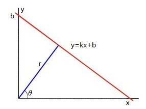


所以：

$$
\begin{aligned}
y=kx+b &\Rightarrow y=\left( -\frac{cos \theta}{sin \theta} \right)x+\left( \frac{r}{sin \theta} \right) \\
&\Rightarrow r=xcos \theta + y sin \theta
\end{aligned}
$$

对于$r=xcos \theta + y sin \theta$，当固定$x$和$y$而不断变化$\theta$的取值时，会得到相应的$r$的值。若以$\theta$为横轴，以$r$为纵轴建立坐标系（简称$\theta-r$坐标系），然后绘制每一对$\theta$与$r$确定的点，则会形成一条曲线。在几何意义上，这条曲线上的每个点($\theta,r$)都对应着笛卡尔坐标系下经过点$(x,y)$的一条直线，所以整个曲线也就对应对笛卡尔坐标系下经过点$(x,y)$的所有直线。

以直线$\displaystyle y = -\frac{3}{4}x+12$为例，点(8,6)在这条直线上，则在$\theta-r$坐标系下，$r=8 cos \theta+6 sin \theta$对应的曲线如下图所示（只考虑满足$r>0$和$0<\theta<2 \pi$的点）：


图中红色小圆标注的点对应于直角坐标系下的点(8,6)。

类似地，我们还可以在直线$\displaystyle y = -\frac{3}{4}x+12$再找两个点，比如(4,9)和(12,3)，然后在$\theta-r$坐标系下，绘制$r=4 cos \theta+9 sin \theta$和$r=12 cos \theta+3 sin \theta$对应的曲线。


从图中可以看出，三条曲线有交点$\displaystyle \left( arctan \left( \frac{4}{3} \right),9.6 \right)$，而该点对应于直角坐标系的点$\displaystyle \left( 9.6 \times cos \left( arctan \left( \frac{4}{3} \right) \right)=5.76,\;9.6 \times sin \left( arctan \left( \frac{4}{3} \right) \right)=7.68 \right)$也在直线$\displaystyle y = -\frac{3}{4}x+12$上。

总结而言，这个现象背后的结论是：在笛卡尔坐标系下，经过一点(x,y)的所有直线可以在$\theta-r$坐标系下用一条曲线$r=xcos \theta + y sin \theta$表示。而在$\theta-r$坐标系下，若有$n$条曲线相交于一点，则表明存在$n$个点共线，当$n$越大，表示该交点所代表的直线上有越多的点，则越能相信$n$点确定的直线“存在”。OpenCV使用该结论形成了霍夫直线变换方法，用来检测图像中存在的直线。它在$\theta-r$坐标系下每个点的曲线相交情况。如果某点上的交叉曲线的数量高于某个阈值，则它将其确定为由$(\theta,r)$确定的直线。


OpenCV实现了两种霍夫直线变换：

* 标准霍夫直线变换函数**cv.HoughLines**，它会返回一组参数$(\theta,r,votes)$    
* 概率霍夫直线变换函数**cv.HoughLinesP**，它会返回检测到的直线的两个端点坐标$(x0,y0,x1,y1)$ 

**示例**


``` r
#按灰度图模式读取图像文件
src = cv_imread("images/abox02.jpg",IMREAD_GRAYSCALE)
#用Canny算子获取边缘，结果保存在dst中
dst = Mat()
cv_Canny(src,dst,50,20,3)

#对dst进行霍夫直线变换检测直线（设置阈值为100），结果保存在llines中
#每组的votes表明有多少条曲线交于rho和theta确定的点
llines = stdVecOfVec2f()
cv_HoughLines(dst,llines,1,pi/180,100)

llines$size()
```

```
## [1] 16
```

``` r
#基于llines形成数据框，并计算每条曲线上的固定点坐标
daf = data.frame(rho=numeric(llines$size()),theta=numeric(llines$size()))
for(i in 1:nrow(daf)-1){
  daf$rho[i+1] = llines[[i]][0]
  daf$theta[i+1] = llines[[i]][1]
}
daf$x = daf$rho * cos(daf$theta)
daf$y = daf$rho * sin(daf$theta)

for(i in 1:nrow(daf)){
  cv_circle(src,Point(daf$x[i],daf$y[i]),5,Scalar(255),1)
}
cv_imshow('src',src)
# 为何找到的点与想象中不一样
# 找到的点，是确定存在直线经过的点
```


**示例**


``` r
#以灰度模式读取图像文件
src = cv_imread("images/sudoku.png",IMREAD_GRAYSCALE)
#用Canny算子获取边缘，结果保存在dst中
dst = Mat()
cv_Canny(src,dst,50,20,3)

#将dst转变为三通道彩色图，保存在cdst中
cdst = Mat()
cv_cvtColor(dst,cdst,COLOR_GRAY2BGR)
#克隆cdst，形成克隆体cdstP
cdstP = cdst$clone()

#对dst进行霍夫直线变换检测直线（设置阈值为150），结果保存在llines中
llines = stdVecOfVec2f()
cv_HoughLines(dst,llines,1,pi/180,150)

#在cdst中绘制各条直线
for(i in 1:llines$size()-1){
  #取出一条直线对应的rho和theta
  rho=llines[[i]][0]
  theta=llines[[i]][1]
  #计算theta的余弦和正弦值，分别存入a，b中
  a = cos(theta)
  b = sin(theta)
  #计算x0,y0
  x0=rho*a
  y0=rho*b
  #通过x0,y0计算待绘制直线上的两个点
  pt1 = Point()
  pt2 = Point()
  pt1$x = round(x0+1000*(-b))
  pt1$y = round(y0+1000*a)
  pt2$x = round(x0-1000*(-b))
  pt2$y = round(y0-1000*a)
  #绘制直线
  cv_line(cdst,pt1,pt2,Scalar(0,0,255),3,LINE_AA)
}

#对dst进行霍夫直线概率变换检测直线（设置阈值为150），结果保存在linesP中
linesP = stdVecOfVec4i()
cv_HoughLinesP(dst,linesP,1,pi/180,50,50,10)
#在cdstP中绘制各条直线
for(i in 1:linesP$size()-1){
  l = linesP[[i]]
  cv_line(cdstP,Point(l[0],l[1]),Point(l[2],l[3]),Scalar(0,0,255),3,LINE_AA)
}

#显示结果
cv_imshow("Source", src)
cv_imshow("Detected Lines (in red) - Standard Hough Line Transform", cdst)
cv_imshow("Detected Lines (in red) - Probabilistic Line Transform", cdstP)
```

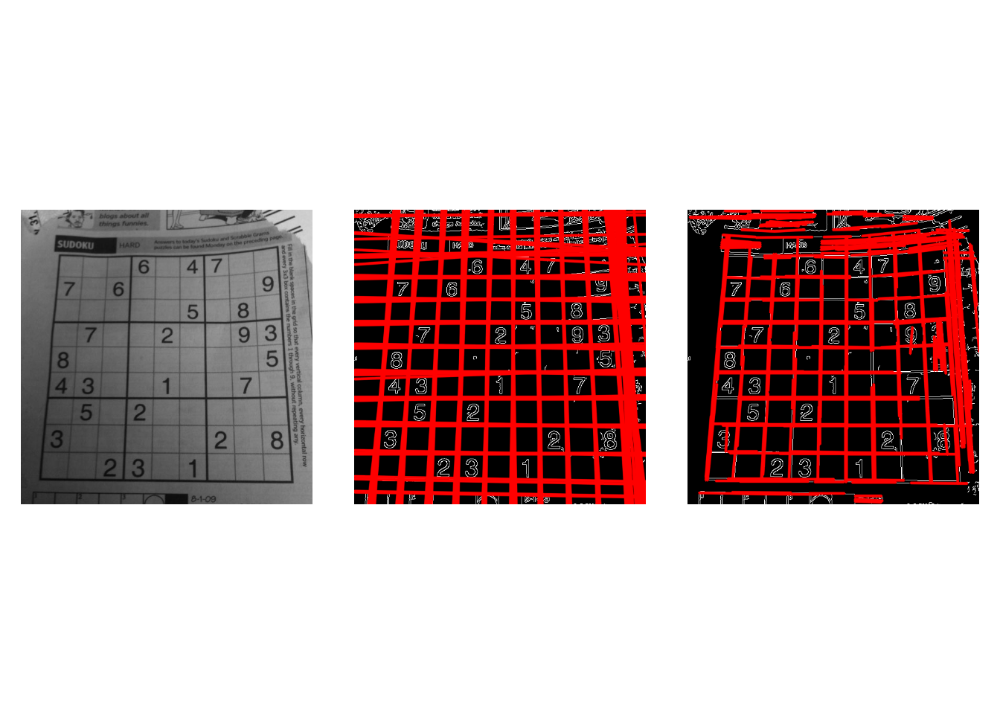


## 霍夫圆变换

霍夫圆变换的工作方式大致上类似于霍夫直线变换。二者的一个明显区别在于：在直线检测情况下，只需两个参数$\theta$和$r$来确定一条直线. 而在圆检测情况下，需要三个参数$x_{center},y_{center},r$来定义一个圆（如下图所示），其中$(x_{center},y_{center}$定义了中心位置（绿点），r是半径。


<!-- 为了提高效率，OpenCV实现了一种比标准Hough变换稍微复杂的检测方法：Hough梯度法，它由两个主要阶段组成。第一阶段是边缘检测和寻找可能的圆心，第二阶段是寻找每个候选圆心的最佳半径。 -->

OpenCV将霍夫圆变换封装在了**HoughCircles**函数中。

**示例**


``` r
#读取图像文件
src = cv_imread("images/smarties.png")
#将src灰度化，结果保存在gray中
gray = Mat()
cv_cvtColor(src,gray,COLOR_BGR2GRAY)
#对gray进行平滑（使用中位数滤波器），结果保存在blured中
blured = Mat()
cv_medianBlur(gray,blured,5)
#获取blured的基本信息
blured_info = rcv_matInfo(blured)

#对blured进行霍夫圆变换检测圆，
#检测时两个圆的圆心距离不得低于图像高度的1/16
#待检测的圆的最小半径为1，最大半径为30，
#结果保存在circles中，
circles = stdVecOfVec3f()
cv_HoughCircles(blured,circles,HOUGH_GRADIENT,1,
                blured_info$height/16,100,30,1,30)

#在src上绘制检测出的各个圆
for(i in 1:circles$size()-1){
  cir = circles[[i]]
  center = Point(cir[0],cir[1])
  cv_circle(src,center,1,Scalar(0,100,100),3,LINE_AA)
  radius = cir[2]
  cv_circle(src,center,radius,Scalar(255,0,255),3,LINE_AA)
}
#显示结果
cv_imshow("detected circles",src)
```

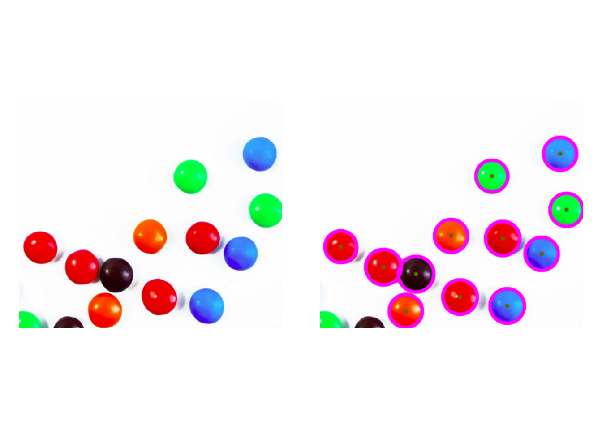

## 重映射

重映射指的是依据源图像与目标图像之间的像素位置映射关系，将原图像一个位置上的像素放置到目标图像中的对应位置。像素位置映射关系可以通过两个矩阵来指定：一个矩阵表示原图像像素的横坐标（即列位置），可称之为像素横坐标映射矩阵；另一矩阵表示原图像像素的纵坐标（即行位置），可称之为像素纵坐标映射矩阵。

比如，有一个3行3列的图像矩阵$I$：


|   |   |   |
|--:|--:|--:|
|  1|  4|  7|
|  2|  5|  8|
|  3|  6|  9|

像素横坐标映射矩阵（map_x）为：


|   |   |   |
|--:|--:|--:|
|  1|  0|  2|
|  1|  2|  2|
|  1|  0|  0|

像素纵坐标映射矩阵（map_y）为：


|   |   |   |
|--:|--:|--:|
|  2|  0|  0|
|  1|  1|  2|
|  0|  1|  2|

则对$I$进行重映射时，相应的操作可以理解为：

* 由于map.x的第1行第1列元素为1（即像素横坐标为2），map.y的第1行第1列元素为2（即像素纵坐标为3），所以把$I$的第3行第2列元素6放置在目标图像的第1行第1列；  
* 由于map.x的第1行第2列元素为0（即像素横坐标为1），map.y的第1行第2列元素为0（即像素纵坐标为1），所以把$I$的第1行第1列元素1放置在目标图像的第1行第2列；  
* 由于map.x的第1行第3列元素为2（即像素横坐标为3），map.y的第1行第3列元素为0（即像素纵坐标为1），所以把$I$的第1行第3列元素7放置在目标图像的第1行第3列；  
* 以此类推

所以，重映射完成后，结果为：

|   |   |   |
|--:|--:|--:|
|  6|  1|  7|
|  5|  8|  9|
|  4|  2|  3|

在重映射过程中，当源图像和目标图像的像素不存在一一对应关系是，可能需要对非整数像素位置进行一些插值。

OpenCV将重映射操作封装在了**remap**函数中。

**示例**

通过重映射，实现图像左右翻转效果：


``` r
#读取图像文件
img = cv_imread("images/lena.jpg")
#获取图像基本信息
img_info = rcv_matInfo(img)

#生成像素横坐标映射矩阵mapx，第i列元素的值都为img_info$width-i
mapx_mat = matrix(rep(img_info$width:1 - 1,each=img_info$height),
              nr=img_info$height,nc=img_info$width)
mapx = Mat(nrow(mapx_mat),ncol(mapx_mat),CV_32FC1)
mapx$r2cv(mapx_mat)
#生成像素纵坐标映射矩阵mapy，第i行元素的值都为i-1
mapy_mat = matrix(rep(1:img_info$height -1,times=img_info$width),
              nr=img_info$height,nc=img_info$width)
mapy = Mat(nrow(mapy_mat),ncol(mapy_mat),CV_32FC1)
mapy$r2cv(mapy_mat)

#对img进行重映射，
#插值方式为INTER_NEAREST，
#边缘扩展方式为BORDER_DEFAULT，
#结果保存在dst中
dst = Mat()
cv_remap(img,dst,mapx,mapy,INTER_NEAREST,BORDER_DEFAULT)
```

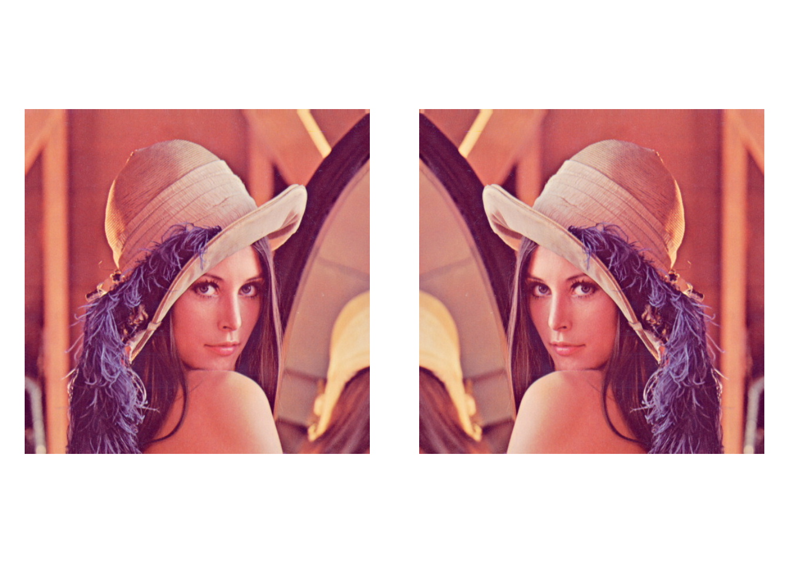


通过重映射，实现图像上下翻转效果：


``` r
#读取图像文件
img = cv_imread("images/lena.jpg")
#获取图像基本信息
img_info = rcv_matInfo(img)

#生成像素横坐标映射矩阵mapx，第i列元素的值都为 i-1
mapx_mat = matrix(rep(1:img_info$width - 1,each=img_info$height),
              nr=img_info$height,nc=img_info$width)
mapx = Mat(img_info$height,img_info$width,CV_32FC1)
mapx$r2cv(mapx_mat)
#生成像素纵坐标映射矩阵mapy，第i行元素的值都为 img.info$height-i
mapy_mat = matrix(rep(img_info$height:1 -1,times=img_info$width),
              nr=img_info$height,nc=img_info$width)
mapy = Mat(img_info$height,img_info$width,CV_32FC1)
mapy$r2cv(mapy_mat)

#对img进行重映射，
#插值方式为INTER_NEAREST，
#边缘扩展方式为BORDER_DEFAULT，
#结果保存在dst中
dst = Mat()
cv_remap(img,dst,mapx,mapy,INTER_NEAREST,BORDER_DEFAULT)
```


通过重映射，使得目标图像仅取源图像左上角的1/4部分：


``` r
#读取图像文件
img = cv_imread("images/lena.jpg")
#获取图像基本信息
img_info = rcv_matInfo(img)

#生成像素横坐标映射矩阵mapx，第i列元素的值都为 i-1
mapx_mat = matrix(rep(1:img_info$width - 1,each=img_info$height),
              nr=img_info$height,nc=img_info$width)
#生成像素纵坐标映射矩阵mapy，第i行元素的值都为 img_info$height-i
mapy_mat = matrix(rep(1:img_info$height -1,times=img_info$width),
              nr=img_info$height,nc=img_info$width)


#mapx右半部分的值都加上原图像宽度的1/2，而mapy下半部分的值都加上原图像高度的1/2，
#如此一来，目标图像中仅有左上角1/4的像素与原图像左上角1/4的像素有对应关系
mapx_mat[,(img_info$width/2):img_info$width] = 
  mapx_mat[,(img_info$width/2):img_info$width] + img_info$width/2
mapx = Mat(img_info$height,img_info$width,CV_32FC1)
mapx$r2cv(mapx_mat)
mapy_mat[(img_info$height/2):img_info$height,] =
  mapy_mat[(img_info$height/2):img_info$height,] + img_info$height/2
mapy = Mat(img_info$height,img_info$width,CV_32FC1)
mapy$r2cv(mapy_mat)

#对img进行重映射，
#插值方式为INTER_NEAREST，
#边缘扩展方式为BORDER_CONSTANT，扩展像素值为黑色(0,0,0)
#结果保存在dst中
dst = Mat()
cv_remap(img,dst,mapx,mapy,INTER_NEAREST,BORDER_CONSTANT,Scalar(0,0,0))
```


通过重映射，使得目标图像仅取源图像右上角的1/4部分和左下角的1/4部分：


``` r
#读取图像文件
img = cv_imread("images/lena.jpg")
#获取图像基本信息
img_info = rcv_matInfo(img)

#生成像素横坐标映射矩阵mapx_mat，第i列元素的值都为 i-1
mapx_mat = matrix(rep(1:img_info$width - 1,each=img_info$height),
              nr=img_info$height,nc=img_info$width)
#生成像素纵坐标映射矩阵mapy_mat，第i行元素的值都为 img_info$height-i
mapy_mat = matrix(rep(1:img_info$height -1,times=img_info$width),
              nr=img_info$height,nc=img_info$width)

#mapx_mat左上角1/4的元素都变为-1，mapy_mat右下角1/4的元素也变为-1，
mapx_mat[1:(img_info$height/2),1:(img_info$width/2)] = -1
mapx = Mat(img_info$height,img_info$width,CV_32FC1)
mapx$r2cv(mapx_mat)
mapy_mat[(img_info$height/2):img_info$height,(img_info$width/2):img_info$width] = -1
mapy = Mat(img_info$height,img_info$width,CV_32FC1)
mapy$r2cv(mapy_mat)

#对img进行重映射，
#插值方式为INTER_NEAREST，
#边缘扩展方式为BORDER_CONSTANT，扩展像素值为黑色(0,0,0)
#结果保存在dst中
dst = Mat()
cv_remap(img,dst,mapx,mapy,INTER_NEAREST,BORDER_CONSTANT,Scalar(0,0,0))
```

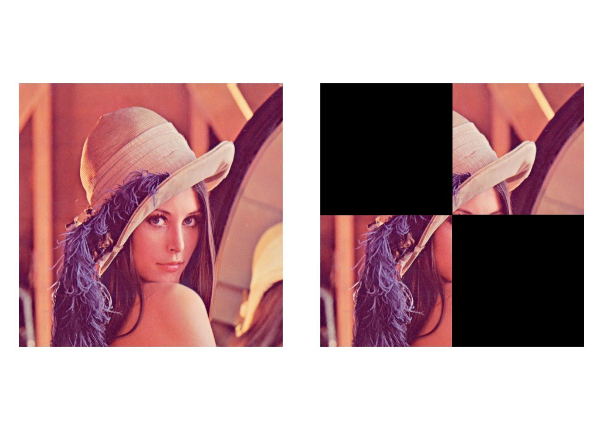

**示例**


``` r
#读取图像文件
img = cv_imread("images/lena.jpg")
#获取图像基本信息
img_info = rcv_matInfo(img)

#生成像素横坐标映射矩阵mapx_mat，第i列元素的值都为i-1
mapx_mat = matrix(rep(1:img_info$width - 1,each=img_info$height),
              nr=img_info$height,nc=img_info$width)
#生成像素纵坐标映射矩阵mapy_mat，第i行元素的值都为i-1
mapy_mat = matrix(rep(1:img_info$height -1,times=img_info$width),
              nr=img_info$height,nc=img_info$width)

#mapx的所有值加上原图像宽度的1/2，而mapy的所有值都加上原图像高度的1/2，
#如此一来，目标图像中仅有左上角1/4的像素与原图像右下角1/4的像素有对应关系
mapx_mat = mapx_mat + img_info$width/2
mapx = Mat(img_info$height,img_info$width,CV_32FC1)
mapx$r2cv(mapx_mat)
mapy_mat = mapy_mat + img_info$height/2
mapy = Mat(img_info$height,img_info$width,CV_32FC1)
mapy$r2cv(mapy_mat)

#对img进行重映射，
#插值方式为INTER_NEAREST，
#边缘扩展方式为BORDER_CONSTANT，扩展像素值都为(128,128,128)，
#结果保存在dst_constant中
dst_constant = Mat()
cv_remap(img,dst_constant,mapx,mapy,INTER_NEAREST,BORDER_DEFAULT,Scalar(128,128,128))

#对img进行重映射，
#插值方式为INTER_NEAREST，
#边缘扩展方式为BORDER_REPLICATE，
#结果保存在dst_replicate中
dst_replicate = Mat()
cv_remap(img,dst_replicate,mapx,mapy,INTER_NEAREST,BORDER_REPLICATE)

#对img进行重映射，
#插值方式为INTER_NEAREST，
#边缘扩展方式为BORDER_REFLECT，
#结果保存在dst_reflect中
dst_reflect = Mat()
cv_remap(img,dst_reflect,mapx,mapy,INTER_NEAREST,BORDER_REFLECT)

#对img进行重映射，
#插值方式为INTER_NEAREST，
#边缘扩展方式为BORDER_WRAP，
#结果保存在dst_wrap中
dst_wrap = Mat()
cv_remap(img,dst_wrap,mapx,mapy,INTER_NEAREST,BORDER_WRAP)

#对img进行重映射，
#插值方式为INTER_NEAREST，
#边缘扩展方式为BORDER_DEFAULT，
#结果保存在dst_default中
dst_default = Mat()
cv_remap(img,dst_default,mapx,mapy,INTER_NEAREST,BORDER_DEFAULT)
```

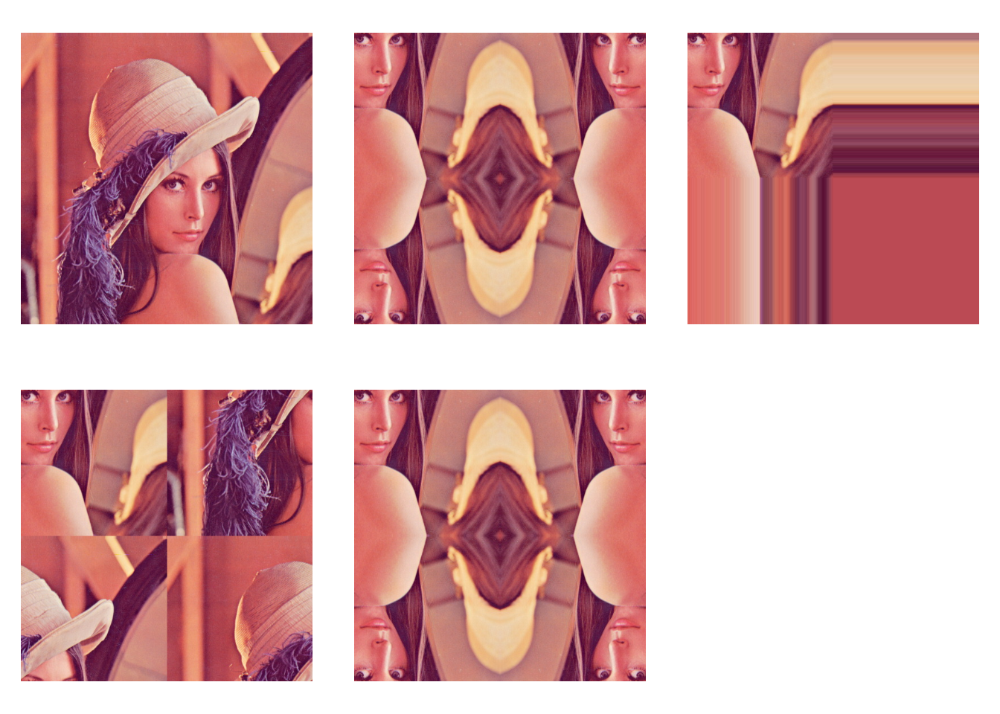

## 直方图计算

对于一个8位单通道图像矩阵，其像素取值范围在0到255之间，这时可以将这个范围划分成$n,1\le n  \le256$个紧挨但不交叉的区间$b_1,b_2,\dots,b_n$，然后依据像素值统计位于各个区间的像素个数，形成一个频数统计表，常称这样形成的表为直方图，在图形化展示方面，直方图的常见效果形如下图。


OpenCV在**calcHist**函数中封装了直方图计算操作。

**示例**

以下代码演示了如何使用该函数计算8位无符号单通道图像矩阵的直方图。


``` r
#按指定频率重复生成0,1,2,...,7这8个数：
#0-7这8个数重复的次数分别为19,25,21,16,8,6,3和2，结果保存在x中
x = rep(0:7,c(19,25,21,16,8,6,3,2))
#对x随机排序后,转变为10行10列矩阵m
set.seed(123)
m_mat = matrix(sample(x),nr=10,nc=10)
#查看矩阵m中各个元素出现的次数
table(m_mat)
```

```
## m_mat
##  0  1  2  3  4  5  6  7 
## 19 25 21 16  8  6  3  2
```

``` r
#将m转变为图像矩阵
img = Mat(10,10,CV_8UC1)
img$r2cv(m_mat)

#使用calcHist函数（第三个重载形式）计算img的直方图，结果保存在hist中
imgs = stdVecOfMat()
imgs$push_back(img)
channels = stdVecOfint()
channels$push_back(0)
hist = Mat()
histSize = stdVecOfint()
histSize$push_back(256) #指定划分区间个数
histRange = stdVecOffloat()
histRange$push_back(0)#指定划分区间的最小端点值
histRange$push_back(256)#指定划分区间的最大端点值（这种方式表明划分区间是等长度的）
cv_calcHist(imgs,
              channels, #由于是单通道，所以只能指定为0
              Mat(), #遮罩矩阵参数设置为空矩阵
              hist,
              histSize,
              histRange)

#查看结果
c(hist$cv2r())
```

```
##   [1] 19 25 21 16  8  6  3  2  0  0  0  0  0  0  0  0  0  0  0  0  0  0  0  0  0
##  [26]  0  0  0  0  0  0  0  0  0  0  0  0  0  0  0  0  0  0  0  0  0  0  0  0  0
##  [51]  0  0  0  0  0  0  0  0  0  0  0  0  0  0  0  0  0  0  0  0  0  0  0  0  0
##  [76]  0  0  0  0  0  0  0  0  0  0  0  0  0  0  0  0  0  0  0  0  0  0  0  0  0
## [101]  0  0  0  0  0  0  0  0  0  0  0  0  0  0  0  0  0  0  0  0  0  0  0  0  0
## [126]  0  0  0  0  0  0  0  0  0  0  0  0  0  0  0  0  0  0  0  0  0  0  0  0  0
## [151]  0  0  0  0  0  0  0  0  0  0  0  0  0  0  0  0  0  0  0  0  0  0  0  0  0
## [176]  0  0  0  0  0  0  0  0  0  0  0  0  0  0  0  0  0  0  0  0  0  0  0  0  0
## [201]  0  0  0  0  0  0  0  0  0  0  0  0  0  0  0  0  0  0  0  0  0  0  0  0  0
## [226]  0  0  0  0  0  0  0  0  0  0  0  0  0  0  0  0  0  0  0  0  0  0  0  0  0
## [251]  0  0  0  0  0  0
```

从结果可以看出，0-7这8个数出现的频数依次为19,25,21,16,8,6,3和2，其余数出现的频数都为0，这与预期一致。


类似地，可以计算三通道图像的每个通道（即蓝色分量矩阵、绿色分量矩阵和红色分量矩阵）的直方图：


``` r
#按指定频率重复生成0,1,2,...,7这8个数：
#0-7这8个数重复的次数分别为19,25,21,16,8,6,3和2，结果保存在x中
x = rep(0:7,c(19,25,21,16,8,6,3,2))
#对x随机排序后,转变为10行10列矩阵m
set.seed(123)
m = matrix(sample(x),nr=10,nc=10)

#形成一个3维全0数组
arr = array(0,dim=c(10,10,3))
#将arr包含的3个10行10列矩阵都更改为m
arr[,,1] = m
arr[,,2] = m
arr[,,3] = m

#将arr转变为图像矩阵
img = Mat(10,10,CV_8UC3)
img$r2cv(arr)

imgs = stdVecOfMat()
imgs$push_back(img)
histSize = stdVecOfint()
histSize$push_back(8) #指定划分区间个数
histRange = stdVecOffloat()
histRange$push_back(0)#指定划分区间的最小端点值
histRange$push_back(8)#指定划分区间的最大端点值（这种方式表明划分区间是等长度的）

#使用calcHist函数（第三个重载形式）计算img三个通道的直方图，
#结果分别保存在hist_blue、hist_green和hist_red中
channels = stdVecOfint()
channels$push_back(0)
hist_blue = Mat()
cv_calcHist(imgs,
              channels, #针对第1个通道，即蓝色分量矩阵计算直方图
              Mat(), #遮罩矩阵参数设置为空矩阵
              hist_blue,
              histSize,
              histRange)
channels = stdVecOfint()
channels$push_back(1)
hist_green = Mat()
cv_calcHist(imgs,
              channels, #针对第2个通道，即绿色分量矩阵计算直方图
              Mat(), #遮罩矩阵参数设置为空矩阵
              hist_green,
              histSize,
              histRange)
channels = stdVecOfint()
channels$push_back(2)
hist_red = Mat()
cv_calcHist(imgs,
              channels, #针对第3个通道，即红色分量矩阵计算直方图
              Mat(), #遮罩矩阵参数设置为空矩阵
              hist_red,
              histSize,
              histRange)

#查看三个通道的直方图
c(hist_blue$cv2r())
```

```
## [1] 19 25 21 16  8  6  3  2
```

``` r
c(hist_green$cv2r())
```

```
## [1] 19 25 21 16  8  6  3  2
```

``` r
c(hist_red$cv2r())
```

```
## [1] 19 25 21 16  8  6  3  2
```

从结果可以看出，0-7这8个数在三个通道上出现的频数依次都是19,25,21,16,8,6,3和2，这与预期一致。

**示例**

已知一个手部图像和相应的遮罩图像：


而遮罩图像中的白色区域大致覆盖了整个手部：


可以通过如下代码计算遮罩图像白色区域对应的手部图像的色调-饱和度直方图：


``` r
#读取图像文件
img = cv_imread("images/palm_0.jpg")
#读取遮罩图像文件
mask = cv_imread("images/palm_0_mask.png",0)

#将img转变为HSV三通道图像矩阵
img_hsv = Mat() 
cv_cvtColor(img,img_hsv,COLOR_BGR2HSV)

#在遮罩矩阵作用下计算img.hsv的色调-饱和度直方图，结果保存在hhist中
imgs = stdVecOfMat()
imgs$push_back(img_hsv)
channels = stdVecOfint()
channels$push_back(0)
channels$push_back(1)
hhist = Mat()
histSize = stdVecOfint()
histSize$push_back(180) #指定H通道的划分区间个数
histSize$push_back(256) #指定S通道的划分区间个数
histRange = stdVecOffloat()
histRange$push_back(0)#指定H通道划分区间的最小端点值
histRange$push_back(180)#指定H通道划分区间的最大端点值
histRange$push_back(0)#指定S通道划分区间的最小端点值
histRange$push_back(256)#指定S通道划分区间的最大端点值
cv_calcHist03(imgs,
              channels,#针对H通道和S通道计算直方图 
              mask, #遮罩矩阵
              hhist,
              histSize, 
              histRange 
              )

#对hhist进行归一化（最大最小值方式），以便可视化展示
cv_normalize(hhist,hhist,norm_type = NORM_MINMAX)
cv_imshow('hist',hhist)
```


**示例**

在实际应用中，OpenCV的**cv::calcHist**函数还可以同时依据两个通道计算直方图，这种直方图可以被称为双通道直方图，而上面只针对一个通道计算的结果是单通道直方图。


``` r
#按指定频率重复生成0,1,2,...,7这8个数：
#0-7这8个数重复的次数分别为19,25,21,16,8,6,3和2，结果保存在x中
x = rep(0:7,c(19,25,21,16,8,6,3,2))
#对x随机排序后,转变为10行10列矩阵m1
set.seed(123)
m1 = matrix(sample(x),nr=10,nc=10)
#再对x随机排序后,转变为10行10列矩阵m2
set.seed(124)
m2 = matrix(sample(x),nr=10,nc=10)
#继续对x随机排序后,转变为10行10列矩阵m3
set.seed(125)
m3 = matrix(sample(x),nr=10,nc=10)

#形成一个3维全0数组
arr = array(0,dim=c(10,10,3))
#将arr包含的3个10行10列矩阵分别改为m1,m2和m3
arr[,,1] = m1
arr[,,2] = m2
arr[,,3] = m3

#将m转变为图像矩阵
img = Mat(10,10,CV_8UC1)
img$r2cv(arr)

#使用calcHist函数（第三个重载形式）计算img的双通道直方图，结果保存在hist中
imgs = stdVecOfMat()
imgs$push_back(img)
channels = stdVecOfint()
channels$push_back(0)
channels$push_back(1)
hist = Mat()
histSize = stdVecOfint()
histSize$push_back(8) #指定1个通道的划分区间个数
histSize$push_back(4) #指定2个通道的划分区间个数
histRange = stdVecOffloat()
histRange$push_back(0)#指定1个通道划分区间的最小端点值
histRange$push_back(8)#指定1个通道划分区间的最大端点值
histRange$push_back(0)#指定2个通道划分区间的最小端点值
histRange$push_back(8)#指定2个通道划分区间的最大端点值

cv_calcHist(imgs,
              channels,#针对第1个和第2个通道计算直方图 
              Mat(), #遮罩矩阵参数设置为空矩阵
              hist,
              histSize,
              histRange)

#查看结果
hist$cv2r()
```

```
##      [,1] [,2] [,3] [,4]
## [1,]    9    6    2    2
## [2,]   15    7    2    1
## [3,]    7   12    2    0
## [4,]    6    5    4    1
## [5,]    2    4    2    0
## [6,]    3    1    1    1
## [7,]    2    1    0    0
## [8,]    0    1    1    0
## attr(,"depth")
## [1] 5
```

结果表明：

* 第1行第1列的元素为9，表明图像矩阵img中有9个像素满足：其蓝色分量位于8个划分区间中的第1个，且其绿色分量位于4个划分区间中的第1个；  
* 第1行第2列的元素为6，表明图像矩阵img中有6个像素满足：其蓝色分量位于8个划分区间中的第1个，且其绿色分量位于4个划分区间中的第2个；  
* 第1行第3列的元素为2，表明图像矩阵img中有2个像素满足：其蓝色分量位于8个划分区间中的第1个，且其绿色分量位于4个划分区间中的第3个；  
* 第1行第4列的元素为2，表明图像矩阵img中有2个像素满足：其蓝色分量位于8个划分区间中的第1个，且其绿色分量位于4个划分区间中的第4个； 
* 以此类推。

同时也可以看到，当对矩阵按行求和时，结果依次为19,25,21,16,8,6,3和2，这正好是蓝色分量矩阵中0-7这8个数出现的频次数。

这个双通道直方图计算结果，还可以通过如下代码来验证：


``` r
#按指定频率重复生成0,1,2,...,7这8个数：
#0-7这8个数重复的次数分别为19,25,21,16,8,6,3和2，结果保存在x中
x = rep(0:7,c(19,25,21,16,8,6,3,2))
#对x随机排序后,转变为10行10列矩阵m1
set.seed(123)
m1 = matrix(sample(x),nr=10,nc=10)
#再对x随机排序后,转变为10行10列矩阵m2
set.seed(124)
m2 = matrix(sample(x),nr=10,nc=10)
#继续对x随机排序后,转变为10行10列矩阵m3
set.seed(125)
m3 = matrix(sample(x),nr=10,nc=10)

#将m1的元素划分为8个区间（左闭右开型区间）
zone_1 = cut(m1,breaks = 0:8,right = F)
#将m2的元素划分为4个区间（左闭右开型区间）
zone_2 = cut(m2,breaks = seq(0,8,by=2),right = F)
#统计频数（以m1的划分区间为行，以m2的划分区间为列）
table(zone_1,zone_2)
```

```
##        zone_2
## zone_1  [0,2) [2,4) [4,6) [6,8)
##   [0,1)     9     6     2     2
##   [1,2)    15     7     2     1
##   [2,3)     7    12     2     0
##   [3,4)     6     5     4     1
##   [4,5)     2     4     2     0
##   [5,6)     3     1     1     1
##   [6,7)     2     1     0     0
##   [7,8)     0     1     1     0
```

**示例**

以下代码演示了如何通过R语言的hist函数来绘制图像矩阵的直方图：


``` r
#读取图像文件
src = cv_imread("images/lena.jpg")

#用split函数分离图像矩阵的通道，结果保存在bgr_planes中
bgr_planes = stdVecOfMat(3)
cv_split(src, bgr_planes)

#将bgr_planes中的三个图像矩阵转变为R语言的矩阵
b_mat = bgr_planes[[0]]$cv2r()
g_mat = bgr_planes[[1]]$cv2r()
r_mat = bgr_planes[[2]]$cv2r()

#用hist函数绘制三个b.mat、g.mat和r.mat的直方图(划分区间数都为256个)
op = par(mfrow=c(3,1))
hist(b_mat,breaks=256,col="blue",main="蓝色分量矩阵直方图",xlab="",ylab="")
hist(g_mat,breaks=256,col="green",main="绿色分量矩阵直方图",xlab="",ylab="")
hist(r_mat,breaks=256,col="red",main="红色分量矩阵直方图",xlab="",ylab="")
```


``` r
par(op)
```

进一步，可以依据直方图绘制图像像素强度的密度曲线图：


``` r
#读取图像文件
src = cv_imread("images/lena.jpg")

#用split函数分离图像矩阵的通道，结果保存在bgr_planes中
bgr_planes = stdVecOfMat(3)
cv_split(src, bgr_planes)

#将bgr_planes中的三个图像矩阵转变为R语言的矩阵
b_mat = bgr_planes[[0]]$cv2r()
g_mat = bgr_planes[[1]]$cv2r()
r_mat = bgr_planes[[2]]$cv2r()

#用hist函数计算b_mat、g_mat和r_mat的直方图
b_ht = hist(b_mat,breaks=256,plot=F)
g_ht = hist(g_mat,breaks=256,plot=F)
r_ht = hist(r_mat,breaks=256,plot=F)

#依据hist计算结果返回的区间中点和密度值绘制图像强度的密度曲线图
#首先要获取三个直方图的最大密度值，并放大1.1倍作为纵轴的上限
ymax = max(c(b_ht$density,g_ht$density,r_ht$density))*1.1 
#绘制蓝色分量矩阵像素强度密度曲线
plot(b_ht$mids,b_ht$density,type='l',col="blue",xlim=c(0,255),ylim=c(0,ymax),main = "",xlab="",ylab="",bty="n",xaxs="i",yaxs="i")
#绘制绿色分量矩阵像素强度密度曲线
lines(g_ht$mids,g_ht$density,col="green")
#绘制红色分量矩阵像素强度密度曲线
lines(r_ht$mids,r_ht$density,col="red")
```


**示例**

以下代码演示了如何计算计算图形的双通道直方图并进行可视化展示：


``` r
#读取图像文件
img = cv_imread("images/palm_0.jpg")

#将img转变为HSV三通道图像矩阵，结果保存在img_hsv中
img_hsv = Mat()
cv_cvtColor(img,img_hsv,COLOR_BGR2HSV)

#使用calcHist函数（第三个重载形式）计算img_hsv的双通道直方图，结果保存在hhist中
histSize = stdVecOfint()
histSize$push_back(180)#指定H通道和S通道的直方图划分区间数
histSize$push_back(256)#指定S通道和S通道的直方图划分区间数
histRange = stdVecOffloat()
histRange$push_back(0)#指定H通道划分区间的最小端点值
histRange$push_back(180)#指定H通道划分区间的最大端点值
histRange$push_back(0)#指定S通道划分区间的最小端点值
histRange$push_back(256)#指定S通道划分区间的最大端点值 
imgs = stdVecOfMat()
imgs$push_back(img_hsv)
channels = stdVecOfint()
channels$push_back(0)
channels$push_back(1)
hhist = Mat()
cv_calcHist(imgs,
              channels,#针对H通道和S通道计算直方图（即色调-饱和度直方图） 
              Mat(), #遮罩矩阵参数设置为空矩阵
              hhist,
              histSize,
              histRange)

#对hist进行归一化（最大最小值方式），以便可视化展示
cv_normalize(hhist,hhist,norm_type = NORM_MINMAX)
cv_imshow('hist',hhist)
```


## 直方图均衡化

先读取pout.tif图像文件，并绘制其直方图：


可以看到，直方图主要分布在80-160的范围里，且在这个范围内的分布也很不均匀，所以在视觉上，这个图形的对比度偏弱。


直方图均衡化可以将图像矩阵的直方图映射成为另一个分布范围更宽、分布更均匀的直方图，进而增强图像的对比度。OpenCV封装的**equalizeHist**函数可以针对8位无符号单通道图像进行直方图均衡化，其主要步骤是：

* 计算图像的直方图（划分区间个数为256，像素取值范围为0-255）；  
* 对直方图归一化（即直方图除以图像的像素量——图像的高度与宽度的乘积）；  
* 对归一化的直方图进行累计求和，求和所得的结果常被称为累计直方图或者累计分布图，体现的是图像在对应像素取值处的累计分布值；  
* 生成与遍历图像的每个像素，依据其取值情况在累计直方图中查询相应的累计分布值，并把这个值作为图像该像素新的取值；  
* 对图像的像素值进行归一化（最大最小值方式），确保像素值范围为[0,255]区间。  

**示例**


``` r
#按指定频率重复生成0,1,2,...,7这8个数：
#0-7这8个数重复的次数分别为19,25,21,16,8,6,3和2，结果保存在x中
x = rep(0:7,c(19,25,21,16,8,6,3,2))
#对x随机排序后,转变为10行10列矩阵m
set.seed(123)
m = matrix(sample(x),nr=10,nc=10)
#查看矩阵m中各个元素出现的次数
table(m)
```

```
## m
##  0  1  2  3  4  5  6  7 
## 19 25 21 16  8  6  3  2
```

``` r
#将m转变为图像矩阵
img = Mat(10,10,CV_8UC1)
img$r2cv(m)

#使用equalizeHist对img进行直方图均衡化
dst = Mat()
cv_equalizeHist(img,dst)

#查看结果
dst_mat = dst$cv2r()
table(dst_mat)
```

```
## dst_mat
##   0  79 145 195 220 239 249 255 
##  19  25  21  16   8   6   3   2
```

从运行结果可以看到，均衡化之前的像素分布在[0,7]区间，而均衡化后的像素分布在[0,255]区间。这个结果，还可以通过如下代码验证：


``` r
#按指定频率重复生成0,1,2,...,7这8个数：
#0-7这8个数重复的次数分别为19,25,21,16,8,6,3和2，结果保存在x中
x = rep(0:7,c(19,25,21,16,8,6,3,2))
#对x随机排序后,转变为10行10列矩阵m
set.seed(123)
m = matrix(sample(x),nr=10,nc=10)

#将m的元素划分为256个区间（左闭右开型区间）
zone = cut(m,breaks=0:256,right=F)
#统计各区间中的像素数量（即计算直方图）
dhist = table(zone)
#将直方图归一化（除以像素数量）
dhist = dhist / 100
#计算归一化直方图的累计分布图
Dhist = cumsum(dhist)

#遍历m中的所有元素
for(i in 1:10){
  for(j in 1:10){
    #获取元素的值（需要加上1，因为图像矩阵的像素可以为0，
    #但R语言中的向量是从1开始位置的）
    tmp1 = m[i,j]+1
    #依据元素的取值从累计分布中获取相应的值并乘以255
    tmp2 = round(Dhist[tmp1]*255,3)
    #将新的值作为i、j处元素的新值
    m[i,j] = tmp2
  }
}
#定义归一化函数（最大最小值方式）
myScale = function(m1){
  round((m1-min(m1))/(max(m1)-min(m1)),3)
}

#对m进行归一化后乘以255，再取整——这一步可以确保m的元素取值范围为[0,255]区间
m= round(myScale(m1)*255)

#统计m中所有元素的各个取值数量（即计算直方图）
table(m)
```

```
## m
##   0  36  73 109 146 182 219 255 
##  19  25  21  16   8   6   3   2
```


**示例**


``` r
#读取图像文件（按灰度图模式）
img = cv_imread("images/pout.tif",IMREAD_GRAYSCALE)

#使用equalizeHist对img进行直方图均衡化，结果保存在dst中
dst = Mat()
cv_equalizeHist(img,dst)

#显示源图像和均衡化后的图像
cv_imshow( "Source image", img )
cv_imshow( "Equalized Image", dst )
```


进一步，可以将均衡化前后图像的直方图绘制在一起，从中可以看到直方图本身的均衡化效果：


``` r
#将均衡化前后的图像矩阵都转变为R语言的矩阵
img_mat = img$cv2r()
dst_mat = dst$cv2r()

#绘制均衡化前的直方图
hist(img_mat,breaks = 0:255,col="red",main="",xlab="",ylab="")
#绘制均衡化后的直方图
hist(dst_mat,breaks = 0:255,col="green",add=T)
```

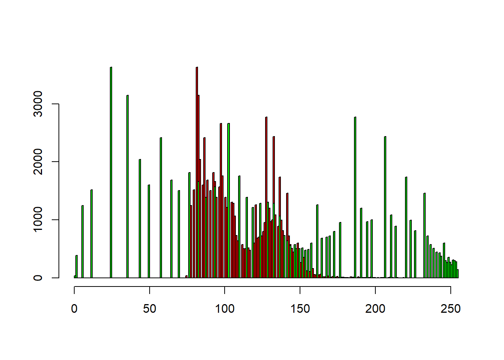


## 直方图比较


直方图比较指的是计算两个直方图的匹配程度，OpenCV在**compareHist**函数中封装了直方图比较运算操作，它提供了4种度量直方图匹配程度的方法：

* 相关性度量

    $$
    d(H_1,H_2)=\frac{\sum_I (H_1(I)-\bar {H_1})(H_2(I)-\bar {H_2})}{\sqrt {\sum_I (H_1(I)-\bar {H_1})^2 \sum_I (H_2(I)-\bar {H_2})^2}}
    $$ 

其中： 
    
$$
    \bar {H_k} = \frac{1}{N} \sum_J H_k(J) \quad (k=1,2)
$$ 
表示图像直方图平均数（这里的$N$是直方图划分区间数）。


``` r
#生成随机矩阵img_mat
set.seed(123)
img_mat = matrix(sample(1:5,25,replace = T),nr=5,nc=5)
#生成随机矩阵img1.mat
set.seed(456)
img1_mat = matrix(sample(3:7,25,replace = T),nr=5,nc=5)
#将img_mat和img1_mat转变为图像矩阵
img = Mat(5,5,CV_8UC1)
img$r2cv(img_mat)
img1 = Mat(5,5,CV_8UC1)
img1$r2cv(img1_mat)

#计算img和img1的直方图，结果分别保存在img_hist和img1_hist中

channels = stdVecOfint()
channels$push_back(0)
histSize = stdVecOfint()
histSize$push_back(20)
histRange = stdVecOffloat()
histRange$push_back(0)
histRange$push_back(20)

imgs = stdVecOfMat()
imgs$push_back(img)
img_hist = Mat()
cv_calcHist(imgs,
              channels,#针对第1个通道计算
              Mat(),#遮罩矩阵为空
              img_hist,
              histSize,#直方图划分区间数
              histRange#指定划分区间的最小和最大端点值
              )

imgs = stdVecOfMat()
imgs$push_back(img1)
img1_hist = Mat()
cv_calcHist(imgs,
              channels,#针对第1个通道计算
              Mat(),#遮罩矩阵为空
              img1_hist,
              histSize,#直方图划分区间数
              histRange#指定划分区间的最小和最大端点值
              )

#计算直方图匹配程度（按相关性度量）
cv_compareHist(img_hist,img1_hist,HISTCMP_CORREL)
```

```
## [1] 0.3456073
```

可以用如下代码来验证这个结果：


``` r
#生成随机矩阵img_mat
set.seed(123)
img_mat = matrix(sample(1:5,25,replace = T),nr=5,nc=5)
#生成随机矩阵img1_mat
set.seed(456)
img1_mat = matrix(sample(3:7,25,replace = T),nr=5,nc=5)

#计算img_mat的直方图（直方图划分区间数为20），结果保存在img_hist中
img_hist = rep(0,20)
names(img_hist)=0:19
img_hist[names(table(img_mat))] = table(img_mat)

#计算img1_mat的直方图（直方图划分区间数为20），结果保存在img1_hist中
img1_hist = rep(0,20)
names(img1_hist)=0:19
img1_hist[names(table(img1_mat))] = table(img1_mat)

#直接用R语言的相关性函数cor计算
cor(img_hist,img1_hist)
```

```
## [1] 0.3456073
```

``` r
#按照相关性度量公式计算
sum((img_hist - mean(img_hist)) * (img1_hist - mean(img1_hist))) / 
  sqrt(sum((img_hist-mean(img_hist))^2)*sum((img1_hist-mean(img1_hist))^2))
```

```
## [1] 0.3456073
```

* 卡方度量

$$
    d(H_1,H_2) = \sum_{I} \frac{(H_1(I)-H_2(I))^2}{H_1(I)}
$$

``` r
#生成随机矩阵img_mat
set.seed(123)
img_mat = matrix(sample(1:5,25,replace = T),nr=5,nc=5)
#生成随机矩阵img1.mat
set.seed(456)
img1_mat = matrix(sample(3:7,25,replace = T),nr=5,nc=5)
#将img_mat和img1_mat转变为图像矩阵
img = Mat(5,5,CV_8UC1)
img$r2cv(img_mat)
img1 = Mat(5,5,CV_8UC1)
img1$r2cv(img1_mat)

#计算img和img1的直方图，结果分别保存在img_hist和img1_hist中
channels = stdVecOfint()
channels$push_back(0)
histSize = stdVecOfint()
histSize$push_back(20)
histRange = stdVecOffloat()
histRange$push_back(0)
histRange$push_back(20)

imgs = stdVecOfMat()
imgs$push_back(img)
img_hist = Mat()
cv_calcHist(imgs,
              channels,#针对第1个通道计算
              Mat(),#遮罩矩阵为空
              img_hist,
              histSize,#直方图划分区间数
              histRange#指定划分区间的最小和最大端点值
              )


imgs = stdVecOfMat()
imgs$push_back(img1)
img1_hist = Mat()
cv_calcHist(imgs,
              channels,#针对第1个通道计算
              Mat(),#遮罩矩阵为空
              img1_hist,
              histSize,#直方图划分区间数
              histRange#指定划分区间的最小和最大端点值
              )

#计算直方图匹配程度（按卡方度量）
cv_compareHist(img_hist,img1_hist,HISTCMP_CHISQR)
```

```
## [1] 13.79167
```

可以用如下代码来验证这个结果：


``` r
#生成随机矩阵img_mat
set.seed(123)
img_mat = matrix(sample(1:5,25,replace = T),nr=5,nc=5)
#生成随机矩阵img1_mat
set.seed(456)
img1_mat = matrix(sample(3:7,25,replace = T),nr=5,nc=5)

#计算img_mat的直方图（直方图划分区间数为20），结果保存在img_hist中
img_hist = rep(0,20)
names(img_hist)=0:19
img_hist[names(table(img_mat))] = table(img_mat)

#计算img1_mat的直方图（直方图划分区间数为20），结果保存在img1_hist中
img1_hist = rep(0,20)
names(img1_hist)=0:19
img1_hist[names(table(img1_mat))] = table(img1_mat)

#按照卡方度量公式计算
ind = which(img_hist!=0)
sum((img_hist[ind] - img1_hist[ind])^2 / img_hist[ind] )
```

```
## [1] 13.79167
```

* 相交（交集）度量

$$
    d(H_1,H_2) = \sum_I min(H_1(I),H_2(I))
$$


``` r
#生成随机矩阵img_mat
set.seed(123)
img_mat = matrix(sample(1:5,25,replace = T),nr=5,nc=5)
#生成随机矩阵img1_mat
set.seed(456)
img1_mat = matrix(sample(3:7,25,replace = T),nr=5,nc=5)
#将img_mat和img1_mat转变为图像矩阵
img = Mat(5,5,CV_8UC1)
img$r2cv(img_mat)
img1 = Mat(5,5,CV_8UC1)
img1$r2cv(img1_mat)

#计算img和img1的直方图，结果分别保存在img_hist和img1_hist中
channels = stdVecOfint()
channels$push_back(0)
histSize = stdVecOfint()
histSize$push_back(20)
histRange = stdVecOffloat()
histRange$push_back(0)
histRange$push_back(20)

imgs = stdVecOfMat()
imgs$push_back(img)
img_hist = Mat()
cv_calcHist(imgs,
              channels,#针对第1个通道计算
              Mat(),#遮罩矩阵为空
              img_hist,
              histSize,#直方图划分区间数
              histRange#指定划分区间的最小和最大端点值
              )

imgs = stdVecOfMat()
imgs$push_back(img1)
img1_hist = Mat()
cv_calcHist(imgs,
              channels,#针对第1个通道计算
              Mat(),#遮罩矩阵为空
              img1_hist,
              histSize,#直方图划分区间数
              histRange#指定划分区间的最小和最大端点值
              )

#计算直方图匹配程度（按相交（交集）度量）
cv_compareHist(img_hist,img1_hist,HISTCMP_INTERSECT)
```

```
## [1] 11
```

可以用如下代码来验证这个结果：


``` r
#生成随机矩阵img_mat
set.seed(123)
img_mat = matrix(sample(1:5,25,replace = T),nr=5,nc=5)
#生成随机矩阵img1.mat
set.seed(456)
img1_mat = matrix(sample(3:7,25,replace = T),nr=5,nc=5)

#计算img_mat的直方图（直方图划分区间数为20），结果保存在img_hist中
img_hist = rep(0,20)
names(img_hist)=0:19
img_hist[names(table(img_mat))] = table(img_mat)

#计算img1.mat的直方图（直方图划分区间数为20），结果保存在img1_hist中
img1_hist = rep(0,20)
names(img1_hist)=0:19
img1_hist[names(table(img1_mat))] = table(img1_mat)

#按照相交（交集）度量公式计算
sum(sapply(1:length(img_hist),
           function(i) min(img_hist[i],img1_hist[i])))
```

```
## [1] 11
```

* Bhattacharyya距离度量

$$
    d(H_1,H_2) = \sqrt {1-\frac{1}{\sqrt{\bar H_1 \bar H_2 N^2} } \sum_I \sqrt {H_1(I) \cdot H_2(I)}}
$$


``` r
#生成随机矩阵img_mat
set.seed(123)
img_mat = matrix(sample(1:5,25,replace = T),nr=5,nc=5)
#生成随机矩阵img1_mat
set.seed(456)
img1_mat = matrix(sample(3:7,25,replace = T),nr=5,nc=5)
#将img_mat和img1_mat转变为图像矩阵
img = Mat(5,5,CV_8UC1)
img$r2cv(img_mat)
img1 = Mat(5,5,CV_8UC1)
img1$r2cv(img1_mat)

#计算img和img1的直方图，结果分别保存在img_hist和img1_hist中
channels = stdVecOfint()
channels$push_back(0)
histSize = stdVecOfint()
histSize$push_back(20)
histRange = stdVecOffloat()
histRange$push_back(0)
histRange$push_back(20)

imgs = stdVecOfMat()
imgs$push_back(img)
img_hist = Mat()
cv_calcHist(imgs,
              channels,#针对第1个通道计算
              Mat(),#遮罩矩阵为空
              img_hist,
              histSize,#直方图划分区间数
              histRange#指定划分区间的最小和最大端点值
              )


imgs = stdVecOfMat()
imgs$push_back(img1)
img1_hist = Mat()
cv_calcHist(imgs,
              channels,#针对第1个通道计算
              Mat(),#遮罩矩阵为空
              img1_hist,
              histSize,#直方图划分区间数
              histRange#指定划分区间的最小和最大端点值
              )

#计算直方图匹配程度（按Bhattacharyya距离度量）
cv_compareHist(img_hist,img1_hist,HISTCMP_BHATTACHARYYA)
```

```
## [1] 0.6734496
```

``` r
# or
cv_compareHist(img_hist,img1_hist,HISTCMP_HELLINGER)
```

```
## [1] 0.6734496
```

可以用如下代码来验证这个结果：


``` r
#生成随机矩阵img_mat
set.seed(123)
img_mat = matrix(sample(1:5,25,replace = T),nr=5,nc=5)
#生成随机矩阵img1_mat
set.seed(456)
img1_mat = matrix(sample(3:7,25,replace = T),nr=5,nc=5)

#计算img_mat的直方图（直方图划分区间数为20），结果保存在img_hist中
img_hist = rep(0,20)
names(img_hist)=0:19
img_hist[names(table(img_mat))] = table(img_mat)

#计算img1_mat的直方图（直方图划分区间数为20），结果保存在img1_hist中
img1_hist = rep(0,20)
names(img1_hist)=0:19
img1_hist[names(table(img1_mat))] = table(img1_mat)

#按照Bhattacharyya距离度量公式计算
N = length(img_hist)
sqrt(1- sum(sqrt(img_hist*img1_hist)) / 
       sqrt(mean(img_hist)*mean(img1_hist)*N^2))
```

```
## [1] 0.6734496
```

* 可选卡方度量

$$
    d(H_1,H_2) = 2 \times \sum_{I} \frac{(H_1(I)-H_2(I))^2}{H_1(I)+H_2(I)}
$$


``` r
#生成随机矩阵img_mat
set.seed(123)
img_mat = matrix(sample(1:5,25,replace = T),nr=5,nc=5)
#生成随机矩阵img1_mat
set.seed(456)
img1_mat = matrix(sample(3:7,25,replace = T),nr=5,nc=5)
#将img_mat和img1_mat转变为图像矩阵
img = Mat(5,5,CV_8UC1)
img$r2cv(img_mat)
img1 = Mat(5,5,CV_8UC1)
img1$r2cv(img1_mat)

#计算img和img1的直方图，结果分别保存在img_hist和img1_hist中
channels = stdVecOfint()
channels$push_back(0)
histSize = stdVecOfint()
histSize$push_back(20)
histRange = stdVecOffloat()
histRange$push_back(0)
histRange$push_back(20)

imgs = stdVecOfMat()
imgs$push_back(img)
img_hist = Mat()
cv_calcHist(imgs,
              channels,#针对第1个通道计算
              Mat(),#遮罩矩阵为空
              img_hist,
              histSize,#直方图划分区间数
              histRange#指定划分区间的最小和最大端点值
              )

imgs = stdVecOfMat()
imgs$push_back(img1)
img1_hist = Mat()
cv_calcHist(imgs,
              channels,#针对第1个通道计算
              Mat(),#遮罩矩阵为空
              img1_hist,
              histSize,#直方图划分区间数
              histRange#指定划分区间的最小和最大端点值
              )


#计算直方图匹配程度（按可选卡方度量）
cv_compareHist(img_hist,img1_hist,HISTCMP_CHISQR_ALT)
```

```
## [1] 46.67033
```

可以用如下代码来验证这个结果：


``` r
#生成随机矩阵img_mat
set.seed(123)
img_mat = matrix(sample(1:5,25,replace = T),nr=5,nc=5)
#生成随机矩阵img1_mat
set.seed(456)
img1_mat = matrix(sample(3:7,25,replace = T),nr=5,nc=5)

#计算img_mat的直方图（直方图划分区间数为20），结果保存在img_hist中
img_hist = rep(0,20)
names(img_hist)=0:19
img_hist[names(table(img_mat))] = table(img_mat)

#计算img1_mat的直方图（直方图划分区间数为20），结果保存在img1_hist中
img1_hist = rep(0,20)
names(img1_hist)=0:19
img1_hist[names(table(img1_mat))] = table(img1_mat)

#按照可选卡方度量公式计算
ind = which(img_hist+img1_hist!=0)
2*sum((img_hist[ind] - img1_hist[ind])^2 / 
        (img_hist[ind]+img1_hist[ind]) )
```

```
## [1] 46.67033
```

* K-L散度度量

$$
    d(H_1,H_2) =  \sum_{I} H_1(I) log \left( \frac{H_1(I)}{H_2(I)} \right)
$$


``` r
#生成随机矩阵img_mat
set.seed(123)
img_mat = matrix(sample(1:5,25,replace = T),nr=5,nc=5)
#生成随机矩阵img1_mat
set.seed(456)
img1_mat = matrix(sample(3:7,25,replace = T),nr=5,nc=5)
#将img_mat和img1_mat转变为图像矩阵
img = Mat(5,5,CV_8UC1)
img$r2cv(img_mat)
img1 = Mat(5,5,CV_8UC1)
img1$r2cv(img1_mat)

#计算img和img1的直方图，结果分别保存在img_hist和img1_hist中
channels = stdVecOfint()
channels$push_back(0)
histSize = stdVecOfint()
histSize$push_back(20)
histRange = stdVecOffloat()
histRange$push_back(0)
histRange$push_back(20)

imgs = stdVecOfMat()
imgs$push_back(img)
img_hist = Mat()
cv_calcHist(imgs,
              channels,#针对第1个通道计算
              Mat(),#遮罩矩阵为空
              img_hist,
              histSize,#直方图划分区间数
              histRange#指定划分区间的最小和最大端点值
              )

imgs = stdVecOfMat()
imgs$push_back(img1)
img1_hist = Mat()
cv_calcHist(imgs,
              channels,#针对第1个通道计算
              Mat(),#遮罩矩阵为空
              img1_hist,
              histSize,#直方图划分区间数
              histRange#指定划分区间的最小和最大端点值
              )

#计算直方图匹配程度（按K-L散度度量）
cv_compareHist(img_hist,img1_hist,HISTCMP_KL_DIV)
```

```
## [1] 273.4466
```

可以用如下代码来验证这个结果：


``` r
#生成随机矩阵img_mat
set.seed(123)
img_mat = matrix(sample(1:5,25,replace = T),nr=5,nc=5)
#生成随机矩阵img1_mat
set.seed(456)
img1_mat = matrix(sample(3:7,25,replace = T),nr=5,nc=5)

#计算img_mat的直方图（直方图划分区间数为20），结果保存在img_hist中
img_hist = rep(0,20)
names(img_hist)=0:19
img_hist[names(table(img_mat))] = table(img_mat)

#计算img1_mat的直方图（直方图划分区间数为20），结果保存在img1_hist中
img1_hist = rep(0,20)
names(img1_hist)=0:19
img1_hist[names(table(img1_mat))] = table(img1_mat)

#按照K-L散度度量公式计算
ind = which(img_hist!=0)
img1_hist[img1_hist==0] = 1e-10
sum(img_hist[ind]*log(img_hist[ind]/img1_hist[ind]) )
```

```
## [1] 273.4466
```


**示例**

有如下四个图像：

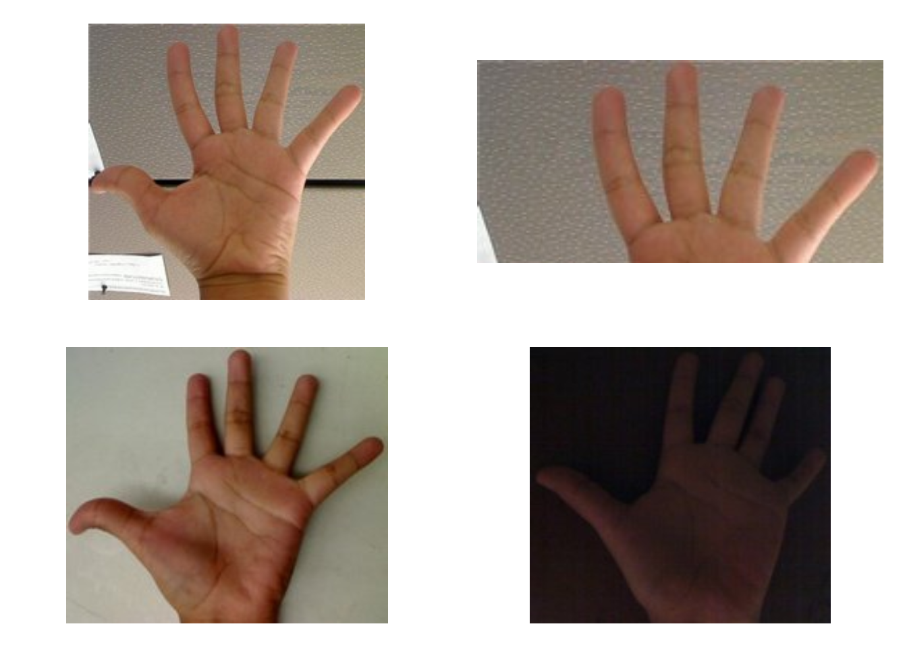

设左上角图像编号为pic1，右上角图像编号为pic2（就是pic1的下半部分图像），左下角图像编号为pic3，右下角图像编号为pic4。以下代码演示了pic1在不同度量方式下分别与自己、与pic2、pic3和pic4的直方图匹配程度的计算结果。


``` r
#读取图像文件
pic1 = cv_imread("images/palm_0.jpg")
pic3 = cv_imread("images/palm_1.jpg")
pic4 = cv_imread("images/palm_2.jpg")

#依据pic1生成pic2
pic1_info = rcv_matInfo(pic1)
pic2 = Mat(
  pic1,
  Range(pic1_info$height / 2, pic1_info$height),
  Range(0, pic1_info$width)
)

#将pic1、pic2、pic3和pic4转变为HSV三通道图像
hsv_pic1 = Mat()
cv_cvtColor(pic1, hsv_pic1, COLOR_BGR2HSV)
hsv_pic2 = Mat()
cv_cvtColor(pic2, hsv_pic2, COLOR_BGR2HSV)
hsv_pic3 = Mat()
cv_cvtColor(pic3, hsv_pic3, COLOR_BGR2HSV)
hsv_pic4 = Mat()
cv_cvtColor(pic4, hsv_pic4, COLOR_BGR2HSV)

channels = stdVecOfint()
channels$push_back(0)
channels$push_back(1)
histSize = stdVecOfint()
histSize$push_back(50)
histSize$push_back(60)
histRange = stdVecOffloat()
histRange$push_back(0)
histRange$push_back(180)
histRange$push_back(0)
histRange$push_back(256)

#计算pic1的直方图，结果保存在hist_pic1中
imgs = stdVecOfMat()
imgs$push_back(pic1)
hist_pic1 = Mat()
cv_calcHist(
  imgs,
  channels,#依据H通道和S通道进行计算
  Mat(),#遮罩矩阵为空
  hist_pic1,
  histSize,#H通道和S通道的直方图划分区间数分别为50和60
  histRange#指定H通道和S通道的各自的划分区间的最小和最大端点值
)
#将hist_pic1归一化到[0,1]区间
cv_normalize(hist_pic1, hist_pic1, 0, 1, NORM_MINMAX, -1)

#计算pic2的直方图，结果保存在hist_pic2中
imgs = stdVecOfMat()
imgs$push_back(pic2)
hist_pic2 = Mat()
cv_calcHist(
  imgs,
  channels,#依据H通道和S通道进行计算
  Mat(),#遮罩矩阵为空
  hist_pic2,
  histSize,#H通道和S通道的直方图划分区间数分别为50和60
  histRange#指定H通道和S通道的各自的划分区间的最小和最大端点值
)
#将hist_pic2归一化到[0,1]区间
cv_normalize(hist_pic2, hist_pic2, 0, 1, NORM_MINMAX, -1)

#计算pic3的直方图，结果保存在hist_pic3中
imgs = stdVecOfMat()
imgs$push_back(pic3)
hist_pic3 = Mat()
cv_calcHist(
  imgs,
  channels,#依据H通道和S通道进行计算
  Mat(),#遮罩矩阵为空
  hist_pic3,
  histSize,#H通道和S通道的直方图划分区间数分别为50和60
  histRange#指定H通道和S通道的各自的划分区间的最小和最大端点值
)
#将hist_pic3归一化到[0,1]区间
cv_normalize(hist_pic3, hist_pic3, 0, 1, NORM_MINMAX, -1)

#计算pic4的直方图，结果保存在hist_pic4中
imgs = stdVecOfMat()
imgs$push_back(pic4)
hist_pic4 = Mat()
cv_calcHist(
  imgs,
  channels,#依据H通道和S通道进行计算
  Mat(),#遮罩矩阵为空
  hist_pic4,
  histSize,#H通道和S通道的直方图划分区间数分别为50和60
  histRange#指定H通道和S通道的各自的划分区间的最小和最大端点值
)
#将hist_pic4归一化到[0,1]区间
cv_normalize(hist_pic4, hist_pic4, 0, 1, NORM_MINMAX, -1)

#依次在相关性度量、卡方度量、相交度量、Bhattacharyya距离度量或者Hellinger距离度量、
#可选卡方度量和KL散度度量方式计算pic1与自己、与pic2、pic3和pic4的直方图匹配程度
HistCompMethods = list(
  expr(HISTCMP_BHATTACHARYYA),
  expr(HISTCMP_CHISQR),
  expr(HISTCMP_CHISQR_ALT),
  expr(HISTCMP_CORREL),
  expr(HISTCMP_HELLINGER),
  expr(HISTCMP_INTERSECT),
  expr(HISTCMP_KL_DIV)
)
for (compare_method in HistCompMethods)
{
  pic1_pic1 = cv_compareHist(hist_pic1, hist_pic1, compare_method)
  pic1_pic2 = cv_compareHist(hist_pic1, hist_pic2, compare_method)
  pic1_pic3 = cv_compareHist(hist_pic1, hist_pic3, compare_method)
  pic1_pic4 = cv_compareHist(hist_pic1, hist_pic4, compare_method)
  cat(
    "Method " ,
    compare_method,
    " pic1:pic1, pic1:pic2, pic1:pic3, pic1:pic4: "
    ,
    round(pic1_pic1,2) ,
    " / " ,
    round(pic1_pic2,2) ,
    " / " ,
    round(pic1_pic3,2) ,
    " / " ,
    round(pic1_pic4,2) ,
    "\n"
  )
}
```

```
## Method  HISTCMP_BHATTACHARYYA  pic1:pic1, pic1:pic2, pic1:pic3, pic1:pic4:  0  /  0.32  /  0.56  /  0.98 
## Method  HISTCMP_CHISQR  pic1:pic1, pic1:pic2, pic1:pic3, pic1:pic4:  0  /  17.12  /  95.3  /  1551.52 
## Method  HISTCMP_CHISQR_ALT  pic1:pic1, pic1:pic2, pic1:pic3, pic1:pic4:  0  /  28.33  /  66.71  /  112.16 
## Method  HISTCMP_CORREL  pic1:pic1, pic1:pic2, pic1:pic3, pic1:pic4:  1  /  0.74  /  0.34  /  -0.01 
## Method  HISTCMP_HELLINGER  pic1:pic1, pic1:pic2, pic1:pic3, pic1:pic4:  0  /  0.32  /  0.56  /  0.98 
## Method  HISTCMP_INTERSECT  pic1:pic1, pic1:pic2, pic1:pic3, pic1:pic4:  47.56  /  28.45  /  12.96  /  0.15 
## Method  HISTCMP_KL_DIV  pic1:pic1, pic1:pic2, pic1:pic3, pic1:pic4:  0  /  45.01  /  184.6  /  1024.29
```

## 反向投影

反向投影指的是图像依据一个指定的直方图，判定每个像素位于直方图的哪个划分区间，并将相应区间的直方图数据作为该像素新的取值的整个计算过程。

### 单通道图像基于单通道直方图的反向投影


``` r
#生成矩阵img_mat
img_mat = matrix(c(0:11, 8, 9, 14, 15),
                 nr = 4,
                 nc = 4,
                 byrow = T)
#将img_mat转变为图像矩阵img
img = Mat(4,4,CV_8UC1)
img$r2cv(img_mat)

channels = stdVecOfint()
channels$push_back(0)
histSize = stdVecOfint()
histSize$push_back(4)
histRange = stdVecOffloat()
histRange$push_back(0)
histRange$push_back(16)

#计算img的直方图，结果保存在hhist中
imgs = stdVecOfMat()
imgs$push_back(img)
hhist = Mat()
cv_calcHist(imgs,
              channels,#针对第1个通道计算直方图
              Mat(),#遮罩矩阵为空
              hhist,
              histSize,#直方图划分区间数为4
              histRange#指定划分区间的最小和最大端点值
              )

#对img依据其自身的直方图hhist进行反向投影，结果保存在backProj中
backProj = Mat()
cv_calcBackProject(imgs, 
                     channels, #对第1个通道进行反向投影
                     hhist, #指定反向投影参照的直方图
                     backProj, 
                     histRange,#指定划分区间的最小和最大端点值
                     1)

#查看结果
backProj$cv2r()
```

```
##      [,1] [,2] [,3] [,4]
## [1,]    4    4    4    4
## [2,]    4    4    4    4
## [3,]    6    6    6    6
## [4,]    6    6    2    2
## attr(,"depth")
## [1] 0
```

可以通过如下代码来验证这个结果：


``` r
#生成矩阵img_mat
img_mat = matrix(c(0:11,8,9,14,15),nr=4,nc=4,byrow=T)
#将img_mat中各元素取值划分为4个区间：[0,4),[4,8),[8,12),[12,16)，
#结果保存在tcut中。
#特别留意tcut中的值表明的是img.mat的各个元素所在的划分区间：
#1-4个数对应于img.mat的第1列，5-8个数对应于第2列，9-12个数对应于第3列，
#13-16个数对应于第4列。
tcut = cut(img_mat,breaks=c(0,4,8,12,16),right=FALSE)
#计算各区间的元素个数，即计算直方图：
#第1、第2个区间都有4个数，第3个区间有6个数，第4个区间有2个数
ht = table(tcut)

#依据img.mat的各个元素取值所对应的直方图划分区间，取出各自对应的
#直方图数据，结果保存在backProj中
backProj = ht[tcut]
#将backProj转变为矩阵模式，获得反向投影结果
dim(backProj) = c(4,4)

#查看结果
backProj
```

```
##      [,1] [,2] [,3] [,4]
## [1,]    4    4    4    4
## [2,]    4    4    4    4
## [3,]    6    6    6    6
## [4,]    6    6    2    2
```

### 三通道图像基于双通道直方图的反向投影


``` r
#按指定频率重复生成0,1,2,...,7这8个数：
#0-7这8个数重复的次数分别为19,25,21,16,8,6,3和2，结果保存在x中
x = rep(0:7,c(19,25,21,16,8,6,3,2))
#对x随机排序后,转变为10行10列矩阵m1
set.seed(123)
m1 = matrix(sample(x),nr=10,nc=10)
#再对x随机排序后,转变为10行10列矩阵m2
set.seed(124)
m2 = matrix(sample(x),nr=10,nc=10)
#继续对x随机排序后,转变为10行10列矩阵m3
set.seed(125)
m3 = matrix(sample(x),nr=10,nc=10)

#形成一个3维全0数组
arr = array(0,dim=c(10,10,3))
#将arr包含的3个10行10列矩阵分别改为m1,m2和m3
arr[,,1] = m1
arr[,,2] = m2
arr[,,3] = m3

#将m转变为图像矩阵
img = Mat(3,3,CV_8UC3)
img$r2cv(arr)

#计算img的双通道直方图，结果保存在hhist中
channels = stdVecOfint()
channels$push_back(0)
channels$push_back(1)
histSize = stdVecOfint()
histSize$push_back(8)
histSize$push_back(4)
histRange = stdVecOffloat()
histRange$push_back(0)
histRange$push_back(8)
histRange$push_back(0)
histRange$push_back(8)

imgs = stdVecOfMat()
imgs$push_back(img)
hhist = Mat()
cv_calcHist(imgs,
              channels,#针对第1个和第2个通道计算直方图 
              Mat(), #遮罩矩阵参数设置为空矩阵
              hhist,
              histSize,
              histRange)

#对img依据其自身的直方图hhist进行反向投影，结果保存在backProj中
backProj = Mat()
cv_calcBackProject(imgs, 
                     channels, #对第1个和第2个通道进行反向投影
                     hhist, #指定反向投影参照的直方图
                     backProj, 
                     histRange,#指定两个通道各自的划分区间的最小和最大端点值
                     1)

#查看结果
backProj$cv2r()
```

```
##       [,1] [,2] [,3] [,4] [,5] [,6] [,7] [,8] [,9] [,10]
##  [1,]    7    3    6    7    9    5    3    9    7     7
##  [2,]    6    5    1   12    9    2    1    7   12     9
##  [3,]    7   12    1    4    6    4    7   15    7    12
##  [4,]    9    9    2    2    9    1    9    6    7    15
##  [5,]    4    5   15    5   15    2   12    2    4     6
##  [6,]   15   15    2   15    6   15    6    3    4     7
##  [7,]   12    6    4    1   12    6   12    2    4     6
##  [8,]    7    1   15   15   12    1   12    9    1    15
##  [9,]    2    4   15    7    2    5    2    2    7    12
## [10,]   15   15    7    6    6   15    2   12    2     2
## attr(,"depth")
## [1] 0
```

可以通过如下代码来验证这个结果：


``` r
#按指定频率重复生成0,1,2,...,7这8个数：
#0-7这8个数重复的次数分别为19,25,21,16,8,6,3和2，结果保存在x中
x = rep(0:7,c(19,25,21,16,8,6,3,2))
#对x随机排序后,转变为10行10列矩阵m1
set.seed(123)
m1 = matrix(sample(x),nr=10,nc=10)
#再对x随机排序后,转变为10行10列矩阵m2
set.seed(124)
m2 = matrix(sample(x),nr=10,nc=10)
#继续对x随机排序后,转变为10行10列矩阵m3
set.seed(125)
m3 = matrix(sample(x),nr=10,nc=10)

#形成一个3维全0数组
arr = array(0,dim=c(10,10,3))
#将arr包含的3个10行10列矩阵分别改为m1,m2和m3
arr[,,1] = m1
arr[,,2] = m2
arr[,,3] = m3

#将arr[,,1]中各元素取值划分为8个区间，结果保存在tcut1中。
#特别留意tcut1中的值表明的是arr[,,1]的各个元素所在的划分区间：
#1-10个数对应于img_mat的第1列，11-20个数对应于第2列，依次类推。
tcut1 = cut(arr[,,1],breaks=0:8,right=FALSE)

#将arr[,,2]中各元素取值划分为4个区间，结果保存在tcut1中。
#特别留意tcut2中的值表明的是arr[,,2]的各个元素所在的划分区间：
#1-10个数对应于img_mat的第1列，11-20个数对应于第2列，依次类推。
tcut2 = cut(arr[,,2],breaks=seq(0,8,by=2),right=FALSE)

#统计频数（以arr[,,1]的划分区间为行，以arr[,,2]的划分区间为列），
#即计算直方图
ht = table(tcut1,tcut2)

#依据arr[,,1]和arr[,,2]的各个元素取值所对应的直方图划分区间，
#取出各自对应的直方图数据，结果保存在backProj中
backProj = ht[cbind(tcut1,tcut2)]
#将backProj转变为矩阵模式，获得反向投影结果
dim(backProj) = c(10,10)

#查看结果
backProj
```

```
##       [,1] [,2] [,3] [,4] [,5] [,6] [,7] [,8] [,9] [,10]
##  [1,]    7    3    6    7    9    5    3    9    7     7
##  [2,]    6    5    1   12    9    2    1    7   12     9
##  [3,]    7   12    1    4    6    4    7   15    7    12
##  [4,]    9    9    2    2    9    1    9    6    7    15
##  [5,]    4    5   15    5   15    2   12    2    4     6
##  [6,]   15   15    2   15    6   15    6    3    4     7
##  [7,]   12    6    4    1   12    6   12    2    4     6
##  [8,]    7    1   15   15   12    1   12    9    1    15
##  [9,]    2    4   15    7    2    5    2    2    7    12
## [10,]   15   15    7    6    6   15    2   12    2     2
```


**示例**

对于如下手部图像（记为pic1）：


可以应用如下遮罩，计算相应手部区域的色调-饱和度直方图，作为皮肤特征直方图。

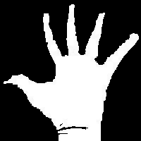


现在另一个手部图像（记为pic2）如下：

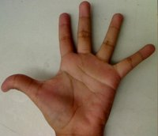


以下代码演示了如何利用pic1生成的皮肤特征直方图对pic2进行反向投影，进而寻找到pic2的皮肤区域。


``` r
#读取图像文件
pic1 = cv_imread("images/palm_0.jpg")
#读取遮罩图像文件
mask = cv_imread("images/palm_0_mask.png",0)

#将pic1转变为HSV三通道图像矩阵
pic1_hsv = Mat()
cv_cvtColor(pic1,pic1_hsv,COLOR_BGR2HSV)

#在遮罩矩阵作用下计算pic1_hsv的色调-饱和度直方图(皮肤特征直方图)，
#结果保存在hhist中
channels = stdVecOfint()
channels$push_back(0)
channels$push_back(1)
histSize = stdVecOfint()
histSize$push_back(180)
histSize$push_back(256)
histRange = stdVecOffloat()
histRange$push_back(0)
histRange$push_back(180)
histRange$push_back(0)
histRange$push_back(256)

imgs = stdVecOfMat()
imgs$push_back(pic1_hsv)
hhist = Mat()
cv_calcHist(
  imgs,
  channels,#针对H通道和S通道计算直方图 
  mask, #遮罩矩阵
  hhist,
  histSize, #H通道和S通道划分区间数分别为180和256
  histRange #H通道和S通道各自的划分区间的最小和最大端点值
)

#读取图像文件
pic2 = cv_imread("images/palm_1.jpg")
#将pic2转变为HSV三通道图像矩阵
pic2_hsv = Mat()
cv_cvtColor(pic2,pic2_hsv,COLOR_BGR2HSV)

#对pic2.hsv依据hhist进行反向投影，结果保存在backProj中
imgs = stdVecOfMat()
imgs$push_back(pic2_hsv)
backProj = Mat()
cv_calcBackProject(
  imgs, 
  channels, #对第1个和第2个通道进行反向投影
  hhist, #指定反向投影参照的直方图
  backProj, 
  histRange,#指定两个通道各自的划分区间的最小和最大端点值
  5 #放大系数设置为5倍
)

#对backProj进行归一化（最大最小值方式），以便可视化展示
cv_normalize(backProj, backProj, 0, 255, NORM_MINMAX,-1)
```


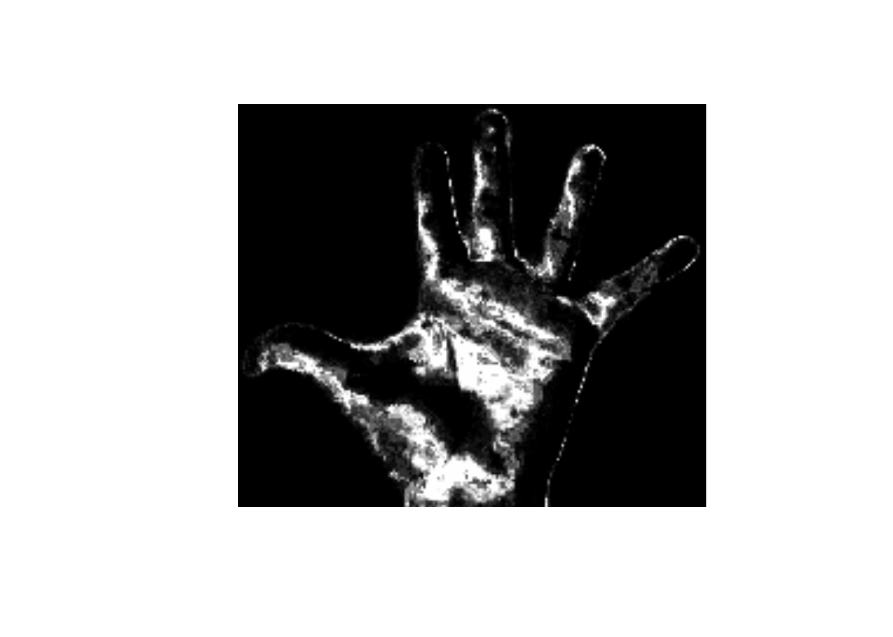


## 模板匹配

模板匹配指的是计算图像与指定模板（图像）匹配程度的过程，可以用于在图像中搜索指定内容。主要操作步骤是：

* 确定模板（图像），如果模板中仅有部分区域为待搜索的内容时，可以使用遮罩；  
* 在待匹配的图像上移动模板，模板左上角顶点元素对准的图像像素称为模板匹配的目标像素，计算模板与模板覆盖住的图像区域的匹配程度值，并将该值作为目标图像对应像素的值。目标图像的宽度等于待匹配图像的宽度减去模板（图像）宽度+1，高度等于待匹配图像的高度减去模板（图像）高度+1

OpenCV在**matchTemplate**函数中封装了模板匹配操作，它提供了6种模板匹配程度的计算方法：

* TM_SQDIFF

$$
R(x,y) = \sum_{r,c}(T(r,c)-I(y+r,x+c))^2
$$

其中$T(r,c)$表示模板（图像）中的元素（像素），$I(y+r,x+c)$表示待匹配图像中以$(x,y)$位置为目标像素的模板覆盖区域中的像素。


``` r
#生成矩阵
set.seed(123)
img_mat = matrix(sample(1:5,100,replace = T),nr=10,nc=10)

#直接以img_mat的前3行前3列元素为模板
templ_mat = img_mat[1:3,1:3]

#将img_mat转变为图像矩阵
img = Mat(10,10,CV_8UC1)
img$r2cv(img_mat)
#将templ_mat也转变为图像矩阵
templ = Mat(3,3,CV_8UC1)
templ$r2cv(templ_mat)

#按TM_SQDIFF匹配方法依照templ对img进行模板匹配，结果保存在res中
res = Mat()
cv_matchTemplate(img,templ,res,TM_SQDIFF)

#查看结果
res$cv2r()
```

```
##      [,1] [,2]     [,3] [,4] [,5] [,6] [,7] [,8]
## [1,]    0   20 53.00000   16   55   30   23   18
## [2,]   15   20 47.00000   21   42   24    8   20
## [3,]   26   22 33.00002   24    9   18   27   27
## [4,]   35   25 29.00000   27   25   43   40   40
## [5,]   26   50 26.00000   33   23   38   14   39
## [6,]   48   51 13.00000   35   31   40   15   34
## [7,]   44   28 18.00000   26   25   25   23   20
## [8,]   16   12 25.00000   19   45   20   14   24
## attr(,"depth")
## [1] 5
```

从结果可以看到，第1行第1列的匹配值为0，即图像的前3行前3列像素区域与模板完全匹配，这符合预期。也可以用如下代码来验证这个结果：


``` r
#生成矩阵
set.seed(123)
img_mat = matrix(sample(1:5,100,replace = T),nr=10,nc=10)

#直接以img_mat的前3行前3列元素为模板
templ_mat = img_mat[1:3,1:3]

#按公式计算匹配程度值，结果保存在res.mat中
res_mat = matrix(0,dim(img_mat)[1]-dim(templ_mat)[1]+1,
                 dim(img_mat)[2]-dim(templ_mat)[2]+1)
for(i in 1:nrow(res_mat)){
  for(j in 1:ncol(res_mat)){
    res_mat[i,j] = (templ_mat - img_mat[i:(i+2),j:(j+2)])^2 %>% sum
  }
}

#查看结果
res_mat
```

```
##      [,1] [,2] [,3] [,4] [,5] [,6] [,7] [,8]
## [1,]    0   20   53   16   55   30   23   18
## [2,]   15   20   47   21   42   24    8   20
## [3,]   26   22   33   24    9   18   27   27
## [4,]   35   25   29   27   25   43   40   40
## [5,]   26   50   26   33   23   38   14   39
## [6,]   48   51   13   35   31   40   15   34
## [7,]   44   28   18   26   25   25   23   20
## [8,]   16   12   25   19   45   20   14   24
```

TM_SQDIFF方法形成的最小值点位置是模板匹配的最佳位置。

* TM_SQDIFF_NORMED

$$
R(x,y) = \frac{\sum_{r,c}(T(r,c)-I(y+r,x+c))^2}{\sqrt {\sum_{r,c}T(r,c)^2 \cdot \sum_{r,c}I(y+r,x+c)^2}}
$$ 


``` r
#生成矩阵
set.seed(123)
img_mat = matrix(sample(1:5,100,replace = T),nr=10,nc=10)

#直接以img_mat的前3行前3列元素为模板
templ_mat = img_mat[1:3,1:3]

#将img_mat转变为图像矩阵
img = Mat(10,10,CV_8UC1)
img$r2cv(img_mat)
#将templ_mat也转变为图像矩阵
templ = Mat(3,3,CV_8UC1)
templ$r2cv(templ_mat)

#按TM_SQDIFF_NORMED匹配方法依照templ对img进行模板匹配，结果保存在res中
res = Mat()
cv_matchTemplate(img,templ,res,TM_SQDIFF_NORMED)

#查看结果
round(res$cv2r(),2)
```

```
##      [,1] [,2] [,3] [,4] [,5] [,6] [,7] [,8]
## [1,] 0.00 0.28 0.64 0.19 0.51 0.30 0.23 0.20
## [2,] 0.21 0.29 0.51 0.22 0.40 0.26 0.09 0.25
## [3,] 0.35 0.28 0.37 0.25 0.10 0.20 0.30 0.29
## [4,] 0.43 0.29 0.32 0.30 0.33 0.49 0.44 0.38
## [5,] 0.29 0.52 0.28 0.40 0.42 0.45 0.16 0.37
## [6,] 0.50 0.49 0.13 0.45 0.66 0.61 0.20 0.37
## [7,] 0.49 0.29 0.21 0.39 0.41 0.39 0.33 0.26
## [8,] 0.18 0.14 0.29 0.26 0.56 0.29 0.21 0.30
## attr(,"depth")
## [1] 5
```


可以用如下代码来验证这个结果：


``` r
#生成矩阵
set.seed(123)
img_mat = matrix(sample(1:5,100,replace = T),nr=10,nc=10)

#直接以img_mat的前3行前3列元素为模板
templ_mat = img_mat[1:3,1:3]

#按公式计算匹配程度值，结果保存在res_mat中
res_mat = matrix(0,dim(img_mat)[1]-dim(templ_mat)[1]+1,
                 dim(img_mat)[2]-dim(templ_mat)[2]+1)
for(i in 1:nrow(res_mat)){
  for(j in 1:ncol(res_mat)){
    numer = (templ_mat - img_mat[i:(i+2),j:(j+2)])^2 %>% sum
    denom = sqrt(sum(templ_mat^2) * sum(img_mat[i:(i+2),j:(j+2)]^2))
    res_mat[i,j] = numer/denom
  }
}

#查看结果
round(res_mat,2)
```

```
##      [,1] [,2] [,3] [,4] [,5] [,6] [,7] [,8]
## [1,] 0.00 0.28 0.64 0.19 0.51 0.30 0.23 0.20
## [2,] 0.21 0.29 0.51 0.22 0.40 0.26 0.09 0.25
## [3,] 0.35 0.28 0.37 0.25 0.10 0.20 0.30 0.29
## [4,] 0.43 0.29 0.32 0.30 0.33 0.49 0.44 0.38
## [5,] 0.29 0.52 0.28 0.40 0.42 0.45 0.16 0.37
## [6,] 0.50 0.49 0.13 0.45 0.66 0.61 0.20 0.37
## [7,] 0.49 0.29 0.21 0.39 0.41 0.39 0.33 0.26
## [8,] 0.18 0.14 0.29 0.26 0.56 0.29 0.21 0.30
```

TM_SQDIFF_NORMED方法形成的最小值点位置是模板匹配的最佳位置。

* TM_CCORR

$$
R(x,y) = \sum_{r,c}(T(r,c) \times I(y+r,x+c))
$$ 


``` r
#生成矩阵
set.seed(123)
img_mat = matrix(sample(1:5,100,replace = T),nr=10,nc=10)

#直接以img.mat的前3行前3列元素为模板
templ_mat = img_mat[1:3,1:3]

#将img_mat转变为图像矩阵
img = Mat(10,10,CV_8UC1)
img$r2cv(img_mat)
#将templ_mat也转变为图像矩阵
templ = Mat(3,3,CV_8UC1)
templ$r2cv(templ_mat)

#按TM_CCORR匹配方法依照templ对img进行模板匹配，结果保存在res中
res = Mat()
cv_matchTemplate(img,templ,res,TM_CCORR)

#查看结果
res$cv2r()
```

```
##      [,1] [,2]     [,3] [,4] [,5] [,6] [,7] [,8]
## [1,]   79   61 56.00000   78   85   86   91   83
## [2,]   63   59 69.00000   87   87   82   84   69
## [3,]   61   69 72.99999   85   91   83   76   82
## [4,]   63   74 78.00000   79   64   67   72   90
## [5,]   78   74 80.00000   66   47   66   84   92
## [6,]   75   82 93.00000   60   38   47   66   76
## [7,]   68   83 76.00000   54   50   53   59   68
## [8,]   80   82 74.00000   65   58   59   61   67
## attr(,"depth")
## [1] 5
```

可以用如下代码来验证这个结果：


``` r
#生成矩阵
set.seed(123)
img_mat = matrix(sample(1:5,100,replace = T),nr=10,nc=10)

#直接以img.mat的前3行前3列元素为模板
templ_mat = img_mat[1:3,1:3]

#按公式计算匹配程度值，结果保存在res.mat中
res_mat = matrix(0,dim(img_mat)[1]-dim(templ_mat)[1]+1,
                 dim(img_mat)[2]-dim(templ_mat)[2]+1)
for(i in 1:nrow(res_mat)){
  for(j in 1:ncol(res_mat)){
    res_mat[i,j] = (templ_mat * img_mat[i:(i+2),j:(j+2)]) %>% sum
  }
}

#查看结果
res_mat
```

```
##      [,1] [,2] [,3] [,4] [,5] [,6] [,7] [,8]
## [1,]   79   61   56   78   85   86   91   83
## [2,]   63   59   69   87   87   82   84   69
## [3,]   61   69   73   85   91   83   76   82
## [4,]   63   74   78   79   64   67   72   90
## [5,]   78   74   80   66   47   66   84   92
## [6,]   75   82   93   60   38   47   66   76
## [7,]   68   83   76   54   50   53   59   68
## [8,]   80   82   74   65   58   59   61   67
```

* TM_CCORR_NORMED

$$
R(x,y) = \frac{\sum_{r,c}(T(r,c) \cdot I(y+r,x+c))}{\sqrt {\sum_{r,c}T(r,c)^2 \cdot \sum_{r,c}I(y+r,x+c)^2}}
$$ 


``` r
#生成矩阵
set.seed(123)
img_mat = matrix(sample(1:5,100,replace = T),nr=10,nc=10)

#直接以img_mat的前3行前3列元素为模板
templ_mat = img_mat[1:3,1:3]

#将img_mat转变为图像矩阵
img = Mat(10,10,CV_8UC1)
img$r2cv(img_mat)
#将templ_mat也转变为图像矩阵
templ = Mat(3,3,CV_8UC1)
templ$r2cv(templ_mat)

#按TM_CCORR_NORMED匹配方法依照templ对img进行模板匹配，结果保存在res中
res = Mat()
cv_matchTemplate(img,templ,res,TM_CCORR_NORMED)

#查看结果
round(res$cv2r(),2)
```

```
##      [,1] [,2] [,3] [,4] [,5] [,6] [,7] [,8]
## [1,] 1.00 0.86 0.68 0.91 0.79 0.87 0.91 0.91
## [2,] 0.90 0.86 0.75 0.91 0.84 0.88 0.96 0.87
## [3,] 0.83 0.86 0.82 0.89 0.97 0.91 0.86 0.87
## [4,] 0.78 0.86 0.85 0.86 0.84 0.76 0.79 0.85
## [5,] 0.86 0.76 0.87 0.80 0.86 0.78 0.93 0.86
## [6,] 0.77 0.79 0.96 0.77 0.81 0.71 0.90 0.83
## [7,] 0.76 0.87 0.90 0.82 0.83 0.83 0.84 0.87
## [8,] 0.91 0.94 0.86 0.87 0.72 0.86 0.91 0.85
## attr(,"depth")
## [1] 5
```

可以用如下代码来验证这个结果：


``` r
#生成矩阵
set.seed(123)
img_mat = matrix(sample(1:5,100,replace = T),nr=10,nc=10)

#直接以img_mat的前3行前3列元素为模板
templ_mat = img_mat[1:3,1:3]

#按公式计算匹配程度值，结果保存在res_mat中
res_mat = matrix(0,dim(img_mat)[1]-dim(templ_mat)[1]+1,
                 dim(img_mat)[2]-dim(templ_mat)[2]+1)
for(i in 1:nrow(res_mat)){
  for(j in 1:ncol(res_mat)){
    numer = (templ_mat * img_mat[i:(i+2),j:(j+2)]) %>% sum
    denom = sqrt(sum(templ_mat^2) * sum(img_mat[i:(i+2),j:(j+2)]^2))
    res_mat[i,j] = numer/denom
  }
}

#查看结果
round(res_mat,2)
```

```
##      [,1] [,2] [,3] [,4] [,5] [,6] [,7] [,8]
## [1,] 1.00 0.86 0.68 0.91 0.79 0.87 0.91 0.91
## [2,] 0.90 0.86 0.75 0.91 0.84 0.88 0.96 0.87
## [3,] 0.83 0.86 0.82 0.89 0.97 0.91 0.86 0.87
## [4,] 0.78 0.86 0.85 0.86 0.84 0.76 0.79 0.85
## [5,] 0.86 0.76 0.87 0.80 0.86 0.78 0.93 0.86
## [6,] 0.77 0.79 0.96 0.77 0.81 0.71 0.90 0.83
## [7,] 0.76 0.87 0.90 0.82 0.83 0.83 0.84 0.87
## [8,] 0.91 0.94 0.86 0.87 0.72 0.86 0.91 0.85
```

TM_CCORR_NORMED方法形成的最大值点位置是模板匹配的最佳位置。

* TM_CCOEFF

$$
R(x,y) = \sum_{r,c}(T'(r,c) \cdot I'(y+r,x+c))
$$

其中：

$$
\begin{aligned}
&T'(r,c) = T(r,c)-\frac {1}{w \cdot h} \cdot \sum_{r_1,c_1}T(r_1,c_1) \\
&I'(y+r,x+c)=I(y+r,x+c)-\frac {1}{w \cdot h} \cdot \sum_{r_1,c_1} I(y+r_1,x+c_1)
\end{aligned}
$$
其中，$w$和$h$为模板（图像）的宽度和高度，$\displaystyle \frac {1}{w \cdot h} \cdot \sum_{r_1,c_1}T(r_1,c_1)$表示模板（图像）的元素值（像素值）的平均值。


``` r
#生成矩阵
set.seed(123)
img_mat = matrix(sample(1:5,100,replace = T),nr=10,nc=10)

#直接以img_mat的前3行前3列元素为模板
templ_mat = img_mat[1:3,1:3]

#将img_mat转变为图像矩阵
img = Mat(10,10,CV_8UC1)
img$r2cv(img_mat)
#将templ_mat也转变为图像矩阵
templ = Mat(3,3,CV_8UC1)
templ$r2cv(templ_mat)

#按TM_CCOEFF匹配方法依照templ对img进行模板匹配，结果保存在res中
res = Mat()
cv_matchTemplate(img,templ,res,TM_CCOEFF)

#查看结果
round(res$cv2r(),2)
```

```
##       [,1]  [,2]   [,3]  [,4]  [,5]  [,6]  [,7]  [,8]
## [1,]  9.56  2.67 -10.67  8.56 -9.44 -0.11  2.11  2.44
## [2,]  1.89  0.67  -8.78  3.67 -4.67  1.44  9.00 -0.44
## [3,] -2.89 -0.44  -4.78 -1.11  7.67  2.44 -1.78 -1.33
## [4,] -3.67  1.78   0.22  1.22  2.89 -5.22 -3.00 -1.67
## [5,]  3.00 -6.56   5.00 -0.67  2.56 -3.44  9.00 -2.44
## [6,] -5.56 -6.89   9.67 -1.11 -0.89 -5.78  4.89 -4.56
## [7,] -7.00  2.44   6.56  1.22  0.00 -2.56 -2.11 -1.44
## [8,]  5.00  7.00   1.78  3.89 -8.67  0.67  2.67 -2.44
## attr(,"depth")
## [1] 5
```

可以用如下代码来验证这个结果：


``` r
#生成矩阵
set.seed(123)
img_mat = matrix(sample(1:5,100,replace = T),nr=10,nc=10)

#直接以img_mat的前3行前3列元素为模板
templ_mat = img_mat[1:3,1:3]

#按公式计算匹配程度值，结果保存在res_mat中
res_mat = matrix(0,dim(img_mat)[1]-dim(templ_mat)[1]+1,
                 dim(img_mat)[2]-dim(templ_mat)[2]+1)
for(i in 1:nrow(res_mat)){
  for(j in 1:ncol(res_mat)){
    res_mat[i,j] = sum((templ_mat - mean(templ_mat)) * 
                         (img_mat[i:(i+2),j:(j+2)] - 
                            mean(img_mat[i:(i+2),j:(j+2)])))
  }
}

#查看结果
round(res$cv2r(),2)
```

```
##       [,1]  [,2]   [,3]  [,4]  [,5]  [,6]  [,7]  [,8]
## [1,]  9.56  2.67 -10.67  8.56 -9.44 -0.11  2.11  2.44
## [2,]  1.89  0.67  -8.78  3.67 -4.67  1.44  9.00 -0.44
## [3,] -2.89 -0.44  -4.78 -1.11  7.67  2.44 -1.78 -1.33
## [4,] -3.67  1.78   0.22  1.22  2.89 -5.22 -3.00 -1.67
## [5,]  3.00 -6.56   5.00 -0.67  2.56 -3.44  9.00 -2.44
## [6,] -5.56 -6.89   9.67 -1.11 -0.89 -5.78  4.89 -4.56
## [7,] -7.00  2.44   6.56  1.22  0.00 -2.56 -2.11 -1.44
## [8,]  5.00  7.00   1.78  3.89 -8.67  0.67  2.67 -2.44
## attr(,"depth")
## [1] 5
```


* TM_CCOEFF_NORMED

$$
R(x,y) = \frac{\sum_{r,c}(T'(r,c) \cdot I'(y+r,x+c))}{\sqrt {\sum_{r,c}T'(r,c)^2 \cdot \sum_{r,c}I'(y+r,x+c)^2}}
$$

其中：

$$
\begin{aligned}
&T'(r,c) = T(r,c)-\frac {1}{w \cdot h} \cdot \sum_{r_1,c_1}T(r_1,c_1) \\
&I'(y+r,x+c)=I(y+r,x+c)-\frac {1}{w \cdot h} \cdot \sum_{r_1,c_1} I(y+r_1,x+c_1)
\end{aligned}
$$

``` r
#生成矩阵
set.seed(123)
img_mat = matrix(sample(1:5,100,replace = T),nr=10,nc=10)

#直接以img_mat的前3行前3列元素为模板
templ_mat = img_mat[1:3,1:3]

#将img_mat转变为图像矩阵
img = Mat(10,10,CV_8UC1)
img$r2cv(img_mat)
#将templ_mat也转变为图像矩阵
templ = Mat(3,3,CV_8UC1)
templ$r2cv(templ_mat)

#按TM_CCOEFF_NORMED匹配方法依照templ对img进行模板匹配，结果保存在res中
res = Mat()
cv_matchTemplate(img,templ,res,TM_CCOEFF_NORMED)

#查看结果
round(res$cv2r(),2)
```

```
##       [,1]  [,2]  [,3]  [,4]  [,5]  [,6]  [,7]  [,8]
## [1,]  1.00  0.23 -0.74  0.57 -0.73 -0.01  0.20  0.23
## [2,]  0.21  0.07 -0.65  0.30 -0.38  0.12  0.73 -0.05
## [3,] -0.29 -0.04 -0.43 -0.13  0.72  0.23 -0.16 -0.12
## [4,] -0.28  0.13  0.02  0.09  0.21 -0.35 -0.20 -0.12
## [5,]  0.21 -0.42  0.32 -0.05  0.27 -0.24  0.62 -0.20
## [6,] -0.36 -0.47  0.70 -0.08 -0.12 -0.48  0.42 -0.40
## [7,] -0.51  0.17  0.46  0.10  0.00 -0.30 -0.24 -0.17
## [8,]  0.40  0.57  0.13  0.31 -0.66  0.07  0.30 -0.26
## attr(,"depth")
## [1] 5
```

可以用如下代码来验证这个结果：


``` r
#生成矩阵
set.seed(123)
img_mat = matrix(sample(1:5,100,replace = T),nr=10,nc=10)

#直接以img_mat的前3行前3列元素为模板
templ_mat = img_mat[1:3,1:3]

#按公式计算匹配程度值，结果保存在res_mat中
res_mat = matrix(0,dim(img_mat)[1]-dim(templ_mat)[1]+1,
                 dim(img_mat)[2]-dim(templ_mat)[2]+1)
for(i in 1:nrow(res_mat)){
  for(j in 1:ncol(res_mat)){
    numer = sum((templ_mat - mean(templ_mat)) * 
                  (img_mat[i:(i+2),j:(j+2)] - 
                     mean(img_mat[i:(i+2),j:(j+2)])))
    denom = sqrt(sum((templ_mat - mean(templ_mat))^2) * 
                   sum((img_mat[i:(i+2),j:(j+2)] - 
                          mean(img_mat[i:(i+2),j:(j+2)]))^2))
    res_mat[i,j] = numer / denom
  }
}

#查看结果
round(res_mat,2)
```

```
##       [,1]  [,2]  [,3]  [,4]  [,5]  [,6]  [,7]  [,8]
## [1,]  1.00  0.23 -0.74  0.57 -0.73 -0.01  0.20  0.23
## [2,]  0.21  0.07 -0.65  0.30 -0.38  0.12  0.73 -0.05
## [3,] -0.29 -0.04 -0.43 -0.13  0.72  0.23 -0.16 -0.12
## [4,] -0.28  0.13  0.02  0.09  0.21 -0.35 -0.20 -0.12
## [5,]  0.21 -0.42  0.32 -0.05  0.27 -0.24  0.62 -0.20
## [6,] -0.36 -0.47  0.70 -0.08 -0.12 -0.48  0.42 -0.40
## [7,] -0.51  0.17  0.46  0.10  0.00 -0.30 -0.24 -0.17
## [8,]  0.40  0.57  0.13  0.31 -0.66  0.07  0.30 -0.26
```

TM_CCOEFF_NORMED方法形成的最大值点位置是模板匹配的最佳位置。

**示例**

下图中左边为模板（图像），中间为模板遮罩，右边为待匹配图像：


以下代码演示了使用遮罩对模板匹配准确度的影响：


``` r
#读取图像文件
img = cv_imread("images/LinuxLogo1.png")
#读取模板图像文件
tmpl = cv_imread("images/xTempl.png")
#获得模板图像基本信息
tmpl_info= rcv_matInfo(tmpl)

#读取遮罩文件
mask = cv_imread("images/xTemplMask.png")
#use_mask为FALSE，不使用遮罩，如果为TRUE，则使用遮罩
use_mask = FALSE

#按TM_CCORR_NORMED匹配方法依照templ对img进行模板匹配，结果保存在res中
res = Mat()
if(use_mask){
  #使用遮罩进行模板匹配
  cv_matchTemplate(img,tmpl,res,TM_CCORR_NORMED,mask)
}else{
  #不使用遮罩进行模板匹配
  cv_matchTemplate(img,tmpl,res,TM_CCORR_NORMED)
}

#对res进行归一化（最大最小值方式）
cv_normalize(res, res, 0, 255, NORM_MINMAX,CV_8U)

#使用minMaxLoc函数，获取图像中最小、最大像素值以及最小、最大像素值出现的位置
minVal = 0
maxVal = 0
minLoc = Point(0, 0)
maxLoc = Point(0, 0)
cv_minMaxLoc(res,
               minVal,
               maxVal,
               minLoc,
               maxLoc)

#由于使用的是TM_CCORR_NORMED方法，所以最大像素值出现的位置是最佳匹配位置
matchLoc = maxLoc
#依据最佳匹配位置和模板的尺寸绘制最佳模板匹配区域
cv_rectangle(
    img,
    matchLoc,
    Point(matchLoc$x + tmpl_info$width , matchLoc$y + tmpl_info$height),
    Scalar(0,0,255),
    2,
    8,
    0
  )

cv_rectangle(
    res,
    matchLoc,
    Point(matchLoc$x + tmpl_info$width , matchLoc$y + tmpl_info$height),
    Scalar(255),
    2,
    8,
    0
  )
cv_imshow("result",res)
cv_imshow("matched", img)
```

当不使用遮罩时，匹配结果不准确

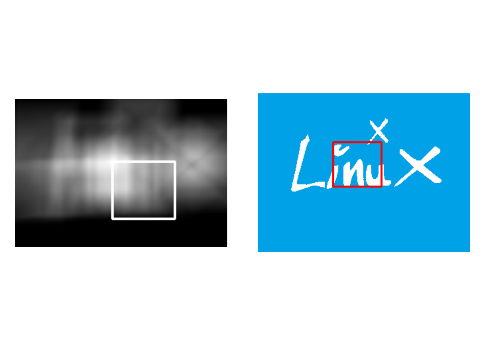

当把代码中的use_mask设置为TRUE时（即使用遮罩时），匹配结果符合预期。


**示例**


``` r
#读取图像文件
img = cv_imread("images/orangetree.jpg")
#读取模板图像文件
tmpl = cv_imread("images/orange_templ.jpg")
#获得模板图像基本信息
tmpl_info= rcv_matInfo(tmpl)


#按TM_CCORR_NORMED匹配方法依照templ对img进行模板匹配，结果保存在res中
res = Mat()
cv_matchTemplate(img,tmpl,res,TM_CCORR_NORMED)

#对res进行归一化（最大最小值方式）
cv_normalize(res, res, 0, 255, NORM_MINMAX,CV_8U)

#由于res的尺寸与原图像有差异，不好对比结果
img_info = rcv_matInfo(img)
res_info = rcv_matInfo(res)
res1 = Mat_zeros(img_info$height,img_info$width,CV_8UC1)
roi = Mat(res1,Rect(0,0,res_info$width,res_info$height))
res$copyTo(roi)

#使用minMaxLoc函数，获取图像中最小、最大像素值以及最小、最大像素值出现的位置
minVal = 0
maxVal = 0
minLoc = Point(0, 0)
maxLoc = Point(0, 0)
cv_minMaxLoc(res1,
             minVal,
             maxVal,
             minLoc,
             maxLoc)

#由于使用的是TM_CCORR_NORMED方法，所以最大像素值出现的位置是最佳匹配位置
matchLoc = maxLoc
#依据最佳匹配位置和模板的尺寸绘制最佳模板匹配区域
cv_rectangle(
    img,
    matchLoc,
    Point(matchLoc$x + tmpl_info$width , matchLoc$y + tmpl_info$height),
    Scalar(0,0,255),
    2,
    8,
    0
  )

cv_rectangle(
    res1,
    matchLoc,
    Point(matchLoc$x + tmpl_info$width , matchLoc$y + tmpl_info$height),
    Scalar(255),
    2,
    8,
    0
  )
cv_imshow("result",res1)
cv_imshow("matched", img)
```


可以试着匹配多个结果：


``` r
#本想匹配多个结果，但失败了
#读取图像文件
img = cv_imread("images/orangetree.jpg")
#读取模板图像文件
tmpl = cv_imread("images/orange_templ.jpg")
#获得模板图像基本信息
tmpl_info = rcv_matInfo(tmpl)


#按TM_CCORR_NORMED匹配方法依照templ对img进行模板匹配，结果保存在res中
res = Mat()
cv_matchTemplate(img,tmpl,res,TM_CCORR_NORMED)

#对res进行归一化（最大最小值方式）
cv_normalize(res, res, 0, 255, NORM_MINMAX,CV_8U)

#由于res的尺寸与原图像有差异，不好对比结果
img_info = rcv_matInfo(img)
res_info = rcv_matInfo(res)
res1 = Mat_zeros(img_info$height,img_info$width,CV_8UC1)
roi = Mat(res1,Rect(0,0,res_info$width,res_info$height))
res$copyTo(roi)

res1_mat = res1$cv2r()

#匹配值为255的
pos = which(res1_mat==255,arr.ind=T)[1,]
cv_rectangle(
  img,
  Point(pos[2],pos[1]),
  Point(pos[2] -1 + tmpl_info$width , pos[1]-1 + tmpl_info$height),
  Scalar(0,0,255),
  2,
  8,
  0
)

#匹配值为200的
pos = which(res1_mat==200,arr.ind=T)[1,]
cv_rectangle(
  img,
  Point(pos[2],pos[1]),
  Point(pos[2] -1 + tmpl_info$width , pos[1]-1 + tmpl_info$height),
  Scalar(0,0,255),
  2,
  8,
  0
)
```


## 查找轮廓

**示例**


``` r
#读取图像文件
img = cv_imread("images/contour.png")
#使用Canny函数提取边缘，结果保存在edges中
edges = Mat()
cv_Canny(img,edges,100,200)
#显示edges，会发现存在6条边缘线
cv_imshow('edges',edges)

#在edges中查找轮廓，轮廓点保存在contours中，轮廓的层次结构保存在hierarchy中
contours = stdVecOfVecOfPoint()
hierarchy = stdVecOfVec4i()
#轮廓查找模式为RETR_EXTERNAL，即只检测外轮廓
#轮廓查找方法为CHAIN_APPROX_NONE，即要保存物体边界上所有连续的轮廓点
cv_findContours(edges,contours,hierarchy,
                  RETR_EXTERNAL,CHAIN_APPROX_NONE)

#查看contours
contours$size()
```

```
## [1] 1
```

``` r
contours[[0]][[0]]$outToConsole()
```

```
## [25, 24]
```

``` r
#查看轮廓
hierarchy$size()
```

```
## [1] 1
```

``` r
hierarchy[[0]]$outToConsole()
```

```
## [-1, -1, -1, -1]
```

结果表明，contours中只包含一个轮廓（即最外层轮廓），所以hierarchy中也只有1条数据，且所有元素都是-1（即不存在前后关系、父子关系和嵌套关系）。可以将寻找到的轮廓绘制到原图上：


``` r
#在img上绘制contours中的轮廓
#第三个参数（即contourIdx）为-1时，意味着绘制contours中的所有轮廓
cv_drawContours(img,contours,-1,Scalar(0,0,255),3)
cv_imshow('img',img)
```

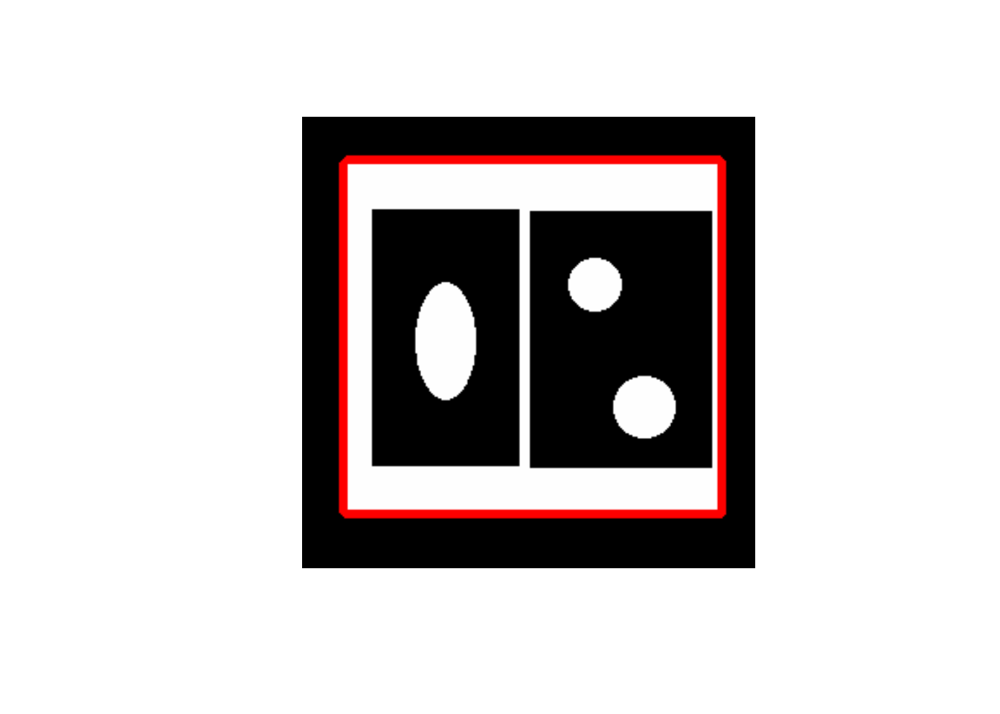

从结果可以看出，contours中的轮廓数据确实是外层轮廓。

将上面代码中的轮廓查找方法为CHAIN_APPROX_SIMPLE，则返回的contours结果中会仅仅包含轮廓的拐点信息，数据量会大大减少（从840个点减少为7个点）：


可以将contours转变为数据框，便于查看7个点的坐标：

``` r
contours_daf = data.frame()
for(i in 1:contours[[0]]$size()-1){
  pt = contours[[0]][[i]]
  contours_daf = bind_rows(contours_daf,data.frame(x=pt$x,y=pt$y))
}
contours_daf
```

```
##     x   y
## 1  25  24
## 2  23  26
## 3  23 227
## 4  24 228
## 5 241 228
## 6 241  25
## 7 240  24
```


**示例**

以下代码演示使用RETR_LIST来查找所有的轮廓，包括内围、外围轮廓。在这种查找模式下，不对查找到的轮廓建立父子关系和嵌套关系，也即轮廓层次结构中所有元素的第3、第4个分量都会被置为-1。


``` r
#读取图像文件
img = cv_imread("images/contour.png")
#使用Canny函数提取边缘，结果保存在edges中
edges = Mat()
cv_Canny(img,edges,100,200)

#在edges中查找轮廓，轮廓点保存在contours中，轮廓的层次结构保存在hierarchy中
contours = stdVecOfVecOfPoint()
hierarchy = stdVecOfVec4i()
#轮廓查找模式为RETR_LIST，即检测所有的轮廓，包括内围、外围轮廓
#轮廓查找方法为CHAIN_APPROX_SIMPLE，即仅保存轮廓的拐点信息
cv_findContours(edges,contours,hierarchy,
                  RETR_LIST,CHAIN_APPROX_SIMPLE)

#查看contours
contours$size()
```

```
## [1] 12
```

``` r
sapply(1:contours$size()-1,function(ind) contours[[ind]]$size())
```

```
##  [1] 48 64 72 86 32 48  8  7  8  7  8  7
```

``` r
#查看轮廓
hierarchy$size()
```

```
## [1] 12
```

``` r
hierarchy[[0]]$outToConsole()
```

```
## [1, -1, -1, -1]
```

``` r
hierarchy[[1]]$outToConsole()
```

```
## [2, 0, -1, -1]
```

``` r
hierarchy[[2]]$outToConsole()
```

```
## [3, 1, -1, -1]
```

结果表明，contours中包含12个轮廓（6条边缘都有内外两个轮廓），这些轮廓的前后顺序体现在hierarchy中——从hierarchy的第2个元素可以看出，contours的第2个轮廓的next值为2，所以其后一个轮廓是第3个，而previous的值为0，所以其前一个轮廓是第1个。

进一步，可以通过如下代码标注一下这12个轮廓在原图的位置：


``` r
#获取图像的基本信息
img_info = rcv_matInfo(img)

#获取每个轮廓上的点
contours_list = list()
for(i in 1:contours$size()-1){
  contours_daf = data.frame()
  for(j in 1:contours[[i]]$size()-1){
    pt = contours[[i]][[j]]
    contours_daf = bind_rows(contours_daf,data.frame(x=pt$x,y=pt$y))
  }
  contours_list[[length(contours_list)+1]] = contours_daf
}

#绘制每条轮廓线，标注其编号
plot(0:max(img_info$height,img_info$width),type="n",
     xlim=c(0,img_info$width),ylim=c(0,img_info$height),
     xlab="",ylab="")
for(i in 1:length(contours_list)){
  #将每个轮廓点数据转变为数据框
  contours_daf = contours_list[[i]]
  #绘制轮廓
  lines(contours_daf)
  #按i的奇偶性控制标注文本的横向偏移（以便看出同一条边缘的两个轮廓编号）
  if(i %% 2==0){
    #i为偶数，标注文本向右偏移
    hadj = c(-0.5,0.5)
  }else{
    #i为奇数，标注文本不偏移
    hadj = c(1,0.5)
  }
  #标注轮廓的编号
  text(contours_daf[1,1],contours_daf[1,2],i-1,adj=hadj)
}
```

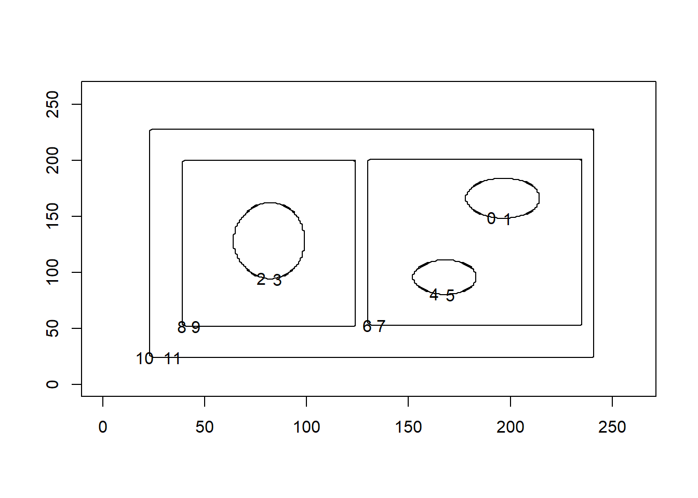

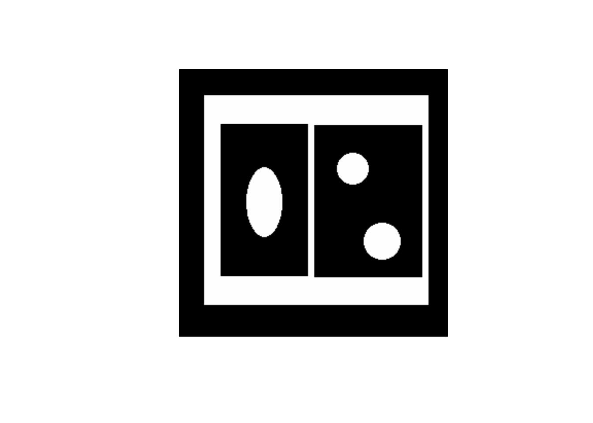

由于绘制的结果是在笛卡尔坐标系中，需要将绘制结果上下颠倒之后再与原图形对照观察。如果希望直接采用图像的像素坐标系，可以使用如下代码：


``` r
#获取图像的基本信息
img_info = rcv_matInfo(img)

#绘制每条轮廓线，标注其编号
plot(0:max(img_info$height,img_info$width),type="n",
     xlim=c(0,img_info$width),ylim=c(0,img_info$height),
     xlab="",ylab="",xaxt="n",yaxt="n")
axis(side=2,at=seq(0,250,by=50),labels=(img_info$height - seq(0,250,by=50)))
axis(side=3)
for(i in 1:length(contours_list)){
  #将每个轮廓点数据转变为数据框
  contours_daf = contours_list[[i]]
  #调整点的纵坐标值（像素坐标系，纵轴正向指向下方）
  contours_daf$y = img_info$height - contours_daf$y
  #绘制轮廓
  lines(contours_daf)
  #按i的奇偶性控制标注文本的横向偏移（以便看出同一条边缘的两个轮廓编号）
  if(i %% 2==0){
    #i为偶数，标注文本向右偏移
    hadj = c(-0.5,0.5)
  }else{
    #i为奇数，标注文本不偏移
    hadj = c(1,0.5)
  }
  #标注轮廓的编号
  text(contours_daf[1,1],contours_daf[1,2],i-1,adj=hadj)
}
```

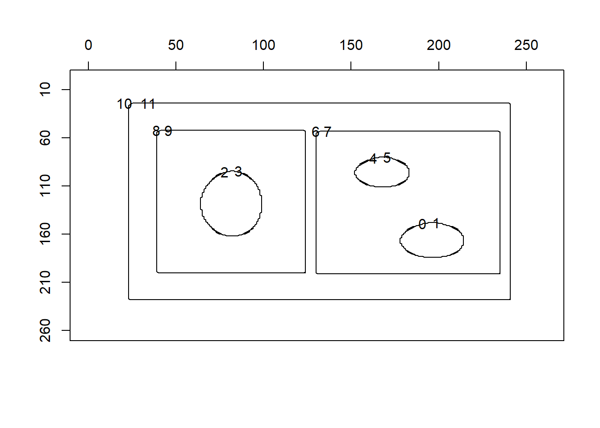

**示例**

以下代码演示了动态调整Canny函数的上下阈值时，轮廓查找结果也会跟着变化：


``` r
#定义滑动条滑动事件的响应函数
thresh_callback = function(val, param)
{
  #获取控制下阈值的滑动条的当前取值，存入thresh中，上阈值设定为下阈值的2倍
  thresh = cv_getTrackbarPos("Canny thresh:", source_window)
  #对src_gray进行边缘检测，结果保存在canny_output中
  canny_output = Mat()
  cv_Canny(src_gray, canny_output, thresh, thresh * 2)
  #获取canny_output的基本信息
  canny_output_info = rcv_matInfo(canny_output)
  
  #在canny_output中查找轮廓，轮廓点保存在contours，轮廓层次保存在hierarchy中
  contours = stdVecOfVecOfPoint()
  hierarchy = stdVecOfVec4i()
  cv_findContours(canny_output,
                    contours,
                    hierarchy,
                    RETR_TREE,
                    CHAIN_APPROX_SIMPLE)
  
  #按canny_ouput的尺寸生成8位无符号3通道图像矩阵drawing，
  #所有像素的值都为黑色c(0,0,0)
  drawing = Mat_zeros(canny_output_info$height,
                           canny_output_info$width,
                           CV_8UC3)
  #在drawing中绘制每个轮廓
  for(i in 1:contours$size()-1)
  {
    #随机设定轮廓绘制颜色
    ccolor = Scalar(runif(1, 0, 255), runif(1, 0, 255), runif(1, 0, 255))
    #绘制第i个轮廓
    cv_drawContours(drawing, contours, i, ccolor, 2, LINE_8, hierarchy, 0)
  }
  #将drawing显示在标题为contours的图形窗口中
  cv_imshow("Contours", drawing)
}

#读取图像文件
src = cv_imread("images/HappyFish.jpg")
#将src转变为灰度图，结果保存在src_gray中
src_gray = Mat()
cv_cvtColor(src, src_gray, COLOR_BGR2GRAY)
#对src_gray进行归一化盒子滤波，结果保存在src_gray中
cv_blur(src_gray, src_gray, Size(3, 3))

#生成标题为Source的图形窗口，并显示src
source_window = "Source"
cv_namedWindow(source_window)
cv_imshow(source_window, src)

#在标题为Source的图形窗口中创建控制下阈值的滑动条
cv_createTrackbar("Canny thresh:",
                  source_window,
                  30,
                  255,
                  thresh_callback)
#调用thresh_callback函数
thresh_callback(0, 0)
```

## 计算最小包含凸集（凸包）

在图像处理过程中，常常需要寻找图像中能包含一个物体的最小凸集——是所有能包含这个物体的凸集的交集。


在上图中，红色线条所包围的区域即为黄色海星的凸包。


OpenCV在**convexHull**函数中封装了凸包计算操作。主要步骤：

* 对图像进行边缘检测，形成边缘数据  
* 对边缘数据进行轮廓检测，形成轮廓数据（是点的集合） 
* 对轮廓（点集）进行凸包计算

**示例**

以下代码演示了如何计算一个点集的凸包：


``` r
#生成一个包含70个点坐标的数据框，第1列为点的横坐标，第2列为点纵坐标
set.seed(123)
pnts = data.frame(x=rnorm(70,mean=150,sd=60),y=rnorm(70,mean=150,sd=60))

#生成一个300行300列的8位无符号三通道图像矩阵img，所有像素值都为(0,0,0)
img = Mat_zeros(300,300,CV_8UC3)
for(i in 1:nrow(pnts)){
  #在img上，分别以70个点为圆心，3为半径的黄色填充小圆
  cv_circle(img,Point(pnts[i,1],pnts[i,2]),3,Scalar(0,255,255),-1)
}

#依据数据框中的点数据，生成一个点列表pnts.list，
#以便作为convexHull函数的points参数
pntsVec = stdVecOfPoint()
for(i in 1:nrow(pnts)){
  pntsVec$push_back(Point(pnts[i,1],pnts[i,2]))
}

#针对pntsVec的点集，计算其凸包（点集）
hull = stdVecOfPoint()
cv_convexHull(pntsVec,hull)
#使用多边形绘制函数在img上绘制凸包
cv_polylines(img,hull,TRUE,Scalar(255,0,0),2)
```


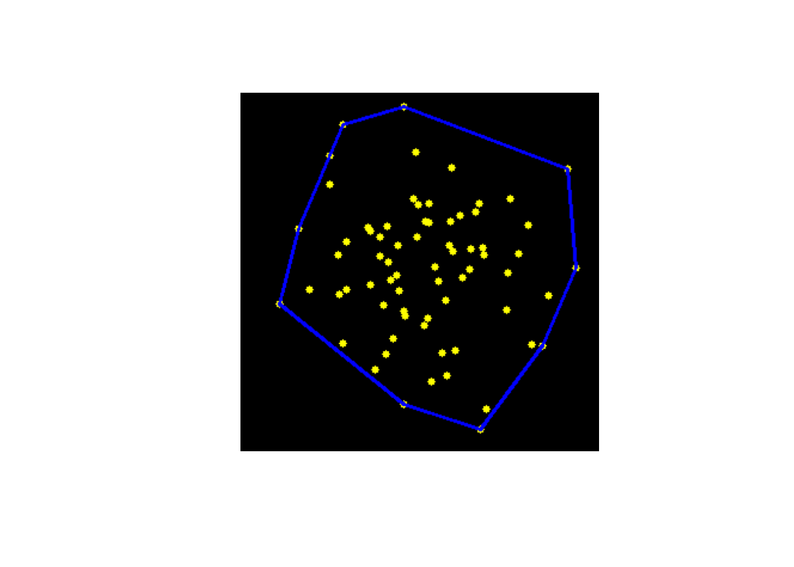


**示例**


``` r
#读取图像文件
img = cv_imread("images/palm.png")

#使用Canny函数对img提取边缘，结果保存在img.canny中
img_canny = Mat()
cv_Canny(img,img_canny,300,600)

#在img.canny中查找轮廓，轮廓点保存在contours中，轮廓的层次结构保存在hierarchy中
contours = stdVecOfVecOfPoint()
hierarchy = stdVecOfVec4i()
cv_findContours(img_canny,contours,hierarchy,
                  RETR_TREE,CHAIN_APPROX_SIMPLE)

#对contours的每个轮廓（点集）计算凸包，并绘制在img上
hull = stdVecOfPoint()
pos = which.max(
  sapply(1:contours$size()-1,function(ind) contours[[ind]]$size())
  )[1]
pos = pos-1
for(i in 1:contours$size()-1){
  cv_convexHull(contours[[i]],hull)  
  cv_polylines(img,hull,TRUE,Scalar(0,0,255),3)
}

#查看结果
cv_imshow('img',img)
```


进一步，可以只针对contours中包含点数最多的轮廓计算凸包：


``` r
#读取图像文件
img = cv_imread("images/palm.png")

#使用Canny函数对img提取边缘，结果保存在img_canny中
img_canny = Mat()
cv_Canny(img,img_canny,300,600)

#在img.canny中查找轮廓，轮廓点保存在contours中，轮廓的层次结构保存在hierarchy中
contours = stdVecOfVecOfPoint()
hierarchy = stdVecOfVec4i()
cv_findContours(img_canny,contours,hierarchy,
                  RETR_TREE,CHAIN_APPROX_SIMPLE)

#对contours中包含点数最多的轮廓计算凸包，并绘制在img上
hull = stdVecOfPoint()
pos = which.max(
  sapply(1:contours$size()-1,function(ind) contours[[ind]]$size())
  )[1]
pos = pos-1
cv_convexHull(contours[[pos]],hull)  
cv_polylines(img,hull,TRUE,Scalar(0,0,255),3)


#查看结果
cv_imshow('img',img)
```


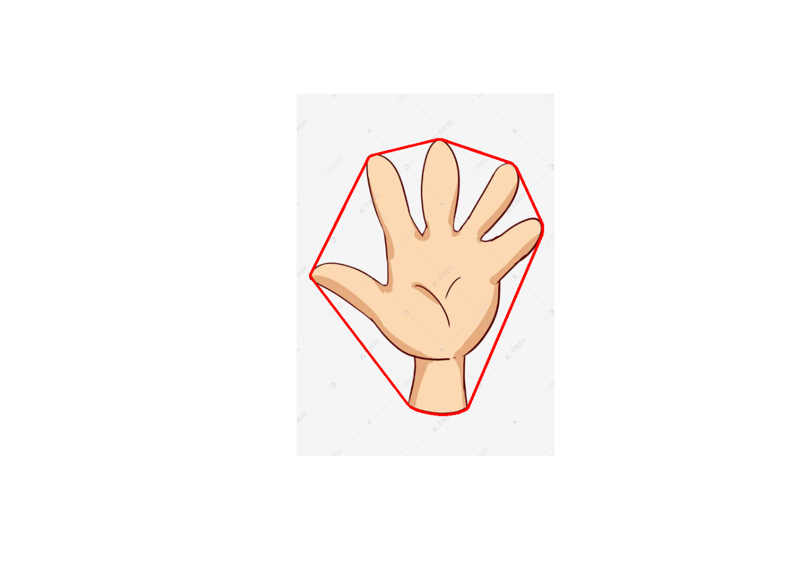


## 计算最小包含矩形、圆形或者三角形

OpenCV在**boundingRect**函数、**minEnclosingCircle**函数和**minEnclosingTriangle**函数中分别封装了计算能够包含一个物体的最小矩形、最小圆形和最小三角形。

**示例**

以下代码演示了如何计算包含一个点集的最小矩形：


``` r
#生成一个包含70个点坐标的数据框，第1列为点的横坐标，第2列为点纵坐标
set.seed(123)
pnts = data.frame(x=rnorm(70,mean=150,sd=30),y=rnorm(70,mean=150,sd=20))

#生成一个300行300列的8位无符号三通道图像矩阵img，所有像素值都为(0,0,0)
img = Mat_zeros(300,300,CV_8UC3)
for(i in 1:nrow(pnts)){
  #在img上，分别以70个点为圆心，3为半径的黄色填充小圆
  cv_circle(img,Point(pnts[i,1],pnts[i,2]),1,Scalar(0,255,255),-1)
}

#依据数据框中的点数据，生成一个点列表pntsVec
pntsVec = stdVecOfPoint()
for(i in 1:nrow(pnts)){
  pntsVec$push_back(Point(pnts[i,1],pnts[i,2]))
}
#针对pntsVec的点集，计算其最小包含矩形
brect = cv_boundingRect(pntsVec)

#在img上绘制包含点集的最小矩形
cv_rectangle(img,brect,Scalar(0,0,255),2)
```


**示例**

以下代码演示了如何计算包含一个点集的最小圆形：


``` r
#生成一个包含70个点坐标的数据框，第1列为点的横坐标，第2列为点纵坐标
set.seed(123)
pnts = data.frame(x=rnorm(70,mean=150,sd=30),y=rnorm(70,mean=150,sd=20))

#生成一个300行300列的8位无符号三通道图像矩阵img，所有像素值都为(0,0,0)
img = Mat_zeros(300,300,CV_8UC3)
for(i in 1:nrow(pnts)){
  #在img上，分别以70个点为圆心，3为半径的黄色填充小圆
  cv_circle(img,Point(pnts[i,1],pnts[i,2]),1,Scalar(0,255,255),-1)
}

#依据数据框中的点数据，生成一个点列表pntsVec
pntsVec = stdVecOfPoint()
for(i in 1:nrow(pnts)){
  pntsVec$push_back(Point(pnts[i,1],pnts[i,2]))
}

#针对pnts.list的点集，计算其最小包含圆形
center = Point2f()
radius = 0
cv_minEnclosingCircle(pntsVec,center,radius)

#在img上绘制包含点集的最小圆形
cv_circle(img,Point(center$x,center$y),round(radius),Scalar(0,0,255),2)
```

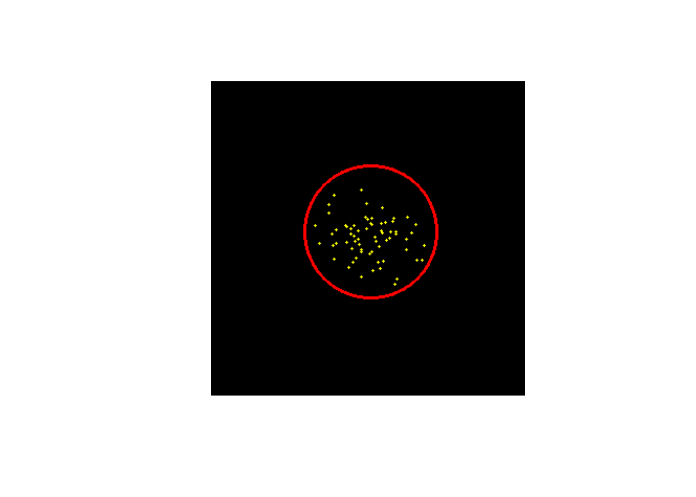

**示例**

以下代码演示了如何计算包含一个点集的最小三角形：


``` r
#生成一个包含70个点坐标的数据框，第1列为点的横坐标，第2列为点纵坐标
set.seed(123)
pnts = data.frame(x=rnorm(70,mean=150,sd=30),y=rnorm(70,mean=150,sd=20))

#生成一个300行300列的8位无符号三通道图像矩阵img，所有像素值都为(0,0,0)
img = Mat_zeros(300,300,CV_8UC3)
for(i in 1:nrow(pnts)){
  #在img上，分别以70个点为圆心，3为半径的黄色填充小圆
  cv_circle(img,Point(pnts[i,1],pnts[i,2]),1,Scalar(0,255,255),-1)
}

#依据数据框中的点数据，生成一个点列表pntsVec
pntsVec = stdVecOfPoint()
for(i in 1:nrow(pnts)){
  pntsVec$push_back(Point(pnts[i,1],pnts[i,2]))
}

#针对pnts.list的点集，计算其最小包含三角形
tri = stdVecOfPoint()
cv_minEnclosingTriangle(pntsVec,tri)
```

```
## [1] 12363.89
```

``` r
#在img上绘制包含点集的最小三角形
cv_polylines(img,tri,TRUE,Scalar(0,0,255),2)
```


**示例**


``` r
#读取图像文件
img = cv_imread("images/balloon.png")

#检测img的边缘，结果保存在canny_output中
canny_output = Mat()
cv_Canny(img, canny_output, 200, 200 * 2)

#查找canny_output中的轮廓，结果保存在controus中
contours = stdVecOfVecOfPoint()
cv_findContours(canny_output,
                    contours,
                    RETR_EXTERNAL,
                    CHAIN_APPROX_SIMPLE)

#计算每个轮廓（点集）的最小包含矩形、最小包含圆形和最小包含三角形，且绘制在img上
for(i in 1:contours$size()-1){
  #计算第i个轮廓（点集）的最小包含矩形
  brect = cv_boundingRect(contours[[i]])
  #在img上绘制最小包含矩形
  cv_rectangle(img,brect,Scalar(0,0,255),2)
  
  #计算第i个轮廓（点集）的最小包含圆形
  center = Point()
  radius = 0
  cv_minEnclosingCircle(contours[[i]],center,radius)
  #在img上绘制最小圆形
  cv_circle(img,center,radius,Scalar(0,255,0),2)
  
  #计算第i个轮廓（点集）的最小包含三角形
  tri = stdVecOfPoint()
  cv_minEnclosingTriangle(contours[[i]],tri)
  #在img上绘制最小三角形
  cv_polylines(img,tri,TRUE,Scalar(255,0,0),2)
  
}
```


## 计算最小包含旋转矩形或者椭圆

OpenCV在**minAreaRect**函数和**fitEllipse**函数中分别封装了计算能够包含一个物体的最小旋转矩形和最小椭圆形。


**示例**

以下代码演示了如何计算包含一个点集的最小矩形和最小旋转矩形：


``` r
#生成一个包含70个点坐标的数据框，第1列为点的横坐标，第2列为点纵坐标
set.seed(123)
pnts = data.frame(x=rnorm(70,mean=150,sd=30),y=rnorm(70,mean=150,sd=20))

#生成一个300行300列的8位无符号三通道图像矩阵img，所有像素值都为(0,0,0)
img = Mat_zeros(300,300,CV_8UC3)
for(i in 1:nrow(pnts)){
  #在img上，分别以70个点为圆心，3为半径的黄色填充小圆
  cv_circle(img,Point(pnts[i,1],pnts[i,2]),1,Scalar(0,255,255),-1)
}

#依据数据框中的点数据，生成一个点列表pntsVec
pntsVec = stdVecOfPoint()
for(i in 1:nrow(pnts)){
  pntsVec$push_back(Point(pnts[i,1],pnts[i,2]))
}
#针对pntsVec的点集，计算其最小包含矩形，结果保存在brect中
brect = cv_boundingRect(pntsVec)
#在img上绘制包含点集的最小矩形
cv_rectangle(img,brect,Scalar(0,0,255),2)

#针对pnts.list的点集，计算其最小包含旋转矩形，结果保存在bminAreaRect中
bminAreaRect = cv_minAreaRect(pntsVec)
#获取bminAreaRect的端点集，保存在vtx中
vtx = stdVecOfPoint2f()
bminAreaRect$points(vtx)
#在img上绘制最小旋转矩形
vtx1 = stdVecOfPoint()
for(i in 1:vtx$size()-1){
  vtx1$push_back(Point(round(vtx[[i]]$x),round(vtx[[i]]$y)))
}
cv_polylines(img,vtx1,TRUE,Scalar(255,0,0),2)
```

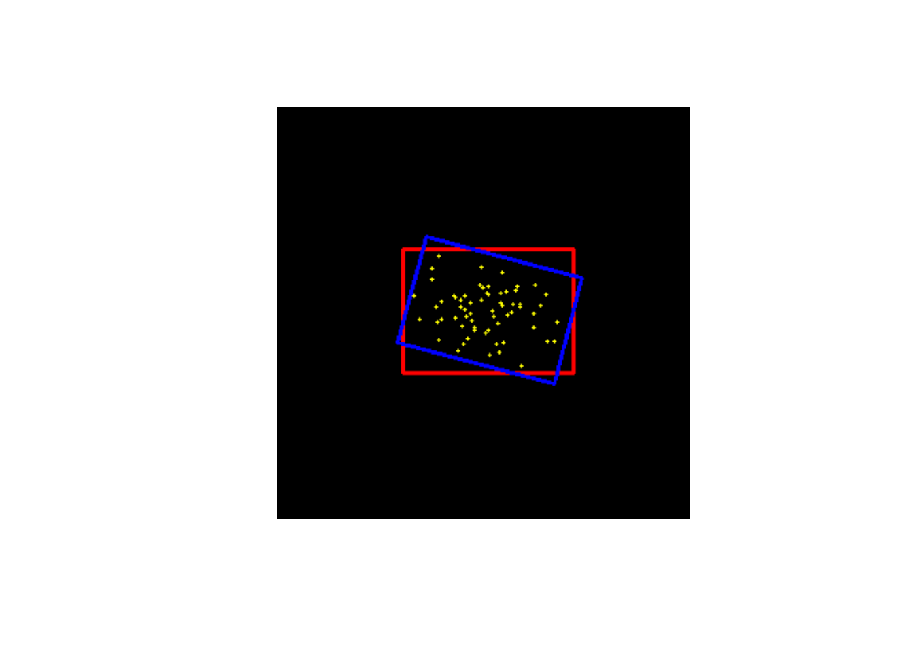

**示例**

以下代码演示了如何计算包含一个点集的最小圆形和最小椭圆形：


``` r
#生成一个包含70个点坐标的数据框，第1列为点的横坐标，第2列为点纵坐标
set.seed(123)
pnts = data.frame(x=rnorm(70,mean=150,sd=30),y=rnorm(70,mean=150,sd=20))

#生成一个300行300列的8位无符号三通道图像矩阵img，所有像素值都为(0,0,0)
img = Mat_zeros(300,300,CV_8UC3)
for(i in 1:nrow(pnts)){
  #在img上，分别以70个点为圆心，3为半径的黄色填充小圆
  cv_circle(img,Point(pnts[i,1],pnts[i,2]),1,Scalar(0,255,255),-1)
}

#依据数据框中的点数据，生成一个点列表pnts.list
pntsVec = stdVecOfPoint()
for(i in 1:nrow(pnts)){
  pntsVec$push_back(Point(pnts[i,1],pnts[i,2]))
}

#针对pntsVec的点集，计算其最小包含圆形
center = Point2f()
radius = 0
cv_minEnclosingCircle(pntsVec,center,radius)
#在img上绘制包含点集的最小圆形
cv_circle(img,Point(center$x,center$y),radius,Scalar(0,0,255),2)

#针对pntsVec的点集，计算其最小椭圆
bellipse = cv_fitEllipse(pntsVec)
#在img上绘制包含点集的最小椭圆
cv_ellipse(img,bellipse,Scalar(255,0,0),2)
```


**示例**


``` r
#读取图像文件
img = cv_imread("images/palm.png")
#检测img的边缘，结果保存在canny_output中
canny_output = Mat()
cv_Canny(img, canny_output, 100, 200 * 2)

#查找canny_output中的轮廓，结果保存在controus中
contours = stdVecOfVecOfPoint()
cv_findContours(canny_output,
                    contours,
                    RETR_EXTERNAL,
                    CHAIN_APPROX_SIMPLE)

#计算每个轮廓（点集）的最小包含旋转矩形和最小包含椭圆，且绘制在img上
for(i in 1:contours$size()-1){
  #计算第i个轮廓（点集）的最小包含旋转，结果保存在bminAreaRect中
  bminAreaRect = cv_minAreaRect(contours[[i]])
  #获取bminAreaRect的端点集，保存在vtx中
  vtx = stdVecOfPoint2f()
  bminAreaRect$points(vtx)
  #在img上绘制最小旋转矩形
  vtx1 = stdVecOfPoint()
  for(j in 1:vtx$size()-1){
    vtx1$push_back(Point(round(vtx[[j]]$x),round(vtx[[j]]$y)))
  }
  cv_polylines(img,vtx1,TRUE,Scalar(0,0,255),2)
  
  #计算第i个轮廓（点集）的最小包含椭圆形
  bellipse = cv_fitEllipse(contours[[i]])
  #在img上绘制包含点集的最小椭圆
  cv_ellipse(img,bellipse,Scalar(255,0,0),2)
  
}
```

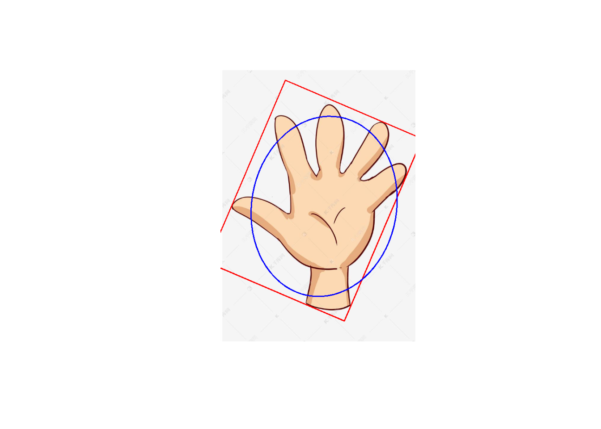

## 图像的矩

一幅$M \times N$的数字图像$f(i,j)$，其$p+q$阶几何矩$m_{pq}$和中心矩$μ_{pq}$为：

$$
m_{pq}=\sum_{i=0}^{M-1} \sum_{j=0}^{N-1} i^q j^p f(i,j)
$$

$$
\mu_{pq}=\sum_{i=0}^{M-1} \sum_{j=0}^{N-1} (i− \bar i)^q (j− \bar j)^p f(i,j)
$$
其中$f(i,j)$为图像在坐标点$(i,j)$处的灰度值。$\bar i=m_{01}/m_{00}$, $\bar j=m_{10}/m_{00}$


``` r
img = cv_imread("images/lena.jpg",0)
m = cv_moments(img)
m$cv2r()
```

```
## $spatial_moments
##          m00          m10          m01          m20          m11          m02 
## 3.255844e+07 8.677603e+09 8.056772e+09 3.015184e+12 2.190566e+12 2.700340e+12 
##          m30          m21          m12          m03 
## 1.163589e+15 7.720377e+14 7.384593e+14 1.025977e+15 
## 
## $central_moments
##          mu20          mu11          mu02          mu30          mu21 
##  7.023951e+11  4.324367e+10  7.066459e+11 -1.443973e+13  2.862336e+12 
##          mu12          mu03 
## -2.647695e+12  8.035339e+12 
## 
## $central_normalized_moments
##          nu20          nu11          nu02          nu30          nu21 
##  6.626043e-04  4.079391e-05  6.666143e-04 -2.387262e-06  4.732184e-07 
##          nu12          nu03 
## -4.377327e-07  1.328450e-06
```


``` r
#生成一个包含70个点坐标的数据框，第1列为点的横坐标，第2列为点纵坐标
set.seed(123)
pnts = data.frame(x=c(1,4,4,4,1),y=c(1,1,4,1,1))

#依据数据框中的点数据，生成一个点列表pntsVec
pntsVec = stdVecOfPoint()
for(i in 1:nrow(pnts)){
  pntsVec$push_back(Point(pnts[i,1],pnts[i,2]))
}

m = cv_moments(pntsVec)
m$cv2r()
```

```
## $spatial_moments
## m00 m10 m01 m20 m11 m02 m30 m21 m12 m03 
##   0   0   0   0   0   0   0   0   0   0 
## 
## $central_moments
## mu20 mu11 mu02 mu30 mu21 mu12 mu03 
##    0    0    0    0    0    0    0 
## 
## $central_normalized_moments
## nu20 nu11 nu02 nu30 nu21 nu12 nu03 
##    0    0    0    0    0    0    0
```


**示例**


``` r
#读入图像文件
img = cv_imread("images/arrow.png")

#对img进行灰度化，结果保存在img_gray中
img_gray = Mat()
cv_cvtColor(img,img_gray,COLOR_BGR2GRAY)

#在img_gray中查找轮廓，结果保存在contours和hierarchy中
contours = stdVecOfVecOfPoint()
hierarchy = stdVecOfVec4i()
cv_findContours(img_gray,contours,hierarchy,RETR_EXTERNAL,CHAIN_APPROX_SIMPLE)

cv_drawContours(img,contours,-1,Scalar(0,0,255),2)


for(i in 1:contours$size()-1){
  #计算第i条轮廓（点集）的矩
  m = cv_moments(contours[[i]])
  #计算第i条轮廓（点集）的质心坐标
  mass_center = Point(m$m10/(m$m00+1e-10),m$m01/(m$m00+1e-10))
  #在img上以质心为圆心，4为半径，绘制一个红色填充圆
  cv_circle(img,mass_center,4,Scalar(0,0,255),-1)
  
  #计算第i个轮廓（点集）的最小包含椭圆形
  bellipse = cv_fitEllipse(contours[[i]])
  #在img上绘制包含点集的最小椭圆
  cv_ellipse(img,bellipse,Scalar(255,0,0),2)
}

cv_imshow('img',img)
```


**示例**


``` r
thresh = 100
#定义滑动条控制响应函数
thresh_callback = function(val, param)
{
  #获取控制Canny算子阈值的滑动条的当前值
  thresh = cv_getTrackbarPos("Canny thresh:", "Source")
  
  #对src_gray进行边缘检查，结果保存在canny_output中
  canny_output = Mat()
  cv_Canny(src_gray, canny_output, thresh, thresh * 2, 3)

  #获取canny_output的纪斌信息
  canny_output_info = rcv_matInfo(canny_output)
  
  #检查canny_output的轮廓，结果保存在contours中
  contours = stdVecOfVecOfPoint()
  cv_findContours(canny_output,
                    contours,
                    RETR_TREE,
                    CHAIN_APPROX_SIMPLE)
  
  #计算图像的矩
  mu_list = vector("list", contours$size())
  for (i in 1:contours$size()-1)
  {
    mu_list[[i+1]] = cv_moments(contours[[i]])
  }
  #计算质心坐标
  mc_list = vector("list", contours$size())
  for (i in 1:contours$size()-1)
  {
    # mtmp = mu_list[[i+1]]$spatial_moments
    mtmp = mu_list[[i+1]]
    #add 1e-5 to avoid division by zero
    # mc_list[[i+1]] = c(mtmp["m10"] / (mtmp["m00"] + 1e-5),
    #             mtmp["m01"] / (mtmp["m00"] + 1e-5))
    mc_list[[i+1]] = Point(mtmp$m10 / (mtmp$m00 + 1e-5),
                mtmp$m01 / (mtmp$m00 + 1e-5))
    # cat("mc[" , i , "]=" , mc_list[[i+1]] , "\n")
    cat("mc[" , i , "]=" , mc_list[[i+1]]$x,",",mc_list[[i+1]]$y, "\n")
  }
  
  #绘制轮廓并标注质心点
  drawing = Mat_zeros(canny_output_info$height,
                           canny_output_info$width,
                           CV_8UC3)
  for (i in 1:contours$size()-1)
  {
    ccolor = Scalar(runif(1, 0, 255), runif(1, 0, 255), runif(1, 0, 255))
    cv_drawContours(drawing, contours, i, ccolor, 2)
    cv_circle(drawing, mc_list[[i + 1]], 4, ccolor,-1)
    
  }
  #现实绘制结果
  cv_imshow("Contours", drawing)
  
  #在控制台中输出轮廓面积和轮廓长度
  cat("\t Info: Area and Contour Length \n")
  for (i in 1:contours$size()-1)
  {
    # mtmp = cv.moments.cv2r(mu[[i]])$spatial_moments
    mtmp = mu_list[[i+1]]
    cat(
      " * Contour[" ,
      i ,
      "] - Area (M_00) = " ,
      mtmp$m00,
      " - Area OpenCV: " ,
      cv_contourArea(contours[[i]]) ,
      " - Length: " ,
      cv_arcLength(contours[[i]], TRUE) ,
      "\n"
    )
  }
}

#读取图像文件
src = cv_imread("images/ghosts.png")
#将图像灰度化，结果保存在src_gray中
src_gray = Mat()
cv_cvtColor(src, src_gray, COLOR_BGR2GRAY)
#进行归一化盒子滤波，结果仍然保存在src_gray中
cv_blur(src, src_gray, Size(3, 3))

#创建图形窗口并显示src
cv_namedWindow("Source")
cv_imshow("Source", src)

#在图形窗口上创建控制Canny算子阈值的滑动条
cv_createTrackbar("Canny thresh:",
                  "Source",
                  100,
                  255,
                  thresh_callback)
cv_setTrackbarPos("Canny thresh:",
                  "Source",
                  100)
```

```
## mc[ 0 ]= 0 , 0 
## mc[ 1 ]= 485 , 204 
## mc[ 2 ]= 622 , 144 
## mc[ 3 ]= 624 , 140 
## mc[ 4 ]= 360 , 126 
## mc[ 5 ]= 360 , 126 
## mc[ 6 ]= 577 , 187 
## mc[ 7 ]= 595 , 121 
## mc[ 8 ]= 595 , 121 
## mc[ 9 ]= 97 , 120 
## mc[ 10 ]= 639 , 121 
## mc[ 11 ]= 639 , 121 
## mc[ 12 ]= 508 , 109 
## mc[ 13 ]= 508 , 109 
## mc[ 14 ]= 466 , 109 
## mc[ 15 ]= 466 , 109 
## mc[ 16 ]= 358 , 106 
## mc[ 17 ]= 358 , 106 
## mc[ 18 ]= 625 , 152 
## mc[ 19 ]= 482 , 133 
## mc[ 20 ]= 365 , 147 
## mc[ 21 ]= 74 , 141 
## mc[ 22 ]= 227 , 123 
## mc[ 23 ]= 227 , 123 
## mc[ 24 ]= 227 , 81 
## mc[ 25 ]= 227 , 81 
## mc[ 26 ]= 226 , 68 
## mc[ 27 ]= 226 , 68 
## mc[ 28 ]= 259 , 62 
## mc[ 29 ]= 259 , 62 
## mc[ 30 ]= 197 , 61 
## mc[ 31 ]= 197 , 61 
## 	 Info: Area and Contour Length 
##  * Contour[ 0 ] - Area (M_00) =  0  - Area OpenCV:  0  - Length:  0 
##  * Contour[ 1 ] - Area (M_00) =  76  - Area OpenCV:  76  - Length:  673.328 
##  * Contour[ 2 ] - Area (M_00) =  8  - Area OpenCV:  8  - Length:  48.28427 
##  * Contour[ 3 ] - Area (M_00) =  7.5  - Area OpenCV:  7.5  - Length:  251.0122 
##  * Contour[ 4 ] - Area (M_00) =  259.5  - Area OpenCV:  259.5  - Length:  135.3553 
##  * Contour[ 5 ] - Area (M_00) =  238  - Area OpenCV:  238  - Length:  121.4558 
##  * Contour[ 6 ] - Area (M_00) =  22  - Area OpenCV:  22  - Length:  300.3087 
##  * Contour[ 7 ] - Area (M_00) =  281.5  - Area OpenCV:  281.5  - Length:  62.87006 
##  * Contour[ 8 ] - Area (M_00) =  263.5  - Area OpenCV:  263.5  - Length:  60.52691 
##  * Contour[ 9 ] - Area (M_00) =  11.5  - Area OpenCV:  11.5  - Length:  96.66905 
##  * Contour[ 10 ] - Area (M_00) =  290  - Area OpenCV:  290  - Length:  64.28427 
##  * Contour[ 11 ] - Area (M_00) =  275  - Area OpenCV:  275  - Length:  61.94113 
##  * Contour[ 12 ] - Area (M_00) =  192  - Area OpenCV:  192  - Length:  51.79899 
##  * Contour[ 13 ] - Area (M_00) =  179  - Area OpenCV:  179  - Length:  49.45584 
##  * Contour[ 14 ] - Area (M_00) =  195.5  - Area OpenCV:  195.5  - Length:  53.2132 
##  * Contour[ 15 ] - Area (M_00) =  182.5  - Area OpenCV:  182.5  - Length:  50.87006 
##  * Contour[ 16 ] - Area (M_00) =  331  - Area OpenCV:  331  - Length:  68.28427 
##  * Contour[ 17 ] - Area (M_00) =  314  - Area OpenCV:  314  - Length:  65.94112 
##  * Contour[ 18 ] - Area (M_00) =  84  - Area OpenCV:  84  - Length:  1174.264 
##  * Contour[ 19 ] - Area (M_00) =  107.5  - Area OpenCV:  107.5  - Length:  867.3351 
##  * Contour[ 20 ] - Area (M_00) =  155.5  - Area OpenCV:  155.5  - Length:  1291.869 
##  * Contour[ 21 ] - Area (M_00) =  130.5  - Area OpenCV:  130.5  - Length:  1428.698 
##  * Contour[ 22 ] - Area (M_00) =  23029  - Area OpenCV:  23029  - Length:  899.8377 
##  * Contour[ 23 ] - Area (M_00) =  22852  - Area OpenCV:  22852  - Length:  899.1514 
##  * Contour[ 24 ] - Area (M_00) =  404.5  - Area OpenCV:  404.5  - Length:  203.6985 
##  * Contour[ 25 ] - Area (M_00) =  385  - Area OpenCV:  385  - Length:  193.4558 
##  * Contour[ 26 ] - Area (M_00) =  321.5  - Area OpenCV:  321.5  - Length:  72.04163 
##  * Contour[ 27 ] - Area (M_00) =  307.5  - Area OpenCV:  307.5  - Length:  69.69848 
##  * Contour[ 28 ] - Area (M_00) =  511  - Area OpenCV:  511  - Length:  85.59798 
##  * Contour[ 29 ] - Area (M_00) =  486  - Area OpenCV:  486  - Length:  83.25483 
##  * Contour[ 30 ] - Area (M_00) =  523  - Area OpenCV:  523  - Length:  85.59798 
##  * Contour[ 31 ] - Area (M_00) =  500  - Area OpenCV:  500  - Length:  83.25483
```

``` r
#调用thresh_callback函数
thresh_callback(0, 0)
```

```
## mc[ 0 ]= 0 , 0 
## mc[ 1 ]= 485 , 204 
## mc[ 2 ]= 622 , 144 
## mc[ 3 ]= 624 , 140 
## mc[ 4 ]= 360 , 126 
## mc[ 5 ]= 360 , 126 
## mc[ 6 ]= 577 , 187 
## mc[ 7 ]= 595 , 121 
## mc[ 8 ]= 595 , 121 
## mc[ 9 ]= 97 , 120 
## mc[ 10 ]= 639 , 121 
## mc[ 11 ]= 639 , 121 
## mc[ 12 ]= 508 , 109 
## mc[ 13 ]= 508 , 109 
## mc[ 14 ]= 466 , 109 
## mc[ 15 ]= 466 , 109 
## mc[ 16 ]= 358 , 106 
## mc[ 17 ]= 358 , 106 
## mc[ 18 ]= 625 , 152 
## mc[ 19 ]= 482 , 133 
## mc[ 20 ]= 365 , 147 
## mc[ 21 ]= 74 , 141 
## mc[ 22 ]= 227 , 123 
## mc[ 23 ]= 227 , 123 
## mc[ 24 ]= 227 , 81 
## mc[ 25 ]= 227 , 81 
## mc[ 26 ]= 226 , 68 
## mc[ 27 ]= 226 , 68 
## mc[ 28 ]= 259 , 62 
## mc[ 29 ]= 259 , 62 
## mc[ 30 ]= 197 , 61 
## mc[ 31 ]= 197 , 61 
## 	 Info: Area and Contour Length 
##  * Contour[ 0 ] - Area (M_00) =  0  - Area OpenCV:  0  - Length:  0 
##  * Contour[ 1 ] - Area (M_00) =  76  - Area OpenCV:  76  - Length:  673.328 
##  * Contour[ 2 ] - Area (M_00) =  8  - Area OpenCV:  8  - Length:  48.28427 
##  * Contour[ 3 ] - Area (M_00) =  7.5  - Area OpenCV:  7.5  - Length:  251.0122 
##  * Contour[ 4 ] - Area (M_00) =  259.5  - Area OpenCV:  259.5  - Length:  135.3553 
##  * Contour[ 5 ] - Area (M_00) =  238  - Area OpenCV:  238  - Length:  121.4558 
##  * Contour[ 6 ] - Area (M_00) =  22  - Area OpenCV:  22  - Length:  300.3087 
##  * Contour[ 7 ] - Area (M_00) =  281.5  - Area OpenCV:  281.5  - Length:  62.87006 
##  * Contour[ 8 ] - Area (M_00) =  263.5  - Area OpenCV:  263.5  - Length:  60.52691 
##  * Contour[ 9 ] - Area (M_00) =  11.5  - Area OpenCV:  11.5  - Length:  96.66905 
##  * Contour[ 10 ] - Area (M_00) =  290  - Area OpenCV:  290  - Length:  64.28427 
##  * Contour[ 11 ] - Area (M_00) =  275  - Area OpenCV:  275  - Length:  61.94113 
##  * Contour[ 12 ] - Area (M_00) =  192  - Area OpenCV:  192  - Length:  51.79899 
##  * Contour[ 13 ] - Area (M_00) =  179  - Area OpenCV:  179  - Length:  49.45584 
##  * Contour[ 14 ] - Area (M_00) =  195.5  - Area OpenCV:  195.5  - Length:  53.2132 
##  * Contour[ 15 ] - Area (M_00) =  182.5  - Area OpenCV:  182.5  - Length:  50.87006 
##  * Contour[ 16 ] - Area (M_00) =  331  - Area OpenCV:  331  - Length:  68.28427 
##  * Contour[ 17 ] - Area (M_00) =  314  - Area OpenCV:  314  - Length:  65.94112 
##  * Contour[ 18 ] - Area (M_00) =  84  - Area OpenCV:  84  - Length:  1174.264 
##  * Contour[ 19 ] - Area (M_00) =  107.5  - Area OpenCV:  107.5  - Length:  867.3351 
##  * Contour[ 20 ] - Area (M_00) =  155.5  - Area OpenCV:  155.5  - Length:  1291.869 
##  * Contour[ 21 ] - Area (M_00) =  130.5  - Area OpenCV:  130.5  - Length:  1428.698 
##  * Contour[ 22 ] - Area (M_00) =  23029  - Area OpenCV:  23029  - Length:  899.8377 
##  * Contour[ 23 ] - Area (M_00) =  22852  - Area OpenCV:  22852  - Length:  899.1514 
##  * Contour[ 24 ] - Area (M_00) =  404.5  - Area OpenCV:  404.5  - Length:  203.6985 
##  * Contour[ 25 ] - Area (M_00) =  385  - Area OpenCV:  385  - Length:  193.4558 
##  * Contour[ 26 ] - Area (M_00) =  321.5  - Area OpenCV:  321.5  - Length:  72.04163 
##  * Contour[ 27 ] - Area (M_00) =  307.5  - Area OpenCV:  307.5  - Length:  69.69848 
##  * Contour[ 28 ] - Area (M_00) =  511  - Area OpenCV:  511  - Length:  85.59798 
##  * Contour[ 29 ] - Area (M_00) =  486  - Area OpenCV:  486  - Length:  83.25483 
##  * Contour[ 30 ] - Area (M_00) =  523  - Area OpenCV:  523  - Length:  85.59798 
##  * Contour[ 31 ] - Area (M_00) =  500  - Area OpenCV:  500  - Length:  83.25483
```


```
## mc[ 0 ]= 0 0 
## mc[ 1 ]= 485 204 
## mc[ 2 ]= 622 144 
## mc[ 3 ]= 624 140 
## mc[ 4 ]= 360 126 
## mc[ 5 ]= 360 126 
## mc[ 6 ]= 577 187 
## mc[ 7 ]= 595 121 
## mc[ 8 ]= 595 121 
## mc[ 9 ]= 97 120 
## mc[ 10 ]= 639 121 
## mc[ 11 ]= 639 121 
## mc[ 12 ]= 508 109 
## mc[ 13 ]= 508 109 
## mc[ 14 ]= 466 109 
## mc[ 15 ]= 466 109 
## mc[ 16 ]= 358 106 
## mc[ 17 ]= 358 106 
## mc[ 18 ]= 625 152 
## mc[ 19 ]= 482 133 
## mc[ 20 ]= 365 147 
## mc[ 21 ]= 74 141 
## mc[ 22 ]= 227 123 
## mc[ 23 ]= 227 123 
## mc[ 24 ]= 227 81 
## mc[ 25 ]= 227 81 
## mc[ 26 ]= 226 68 
## mc[ 27 ]= 226 68 
## mc[ 28 ]= 259 62 
## mc[ 29 ]= 259 62 
## mc[ 30 ]= 197 61 
## mc[ 31 ]= 197 61 
## 	 Info: Area and Contour Length 
##  * Contour[ 1 ] - Area (M_00) =  0  - Area OpenCV:  76  - Length:  673.328
```

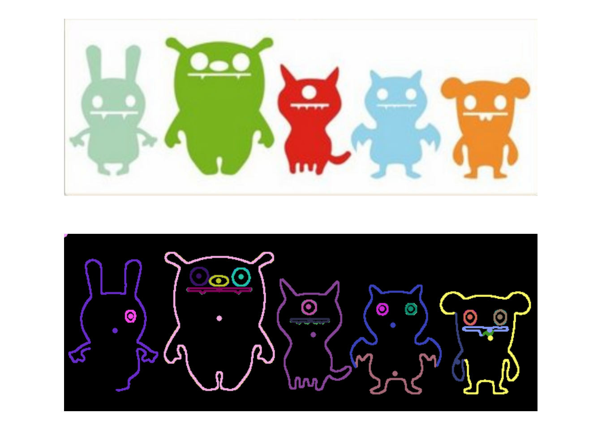


## Point Polygon测试

Point Polygon测试指的是测试图像上一个点（像素）是否在给定的多边形内部，边缘或者外部：返回负数时，表明点在多边形外，返回0时，表明点在多边形上，返回正数时，表明点在多边形内。OpenCV在**cv.pointPolygonTest**函数中封装了此操作，该函数的measureDist参数为TRUE时，可以计算并返回点到多边形的最短距离（这里的距离指的是符号距离，即依据点与多边形的位置关系取正取负）。

**示例**


``` r
#生成黑色图像
img = Mat_zeros(11,11,"CV_8UC1")
#在img上绘制一个白色矩形（该矩形将被识别为一个轮廓）
cv_rectangle(img,Point(2,2),Point(8,8),Scalar(255))

#在img上检测轮廓，结果保存在contours中（只有一个轮廓（点集）：对应于上面绘制的矩形）
contours = stdVecOfVecOfPoint()
cv_findContours(img,contours,RETR_EXTERNAL,CHAIN_APPROX_SIMPLE)

#测试像素(0,0)与矩形的位置关系
cv_pointPolygonTest(contours[[0]],Point2f(0,0),FALSE)
```

```
## [1] -1
```

``` r
#测试像素(0,1)与矩形的位置关系，并返回最短距离
cv_pointPolygonTest(contours[[0]],Point2f(0,1),TRUE)
```

```
## [1] -2.236068
```

``` r
#计算图像中所有像素与矩形的最短距离，结果保存在distMat中
distMat = matrix(0,nr=11,nc=11)
for(i in 1:11){
  for(j in 1:11){
    distMat[i,j] = cv_pointPolygonTest(contours[[0]],Point2f(i-1,j-1),TRUE)
  }
}
#查看结果
round(distMat,2)
```

```
##        [,1]  [,2] [,3] [,4] [,5] [,6] [,7] [,8] [,9] [,10] [,11]
##  [1,] -2.83 -2.24   -2   -2   -2   -2   -2   -2   -2 -2.24 -2.83
##  [2,] -2.24 -1.41   -1   -1   -1   -1   -1   -1   -1 -1.41 -2.24
##  [3,] -2.00 -1.00    0    0    0    0    0    0    0 -1.00 -2.00
##  [4,] -2.00 -1.00    0    1    1    1    1    1    0 -1.00 -2.00
##  [5,] -2.00 -1.00    0    1    2    2    2    1    0 -1.00 -2.00
##  [6,] -2.00 -1.00    0    1    2    3    2    1    0 -1.00 -2.00
##  [7,] -2.00 -1.00    0    1    2    2    2    1    0 -1.00 -2.00
##  [8,] -2.00 -1.00    0    1    1    1    1    1    0 -1.00 -2.00
##  [9,] -2.00 -1.00    0    0    0    0    0    0    0 -1.00 -2.00
## [10,] -2.24 -1.41   -1   -1   -1   -1   -1   -1   -1 -1.41 -2.24
## [11,] -2.83 -2.24   -2   -2   -2   -2   -2   -2   -2 -2.24 -2.83
```

可以看到，图像中位于矩形中心的点具有最大正向距离，而图像的边缘点中存在最小负向距离。

**示例**


``` r
#读取图像文件
src = cv_imread("images/pointpolygon.png")
#获取图像基本信息
src_info = rcv_matInfo(src)

#使用Canny函数提取边缘，结果保存在edges中
edges = Mat()
cv_Canny(src,edges,100,200)

# #将src转变为灰度图
# src_gray_ref = encloseRef(cv.mat.Mat01())
# cv.cvtColor(src,src_gray_ref,"COLOR_BGR2GRAY")
# src_gray = uncloseRef(src_gray_ref)
#在edges中查找轮廓，结果保存在contours中
contours = stdVecOfVecOfPoint()
cv_findContours(edges, contours, RETR_TREE, CHAIN_APPROX_SIMPLE)

#计算图像中所有像素与第1个轮廓所代表的多边形的最短距离，结果保存在distMat中
distMat = matrix(0, nr = src_info$height, nc = src_info$width)
for (i in 1:nrow(distMat)){
  for (j in 1:ncol(distMat)){
    distMat[i, j] = cv_pointPolygonTest(contours[[0]], Point2f(j - 1, i - 1), TRUE)
  }
}

#获取distMat中的最小值和最大值
minVal = min(distMat)
maxVal = max(distMat)
#获取distMat中最大值出现的位置
maxValLoc = which(distMat==max(distMat),arr.ind = T)

#依据distMat生成三维数组drawing.arr（数组中的三个矩阵依次表示蓝色、绿色和红色分量）
#当点在多边形外，越远离多边形，则颜色越暗，越靠近多边形，则颜色越蓝；
#当点在多边形内，越远离多边形，则颜色越暗，越靠近多边形，则颜色越红；
#当点在多边形上，则颜色为白色
drawing_arr = array(0, dim = c(src_info$height, src_info$width, 3))
for (i in 1:dim(drawing_arr)[1]){
  for (j in 1:dim(drawing_arr)[2]){
    if (distMat[i, j] < 0){
      drawing_arr[i, j, 1] = 
        round(255 - abs(distMat[i, j] * 255 / minVal))
    }else if (distMat[i, j] > 0){
      drawing_arr[i, j, 3] = 
        round(255 - distMat[i, j] * 255 / maxVal)
    }else{
      drawing_arr[i, j,] = c(255, 255, 255)
    }
  }
}

#将drawing.arr转变为图像矩阵drawing
drawing = Mat(nrow(drawing_arr),ncol(drawing_arr),CV_8UC3)
drawing$r2cv(drawing_arr)
#在drawing中以最大距离点为为圆心，最大距离为半径绘制一个灰色的圆
cv_circle(drawing, Point(maxValLoc[1,1],maxValLoc[1,2]), round(maxVal), Scalar(128, 128, 128))
#显示源图像和Point Polygon测试结果
cv_imshow("Source", src)
cv_imshow("Distance and inscribed circle", drawing)
```


## 基于距离变换和分水岭算法的图像分割

分水岭算法是一种图像区域分割法，在分割的过程中，它会把跟临近像素间的相似性作为重要的参考依据，从而将在空间位置上相近并且灰度值相近的像素点互相连接起来构成一个封闭的轮廓，封闭性是分水岭算法的一个重要特征。


**示例**


``` r
#读取图像文件
img = cv_imread("images/catoon.png")
#获取图像基本信息
img_info = rcv_matInfo(img)
                   
#将img灰度化，结果保存在img_gray中  
img_gray = Mat()
cv_cvtColor(img,img_gray,COLOR_BGR2GRAY)

#对img_gray进行高斯平滑，结果保存在img_gray中
cv_GaussianBlur(img_gray,img_gray,Size(5,5),2)

#对img_gray进行边缘检测，结果保存在img_canny中
img_canny = Mat()
cv_Canny(img_gray,img_canny,80,150)

#对img_canny提取轮廓，结果保存在contours和hierarchy中
contours = stdVecOfVecOfPoint()
hierarchy = stdVecOfVec4i()
cv_findContours(img_canny,contours,hierarchy,
                  RETR_TREE,CHAIN_APPROX_SIMPLE)
# sapply(1:contours$size()-1,function(i) contours[[i]]$size())
# sapply(1:contours$size()-1,function(i) hierarchy[[i]][[0]])
#生成与img相同尺寸的全黑图像imgContours
imgContours = Mat_zeros(img_info$height,img_info$width,CV_8UC1)
#生成与img相同尺寸的全黑图像marks
marks = Mat_zeros(img_info$height,img_info$width,CV_32S)
#index中存放轮廓编号
index = 0
#compCount中存放图像分割的区域数量
compCount = 0
while(index>=0){
  #在marks中绘制编号为index的轮廓，轮廓的线条颜色依赖于compCount的值
  ccolor = Scalar(compCount+1,compCount+1,compCount+1)
  cv_drawContours(marks,contours,index,ccolor,1,8,hierarchy)
  #在imgContours中绘制编号为index的轮廓，轮廓的线条颜色为白色
  cv_drawContours(imgContours,contours,index,Scalar(255,255,255),1,8,hierarchy)

  #依据轮廓层次hierarchy，提取出下一个轮廓的编号，存放在index中。
  #若index为负数，则表明轮廓遍历结束，循环终止
  index = hierarchy[[index]][[0]]
  #compCount的值累加1
  compCount = compCount+1
}

#对img进行分水岭分割（以marks中的轮廓作为区域分割的初始点），分割结果保存在marks中
cv_watershed(img,marks)

#对每一个分割区域进行颜色填充：
#先将marks转变为R语言的矩阵
marks_mat = marks$cv2r()
#再生成与img同尺寸的R语言三维数组perspectiveImg_arr
perspectiveImg_arr = array(0,dim=c(img_info$height,img_info$width,3))

#对于marks_mat取值为-1的点，相应perspectiveImg_arr的点取白色；
#对于取值不为-1的点，计算相应的颜色值
pos1 = which(marks_mat==-1,arr.ind=T)
perspectiveImg_arr[cbind(pos1[,1],pos1[,2],1)] = 255
perspectiveImg_arr[cbind(pos1[,1],pos1[,2],2)] = 255
perspectiveImg_arr[cbind(pos1[,1],pos1[,2],3)] = 255
pos2 = which(marks_mat!=-1,arr.ind=T)

perspectiveImg_arr[cbind(pos2[,1],pos2[,2],1)] = 
  marks_mat[cbind(pos2[,1],pos2[,2])] %% 255
perspectiveImg_arr[cbind(pos2[,1],pos2[,2],2)] = 
  255 - (marks_mat[cbind(pos2[,1],pos2[,2])] %% 255)
perspectiveImg_arr[cbind(pos2[,1],pos2[,2],3)] = 
  255 - (marks_mat[cbind(pos2[,1],pos2[,2])] %% 255)

#将perspectiveImg_arr转变为图像矩阵
perspectiveImg = Mat(nrow(perspectiveImg_arr),ncol(perspectiveImg_arr),CV_8UC3)
perspectiveImg$r2cv(perspectiveImg_arr)
#可以显示经过颜色填充之后的结果
#cv.imdisplay(perspectiveImg)

#融合img与perspectiveImg，结果保存在wshed中
wshed = Mat()
cv_addWeighted(img,0.4,perspectiveImg,0.6,0,wshed)

#显示最终结果
cv_imshow('res',wshed)
```


**示例**


``` r
img = cv_imread("images/shape1.png")
img_info = rcv_matInfo(img)
pt = Point(0,0)

img_gray = Mat()
cv_cvtColor(img,img_gray,COLOR_BGR2GRAY)

cv_bitwise_not(img_gray,img_gray)

cv_GaussianBlur(img_gray,img_gray,Size(5,5),2)
cv_threshold(img_gray,img_gray,120,200,THRESH_BINARY)
```

```
## [1] 120
```

``` r
cv_imshow('gray',img_gray)

imgThin = Mat_zeros(img_info$height,img_info$width,CV_32FC1)
cv_distanceTransform(img_gray,imgThin,DIST_L2,3)

imgThin4show = Mat()
cv_normalize(imgThin,imgThin4show,0,255,NORM_MINMAX,CV_8U)
cv_imshow('imthin',imgThin4show)

minVal = 0
maxVal = 0
minLoc = Point()
maxLoc = Point()
cv_minMaxLoc(imgThin,minVal,maxVal,minLoc,maxLoc)
cv_circle(img,maxLoc,maxVal,Scalar(0,255,0),3)
cv_circle(img,maxLoc,3,Scalar(0,255,0),3)
cv_imshow('img',img)
```


**示例**

watershed图像自动分割的实现步骤：

1. 图像灰度化、滤波、Canny边缘检测

2. 查找轮廓，并且把轮廓信息按照不同的编号绘制到watershed的第二个入参merkers上，相当于标记注水点。

3. watershed分水岭运算

4. 绘制分割出来的区域，视觉控还可以使用随机颜色填充，或者跟原始图像融合以下，以得到更好的显示效果。

这个示例用于说明分水岭

对如下图像进行区域分割：


``` r
#读取图像文件
img = cv_imread("images/desertwater.png")
#获取图像基本信息
img_info = rcv_matInfo(img)

#将img灰度化，结果保存在img_gray中
img_gray = Mat()
cv_cvtColor(img,img_gray,COLOR_BGR2GRAY)

# #对img.gray进行高斯平滑，结果保存在img.gray中
# cv.GaussianBlur(img.gray,tmp.ref,c(5,5),2)
# img.gray = uncloseRef(tmp.ref)

#对img.gray进行边缘检测，结果保存在img_canny中
img_canny = Mat()
cv_Canny(img_gray,img_canny,80,150)

#检测img_canny的轮廓，结果保存在contours中
contours = stdVecOfVecOfPoint()
cv_findContours(img_canny,contours,RETR_EXTERNAL,CHAIN_APPROX_SIMPLE)

#生成与img相同尺寸的全黑图像marks
marks = Mat_zeros(img_info$height, img_info$width, CV_32S)
#在marks中绘制轮廓
for (i in 1:contours$size() - 1)
{
  #绘制编号为i的轮廓区域，填充颜色为255 - 40*i
  cv_drawContours(marks, contours, i, Scalar(255 - 20*i),1)
}

#可以显示marks结果（CV_32S不能直接显示，需要转换）
marks4Show = Mat()
cv_convertScaleAbs(marks,marks4Show)
cv_imshow('show',marks4Show)

#对img进行分水岭区域分割
# tmp.ref = encloseRef(marks)
cv_watershed(img, marks)
# marks = uncloseRef(tmp.ref)

#可以显示分水岭算法执行之后的标注变化结果（CV_32S不能直接显示，需要转换）
afterWarterShed = Mat()
cv_convertScaleAbs(marks,afterWarterShed)
cv_imshow('shed',afterWarterShed)

#对每一个分割区域进行颜色填充：
#先将marks转变为R语言的矩阵
marks_mat = marks$cv2r()
#再生成与img同尺寸的R语言三维数组perspectiveImg_arr
perspectiveImg_arr = array(0,dim=c(img_info$height,img_info$width,3))
#接着生成256个随机颜色
ccolors = vector("list", 256)
for (i in 1:256)
{
  tmp = sample(0:255,3)
  ccolors[[i]] = Scalar(tmp[1],tmp[2],tmp[3])
}
#然后通过循环，遍历marks_mat的元素值：
#对于取值为-1的点，相应perspectiveImg.arr的点取白色；
#对于取值不为-1的点，检索ccolors中相应的值
for(i in 1:nrow(marks_mat)){
  for(j in 1:ncol(marks_mat)){
    #获取marks在点[j,i]处的区域编号
    index = marks_mat[i,j]
    if(index==-1){
      #编号为-1是，取白色
      perspectiveImg_arr[i,j,]=c(255,255,255)
    }else{
      #依据index检索ccolors中的颜色
      value = index %% 255 +1
      perspectiveImg_arr[i,j,] = c(ccolors[[value]][0],ccolors[[value]][1],ccolors[[value]][2])
    }
  }
}

#将perspectiveImg.arr转变为图像矩阵
perspectiveImg = Mat(nrow(perspectiveImg_arr),ncol(perspectiveImg_arr),CV_8UC3)
perspectiveImg$r2cv(perspectiveImg_arr)
#可以显示经过颜色填充之后的结果
#cv.imdisplay(perspectiveImg)

#融合img与perspectiveImg，结果保存在wshed中
wshed = Mat()
cv_addWeighted(img,0.4,perspectiveImg,0.6,0,wshed)

#显示最终结果
cv_imshow('shed',wshed)
```


**示例**


``` r
#读取图像文件
img = cv_imread("images/cards.png")
#获取图像基本信息
img_info = rcv_matInfo(img)

# #可以显示原始图像
# cv.iminfo("Source Image", img)

#Change the background from white to black, since that will help later to extract
#better results during the use of Distance Transform
#为了在进行距离变换时获得更好的效果，需要将图像中的白色背景变为黑色
img_arr = img$cv2r()
img_arr[img_arr == c(255, 255, 255)] = 0
img$r2cv(img_arr)

# #可以显示背景变为黑色之后的结果
# cv.imshow("Black Background Image", img)

# Create a kernel that we will use to sharpen our image
#生成可以获得图像锐化效果的内核
ker_mat = matrix(c(1,  1, 1,
                  1,-8, 1,
                  1,  1, 1),
                nr = 3,
                nc = 3,
                byrow = TRUE)
ker = Mat(3,3,CV_32F)
ker$r2cv(ker_mat)
# an approximation of second derivative, a quite strong kernel
# do the laplacian filtering as it is
# well, we need to convert everything in something more deeper then CV_8U
# because the kernel has some negative values,
# and we can expect in general to have a Laplacian image with negative values
# BUT a 8bits unsigned int (the one we are working with) can contain values from 0 to 255
# so the possible negative number will be truncated

#对img进行锐化，结果保存在imgLaplacian中
imgLaplacian = Mat()
cv_filter2D(img, imgLaplacian, CV_32F, ker)

#将img的深度转变为CV_32F，转变之后的结果保存在sharp中
sharp = Mat()
img$convertTo(sharp, CV_32F,1,0)

#sharp-imgLaplacian，结果保存在imgResult中
imgResult = Mat()
cv_subtract(sharp, imgLaplacian, imgResult)

# convert back to 8bits gray scale
#将imgResult和imgLaplacian的深度都转变为CV_8U
imgResult$convertTo(imgResult, CV_8UC3,1,0)
imgLaplacian$convertTo(imgLaplacian, CV_8UC3,1,0)

#显示imgLaplacian和imgResult
cv_imshow( "Laplace Filtered Image", imgLaplacian )
cv_imshow("New Sharped Image", imgResult)

# Create binary image from source image
#将imgResult灰度化，结果保存在bw中
bw = Mat()
cv_cvtColor(imgResult, bw, COLOR_BGR2GRAY)
#对bw进行二值化，结果仍保存在bw中
cv_threshold(bw, bw, 40, 255, THRESH_BINARY + THRESH_OTSU)
```

```
## [1] 123
```

``` r
#显示bw
cv_imshow("Binary Image", bw)


# Perform the distance transform algorithm
#对bw进行举例变换，结果保存在ddist中
#https://www.cnblogs.com/mtcnn/p/9411967.html
ddist = Mat()
cv_distanceTransform(bw, ddist, DIST_L2, 3)

# Normalize the distance image for range = {0.0, 1.0}
# so we can visualize and threshold it
#将ddist归一化（最大最小值法），结果仍保存在ddist中
cv_normalize(ddist, ddist, 0, 1.0, NORM_MINMAX)
cv_imshow("Distance Transform Image", ddist)


# Threshold to obtain the peaks
# This will be the markers for the foreground objects
#对ddist进行二值化（以便形成亮度区域），结果仍保存在ddist中
cv_threshold(ddist, ddist, 0.7, 1.0, THRESH_BINARY)
```

```
## [1] 0.7
```

``` r
# Dilate a bit the dist image
#再对ddist进行膨胀，结果仍然保存在ddist中
ker1 = Mat_ones(3, 3, CV_8U)
cv_dilate(ddist, ddist, ker1)
cv_imshow("Peaks", ddist)

# Create the CV_8U version of the distance image
# It is needed for findContours()
dist_8u = Mat()
ddist$convertTo(dist_8u, CV_8U, 255,0) #留意这里的255，转换之前的图像取值范围是0和1

# Find total markers
#在dist_8u中检测轮廓，结果保存在contours中
contours = stdVecOfVecOfPoint()
cv_findContours(dist_8u, contours, RETR_EXTERNAL, CHAIN_APPROX_SIMPLE)

# Create the marker image for the watershed algorithm
#生成与img相同尺寸的全黑图像marks
markers = Mat_zeros(img_info$height, img_info$width, CV_32S)
#在marks中绘制轮廓（形成初始的区域分割标记图）
# Draw the foreground markers
for (i in 1:contours$size() - 1)
{
  cv_drawContours(markers, contours, i, Scalar(i + 1),1)
}

#显示初始的区域分割标记图
mmarker = Mat()
cv_normalize(markers,mmarker,0,255,NORM_MINMAX,CV_8U)
cv_imshow("Markers", mmarker)
# normalized方法会改变图像尺寸么?

# Perform the watershed algorithm
#依据初始的区域分割标记对imgResult进行分水岭操作
cv_watershed(imgResult, markers)

#查看分水岭算法后的区域分割标记图
mmarkers_v2 = Mat()
cv_normalize(markers,mmarkers_v2,0,255,NORM_MINMAX,CV_8U)
cv_imshow("Markers_v2", mmarkers_v2)

# uncomment this if you want to see how the mark
# image looks like at that point
# Generate random colors
# 生成256个随机颜色
ccolors = vector("list", 256)
for (i in 1:256)
{
  ccolors[[i]] = Scalar(runif(1, 0, 255), runif(1, 0, 255), runif(1, 0, 255))
}

# Create the result image
#为每个区域填充颜色
markers_mat = markers$cv2r()
dst_arr = array(0, dim = c(nrow(markers_mat), ncol(markers_mat), 3))
for (i in 1:nrow(markers_mat)) {
  for (j in 1:ncol(markers_mat)) {
    if(markers_mat[i,j]==-1){
      dst_arr[i, j, ] = c(255,255,255)
    }else{
      index = markers_mat[i, j] %% 255 + 1
      dst_arr[i, j, ] = c(ccolors[[index]][0],ccolors[[index]][1],ccolors[[index]][2])
    }
  }
}
# Visualize the final image
dst = Mat(nrow(dst_arr),ncol(dst_arr),CV_8UC3)
dst$r2cv(dst_arr)
cv_imshow("Final Result", dst)
```

## 离焦去模糊滤波器


### 模糊（退化）图像

以下是频域表示中图像退化的数学模型：

$$
S=H \cdot U+N
$$

其中$S$是模糊（退化）图像的频谱，$U$是原始真实（未退化）图像的频谱，$H$是点扩展函数（PSF: Point Spread Functioin）的频率响应，$N$是加性噪声的频谱。

圆形PSF能很好逼近离焦失真，这样的PSF只由一个参数半径$R$指定。


### 图像去模糊

恢复（去模糊）的目的是获得原始图像的近似结果。频域恢复公式为：

$$
U'=H_w \cdot S
$$

其中$U′$是原始图像$U$的估计谱，$H_w$是恢复滤波器（或者去模糊滤波器），例如维纳(Wiener)滤波器。

### 维纳滤波器

维纳滤波器是一种恢复模糊图像的方法。当PSF是实对称信号，而原始图像和噪声的功率谱未知时，简化的Wiener公式为：

$$
H_w= \frac{H} {|H|^2+\frac{1}{SNR}}
$$

其中SNR是信噪比。

***因此，为了利用维纳滤波恢复离焦图像，需要知道圆PSF的SNR和R。***

**示例**


``` r
#计算PSF的函数
calcPSF = function(filterSize, R)
{
  #生成全黑图像h
  h = Mat_zeros(filterSize, CV_32F)
  #获取h的中心点
  p = Point(filterSize$width / 2, filterSize$height / 2)
  #以中心点为圆心，半径为R在h上绘制白色填充圆
  cv_circle(h, p, R, Scalar(255),-1, 8)
  #h中各像素值均一化（转化为R语言的矩阵操作）
  h_mat = h$cv2r()
  #h.mat = h.mat / summa[1]
  h_mat = h_mat / sum(h_mat)
  
  #将PSF计算结果保存在outputImg.ref输出参数中
  # outputImg.ref$name[[1]] = cv.mat.r2cv(h.mat, "CV_32F")
  h$r2cv(h_mat)
  h
}

#fftshift函数对离散傅里叶变换的模矩阵进行频谱中心化
fftshift = function(inputImg)
{
  #生成inputImg的克隆体outputImg
  outputImg = inputImg$clone()
  #cv.imshow('ori',outputImg)
  #获取outputImg的基本信息
  outputImg_info = rcv_matInfo(outputImg)
  #获取outputImg的中心点坐标(cx,cy)
  cx = outputImg_info$width / 2
  cy = outputImg_info$height / 2
 
  #将outputImg转化为R语言的矩阵
  outputImg_mat = outputImg$cv2r()
  #依据中心点行、列位置为水平轴和竖直轴，将outputImg_mat划分为四个区域
  #q1为左上区域
  q1 = outputImg_mat[1:cy,1:cx]
  #q2为左下区域
  q2 = outputImg_mat[(cy+1):(2*cy),1:cx]
  #q3为右下区域
  q3 = outputImg_mat[(cy+1):(2*cy),(cx+1):(2*cx)]
  #q4为右上区域
  q4 = outputImg_mat[1:cy,(cx+1):(2*cx)]

  #频谱中心化
  #先交换q1与q3
  outputImg_mat[1:cy,1:cx] = q3
  outputImg_mat[(cy+1):(2*cy),(cx+1):(2*cx)] = q1
  #再交换q2与q4
  outputImg_mat[1:cy,(cx+1):(2*cx)] = q2
  outputImg_mat[(cy+1):(2*cy),1:cx] = q4

  
  outputImg$r2cv(outputImg_mat)
  outputImg
}

#进行维纳滤波
filter2DFreq = function(inputImg, H)
{
  #获取inputImg的基本信息
  inputImg_info = rcv_matInfo(inputImg)
  
  #生成列表planes：
  #第1个元素为inputImg的浮点数类型克隆体，
  #第2个元素为32位浮点数单通道全0矩阵，尺寸与inputImg相同
  planes = stdVecOfMat()
  m1 = inputImg$clone()
  m1$convertTo(m1,CV_32F)
  planes$push_back(m1)
  planes$push_back(Mat_zeros(inputImg_info$height,inputImg_info$width,CV_32F))
  #合并planes包含的两个矩阵，结果保存在complexI中
  complexI = Mat()
  cv_merge(planes, complexI)
  #对complexI进行离散傅里叶变换，结果仍保存在complexI中
  cv_dft(complexI, complexI, DFT_SCALE)
  
  #获取H的基本信息
  H_info = rcv_matInfo(H)
  
  #生成列表planesH：
  #第1个元素为H的浮点数类型克隆体，
  #第2个元素为32位浮点数单通道全0矩阵，尺寸与H相同
  planesH = stdVecOfMat()
  m1 = H$clone()
  m1$convertTo(m1,CV_32F)
  planesH$push_back(m1)
  planesH$push_back(Mat_zeros(H_info$height,H_info$width,CV_32F))
  #合并planesH包含的两个矩阵，结果保存在complexH中
  complexH = Mat()
  cv_merge(planesH, complexH)
  
  #complexI和complexH保留的傅里叶频谱相乘，结果保存在complexIH中
  complexIH = Mat()
  cv_mulSpectrums(complexI, complexH, complexIH, 0)
  
  #对complexIH进行逆离散傅里叶变换，结果仍保存在complexIH中
  cv_idft(complexIH, complexIH)
  
  #拆分complexIH的通道，结果保存在planes中（planes会包含两个矩阵）
  cv_split(complexIH, planes)
  
  planes[[0]]
}

#计算维纳滤波器
calcWnrFilter = function(input_h_PSF, nsr)
{
  #离散傅里叶变换频谱标准化，结果保存在h_PSF_shifted中
  h_PSF_shifted = fftshift(input_h_PSF)
  h_PSF_shifted_info = rcv_matInfo(h_PSF_shifted)
  
  #生成planes列表：
  #第1个元素为h_PSF_shifted的浮点数克隆体，
  #第2个元素为浮点数全0矩阵，尺寸与h_PSF_shifted相同
  planes = stdVecOfMat()
  m1 = h_PSF_shifted$clone()
  m1$convertTo(m1,CV_32F)
  planes$push_back(m1)
  planes$push_back(Mat_zeros(h_PSF_shifted_info$height,h_PSF_shifted_info$width,CV_32F))
  
  #合并planes列表中的两个图像矩阵，结果保存在complexI中
  complexI = Mat()
  cv_merge(planes, complexI)
  
  #对complexI进行离散傅里叶变换，结果保存在complexI
  cv_dft(complexI, complexI)
  
  #拆分planes的通道，结果保存在planes中
  cv_split(complexI, planes)
  
  #依据公式计算维纳滤波器hw，结果保存在output_G中
  plane1_mat = planes[[0]]$cv2r()
  denorm_mat = abs(plane1_mat) ^ 2
  denorm_mat = denorm_mat + nsr
  output_G_mat = plane1_mat / denorm_mat
  output_G = Mat(nrow(output_G_mat),ncol(output_G_mat),as.numeric(attr(plane1_mat, "type")))
  output_G$r2cv(output_G_mat)
  
  output_G
}

#确定计算PSF的圆形光斑半径
R = 10
#确定信噪比
SNR = 150
#以灰度图模式读取图像文件
imgIn = cv_imread("images/lostfocustext.png",IMREAD_GRAYSCALE)

#缩放图像尺寸，结果保存在imgIn中
cv_resize(imgIn, imgIn, Size(600, 400))

#显示imgIn
cv_imshow("ori.jpg", imgIn)

#获取imgIn的基本信息
imgIn_info = rcv_matInfo(imgIn)

# it needs to process even image only
#设置img的roi区域（起始是整个图像区域），结果保存在img_roi中
roi = Rect(0, 0, imgIn_info$width, imgIn_info$height)
img_roi = Mat(imgIn, roi)
# Hw calculation (start)


#计算PSF，结果保存在h中
h = calcPSF(Size(roi$width,roi$height), R)

#计算维纳滤波器，结果保存在Hw中
Hw = calcWnrFilter(h, 1.0 / SNR)

#应用维纳滤波器，处理结果保存在imgOut中
imgOut = filter2DFreq(img_roi,Hw)

#将imgOut转变为8位无浮点数类型
imgOut$convertTo(imgOut,CV_8U,1,0)
attr(imgOut,"cpptype") = "cvMat"

#将imgOut的像素值映射到[0,255]区间
cv_normalize(imgOut, imgOut, 0, 255, NORM_MINMAX)

#显示结果
cv_imshow("result.jpg", imgOut)
```


## 运动去模糊滤波器

运动模糊是我们在日常生活中很常见的一种模糊。当按下快门拍照时，如果照片里的事物（或者相机本身）正在运动的话，那么拍出的照片就会产生运动模糊。

### 生成运动模糊

通过**filter2D**函数在时域上生成运动模糊：


横向右移模糊：


``` r
#按灰度模式读取图像文件
img = cv_imread("images/lena.jpg",IMREAD_GRAYSCALE)
#生成内核矩阵（1行24列）
kernel = Mat_ones(1,24,CV_32F)/24
#利用kernel对img进行滤波，结果保留在dst中
dst = Mat()
cv_filter2D(img,dst,-1,kernel)
```


纵向下移模糊：


``` r
#按灰度模式读取图像文件
img = cv_imread("images/lena.jpg",IMREAD_GRAYSCALE)
#生成内核矩阵（24行1列）
kernel = Mat_ones(24,1,CV_32F)/24
#利用kernel对img进行滤波，结果保留在dst中
dst = Mat()
cv_filter2D(img,dst,-1,kernel)
```


右下角45度移动模糊：


``` r
#按灰度模式读取图像文件
img = cv_imread("images/lena.jpg",IMREAD_GRAYSCALE)
#生成内核矩阵（24行24列对角阵）
M = Mat_ones(1,24,CV_32F)
kernel = Mat_diag(M)/24
#利用kernel对img进行滤波，结果保留在dst中
dst = Mat()
cv_filter2D(img,dst,-1,kernel)
```

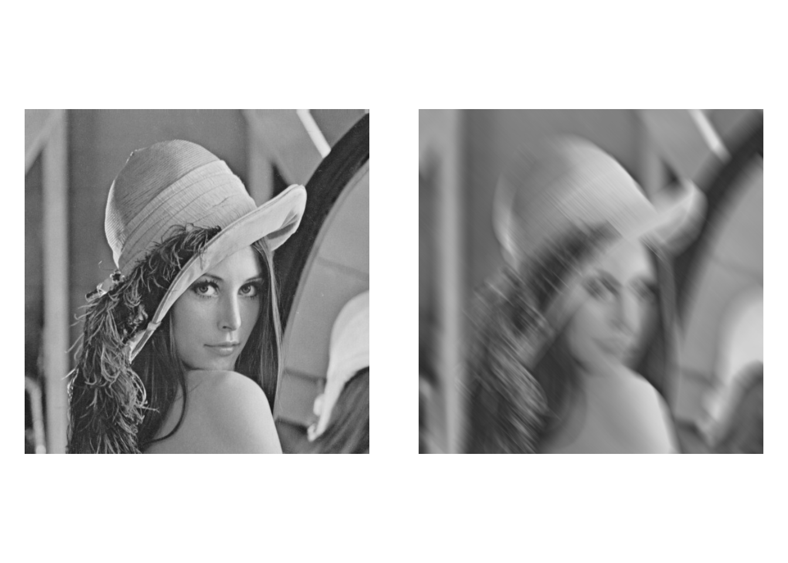


### 运动模糊图像的PSF

线性运动模糊失真的点扩展函数（PSF）是一个线段。这种PSF由两个参数指定：LEN是模糊的长度，THETA是运动的角度。


**示例**

https://zhuanlan.zhihu.com/p/55051514


``` r
#计算PSF的函数
calcPSF = function(filterSize, len, theta)
{
  #生成全黑图像h
  h = Mat(filterSize, CV_32F, Scalar(0))
  #获取h的中心点
  p = Point(filterSize$width / 2, filterSize$height / 2)
  #在h上绘制椭圆，体现出运动模糊的方向和速度（线条长度）
  cv_ellipse(h, p, Size(0,round(len/2)), 90-theta,0,360,Scalar(255),-1)
  #h中各像素值均一化（转化为R语言的矩阵操作）
  h_mat = h$cv2r()
  h_mat = h_mat / sum(h_mat)
  # cv.imdisplay(h)
  #将PSF计算结果保存在outputImg输出参数中
  outputImg = Mat(nrow(h_mat),ncol(h_mat),CV_32F)
  outputImg$r2cv(h_mat)
  outputImg
}
fftshift = function(inputImg)
{
  #生成inputImg的克隆体outputImg
  outputImg = inputImg$clone()
  #cv.imshow('ori',outputImg)
  #获取outputImg的基本信息
  outputImg_info = rcv_matInfo(outputImg)
  #获取outputImg的中心点坐标(cx,cy)
  cx = outputImg_info$width / 2
  cy = outputImg_info$height / 2
 
  #将outputImg转化为R语言的矩阵
  outputImg_mat = outputImg$cv2r()
  #依据中心点行、列位置为水平轴和竖直轴，将outputImg.mat划分为四个区域
  #q1为左上区域
  q1 = outputImg_mat[1:cy,1:cx]
  #q2为左下区域
  q2 = outputImg_mat[(cy+1):(2*cy),1:cx]
  #q3为右下区域
  q3 = outputImg_mat[(cy+1):(2*cy),(cx+1):(2*cx)]
  #q4为右上区域
  q4 = outputImg_mat[1:cy,(cx+1):(2*cx)]

  #频谱中心化
  #先交换q1与q3
  outputImg_mat[1:cy,1:cx] = q3
  outputImg_mat[(cy+1):(2*cy),(cx+1):(2*cx)] = q1
  #再交换q2与q4
  outputImg_mat[1:cy,(cx+1):(2*cx)] = q2
  outputImg_mat[(cy+1):(2*cy),1:cx] = q4

  # outputImg = Mat(nrow(outputImg_mat),ncol(outputImg_mat),as.numeric(attr(outputImg_mat,"type")))
  outputImg$r2cv(outputImg_mat)
  outputImg
}

#进行维纳滤波
filter2DFreq = function(inputImg, H)
{
  #获取inputImg的基本信息
  inputImg_info = rcv_matInfo(inputImg)
  
  #生成列表planes：
  #第1个元素为inputImg的浮点数类型克隆体，
  #第2个元素为32位浮点数单通道全0矩阵，尺寸与inputImg相同
  planes = stdVecOfMat()
  m1 = inputImg$clone()
  m1$convertTo(m1,CV_32F)
  planes$push_back(m1)
  planes$push_back(Mat_zeros(inputImg_info$height, inputImg_info$width, CV_32F))
  
  #合并planes包含的两个矩阵，结果保存在complexI中
  complexI = Mat()
  cv_merge(planes, complexI)
  #对complexI进行离散傅里叶变换，结果仍保存在complexI中
  cv_dft(complexI, complexI, DFT_SCALE)
  
  #获取H的基本信息
  H_info = rcv_matInfo(H)
  
  #生成列表planesH：
  #第1个元素为H的浮点数类型克隆体，
  #第2个元素为32位浮点数单通道全0矩阵，尺寸与H相同
  planesH = stdVecOfMat()
  m1 = H$clone()
  m1$convertTo(m1,CV_32F)
  planesH$push_back(m1)
  planesH$push_back(Mat_zeros(H_info$height, H_info$width, CV_32F))
  #合并planesH包含的两个矩阵，结果保存在complexH中
  complexH = Mat()
  cv_merge(planesH, complexH)
  
  #complexI和complexH保留的傅里叶频谱相乘，结果保存在complexIH中
  complexIH = Mat()
  cv_mulSpectrums(complexI, complexH, complexIH, 0)
  
  #对complexIH进行逆离散傅里叶变换，结果仍保存在complexIH中
  cv_idft(complexIH, complexIH)
  
  #拆分complexIH的通道，结果保存在planes中（planes会包含两个矩阵）
  cv_split(complexIH, planes)
  
  #将planes的第一个矩阵保存在输出参数outputImg.ref中
  planes[[0]]
}

#计算维纳滤波器
calcWnrFilter = function(input_h_PSF, nsr)
{
  #离散傅里叶变换频谱标准化，结果保存在h_PSF_shifted中
  h_PSF_shifted = Mat()
  h_PSF_shifted = fftshift(input_h_PSF)
  h_PSF_shifted_info = rcv_matInfo(h_PSF_shifted)
  
  #生成planes列表：
  #第1个元素为h_PSF_shifted的浮点数克隆体，
  #第2个元素为浮点数全0矩阵，尺寸与h_PSF_shifted相同
  planes = stdVecOfMat()
  m1 = h_PSF_shifted$clone()
  m1$convertTo(m1,CV_32F)
  planes$push_back(m1)
  planes$push_back(Mat_zeros(h_PSF_shifted_info$height, h_PSF_shifted_info$width, CV_32F))
  
  #合并planes列表中的两个图像矩阵，结果保存在complexI中
  complexI = Mat()
  cv_merge(planes, complexI)
  
  #对complexI进行离散傅里叶变换，结果保存在complexI
  cv_dft(complexI, complexI)
  
  #拆分planes的通道，结果保存在planes中
  cv_split(complexI, planes)
  
  #依据公式计算维纳滤波器hw，结果保存在output_G中
  plane1_mat = planes[[0]]$cv2r()
  denorm_mat = abs(plane1_mat) ^ 2
  denorm_mat = denorm_mat + nsr
  output_G_mat = plane1_mat / denorm_mat
  output_G = Mat(nrow(output_G_mat),ncol(output_G_mat),as.numeric(attr(plane1_mat, "type")))
  output_G$r2cv(output_G_mat)
  
  output_G
}

ocv_getEvenNum <- function(x){
  strtoi(paste(rev(as.integer(intToBits(x) & intToBits(-2))), collapse=""),base=2)
}

#设定PSF的长度（即速度）
LEN = 24*sqrt(2)
#设定PSF的方向，水平取0，垂直取90，右下方45度取-45
THETA = -45
#设定信噪比
snr = 45

#读取图像文件
imgIn = cv_imread("images/lenamotionblur_45.jpg",IMREAD_GRAYSCALE)
#显示原图片
cv_imshow("ori",imgIn)

#获取图片基本信息
imgIn_info = rcv_matInfo(imgIn)

#在imgIn设定感兴趣区域，保存在imgIn_roi中
roi = Rect(0,0,ocv_getEvenNum(imgIn_info$width),ocv_getEvenNum(imgIn_info$height))
imgIn_roi = Mat(imgIn,roi)

#计算PSF，结果保存在h中
h = calcPSF(Size(roi$width,roi$height),LEN,THETA)

#计算维纳滤波器，结果保存在Hw中
Hw = calcWnrFilter(h,1/snr)

#应用维纳滤波器，结果保存在imgOut中
imgOut = filter2DFreq(imgIn_roi,Hw)

#将imgOut转变为8位无浮点数类型
imgOut$convertTo(imgOut,CV_8U,1,0)
attr(imgOut,"cpptype") = "cvMat"

#将imgOut的像素值映射到[0,255]区间
cv_normalize(imgOut,imgOut,0,255,NORM_MINMAX)

#显示结果
cv_imshow("result",imgOut)
```


## 基于梯度结构张量的各向异性图像分割

在数学中，梯度结构张量（也称为二阶矩矩阵、二阶矩张量、惯性张量等）是由函数的梯度导出的矩阵。它体现了在一个点的指定邻域中梯度的主要方向，以及这些方向的相干程度（相干性）。梯度结构张量广泛应用于图像处理和计算机视觉中，用于二维/三维图像分割、运动检测、自适应滤波、局部图像特征检测等。

各向异性图像的重要特征包括局部各向异性的方向性和相干性。本文将介绍如何估计方向和相干度，以及如何用梯度结构张量分割具有单个局部方向的各向异性图像。

图像的梯度结构张量是一个2x2对称矩阵。梯度结构张量的特征向量表示局部方向，而特征值则表示相干（一种各向异性的度量）。

图像Z的梯度结构张量J可以写成：

$$
J = \left[ \begin{matrix} J_{11}&J_{12} \\ J_{12}&J_{22} \end{matrix} \right]
$$

其中：$J_{11}=M[Z_x^2]$，$J_{22}=M[Z_y^2]$，$J_{12}=M[Z_xZ_y]$

M[]是数学期望的符号（我们可以将此操作视为窗口w中的平均值），Zx和Zy是图像Z相对于x和y的偏导数。M[]是数学期望的符号（我们可以将此操作视为窗口w中的平均值），Zx和Zy是图像Z相对于x和y的偏导数。

张量的特征值可以在下面的公式中找到：

$$
\lambda_{1,2}=J_{11}+J_{22} \pm \sqrt {(J_{11}-J_{22})^2+4J_{12}^2}
$$

其中，$λ_1$-最大特征值，$λ_2$-最小特征值。

如何利用梯度结构张量估计各向异性图像的方向性和相干性？

各向异性图像的方向：

$$
\alpha = 0.5 arctg \frac{2J_{12}}{J_{22}-J_{11}} 
$$

相干性：

$$
C = \frac{\lambda_1-\lambda_2}{\lambda_1+\lambda_2}
$$

**示例**


``` r
#计算梯度结构张量函数
calcGST = function(inputImg,w)
{
  #将inputImg转变为32位浮点数类型，结果保存在img中
  img = Mat()
  inputImg$convertTo(img, CV_32F, 1, 0)
  
  #GST components calculation (start)
  #J =  (J11 J12; J12 J22) - GST
  imgDiffX = Mat()
  cv_Sobel(img, imgDiffX, CV_32F, 1, 0, 3)
  
  imgDiffY = Mat()
  cv_Sobel(img, imgDiffY, CV_32F, 0, 1, 3)
  
  imgDiffXY = Mat()
  cv_multiply(imgDiffX, imgDiffY, imgDiffXY)
  
  imgDiffXX = Mat()
  cv_multiply(imgDiffX, imgDiffX, imgDiffXX)
  
  imgDiffYY = Mat()
  cv_multiply(imgDiffY, imgDiffY, imgDiffYY)
  
  #GST components: J11
  J11 = Mat()
  cv_boxFilter(imgDiffXX, J11, CV_32F, Size(w, w))
  
  #GST components: J22
  J22 = Mat()
  cv_boxFilter(imgDiffYY, J22, CV_32F, Size(w, w))
  
  #GST components: J12
  J12 = Mat()
  cv_boxFilter(imgDiffXY, J12, CV_32F, Size(w, w))
  # GST components calculation (stop)
  
  # eigenvalue calculation (start)
  # lambda1 = J11 + J22 + sqrt((J11-J22)^2 + 4*J12^2)
  # lambda2 = J11 + J22 - sqrt((J11-J22)^2 + 4*J12^2)
  tmp1 = Mat()
  cv_add(J11, J22, tmp1)
  
  tmp2 = Mat()
  cv_subtract(J11, J22, tmp2)
  cv_multiply(tmp2, tmp2, tmp2)
  
  tmp3 = Mat()
  cv_multiply(J12, J12, tmp3)
  
  tmp4 = Mat()
  cv_scaleAdd(tmp3, 4.0, tmp2, tmp4)
  cv_sqrt(tmp4, tmp4)
  
  
  lambda1 = Mat() # biggest eigenvalue
  cv_addWeighted(tmp1, 0.5, tmp4, 0.5, 0, lambda1)
  lambda2 = Mat()  # smallest eigenvalue
  cv_addWeighted(tmp1,0.5, tmp4,-0.5,0, lambda2)
  
  # eigenvalue calculation (stop)
  # Coherency calculation (start)
  # Coherency = (lambda1 - lambda2)/(lambda1 + lambda2)) - measure of anisotropism
  # Coherency is anisotropy degree (consistency of local orientation)
  lambda1Minus2 = Mat()
  lambda1Plus2 = Mat()
  cv_subtract(lambda1, lambda2, lambda1Minus2)
  cv_add(lambda1, lambda2, lambda1Plus2)
  imgCoherencyOut = Mat()
  cv_divide(lambda1Minus2, lambda1Plus2, imgCoherencyOut)
  # Coherency calculation (stop)
  # orientation angle calculation (start)
  # tan(2*Alpha) = 2*J12/(J22 - J11)
  # Alpha = 0.5 atan2(2*J12/(J22 - J11))
  J22Minus11 = Mat()
  J12Scale2 = Mat()
  cv_subtract(J22, J11, J22Minus11)
  J12$convertTo(J12Scale2, -1, 2, 0)
  imgOrientationOut = Mat()
  cv_phase(J22Minus11, J12Scale2, imgOrientationOut, TRUE)
  cv_addWeighted(imgOrientationOut,0.5,imgOrientationOut,0,0,imgOrientationOut)
  list(imgCoherencyOut,imgOrientationOut)
}


W = 52            # window size is WxW
C_Thr = 0.43    # threshold for coherency
LowThr = 35        # threshold1 for orientation, it ranges from 0 to 180
HighThr = 57       # threshold2 for orientation, it ranges from 0 to 180
# imgCoherency.ref = encloseRef(cv.mat.Mat01())
# imgOrientation.ref = encloseRef(cv.mat.Mat01())
imgIn = cv_imread("images/gst_input.jpg",IMREAD_GRAYSCALE)
# res = calcGST(imgIn, imgCoherency.ref, imgOrientation.ref, W)
res = calcGST(imgIn, W)
imgCoherency = res[[1]]
imgOrientation = res[[2]]

imgCoherency_mat = imgCoherency$cv2r()
imgCoherencyBin_mat = as.numeric(imgCoherency_mat > C_Thr) * 255
dim(imgCoherencyBin_mat) = dim(imgCoherency_mat)
imgCoherencyBin = Mat(nrow(imgCoherencyBin_mat),ncol(imgCoherencyBin_mat),CV_8UC1)
imgCoherencyBin$r2cv(imgCoherencyBin_mat)

imgOrientationBin = Mat()
cv_inRange(imgOrientation,
           Scalar(LowThr),
           Scalar(HighThr),
           imgOrientationBin)

imgBin = Mat()
cv_bitwise_and(imgCoherencyBin,imgOrientationBin,imgBin)

cv_normalize(imgCoherency, imgCoherency, 0, 255, NORM_MINMAX,CV_8U)
cv_normalize(imgOrientation, imgOrientation, 0, 255, NORM_MINMAX,CV_8U)

result = Mat()
cv_addWeighted(imgIn, 0.5, imgBin, 0.5, 0, result)
cv_imshow("result", result)
cv_imshow("Coherency", imgCoherency)
cv_imshow("Orientation", imgOrientation)
```


## 周期去噪滤波器

**示例**


``` r
fftshift = function(inputImg)
{
    outputImg = inputImg$clone()
    outputImg_info = rcv_matInfo(outputImg)
    cx = outputImg_info$width / 2
    cy = outputImg_info$height / 2
    q0 = Mat(outputImg, Rect(0, 0, cx, cy))
    q1 = Mat(outputImg, Rect(cx, 0, cx, cy))
    q2 = Mat(outputImg, Rect(0, cy, cx, cy))
    q3 = Mat(outputImg, Rect(cx, cy, cx, cy))
    
    tmp = Mat()
    q0$copyTo(tmp)
    q3$copyTo(q0)
    tmp$copyTo(q3)
    
    q1$copyTo(tmp)
    q2$copyTo(q1)
    tmp$copyTo(q2)
    
    outputImg
}
filter2DFreq =function(inputImg, H)
{
  inputImg_info = rcv_matInfo(inputImg)

  planes = stdVecOfMat()
  m1 = inputImg$clone()
  m1$convertTo(m1,CV_32F)
  planes$push_back(m1)
  planes$push_back(Mat_zeros(inputImg_info$height, inputImg_info$width, CV_32F))
    
  complexI = Mat()
  cv_merge(planes, complexI)
  cv_dft(complexI, complexI, DFT_SCALE)
    
  H_info = rcv_matInfo(H)
  planesH = stdVecOfMat()
  m1 = H$clone()
  m1$convertTo(m1,CV_32F)
  planesH$push_back(m1)
  planesH$push_back(Mat_zeros(H_info$height, H_info$width, CV_32F))
  
  complexH = Mat()
  cv_merge(planesH, complexH)
  complexIH = Mat()
  cv_mulSpectrums(complexI, complexH, complexIH, 0)
  
  cv_idft(complexIH, complexIH)
  cv_split(complexIH, planes)
  planes[[0]]
}
synthesizeFilterH = function(inputOutput_H, center, radius)
{
  # inputOutput_H = inputOutput_H.ref$name[[1]]
  inputOutput_H_info = rcv_matInfo(inputOutput_H)
  c2 = center
  c3 = center
  c4 = center
  c2$y = inputOutput_H_info$height - center$y
  c3$x = inputOutput_H_info$width - center$x
  c4 = Point(c3$x,c2$y)
  cv_circle(inputOutput_H, center, radius, Scalar(0), -1, 8)
  cv_circle(inputOutput_H, c2, radius, Scalar(0), -1, 8)
  cv_circle(inputOutput_H, c3, radius, Scalar(0), -1, 8)
  cv_circle(inputOutput_H, c4, radius, Scalar(0), -1, 8)
  
  # inputOutput_H.ref$name[[1]] = inputOutput_H
}
# Function calculates PSD(Power spectrum density) by fft with two flags
# flag = 0 means to return PSD
# flag = 1 means to return log(PSD)
calcPSD = function(inputImg, outputImg.ref, flag=0)
{
  inputImg_info = rcv_matInfo(inputImg)
  planes = stdVecOfMat()
  m1 = inputImg$clone()
  m1$convertTo(m1,CV_32F)
  planes$push_back(m1)
  planes$push_back(Mat_zeros(inputImg_info$height,inputImg_info$width, CV_32F))
  
  complexI = Mat()
  cv_merge(planes, complexI)
  cv_dft(complexI, complexI)
  planes.ref = encloseRef(list())
  cv_split(complexI, planes)            
  planes1_mat = planes[[0]]$cv2r()
  planes2_mat = planes[[1]]$cv2r()
  planes1_mat[1,] = 0
  planes2_mat[1,] = 0
  planes[[0]]$r2cv(planes1_mat)
  planes[[1]]$r2cv(planes2_mat)
  # compute the PSD = sqrt(Re(DFT(I))^2 + Im(DFT(I))^2)^2
  imgPSD = Mat()
  cv_magnitude(planes[[0]], planes[[1]], imgPSD)        #imgPSD = sqrt(Power spectrum density)
  cv_pow(imgPSD, 2, imgPSD)                         #it needs ^2 in order to get PSD
  imgPSD_mat = imgPSD$cv2r()
  imgPSD_type = attr(imgPSD_mat,"type")

  if (flag)
  {
    imgPSD_mat = log(imgPSD_mat+1)
  }
  outputImg = Mat(nrow(imgPSD_mat),ncol(imgPSD_mat),imgPSD_type)
  outputImg$r2cv(imgPSD_mat)
  outputImg
}

imgIn = cv_imread("images/period_input1.jpg",IMREAD_GRAYSCALE)
imgIn$convertTo(imgIn,CV_32F,1,0)

imgIn_info = rcv_matInfo(imgIn)
newRows = ocv_getEvenNum(imgIn_info$height)
newCols = ocv_getEvenNum(imgIn_info$width)
roi = Rect(0,0,newCols,newRows)
imgIn = Mat(imgIn,roi)

imgPSD = calcPSD(imgIn,1)
imgPSD = fftshift(imgPSD)
cv_normalize(imgPSD,imgPSD,0,255,NORM_MINMAX,CV_8U)

H = Mat(roi$height,roi$width,CV_32F,Scalar(1))
r = 21
synthesizeFilterH(H,Point(143,67),r)
synthesizeFilterH(H,Point(286,0),r)
synthesizeFilterH(H,Point(0,135),r)

imgOut = filter2DFreq(imgIn,H)

imgOut$convertTo(imgOut,CV_8U,1,0)
attr(imgOut,"cpptype") = "cvMat"
cv_normalize(imgOut,imgOut,0,255,NORM_MINMAX)
cv_imshow("result",imgOut)
cv_imshow("PSD",imgPSD)
cv_normalize(H,H,0,255,NORM_MINMAX)
cv_imshow("filter",H)
```

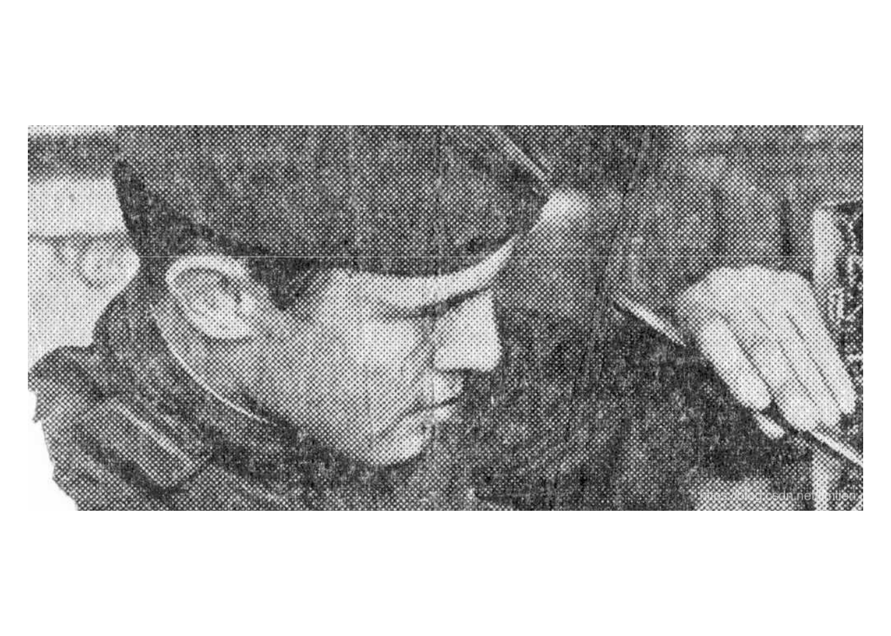


