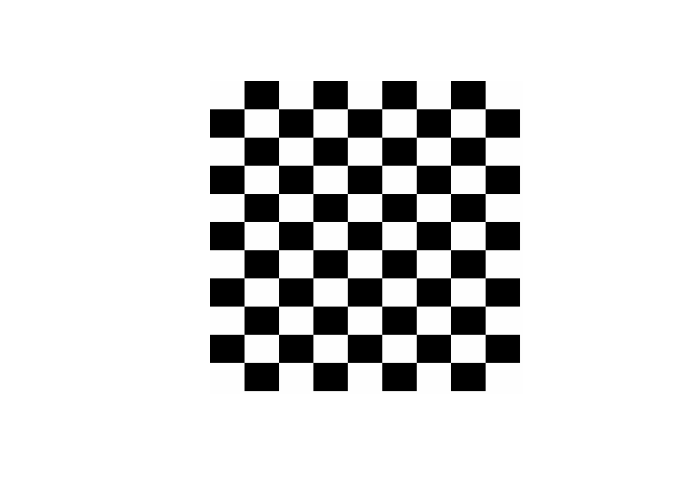
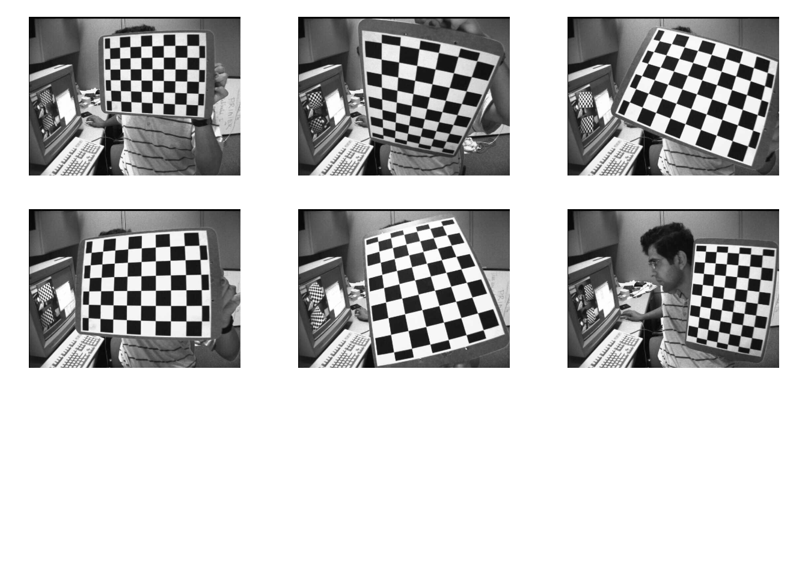
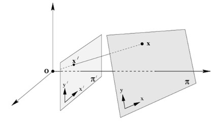

# 摄像机标定和三维重建（calib3d模块）


## 创建校准模式（绘制棋盘格）

不使用图像矩阵，直接在R语言中绘制


``` r
#设置棋盘宽度
w = 600
#设置棋盘高度
h = 600
#设置横向内连接交错点
ptsnum_horiz = 7
#设置纵向内连接交错点
ptsnum_vert = 9
#计算每个棋盘单元格的宽度和高度
cell_w = floor(w/(ptsnum_horiz+2))
cell_h = floor(h/(ptsnum_vert+2))

#生成空图
plot(0:h,type="n",xlim=c(0,w),ylim=c(0,h),bty="n",
     xlab="",ylab="",xaxt="n",yaxt="n")

#isWhite为T时，棋盘单元格为白色，否则为黑色
isWhite = T
for(i in 1:(ptsnum_horiz+2)){
  for(j in 1:(ptsnum_vert+2)){
    #通过循环绘制各个单元格
    rect((i-1)*cell_w,(j-1)*cell_h,i*cell_w,j*cell_h,
         col=ifelse(isWhite,"white","black"),border="white")
    isWhite = !isWhite
  }
  if(ptsnum_vert %% 2 == 0){
    #当纵向内连接交错点为偶数时，需要切换单元格颜色状态
    isWhite = !isWhite
  }
}
```


使用图像矩阵：


``` r
#设置棋盘宽度
w = 600
#设置棋盘高阿杜
h = 600
#设置横向内连接交错点
ptsnum_horiz = 7
#设置纵向内连接交错点
ptsnum_vert = 9
#计算每个棋盘单元格的宽度和高度
cell_w = floor(w/(ptsnum_horiz+2))
cell_h = floor(h/(ptsnum_vert+2))

#生成全白图像矩阵
img = Mat(h,w,CV_8UC1,Scalar(255))

#isWhite为T时，棋盘单元格为白色，否则为黑色
isWhite = T
for(i in 1:(ptsnum_horiz+2)){
  for(j in 1:(ptsnum_vert+2)){
    #通过循环绘制各个单元格
    rct = Rect((i-1)*cell_w,(j-1)*cell_h,cell_w,cell_h)
    if(isWhite){
      cv_rectangle(img,rct,Scalar(255),-1)
    }else{
      cv_rectangle(img,rct,Scalar(0),-1)
    }
    isWhite = !isWhite
  }
  if(ptsnum_vert %% 2 == 0){
    #当纵向内连接交错点为偶数时，需要切换单元格颜色状态
    isWhite = !isWhite
  }
}
cv_imshow('img',img)
```


``` r
cv_destroyAllWindows()
matImgPlot(img)
```




## 方棋盘摄像机标定


**示例**

基于以下方棋盘图像进行相机标定：




``` r
#棋盘横向角点个数（即棋盘每行上黑色棋盘格之间的交点数）
ptsnum_perrow = 6
#棋盘纵向角点个数（即棋盘每列上黑色棋盘格之间的交点数）
ptsnum_percolumn = 9

#obj_world_pts各个角点的三维坐标：形如(0,0,0), (1,0,0),..., (8,5,0)
obj_world_pts = stdVecOfPoint3f()
for(x in 0:(ptsnum_perrow-1)){
  for(y in 0:(ptsnum_percolumn-1)){
    obj_world_pts$push_back(Point3f(y,x,0))
  }
}

#指定棋盘文件的路径以及棋盘文件名称
image_path = "images/calib"
imgfiles = list.files(image_path)

#对于每个棋盘图像文件，若能找寻到角点，则将其依次存入img_points列表中
img_points = stdVecOfVecOfPoint2f()

#对于每个棋盘图像文件，若能找寻到角点，则将其对应的三维坐标(obj_world_pts)存入obj_points中
obj_points = stdVecOfVecOfPoint3f()
# obj_points$push_back(obj_world_pts)

#迭代终止条件，用于寻找亚像素级别的角点
criteria = TermCriteria(EPS+MAX_ITER,30,0.001)


#循环处理每个棋盘文件    
for(i in 1:length(imgfiles)){
  #读取图像文件
  if(!file.exists(paste0(image_path,"/",imgfiles[i]))) next
  img = cv_imread(paste0(image_path,"/",imgfiles[i]),IMREAD_GRAYSCALE)
  #检测棋盘角点
  img_corner_points = stdVecOfPoint2f()
  found_success = cv_findChessboardCorners(
    img,
    Size(ptsnum_percolumn,ptsnum_perrow),
    img_corner_points
  )
  
  #当检查到棋盘角点时
  if(found_success){
    #进一步取得亚像素棋盘角点
    cv_cornerSubPix(img,img_corner_points,Size(11,11),Size(-1,-1),criteria)
    
    #绘制棋盘检测结果
    cv_drawChessboardCorners(img,Size(ptsnum_percolumn,ptsnum_perrow),
                             img_corner_points,found_success)
    
    #将棋盘角点的三维坐标存入obj_points中
    obj_points$push_back(obj_world_pts)
    #将棋盘角点的二维坐标存入img_points中
    img_points$push_back(img_corner_points)
  }
  
  #显示img
  cv_imshow("image",img)
  #暂定0.2秒
  cv_waitKey(200)
}


#获取img的基本信息
img_info = rcv_matInfo(img)
#计算内参和畸变系数
cameraMatrix = Mat()
distCoeffs = Mat()
rvecs = stdVecOfMat()
tvecs = stdVecOfMat()
cv_calibrateCamera(obj_points,img_points,
                     Size(img_info$width,img_info$height),cameraMatrix,
                     distCoeffs,rvecs,tvecs)
```

```
## [1] 0.4086948
```

``` r
#查看相机内参
cameraMatrix$cv2r()
```

```
##          [,1]     [,2]     [,3]
## [1,] 536.0735   0.0000 342.3703
## [2,]   0.0000 536.0164 235.5370
## [3,]   0.0000   0.0000   1.0000
## attr(,"depth")
## [1] 6
```

``` r
#查看畸变系数
distCoeffs$cv2r()
```

```
##           [,1]        [,2]        [,3]          [,4]      [,5]
## [1,] -0.265091 -0.04673906 0.001833023 -0.0003147134 0.2523099
## attr(,"depth")
## [1] 6
```

``` r
#查看旋转向量
rvecs$size()
```

```
## [1] 13
```

``` r
for(i in 1:rvecs$size()-1){
  print(t(rvecs[[i]]$cv2r()))
}
```

```
##           [,1]      [,2]       [,3]
## [1,] 0.1685359 0.2757533 0.01346808
## attr(,"depth")
## [1] 6
##          [,1]      [,2]      [,3]
## [1,] 0.413068 0.6493452 -1.337195
## attr(,"depth")
## [1] 6
##           [,1]     [,2]      [,3]
## [1,] -0.276975 0.186891 0.3548319
## attr(,"depth")
## [1] 6
##            [,1]      [,2]         [,3]
## [1,] -0.1108228 0.2397477 -0.002135071
## attr(,"depth")
## [1] 6
##            [,1]      [,2]     [,3]
## [1,] -0.2918822 0.4282993 1.312699
## attr(,"depth")
## [1] 6
##           [,1]      [,2]     [,3]
## [1,] 0.4077295 0.3038477 1.649065
## attr(,"depth")
## [1] 6
##           [,1]      [,2]    [,3]
## [1,] 0.1794729 0.3457476 1.86847
## attr(,"depth")
## [1] 6
##             [,1]      [,2]     [,3]
## [1,] -0.09096634 0.4796589 1.753384
## attr(,"depth")
## [1] 6
##           [,1]       [,2]      [,3]
## [1,] 0.2029036 -0.4241422 0.1324556
## attr(,"depth")
## [1] 6
##            [,1]       [,2]     [,3]
## [1,] -0.4192686 -0.4999291 1.335547
## attr(,"depth")
## [1] 6
##           [,1]      [,2]     [,3]
## [1,] -0.238499 0.3477754 1.530737
## attr(,"depth")
## [1] 6
##           [,1]       [,2]     [,3]
## [1,] 0.4630161 -0.2830715 1.238604
## attr(,"depth")
## [1] 6
##            [,1]       [,2]     [,3]
## [1,] -0.1702039 -0.4713961 1.345986
## attr(,"depth")
## [1] 6
```

``` r
#查看平移向量
tvecs$size()
```

```
## [1] 13
```

``` r
for(i in 1:tvecs$size()-1){
  print(t(tvecs[[i]]$cv2r()))
}
```

```
##           [,1]     [,2]     [,3]
## [1,] -3.011184 -4.35757 15.99287
## attr(,"depth")
## [1] 6
##           [,1]     [,2]     [,3]
## [1,] -2.345513 3.319313 14.15396
## attr(,"depth")
## [1] 6
##           [,1]      [,2]    [,3]
## [1,] -1.595817 -4.016016 12.7297
## attr(,"depth")
## [1] 6
##           [,1]      [,2]     [,3]
## [1,] -3.938391 -2.692421 13.23775
## attr(,"depth")
## [1] 6
##          [,1]      [,2]     [,3]
## [1,] 2.337668 -4.612076 12.69076
## attr(,"depth")
## [1] 6
##          [,1]      [,2]     [,3]
## [1,] 6.688136 -2.622048 13.46297
## attr(,"depth")
## [1] 6
##           [,1]      [,2]     [,3]
## [1,] 0.7787992 -2.872007 15.58025
## attr(,"depth")
## [1] 6
##          [,1]     [,2]     [,3]
## [1,] 3.159943 -3.51708 12.67001
## attr(,"depth")
## [1] 6
##           [,1]      [,2]     [,3]
## [1,] -2.655485 -3.240157 11.13525
## attr(,"depth")
## [1] 6
##          [,1]      [,2]     [,3]
## [1,] 1.873802 -4.439495 13.52591
## attr(,"depth")
## [1] 6
##          [,1]      [,2]     [,3]
## [1,] 2.028546 -4.103314 12.89143
## attr(,"depth")
## [1] 6
##          [,1]      [,2]     [,3]
## [1,] 1.345899 -3.665945 11.66664
## attr(,"depth")
## [1] 6
##          [,1]      [,2]     [,3]
## [1,] 1.798558 -4.326445 12.50142
## attr(,"depth")
## [1] 6
```

``` r
library(configr)
#以yml保存到指定文件
cfg = list()
cfg$cameraMatrix = cameraMatrix$cv2r()
cfg$distCoeffs = distCoeffs$cv2r()
cfg$rvecs = sapply(1:rvecs$size()-1,function(i){t(rvecs[[i]]$cv2r())})
cfg$tvecs = sapply(1:tvecs$size()-1,function(i){t(tvecs[[i]]$cv2r())})

write.config(cfg,file.path = "data/camera.yaml", write.type = "yaml")
```

```
## [1] TRUE
```

校正图像


``` r
# img.test = cv.imread("images/calib_radial.jpg")
img_test = cv_imread("images/calib/left11.jpg")
img_test_info = rcv_matInfo(img_test)
h = img_test_info$height
w = img_test_info$width

roi = Rect()
cameraMatrix_new = cv_getOptimalNewCameraMatrix(cameraMatrix,distCoeffs,Size(w,h),1,Size(w,h),roi)

# c(x,y,w,h) %<-% roi

img_undistort = Mat()
cv_undistort(img_test,img_undistort,cameraMatrix,distCoeffs,cameraMatrix_new)

cv_imshow('undistort',img_undistort)
```


## 单应性矩阵

简单地说，平面单应关系到两个平面之间的变换（取决于一个比例因子）：

$$
s \left[ \begin{matrix} x'\\y'\\1 \end{matrix} \right] = H \left[ \begin{matrix} x\\y\\1 \end{matrix} \right] = \left[ \begin{matrix} h_{11}&h_{12}&h_{13}\\h_{21}&h_{22}&h_{23}\\h_{31}&h_{32}&h_{33} \end{matrix} \right] \left[ \begin{matrix} x\\y\\1 \end{matrix} \right]
$$ 

单应矩阵$H$是一个3x3矩阵，有8个自由度。通常，$h33=1$或者：

$$
\sum_{i,j=1,2,3} h_{ij}^2=1
$$
opencv中**cv::getPerspectiveTransform**可以获取单应矩阵：


``` r
pts1 = stdVecOfPoint2f()
pts1$push_back(Point2f(92,68))
pts1$push_back(Point2f(262,116))
pts1$push_back(Point2f(180,364))
pts1$push_back(Point2f(18,304))

#透视校正目标区域（也由四个顶点坐标构成）
pts2 = stdVecOfPoint2f()
pts2$push_back(Point2f(10,10))
pts2$push_back(Point2f(300,10))
pts2$push_back(Point2f(300,400))
pts2$push_back(Point2f(10,400))

#依据pts1和pts2进行透视变换，获得变换矩阵M
M = cv_getPerspectiveTransform(pts1,pts2)
M$cv2r()
```

```
##               [,1]         [,2]       [,3]
## [1,]  1.7129766660 5.361709e-01 -183.73102
## [2,] -0.4294580896 1.533213e+00  -54.42592
## [3,]  0.0003414828 1.218792e-05    1.00000
## attr(,"depth")
## [1] 6
```


以下示例显示了不同类型单应变换：

* 在一个相机下，真实世界平面$\pi$与与其相机成像平面$\pi'$之间的变换关系



* 在两个相机下，包含着多个变换关系：真实世界平面与每个相机各自的成像平面的之间的变换关系，两个相机成像平面之间的变换关系


* 在一个旋转相机下，真实世界中“无限远”的平面与各成像平面之间的变换关系


**示例**

透视图校正


``` r
#读取图像文件
img = cv_imread("images/notebook.jpg")

#原图像透视校正区域（由四个顶点坐标构成）
pts1 = stdVecOfPoint2f()
pts1$push_back(Point2f(92,68))
pts1$push_back(Point2f(262,116))
pts1$push_back(Point2f(180,364))
pts1$push_back(Point2f(18,304))

#透视校正目标区域（也由四个顶点坐标构成）
pts2 = stdVecOfPoint2f()
pts2$push_back(Point2f(10,10))
pts2$push_back(Point2f(300,10))
pts2$push_back(Point2f(300,400))
pts2$push_back(Point2f(10,400))

#依据pts1和pts2进行透视变换，获得变换矩阵M
M = cv_getPerspectiveTransform(pts1,pts2)
#依据M对img进行透视变换，结果保存在img.pers中
img_pers = Mat()
cv_warpPerspective(img,img_pers,M,Size(320,420))
#显示img_pers
cv_imshow("透视变换结果",img_pers)
```


**示例**

可以使用直接线性变换（DLT）算法来估计单应性。由于物体是平面的，物体帧中表示的点和投影到归一化相机帧中表示的图像平面的点之间的变换是单应的。正是因为对象是平面的，所以可以从单应性中检索相机姿势，前提是相机的内在参数已知。当使用棋盘对象和**findChessboardCorners**获得图像中角点位置时，可以很容易地测试这一点。


``` r
#棋盘横向角点个数（即棋盘每行上黑色棋盘格之间的交点数）
ptsnum_perrow = 6
#棋盘纵向角点个数（即棋盘每列上黑色棋盘格之间的交点数）
ptsnum_percolumn = 9

#obj_world_pts各个角点的三维坐标：形如(0,0,0), (1,0,0),..., (8,5,0)
obj_world_pts = stdVecOfPoint3f()
for(x in 0:(ptsnum_perrow-1)){
  for(y in 0:(ptsnum_percolumn-1)){
    obj_world_pts$push_back(Point3f(y,x,0))
  }
}

#读取相机参数
library(configr)
cfg = read.config(file="data/camera.yaml")
cameraMatrix_mat = matrix(cfg$cameraMatrix,nr=3,nc=3)
cameraMatrix = Mat(3,3,CV_64F)
cameraMatrix$r2cv(cameraMatrix_mat)
distCoeffs_mat = matrix(cfg$distCoeffs,nr=1,nc=5)
distCoeffs = Mat(1,5,CV_64F)
distCoeffs$r2cv(distCoeffs_mat)

#读取位姿估计图像文件
img = cv_imread("images/calib/left14.jpg")
#灰度化
img_gray = Mat()
cv_cvtColor(img,img_gray,COLOR_BGR2GRAY)

#寻找棋盘角点
corners = stdVecOfPoint2f()
found = cv_findChessboardCorners(img_gray, Size(ptsnum_percolumn,ptsnum_perrow), corners)

#确定迭代结束标准
criteria = TermCriteria(EPS+MAX_ITER, 30,0.001)
#确定三个数轴
# aaxis = matrix(c(3,0,0, 0,3,0, 0,0,-3),nr=3,nc=3)
obj_points_new = stdVecOfPoint3f()
obj_points_new$push_back(Point3f(3,0,0))
obj_points_new$push_back(Point3f(0,3,0))
obj_points_new$push_back(Point3f(0,0,-3))
if(found){
  #寻找亚像素棋盘角点
  cv_cornerSubPix(img_gray,corners,Size(11,11),Size(-1,-1),criteria)
  
  #计算旋转向量和平移向量
  rvecs = Mat()
  tvecs = Mat()
  cv_solvePnPRansac(obj_world_pts,corners,cameraMatrix,distCoeffs,rvecs,tvecs)
  
  #将真实三维点投影到对应的图像平面上
  imgpts = stdVecOfPoint2f()
  cv_projectPoints(obj_points_new,rvecs,tvecs,cameraMatrix,distCoeffs,imgpts)
  
  cv_line(img,Point(corners[[0]]$x,corners[[0]]$y),Point(imgpts[[0]]$x,imgpts[[0]]$y),Scalar(255,0,0),5)
  cv_line(img,Point(corners[[0]]$x,corners[[0]]$y),Point(imgpts[[1]]$x,imgpts[[1]]$y),Scalar(0,255,0),5)
  cv_line(img,Point(corners[[0]]$x,corners[[0]]$y),Point(imgpts[[2]]$x,imgpts[[2]]$y),Scalar(0,0,255),5)
}

cv_imshow('img',img)
```

进一步，可以基于姿态估计结果渲染立方体：


``` r
#棋盘横向角点个数（即棋盘每行上黑色棋盘格之间的交点数）
ptsnum_perrow = 6
#棋盘纵向角点个数（即棋盘每列上黑色棋盘格之间的交点数）
ptsnum_percolumn = 9

#obj_world_pts各个角点的三维坐标：形如(0,0,0), (1,0,0),..., (8,5,0)
obj_world_pts = stdVecOfPoint3f()
for(x in 0:(ptsnum_perrow-1)){
  for(y in 0:(ptsnum_percolumn-1)){
    obj_world_pts$push_back(Point3f(y,x,0))
  }
}

library(configr)
cfg = read.config(file="data/camera.yaml")
cameraMatrix_mat = matrix(cfg$cameraMatrix,nr=3,nc=3)
cameraMatrix = Mat(3,3,CV_64F)
cameraMatrix$r2cv(cameraMatrix_mat)
distCoeffs_mat = matrix(cfg$distCoeffs,nr=1,nc=5)
distCoeffs = Mat(1,5,CV_64F)
distCoeffs$r2cv(distCoeffs_mat)


#读取位姿估计图像文件
img = cv_imread("images/calib/left14.jpg")
#灰度化
img_gray = Mat()
cv_cvtColor(img,img_gray,COLOR_BGR2GRAY)

#寻找棋盘角点
corners = stdVecOfPoint2f()
found = cv_findChessboardCorners(img_gray, Size(ptsnum_percolumn,ptsnum_perrow), corners)

#确定迭代结束标准
criteria = TermCriteria(EPS+MAX_ITER, 30,0.001)

#确定三个数轴
# aaxis = matrix(c(0,0,0, 0,3,0, 3,3,0, 3,0,0, 0,0,-3, 0,3,-3, 3,3,-3, 3,0,-3),nc=3,byrow=T)
obj_points_new = stdVecOfPoint3f()
obj_points_new$push_back(Point3f(0,0,0))
obj_points_new$push_back(Point3f(0,3,0))
obj_points_new$push_back(Point3f(3,3,0))
obj_points_new$push_back(Point3f(3,0,0))
obj_points_new$push_back(Point3f(0,0,-3))
obj_points_new$push_back(Point3f(0,3,-3))
obj_points_new$push_back(Point3f(3,3,-3))
obj_points_new$push_back(Point3f(3,0,-3))
if(found){
  #寻找亚像素棋盘角点
  cv_cornerSubPix(img_gray,corners,Size(11,11),Size(-1,-1),criteria)
  
  #计算旋转向量和平移向量
  rvecs = Mat()
  tvecs = Mat()
  cv_solvePnPRansac(obj_world_pts,corners,cameraMatrix,distCoeffs,rvecs,tvecs)
  
  #将真实三维点投影到对应的图像平面上
  imgpts = stdVecOfPoint2f()
  cv_projectPoints(obj_points_new,rvecs,tvecs,cameraMatrix,distCoeffs,imgpts)
  
  #绘制绿色底面
  cnt1 = stdVecOfVecOfPoint()
  pnt1 = stdVecOfPoint()
  for(i in 0:3){
    pnt1$push_back(Point(imgpts[[i]]$x,imgpts[[i]]$y))
  }
  cnt1$push_back(pnt1)
  cv_drawContours(img,cnt1,-1,Scalar(0,255,0),-1)
  
  #绘制蓝色柱子
  cnt2 = stdVecOfVecOfPoint()
  pnt2 = stdVecOfPoint()
  for(i in 4:7){
    pnt2$push_back(Point(imgpts[[i]]$x,imgpts[[i]]$y))
  }
  cnt2$push_back(pnt2)
  
  for(i in 0:3){
    cv_line(img,pnt1[[i]],pnt2[[i]],Scalar(255,0,0),3)
  }
  #绘制红色顶面
  cv_drawContours(img,cnt2,-1,Scalar(0,0,255),3)
}

cv_imshow('img',img)
```


**示例**

基于单应矩阵融合如下两个图像：


``` r
#读取待植入广告牌的文件
img1 = cv_imread("images/catoon.jpg")
#读取广告牌文件
img2 = cv_imread("images/advert.jpg")

#获取img1和img2的基本信息
img1_info = rcv_matInfo(img1)
img2_info = rcv_matInfo(img2)

#对img1进行边缘扩充，使其尺寸与img2保持一致
cv_copyMakeBorder(img1,img1,
                  0,img2_info$height-img1_info$height,
                  0,img2_info$width-img1_info$width,
                  BORDER_CONSTANT
                 )

#列表pts1包含img1边界上的四个顶点坐标
pts1 = stdVecOfPoint2f()
pts1$push_back(Point2f(0,0))
pts1$push_back(Point2f(img1_info$width,0))
pts1$push_back(Point2f(img1_info$width,img1_info$height))
pts1$push_back(Point2f(0,img1_info$height))

#列表pts2包含着广告牌上某区域的四个顶点坐标——该区域就是img1的植入区域
pts2 = stdVecOfPoint2f()
pts2$push_back(Point2f(190,100))
pts2$push_back(Point2f(390,120))
pts2$push_back(Point2f(380,414))
pts2$push_back(Point2f(180,440))

#依据pts1和pts2计算单应矩阵M
M = cv_findHomography(pts1,pts2)

#对img1进行单应变换，结果保存在dst中
dst = Mat()
cv_warpPerspective(img1,dst,M,Size(0,0))

#对dst线进行灰度化，然后进行二值化，形成遮罩矩阵mask
dst_gray = Mat()
cv_cvtColor(dst,dst_gray,COLOR_BGR2GRAY)
mask = Mat()
cv_threshold(dst_gray,mask,0,255,THRESH_BINARY)
```

```
## [1] 0
```

``` r
#将dst中在遮罩mask下的图像内容复制img2中
dst$copyTo(img2,mask)

#显示植入结果
cv_imshow('融合效果',img2)
```


