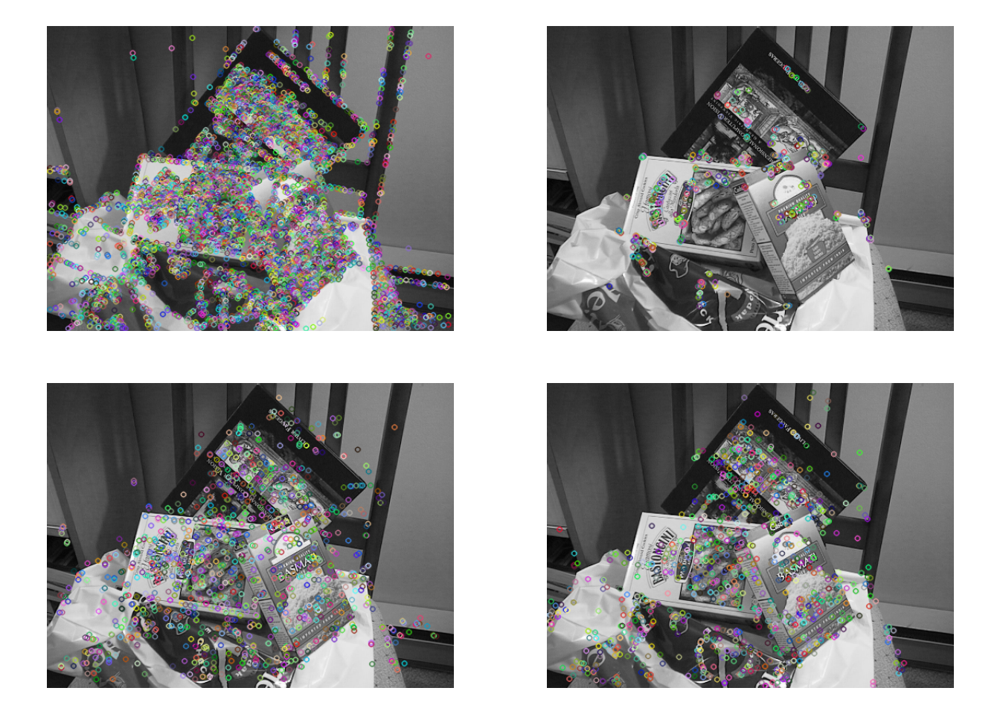
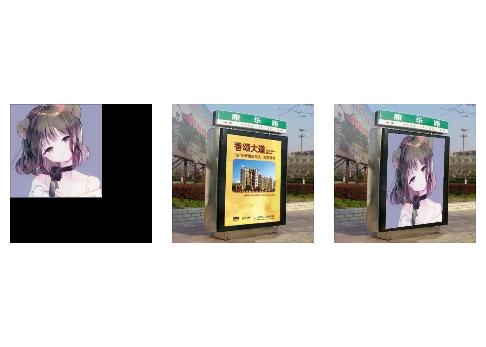
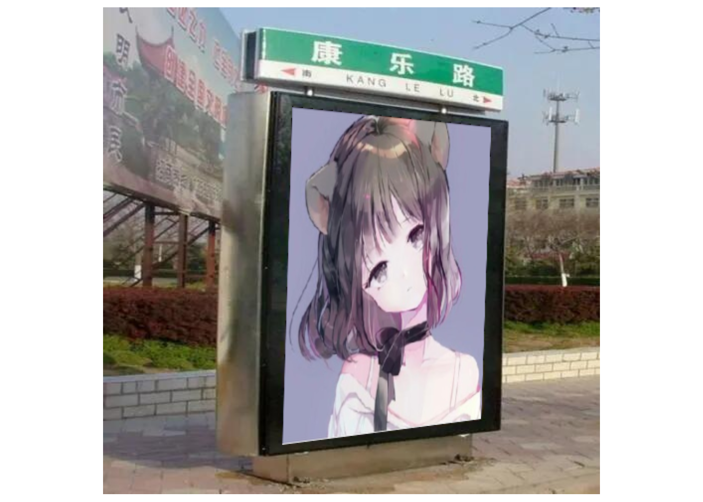
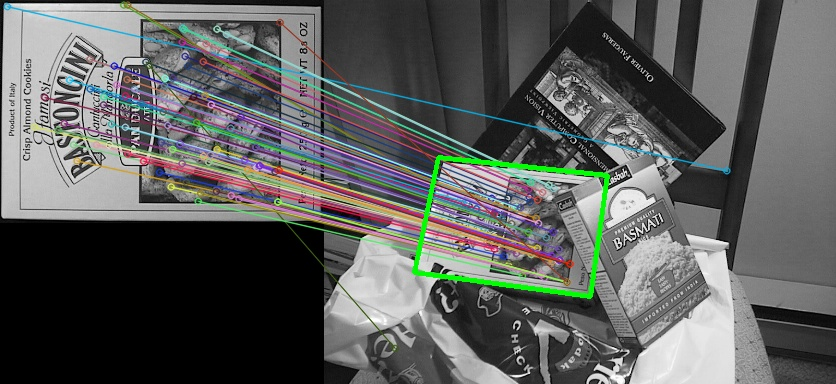
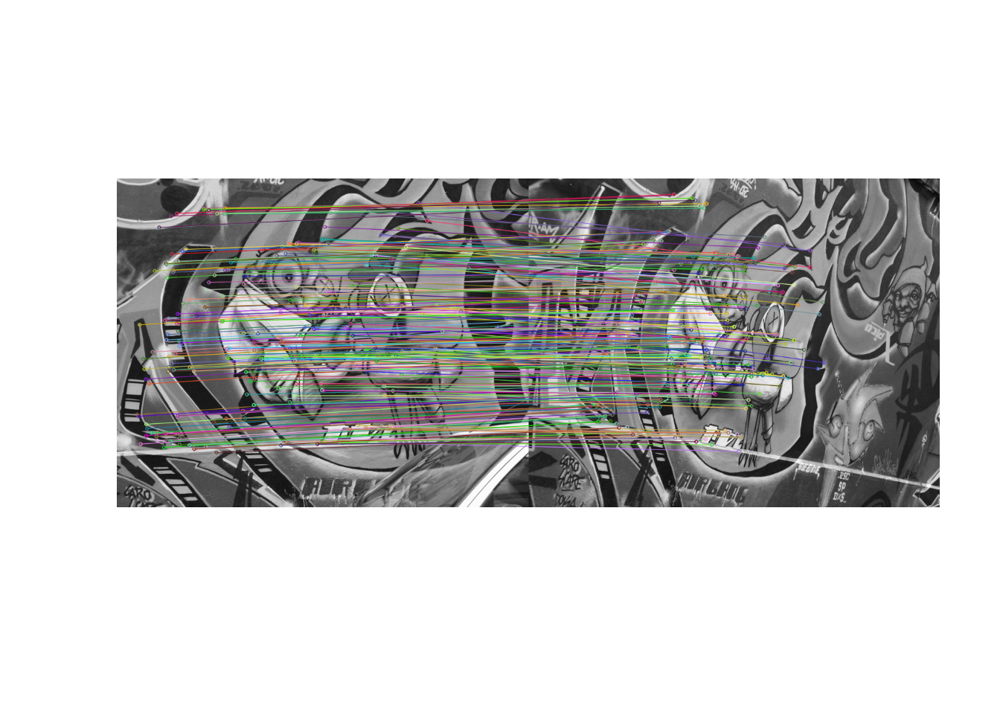
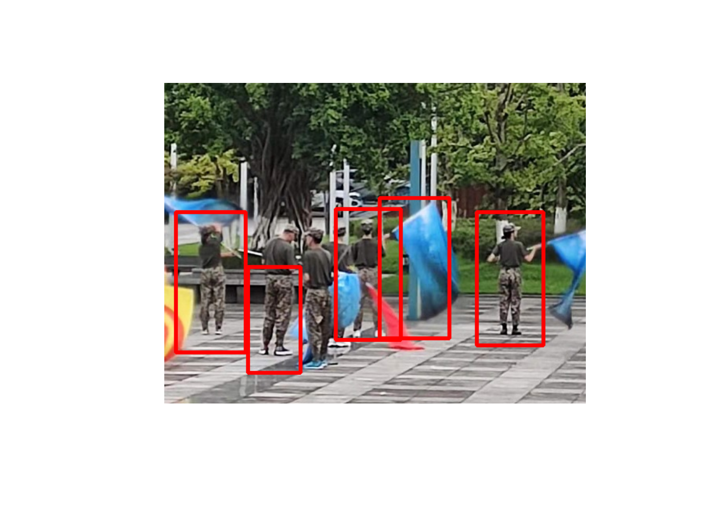

# 2D特征框架（feature2d模块）


一幅图像中总存在着其独特的像素点，这些点可以被认为是这幅图像的特征，常称之为特征点。在计算机视觉领域中，特征点概念已经得到了广泛的应用， 包括目标识别、 图像配准、 视觉跟踪、 三维重建等。 

特征点中包含角点和关键点。其中角点的数学描述，包含如下有几种：

* 一阶导数(即灰度的梯度)的局部最大所对应的像素点；
* 两条及两条以上边缘的交点；
* 图像中梯度值和梯度方向的变化速率都很高的点；
* 角点处的一阶导数最大，二阶导数为零，指示物体边缘变化不连续的方向。

较之于角点，关键点是更加抽象的概念，一般而言指的是对于图像分析问题起着重要作用的点。在提取关键点时，边缘应该作为一个重要的参考依据，但一定不是唯一的依据，只要对分析特定问题有帮助的点都可以称其为关键点。

基于特征点可以做图像匹配，即寻找两幅图像之间的特征点的对应关系，进而确定两幅图像的一些空间位置关系。特征点匹配的大致步骤为：

1、检测子（detector）提取：在两张待匹配的图像中寻找那些最容易识别的像素点(角点)，比如纹理丰富的物体边缘点等。其提取方法有SIFT算法、Harris算法、FAST算法。  
2、描述子（descriptor）提取：对于检测出的角点，用一些数学上的特征对其进行描述，如梯度直方图，局部随机二值特征等。其提取算法有邻域模板匹配、SIFT特征描述子、ORB特征描述子。  
3、匹配：通过各个角点的描述子来判断它们在两张图像中的对应关系。常用方法有暴力匹配、KD树等。

## 角点检测基本思想 

确定一个尺寸固定的滤波器$W$并放置在图像上，而后沿任意方向滑动$W$，并计算滑动前后滤波器覆盖像素的滤波输出值。如果在任意方向上滤波器滑动前后的两个滤波输出值都有着较大变化，那么可以认为滤波器在滑动前所覆盖的图像区域中存在角点。

在OpenCV中，将滤波器滑动前后的两个滤波输出值的变化转变为角点响应值，角点响应值计算公式的大致推导过程如下：

考虑灰度图像$I$和滤波器$W$，其锚点位置为$(anchor_x,anchor_y)$，滤波器$W$在图像$I$上沿$x$方向移动$u$个像素，沿$y$方向移动$v$个像素，则移动前后滤波器覆盖范围的像素加权和分别为：

$$
\sum_{x,y}w(x,y) I(x,y)
$$

$$
\sum_{x,y}w(x,y) I(x+u,y+v)
$$

其中：  

* $w(x,y)$是滤波器$W$覆盖在$(x,y)$点上的权重值
* $I(x,y)$是$(x,y)$处的强度值
* $I(x+u,y+v)$是移动窗口处$(x+u,y+v)$的强度值

定义$E(u,v)$为：

$$
E(u,v) = \sum_{x,y}w(x,y) \left[ I(x+u,y+v)-I(x,y) \right]^2
$$ 

为了找寻角点，需要找寻强度变化很大的窗口，也即需要最大化上述方程，特别是如下部分：

$$
\sum_{x,y}\left[ I(x+u,y+v)-I(x,y) \right]^2
$$

对其进行泰勒展开：

$$
\sum_{x,y}\left[ I(x+u,y+v)-I(x,y) \right]^2 \approx \sum_{x,y} \left[ I(x,y) +uI_x+vI_y-I(x,y) \right]^2
$$ 

展开公式并适当取消：

$$
\sum_{x,y}\left[ I(x+u,y+v)-I(x,y) \right]^2 \approx u^2I_x^2+2uvI_xI_y+v^2I_y^2= [u \; v] \left(  \left[ \begin{matrix} I_x^2&I_xI_y \\I_xI_y&I_y^2 \end{matrix} \right] \right) \left[ \begin{matrix} u \\ v \end{matrix} \right]
$$

所以：

$$
E(u,v) \approx [u \; v] \left( \sum_{x,y} w(x,y) \left[ \begin{matrix} I_x^2&I_xI_y \\I_xI_y&I_y^2 \end{matrix} \right] \right) \left[ \begin{matrix} u \\ v \end{matrix} \right]
$$ 

令：

$$
M = \sum_{x,y} w(x,y) \left[ \begin{matrix} I_x^2&I_xI_y \\I_xI_y&I_y^2 \end{matrix} \right]
$$

***这里的$M$也被称为导数协方差矩阵。***

则有：

$$
E(u,v) \approx [u \; v] M \left[ \begin{matrix} u \\ v \end{matrix} \right]
$$

进一步，定义如下公式作为角点响应值的计算公式：

$$
\begin{aligned}
R &= det(M) - k(trace(M))^2   \\
&=I_x^2 I_y^2 - (I_x I_y)^2 - k(trace(M))^2
\end{aligned}
$$ 

其中：

* $det(M)$为$M$的行列式  
* $trace(M)$为$M$的迹  
* $k$为角点检测灵敏度系数  

当R大于某阈值时，则认为图像$I$在$(anchor_x,anchor_y)$处存在角点。

若$M$的特征值为$\lambda_1$ 和 $\lambda_2$时，则：

$$
det(M) = \lambda_1\lambda_2
$$

$$
trace(M) = \lambda_1+\lambda_2
$$

所以角点响应值的计算公式也可以是：

$$
R = \lambda_1\lambda_2 - k(\lambda_1+\lambda_2)^2
$$

## Harris角点检测器

**示例**


``` r
#生成20行20列的全0矩阵img_mat
img_mat = matrix(0,nr=20,nc=20)
#将img_mat第5行的第5-16列元素设置为255
img_mat[5,5:16] = 255
#将img_mat第5列的第5-16行元素设置为255
img_mat[5:16,5] = 255

#将img.mat转变为图像矩阵img
img = Mat(20,20,CV_8UC1)
img$r2cv(img_mat)
#设置权重窗口尺寸为2
blockSize = 2 
#设置求导内核尺寸为3
ksize = 3
#设置敏感度系数为0.04
k = 0.04

#进行角点检测，检测结果保存在dst中
dst = Mat()
cv_cornerHarris(img,dst,blockSize,ksize,k)

#查看角点检测结果
round(dst$cv2r(),2)
```

```
##       [,1] [,2] [,3]  [,4]  [,5]  [,6]  [,7]  [,8]  [,9] [,10] [,11] [,12]
##  [1,]    0    0    0  0.00  0.00  0.00  0.00  0.00  0.00  0.00  0.00  0.00
##  [2,]    0    0    0  0.00  0.00  0.00  0.00  0.00  0.00  0.00  0.00  0.00
##  [3,]    0    0    0  0.00  0.00  0.00  0.00  0.00  0.00  0.00  0.00  0.00
##  [4,]    0    0    0  0.00  0.00  0.00 -0.01 -0.01 -0.01 -0.01 -0.01 -0.01
##  [5,]    0    0    0  0.00  0.02  0.02  0.00 -0.01 -0.01 -0.01 -0.01 -0.01
##  [6,]    0    0    0  0.00  0.02  0.02  0.04 -0.01 -0.01 -0.01 -0.01 -0.01
##  [7,]    0    0    0 -0.01  0.00  0.04  0.11 -0.01 -0.01 -0.01 -0.01 -0.01
##  [8,]    0    0    0 -0.01 -0.01 -0.01 -0.01  0.00  0.00  0.00  0.00  0.00
##  [9,]    0    0    0 -0.01 -0.01 -0.01 -0.01  0.00  0.00  0.00  0.00  0.00
## [10,]    0    0    0 -0.01 -0.01 -0.01 -0.01  0.00  0.00  0.00  0.00  0.00
## [11,]    0    0    0 -0.01 -0.01 -0.01 -0.01  0.00  0.00  0.00  0.00  0.00
## [12,]    0    0    0 -0.01 -0.01 -0.01 -0.01  0.00  0.00  0.00  0.00  0.00
## [13,]    0    0    0 -0.01 -0.01 -0.01 -0.01  0.00  0.00  0.00  0.00  0.00
## [14,]    0    0    0 -0.01 -0.01 -0.01 -0.01  0.00  0.00  0.00  0.00  0.00
## [15,]    0    0    0 -0.01 -0.01 -0.01 -0.01  0.00  0.00  0.00  0.00  0.00
## [16,]    0    0    0  0.00  0.02  0.02  0.00  0.00  0.00  0.00  0.00  0.00
## [17,]    0    0    0  0.00  0.02  0.02  0.00  0.00  0.00  0.00  0.00  0.00
## [18,]    0    0    0  0.00  0.00  0.00  0.00  0.00  0.00  0.00  0.00  0.00
## [19,]    0    0    0  0.00  0.00  0.00  0.00  0.00  0.00  0.00  0.00  0.00
## [20,]    0    0    0  0.00  0.00  0.00  0.00  0.00  0.00  0.00  0.00  0.00
##       [,13] [,14] [,15] [,16] [,17] [,18] [,19] [,20]
##  [1,]  0.00  0.00  0.00  0.00  0.00     0     0     0
##  [2,]  0.00  0.00  0.00  0.00  0.00     0     0     0
##  [3,]  0.00  0.00  0.00  0.00  0.00     0     0     0
##  [4,] -0.01 -0.01 -0.01  0.00  0.00     0     0     0
##  [5,] -0.01 -0.01 -0.01  0.02  0.02     0     0     0
##  [6,] -0.01 -0.01 -0.01  0.02  0.02     0     0     0
##  [7,] -0.01 -0.01 -0.01  0.00  0.00     0     0     0
##  [8,]  0.00  0.00  0.00  0.00  0.00     0     0     0
##  [9,]  0.00  0.00  0.00  0.00  0.00     0     0     0
## [10,]  0.00  0.00  0.00  0.00  0.00     0     0     0
## [11,]  0.00  0.00  0.00  0.00  0.00     0     0     0
## [12,]  0.00  0.00  0.00  0.00  0.00     0     0     0
## [13,]  0.00  0.00  0.00  0.00  0.00     0     0     0
## [14,]  0.00  0.00  0.00  0.00  0.00     0     0     0
## [15,]  0.00  0.00  0.00  0.00  0.00     0     0     0
## [16,]  0.00  0.00  0.00  0.00  0.00     0     0     0
## [17,]  0.00  0.00  0.00  0.00  0.00     0     0     0
## [18,]  0.00  0.00  0.00  0.00  0.00     0     0     0
## [19,]  0.00  0.00  0.00  0.00  0.00     0     0     0
## [20,]  0.00  0.00  0.00  0.00  0.00     0     0     0
## attr(,"depth")
## [1] 5
```

可以通过如下代码验证：


``` r
#设置窗口尺寸为2
blockSize = 2 
#设置求导内核尺寸为3
ksize = 3
#设置敏感度系数为0.04
k = 0.04

#依据blockSize、ksize设置scale
scale = 2^(ksize-1)*blockSize
#img的depth为CV_8U，scale还需要再乘以255
scale = scale*255
#取倒数
scale = 1/scale

#设置求导结果的像素存储位数为32为浮点数
ddepth = expr(CV_32F)

#求水平方向导数，结果保存在dx中
dx = Mat()
cv_Sobel(img,dx,ddepth,1,0,scale = scale)

#求垂直方向导数，结果保存在dy中
dy = Mat()
cv_Sobel(img,dy,ddepth,0,1,scale = scale)

#生成三维数组cov.arr，维度为20 X 20 X 3
cov_arr = array(0,dim=c(nrow(img_mat),ncol(img_mat),3))
#cov_arr[,,1]存放dx的平方
cov_arr[,,1] = dx$cv2r()^2
#cov_arr[,,2]存放dx与dy的乘积
cov_arr[,,2] = dx$cv2r() * dy$cv2r()
#cov_arr[,,1]存放dy的平方
cov_arr[,,3] = dy$cv2r()^2

#将cov.arr转变为图像矩阵cov
cov = Mat(20,20,CV_32FC3)
cov$r2cv(cov_arr)

#对cov进行归一化盒子滤波（这就是移动窗口？），结果仍保存在cov中
cv_boxFilter(cov,cov,-1,Size(blockSize,blockSize),normalize = FALSE)

#将cov转变为三维数组cov_arr
cov_arr = cov$cv2r()
#计算各个像素的角点响应函数值，结果保存在eigenv_mat
eigenv_mat = cov_arr[,,1]*cov_arr[,,3]-cov_arr[,,2]^2-k*(cov_arr[,,1]+cov_arr[,,3])^2
#查看结果
round(eigenv_mat,2)
```

```
##       [,1] [,2] [,3]  [,4]  [,5]  [,6]  [,7]  [,8]  [,9] [,10] [,11] [,12]
##  [1,]    0    0    0  0.00  0.00  0.00  0.00  0.00  0.00  0.00  0.00  0.00
##  [2,]    0    0    0  0.00  0.00  0.00  0.00  0.00  0.00  0.00  0.00  0.00
##  [3,]    0    0    0  0.00  0.00  0.00  0.00  0.00  0.00  0.00  0.00  0.00
##  [4,]    0    0    0  0.00  0.00  0.00 -0.01 -0.01 -0.01 -0.01 -0.01 -0.01
##  [5,]    0    0    0  0.00  0.02  0.02  0.00 -0.01 -0.01 -0.01 -0.01 -0.01
##  [6,]    0    0    0  0.00  0.02  0.02  0.04 -0.01 -0.01 -0.01 -0.01 -0.01
##  [7,]    0    0    0 -0.01  0.00  0.04  0.11 -0.01 -0.01 -0.01 -0.01 -0.01
##  [8,]    0    0    0 -0.01 -0.01 -0.01 -0.01  0.00  0.00  0.00  0.00  0.00
##  [9,]    0    0    0 -0.01 -0.01 -0.01 -0.01  0.00  0.00  0.00  0.00  0.00
## [10,]    0    0    0 -0.01 -0.01 -0.01 -0.01  0.00  0.00  0.00  0.00  0.00
## [11,]    0    0    0 -0.01 -0.01 -0.01 -0.01  0.00  0.00  0.00  0.00  0.00
## [12,]    0    0    0 -0.01 -0.01 -0.01 -0.01  0.00  0.00  0.00  0.00  0.00
## [13,]    0    0    0 -0.01 -0.01 -0.01 -0.01  0.00  0.00  0.00  0.00  0.00
## [14,]    0    0    0 -0.01 -0.01 -0.01 -0.01  0.00  0.00  0.00  0.00  0.00
## [15,]    0    0    0 -0.01 -0.01 -0.01 -0.01  0.00  0.00  0.00  0.00  0.00
## [16,]    0    0    0  0.00  0.02  0.02  0.00  0.00  0.00  0.00  0.00  0.00
## [17,]    0    0    0  0.00  0.02  0.02  0.00  0.00  0.00  0.00  0.00  0.00
## [18,]    0    0    0  0.00  0.00  0.00  0.00  0.00  0.00  0.00  0.00  0.00
## [19,]    0    0    0  0.00  0.00  0.00  0.00  0.00  0.00  0.00  0.00  0.00
## [20,]    0    0    0  0.00  0.00  0.00  0.00  0.00  0.00  0.00  0.00  0.00
##       [,13] [,14] [,15] [,16] [,17] [,18] [,19] [,20]
##  [1,]  0.00  0.00  0.00  0.00  0.00     0     0     0
##  [2,]  0.00  0.00  0.00  0.00  0.00     0     0     0
##  [3,]  0.00  0.00  0.00  0.00  0.00     0     0     0
##  [4,] -0.01 -0.01 -0.01  0.00  0.00     0     0     0
##  [5,] -0.01 -0.01 -0.01  0.02  0.02     0     0     0
##  [6,] -0.01 -0.01 -0.01  0.02  0.02     0     0     0
##  [7,] -0.01 -0.01 -0.01  0.00  0.00     0     0     0
##  [8,]  0.00  0.00  0.00  0.00  0.00     0     0     0
##  [9,]  0.00  0.00  0.00  0.00  0.00     0     0     0
## [10,]  0.00  0.00  0.00  0.00  0.00     0     0     0
## [11,]  0.00  0.00  0.00  0.00  0.00     0     0     0
## [12,]  0.00  0.00  0.00  0.00  0.00     0     0     0
## [13,]  0.00  0.00  0.00  0.00  0.00     0     0     0
## [14,]  0.00  0.00  0.00  0.00  0.00     0     0     0
## [15,]  0.00  0.00  0.00  0.00  0.00     0     0     0
## [16,]  0.00  0.00  0.00  0.00  0.00     0     0     0
## [17,]  0.00  0.00  0.00  0.00  0.00     0     0     0
## [18,]  0.00  0.00  0.00  0.00  0.00     0     0     0
## [19,]  0.00  0.00  0.00  0.00  0.00     0     0     0
## [20,]  0.00  0.00  0.00  0.00  0.00     0     0     0
```

**示例**


``` r
#读取图像文件
src = cv_imread("images/chessboard1.jpg")
#获取图像基本信息
src_info = rcv_matInfo(src)

#将src灰度化，结果保存在src_gray中
src_gray = Mat()
cv_cvtColor(src, src_gray, COLOR_BGR2GRAY)

#设置blockSize为2，作为权重窗口的高度和宽度
blockSize = 2
#设置求导内核尺寸为3
ksize = 3
#设置敏感度系数为0.04
k = 0.04

#使用cornerHarris函数检测src_gray的角点，结果保存在dst中
dst = Mat()
cv_cornerHarris(src_gray,dst,blockSize,ksize,k)

#对dst进行二值化：像素值超过0.1的都点都设置为255，即将角点变成小白点
dst_bin = Mat()
cv_threshold(dst,dst_bin,0.1,255,THRESH_BINARY)
```

```
## [1] 0.1
```

``` r
cv_imshow('dst',dst_bin)
```

也可以换一种方式：将角点位置用小圆圈标记出来


``` r
#读取图像文件
src = cv_imread("images/building1.jpg")
#获取图像基本信息
src_info = rcv_matInfo(src)

#将src灰度化，结果保存在src_gray中
src_gray = Mat()
cv_cvtColor(src, src_gray, COLOR_BGR2GRAY)

#设置blockSize为2，作为权重窗口的高度和宽度
blockSize = 2
#设置求导内核尺寸为3
ksize = 3
#设置敏感度系数为0.04
k = 0.04

#使用cornerHarris函数检测src_gray的角点，结果保存在dst中
dst = Mat()
cv_cornerHarris(src_gray,dst,blockSize,ksize,k)

#将dst的像素值映射到[0,255]上，结果保存在dst_norm中
dst_norm = Mat()
cv_normalize(dst, dst_norm, 0, 255, NORM_MINMAX, CV_32FC1)
#将dst_norm的像素存储位数改变为8位无符号数，结果保存在dst_norm_scaled中
dst_norm_scaled = Mat()
cv_convertScaleAbs(dst_norm, dst_norm_scaled)

#将dst_norm转变为R语言的矩阵dst_norm_mat
dst_norm_mat = dst_norm$cv2r()

#用小圆圈在dst_norm_scaled上标注像素值超过阈值的点
pos = which(dst_norm_mat>200,arr.ind = T)
for(i in 1:nrow(pos)){
  cv_circle(dst_norm_scaled, Point(pos[i,2], pos[i,1]), 5,  Scalar(0), 2, 8, 0)
}
#显示原图
cv_imshow("source",src)
#显示角点（标注）结果
cv_imshow("result", dst_norm_scaled)
```


**示例**


``` r
#指定显示源图像的窗口标题
source_window = "Source image"
#指定显示角点结果的窗口标题
corners_window = "Corners detected"

#设置blockSize为2，作为权重窗口的高度和宽度
blockSize = 2
#设置求导内核尺寸为3
ksize = 3
#设置敏感度系数为0.04
k = 0.04
#生成引用变量，用来传递图像处理函数结果

#定义滑动条滑动事件的响应函数
cornerHarris_demo = function(val, param)
{
  #获取控制阈值的滑动条的当前取值，存入thresh中
  thresh = cv_getTrackbarPos("Threshold: ", source_window)
  
  #使用cornerHarris函数检测src_gray的角点，结果保存在dst中
  dst = Mat()
  cv_cornerHarris(src_gray,dst,blockSize,ksize,k)
  
  #将dst的像素值映射到[0,255]上，结果保存在dst_norm中
  dst_norm = Mat()
  cv_normalize(dst, dst_norm, 0, 255, NORM_MINMAX, CV_32FC1)
  #将dst_norm的像素存储位数改变为8位无符号数，结果保存在dst_norm_scaled中
  dst_norm_scaled = Mat()
  cv_convertScaleAbs(dst_norm, dst_norm_scaled)
  
  #将dst_norm_scaled转变为R语言的矩阵dst_norm_scaled_mat
  dst_norm_scaled_mat = dst_norm_scaled$cv2r()

  pos = which(dst_norm_scaled_mat>thresh,arr.ind = T)
  for(i in 1:nrow(pos)){
    cv_circle(dst_norm_scaled, Point(pos[i,2], pos[i,1]), 5,  Scalar(0), 2, 8, 0)
  }
  #显示角点（标注）结果
  cv_imshow(corners_window, dst_norm_scaled)
}

#读取图像文件
src = cv_imread("images/building1.jpg")
#获取图像基本信息
src_info = rcv_matInfo(src)

#将src灰度化，结果保存在src_gray中
src_gray = Mat()
cv_cvtColor(src, src_gray, COLOR_BGR2GRAY)

#创建以source_window取值为标题的图形窗口
cv_namedWindow(source_window)

#在图形窗口中创建控制角点阈值的滑动条（滑动条的位置先置于200处）
cv_createTrackbar("Threshold: ",
                  source_window,
                  200,
                  255,
                  cornerHarris_demo)
cv_setTrackbarPos("Threshold: ",
                  source_window,
                  200)
#在以source_window取值为标题的图形窗口中显示src图像
cv_imshow(source_window, src)
#调用cornerHarris_demo函数
cornerHarris_demo(0, 0)
```


**示例**


``` r
#设置找寻的最大角点数为100
maxCorners = 100
#设置角点最小品质为0.01（低于该值的角点会被舍去）
qualityLevel = 0.03
#设置检测到的角点之间的最小距离为10（避免角点紧紧相连的情况）
minDistance = 10
#设置权重窗口的高度和宽度都为3
blockSize = 3
#设置求导内核尺寸为3
gradientSize = 3
#设置useHarrisDetector为TRUE，即使用Harris角点检测，而不使用ShiTomasi角点检测
useHarrisDetector = TRUE
#使用Harris角点检测时，灵敏度系数设置为0.04
k = 0.01


#读取图像文件
src = cv_imread("images/building1.jpg")
#将src灰度化，结果存在src_gray中
src_gray = Mat()
cv_cvtColor(src, src_gray, COLOR_BGR2GRAY)

#检测src_gray中的角点，结果保存在corners中
corners = stdVecOfPoint()
cv_goodFeaturesToTrack(
  src_gray,
  corners,
  maxCorners,
  qualityLevel,
  minDistance,
  Mat(),
  blockSize,
  gradientSize,
  useHarrisDetector,
  k
)
#输出寻找到的角点数
cat("** Number of corners detected: " , corners$size() , "\n")
```

```
## ** Number of corners detected:  100
```

``` r
#用小圆圈在src中标注角点位置
radius = 4
for (i in 1:corners$size()-1)
{
  cv_circle(src, corners[[i]], radius, Scalar(0,255,255),-1)
}

#在标题为Image的图形窗口中显示src
cv_imshow("Image", src)
```


## Shi-Tomasi角点探测器

**示例**


``` r
#设置找寻的最大角点数为30
maxCorners = 30
#设置角点最小品质为0.01（低于该值的角点会被舍去）
qualityLevel = 0.01
#设置检测到的角点之间的最小距离为10（避免角点紧紧相连的情况）
minDistance = 10
#设置权重窗口的高度和宽度都为3
blockSize = 3
#设置求导内核尺寸为3
gradientSize = 3
#设置useHarrisDetector为FALSE，即不使用Harris角点检测，而是使用ShiTomasi角点检测
useHarrisDetector = FALSE
#使用Harris角点检测时，灵敏度系数设置为0.04
k = 0.04


#读取图像文件
src = cv_imread("images/pic3.png")
#将src灰度化，结果存在src_gray中
src_gray = Mat()
cv_cvtColor(src, src_gray, COLOR_BGR2GRAY)

#检测src_gray中的角点，结果保存在corners中
corners = stdVecOfPoint()
cv_goodFeaturesToTrack(
  src_gray,
  corners,
  maxCorners,
  qualityLevel,
  minDistance,
  Mat(),
  blockSize,
  gradientSize,
  useHarrisDetector,
  k
)
#输出寻找到的角点数
cat("** Number of corners detected: " , corners$size() , "\n")
```

```
## ** Number of corners detected:  30
```

``` r
#用小圆圈在src中标注角点位置
radius = 4
for (i in 1:corners$size()-1)
{
  cv_circle(src, corners[[i]], radius, Scalar(runif(1, 0, 255), runif(1, 0, 255), runif(1, 0, 255)),-1)
}

#在标题为Image的图形窗口中显示src
cv_imshow("Image", src)
```


**示例**


``` r
#设置角点最小品质为0.01（低于该值的角点会被舍去）
qualityLevel = 0.01
#设置检测到的角点之间的最小距离为10（避免角点紧紧相连的情况）
minDistance = 10
#设置权重窗口的高度和宽度都为3
blockSize = 3
#设置求导内核尺寸为3
gradientSize = 3
#设置useHarrisDetector为FALSE，即不使用Harris角点检测，而是使用ShiTomasi角点检测
useHarrisDetector = FALSE
#使用Harris角点检测时，灵敏度系数设置为0.04
k = 0.04

#定义滑动条滑动事件的响应函数
goodFeaturesToTrack_Demo = function(val, param)
{
  #获取控制角点最大数量的滑动条的当前取值，存入maxCorners中
  maxCorners = cv_getTrackbarPos("Max corners:", "Image")
  #如果maxCorners小于1，则取1
  maxCorners = max(maxCorners, 1)
  
  #生成src的克隆体src_clone
  src_clone = src$clone()
  
  #检测src_gray中的角点，结果保存在corners中
  corners = stdVecOfPoint()
  cv_goodFeaturesToTrack(
    src_gray,
    corners,
    maxCorners,
    qualityLevel,
    minDistance,
    Mat(),
    blockSize,
    gradientSize,
    useHarrisDetector,
    k
  )
  #输出寻找到的角点数
  cat("** Number of corners detected: " , corners$size() , "\n")
  
  #用小圆圈在src.clone中标注角点位置
  radius = 4
  for (i in 1:corners$size()-1)
  {
    cv_circle(src_clone, corners[[i]], radius, Scalar(runif(1, 0, 255), runif(1, 0, 255), runif(1, 0, 255)),-1)
  }
  
  #在标题为Image的图形窗口中显示src.clone
  cv_imshow("Image", src_clone)
}

#读取图像文件
src = cv_imread("images/chessboard1.jpg")

#将src灰度化，结果存在src_gray中
src_gray= Mat()
cv_cvtColor(src, src_gray, COLOR_BGR2GRAY)

#创建标题为Image的图形窗口
cv_namedWindow("Image")
#在图形窗口中创建控制最大角点数量的滑动条（滑动条的位置先置于23处）
cv_createTrackbar("Max corners:",
                  "Image",
                  23,
                  255,
                  goodFeaturesToTrack_Demo)
cv_setTrackbarPos("Max corners:",
                  "Image",
                  23)
```

```
## ** Number of corners detected:  23
```

``` r
#在标题为Image的图形窗口中显示src图像
cv_imshow("Image", src)
#调用goodFeaturesToTrack_Demo函数
goodFeaturesToTrack_Demo(0, 0)
```

```
## ** Number of corners detected:  23
```

## 通过cornerEigenValsAndVecs实现Harris角点检测

cv::cornerEigenValsAndVecs可以计算$M$的特征值和特征向量，返回的结果为6维向量：

$$
(\lambda_1,\lambda_2,x_1,y_1,x_2,y_2)
$$

其中：  
$\lambda_1, \lambda_2$ 为矩阵$M$的特征值；  
$(x_1, y_1)$为矩阵$M$对应于$\lambda_1$的特征向量；  
$(x_2, y_2)$为矩阵$M$对应于$\lambda_2$的特征向量。

OpenCV将这个6维向量存放在6通道图像矩阵中，这6个通道依次存放$(\lambda_1$、$\lambda_2$、$x_1$、$y_1$、$x_2$和$y_2$。

基于cv::cornerEigenValsAndVecs可以实现Harris角点检测功能。

cv::cornerMinEigenVal可以计算$M$的最小特征值，而基于cv::cornerMinEigenVal则可以实现Shi-Tomasi角点检测功能。

**示例**


``` r
#角点探测品质控制滑动条的最大值为100
max_qualityLevel = 100

#初始化Harris角点检测结果的最小值和最大值
myHarris_minVal = 0
myHarris_maxVal = 0

#显示Harris角点检测结果的图形窗口标题
myHarris_window = "My Harris corner detector"

#Harris角点检测最低品质控制滑动条的响应函数
myHarris_function = function(val, param)
{
  #获取控制ShiTomasi角点检测最低品质的滑动条的当前取值，存入myHarris_qualityLevel中
  myHarris_qualityLevel =
    cv_getTrackbarPos("Quality Level:", myHarris_window)
  #若myShiTomasi_qualityLevel<1，则myShiTomasi_qualityLevel取1
  myHarris_qualityLevel = max(myHarris_qualityLevel, 1)
  #生成src的克隆体myHarris_clone
  myHarris_clone = src$clone()

  #在myHarris_clone上用小圆圈标注角点
  pos = which(Mc_mat> myHarris_minVal + (myHarris_maxVal - myHarris_minVal) * myHarris_qualityLevel / max_qualityLevel,arr.ind = TRUE)
  for(i in 1:nrow(pos)){
    cv_circle(myHarris_clone, Point(pos[i,2], pos[i,1]), 4, Scalar(0,255,255),-1)
  }
  cv_imshow(myHarris_window, myHarris_clone)
}

#读取图像文件
src = cv_imread("images/building1.jpg")
# src = cv.imread("images/pic3.png")
#获取图像基本信息
src_info = rcv_matInfo(src)

#将src灰度化，结果保存在src_gray中
src_gray = Mat()
cv_cvtColor(src, src_gray, COLOR_BGR2GRAY)

#设置权重矩阵的尺寸为3行3列
blockSize = 3
#设置求导内核的高度和宽度都为3
ksize = 3
#设置角点检测的灵敏度系数为0.04
k = 0.04

#计算M的特征值和特征向量，保存在myHarris_dst中
myHarris_dst = Mat()
cv_cornerEigenValsAndVecs(src_gray,myHarris_dst,blockSize,ksize)
#将myHarris_dst转变为R语言矩阵myHarris_dst.mat
myHarris_dst_mat = myHarris_dst$cv2r()

#计算各像素的角点响应函数值，结果保存在Mc_mat中
lambda1 = myHarris_dst_mat[,,1]
lambda2 = myHarris_dst_mat[,,2]
Mc_mat = lambda1*lambda2 - k*(lambda1+lambda2)^2
#获取Mc.mat的最大值和最小值
myHarris_minVal = min(Mc_mat)
myHarris_maxVal = max(Mc_mat)

#生成用于展示Harris角点检测结果的图形窗口
cv_namedWindow( myHarris_window )
#在图形窗口上创建控制检测品质的滑动条，响应函数为myHarris_function
cv_createTrackbar( "Quality Level:", myHarris_window, 50, max_qualityLevel, myHarris_function)
cv_setTrackbarPos("Quality Level:", myHarris_window, 50)
#调用myHarris_function函数
myHarris_function( 0, 0 )
```

## 通过cornerMinEigenVal实现ShiTomasi角点检测

**示例**


``` r
#角点探测品质控制滑动条的最大值为100
max_qualityLevel = 100

#初始化hiTomasi角点检测结果的最小值和最大值
myShiTomasi_minVal = 0
myShiTomasi_maxVal = 0

#显示ShiTomasi角点检测结果的图形窗口标题
myShiTomasi_window = "My Shi Tomasi corner detector"

#ShiTomasi角点检测最低品质控制滑动条的响应函数
myShiTomasi_function = function(val, param)
{
  #获取控制ShiTomasi角点检测最低品质的滑动条的当前取值，存入myShiTomasi_qualityLevel中
  myShiTomasi_qualityLevel =
    cv_getTrackbarPos("Quality Level:", myShiTomasi_window)
  #若myShiTomasi_qualityLevel<1，则myShiTomasi_qualityLevel取1
  myShiTomasi_qualityLevel = max(myShiTomasi_qualityLevel, 1)
  #生成src的克隆体myShiTomasi_clone
  myShiTomasi_clone = src$clone()
  
  #将myShiTomasi_dst转变为R语言矩阵myShiTomasi_dst_mat
  myShiTomasi_dst_mat = myShiTomasi_dst$cv2r()
  #在myShiTomasi_clone上用小圆圈标注角点
  pos = which(myShiTomasi_dst_mat > myShiTomasi_minVal + (myShiTomasi_maxVal - myShiTomasi_minVal) * myShiTomasi_qualityLevel / max_qualityLevel,arr.ind = TRUE)
  for(i in 1:nrow(pos)){
     cv_circle(myShiTomasi_clone,
                  Point(pos[i,1], pos[i,2]),
                  4,
                  Scalar(0,255,255),
                  -1)
  }
  #显示角点标注结果
  cv_imshow(myShiTomasi_window, myShiTomasi_clone)
}


#读取图像文件
src = cv_imread("images/building1.jpg")
# src = cv.imread("images/pic3.png")
#获取图像基本信息
src_info = rcv_matInfo(src)

#将src灰度化，结果保存在src_gray中
src_gray = Mat()
cv_cvtColor(src, src_gray, COLOR_BGR2GRAY)

#设置权重矩阵的尺寸为3行3列
blockSize = 3
#设置求导内核的高度和宽度都为3
ksize = 3
#设置角点检测的灵敏度系数为0.04
k = 0.04

#计算M的最小特征值，保存在myShiTomasi_dst中
myShiTomasi_dst = Mat()
cv_cornerMinEigenVal(src_gray,myShiTomasi_dst,blockSize,ksize)
#将myShiTomasi_dst转变为R语言矩myShiTomasi_dst_mat
myShiTomasi_dst_mat = myShiTomasi_dst$cv2r()

#获取myShiTomasi_dst_mat的最大值和最小值
myShiTomasi_minVal = min(myShiTomasi_dst_mat)
myShiTomasi_maxVal = max(myShiTomasi_dst_mat)

#生成用于展示ShiTomasi角点检测结果的图形窗口
cv_namedWindow( myShiTomasi_window )
#在图形窗口上创建控制检测品质的滑动条，响应函数为myShiTomasi_function
cv_createTrackbar( "Quality Level:", myShiTomasi_window, 50, max_qualityLevel, myShiTomasi_function)
cv_setTrackbarPos("Quality Level:", myShiTomasi_window, 50)
#调用myShiTomasi_function函数
myShiTomasi_function( 0, 0 )
```


## 亚像素角点检测

opencv中也提供了Harris角点检测的接口，即cv::cornerHarris()，但是Harris角点检测存在很多缺陷（如角点是像素级别的，速度较慢等），因此我们这里将介绍opencv中的另一个功能更为强大的函数——cv::goodFeaturesToTrack()，它不仅支持Harris角点检测，也支持Shi Tomasi算法的角点检测。但是，该函数检测到的角点依然是像素级别的，若想获取更为精细的角点坐标，则需要调用cv::cornerSubPix()函数进一步细化处理，即亚像素。

cv::goodFeaturesToTrack()提取到的角点只能达到像素级别，在很多情况下并不能满足实际的需求，这时，我们则需要使用cv::cornerSubPix()对检测到的角点作进一步的优化计算，可使角点的精度达到亚像素级别。

**示例**


``` r
#设置控制最大角点数的滑动条最大值为25
maxTrackbar = 25
#设置图形窗口的标题为Image
source_window = "Image"

#设置角点最小品质为0.01（低于该值的角点会被舍去）
qualityLevel = 0.01
#设置检测到的角点之间的最小距离为10（避免角点紧紧相连的情况）
minDistance = 10
#设置权重窗口的高度和宽度都为3
blockSize = 3
#设置求导内核尺寸为3
gradientSize = 3
#设置useHarrisDetector为FALSE，即不使用Harris角点检测，而是使用ShiTomasi角点检测
useHarrisDetector = FALSE
#使用Harris角点检测时，灵敏度系数设置为0.04
k = 0.04

#定义滑动条滑动事件的响应函数
goodFeaturesToTrack_Demo = function(val, param)
{
  #获取控制最大角点数的滑动条的当前值，存入maxCorners中
  maxCorners = cv_getTrackbarPos("Max corners:", source_window)
  #如果maxCorners小于1，则maxCorners取1
  maxCorners = max(maxCorners, 1)
  
  #生成src的克隆体src_clone
  src_clone = src$clone()
  
  #检测src_gray中角点，结果保存在coners中
  corners = stdVecOfPoint2f()
  cv_goodFeaturesToTrack(
    src_gray,
    corners,
    maxCorners,
    qualityLevel,
    minDistance,
    Mat(),
    blockSize,
    gradientSize,
    useHarrisDetector,
    k
  )
  
  #在控制台显示找到的角点数量
  cat("** Number of corners detected: " , corners$size(), "\n")
  #在src.clone中用小圆标注角点位置
  radius = 4
  for (i in 1:corners$size()-1)
  {
    cv_circle(src_clone, Point(corners[[i]]$x,corners[[i]]$y), radius, Scalar(0,0,255),-1)
  }
  #显示角点标注结果
  cv_imshow(source_window, src_clone)
  
  #设置计算亚像素角点时考虑的区域大小
  winSize = Size(5, 5)
  #设置零区域大小，(-1,-1)表示忽略
  zeroZone = Size(-1,-1)
  #设置计算亚像素时停止迭代的标准
  criteria = TermCriteria(EPS+COUNT,40,0.001)
  
  #计算亚像素角点，结果保存在corners_subpix
  # corners_subpix = corners
  cv_cornerSubPix(src_gray, corners, winSize, zeroZone, criteria)
  #在控制台中显示亚像素角点坐标
  for (i in 1:corners$size()-1)
  {
    cat(" -- Refined Corner [" ,
        i ,
        "]  (" ,
        corners[[i]]$x,
        "," ,
        corners[[i]]$y,
        ")" ,
        "\n")
  }
}

#读取图像文件
src = cv_imread("images/box_in_scene.png")

#将src灰度化，结果保存在src_gray中
src_gray = Mat()
cv_cvtColor(src, src_gray, COLOR_BGR2GRAY)

#创建图形窗口
cv_namedWindow(source_window)
#在图形窗口中创建控制最大角点数的滑动条
cv_createTrackbar("Max corners:",
                  source_window,
                  10,
                  maxTrackbar,
                  goodFeaturesToTrack_Demo)
cv_setTrackbarPos("Max corners:",
                  source_window,
                  10)
```

```
## ** Number of corners detected:  10 
##  -- Refined Corner [ 0 ]  ( 106.1577 , 271.1891 ) 
##  -- Refined Corner [ 1 ]  ( 274 , 380 ) 
##  -- Refined Corner [ 2 ]  ( 311.8034 , 230.7013 ) 
##  -- Refined Corner [ 3 ]  ( 296.7006 , 245.793 ) 
##  -- Refined Corner [ 4 ]  ( 288 , 369 ) 
##  -- Refined Corner [ 5 ]  ( 283.4326 , 174.3752 ) 
##  -- Refined Corner [ 6 ]  ( 302 , 171 ) 
##  -- Refined Corner [ 7 ]  ( 141 , 232 ) 
##  -- Refined Corner [ 8 ]  ( 193.1618 , 320.4098 ) 
##  -- Refined Corner [ 9 ]  ( 333.2073 , 214.2635 )
```

``` r
#在图形窗口中显示src
cv_imshow(source_window, src)
#调用函数goodFeaturesToTrack_Demo
goodFeaturesToTrack_Demo(0, 0)
```

```
## ** Number of corners detected:  10 
##  -- Refined Corner [ 0 ]  ( 106.1577 , 271.1891 ) 
##  -- Refined Corner [ 1 ]  ( 274 , 380 ) 
##  -- Refined Corner [ 2 ]  ( 311.8034 , 230.7013 ) 
##  -- Refined Corner [ 3 ]  ( 296.7006 , 245.793 ) 
##  -- Refined Corner [ 4 ]  ( 288 , 369 ) 
##  -- Refined Corner [ 5 ]  ( 283.4326 , 174.3752 ) 
##  -- Refined Corner [ 6 ]  ( 302 , 171 ) 
##  -- Refined Corner [ 7 ]  ( 141 , 232 ) 
##  -- Refined Corner [ 8 ]  ( 193.1618 , 320.4098 ) 
##  -- Refined Corner [ 9 ]  ( 333.2073 , 214.2635 )
```

也可以同时将检测到亚像素角点用小圆圈标注出来：


``` r
#设置控制最大角点数的滑动条最大值为25
maxTrackbar = 25
#设置图形窗口的标题为Image
source_window = "Image"

#设置角点最小品质为0.01（低于该值的角点会被舍去）
qualityLevel = 0.01
#设置检测到的角点之间的最小距离为10（避免角点紧紧相连的情况）
minDistance = 10
#设置权重窗口的高度和宽度都为3
blockSize = 3
#设置求导内核尺寸为3
gradientSize = 3
#设置useHarrisDetector为FALSE，即不使用Harris角点检测，而是使用ShiTomasi角点检测
useHarrisDetector = FALSE
#使用Harris角点检测时，灵敏度系数设置为0.04
k = 0.04

#定义滑动条滑动事件的响应函数
goodFeaturesToTrack_Demo = function(val, param)
{
  #获取控制最大角点数的滑动条的当前值，存入maxCorners中
  maxCorners = cv_getTrackbarPos("Max corners:", source_window)
  #如果maxCorners小于1，则maxCorners取1
  maxCorners = max(maxCorners, 1)
  
  #生成src的克隆体src_clone和src_clone1
  src_clone = src$clone()
  src_clone1 = src$clone()
  
  #检测src_gray中角点，结果保存在coners中
  corners = stdVecOfPoint2f()
  cv_goodFeaturesToTrack(
    src_gray,
    corners,
    maxCorners,
    qualityLevel,
    minDistance,
    Mat(),
    blockSize,
    gradientSize,
    useHarrisDetector,
    k
  )
  
  #在控制台显示找到的角点数量
  cat("** Number of corners detected: " , corners$size(), "\n")
  #在src.clone中用红色小圆标注角点位置
  radius = 4
  for (i in 1:corners$size()-1)
  {
    cv_circle(src_clone, Point(corners[[i]]$x,corners[[i]]$y), radius, Scalar(0,0,255),-1)
  }
  
  #设置计算亚像素角点时考虑的区域大小
  winSize = Size(5, 5)
  #设置零区域大小，(-1,-1)表示忽略
  zeroZone = Size(-1,-1)
  #设置计算亚像素时停止迭代的标准
  criteria = TermCriteria(EPS + COUNT,40,0.001)
  #计算亚像素角点，结果保存在corners
  cv_cornerSubPix(src_gray, corners, winSize, zeroZone, criteria)
  print(corners$size())
  #在src_clone1中用黄色小圆标注亚像素角点位置
  for (i in 1:corners$size()-1)
  {
    cv_circle(src_clone1, Point(corners[[i]]$x,corners[[i]]$y), radius, Scalar(0,255,255),-1)
  }
  
  #显示角点标注结果
  cv_imshow(source_window, src_clone)
  #显示亚像素角点标注结果
  cv_imshow("corner_subpix", src_clone1)
}

#读取图像文件
src = cv_imread("images/box_in_scene.png")

#将src灰度化，结果保存在src_gray中
src_gray = Mat()
cv_cvtColor(src, src_gray, COLOR_BGR2GRAY)

#创建图形窗口
cv_namedWindow(source_window)
#在图形窗口中创建控制最大角点数的滑动条
cv_createTrackbar("Max corners:",
                  source_window,
                  10,
                  maxTrackbar,
                  goodFeaturesToTrack_Demo)
cv_setTrackbarPos("Max corners:",
                  source_window,
                  10)
#在图形窗口中显示src
cv_imshow(source_window, src)
#调用函数goodFeaturesToTrack_Demo
goodFeaturesToTrack_Demo(0, 0)
```

```
## ** Number of corners detected:  10 
## [1] 10
```

## FeatureDetector关键点检测

**示例**


``` r
#读取图像文件
src = cv_imread("images/box_in_scene.png")

#创建FastFeatureDetector检测器
detector = FastFeatureDetector()
```

```
## 10 TRUE 2
```

``` r
#检测关键点，结果保存在keypoints中
# kk = KeyPoint()
keypoints = stdVecOfKeyPoint()
# keypoints$push_back(kk)
detector$detect(src, keypoints, cv_noArray())

#绘制关键点，结果保存在img_keypoints_fast中
img_keypoints_fast = Mat()
cv_drawKeypoints(src, keypoints, img_keypoints_fast)

#显示结果
cv_imshow("FastFeatureDetector Keypoints", img_keypoints_fast)
```

## ORB关键点检测

**示例**


``` r
#读取图像文件
src = cv_imread("images/box_in_scene.png")

#创建ORB检测器
detector = ORB()
#检测关键点，结果保存在keypoints中
keypoints = stdVecOfKeyPoint()
detector$detect(src, keypoints, cv_noArray())

#绘制关键点，结果保存在img_keypoints_orb中
img_keypoints_orb = Mat()
cv_drawKeypoints(src, keypoints, img_keypoints_orb)

#显示结果
cv_imshow("ORB Keypoints", img_keypoints_orb)
```

## SURF关键点检测

**示例**


``` r
#读取图像文件
src = cv_imread("images/box_in_scene.png")

#创建SURF检测器
minHessian = 400
detector = SURF(minHessian)
#检测关键点，结果保存在keypoints中
keypoints = stdVecOfKeyPoint()
detector$detect(src, keypoints, cv_noArray())

#绘制关键点，结果保存在img_keypoints_surf中
img_keypoints_surf = Mat()
cv_drawKeypoints(src, keypoints, img_keypoints_surf)

#显示结果
cv_imshow("surf Keypoints", img_keypoints_surf)
```

## SIFT关键点检测

**示例**


``` r
#读取图像文件
src = cv_imread("images/box_in_scene.png")

#创建SIFT检测器
detector = SIFT()
#检测关键点，结果保存在keypoints中
keypoints = stdVecOfKeyPoint()
detector$detect(src, keypoints, cv_noArray())

#绘制关键点，结果保存在img_keypoints_sift中
img_keypoints_sift = Mat()
cv_drawKeypoints(src, keypoints, img_keypoints_sift)

#显示结果
cv_imshow("SIFT Keypoints", img_keypoints_sift)
```




## 基于BFMatcher的特征匹配

**示例**


``` r
#读取图像文件
img1 = cv_imread("images/box.png", IMREAD_GRAYSCALE)
img2 = cv_imread("images/box_in_scene.png", IMREAD_GRAYSCALE)

#创建SURF检测器
minHessian = 400
detector = SURF(minHessian)

#检测img1的关键点并计算特征描述子，结果分别保存在keypoints1和descriptors1中
keypoints1 = stdVecOfKeyPoint()
keypoints2 = stdVecOfKeyPoint()
descriptors1 = Mat()
descriptors2 = Mat()
detector$detectAndCompute(img1, cv_noArray(), keypoints1, descriptors1, FALSE)

#检测img2的关键点并计算特征描述子，结果分别保存在keypoints2和descriptors2中
detector$detectAndCompute(img2, cv_noArray(), keypoints2, descriptors2, FALSE)

#//-- Step 2: Matching descriptor vectors with a brute force matcher
#// Since SURF is a floating-point descriptor NORM_L2 is used
#Ptr<DescriptorMatcher> matcher = DescriptorMatcher::create(DescriptorMatcher::BRUTEFORCE);
#创建暴力匹配器
matcher = BFMatcher()
#匹配两个描述子，结果保存在matches中
matches = stdVecOfDMatch()
matcher$match(descriptors1, descriptors2, matches, cv_noArray())


#绘制匹配结果，结果保存在img_matches中
#//-- Draw matches
img_matches = Mat()
cv_drawMatches(img1, keypoints1, img2, keypoints2, matches, img_matches)
#显示结果
#//-- Show detected matches
cv_imshow("Matches", img_matches)
```

## 基于FLANN的特征匹配

**示例**


``` r
#读取图像文件
img1 = cv_imread("images/box.png")
img2 = cv_imread("images/box_in_scene.png")

#创建SURF检测器
minHessian = 400
detector = SURF(minHessian)
# detector = cv.SIFT(edgeThreshold = 40)

#检测img1的关键点并计算特征描述子，结果分别保存在keypoints1和descriptors1中
keypoints1 = stdVecOfKeyPoint()
keypoints2 = stdVecOfKeyPoint()
descriptors1 = Mat()
descriptors2 = Mat()
detector$detectAndCompute(img1, cv_noArray(), keypoints1, descriptors1, FALSE)
#检测img2的关键点并计算特征描述子，结果分别保存在keypoints2和descriptors2中
detector$detectAndCompute(img2, cv_noArray(), keypoints2, descriptors2, FALSE)


#创建Flann匹配器
matcher = FlannBasedMatcher() #不能应用于orb特征检测器

#匹配两个描述子，结果保存在matches中
matches = stdVecOfVecOfDMatch()
matcher$knnMatch(descriptors1, descriptors2, matches, 2, cv_noArray(),FALSE)
#//-- Filter matches using the Lowe's ratio test
#过滤出质量较高的匹配，结果保存在good_matches中
ratio_thresh = 0.7
good_matches = stdVecOfDMatch()
for (i in 1:matches$size()-1)
{
    if (matches[[i]][[0]]$distance < ratio_thresh * matches[[i]][[1]]$distance)
    {
        good_matches$push_back(matches[[i]][[0]])
    }
}

#//-- Draw matches
#绘制匹配结果
img_matches = Mat()
cv_drawMatches(img1, keypoints1, img2, keypoints2, good_matches, img_matches,ScalarAll(-1),
                 ScalarAll(-1),stdVecOfdouble(),NOT_DRAW_SINGLE_POINTS)

#//-- Show detected matches
#显示结果
cv_imshow("Matches", img_matches)
```

## 结合单应矩阵定位目标


```
## [1] 0
```




**示例**

基于


``` r
#读取图像文件
img_object = cv_imread("images/box.png")
img_scene = cv_imread("images/box_in_scene.png")

#//-- Step 1: Detect the keypoints using SIFT Detector, compute the descriptors
#创建SIFT检测器
detector = SIFT(edgeThreshold = 40)
#检测img_object的关键点并计算特征描述子，结果分别保存在keypoints_object和descriptors_object中
keypoints_object = stdVecOfKeyPoint()
keypoints_scene = stdVecOfKeyPoint()
descriptors_object = Mat()
descriptors_scene = Mat()
detector$detectAndCompute(img_object,
                          cv_noArray(),
                          keypoints_object,
                          descriptors_object,
                          FALSE)
#检测img_scene的关键点并计算特征描述子，结果分别保存在keypoints_scene和descriptors_scene中
detector$detectAndCompute(img_scene,
                          cv_noArray(),
                          keypoints_scene,
                          descriptors_scene,
                          FALSE)
#//-- Step 2: Matching descriptor vectors with a Flann matcher
#// Since SURF is a floating-point descriptor NORM_L2 is used
#创建Flann匹配器
matcher = FlannBasedMatcher() #不能应用于orb特征检测器
#std::vector< DMatch > matches;
##匹配两个描述子，结果保存在matches中
matches = stdVecOfVecOfDMatch()
matcher$knnMatch(descriptors_object,
                   descriptors_scene,
                   matches,
                   2,
                   cv_noArray(),
                   FALSE)
#//-- Filter matches using the Lowe's ratio test
#过滤出质量较好的匹配
ratio_thresh = 0.7
good_matches = stdVecOfDMatch()
for (i in 1:matches$size()-1)
{
  if (matches[[i]][[0]]$distance < ratio_thresh * matches[[i]][[1]]$distance)
  {
    good_matches$push_back(matches[[i]][[0]])
  }
}
#//-- Draw matches
#绘制匹配结果
img_matches = Mat()
cv_drawMatches(
  img_object,
  keypoints_object,
  img_scene,
  keypoints_scene,
  good_matches,
  img_matches,
  ScalarAll(-1),
  ScalarAll(-1),
  stdVecOfchar(),
  NOT_DRAW_SINGLE_POINTS
)

#//-- Localize the object
#定位目标
obj = stdVecOfPoint2f()
scene = stdVecOfPoint2f()
for (i in 1:good_matches$size()-1)
{
  #//-- Get the keypoints from the good matches
  obj$push_back(keypoints_object[[good_matches[[i]]$queryIdx]]$pt)
  scene$push_back(keypoints_scene[[good_matches[[i]]$trainIdx]]$pt)
}
#计算多个二维点对之间的最优单映射变换矩阵H，并返回遮罩矩阵mask
mask = Mat()
H = cv_findHomography(obj, scene, mask, RANSAC)

#//-- Get the corners from the image_1 ( the object to be "detected" )
img_object_info = rcv_matInfo(img_object)
obj_corners = stdVecOfPoint2f()
obj_corners$push_back(Point2f(0, 0))
obj_corners$push_back(Point2f(img_object_info$width, 0))
obj_corners$push_back(Point2f(img_object_info$width, img_object_info$height))
obj_corners$push_back(Point2f(0, img_object_info$height))

#
scene_corners = stdVecOfPoint2f()
cv_perspectiveTransform(obj_corners, scene_corners, H)

#//-- Draw lines between the corners (the mapped object in the scene - image_2 )
tmpP0 = scene_corners[[0]] + Point2f(img_object_info$width, 0)
tmpP1 = scene_corners[[1]] + Point2f(img_object_info$width, 0)
tmpP2 = scene_corners[[2]] + Point2f(img_object_info$width, 0)
tmpP3 = scene_corners[[3]] + Point2f(img_object_info$width, 0)

cv_line(
  img_matches,
  Point(tmpP0$x,tmpP0$y),
  Point(tmpP1$x,tmpP1$y),
  Scalar(0, 255, 0),
  4
)
cv_line(
  img_matches,
  Point(tmpP1$x,tmpP1$y),
  Point(tmpP2$x,tmpP2$y),
  Scalar(0, 255, 0),
  4
)
cv_line(
  img_matches,
  Point(tmpP2$x,tmpP2$y),
  Point(tmpP3$x,tmpP3$y),
  Scalar(0, 255, 0),
  4
)

cv_line(
  img_matches,
  Point(tmpP3$x,tmpP3$y),
  Point(tmpP0$x,tmpP0$y),
  Scalar(0, 255, 0),
  4
)
#-- Show detected matches
cv_imshow("Good Matches & Object detection", img_matches)
```


``` r
cv_destroyAllWindows()
```




## AKAZE局部特征匹配


使用AKAZE局部特征来检测和匹配两幅图像上的关键点，我们将在一对具有给定单应矩阵的图像上找到关键点，对它们进行匹配，并计算内联线的数目（即，符合给定单应矩阵的匹配）。

**示例**


``` r
inlier_threshold = 2.5 # Distance threshold to identify inliers with homography check
nn_match_ratio = 0.8   # Nearest neighbor matching ratio

#读取图像文件
img1 = cv_imread("images/graf1.png", IMREAD_GRAYSCALE)
img2 = cv_imread("images/graf3.png", IMREAD_GRAYSCALE)

#确定单应矩阵
homography = matrix(
  c(
    0.76285898,
    -0.29922929,
    225.67123,
    0.33443473,
    1.0143901,
    -76.999973,
    0.00034663091,
    -0.000014364524,
    1.0000000
  ),
  nr = 3,
  nc = 3,
  byrow = T
)


#生成AKAZE检测器
akaze = AKAZE()
#检测img1的关键点并计算特征描述子，结果分别保存在kpts1和desc1中
kpts1 = stdVecOfKeyPoint()
desc1 = Mat()
akaze$detectAndCompute(img1, cv_noArray(), kpts1, desc1, FALSE)

#检测img2的关键点并计算特征描述子，结果分别保存在kpts2和desc2中
kpts2 = stdVecOfKeyPoint()
desc2 = Mat()
akaze$detectAndCompute(img2, cv_noArray(), kpts2, desc2, FALSE)

#创建暴力匹配器
matcher = BFMatcher(NORM_HAMMING)
#匹配两个描述子，结果保存在matches中
nn_matches = stdVecOfDMatch()
matcher$knnMatch(desc1, desc2, nn_matches, 2, cv_noArray(), FALSE)

#Use 2-nn matches and ratio criterion to find correct keypoint matches
matched1 = stdVecOfKeyPoint()
matched2 = stdVecOfKeyPoint()
for (i in 1:nn_matches$size()-1) {
  first = nn_matches[[i]][[0]]
  dist1 = nn_matches[[i]][[0]]$distance
  dist2 = nn_matches[[i]][[1]]$distance
  if (dist1 < nn_match_ratio * dist2) {
    matched1$push_back(kpts1[[first$queryIdx]])
    matched2$push_back(kpts2[[first$trainIdx]])
  }
}

good_matches = stdVecOfDMatch()
inliers1 = stdVecOfKeyPoint()
inliers2 = stdVecOfKeyPoint()
for (i in 1:matched1$size()-1) {
  colmat = matrix(1, nr = 3, nc = 1)
  colmat[1, 1] = matched1[[i]]$pt$x
  colmat[2, 1] = matched1[[i]]$pt$y
  colmat = homography %*% colmat
  colmat = colmat / colmat[3, 1]
  ddist = sqrt((colmat[1, 1] - matched2[[i]]$pt$x) ^ 2 +
                 (colmat[2, 1] - matched2[[i]]$pt$y) ^ 2)
  if (ddist < inlier_threshold) {
    new_i = inliers1$size()
    inliers1$push_back(matched1[[i]])
    inliers2$push_back(matched2[[i]])
    good_matches$push_back(DMatch(new_i, new_i, 0, 0))
  }
}

res = Mat()
cv_drawMatches(img1, inliers1, img2, inliers2, good_matches, res)

inlier_ratio = length(inliers1) / length(matched1)
cat("A-KAZE Matching Results" , "\n")
```

```
## A-KAZE Matching Results
```

``` r
cat("*******************************" , "\n")
```

```
## *******************************
```

``` r
cat("# Keypoints 1:                        \t" , kpts1$size() , "\n")
```

```
## # Keypoints 1:                        	 2418
```

``` r
cat("# Keypoints 2:                        \t" , kpts2$size() , "\n")
```

```
## # Keypoints 2:                        	 2884
```

``` r
cat("# Matches:                            \t" , matched1$size() , "\n")
```

```
## # Matches:                            	 382
```

``` r
cat("# Inliers:                            \t" , inliers1$size() , "\n")
```

```
## # Inliers:                            	 267
```

``` r
cat("# Inliers Ratio:                      \t" , inlier_ratio , "\n")
```

```
## # Inliers Ratio:                      	 1
```

``` r
cat("\n")
```

``` r
cv_imshow("result", res)
```


``` r
cv_destroyAllWindows()
matImgPlot(res)
```




## 基于HOGDescriptor的平面目标检测

**示例**


``` r
#读取图像文件
img = cv_imread("images/flagtrain.jpg")
# img = cv_imread("images/crowd3.png")
#生成Hog描述子
hog = HOGDescriptor()

#进行行人检测，检测结果保存在found中
found = stdVecOfRect()
hog$detectMultiScale(img,found,0,Size(),Size(),1.05,2.0,FALSE)

#依据found中的数据，在img绘制相应的矩形框
for(i in 1:found$size()-1){
  cv_rectangle(img,found[[i]],Scalar(0,0,255),3)
}

#显示结果
cv_imshow('img',img)
```



